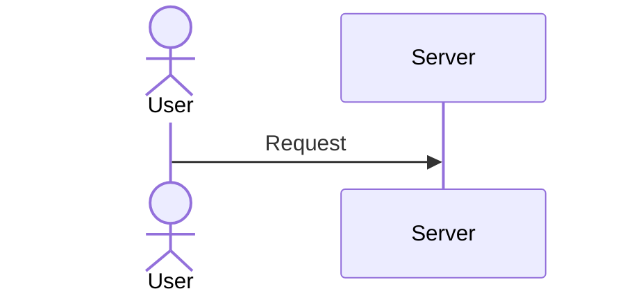

# Blog Post Authoring Guidelines (for AI agents)

This repo is an Astro blog. New posts live in `src/content/blog/*.mdx` and are validated by the schema in `src/content.config.ts`.

The goal of this document is to help you write posts that match the existing house style: practical, structured, engineering-focused, with a personal voice and lots of concrete examples.

## 1) Where and how to create a post

- **Location**: create a new `*.mdx` file under `src/content/blog/`.
- **Filename/slug**: use `kebab-case` (lowercase + hyphens). Keep it readable; avoid filler words when possible.
- **No duplicate H1**: do not add `# Title` in the body; the layout renders the title from frontmatter.

## 2) Frontmatter (required + optional)

Frontmatter must be valid YAML and match the blog collection schema.

### Required fields

```yaml
---
title: "Clear, descriptive title"
description: "1–2 sentences: what the reader will learn and why it matters."
pubDate: "2025-12-18"
published: true
tags: ["tag-one", "tag-two", "tag-three"]
---
```

- `title` (string): Title Case is preferred; keep it explicit and searchable.
- `description` (string): Written for humans; avoid keyword stuffing.
- `pubDate` (date-like string): `z.coerce.date()` accepts multiple formats, but **use ISO** `YYYY-MM-DD` for consistency.
- `published` (boolean): use `true` for new posts.
- `tags` (string[]): required by convention for new posts (schema allows it to be optional, but don’t omit it).

### Optional fields (use when relevant)

```yaml
---
shortDescription: "Shorter OG-friendly description (optional)."
updatedDate: "2025-12-18" # set when substantially updating an old post

disableComments: false # omit unless you need to disable
disableLikes: false    # omit unless you need to disable

# Hero/OG image controls (most posts don’t need these)
heroImage: "/src/assets/posts/<slug>/hero.png"
hideHero: false
noImage: false
useHeroAsOGImage: false
noTextInOGImage: false
---
```

Notes:
- `heroImage` must point to a file under `/src/assets/` and must start with `/src/assets/`.
- Prefer omitting optional booleans unless you intentionally want to change behavior.

## 3) Voice, tone, and “house style”

- **Language**: English.
- **Tone**: technical but accessible; explain jargon when you introduce it.
- **Personal voice**: include lived experience when it adds clarity (“In my experience…”, “For me…”, “What I usually do…”).
- **Reader empathy**: assume the reader is busy; optimize for fast scanning and predictable structure.
- **Actionable by default**: prefer step-by-step instructions, commands, expected outcomes, and trade-offs.

## 4) Recommended post shapes (pick one)

### A) “How to” / tutorial (hands-on)

Use this shape when the reader should be able to follow along and reproduce results.

Suggested outline:

- Short introduction (2–3 paragraphs): problem → why it matters → what we’ll do.
- `## Requirements` (versions, OS notes, accounts, prerequisites).
- `## Step 1: ...`, `## Step 2: ...` (small steps; each ends with “what you should see”).
- `## Troubleshooting` (common errors + fixes).
- `## Conclusion` (short recap + next step).
- `## References` (docs links for tools used).

### B) “Understanding X” / conceptual (mental model + trade-offs)

Use this shape when you’re teaching concepts, architecture, or decision-making.

Suggested outline:

- Short introduction (2–3 paragraphs): motivation + what you’ll learn.
- `## A mental model` (how to think about it).
- `## How it works` (diagrams welcomed).
- `## Trade-offs at a glance` (prefer a table).
- `## Pitfalls to watch for` (practical gotchas).
- `## Conclusion` (what to remember).
- `## References` (docs/links when applicable).

### C) Short note / opinion (personal + practical)

Use this shape when you’re sharing an experience, a lesson learned, or a strong opinion.

Suggested outline:

- Short introduction (personal context + tension/problem).
- `## What I noticed` (observations).
- `## What I do now` (habits/process).
- `## Conclusion` (one-paragraph takeaway).

## 5) Markdown/MDX conventions used in this repo

### Headings

- Use `##` for main sections, `###` for subsections.
- For step-by-step posts, prefer `## Step N: ...` headings.

### Code blocks

- Always set the language: `sh`, `bash`, `typescript`, `javascript`, `python`, `yml`, `json`, etc.
- Prefer showing code that is runnable/copy-pastable.
- Use file labels when it helps:

```yml title=".github/dependabot.yml"
version: 2
```

This repo also supports line highlighting patterns you’ll see in older posts:
- Fence options like `ins={3,4}` (highlight specific lines).
- Inline markers like `// [!code highlight]` when demonstrating diffs or important config.

### Diagrams and tables

- Use Mermaid when explaining flows or architecture:



- Use tables for comparisons (trade-offs, decision matrices).

### Links

- Prefer official docs for references.
- Cross-link internal content when relevant:
  - Posts: `/posts/<slug>/`
  - Tags: `/tags/<tag>/`

## 6) Safety, legality, and disclaimers (security/hacking posts)

If the post covers cracking, exploitation, or offensive security:

- Add a short disclaimer near the top (“educational purposes only”, “only on networks/systems you own or have permission to test”).
- Avoid instructions that meaningfully increase real-world harm without a defensive framing.

## 7) Quality checklist (before you consider it “done”)

- Frontmatter validates: required keys present; `pubDate` is ISO; `published: true`; `tags` has 3–7 items.
- The introduction answers: **what**, **why**, **who this is for**, and **what you’ll do/learn**.
- Commands are explicit (paths, filenames, placeholders) and use `sh` fences.
- Long posts include `## Conclusion`. Posts that rely on external material include `## References`.
- Tag names are consistent (no typos, no random singular/plural changes).

## 8) Tags (use existing ones first)

Tags are free-form strings, but consistency is what makes tag pages useful. Prefer existing tags from the repository before introducing a new one.

Common existing tags (sample, not exhaustive):

- **AI/LLMs**: `llm`, `ai-engineering`, `ai-agents`, `ollama`, `langchain`, `langgraph`, `machine-learning`, `rag`
- **Web/Frontend**: `javascript`, `typescript`, `react`, `nextjs`, `frontend`, `ssr`, `performance`, `web`, `architecture`, `caching`
- **Tooling/DevOps**: `github-actions`, `devops`, `dependency-management`, `monorepos`, `pnpm`, `npm`, `yarn`, `docker`, `automation`
- **Hardware/Security**: `raspberry-pi`, `hardware`, `iot`, `maker`, `security`, `hacking`, `privacy`, `self-hosting`
- **Career/Collaboration**: `engineering-practices`, `collaboration`, `pair-programming`, `productivity`, `software-engineering`, `learning`
