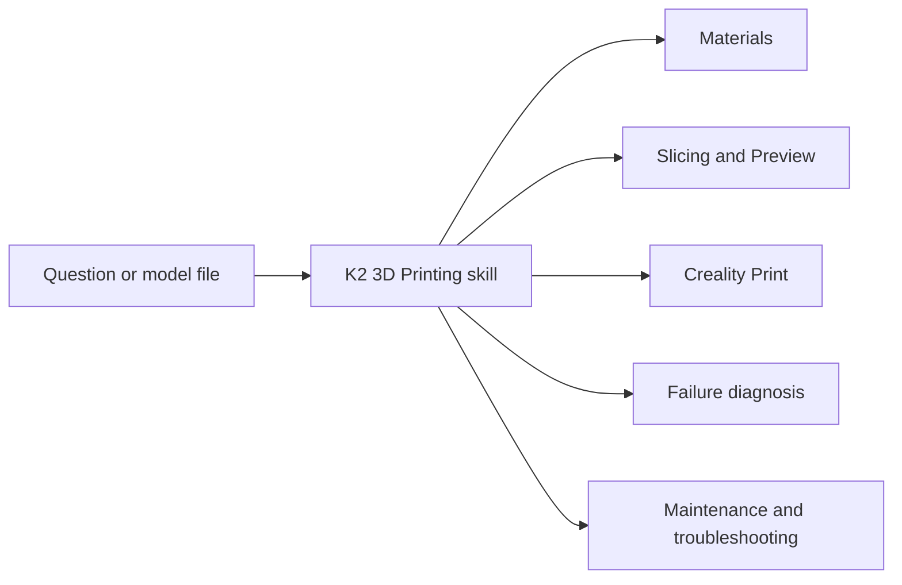

After realizing my dream of buying a 3D printer since 2011 getting the [Creality K2 Combo](https://link.amazon/B0hk9SsEf), I wanted to start printing as soon as possible. I was excited to make things for my home and gifts for my friends, but first I had to understand how to prepare each model for my printer.

What kind of files download, which slicer settings to use, how to choose a filament, and how to troubleshoot a failed print were all questions I had to answer before I could start printing.

That is how I ended up creating [K2 3D Printing Skill](https://github.com/woliveiras/k2-3d-printing-skill), an Agent Skill that gives my AI agent structured knowledge about the Creality K2 family, Creality Print, filaments, slicing, troubleshooting, and maintenance.

It does not print things for me, and it does not replace the tests I need to run with the real printer. What it does is help me move from a question to a better-informed experiment without researching the same subject from scratch every time.

## How it all started

My first step into 3D printing was downloading models from [MakerWorld](https://makerworld.com/), [Creality Cloud](https://www.crealitycloud.com/), and [Printables](https://www.printables.com/). Well, the real first step was printing the hello world of the 3D printing world: the Benchy. But after that, I wanted to print more useful objects.

In practice, many of the models I wanted to print had been prepared and tested with Bambu Lab printers and slicer profiles. Finding a good model did not mean I could open it in Creality Print and use every original setting unchanged.

I had to learn which settings belonged to the model, which belonged to the original printer profile, and which needed to be reconsidered for my K2, nozzle, build plate, filament, and desired result. Orientation, supports, layer height, wall count, infill, speed, temperature, and material compatibility could all affect the print.

None of this is impossibly complicated. The problem was that I did not want to spend hours watching YouTube videos before every experiment. I was anxious to see the printer working and wanted to learn while printing real objects.

As I have been doing with many subjects I am learning, I turned to Codex to skip some of the searching and focus on learning during practice.

## From project memory to an Agent Skill

Initially, I created a project in Codex and kept my 3D printing conversations there. The project gradually accumulated useful context: which printer I owned, which filaments I had available, which software I used, and what kind of results I preferred.

This already made the conversations better. I did not need to explain my entire setup every time I had a question.

But project memory and a knowledge base solve different problems. Memory preserves facts about my setup and previous conversations. A knowledge base gives the agent a repeatable method for investigating a model, checking material compatibility, recommending slicing decisions, or diagnosing a failed print.

I wanted that method to be portable instead of trapped inside one project, so I turned it into an Agent Skill.

An Agent Skill is a set of instructions, references, and optional tools that an AI agent can load when a task matches its purpose. Instead of putting everything into every conversation, the skill tells the agent what to inspect, which references to load, what questions matter, and where it must stop because physical validation is still required.

## Deciding what support I needed

I started by asking Codex to interview me about the support I expected from the agent. My initial requirements were practical:

- I need to understand how to handle different materials.
- I need help with preventive printer maintenance.
- I need a troubleshooting process for print failures and printer symptoms.
- I do not want to learn 3D modeling yet. I want to download existing models and prepare them for my printer.
- I want to balance speed and filament use while keeping acceptable quality.
- I need help finding settings in Creality Print and understanding what they change.
- I want the agent to explain trade-offs instead of giving me unexplained numbers.

These answers defined the scope. The skill would help with FDM printing decisions around existing models, but it would not pretend to be a complete course on 3D modeling or automatically operate the printer.

I then defined the sources the agent should use. Official Creality manuals, service documentation, product information, and Creality Print resources should take priority. Filament recommendations should be checked against information for the exact material whenever possible. Community posts and public discussions could help identify a hypothesis, but they should not be treated as proof that the same setting would work with my printer and material.

This distinction matters because 3D printing advice is full of specific values presented without enough context. A temperature, speed, or maintenance procedure may be correct for one printer, hotend, nozzle, material formulation, or software version and wrong for another.

## Building a knowledge base that loads on demand

The final skill does not place the complete research library into every conversation. Its main instructions work as a router: they identify the task and load only the references needed for it.



The reference library is separated into subjects such as:

- printer identity and differences across the K2 family;
- filament families and compatibility;
- STL, STEP, 3MF, and G-code inspection;
- orientation, supports, quality, speed, strength, and filament use;
- Creality Print screens and settings;
- calibration and Preview inspection;
- failure diagnosis;
- preventive maintenance and symptom-based troubleshooting;
- safety and evidence boundaries.

The skill also includes optional read-only tools for inspecting 3MF projects and extracting or comparing embedded settings. These tools can help the agent understand an artifact, but they do not modify the original file or send anything to the printer.

This structure was more useful than simply collecting as much information as possible. The goal became giving the agent enough reliable information and a method for finding the right part when a question appears.

## What the skill can help with

The skill supports the parts of 3D printing where I was losing time moving between model pages, documentation, videos, Creality Print, and disconnected conversations.

It can help me:

- inspect downloaded STL, STEP, 3MF, and G-code files within the limits of each format;
- identify settings inherited from another printer or slicer profile;
- choose a filament based on the printer, nozzle, plate, enclosure, CFS path, and part requirements;
- decide how to orient a model and where supports may be necessary;
- balance visible finish, print time, strength, material use, and support removal;
- find and understand relevant controls in Creality Print;
- review the sliced Preview layer by layer before printing;
- calibrate one relevant factor at a time;
- diagnose a failed print before changing several settings at once;
- find model-specific preventive maintenance and troubleshooting procedures.

The useful part is not receiving a supposedly perfect profile. It is having an agent that asks for the information that changes the decision: the exact printer, installed nozzle, build plate, material, visible surfaces, expected strength, dimensional requirements, time budget, and tolerance for supports.

## Installing the skill

If you got interested in using the skill, you can install it in your own agent.

You can install the skill with the [skills CLI](https://www.skills.sh/docs/cli). Just run the following command in your terminal:

```sh
npx skills add woliveiras/k2-3d-printing-skill
```

The skill is self-contained. It does not require a paid service or a connection to your printer. Its optional file-inspection tools require Python 3.10 or newer, but the instructions and reference library can be used without them.

After installation, an agent that supports Agent Skills can load it when your request mentions the Creality K2 family, Creality Print, FDM files, filament, slicing, supports, calibration, print failures, or maintenance.

## Examples of using it

The agent can provide better help when the message contains the physical setup, the artifact, and the result you care about. These are some examples I can use with the skill.

### Adapting a downloaded model

```text
I downloaded this 3MF, but it was prepared for a Bambu Lab printer.

I have a Creality K2 Combo with a [nozzle size] nozzle, [build plate], and [exact filament]. Inspect the file without modifying it and tell me what must be reconsidered before I slice it in Creality Print.
```

This asks the agent to separate information stored in the project from assumptions about the printer that originally created it.

### Choosing orientation and supports

```text
Help me choose the orientation and supports for this STL. The front is the most visible surface. I prefer easier support removal over the shortest possible print time, and the part will not carry a mechanical load.
```

The visible face, purpose, and acceptable trade-off are more useful than asking for the "best orientation" without context.

### Balancing quality, time, and filament

```text
I want to print this model as a gift using [exact filament]. Help me reduce print time and filament use while preserving an acceptable finish on the visible surfaces. Explain which changes are low risk and which require a small test print.
```

This gives the agent an objective instead of asking it to make every setting faster.

### Investigating a failed print

```text
This PETG print has stringing and marks on the surface. I attached photos, the 3MF project, and screenshots of the filament and process settings.
Diagnose the likely causes before recommending changes. Ask only for missing information that would change the diagnosis, and do not change several parameters at the same time.
```

The skill follows a diagnosis-first workflow so one experiment can teach me something. If I change temperature, retraction, speed, cooling, and filament drying at once, I may improve the print without learning which change mattered.

### Reviewing Creality Print Preview

```text
Review these Creality Print Preview screenshots before I print. Tell me what you can verify from the visible legend and layers, what views are still missing, and which possible problems I should inspect manually.
```

The wording is intentional: a screenshot may support a Preview review, but it cannot prove that the physical print will succeed.

### Planning preventive maintenance

```text
Help me create a preventive maintenance checklist for my exact Creality K2 model and CFS. Separate official procedures and intervals from recommendations that depend on hours of use, materials, environment, or visible wear.
```

For maintenance, the exact physical model matters. A slicer profile is not enough evidence to identify hardware or apply a model-specific repair procedure.

## What changed in practice

Before creating the skill, each new model could open a new research path: search for a video, compare comments, find the corresponding Creality Print option, and try to understand whether advice for another machine applied to mine.

Now I can start with the model and the result I want. The agent helps me identify the relevant variables, find the appropriate reference, and design a smaller experiment. I still need to inspect the Preview, run the print, observe the result, and sometimes fail.

That is exactly the kind of learning I wanted. The agent removes part of the search overhead, but the printer remains the place where the hypothesis meets the plastic.

## References

- [K2 3D Printing Agent Skill](https://github.com/woliveiras/k2-3d-printing-skill)
- [MakerWorld](https://makerworld.com/)
- [Creality Cloud](https://www.crealitycloud.com/)
- [Printables](https://www.printables.com/)
- [Creality Support Wiki](https://wiki.creality.com/)
- [skills CLI documentation](https://www.skills.sh/docs/cli)
