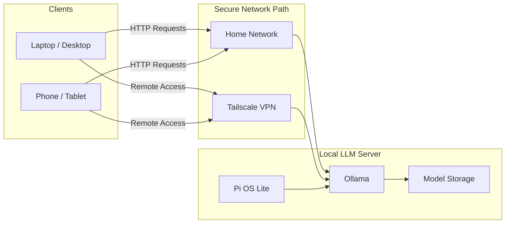

## Introduction

The rapid evolution of artificial intelligence has brought astonishing capabilities to everyday users, but it has also introduced a dilemma that grows clearer each month. The most powerful tools are often locked behind expensive subscription plans, and even the cheaper tiers are filled with hidden constraints. Someone who subscribes to an “affordable” monthly AI plan quickly discovers that the real cost is not the price on the homepage, but the interruptions that occur when request limits are exhausted, the throttling that appears during peak hours, and the frustrating moments when the system refuses to answer because the provider has decided that a specific question is unsafe, unaligned, or outside the product’s intended use.

Beyond those limitations lies the largest issue of all: privacy. Every time someone sends a prompt to a proprietary AI provider, their data is transferred through servers that they do not control. Although companies claim various degrees of compliance and protection, users must ultimately trust that these systems behave ethically and securely. For individuals who handle documents, personal journals, health information, research prototypes, or early-stage business ideas, this model introduces a real risk. Even if the content is supposedly not stored, the fact remains that it leaves the boundaries of the user’s local environment.

Running large language models locally removes this uncertainty. A user who hosts their own inference engine is not subject to usage limits or silent data collection. They do not worry about throttling and do not fear handing sensitive content to third parties. Instead, they gain sovereignty, operational continuity, predictable cost, and freedom from censorship, filtering, or service outages. Local models may not yet reach the capabilities of the largest frontier systems, but recent research shows that smaller models are improving rapidly and that quantization techniques allow them to run efficiently on hardware that costs less than a monthly subscription to commercial AI tools.

This article is a hands-on tutorial for building a private, low-cost, always-available LLM server using a Raspberry Pi 5, the Ollama inference engine, Tailscale for secure remote access, and Chatbox as a desktop/mobile client. You will go from an empty microSD card to a fully working server that you can reach from your laptop or phone, even when you are outside your home network.

The tutorial is designed for readers with no background in hardware or software engineering. Each step includes the exact commands to run, followed by short explanations that connect practice to theory. If you prefer to skip the background explanations, you can follow only the numbered steps and still complete the setup successfully.

## What You Will Build

By the end, you will have:

- A headless Raspberry Pi 5 configured as an always-on LLM server.
- Ollama running on the Pi, exposing an HTTP API on port `11434`.
- A small, efficient LLM (for example, Llama 3.2 3B or Qwen 2.5 1.5B) downloaded and ready to use.
- Tailscale providing secure remote access to the server from your other devices.
- Chatbox configured on your laptop or phone to connect to the Ollama server.

You will be able to:

- SSH into the Pi to administer the server.
- Run `ollama run` directly on the Pi.
- Point desktop or mobile clients to `http://<pi-address>:11434` over your local network or Tailscale.

## Requirements

Hardware:

- Raspberry Pi 5 ([Pi 5 4 GB](https://amzn.to/3XkxnRg) works, [Pi 5 8 GB](https://amzn.to/3XNcLBd) strongly recommended, [Pi 5 16GB](https://amzn.to/4rgdNn7) is awesome).
- Official [Raspberry Pi 27W USB-C power supply](https://amzn.to/4oYvh5A) (or a 5V/5A supply that is known to be stable).
- Active cooler (for example, the official [Raspberry Pi 5 Active Cooler](https://amzn.to/3K8YnQM)).
- 64 GB or larger microSD card, I recommend [Sandisk Extreme 64GB](https://amzn.to/49yxNea) or [SanDisk Extreme PRO 64GB](https://amzn.to/47ZDReu).
- Optional but recommended: [NVMe SSD](https://amzn.to/4il0E7T) and a [HAT](https://amzn.to/4814BLD) for faster model loading.
- If you can buy an upgrade, you can check the [Raspberry Pi 5 Kit AI Hat+](https://amzn.to/48iTRqW)
- Another computer (Linux, macOS, or Windows) on the same network for initial configuration.

Software and accounts:

- [Raspberry Pi Imager](https://www.raspberrypi.com/software/) installed on your computer.
- A free [Tailscale](https://tailscale.com/) account. You can also check the [Cloudflare Zero Trust](https://www.cloudflare.com/zero-trust/) as an alternative, but it'll not be covered in this tutorial.
- An internet connection for downloading software and models.
- Basic familiarity with a terminal and SSH (copying and pasting commands is enough).

If you want to understand why each hardware choice matters, you can read the background sections such as **“Why Raspberry Pi 5 (BCM2712) Matters”**. If you just want to build the server, start with **“Step 1 – Prepare Raspberry Pi OS Lite”** and follow the steps in order.

## Step 0 – Architectural Overview

Before configuring the system, it is important to visualize how all components work together. The Raspberry Pi 5 runs a lightweight operating system and hosts the Ollama inference server. Users connect from their laptop or phone over the home network or, if they are outside the house, through Tailscale, which creates a secure encrypted tunnel. Every request stays inside the user’s infrastructure. No cloud API keys, no external dependencies, and no data leakage.



The architecture deliberately separates responsibility between computation, networking, and user interaction. The Raspberry Pi 5 acts as a stable, always-on inference node that consumes little power but is powerful enough to run compact models efficiently. Ollama abstracts the complexity of model loading, quantization, and execution. Tailscale allows users to reach the server securely without exposing it to the internet. This design eliminates the need for reverse proxies, port forwarding, or cloud servers. Everything remains inside a secure mesh network that is private to the user.

## Background: Raspberry Pi 5 And BCM2712

The Raspberry Pi 5 introduces the Broadcom BCM2712 system-on-chip (SoC), featuring Cortex-A76 CPU cores. This represents a substantial architectural upgrade, as the Cortex-A76 delivers markedly higher performance for the types of linear-algebra operations used during LLM inference. In contrast, previous boards such as the Raspberry Pi 4 relied on Cortex-A72 cores, which are significantly older and offer lower IPC, weaker branch prediction, and less capable NEON units. They are functional, but not powerful enough to handle transformer inference efficiently.

The new Cortex-A76 cores run at 2.4 GHz and implement the ARMv8.2-A architecture, which brings improved floating-point performance, larger buffers, and enhanced NEON vector capabilities. These improvements reduce the latency of the initial computation phase, a key contributor to Time-to-First-Token (TTFT). The updated microarchitecture also incorporates a deeper out-of-order execution pipeline, larger reorder buffers, and more advanced branch prediction, all of which help sustain consistent throughput during the prefill stage of inference.

## Execution Pipeline and Branch Prediction Explained Simply

The processor inside the Raspberry Pi 5 can be imagined as a team of workers preparing ingredients for a meal. In the Cortex-A72 era, this team could only begin a limited number of tasks at the same time, forcing them to wait for earlier steps to finish before starting new ones. The Cortex-A76, by contrast, allows many tasks to begin concurrently and can even anticipate which tasks will be needed next. When its predictions are correct, overall performance increases significantly.

For LLM workloads, this anticipation is important because the model executes repeated, large matrix multiplications. More accurate predictions keep the CPU pipeline filled and ensure that data continues flowing without unnecessary stalls, resulting in faster and more stable text generation.

## The Von Neumann Bottleneck and Memory Bandwidth

While CPU frequency does matter, LLM inference on CPUs is primarily memory-bandwidth bound. During token generation, the model must stream large portions of its weight matrices from RAM, and these weights are far too large to fit in cache. As a result, the system spends more time transferring data than performing arithmetic operations — a classic manifestation of the Von Neumann bottleneck.

The Raspberry Pi 5 alleviates this issue thanks to its LPDDR4X-4267 memory, which offers significantly higher bandwidth compared to the Pi 4’s LPDDR4-3200. During inference, the CPU’s vector units repeatedly consume large contiguous blocks of model data, so faster memory directly reduces stall time. Combined with the Pi 5’s newer Cortex-A76 cores, this improved bandwidth is a major reason it can achieve 5–10 tokens per second with well-optimized, quantized models, whereas the Pi 4 often struggled to exceed 1–2 tokens per second.

## Thermodynamics, Active Cooling, and Thermal Throttling

Even though the Raspberry Pi 5 is energy-efficient, running LLMs causes sustained 100% CPU load across all cores. When the chip heats up, it begins to throttle to protect itself. Throttling means reducing clock speeds and performance. Without adequate cooling, the speed of inference drops dramatically, sometimes falling below one token per second. The official Active Cooler prevents this by combining a heatsink with a small PWM-controlled fan. The operating system automatically adjusts fan speed to maintain safe temperatures, allowing the Pi to operate at maximum frequency for long periods. For LLM workloads, active cooling is not optional; it is essential.

## Power Engineering and USB-PD Stability

The Raspberry Pi 5 operates with a specific power requirement: 5V at up to 5A. Many USB-C power adapters can deliver high wattage, but only at higher negotiated voltages such as 9V or 12V—voltages the Pi does not use. If the power supply cannot provide sufficient current at 5V, the Pi may enter a reduced-performance power mode, limiting USB port output and preventing the CPU from maintaining its turbo frequencies. Under heavy workloads, this can manifest as random reboots, SD card or SSD I/O errors, throttling, or unstable LLM inference.

The official 27W USB-C power supply avoids these issues by guaranteeing proper 5V/5A delivery and correct USB-C power negotiation, ensuring full system stability even under sustained peak load.

## Storage Hierarchy: microSD vs. NVMe

Running the system from a microSD card is acceptable for basic usage, but LLM models are large files and can be slow to load from microSD storage. Depending on the model’s size and quantization, loading it into memory may take several seconds or even minutes. The Raspberry Pi 5 exposes a PCIe interface that can be paired with an NVMe HAT, providing access to significantly faster storage. NVMe drives can sustain read speeds in the hundreds of megabytes per second, reducing model load times and minimizing latency when the system needs to access data beyond available RAM. A microSD card is perfectly adequate for the operating system, but for any serious LLM workload, an NVMe drive is the clearly superior option.

Now, that you understand the hardware choices, it is time to build the system!

## Step 1 – Prepare Raspberry Pi OS Lite

Transforming the Raspberry Pi 5 into a headless server begins with installing Raspberry Pi OS Lite. This variant excludes the graphical desktop environment, meaning it frees significant RAM and CPU time for the LLM.

First of all, if you have not already, download and install Raspberry Pi Imager on your computer from [here](https://www.raspberrypi.com/software/).

Next, prepare the operating system image. You have two safe options:

- Flash the OS directly to your NVMe/SATA SSD using a USB adapter (fast and simple). See recommended adapters above.
- Or flash a microSD card and, after first-boot and initial configuration, migrate the installed system from the microSD to the SSD attached to the Pi (recommended when you don't have an adapter).

Both approaches work; the remainder of this section explains how to flash with Raspberry Pi Imager and then how to migrate the running system from a microSD to the SSD using Klon, my automated migration tool for Raspberry Pi and HDD/SSD.

Flash the image with Raspberry Pi Imager (macOS / Windows / Linux)

1. Download and open Raspberry Pi Imager: https://www.raspberrypi.com/software/
2. Choose OS: `Raspberry Pi OS Lite (64-bit)` (or another image you prefer).
3. Choose Storage: select the target device (your microSD card or SSD if you have a USB adapter). **Double-check** the selected device — this will overwrite it.
4. (Optional) Click the gear icon for Advanced Options to enable SSH, set hostname, create a user, or preconfigure Wi‑Fi.
5. Click Write and wait for the image to finish.

If you wrote the image to the SSD with an adapter, install the SSD in the Pi (NVMe HAT or adapter), remove any microSD, and power the Pi — it should boot from the SSD.

If you do not have an adapter, follow the microSD → SSD migration steps below.

Migrate from microSD to SSD on the Raspberry Pi (two options)

Prerequisites: boot the Pi from the freshly-flashed microSD, complete basic configuration (hostname, user, enable SSH), attach the SSD to the Pi via your HAT/adapter, and make sure the Pi detects the drive.

Check devices and note names:

```bash
lsblk
sudo fdisk -l
```

Identify the SSD device (example: `/dev/nvme0n1` or `/dev/sda`). Be careful and choose the correct device.

1. Install and run `Klon` to copy the system from the SD to the SSD, and just follow the Klon instructions:
```bash
# Install dependencies
sudo apt-get update
sudo apt-get install -y curl tar gzip dpkg make git golang

# Clone and run Klon
cd ~
git clone https://github.com/woliveiras/Klon.git
cd Klon
sudo go run .
```

2. Wait for the clone to finish. When done, power off the Pi, remove the microSD, and boot from the SSD.

Important safety notes

- Always double-check device names with `lsblk` before writing or cloning. A wrong device will overwrite data irreversibly.
- If the SSD disconnects during cloning, it may be an adapter/power issue; use a powered USB hub or ensure the HAT supplies sufficient power.
- On older Pi models you may need to update the bootloader (EEPROM) to enable USB/NVMe boot; on Pi 5 with a compatible HAT it should boot without extra steps.

To connect via SSH from your computer, use the following command (replace `your-user` with the username you set during flashing):

```bash
ssh your-user@raspberrypi.local
```

If this does not work, you can find the Pi’s local IP address from your router’s admin interface or use a network scanning tool like `nmap` or `arp`.

Now you can update the system packages:

```bash
sudo apt update && sudo apt upgrade -y
```

Restart to finish the upgrade:

```bash
sudo reboot
```

And install essential dependencies:

```bash
sudo apt install -y curl git wget vim htop
```

## Step 2 – Connect the Pi to Tailscale

The next component of the architecture is secure network access. Many home networks use NAT, which prevents outside devices from reaching local machines unless port forwarding is configured. Tailscale avoids these complexities entirely by creating a private encrypted network between your devices using WireGuard.

On the Raspberry Pi, install Tailscale:

```bash
curl -fsSL https://tailscale.com/install.sh | sh
```

Then bring the Pi into your Tailnet:

```bash
sudo tailscale up
```

Tailscale will print a URL. Open it in a browser on your laptop or phone, sign in with your Tailscale account, and approve the new device.

After that, your Pi will have a stable Tailscale IP address and a hostname like `<pi-name>.jucaru-pirarucu.ts.net`. Any device logged into the same Tailnet can reach the Pi securely from anywhere in the world, without exposing ports or touching your router configuration.

You can check the Pi’s Tailscale status with:

```bash
tailscale status
```

## Step 3 – Install and Configure Ollama

Ollama simplifies running local LLMs by managing model downloads, quantization formats, memory allocation, tokenization, and inference execution. It abstracts the underlying `llama.cpp` engine and exposes a clean REST API.

On the Raspberry Pi, install Ollama:

```bash
curl -fsSL https://ollama.com/install.sh | sh
```

This script detects the ARM64 architecture and installs the correct binary.

Check if Ollama is installed correctly:

```bash
ollama --version
```

After installation, Ollama registers a systemd service (usually `ollama.service`) so it automatically starts at boot on systemd-based Linux distributions (like our Raspberry Pi OS).

Quick verification commands:

```bash
# Check if the service is running
sudo systemctl status ollama

# Enable the service to start at boot
sudo systemctl enable --now ollama

# Reload + restart (if you edit unit/override)
sudo systemctl daemon-reload && sudo systemctl restart ollama

# Confirm port listening
ss -tulnp | grep 11434 # or sudo ss -tulnp | grep 11434

```

If the service is not present, you can create an override with:

```bash
sudo systemctl edit ollama.service
```

In the editor that opens, add:

```ini
[Service]
Environment="OLLAMA_HOST=0.0.0.0:11434"
Environment="OLLAMA_ORIGINS=*"
```

Save and exit, then reload systemd and restart Ollama:

```bash
sudo systemctl daemon-reload && sudo systemctl restart ollama
```

At this point, the Ollama server should be reachable on:

- `http://<pi-name>.:11434` from your home network.
- `http://<pi-tailscale-ip>:11434` or `http://<tailscale-hostname>:11434` from any device in your Tailnet.

## Step 4 – Download a Model and Test Locally

Running language models on small devices requires paying attention to memory usage. Models must be **quantized** in order to fit into the Raspberry Pi’s available RAM. For an 8 GB Raspberry Pi 5, a good starting point is a 1–3B parameter model, for an 16 GB Pi, you can try 3–7B models.

I'll use some of the compact models available in Ollama’s model registry, but you can explore other options as well.

My recommendation for selecting a model is to start with something small and responsive, then gradually try larger models as you gain confidence.

On the Pi, pull a compact model:

```bash
ollama pull llama3.2:3b # 2.0GB size, 128K context, good balance of speed and capability
```

After the download finishes, run the model directly in your SSH session for testing it:

```bash
ollama run llama3.2:3b
```

Type a prompt such as “Explain what you are running on” and press Enter. When you are done, exit with sending `/bye` or pressing `Ctrl + d`.

To observe performance, enable verbose mode:

```bash
ollama run llama3.2:3b --verbose
```

You will see detailed logs about token generation speed, like this:

```plaintext
total duration:       6.275722542s
load duration:        74.517583ms
prompt eval count:    174 token(s)
prompt eval duration: 145.824458ms
prompt eval rate:     1193.22 tokens/s
eval count:           353 token(s)
eval duration:        4.300010242s
eval rate:            82.09 tokens/s
```

Below is a short explanation of each metric so you know what to look for:

| Metric | Meaning |
| --- | --- |
| `total duration` | Total wall-clock time for the whole request from start to finish, including model load, prompt processing, generation, and small overheads. |
| `load duration` | Time spent loading the model into memory or fetching any cached model artifacts for this run. |
| `prompt eval count` | Number of tokens in the input prompt that the model evaluated before starting generation. |
| `prompt eval duration` | Time taken to process/evaluate the input prompt (tokenization + forward pass for the context). |
| `prompt eval rate` | Speed for prompt processing, calculated as `prompt tokens / prompt eval duration` (tokens per second). |
| `eval count` | Number of tokens generated (or evaluated) during the model's output/generation phase. |
| `eval duration` | Time spent producing the generated tokens (the sequential generation phase). |
| `eval rate` | Generation speed calculated as `eval tokens / eval duration` (tokens per second); this is the most relevant number for interactive latency. |

On a Raspberry Pi 5, measured tokens-per-second vary by model and quantization. The table below shows results reported in the article "How Well Do LLMs Perform on a Raspberry Pi 5?" (StratosphereIPS, June 5 2025):

| Model | Quantization | Disk Size (MB) | RAM Size (MB) | Tokens/Second |
| --- | --- | ---: | ---: | ---: |
| qwen2.5:3b | Q4_K_M | 1840.5 | 3025.9 | 5.20 |
| llama3.2:1b-instruct-q4_K_M | Q4_K_M | 770.3 | 2415.8 | 11.22 |
| smalllm2:1.7b-instruct-q4_K_M | Q4_K_M | 1006.7 | 5318.2 | 8.23 |
| granite3.1-dense:2b | Q4_K_M | 1497.0 | 3697.7 | 5.81 |
| llama3.2:3b | Q4_K_M | 1925.8 | 4659.3 | 4.69 |
| qwen2.5:1.5b | Q4_K_M | 940.4 | 1849.3 | 9.97 |
| gemma3:1b | Q4_K_M | 777.5 | 1393.8 | 11.53 |
| bitnet-b1.58-2B-4T | Q1.5 | 1200.0 | 1500.0 | 8.13 |

Source: "How Well Do LLMs Perform on a Raspberry Pi 5?" — https://www.stratosphereips.org/blog/2025/6/5/how-well-do-llms-perform-on-a-raspberry-pi-5

Note: these measured tokens/sec values were obtained under the conditions described in the article; your results will vary with model build, quantization, storage, power, cooling, and runtime options.

## Step 5 – Connect from Your Laptop or Phone using Chatbox

Once the server is configured, you can interact with it from other devices.

Let's do some basic tests using `curl` from another machine on your home network or Tailnet.

To list installed models and their details:

```bash
curl http://<pi-address>:11434/api/tags
```

You should see a JSON list of installed models.

To run a simple completion over HTTP:

```bash
curl http://<pi-address>:11434/api/generate \
  -d '{
    "model": "llama3.2:3b",
    "prompt": "Write one sentence about Raspberry Pi 5."
  }'
```

For graphical clients (for example, Chatbox or desktop apps that support Ollama-compatible APIs), point them to:

- Host: `http://<pi-address>:11434`
- Model name: whatever you downloaded (for example, `llama3.2:3b`).

I **strongly recommend** using Chatbox (https://chatbox.com/) as a free, open-source desktop client that works well with Ollama servers and most of the popular LLM offers.

Chatbox is available for Windows, macOS, and Linux, iOS and Android!

After installing it, just go to `Settings` → `Model Providers` → find `Ollama` and add the server information. Use the Pi’s local IP address or Tailscale hostname as needed.

To get the local IP address of your Pi, run:

```bash
ifconfig | grep -E 'inet ' | grep -v 127.0.0.1 | awk '{print $2}'
```

The result will be something like `192.168.x.xx`.

Remember to add `http://` and the port `:11434` when configuring Chatbox. Example: `http://192.168.x.xx:11434`.

Then click on `Fetch` to load the available models. Select the models you want to use with Chatbox, and you are ready to chat!

If you are away from home, use the Pi’s Tailscale address or hostname instead of the local IP. As long as both devices are in the same Tailnet, your traffic will be encrypted end-to-end over WireGuard.

You can create two different configurations in Chatbox: one for local network access and another for Tailscale access. This way, you can switch between them depending on your location.

In this configuration, the Raspberry Pi acts as a central AI node that can be accessed from laptops, phones, tablets, or other devices regardless of location, while ensuring complete privacy.

## Conclusion

Building a private LLM server with a Raspberry Pi 5, Ollama, and Tailscale, using Chatbox as a client, offers a compelling alternative to commercial AI services. The user gains predictable costs, avoids subscription tiers and hidden limits, and protects their data from external servers. Recent advances in ARM architecture, model quantization, and software optimization make it possible to achieve smooth, responsive inference on hardware that fits in the palm of a hand and consumes less power than a light bulb.

The Raspberry Pi 5’s improved processor, higher memory bandwidth, active cooling options, and stable power design allow it to handle workloads that were impossible on earlier generations. Combined with the simplicity of Ollama and the security of Tailscale, it forms a robust, reliable platform for personal AI experimentation, automation, learning, and private communication. Chatbox provides a user-friendly interface that makes interacting with local models straightforward, whether on desktop or mobile.

This architecture is not meant to compete with frontier-scale models running in vast data centers. Instead, it serves as a personal computing tool—one that belongs fully to the user. As small models continue to improve and hardware becomes more efficient, the power of local AI will only increase. For those who value autonomy, privacy, and the ability to truly own their tools, the future of local AI is bright.

## References

- Raspberry Pi 5 Official Product Page: https://www.raspberrypi.com/products/raspberry-pi-5/
- Raspberry Pi Imager Software: https://www.raspberrypi.com/software/
- Klon GitHub Repository: https://github.com/woliveiras/Klon
- Ollama Official Website: https://ollama.com/
- Tailscale Official Website: https://tailscale.com/
- Chatbox Official Website: https://chatboxai.app/
- How Well Do LLMs Perform on a Raspberry Pi 5?: https://www.stratosphereips.org/blog/2025/6/5/how-well-do-llms-perform-on-a-raspberry-pi-5
- Running Ollama on the Raspberry Pi: https://pimylifeup.com/raspberry-pi-ollama/
- Run a large language model on your Raspberry Pi: https://projects.raspberrypi.org/en/projects/llm-rpi
- Must Know Ollama Commands for Managing LLMs locally: https://itsfoss.com/ollama-commands/
- I Ran 9 Popular LLMs on Raspberry Pi 5; Here's What I Found: https://itsfoss.com/llms-for-raspberry-pi/
- Raspberry Pi 5 Ollama Llama3.x Performance: https://www.saltyoldgeek.com/posts/ollama-cluster-part-iii/
- I tried out these AIs on the Raspberry Pi 5, so you don't have to: https://www.xda-developers.com/ollama-ai-comparison-raspberry-pi-5/
- DeepSeek on Raspberry Pi 5 (16GB): A Step-by-Step Guide to Local LLM Inference: https://buyzero.de/en/blogs/news/deepseek-on-raspberry-pi-5-16gb-a-step-by-step-guide-to-local-llm-inference
- Installing Ollama on Raspberry Pi: complete tutorial and practical guide: https://monraspberry.com/en/install-ollama-raspberry-pi/
