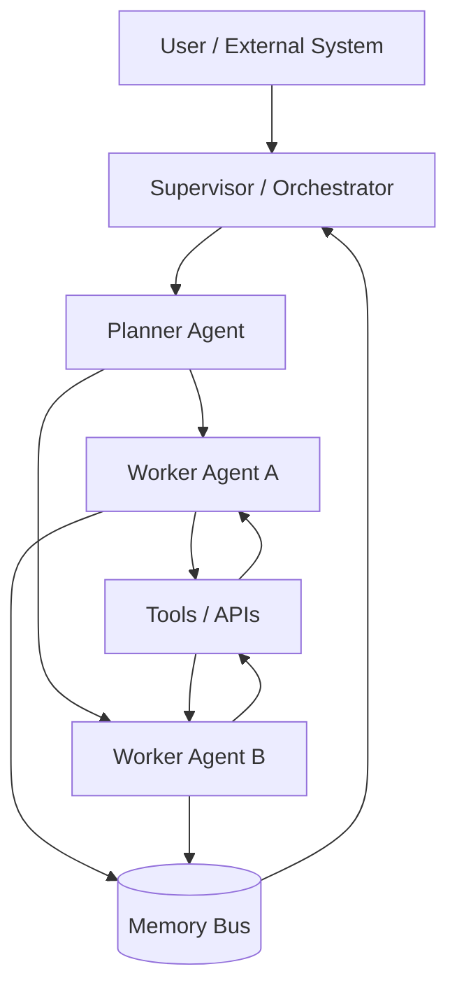
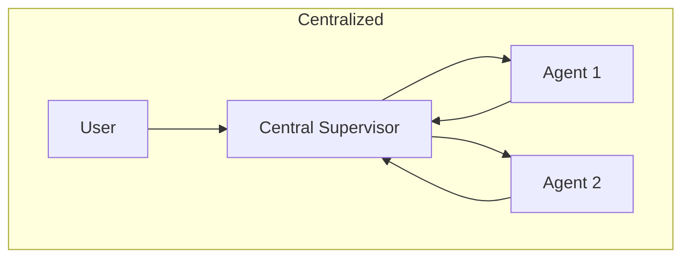
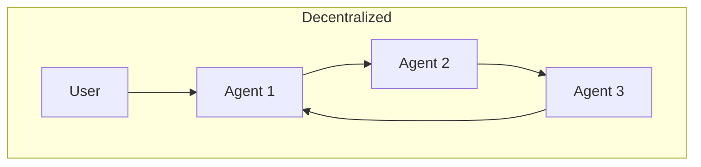
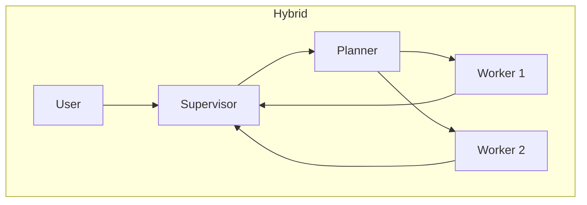
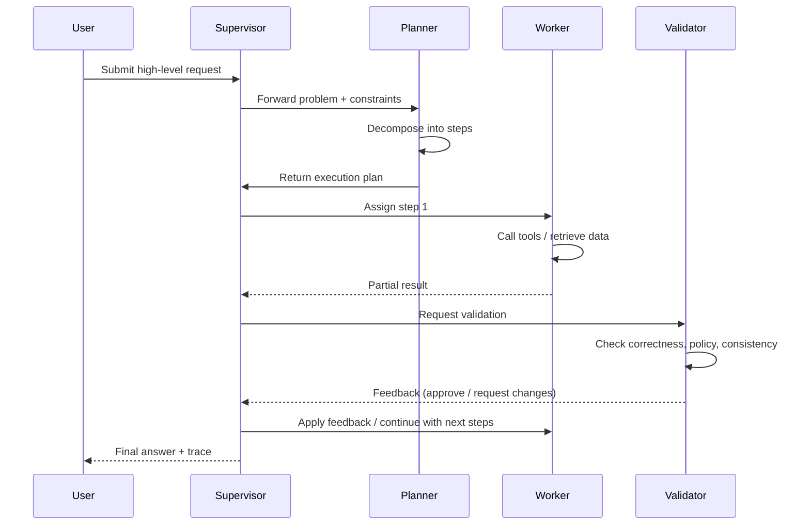
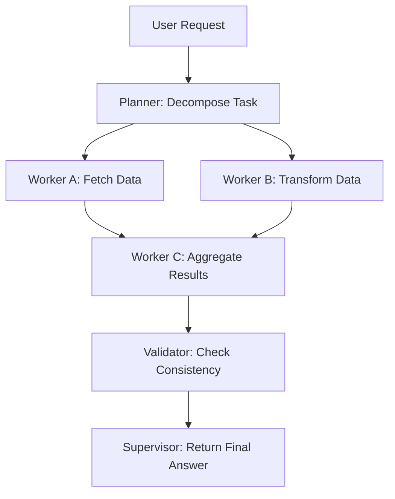
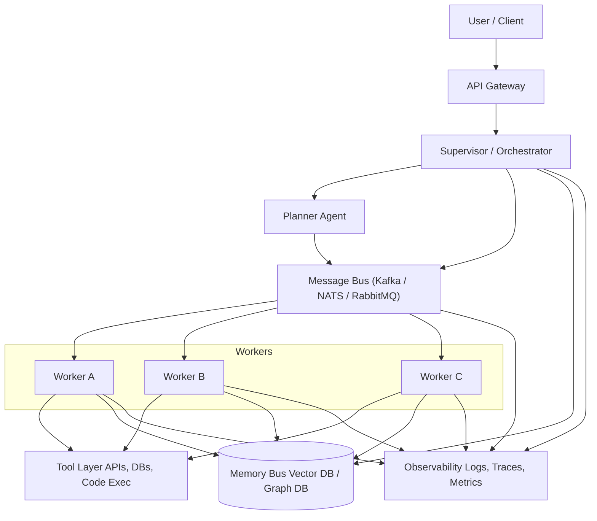

The AI Agents are really useful for automating tasks. We can use them to generate text, analyze data, and even write code. However, their true potential is unlocked when multiple agents collaborate within a structured system.

This progression was predictable, mirroring trends in other areas like microservices and distributed systems. But, where each service has a specific role and they communicate to achieve a common goal. A microservice alone can do a lot, but a well-orchestrated set of microservices can handle complex workflows efficiently.

And also because of the complexity of real-world tasks. A single agent might struggle to manage all aspects of a task, but a team of specialized agents can divide the workload, verify each other's outputs, and adapt to changing requirements.

This shift—driven by advances in reasoning, tool integration, and memory architectures—has created a new engineering discipline: **multi-agent system design**.

This article provides a deep, systematic exploration of modern multi-agent architectures, coordination protocols, orchestration patterns, memory strategies, and scaling techniques. While the fundamental ideas are inspired by classical Multi-Agent Systems (MAS), the design principles have been adapted to the realities of LLM-driven autonomy.

## Multi-Agent Systems Older Than You Think

While studying multi-agent systems, we usually think that it's a recent concept born with the rise of large language models (LLMs) and AI agents. However, the idea of multiple autonomous entities working together has been around for decades in computer science.

The concept of MAS is an established field in computer science and artificial intelligence, dating back to the 1970s and 1980s. Early research focused on distributed problem-solving, cooperative robotics, and agent communication languages like KQML and FIPA-ACL.

Victor Lesser, a pioneer in the field, is talking about multi-agent systems since the 1980s. Rodney Brooks also contributed significantly with his work on distributed robotics and the subsumption architecture. We also have some notable books like ["Multi-agent systems: An introduction to distributed artificial intelligence"](https://amzn.to/4pwS2Od) by Jacques Ferber (1999). So, while LLMs have revitalized interest in MAS, the foundational concepts have a rich history that can prove useful for modern implementations.

For understanding the base of MAS, we can learn the classical definitions and architectures, and then see how they adapt to the capabilities and challenges of LLM-based agents.

To understand it better, we'll learn the classical definitions. But, first, we need to understand what exactly is an agent.

### What is an Agent?

An agent is an **autonomous entity** that perceives its environment through sensors and acts upon that environment using actuators to achieve specific goals. The agent has the following characteristics:

- **Autonomy**: Operates without direct human intervention.
- **Perception**: Senses its environment.
- **Reactivity**: Responds to changes in the environment.
- **Pro-activeness**: Takes initiative to achieve goals.
- **Objective-oriented**: Works towards specific objectives.
- **Social ability**: Interacts with other agents.

In the case of classical agents, they were often based on rule-based systems, symbolic reasoning, and deterministic planning. They lacked the generative capabilities of modern LLMs but were designed to perform specific tasks autonomously.

Now we can understand better what is a multi-agent system.

### What is a Multi-Agent System?

A MAS is composed of **multiple autonomous agents** that interact with each other to solve complex problems that would be difficult or impossible for a single agent to handle alone.

These agents can take various forms depending on the context:

- **Software Agents**: Programs that operate in digital environments, such as bots for financial trading, virtual assistants, or web crawlers.
- **Hardware Agents**: Physical devices equipped with sensors and actuators, like IoT devices or drones.
- **Robots**: Autonomous machines capable of performing physical tasks, such as assembly line robots or exploration rovers.
- **Distributed Systems**: Complex systems composed of multiple interconnected components, such as air traffic control systems or smart grids.

Each agent is designed to operate autonomously, perceiving its environment, making decisions, and taking actions to achieve specific goals. In a MAS, these agents collaborate, communicate, or compete to solve problems that exceed the capabilities of any single agent.

### Differences Between Classical MAS and LLM-Based MAS

With the advent of LLMs, the nature of agents has evolved significantly. Now, the agents leverage advanced language models for reasoning, communication, and decision-making. So, the MAS based on LLMs differ from classical MAS in some key aspects:

| **Aspect**          | **Classical MAS**                  | **LLM-Based MAS**                |
|---------------------|------------------------------------|-----------------------------------|
| **Reasoning**       | Rule-based and symbolic logic      | Language generation and learning |
| **Communication**   | Formal languages (e.g., FIPA-ACL) | Natural language + structured JSON |
| **Planning**        | Deterministic                     | Emergent behaviors               |
| **Tool Access**     | Limited                           | Broad integrations (web, APIs, databases) |

LLM-based agents require new patterns for governance, safety, and orchestration due to their generative nature and the complexity of their interactions.

## The Core Architectural Models

Before we dive into specific architectures, it's useful to visualize a generic multi-agent ecosystem.



This diagram represents a typical multi-agent system architecture, showcasing the interaction between different components. At the center of the system is the **Supervisor / Orchestrator**, which acts as the central controller, managing the flow of tasks and ensuring coordination among agents. It assigns tasks to the appropriate agents and monitors their progress. The **Planner Agent** is responsible for breaking down high-level tasks into smaller, manageable subtasks, creating execution plans, and delegating these subtasks to specialized worker agents. These **Worker Agents**, such as Worker Agent A and Worker Agent B, execute specific tasks by interacting with external tools and APIs. They also store or retrieve information from the **Memory Bus**, a shared memory system that ensures consistency and enables collaboration between agents. The **Memory Bus** plays a crucial role in allowing agents to access context or intermediate results, while the **Tools / APIs** provide external resources or functionalities, such as databases, web services, or computational tools, that the agents can leverage to complete their tasks.

These core components can be arranged in various architectural patterns, each with its own trade-offs in terms of scalability, robustness, and complexity. And the power of the modern tools allows us to implement really powerful systems.

Now, let's explore how to orchestrate these components effectively.

## Architectural Patterns

Here I aggregate the main architectural patterns used in multi-agent systems I found in the literature and in practice.

### Centralized Orchestration

In a centralized orchestration model, the **Supervisor** plays a pivotal role as the central controller of the system. It is responsible for coordinating all interactions between agents, ensuring that tasks are assigned appropriately and executed in a structured manner. The Supervisor acts as the brain of the system, maintaining control over the workflow and providing a single point of governance. This approach is particularly useful in scenarios where consistency, safety, and strong oversight are critical.

The Supervisor operates by receiving high-level requests from users or external systems, breaking them down into smaller tasks, and delegating these tasks to specialized agents. It monitors the progress of each agent, collects their outputs, and integrates the results into a cohesive response. This centralized control simplifies debugging and makes it easier to enforce policies and constraints across the system.

However, the centralized model is not without its limitations. The reliance on a single Supervisor creates a potential single point of failure, meaning that if the Supervisor encounters an issue, the entire system could be disrupted. Additionally, scalability can become a challenge as the number of agents and tasks increases, potentially overwhelming the Supervisor and leading to bottlenecks.

A significant challenge with LLM-based systems is their probabilistic nature; even if you run the same prompts multiple times, you can get different results due to their probabilistic nature. In a centralized orchestration model, this variability can lead to inconsistencies in task execution, as the Supervisor may receive different outputs from agents for the same input. This unpredictability can complicate the coordination process and make it challenging to ensure reliable outcomes.

Despite these drawbacks, centralized orchestration remains a popular choice for systems that require strong governance and predictable behavior. It is particularly effective in environments where tasks are well-defined and the risk of emergent drift or uncoordinated actions needs to be minimized. By maintaining a clear hierarchy and centralized control, the Supervisor ensures that the system operates efficiently and reliably.

### Decentralized Architecture

In a decentralized architecture, agents operate independently and communicate directly with one another in a peer-to-peer manner. This model eliminates the need for a central controller, allowing agents to negotiate tasks, share information, and collaborate autonomously. The decentralized approach is particularly well-suited for systems that require high scalability and robustness, as it distributes the workload across multiple agents and avoids reliance on a single point of control.

The peer-to-peer communication enables agents to adapt dynamically to changes in the environment, making the system more resilient to failures. For example, if one agent becomes unavailable, others can step in to fulfill its role without disrupting the overall operation. This flexibility makes decentralized architectures ideal for applications such as distributed sensor networks, swarm robotics, and blockchain-based systems.

However, the lack of centralized oversight introduces challenges in maintaining control and consistency. Without a central authority, it can be difficult to enforce global policies or ensure that all agents are working towards the same objectives. Additionally, decentralized systems are prone to emergent drift, where individual agents may deviate from their intended behavior due to local interactions or conflicting goals. This can lead to unpredictable outcomes and require sophisticated mechanisms for coordination and conflict resolution.

Despite these challenges, decentralized architectures offer significant advantages in terms of scalability and fault tolerance. By leveraging the collective intelligence of autonomous agents, these systems can achieve complex goals that would be difficult to accomplish with a centralized approach.

### Hybrid Architecture

Hybrid architectures combine centralized planning with decentralized execution, often providing the best trade-off between control and scalability.

Hybrid architectures are particularly useful in scenarios where tasks require both structured planning and flexible execution. For example, in a logistics system, a centralized planner might optimize delivery routes, while individual delivery agents adapt to real-time traffic conditions and customer requests. Similarly, in a research environment, a supervisor could assign research topics to teams, while the teams independently explore and share findings.


The diagrams below illustrate the differences between centralized, decentralized, and hybrid architectures, highlighting how hybrid models leverage the best aspects of both approaches:








Despite their advantages, hybrid architectures also come with challenges. The integration of centralized and decentralized components requires careful design to ensure seamless communication and coordination. Additionally, the system must balance the trade-offs between control and autonomy, avoiding excessive centralization that could stifle flexibility or over-decentralization that might lead to inconsistencies.

### Memory Architecture

Memory determines how agents access and manage context, which is critical for their performance and efficiency. The choice of memory architecture can significantly impact the stability, scalability, and cost-effectiveness of a multi-agent system. Here are the primary types of memory architectures and their implications.

#### Local Memory

Each agent maintains its own private state, which is isolated from other agents. We can keep it in a `Dict`, for example. This approach is simple and ensures that agents operate independently, but it can lead to inefficiencies when agents need to share or synchronize information. Local memory is often used in decentralized systems where autonomy is prioritized. However, the lack of shared context can result in redundant computations, as agents may duplicate efforts to gather or process the same information, indirectly increasing resource usage and costs.

#### Shared Memory

A centralized memory system, such as a vector store, graph memory, scratchpad, or blackboard, is accessible to all agents. This allows agents to collaborate more effectively by sharing context and intermediate results. Shared memory is particularly useful in systems that require high levels of coordination, such as collaborative problem-solving or workflows with interdependent tasks. However, maintaining a shared memory system introduces additional costs related to infrastructure, such as the need for high-performance storage solutions and mechanisms to handle concurrency. If not optimized, shared memory can become a bottleneck, leading to increased latency and higher operational expenses.

#### Generated Memory

In this model, memory is dynamically generated by summarizing the state over time, often using LLMs. For example, an LLM can create summaries of interactions, decisions, or task progress, which can then be used as context for future actions. You can see it when using Claude and, sometimes, the memory is compressed. Generated memory is highly flexible and can adapt to evolving requirements, but it may incur higher computational costs due to the processing power required to generate and update summaries. Additionally, if the summarization process is not carefully designed, important details may be lost, potentially leading to errors or inefficiencies that require further computation to resolve.

Good memory design is essential for ensuring that agents can operate efficiently and effectively. A well-architected memory system balances the trade-offs between autonomy, collaboration, and resource utilization. For instance, combining local and shared memory can provide a hybrid approach that leverages the strengths of both models while mitigating their weaknesses. Similarly, incorporating generated memory can enhance the adaptability and long-term coherence of the system. By carefully considering the specific needs of the system and the trade-offs of each memory model, engineers can minimize costs while maximizing performance and scalability.

## Communication and Coordination Protocols

Effective communication and coordination are the backbone of any multi-agent system. These protocols define how agents interact, share information, and collaborate to achieve their goals. In this section, we will explore various communication and coordination protocols, starting with direct messaging.

### Direct Messaging

Direct messaging is one of the simplest and most intuitive forms of communication between agents. In this model, agents exchange structured messages directly with one another, specifying the sender, receiver, task, and any relevant context. This approach is highly efficient for systems with a small number of agents or well-defined communication patterns.

For example, a planner agent might send a message to a coder agent to implement a specific function:

```json
{
  "sender": "planner",
  "receiver": "coder",
  "task": "implement function",
  "context": {
    "functionName": "calculateTotal",
    "parameters": ["price", "quantity"],
    "returnType": "float",
    "description": "This function should return the total cost by multiplying price and quantity."
  }
}
```

Direct messaging offers several advantages:

- **Simplicity**: The communication model is straightforward to implement and debug.
- **Low Latency**: Messages are sent directly between agents, minimizing delays.
- **Fine-Grained Control**: Agents can tailor messages to the specific needs of the receiver.

However, there are also challenges to consider:

- **Scalability**: As the number of agents increases, managing direct connections between all agents can become complex.
- **Error Handling**: If a message is lost or an agent is unavailable, the system must have mechanisms to handle these failures.
- **Coordination Overhead**: In systems with many interdependent tasks, direct messaging can lead to a high volume of communication, increasing the risk of bottlenecks.

Despite these challenges, direct messaging remains a foundational communication protocol in multi-agent systems, particularly in scenarios where simplicity and low latency are prioritized. By designing clear and structured message schemas, engineers can ensure reliable and efficient communication between agents.

### Blackboard Model

The blackboard model is a coordination mechanism where agents interact through a shared knowledge base, often referred to as the "blackboard." This model is inspired by the way humans collaborate on a physical blackboard, where individuals contribute ideas, refine them, and build upon each other's work. In a multi-agent system, the blackboard serves as a central repository for information, enabling agents to read from and write to a shared context.

This approach is particularly useful in scenarios that involve production workflows, data aggregation, or directed acyclic graph(DAG)-style processing. For example, in a workflow where multiple agents are responsible for different stages of data processing, the blackboard can act as a staging area where intermediate results are stored and accessed by subsequent agents.

#### Advantages of the Blackboard Model

The blackboard model offers several key advantages that make it a powerful coordination mechanism in multi-agent systems. First, it provides a **centralized context**, acting as a unified repository where agents can collaborate and share information seamlessly. This centralized view simplifies the coordination process and ensures that all agents have access to the same state of the system.

Another significant advantage is its **flexibility**. Agents can operate asynchronously, contributing to the blackboard whenever they have new information or results. This asynchronous operation allows the system to handle dynamic and unpredictable workflows efficiently.

The model also supports **scalability**, as new agents can be added dynamically without requiring changes to existing communication protocols. This makes the blackboard model particularly suitable for systems that need to grow or adapt over time. Additionally, the blackboard can maintain a history of changes, enhancing **traceability**. This feature is invaluable for debugging and observability, as it provides a clear record of the system's operations.

#### Challenges of the Blackboard Model

Despite its advantages, the blackboard model comes with its own set of challenges. One of the primary issues is **concurrency management**. When multiple agents attempt to read from or write to the blackboard simultaneously, conflicts can arise. To address this, the system must implement robust mechanisms to ensure consistency and prevent data corruption.

Another challenge is the potential for **bottlenecks**. If too many agents rely on the blackboard for communication, it can become a performance bottleneck, especially in high-throughput systems. This can lead to delays and reduced efficiency, particularly in scenarios with a large number of agents or high-frequency updates.

Finally, the blackboard model may introduce **infrastructure overhead**. Implementing a robust blackboard system often requires additional resources, such as high-performance storage solutions and synchronization mechanisms. These requirements can increase the complexity and cost of the system, making it less suitable for resource-constrained environments.

### Auction and Bidding

The auction and bidding model is a dynamic coordination mechanism where agents compete for tasks based on their capabilities. This approach is inspired by contract-net protocols, which are widely used in distributed systems to allocate resources and responsibilities efficiently.

In this model, a central agent or task manager announces a task to the system, providing details such as the task requirements, constraints, and expected outcomes. The other agents, acting as bidders, evaluate their own capabilities and resources to determine whether they are suitable for the task. Each bidder then submits a proposal, often including a score or bid that reflects their ability to complete the task effectively.

The task manager reviews the proposals and selects the agent with the highest score or the most favorable bid. This selection process ensures that tasks are assigned to the most capable agents, optimizing the overall performance of the system.

For example, in a logistics system, a central planner might announce a delivery task. Agents representing delivery vehicles evaluate factors such as their current location, fuel levels, and cargo capacity. Each agent submits a bid based on these factors, and the planner assigns the task to the vehicle that can complete it most efficiently.

This model offers several advantages. It promotes competition among agents, encouraging them to optimize their performance. It also provides a flexible and scalable way to allocate tasks, as new agents can join the system and participate in auctions without disrupting existing workflows. Additionally, the bidding process ensures that tasks are assigned based on objective criteria, reducing the risk of suboptimal allocations.

However, the auction and bidding model also presents challenges. The bidding process can introduce latency, particularly in systems with a large number of agents or complex tasks. Ensuring fairness and preventing collusion among agents requires careful design and monitoring. Moreover, the computational overhead of evaluating bids and managing auctions can be significant, especially in high-frequency systems.

Despite these challenges, the auction and bidding model remains a powerful tool for coordinating multi-agent systems, particularly in scenarios where tasks vary in complexity and agents have diverse capabilities.

## Orchestration Patterns

### Supervisor–Worker

The Supervisor–Worker pattern is a orchestration model where a central Supervisor assigns tasks to one or more Worker agents, who then execute these tasks. This pattern is particularly effective for workflows that involve repetitive or well-defined tasks, such as document processing, data transformation, or batch operations.

The Supervisor acts as the central coordinator, receiving high-level requests from users or external systems. It breaks these requests into smaller, manageable tasks and delegates them to Worker agents. Each Worker operates independently, focusing solely on the task assigned to it. Once the task is completed, the Worker reports the results back to the Supervisor, which integrates the outputs and provides a cohesive response to the user.

This pattern offers several advantages. It simplifies the overall system design by clearly separating the roles of coordination and execution. The Supervisor can focus on managing workflows and ensuring that tasks are distributed efficiently, while Workers can specialize in executing specific types of tasks. This separation of concerns enhances modularity and makes the system easier to scale, as additional Workers can be added to handle increased workloads.

However, the Supervisor–Worker pattern also has limitations. The reliance on a central Supervisor creates a potential single point of failure. If the Supervisor becomes overwhelmed or encounters an issue, the entire system's operation can be disrupted. Additionally, the pattern may not be well-suited for tasks that require high levels of inter-agent collaboration or dynamic decision-making.

Despite these challenges, the Supervisor–Worker pattern remains a popular choice for systems that prioritize simplicity, modularity, and scalability. By clearly defining the roles of Supervisor and Worker agents, this pattern provides a robust framework for orchestrating multi-agent workflows.

### Role-Based Collaboration

Role-Based Collaboration is an orchestration pattern where each agent is assigned a specific role, such as Researcher, Editor, or Critic. These roles are persistent, meaning that agents retain their identities and responsibilities throughout the system's operation. This approach is particularly effective for long-lived sessions where coherence and continuity are critical.

In this pattern, agents collaborate by leveraging their specialized roles to achieve a common goal. For example, in a content creation system, a Researcher agent might gather information, an Editor agent might refine the content, and a Critic agent might review the final output for quality and consistency. By dividing responsibilities based on roles, the system can ensure that each aspect of the workflow is handled by an agent with the appropriate expertise.

Role-Based Collaboration offers several benefits. It enhances the system's coherence by maintaining consistent agent identities and responsibilities. This consistency is particularly valuable in long-running workflows, where agents need to build and maintain context over time. Additionally, the pattern promotes specialization, allowing agents to develop expertise in their assigned roles and perform their tasks more effectively.

However, this pattern also introduces challenges. The reliance on persistent roles can make the system less flexible, as agents may be less adaptable to changing requirements or unexpected tasks. Additionally, the pattern requires careful coordination to ensure that agents work together effectively and do not duplicate efforts or conflict with one another.

Despite these challenges, Role-Based Collaboration is a powerful pattern for systems that require long-lived sessions and specialized expertise. By assigning persistent roles to agents, this pattern enables coherent and efficient collaboration in complex workflows.

### Tool Router Pattern

The Tool Router Pattern is an orchestration model designed for systems with a wide variety of tools or integrations. In this pattern, a central router determines which agent or tool should handle a given request, based on the request's nature and requirements. This approach is particularly useful for systems that need to manage diverse tasks and leverage multiple specialized tools.

The router acts as the decision-maker, analyzing incoming requests and routing them to the most appropriate agent or tool. For example, in a customer support system, the router might direct technical queries to a troubleshooting agent, billing inquiries to a finance agent, and general questions to a chatbot. By dynamically routing requests, the system can ensure that each task is handled by the most suitable resource.

This pattern offers several advantages. It enhances the system's flexibility by allowing new tools or agents to be added without disrupting existing workflows. The router can also optimize task allocation based on real-time conditions, such as agent availability or workload. Additionally, the pattern simplifies the user experience by providing a single entry point for all requests, which are then routed to the appropriate resource.

However, the Tool Router Pattern also has limitations. The reliance on a central router creates a potential bottleneck, as the router must process and route all incoming requests. This can lead to latency in high-throughput systems. Additionally, the pattern requires robust decision-making logic to ensure that requests are routed accurately and efficiently.

Despite these challenges, the Tool Router Pattern is a valuable model for systems that need to manage diverse tasks and leverage multiple tools. By centralizing the routing logic, this pattern enables efficient and flexible orchestration in complex multi-agent systems.

### Planner–Executor Pattern

The Planner–Executor Pattern is a widely used orchestration model in multi-agent systems, designed to separate the responsibilities of planning and execution. This separation allows for a clear division of labor, where one agent focuses on decomposing high-level problems into actionable steps, and another agent specializes in executing these steps efficiently.

In this pattern, the Planner agent acts as the strategic thinker. It receives a high-level request, analyzes the problem, and breaks it down into smaller, manageable tasks. These tasks are then organized into an execution plan, which is passed on to the Executor agent. The Executor, in turn, focuses on carrying out these tasks, often interacting with tools, APIs, or other resources to achieve the desired outcomes.

The sequence diagram below illustrates the collaboration between the Planner, Executor, and Validator agents:



The Planner–Executor Pattern offers several key advantages. By separating planning and execution, agents can specialize in their respective roles, which leads to more efficient and effective task handling. This pattern also supports scalability, since multiple Executors can be deployed to handle different tasks in parallel, all guided by a single Planner. In addition, the Planner can dynamically adapt the execution plan based on feedback or changing requirements, ensuring that the system remains responsive to new challenges. Finally, the inclusion of a Validator agent adds an extra layer of quality control, helping ensure that outputs meet the required standards before being finalized.

Despite its benefits, the Planner–Executor Pattern also introduces some challenges. The interaction between Planner, Executor, and Validator agents demands robust communication protocols to maintain smooth coordination, which can add coordination overhead. Furthermore, the sequential nature of planning, execution, and validation may introduce latency, especially in time-sensitive applications. Implementing this pattern also increases system complexity, as it requires careful design to manage dependencies and to ensure that tasks are executed in the correct order.

The Planner–Executor Pattern is particularly well-suited for scenarios involving complex problem-solving or workflows with multiple interdependent steps. In software development, for example, a Planner agent can generate a development roadmap, while Executor agents implement specific features or fix bugs. In logistics, a Planner might optimize delivery routes, and Executors would handle the actual transportation of goods. In research settings, a Planner could outline a research agenda, while Executors conduct experiments or gather data. By leveraging the Planner–Executor Pattern in these kinds of contexts, multi-agent systems can achieve a high degree of organization and efficiency, making it a valuable model for a wide range of applications.


### Critic–Validator Pattern

The Critic–Validator Pattern is an orchestration model designed to enhance the quality and reliability of outputs in multi-agent systems. In this pattern, a Validator agent reviews the outputs generated by another agent, known as the Critic, and proposes corrections or improvements. This iterative process ensures that the final output meets the desired standards of accuracy, consistency, and quality.

The Critic agent is responsible for generating an initial output based on the task requirements. This output is then passed to the Validator agent, which evaluates it against predefined criteria, such as correctness, policy adherence, and logical consistency. If the Validator identifies any issues, it provides feedback to the Critic, who revises the output accordingly. This cycle continues until the Validator approves the output or the system reaches a predefined iteration limit.

By incorporating a validation step, this pattern ensures that outputs are thoroughly reviewed and refined, leading to higher-quality results. The Validator plays a crucial role in identifying and addressing errors or inconsistencies that might be overlooked in a single-pass system. The separation of roles between the Critic and Validator promotes accountability, as each agent focuses on its specific responsibilities. Furthermore, the iterative nature of this pattern allows the system to adapt to complex or evolving requirements by refining outputs over multiple iterations.

However, the iterative process can introduce delays, particularly in time-sensitive applications. Effective communication between the Critic and Validator is essential to avoid misunderstandings or redundant iterations, which can add coordination overhead. Additionally, the additional computational resources required for validation and iteration can increase system costs, making resource consumption another challenge to consider.

### Self-Correcting Loop

The Self-Correcting Loop is an orchestration pattern where agents actively monitor each other to detect and address failures, ensuring the system remains robust and reliable. This pattern is particularly useful in dynamic environments where unexpected issues can arise, and immediate corrective actions are necessary to maintain system stability. By embedding checks and balances directly into the agentic workflow, the system can identify and recover from common failure modes without human intervention.

In this model, agents are designed to identify specific types of failures during their interactions. For instance, timeout detection is a foundational safeguard against unresponsive tools or stalled agents. An orchestrator can wrap calls to external APIs or long-running computations in a timeout mechanism, ensuring that the entire system does not hang if one component fails to respond. If a timeout is triggered, the orchestrator can then reroute the task, retry with a different tool, or escalate the issue to another agent.

```python
import threading

class TimeoutException(Exception):
    pass

def run_with_timeout(func, args, timeout_seconds):
    """Executes a function and raises a timeout if it takes too long."""
    result = [None]
    exception = [None]

    def target():
        try:
            result[0] = func(*args)
        except Exception as e:
            exception[0] = e

    thread = threading.Thread(target=target)
    thread.start()
    thread.join(timeout_seconds)

    if thread.is_alive():
        # Note: This doesn't kill the thread, which is a limitation in Python.
        # For production, more robust solutions like multiprocessing are often needed.
        raise TimeoutException(f"Task timed out after {timeout_seconds} seconds.")

    if exception[0]:
        raise exception[0]

    return result[0]

# An agent orchestrator would use this to call a potentially slow tool
try:
    response = run_with_timeout(api.call, ("some_query",), 5)
except TimeoutException as e:
    # Escalate to another agent or retry with a different strategy
    print(f"Caught a timeout: {e}")
```

Similarly, infinite loop detection prevents agents from becoming trapped in unproductive cycles, which could otherwise consume vast resources. A simple but effective technique is for the orchestrator to enforce a step limit on tasks. It injects a context object into the agent, which must be used to report progress. If an agent exceeds a predefined number of steps for a given task, the orchestrator terminates the operation and flags it for review.

```python
class TaskContext:
    def __init__(self, task_id, max_steps=25):
        self.task_id = task_id
        self.max_steps = max_steps
        self.current_step = 0

    def increment(self):
        """Increments the step counter and raises an error if the limit is exceeded."""
        self.current_step += 1
        if self.current_step > self.max_steps:
            raise RuntimeError(f"Task {self.task_id} exceeded max steps. Possible infinite loop detected.")

def worker_agent(context: TaskContext, goal: str):
    """A worker that must report its progress with each step."""
    while not "goal_is_met": # Placeholder for the real condition
        context.increment()
        # ... do one step of work ...
        if "some_condition":
            break # Exit condition

# The orchestrator manages the context and can catch the error
task_context = TaskContext("analyze_report_123")
try:
    worker_agent(task_context, "Summarize the document.")
except RuntimeError as e:
    print(f"Error: {e}")
    # Fallback to a simpler agent or alert a human supervisor.
```

Another critical aspect of this pattern is hallucination mitigation, where agents cross-validate each other's outputs to ensure factual accuracy and relevance. This is often implemented using a `Validator` agent, which acts as a reviewer for a `Generator` agent's output. The validator can use a different model, a rule-based system, or an external knowledge base (like a web search) to check the generated content. If it detects a likely hallucination, it provides corrective feedback, and the orchestrator can prompt the generator to revise its output.

```python
def generator_agent(prompt: str) -> str:
    """Generates content based on a prompt. May hallucinate."""
    # In a real system, this would call an LLM.
    # Simulate a potential hallucination:
    return "The Eiffel Tower is in Rome, the capital of Italy."

def validator_agent(text: str) -> bool:
    """Validates text against a knowledge base or rules."""
    # This could use a search API, a database, or another LLM.
    if "Eiffel Tower" in text and "Rome" in text:
        return False  # Found a likely factual error.
    return True

# The orchestrator implements the self-correction loop
prompt = "Where is the Eiffel Tower and what city is it in?"
generated_text = generator_agent(prompt)
is_valid = validator_agent(generated_text)

if not is_valid:
    print("Orchestrator: Validation failed. Retrying with a correcting prompt.")
    # The orchestrator can now trigger a new generation with more context.
    corrected_prompt = f"Original prompt: '{prompt}'. Previous incorrect answer: '{generated_text}'. Please provide a factual correction."
    new_text = generator_agent(corrected_prompt)
```

By continuously monitoring each other, agents in a Self-Correcting Loop can collaboratively maintain the integrity and efficiency of the system. However, implementing this pattern requires a careful balance. While these checks add a layer of resilience, they also introduce overhead. Timeout handlers, step counters, and validation calls consume computational resources and can increase latency. The key is to apply them judiciously: use aggressive timeouts for unreliable external APIs, implement step counters for complex, iterative tasks, and deploy validator agents for high-stakes content generation where accuracy is paramount. This proactive approach transforms a brittle system into a more robust one, minimizing the impact of individual failures and enhancing its ability to adapt and recover from errors in real time.

## Implementing Multi-Agent Systems in Practice

Designing a multi-agent architecture is only the first step; making it work reliably in production requires choosing the right orchestration framework and understanding its trade-offs. In practice, this means balancing determinism, flexibility, developer experience, and integration effort with your existing stack and workflows. The choice of framework will influence how you structure agents, how they communicate, and how easily you can **observe**, **debug**, and **evolve** the system over time.

### Framework Comparison

Let's start by comparing some of the leading frameworks and approaches for building multi-agent systems today.

When implementing multi-agent systems today, several ecosystem options stand out. LangGraph focuses on graph-based orchestration, where you define agents and tools as nodes and the control flow as edges. This model encourages explicit modeling of transitions between states and makes it easier to reason about complex workflows. Because execution paths are encoded in a graph, LangGraph tends to produce more deterministic behavior, which is especially valuable when you need reproducibility, robust error handling, and fine-grained control over branching logic and retries.

AutoGen, by contrast, centers on conversational interactions between agents. Instead of explicitly wiring a graph, you define agents with roles and capabilities that collaborate through messages. This chat-based paradigm is well-suited to exploratory problem-solving, tool-using agents that need to negotiate tasks, and scenarios where emergent behavior is desirable. It trades some determinism for flexibility and rapid prototyping: you can quickly stand up multi-agent loops, iterate on prompts, and observe how agents coordinate in semi-structured workflows.

CrewAI takes a more structured, role-based approach. You define a “crew” of agents with clear responsibilities and a shared objective, often organized around a specific workflow or business process. This makes CrewAI a strong fit for teams who want a high-level abstraction that feels closer to human collaboration patterns, where you have planners, researchers, implementers, and reviewers working toward a common goal. The framework provides conventions for task assignment, handoffs, and summarization, lowering the cognitive load required to manage multi-step processes.

Finally, custom orchestrators give you maximum control at the cost of additional engineering effort. Building your own orchestration layer, using, for example, a workflow engine, message queues, or a microservices architecture, allows you to tailor everything: state management, observability, deployment topology, scaling strategies, and integration with legacy systems. This path is often justified in organizations with strict reliability, compliance, or performance requirements, or when agentic capabilities need to be deeply embedded into an existing platform rather than layered on top.

A high-level comparison of these options is summarized below:

| Framework            | Primary Paradigm                  | Orchestration Model         | Determinism           | Best Suited For                                   | Engineering Effort        |
|----------------------|-----------------------------------|-----------------------------|-----------------------|---------------------------------------------------|---------------------------|
| LangGraph            | Graph-based workflows             | Explicit stateful graphs    | High                  | Complex, repeatable pipelines and robust tooling  | Moderate                  |
| AutoGen              | Chat-based agent collaboration    | Message-driven interactions | Medium to low         | Exploratory multi-agent loops and fast prototyping | Low to moderate           |
| CrewAI               | Role-based, team-like workflows   | Task and role coordination  | Medium                | Business-oriented flows and human-like processes  | Low (within its paradigm) |
| Custom orchestrators | Fully custom infrastructure layer | Arbitrary (queues, workflows, services) | High (if designed so) | Deep integration, strict SLAs, bespoke architectures | High                      |

I'm using LangGraph in my applications because I value deterministic execution and explicit control flow for complex multi-agent tasks. Its ease of debugging is a critical factor. However, the best choice will depend on your specific use case, team expertise, and long-term maintenance considerations.


### Designing Message Schemas

Designing message schemas is an important step in building robust multi-agent systems, because it defines how information flows between agents and how that information can be validated, logged, and evolved over time. At a minimum, you should define clear schemas for core message types such as tasks, errors, memory updates, and state transitions.

**Task messages** typically describe what needs to be done, including parameters, context, and any constraints that guide execution. **Error messages** encode failure modes in a structured way, making it possible to detect patterns, trigger compensating actions, and perform reliable monitoring. **Memory update messages** capture changes to shared or agent-specific memory, ensuring that reasoning can be reconstructed and that long-running workflows maintain coherent context. **State transition messages** describe how an agent or workflow moves from one state to another, which is essential for debugging, auditing, and implementing complex control logic.

In practice, a useful way to start is by defining a common “envelope” that all messages share. This envelope usually includes fields such as a unique identifier, a message type, a timestamp, and a correlation or trace identifier so that related messages can be grouped together. You then add a payload field whose structure depends on the message type. For example, a simple JSON-based envelope might look like this:

```json
{
  "id": "msg-123",
  "type": "task",
  "timestamp": "2026-01-01T12:00:00Z",
  "correlation_id": "trace-789",
  "agent": "planner",
  "payload": {
    "name": "generate_plan",
    "inputs": {
      "goal": "summarize recent research on X"
    }
  }
}
```

Once the envelope is defined, you can design specific schemas for each message type by constraining the payload field. Task messages might require a name, inputs, and optional constraints; error messages might require an error code, a human-readable message, and contextual data; memory updates might require a memory key, the new value, and the source agent; state transitions might include the previous state, the new state, and the reason for the change. The important point is to make these fields explicit rather than relying on ad-hoc JSON blobs.

By formalizing these message types with explicit schemas, using technologies such as JSON Schema or Protobuf, you improve traceability and observability across the entire system. Schema definitions can be stored in a central location or registry, validated at the edges of the system, and versioned as your protocol evolves. Structured messages make it easier to inspect logs, build dashboards, and enforce contracts between services or agents owned by different teams. They also create a natural path for migrating from in-process communication to external message buses or event streams, since the same schemas can be reused at the infrastructure level. In practice, well-designed message schemas become the backbone of an agentic architecture, enabling safe evolution of protocols, backward-compatible changes, and smoother integration with other systems and tooling.

### Handling State and Memory

Handling state and memory is one of the most important design decisions in multi-agent systems, because it directly affects how well agents can reason over time, reuse context, and avoid redundant work. A simple but effective starting point is a **sliding window context**, where you only keep the most recent messages or events within a fixed token or time budget. This approach is easy to implement and works well for short interactions, but it can lose important information from earlier in the conversation if the window is too small or the interaction is very long.

Example:

```python
MAX_MESSAGES = 10
history: list[dict] = []  # each message: {"role": "user" | "assistant", "content": str}

def append_message(message: dict) -> None:
    history.append(message)
    # keep only the most recent MAX_MESSAGES
    if len(history) > MAX_MESSAGES:
        history = history[-MAX_MESSAGES:]

def build_prompt() -> str:
    return "\n".join(f"{m['role']}: {m['content']}" for m in history)
```

This code illustrates the essence of a sliding window context: the agent always sees a bounded, recent slice of the conversation, which keeps prompts small and predictable while still preserving short-term coherence.

For more complex scenarios, [retrieval-augmented memory](/posts/understanding-rag-llm/) becomes essential. Instead of keeping everything in the active context, you store past interactions, documents, or intermediate results in an external store, such as a vector database or key–value store. When an agent needs to reason about a new request, it queries this store for the most relevant pieces of information and injects them into the current prompt. This pattern allows you to maintain a long operational history without exceeding context limits, and it provides a principled way to reuse knowledge across tasks and sessions.

Example:

```python
from typing import List, Dict
import math

MemoryItem = Dict[str, object]
memory_store: List[MemoryItem] = []

def embed(text: str) -> List[float]:
    # Placeholder for a real embedding function
    # In practice you would call an embedding API here.
    return [float(ord(c)) for c in text[:16]]  # toy embedding

def cosine_similarity(a: List[float], b: List[float]) -> float:
    dot = sum(x * y for x, y in zip(a, b))
    norm_a = math.sqrt(sum(x * x for x in a))
    norm_b = math.sqrt(sum(x * x for x in b))
    if norm_a == 0 or norm_b == 0:
        return 0.0
    return dot / (norm_a * norm_b)

def add_memory(text: str) -> None:
    memory_store.append({
        "text": text,
        "embedding": embed(text),
    })

def retrieve_relevant(query: str, top_k: int = 3) -> List[str]:
    query_emb = embed(query)
    scored = [
        (cosine_similarity(query_emb, item["embedding"]), item["text"])
        for item in memory_store
    ]
    scored.sort(reverse=True, key=lambda x: x[0])
    return [text for _, text in scored[:top_k]]

def build_prompt(query: str) -> str:
    context_snippets = retrieve_relevant(query)
    context_block = "\n\n".join(context_snippets)
    return f"Context:\n{context_block}\n\nUser query:\n{query}"

# Example usage
add_memory("User asked about setting up a LangGraph workflow.")
add_memory("We explained how to design message schemas for tasks and errors.")
add_memory("We discussed retrieval-augmented memory and vector stores.")

query = "How do I design message schemas?"
prompt = build_prompt(query)
print(prompt)
```

In large systems, a hierarchical memory strategy often works best. You explicitly separate short-term memory, which holds the immediate working context (recent messages, current goals, local variables), from long-term memory, which captures stable facts, learned patterns, and summaries of past interactions. Short-term memory is frequently updated and tightly coupled to the current episode, while long-term memory is updated more sparingly, typically through periodic summarization or explicit “commit” operations. By combining sliding windows for immediate context, retrieval for targeted recall, and hierarchical organization for long-lived knowledge, you can build agentic systems that remain coherent over long time spans while still being efficient and manageable in production.

Example:

```python
from typing import List

MAX_SHORT_MESSAGES = 8

short_term: List[str] = []   # recent messages and local context
long_term: List[str] = []    # summaries and stable facts

def add_message(message: str) -> None:
    """Update short-term memory with the latest message."""
    short_term.append(message)
    if len(short_term) > MAX_SHORT_MESSAGES:
        # keep only the most recent messages
        del short_term[0:len(short_term) - MAX_SHORT_MESSAGES]

def commit_summary(summary: str) -> None:
    """Summarize the current episode into long-term memory."""
    long_term.append(summary)
    short_term.clear()  # start a new short-term episode

def retrieve_long_term(query: str, top_k: int = 2) -> List[str]:
    """Very naive retrieval based on substring matching."""
    matches = [mem for mem in long_term if query.lower() in mem.lower()]
    return matches[:top_k]

def build_prompt(query: str) -> str:
    """Combine short-term and long-term memory into a prompt."""
    long_block = "\n".join(retrieve_long_term(query))
    short_block = "\n".join(short_term)
    return (
        f"Long-term memory:\n{long_block}\n\n"
        f"Recent context:\n{short_block}\n\n"
        f"User query:\n{query}"
    )

# Example usage
add_message("User: How do I design message schemas?")
add_message("Assistant: We discussed task, error, and state messages.")
commit_summary("We helped the user design robust message schemas.")

add_message("User: Now I want to handle memory.")
query = "message schemas"
prompt = build_prompt(query)
print(prompt)
```

This example shows short-term memory as a bounded, frequently updated buffer, long-term memory as episodic summaries, and a prompt builder that combines both when answering a new query.

### Tooling Layer

The tooling layer is the bridge between agents and the external world. It is responsible for actions such as running code, [accessing the web](/posts/how-connect-local-ai-agent-to-the-internet/), [querying databases with SQL](/posts/how-connect-an-ai-agent-to-sql-database/), [read PDFs](/posts/building-ai-agent-pdf-question-answering-langchain-ollama/), triggering automation pipelines, and [calling third‑party APIs](/posts/how-to-chat-with-github-repository-a-guide-to-local-rag-with-ollama-and-langchain/). Instead of letting the model “hallucinate” results, you expose a curated set of tools that the orchestrator can invoke when the agent decides it needs them. In practice, this turns the agent from a pure text generator into a programmable controller that can read, write, and act on real systems.

A common pattern is to define tools as Python functions with structured arguments and register them in a simple tool registry that the orchestrator can look up by name:

```python
from typing import Callable, Any, Dict
import sqlite3
import requests  # install in your environment if you actually use it

ToolFn = Callable[[Dict[str, Any]], Dict[str, Any]]
tool_registry: Dict[str, ToolFn] = {}

def tool(name: str) -> Callable[[ToolFn], ToolFn]:
    def decorator(fn: ToolFn) -> ToolFn:
        tool_registry[name] = fn
        return fn
    return decorator

@tool("run_python")
def run_python(args: Dict[str, Any]) -> Dict[str, Any]:
    """Execute simple Python expressions in a sandboxed namespace."""
    expression = args["expression"]
    # Warning: this is only for illustration; real systems must sandbox carefully.
    result = eval(expression, {"__builtins__": {"sum": sum, "len": len}})
    return {"result": result}

@tool("run_sql")
def run_sql(args: Dict[str, Any]) -> Dict[str, Any]:
    """Execute a read-only SQL query against a SQLite database."""
    query = args["query"]
    conn = sqlite3.connect("example.db")
    try:
        rows = conn.execute(query).fetchall()
    finally:
        conn.close()
    return {"rows": rows}

@tool("fetch_url")
def fetch_url(args: Dict[str, Any]) -> Dict[str, Any]:
    """Fetch the content of a web page."""
    url = args["url"]
    response = requests.get(url, timeout=5)
    return {"status": response.status_code, "text": response.text}

def call_tool(tool_name: str, arguments: Dict[str, Any]) -> Dict[str, Any]:
    """Simple dispatcher used by the agent orchestrator."""
    if tool_name not in tool_registry:
        raise ValueError(f"Unknown tool: {tool_name}")
    return tool_registry[tool_name](arguments)

# Example usage (the agent would decide which tool and arguments to use)
result_code = call_tool("run_python", {"expression": "sum([1, 2, 3])"})
result_sql = call_tool("run_sql", {"query": "SELECT * FROM users LIMIT 5;"})
result_web = call_tool("fetch_url", {"url": "https://example.com"})
```

In a real multi-agent system, an agent produces a tool call like “use run_sql with this query” or “fetch this URL,” and the orchestrator uses a dispatcher like call_tool to execute that action and feed the structured result back into the agent’s context. By centralizing code execution, web access, database queries, automation hooks, and API integrations behind this tooling layer, you expand the operational capacity of agents in a controlled, auditable, and testable way.

## Observability, Debugging, and Governance

Execution traces in multi-agent systems can be represented as [DAGs](/posts/what-is-a-dag-understanding-the-engine-behind-modern-data-and-ai/), where each node is an agent action or tool call and edges represent dependencies:



Observability is essential in multi-agent systems, because without it you cannot understand how agents behave, why they make certain decisions, or where failures and inefficiencies arise.

At the lowest level, detailed **event logs** capture every significant action an agent takes, like tool calls, state changes, messages sent and received, so you can replay scenarios and debug issues after the fact. A minimal implementation might be a simple `logger` that appends structured events to an in-memory list or to a file:

```python
from typing import Dict, Any, List
import time

event_log: List[Dict[str, Any]] = []

def log_event(agent: str, event_type: str, data: Dict[str, Any]) -> None:
    event_log.append({
        "timestamp": time.time(),
        "agent": agent,
        "type": event_type,
        "data": data,
    })

# Example usage
log_event("planner", "tool_call", {"tool": "run_sql", "query": "SELECT 1"})
log_event("executor", "message_sent", {"to": "validator", "content": "Check this result"})
```

On top of these *raw logs*, **conversation graphs** help you visualize how agents interact with one another over time, revealing patterns such as bottlenecks, redundant handoffs, or unhealthy feedback loops. For a simple graph, you can derive edges from `message_sent` events by tracking who sent messages to whom:

```python
def build_conversation_edges() -> List[tuple[str, str]]:
    edges = []
    for event in event_log:
        if event["type"] == "message_sent":
            sender = event["agent"]
            receiver = event["data"]["to"]
            edges.append((sender, receiver))
    return edges  # e.g. [("planner", "executor"), ("executor", "validator")]
```

**Execution DAGs** provide a complementary view focused on tasks rather than messages, showing how complex workflows decompose into parallel and sequential steps, which nodes are critical paths, and where retries or compensating actions occur. In a minimal setup, you can represent each task as a node and log dependencies when tasks are created:

```python
execution_dag: Dict[str, Dict[str, Any]] = {}

def log_task(task_id: str, depends_on: list[str]) -> None:
    execution_dag[task_id] = {
        "depends_on": depends_on,
        "status": "pending",
    }
```

Quantitative metrics such as **latency**, **accuracy**, **cost**, and **cooperation quality** then allow you to track performance over time, compare different architectures or policies, and set service-level objectives. You can increment counters or record durations directly from your agents:

```python
metrics = {
    "tasks_completed": 0,
    "total_latency_ms": 0.0,
}

def record_task_completion(latency_ms: float) -> None:
    metrics["tasks_completed"] += 1
    metrics["total_latency_ms"] += latency_ms

def average_latency() -> float:
    if metrics["tasks_completed"] == 0:
        return 0.0
    return metrics["total_latency_ms"] / metrics["tasks_completed"]
```

Finally, **decision traceability** ties all of this together by making it possible to reconstruct why a particular decision was made, what context the agent had, which tools it used, which intermediate results it saw, so that you can build trust in the system, audit behavior, and systematically improve your agents rather than treating them as black boxes. A simple way to achieve this is to attach a `trace_id` to all related events so you can filter the logs by that identifier and replay the entire decision path for a single user request or workflow.

Governance in multi-agent systems is about ensuring that agents operate safely, predictably, and in line with organizational policies. It includes runtime **guardrails** that restrict what agents can do, **rate limits** that control how often they can act, **tool whitelisting** so that only approved tools are available, **audit logs** for tracking behavior, and **automatic fallbacks** when something goes wrong. Instead of trusting the model to behave perfectly, you wrap it in a set of enforcement mechanisms that sit in the orchestration layer.

Guardrails typically enforce constraints on inputs, outputs, or actions. For example, you might forbid certain tools in specific contexts, block prompts that include sensitive data, or require additional checks before executing high-risk operations. In Python, a simple guardrail could be implemented as a wrapper around tool calls that validates arguments before executing:

```python
from typing import Dict, Any

def enforce_guardrails(tool_name: str, args: Dict[str, Any]) -> None:
    if tool_name == "run_shell" and args.get("command", "").startswith("rm "):
        raise ValueError("Destructive shell commands are not allowed")
    if "api_key" in args:
        raise ValueError("Agents must not handle raw API keys")
```

Rate limits control how often agents can call tools or external services, protecting both infrastructure and external APIs. A minimal in-memory rate limiter might track counts per agent and time window, and reject or delay requests that exceed the configured limit. Tool whitelisting complements this by explicitly listing which tools each agent is allowed to use, rather than exposing the entire tool registry. For example, you might allow a “researcher” agent to use web search and read-only SQL tools, while preventing it from using tools that modify production data.

Audit logs record who did what and when, providing a trail for security reviews, debugging, and compliance. Combined with trace identifiers, they allow you to reconstruct complete decision flows. Automatic fallbacks then define how the system should behave when a call violates guardrails, exceeds rate limits, or fails unexpectedly. Instead of crashing, the orchestrator can route the request to a safer alternative, return a degraded but safe response, or escalate to a human.

Putting these ideas together, you can model governance as a layer that intercepts tool calls:

```python
import time
from typing import Callable, Dict, Any

tool_registry: Dict[str, Callable[[Dict[str, Any]], Dict[str, Any]]] = {}
allowed_tools_per_agent: Dict[str, set[str]] = {
    "planner": {"run_sql"},
    "executor": {"run_sql", "run_python"},
}

rate_state: Dict[str, Dict[str, Any]] = {}  # per-agent rate limits

def check_whitelist(agent: str, tool_name: str) -> None:
    allowed = allowed_tools_per_agent.get(agent, set())
    if tool_name not in allowed:
        raise PermissionError(f"Agent {agent} is not allowed to use tool {tool_name}")

def check_rate_limit(agent: str, max_calls: int = 10, window_seconds: int = 60) -> None:
    now = time.time()
    state = rate_state.setdefault(agent, {"window_start": now, "count": 0})
    if now - state["window_start"] > window_seconds:
        state["window_start"] = now
        state["count"] = 0
    state["count"] += 1
    if state["count"] > max_calls:
        raise RuntimeError(f"Rate limit exceeded for agent {agent}")

def audit_log(agent: str, tool_name: str, args: Dict[str, Any], outcome: str) -> None:
    print(f"[AUDIT] agent={agent} tool={tool_name} outcome={outcome} args={args}")

def call_tool_with_governance(agent: str, tool_name: str, args: Dict[str, Any]) -> Dict[str, Any]:
    try:
        check_whitelist(agent, tool_name)
        check_rate_limit(agent)
        enforce_guardrails(tool_name, args)
        result = tool_registry[tool_name](args)
        audit_log(agent, tool_name, args, "success")
        return result
    except Exception as e:
        audit_log(agent, tool_name, args, f"failure: {e}")
        # simple automatic fallback: return a safe error payload instead of raising
        return {"error": str(e), "fallback": True}
```

In this example, every tool call goes through governance checks before executing: the agent must be allowed to use the tool, it must not exceed its rate limit, the arguments must pass guardrails, and the call is always recorded in an audit log. If anything fails, the orchestrator does not crash the system; it returns a structured fallback response that downstream agents or clients can handle gracefully. This pattern illustrates how guardrails, rate limits, tool whitelisting, audit logs, and automatic fallbacks work together as a governance layer that wraps and controls agent behavior.

## Scaling Multi-Agent Systems

Scaling multi-agent systems requires moving beyond in-memory orchestrators running in a single process. As load grows, you need to distribute agents across multiple nodes, introduce message queues to decouple producers and consumers, run agents as stateless workers that can be scaled horizontally, add caching and memory compression to reduce repeated work, and implement cost controls so the system remains economically sustainable. Together, these strategies transform a fragile prototype into a production-ready platform.

A common first step is distributing agents across nodes and adopting a message queue. Instead of calling agents directly in memory, you publish tasks to a queue (backed by Kafka, NATS, RabbitMQ, or a similar system) and let workers consume and process them. In Python, you can represent this pattern with a simple in-memory queue and multiple worker processes or threads:

```python
from typing import Dict, Any
import queue
import threading

task_queue: queue.Queue[Dict[str, Any]] = queue.Queue()

def submit_task(task: Dict[str, Any]) -> None:
    task_queue.put(task)

def agent_worker(name: str) -> None:
    while True:
        task = task_queue.get()
        if task is None:
            break  # shutdown signal
        print(f"[{name}] processing task: {task['id']}")
        # Here you would call your model and tools.
        task_queue.task_done()

# Start multiple workers (could be separate processes or machines in a real system).
for i in range(3):
    threading.Thread(target=agent_worker, args=(f"agent-{i}",), daemon=True).start()
```

To support horizontal scaling, agents should be stateless or “state-light.” Instead of keeping all state in memory, workers load the necessary state from an external store at the beginning of a task and write back updates when finished. This allows you to add or remove workers without losing context:

```python
import sqlite3
import json
from typing import Dict, Any

def load_state(task_id: str) -> Dict[str, Any]:
    conn = sqlite3.connect("state.db")
    cur = conn.execute("SELECT state_json FROM task_state WHERE id = ?", (task_id,))
    row = cur.fetchone()
    conn.close()
    return {} if row is None else json.loads(row[0])

def save_state(task_id: str, state: Dict[str, Any]) -> None:
    conn = sqlite3.connect("state.db")
    conn.execute(
        "INSERT OR REPLACE INTO task_state (id, state_json) VALUES (?, ?)",
        (task_id, json.dumps(state)),
    )
    conn.commit()
    conn.close()

def handle_task(task: Dict[str, Any]) -> None:
    state = load_state(task["id"])
    # Use state and task["input"] to decide what to do.
    # ...
    save_state(task["id"], state)
```

Caching and memory compression help reduce repeated work and keep resource usage under control. For example, if multiple agents frequently query the model with similar prompts, you can cache responses using a simple in-memory cache:

```python
from functools import lru_cache

@lru_cache(maxsize=1024)
def cached_model_call(prompt: str) -> str:
    # Replace this with a real model API call.
    print("Calling model (not cached)...")
    return f"Model response for: {prompt}"

def agent_step(prompt: str) -> str:
    return cached_model_call(prompt)
```

Finally, cost controls such as adaptive liveness and dynamic workers keep the system within budget. You can monitor queue length and adjust the number of workers accordingly, or shut down idle workers when demand is low. A simple heuristic in Python might look like this:

```python
def decide_worker_count(queue_length: int) -> int:
    if queue_length == 0:
        return 0
    if queue_length < 10:
        return 1
    if queue_length < 50:
        return 3
    return 5  # high load, scale up workers
```

By combining distributed queues, stateless workers, caching, and basic autoscaling heuristics like these, you move from a single-process orchestrator to a scalable multi-agent platform that can handle real-world workloads while keeping latency, reliability, and cost under control.

## Reference Architecture (Blueprint)

A robust multi-agent system typically includes a supervisor, a planner, specialized workers, a shared memory bus, a tool layer, a message bus, and an observability stack.

The diagram below shows a high-level reference architecture:



This blueprint is adaptable for enterprise, research, or automation contexts.

## Future Directions

Future directions in multi‑agent systems point toward architectures that are **more autonomous**, **structured**, and **deeply integrated** with existing digital environments. Rather than a handful of agents running in a single orchestrator, we are moving toward larger collectives that coordinate, remember, and act in ways that look increasingly like complex organizations or operating systems.

One active trend is the development of **autonomous swarms** with emergent coordination. Instead of centrally programming every behavior, you define local rules and communication protocols for many agents (robots, software services, or simulated entities) and observe global patterns such as flocking, search, or collective problem‑solving. Techniques from swarm intelligence and multi‑agent reinforcement learning allow these swarms to adapt to changing environments, redistribute work dynamically, and recover from individual failures without centralized control.

Another direction is **neuro‑symbolic hybrid agents**, which combine the pattern‑recognition capabilities of neural models with the precision and structure of symbolic reasoning. In practice, this can mean using an LLM to interpret natural‑language goals and generate hypotheses, while delegating formal reasoning, constraint solving, or safety checks to symbolic engines or knowledge graphs. The result is an agent that can move fluidly between fuzzy, high‑level instructions and precise, verifiable operations, which is especially valuable in domains that require both interpretability and flexibility.

Researchers are also exploring **organization‑inspired memory topologies**, where memory is not a single monolithic store but a structured network resembling teams, departments, or social groups. Agents may maintain personal episodic memory, share knowledge through common “knowledge bases,” and rely on specialized memory modules for long‑term planning, social modeling, or institutional rules. Recent work on long‑lived simulated agents with separated episodic, semantic, and reflective memory shows how such topologies can support more coherent, human‑like behavior over extended periods.

Finally, there is growing interest in **LLM‑based operating systems** that enable native agent ecosystems. In these architectures, the LLM and its surrounding orchestration layer behave like an OS for agents: providing scheduling, inter‑agent messaging, tool and resource management, permissions, and observability. Frameworks for building agentic applications are early manifestations of this idea, offering system‑level abstractions for processes, capabilities, and coordination patterns. As these layers mature, we can expect richer “app stores” of reusable agents, standardized protocols for agent‑to‑agent collaboration, and tighter integration between agent platforms and traditional infrastructure.

Taken together, these trends suggest that we are witnessing the early steps toward distributed artificial cognition: systems of many coordinated agents that perceive, remember, decide, and act as a collective, rather than as isolated models responding to individual prompts.

## Conclusion

Multi-agent systems represent a natural and necessary next step in AI engineering. As single-model applications hit limits in scalability, robustness, and maintainability, MAS architectures offer a way to decompose complex problems into cooperating specialists, each with clear roles, tools, and responsibilities. This shift is not just about “more models,” but about introducing structure (protocols, memory, orchestration, and governance) that makes large AI systems understandable and operable in real-world environments.

By combining structured cognition (planning, memory, orchestration layers, and coordination patterns) with generative intelligence, engineers can build systems that approximate complex human workflows at scale. Planner–executor workflows, well-designed message schemas, robust tooling layers, and observability pipelines turn opaque prompts into auditable, debuggable systems. Scaling patterns (distributed agents, queues, stateless workers, and cost controls) enable these architectures to move from local prototypes to production platforms that can handle real workloads and real failure modes.

Whether applied to enterprise automation, research assistants, developer tooling, or entirely new products, MAS architectures will increasingly define how we build AI applications. The most interesting systems ahead will not be a single model answering a single prompt, but dynamic societies of agents, coordinating over shared memory and infrastructure. Engineers who learn to design, observe, and govern these systems now will be shaping the foundations of the next generation of AI-native software.

## References

- [Understanding the context window](https://platform.claude.com/docs/en/build-with-claude/context-windows)
- [Managing context on the Claude Developer Platform](https://www.claude.com/blog/context-management)
- [Training-Free Exponential Extension of Sliding Window Context with Cascading KV Cache](https://arxiv.org/abs/2406.17808v1)
- [Memory vs RAG: Understanding the Difference](https://supermemory.ai/docs/memory-vs-rag)
- [Retrieving Examples from Memory for Retrieval Augmented Neural Machine Translation: A Systematic Comparison](https://arxiv.org/abs/2404.02835)
- [Hierarchical Memory for High-Efficiency Long-Term Reasoning in LLM Agents](https://arxiv.org/abs/2507.22925v1)
- [A Complete Guide to Implementing Memory-Augmented RAG](https://medium.com/aingineer/a-complete-guide-to-implementing-memory-augmented-rag-c3582a8dc74f)
- Autonomous swarms and emergent coordination: [Swarm intelligence](https://en.wikipedia.org/wiki/Swarm_intelligence); [Multi-agent reinforcement learning](https://en.wikipedia.org/wiki/Multi-agent_reinforcement_learning)
- Neuro‑symbolic hybrid agents: [Neuro-symbolic artificial intelligence](https://en.wikipedia.org/wiki/Neuro-symbolic_artificial_intelligence)
- Organization‑inspired memory and long‑lived agents: [“Generative Agents: Interactive Simulacra of Human Behavior”](https://arxiv.org/abs/2304.03442); [Cognitive architecture](https://en.wikipedia.org/wiki/Cognitive_architecture)
