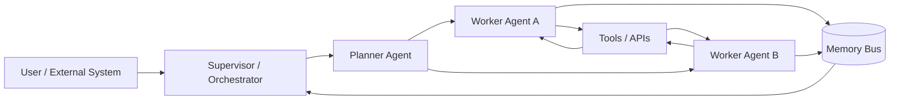
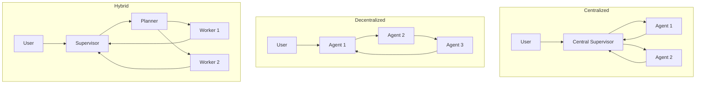
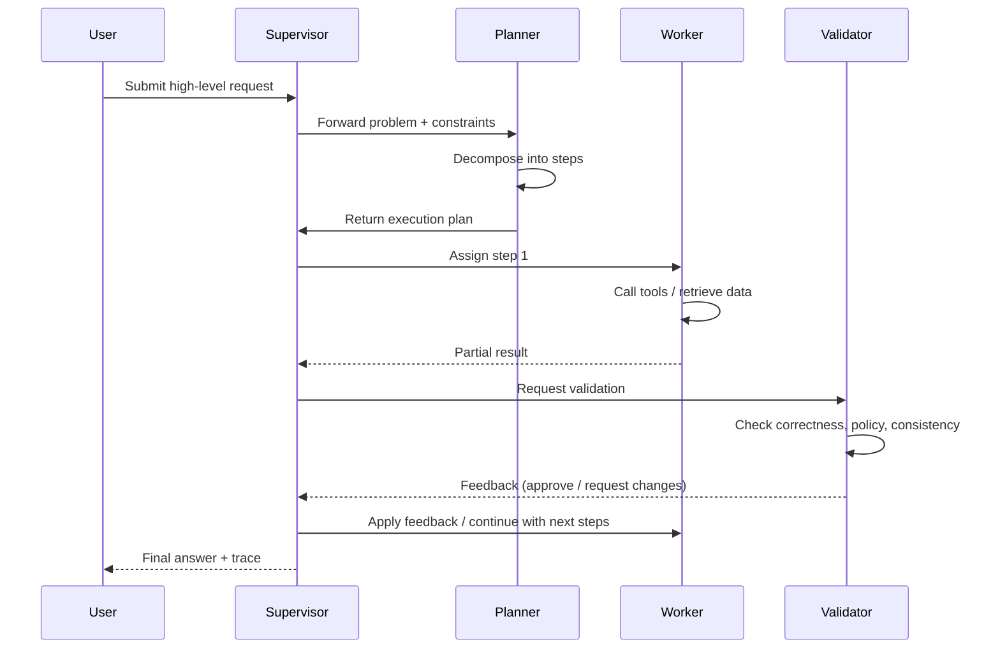
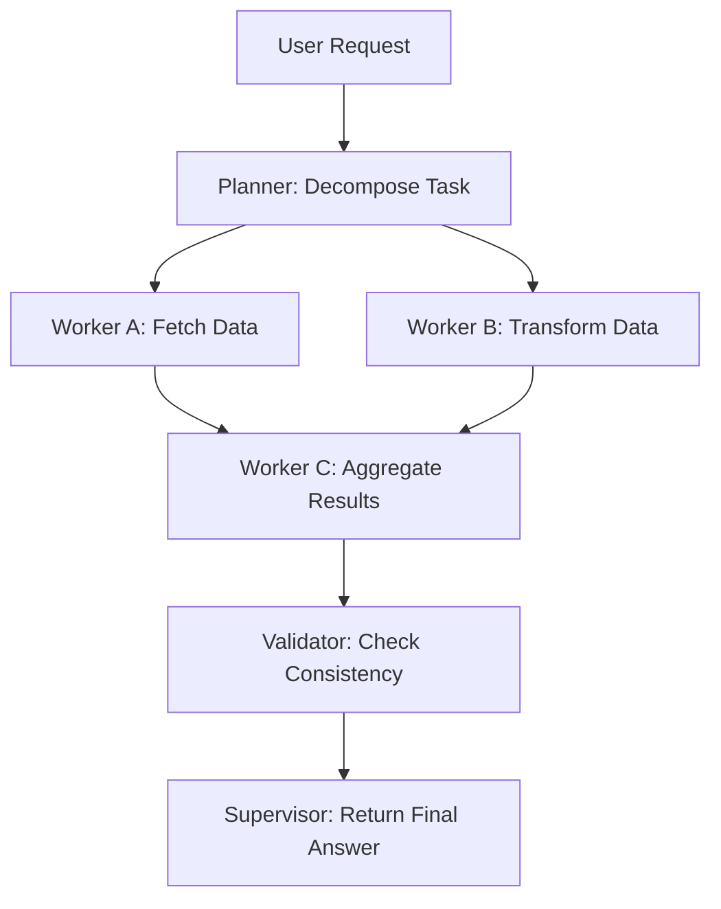
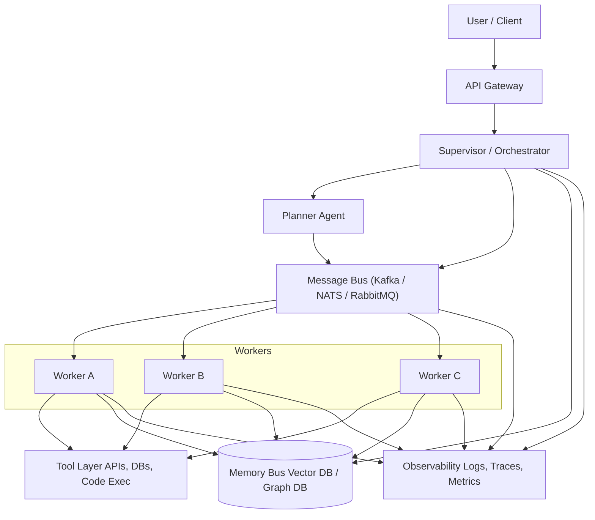

The AI Agents are really useful for automating tasks. We can use them to generate text, analyze data, and even write code. However, their true potential is unlocked when multiple agents collaborate within a structured system.

I think that it was previsible, because we do something similar with microservices, where each service has a specific role and they communicate to achieve a common goal. A microservice alone can do a lot, but a well-orchestrated set of microservices can handle complex workflows efficiently.

And also because of the complexity of real-world tasks. A single agent might struggle to manage all aspects of a task, but a team of specialized agents can divide the workload, verify each other's outputs, and adapt to changing requirements.

This shift—driven by advances in reasoning, tool integration, and memory architectures—has created a new engineering discipline: **multi-agent system design**.

This article provides a deep, systematic exploration of modern multi-agent architectures, coordination protocols, orchestration patterns, memory strategies, and scaling techniques. While the fundamental ideas are inspired by classical Multi-Agent Systems (MAS), the design principles have been adapted to the realities of LLM-driven autonomy.

## Multi-Agent Systems Older Than You Think

While studying multi-agent systems, we usually think that it's a recent concept born with the rise of large language models (LLMs) and AI agents. However, the idea of multiple autonomous entities working together has been around for decades in computer science.

The concept of MAS is an established field in computer science and artificial intelligence, dating back to the 1970s and 1980s. Early research focused on distributed problem-solving, cooperative robotics, and agent communication languages like KQML and FIPA-ACL.

Victor Lesser, a pioneer in the field, is talking about multi-agent systems since the 1980s. Rodney Brooks also contributed significantly with his work on distributed robotics and the subsumption architecture. We also have some notable books like ["Multi-agent systems: An introduction to distributed artificial intelligence"](https://amzn.to/4pwS2Od) by Jacques Ferber (1999). So, while LLMs have revitalized interest in MAS, the foundational concepts have a rich history that an prove useful for modern implementations.

For understanding the base of MAS, we can learn the classical definitions and architectures, and then see how they adapt to the capabilities and challenges of LLM-based agents.

To understand it better, we'll learn the classical definitions. But, first, we need to understand what exaclty is an agent.

### What is an Agent?

An agent is an **autonomous entity** that perceives its environment through sensors and acts upon that environment using actuators to achieve specific goals. The agent has the following characteristics:

- **Autonomy**: Operates without direct human intervention.
- **Perception**: Senses its environment.
- **Reactivity**: Responds to changes in the environment.
- **Pro-activeness**: Takes initiative to achieve goals.
- **Objective-oriented**: Works towards specific objectives.
- **Social ability**: Interacts with other agents.

In the case of classical agents, they were often based on rule-based systems, symbolic reasoning, and deterministic planning. They lacked the generative capabilities of modern LLMs but were designed to perform specific tasks autonomously.

Now we can understand better what is a multi-agent system.

### What is a Multi-Agent System?

A MAS is composed of **multiple autonomous agents** that interact with each other to solve complex problems that would be difficult or impossible for a single agent to handle alone.

These agents can take various forms depending on the context:

- **Software Agents**: Programs that operate in digital environments, such as bots for financial trading, virtual assistants, or web crawlers.
- **Hardware Agents**: Physical devices equipped with sensors and actuators, like IoT devices or drones.
- **Robots**: Autonomous machines capable of performing physical tasks, such as assembly line robots or exploration rovers.
- **Distributed Systems**: Complex systems composed of multiple interconnected components, such as air traffic control systems or smart grids.

Each agent is designed to operate autonomously, perceiving its environment, making decisions, and taking actions to achieve specific goals. In a MAS, these agents collaborate, communicate, or compete to solve problems that exceed the capabilities of any single agent.

### Differences Between Classical MAS and LLM-Based MAS

With the advent of LLMs, the nature of agents has evolved significantly. Now, the agents leverage advanced language models for reasoning, communication, and decision-making. So, the MAS based on LLMs differ from classical MAS in some key aspects:

| **Aspect**          | **Classical MAS**                  | **LLM-Based MAS**                |
|---------------------|------------------------------------|-----------------------------------|
| **Reasoning**       | Rule-based and symbolic logic      | Language generation and learning |
| **Communication**   | Formal languages (e.g., FIPA-ACL) | Natural language + structured JSON |
| **Planning**        | Deterministic                     | Emergent behaviors               |
| **Tool Access**     | Limited                           | Broad integrations (web, APIs, databases) |

LLM-based agents require new patterns for governance, safety, and orchestration due to their generative nature and the complexity of their interactions.

## The Core Architectural Models

Before we dive into specific architectures, it's useful to visualize a generic multi-agent ecosystem.



This diagram represents a typical multi-agent system architecture, showcasing the interaction between different components. At the center of the system is the **Supervisor / Orchestrator**, which acts as the central controller, managing the flow of tasks and ensuring coordination among agents. It assigns tasks to the appropriate agents and monitors their progress. The **Planner Agent** is responsible for breaking down high-level tasks into smaller, manageable subtasks, creating execution plans, and delegating these subtasks to specialized worker agents. These **Worker Agents**, such as Worker Agent A and Worker Agent B, execute specific tasks by interacting with external tools and APIs. They also store or retrieve information from the **Memory Bus**, a shared memory system that ensures consistency and enables collaboration between agents. The **Memory Bus** plays a crucial role in allowing agents to access context or intermediate results, while the **Tools / APIs** provide external resources or functionalities, such as databases, web services, or computational tools, that the agents can leverage to complete their tasks.

These core components can be arranged in various architectural patterns, each with its own trade-offs in terms of scalability, robustness, and complexity. And the power of the modern tools allows us to implement really powerful systems.

Now, let's explore how to orchestrate these components effectively.

## Architectural Patterns

Here I aggregate the main architectural patterns used in multi-agent systems I found in the literature and in practice.

### Centralized Orchestration

In a centralized orchestration model, the **Supervisor** plays a pivotal role as the central controller of the system. It is responsible for coordinating all interactions between agents, ensuring that tasks are assigned appropriately and executed in a structured manner. The Supervisor acts as the brain of the system, maintaining control over the workflow and providing a single point of governance. This approach is particularly useful in scenarios where consistency, safety, and strong oversight are critical.

The Supervisor operates by receiving high-level requests from users or external systems, breaking them down into smaller tasks, and delegating these tasks to specialized agents. It monitors the progress of each agent, collects their outputs, and integrates the results into a cohesive response. This centralized control simplifies debugging and makes it easier to enforce policies and constraints across the system.

However, the centralized model is not without its limitations. The reliance on a single Supervisor creates a potential single point of failure, meaning that if the Supervisor encounters an issue, the entire system could be disrupted. Additionally, scalability can become a challenge as the number of agents and tasks increases, potentially overwhelming the Supervisor and leading to bottlenecks.

And, for me, the most annoying part of working with LLMs is the fact that if you run the same prompts multiple times, you can get different results due to their probabilistic nature. In a centralized orchestration model, this variability can lead to inconsistencies in task execution, as the Supervisor may receive different outputs from agents for the same input. This unpredictability can complicate the coordination process and make it challenging to ensure reliable outcomes.

Despite these drawbacks, centralized orchestration remains a popular choice for systems that require strong governance and predictable behavior. It is particularly effective in environments where tasks are well-defined and the risk of emergent drift or uncoordinated actions needs to be minimized. By maintaining a clear hierarchy and centralized control, the Supervisor ensures that the system operates efficiently and reliably.

### Decentralized Architecture

Agents communicate peer-to-peer, negotiating tasks or sharing information.

Pros: scalable, robust.
Cons: harder to control, emergent drift more likely.

### Hybrid Architecture

Hybrid architectures combine centralized planning with decentralized execution, often providing the best trade-off between control and scalability.

The diagram below contrasts centralized, decentralized, and hybrid approaches:



### Memory Architecture

Memory determines how agents access context:

- **Local memory**: each agent keeps private state.
- **Shared memory**: vector store, graph memory, scratchpad, blackboard.
- **Generated memory**: LLM summarizes state over time.

Good memory design is essential for stability and cost management.

## Communication and Coordination Protocols

### Direct Messaging

Agents communicate through structured messages:

```json
{
  "sender": "planner",
  "receiver": "coder",
  "task": "implement function",
  "context": { ... }
}
```

### Blackboard Model

Agents read and write to a shared knowledge base.
Useful for production workflows and DAG-style processing.

### Auction and Bidding

Agents score themselves for capability and compete for tasks.
Inspired by contract-net protocols.

### Delegated Planning Protocols

A planner decomposes tasks, assigns subtasks, and reconciles results.
This is currently the most robust pattern for multi-step reasoning.

### Negotiation and Consensus

Agents cross-check outputs:

* majority voting
* chain-of-thought consensus
* critic-validation loops

This significantly reduces hallucination.

## Orchestration Patterns

### Supervisor–Worker

The Supervisor assigns tasks, workers execute them.
Ideal for workflows like document processing.

### Role-Based Collaboration

Each agent has a persistent identity (Researcher, Editor, Critic).
Long-lived sessions improve coherence.

### Tool Router Pattern

A router determines which agent or tool should handle a request.
Useful for systems with many plugins or integrations.

### Planner–Executor Pattern

In the planner–executor pattern, one agent is responsible for decomposing the problem and another for executing the concrete steps.

The sequence diagram below shows how a planner, worker, and validator collaborate:



### Critic–Validator Pattern

A Validator reviews outputs from another agent and proposes corrections.

### Self-Correcting Loop

Agents monitor each other for failures:

* timeout detection
* infinite loop detection
* hallucination mitigation


## Implementing Multi-Agent Systems in Practice

### Framework Comparison

* **LangGraph**: graph-based agent orchestration, deterministic execution.
* **AutoGen**: chat-based agent collaboration.
* **CrewAI**: role-based workflows.
* **Custom orchestrators**: maximum flexibility, but more engineering effort.

### Designing Message Schemas

Define schemas for:

* tasks
* errors
* memory updates
* state transitions

Schemas improve traceability and enable migration to message buses.

### Handling State and Memory

Memory strategies:

* sliding window context
* retrieval-augmented memory
* hierarchical memory (short-term + long-term)

### Tooling Layer

A critical layer for:

* code execution
* web access
* SQL queries
* automation pipelines
* API integrations

Tools expand the operational capacity of the agents.

---

## Observability, Debugging, and Governance

Execution traces in multi-agent systems can be represented as DAGs, where each node is an agent action or tool call and edges represent dependencies:



Observability is essential in MAS:

* **Event logs**
* **Conversation graphs**
* **Execution DAGs**
* **Metrics** (latency, accuracy, cooperation quality)
* **Decision traceability**

Governance includes:

* guardrails
* rate limits
* tool whitelisting
* audit logs
* automatic fallbacks

---

## Scaling Multi-Agent Systems

Scaling requires moving beyond in-memory orchestrators.

Strategies include:

* distributing agents across nodes
* adopting message queues (Kafka, NATS, RabbitMQ)
* horizontal scaling via stateless agents
* caching and memory compression
* cost controls (adaptive liveness, dynamic workers)

Scalability transforms a prototype into a production-ready platform.

## Reference Architecture (Blueprint)

A robust multi-agent system typically includes a supervisor, a planner, specialized workers, a shared memory bus, a tool layer, a message bus, and an observability stack.

The diagram below shows a high-level reference architecture:



This blueprint is adaptable for enterprise, research, or automation contexts.

## Best Practices and Anti-Patterns

### Best Practices

* Define clear agent roles.
* Use structured messages, not raw text.
* Add validators for critical steps.
* Constrain tools and privileges.
* Maintain explicit memory boundaries.
* Use deterministic execution where possible.

### Anti-Patterns

* Over-coordination ("meeting hell").
* Agents re-explaining tasks to each other.
* Infinite loops due to unclear control flow.
* Unbounded context growth.
* Autonomous actions without supervision.

## Future Directions

Trends in MAS engineering:

* **Autonomous swarms** with emergent coordination
* **Neuro-symbolic hybrid agents**
* **Organization-inspired memory topologies**
* **LLM-based operating systems** enabling native agent ecosystems

We are witnessing the early steps toward distributed artificial cognition.

## Conclusion

Multi-agent systems represent a natural and necessary next step in AI engineering. They offer enhanced scalability, robustness, and modularity—attributes essential for real-world software.

By combining structured cognition (planning, memory, orchestration) with generative intelligence, engineers can build systems that approximate complex human workflows at scale.

Whether applied to enterprise automation, research systems, or developer tools, MAS architectures will define the next generation of AI applications.
