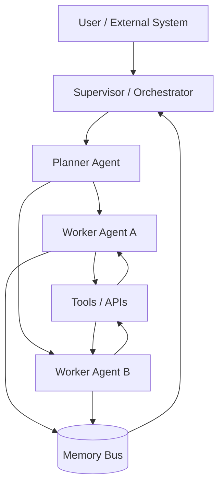
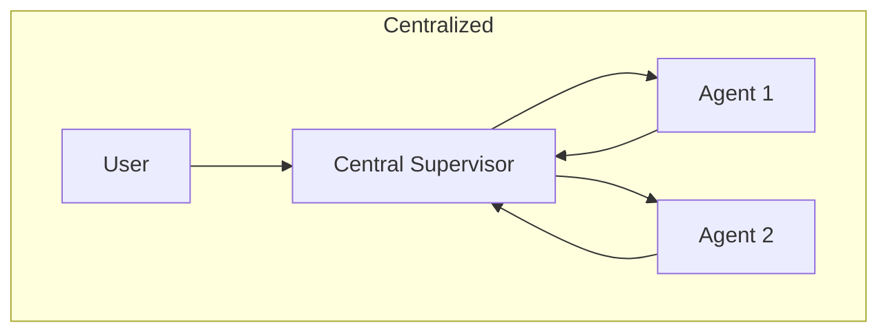
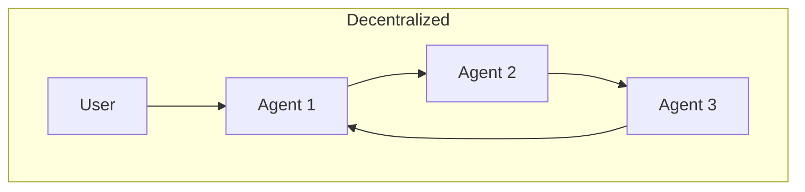
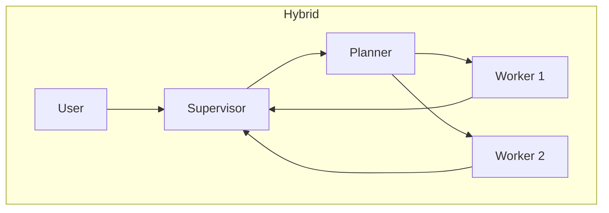
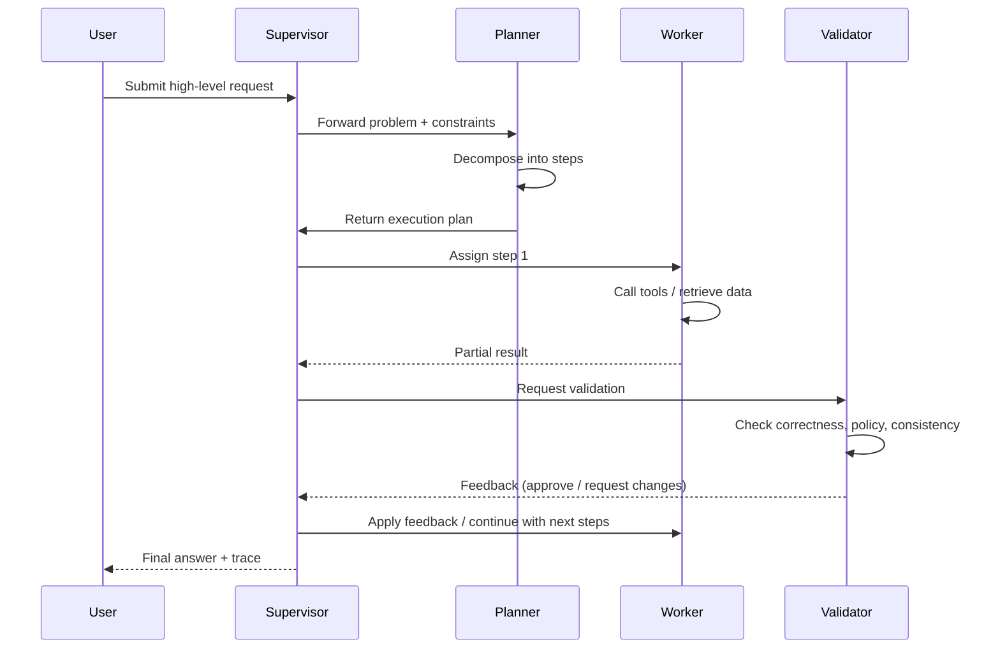
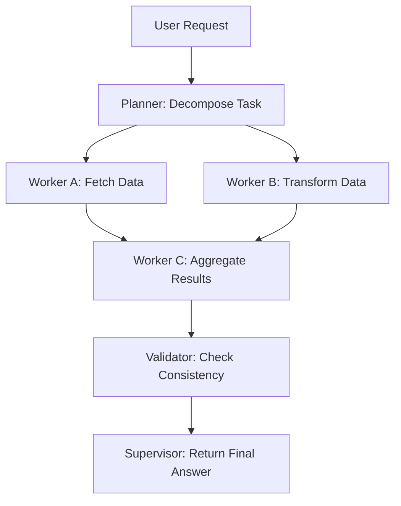
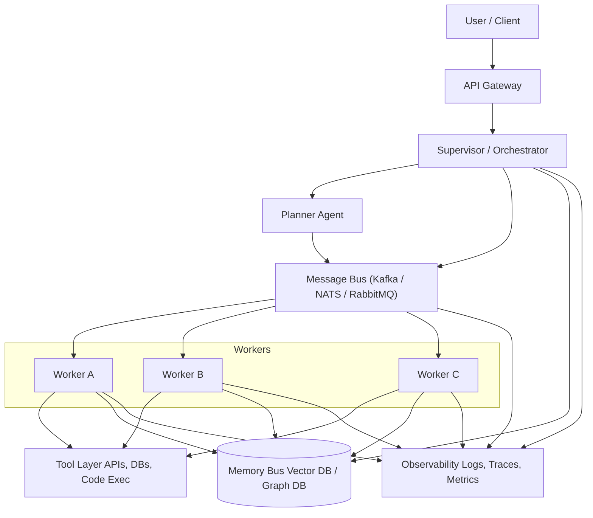

The AI Agents are really useful for automating tasks. We can use them to generate text, analyze data, and even write code. However, their true potential is unlocked when multiple agents collaborate within a structured system.

I think that it was previsible, because we do something similar with microservices, where each service has a specific role and they communicate to achieve a common goal. A microservice alone can do a lot, but a well-orchestrated set of microservices can handle complex workflows efficiently.

And also because of the complexity of real-world tasks. A single agent might struggle to manage all aspects of a task, but a team of specialized agents can divide the workload, verify each other's outputs, and adapt to changing requirements.

This shift—driven by advances in reasoning, tool integration, and memory architectures—has created a new engineering discipline: **multi-agent system design**.

This article provides a deep, systematic exploration of modern multi-agent architectures, coordination protocols, orchestration patterns, memory strategies, and scaling techniques. While the fundamental ideas are inspired by classical Multi-Agent Systems (MAS), the design principles have been adapted to the realities of LLM-driven autonomy.

## Multi-Agent Systems Older Than You Think

While studying multi-agent systems, we usually think that it's a recent concept born with the rise of large language models (LLMs) and AI agents. However, the idea of multiple autonomous entities working together has been around for decades in computer science.

The concept of MAS is an established field in computer science and artificial intelligence, dating back to the 1970s and 1980s. Early research focused on distributed problem-solving, cooperative robotics, and agent communication languages like KQML and FIPA-ACL.

Victor Lesser, a pioneer in the field, is talking about multi-agent systems since the 1980s. Rodney Brooks also contributed significantly with his work on distributed robotics and the subsumption architecture. We also have some notable books like ["Multi-agent systems: An introduction to distributed artificial intelligence"](https://amzn.to/4pwS2Od) by Jacques Ferber (1999). So, while LLMs have revitalized interest in MAS, the foundational concepts have a rich history that an prove useful for modern implementations.

For understanding the base of MAS, we can learn the classical definitions and architectures, and then see how they adapt to the capabilities and challenges of LLM-based agents.

To understand it better, we'll learn the classical definitions. But, first, we need to understand what exaclty is an agent.

### What is an Agent?

An agent is an **autonomous entity** that perceives its environment through sensors and acts upon that environment using actuators to achieve specific goals. The agent has the following characteristics:

- **Autonomy**: Operates without direct human intervention.
- **Perception**: Senses its environment.
- **Reactivity**: Responds to changes in the environment.
- **Pro-activeness**: Takes initiative to achieve goals.
- **Objective-oriented**: Works towards specific objectives.
- **Social ability**: Interacts with other agents.

In the case of classical agents, they were often based on rule-based systems, symbolic reasoning, and deterministic planning. They lacked the generative capabilities of modern LLMs but were designed to perform specific tasks autonomously.

Now we can understand better what is a multi-agent system.

### What is a Multi-Agent System?

A MAS is composed of **multiple autonomous agents** that interact with each other to solve complex problems that would be difficult or impossible for a single agent to handle alone.

These agents can take various forms depending on the context:

- **Software Agents**: Programs that operate in digital environments, such as bots for financial trading, virtual assistants, or web crawlers.
- **Hardware Agents**: Physical devices equipped with sensors and actuators, like IoT devices or drones.
- **Robots**: Autonomous machines capable of performing physical tasks, such as assembly line robots or exploration rovers.
- **Distributed Systems**: Complex systems composed of multiple interconnected components, such as air traffic control systems or smart grids.

Each agent is designed to operate autonomously, perceiving its environment, making decisions, and taking actions to achieve specific goals. In a MAS, these agents collaborate, communicate, or compete to solve problems that exceed the capabilities of any single agent.

### Differences Between Classical MAS and LLM-Based MAS

With the advent of LLMs, the nature of agents has evolved significantly. Now, the agents leverage advanced language models for reasoning, communication, and decision-making. So, the MAS based on LLMs differ from classical MAS in some key aspects:

| **Aspect**          | **Classical MAS**                  | **LLM-Based MAS**                |
|---------------------|------------------------------------|-----------------------------------|
| **Reasoning**       | Rule-based and symbolic logic      | Language generation and learning |
| **Communication**   | Formal languages (e.g., FIPA-ACL) | Natural language + structured JSON |
| **Planning**        | Deterministic                     | Emergent behaviors               |
| **Tool Access**     | Limited                           | Broad integrations (web, APIs, databases) |

LLM-based agents require new patterns for governance, safety, and orchestration due to their generative nature and the complexity of their interactions.

## The Core Architectural Models

Before we dive into specific architectures, it's useful to visualize a generic multi-agent ecosystem.



This diagram represents a typical multi-agent system architecture, showcasing the interaction between different components. At the center of the system is the **Supervisor / Orchestrator**, which acts as the central controller, managing the flow of tasks and ensuring coordination among agents. It assigns tasks to the appropriate agents and monitors their progress. The **Planner Agent** is responsible for breaking down high-level tasks into smaller, manageable subtasks, creating execution plans, and delegating these subtasks to specialized worker agents. These **Worker Agents**, such as Worker Agent A and Worker Agent B, execute specific tasks by interacting with external tools and APIs. They also store or retrieve information from the **Memory Bus**, a shared memory system that ensures consistency and enables collaboration between agents. The **Memory Bus** plays a crucial role in allowing agents to access context or intermediate results, while the **Tools / APIs** provide external resources or functionalities, such as databases, web services, or computational tools, that the agents can leverage to complete their tasks.

These core components can be arranged in various architectural patterns, each with its own trade-offs in terms of scalability, robustness, and complexity. And the power of the modern tools allows us to implement really powerful systems.

Now, let's explore how to orchestrate these components effectively.

## Architectural Patterns

Here I aggregate the main architectural patterns used in multi-agent systems I found in the literature and in practice.

### Centralized Orchestration

In a centralized orchestration model, the **Supervisor** plays a pivotal role as the central controller of the system. It is responsible for coordinating all interactions between agents, ensuring that tasks are assigned appropriately and executed in a structured manner. The Supervisor acts as the brain of the system, maintaining control over the workflow and providing a single point of governance. This approach is particularly useful in scenarios where consistency, safety, and strong oversight are critical.

The Supervisor operates by receiving high-level requests from users or external systems, breaking them down into smaller tasks, and delegating these tasks to specialized agents. It monitors the progress of each agent, collects their outputs, and integrates the results into a cohesive response. This centralized control simplifies debugging and makes it easier to enforce policies and constraints across the system.

However, the centralized model is not without its limitations. The reliance on a single Supervisor creates a potential single point of failure, meaning that if the Supervisor encounters an issue, the entire system could be disrupted. Additionally, scalability can become a challenge as the number of agents and tasks increases, potentially overwhelming the Supervisor and leading to bottlenecks.

And, for me, the most annoying part of working with LLMs is the fact that if you run the same prompts multiple times, you can get different results due to their probabilistic nature. In a centralized orchestration model, this variability can lead to inconsistencies in task execution, as the Supervisor may receive different outputs from agents for the same input. This unpredictability can complicate the coordination process and make it challenging to ensure reliable outcomes.

Despite these drawbacks, centralized orchestration remains a popular choice for systems that require strong governance and predictable behavior. It is particularly effective in environments where tasks are well-defined and the risk of emergent drift or uncoordinated actions needs to be minimized. By maintaining a clear hierarchy and centralized control, the Supervisor ensures that the system operates efficiently and reliably.

### Decentralized Architecture

In a decentralized architecture, agents operate independently and communicate directly with one another in a peer-to-peer manner. This model eliminates the need for a central controller, allowing agents to negotiate tasks, share information, and collaborate autonomously. The decentralized approach is particularly well-suited for systems that require high scalability and robustness, as it distributes the workload across multiple agents and avoids reliance on a single point of control.

The peer-to-peer communication enables agents to adapt dynamically to changes in the environment, making the system more resilient to failures. For example, if one agent becomes unavailable, others can step in to fulfill its role without disrupting the overall operation. This flexibility makes decentralized architectures ideal for applications such as distributed sensor networks, swarm robotics, and blockchain-based systems.

However, the lack of centralized oversight introduces challenges in maintaining control and consistency. Without a central authority, it can be difficult to enforce global policies or ensure that all agents are working towards the same objectives. Additionally, decentralized systems are prone to emergent drift, where individual agents may deviate from their intended behavior due to local interactions or conflicting goals. This can lead to unpredictable outcomes and require sophisticated mechanisms for coordination and conflict resolution.

Despite these challenges, decentralized architectures offer significant advantages in terms of scalability and fault tolerance. By leveraging the collective intelligence of autonomous agents, these systems can achieve complex goals that would be difficult to accomplish with a centralized approach.

### Hybrid Architecture

Hybrid architectures combine centralized planning with decentralized execution, often providing the best trade-off between control and scalability.

Hybrid architectures are particularly useful in scenarios where tasks require both structured planning and flexible execution. For example, in a logistics system, a centralized planner might optimize delivery routes, while individual delivery agents adapt to real-time traffic conditions and customer requests. Similarly, in a research environment, a supervisor could assign research topics to teams, while the teams independently explore and share findings.


The diagrams below illustrate the differences between centralized, decentralized, and hybrid architectures, highlighting how hybrid models leverage the best aspects of both approaches:








Despite their advantages, hybrid architectures also come with challenges. The integration of centralized and decentralized components requires careful design to ensure seamless communication and coordination. Additionally, the system must balance the trade-offs between control and autonomy, avoiding excessive centralization that could stifle flexibility or over-decentralization that might lead to inconsistencies.

### Memory Architecture

Memory determines how agents access and manage context, which is critical for their performance and efficiency. The choice of memory architecture can significantly impact the stability, scalability, and cost-effectiveness of a multi-agent system. Here are the primary types of memory architectures and their implications.

#### Local Memory

Each agent maintains its own private state, which is isolated from other agents. We can keep it in a `Dict`, for example. This approach is simple and ensures that agents operate independently, but it can lead to inefficiencies when agents need to share or synchronize information. Local memory is often used in decentralized systems where autonomy is prioritized. However, the lack of shared context can result in redundant computations, as agents may duplicate efforts to gather or process the same information, indirectly increasing resource usage and costs.

#### Shared Memory

A centralized memory system, such as a vector store, graph memory, scratchpad, or blackboard, is accessible to all agents. This allows agents to collaborate more effectively by sharing context and intermediate results. Shared memory is particularly useful in systems that require high levels of coordination, such as collaborative problem-solving or workflows with interdependent tasks. However, maintaining a shared memory system introduces additional costs related to infrastructure, such as the need for high-performance storage solutions and mechanisms to handle concurrency. If not optimized, shared memory can become a bottleneck, leading to increased latency and higher operational expenses.

#### Generated Memory

In this model, memory is dynamically generated by summarizing the state over time, often using LLMs. For example, an LLM can create summaries of interactions, decisions, or task progress, which can then be used as context for future actions. You can see it when using Claude and, sometimes, the memory is compressed. Generated memory is highly flexible and can adapt to evolving requirements, but it may incur higher computational costs due to the processing power required to generate and update summaries. Additionally, if the summarization process is not carefully designed, important details may be lost, potentially leading to errors or inefficiencies that require further computation to resolve.

Good memory design is essential for ensuring that agents can operate efficiently and effectively. A well-architected memory system balances the trade-offs between autonomy, collaboration, and resource utilization. For instance, combining local and shared memory can provide a hybrid approach that leverages the strengths of both models while mitigating their weaknesses. Similarly, incorporating generated memory can enhance the adaptability and long-term coherence of the system. By carefully considering the specific needs of the system and the trade-offs of each memory model, engineers can minimize costs while maximizing performance and scalability.

## Communication and Coordination Protocols

Effective communication and coordination are the backbone of any multi-agent system. These protocols define how agents interact, share information, and collaborate to achieve their goals. In this section, we will explore various communication and coordination protocols, starting with direct messaging.

### Direct Messaging

Direct messaging is one of the simplest and most intuitive forms of communication between agents. In this model, agents exchange structured messages directly with one another, specifying the sender, receiver, task, and any relevant context. This approach is highly efficient for systems with a small number of agents or well-defined communication patterns.

For example, a planner agent might send a message to a coder agent to implement a specific function:

```json
{
  "sender": "planner",
  "receiver": "coder",
  "task": "implement function",
  "context": {
    "functionName": "calculateTotal",
    "parameters": ["price", "quantity"],
    "returnType": "float",
    "description": "This function should return the total cost by multiplying price and quantity."
  }
}
```

Direct messaging offers several advantages:

- **Simplicity**: The communication model is straightforward to implement and debug.
- **Low Latency**: Messages are sent directly between agents, minimizing delays.
- **Fine-Grained Control**: Agents can tailor messages to the specific needs of the receiver.

However, there are also challenges to consider:

- **Scalability**: As the number of agents increases, managing direct connections between all agents can become complex.
- **Error Handling**: If a message is lost or an agent is unavailable, the system must have mechanisms to handle these failures.
- **Coordination Overhead**: In systems with many interdependent tasks, direct messaging can lead to a high volume of communication, increasing the risk of bottlenecks.

Despite these challenges, direct messaging remains a foundational communication protocol in multi-agent systems, particularly in scenarios where simplicity and low latency are prioritized. By designing clear and structured message schemas, engineers can ensure reliable and efficient communication between agents.

### Blackboard Model

The blackboard model is a coordination mechanism where agents interact through a shared knowledge base, often referred to as the "blackboard." This model is inspired by the way humans collaborate on a physical blackboard, where individuals contribute ideas, refine them, and build upon each other's work. In a multi-agent system, the blackboard serves as a central repository for information, enabling agents to read from and write to a shared context.

This approach is particularly useful in scenarios that involve production workflows, data aggregation, or directed acyclic graph(DAG)-style processing. For example, in a workflow where multiple agents are responsible for different stages of data processing, the blackboard can act as a staging area where intermediate results are stored and accessed by subsequent agents.

#### Advantages of the Blackboard Model

The blackboard model offers several key advantages that make it a powerful coordination mechanism in multi-agent systems. First, it provides a **centralized context**, acting as a unified repository where agents can collaborate and share information seamlessly. This centralized view simplifies the coordination process and ensures that all agents have access to the same state of the system.

Another significant advantage is its **flexibility**. Agents can operate asynchronously, contributing to the blackboard whenever they have new information or results. This asynchronous operation allows the system to handle dynamic and unpredictable workflows efficiently.

The model also supports **scalability**, as new agents can be added dynamically without requiring changes to existing communication protocols. This makes the blackboard model particularly suitable for systems that need to grow or adapt over time. Additionally, the blackboard can maintain a history of changes, enhancing **traceability**. This feature is invaluable for debugging and observability, as it provides a clear record of the system's operations.

#### Challenges of the Blackboard Model

Despite its advantages, the blackboard model comes with its own set of challenges. One of the primary issues is **concurrency management**. When multiple agents attempt to read from or write to the blackboard simultaneously, conflicts can arise. To address this, the system must implement robust mechanisms to ensure consistency and prevent data corruption.

Another challenge is the potential for **bottlenecks**. If too many agents rely on the blackboard for communication, it can become a performance bottleneck, especially in high-throughput systems. This can lead to delays and reduced efficiency, particularly in scenarios with a large number of agents or high-frequency updates.

Finally, the blackboard model may introduce **infrastructure overhead**. Implementing a robust blackboard system often requires additional resources, such as high-performance storage solutions and synchronization mechanisms. These requirements can increase the complexity and cost of the system, making it less suitable for resource-constrained environments.

### Auction and Bidding

The auction and bidding model is a dynamic coordination mechanism where agents compete for tasks based on their capabilities. This approach is inspired by contract-net protocols, which are widely used in distributed systems to allocate resources and responsibilities efficiently.

In this model, a central agent or task manager announces a task to the system, providing details such as the task requirements, constraints, and expected outcomes. The other agents, acting as bidders, evaluate their own capabilities and resources to determine whether they are suitable for the task. Each bidder then submits a proposal, often including a score or bid that reflects their ability to complete the task effectively.

The task manager reviews the proposals and selects the agent with the highest score or the most favorable bid. This selection process ensures that tasks are assigned to the most capable agents, optimizing the overall performance of the system.

For example, in a logistics system, a central planner might announce a delivery task. Agents representing delivery vehicles evaluate factors such as their current location, fuel levels, and cargo capacity. Each agent submits a bid based on these factors, and the planner assigns the task to the vehicle that can complete it most efficiently.

This model offers several advantages. It promotes competition among agents, encouraging them to optimize their performance. It also provides a flexible and scalable way to allocate tasks, as new agents can join the system and participate in auctions without disrupting existing workflows. Additionally, the bidding process ensures that tasks are assigned based on objective criteria, reducing the risk of suboptimal allocations.

However, the auction and bidding model also presents challenges. The bidding process can introduce latency, particularly in systems with a large number of agents or complex tasks. Ensuring fairness and preventing collusion among agents requires careful design and monitoring. Moreover, the computational overhead of evaluating bids and managing auctions can be significant, especially in high-frequency systems.

Despite these challenges, the auction and bidding model remains a powerful tool for coordinating multi-agent systems, particularly in scenarios where tasks vary in complexity and agents have diverse capabilities.

## Orchestration Patterns

### Supervisor–Worker

The Supervisor–Worker pattern is a orchestration model where a central Supervisor assigns tasks to one or more Worker agents, who then execute these tasks. This pattern is particularly effective for workflows that involve repetitive or well-defined tasks, such as document processing, data transformation, or batch operations.

The Supervisor acts as the central coordinator, receiving high-level requests from users or external systems. It breaks these requests into smaller, manageable tasks and delegates them to Worker agents. Each Worker operates independently, focusing solely on the task assigned to it. Once the task is completed, the Worker reports the results back to the Supervisor, which integrates the outputs and provides a cohesive response to the user.

This pattern offers several advantages. It simplifies the overall system design by clearly separating the roles of coordination and execution. The Supervisor can focus on managing workflows and ensuring that tasks are distributed efficiently, while Workers can specialize in executing specific types of tasks. This separation of concerns enhances modularity and makes the system easier to scale, as additional Workers can be added to handle increased workloads.

However, the Supervisor–Worker pattern also has limitations. The reliance on a central Supervisor creates a potential single point of failure. If the Supervisor becomes overwhelmed or encounters an issue, the entire system's operation can be disrupted. Additionally, the pattern may not be well-suited for tasks that require high levels of inter-agent collaboration or dynamic decision-making.

Despite these challenges, the Supervisor–Worker pattern remains a popular choice for systems that prioritize simplicity, modularity, and scalability. By clearly defining the roles of Supervisor and Worker agents, this pattern provides a robust framework for orchestrating multi-agent workflows.

### Role-Based Collaboration

Role-Based Collaboration is an orchestration pattern where each agent is assigned a specific role, such as Researcher, Editor, or Critic. These roles are persistent, meaning that agents retain their identities and responsibilities throughout the system's operation. This approach is particularly effective for long-lived sessions where coherence and continuity are critical.

In this pattern, agents collaborate by leveraging their specialized roles to achieve a common goal. For example, in a content creation system, a Researcher agent might gather information, an Editor agent might refine the content, and a Critic agent might review the final output for quality and consistency. By dividing responsibilities based on roles, the system can ensure that each aspect of the workflow is handled by an agent with the appropriate expertise.

Role-Based Collaboration offers several benefits. It enhances the system's coherence by maintaining consistent agent identities and responsibilities. This consistency is particularly valuable in long-running workflows, where agents need to build and maintain context over time. Additionally, the pattern promotes specialization, allowing agents to develop expertise in their assigned roles and perform their tasks more effectively.

However, this pattern also introduces challenges. The reliance on persistent roles can make the system less flexible, as agents may be less adaptable to changing requirements or unexpected tasks. Additionally, the pattern requires careful coordination to ensure that agents work together effectively and do not duplicate efforts or conflict with one another.

Despite these challenges, Role-Based Collaboration is a powerful pattern for systems that require long-lived sessions and specialized expertise. By assigning persistent roles to agents, this pattern enables coherent and efficient collaboration in complex workflows.

### Tool Router Pattern

The Tool Router Pattern is an orchestration model designed for systems with a wide variety of tools or integrations. In this pattern, a central router determines which agent or tool should handle a given request, based on the request's nature and requirements. This approach is particularly useful for systems that need to manage diverse tasks and leverage multiple specialized tools.

The router acts as the decision-maker, analyzing incoming requests and routing them to the most appropriate agent or tool. For example, in a customer support system, the router might direct technical queries to a troubleshooting agent, billing inquiries to a finance agent, and general questions to a chatbot. By dynamically routing requests, the system can ensure that each task is handled by the most suitable resource.

This pattern offers several advantages. It enhances the system's flexibility by allowing new tools or agents to be added without disrupting existing workflows. The router can also optimize task allocation based on real-time conditions, such as agent availability or workload. Additionally, the pattern simplifies the user experience by providing a single entry point for all requests, which are then routed to the appropriate resource.

However, the Tool Router Pattern also has limitations. The reliance on a central router creates a potential bottleneck, as the router must process and route all incoming requests. This can lead to latency in high-throughput systems. Additionally, the pattern requires robust decision-making logic to ensure that requests are routed accurately and efficiently.

Despite these challenges, the Tool Router Pattern is a valuable model for systems that need to manage diverse tasks and leverage multiple tools. By centralizing the routing logic, this pattern enables efficient and flexible orchestration in complex multi-agent systems.

### Planner–Executor Pattern

The Planner–Executor Pattern is a widely used orchestration model in multi-agent systems, designed to separate the responsibilities of planning and execution. This separation allows for a clear division of labor, where one agent focuses on decomposing high-level problems into actionable steps, and another agent specializes in executing these steps efficiently.

In this pattern, the Planner agent acts as the strategic thinker. It receives a high-level request, analyzes the problem, and breaks it down into smaller, manageable tasks. These tasks are then organized into an execution plan, which is passed on to the Executor agent. The Executor, in turn, focuses on carrying out these tasks, often interacting with tools, APIs, or other resources to achieve the desired outcomes.

The sequence diagram below illustrates the collaboration between the Planner, Executor, and Validator agents:



The Planner–Executor Pattern offers several key advantages. By separating planning and execution, agents can specialize in their respective roles, which leads to more efficient and effective task handling. This pattern also supports scalability, since multiple Executors can be deployed to handle different tasks in parallel, all guided by a single Planner. In addition, the Planner can dynamically adapt the execution plan based on feedback or changing requirements, ensuring that the system remains responsive to new challenges. Finally, the inclusion of a Validator agent adds an extra layer of quality control, helping ensure that outputs meet the required standards before being finalized.

Despite its benefits, the Planner–Executor Pattern also introduces some challenges. The interaction between Planner, Executor, and Validator agents demands robust communication protocols to maintain smooth coordination, which can add coordination overhead. Furthermore, the sequential nature of planning, execution, and validation may introduce latency, especially in time-sensitive applications. Implementing this pattern also increases system complexity, as it requires careful design to manage dependencies and to ensure that tasks are executed in the correct order.

The Planner–Executor Pattern is particularly well-suited for scenarios involving complex problem-solving or workflows with multiple interdependent steps. In software development, for example, a Planner agent can generate a development roadmap, while Executor agents implement specific features or fix bugs. In logistics, a Planner might optimize delivery routes, and Executors would handle the actual transportation of goods. In research settings, a Planner could outline a research agenda, while Executors conduct experiments or gather data. By leveraging the Planner–Executor Pattern in these kinds of contexts, multi-agent systems can achieve a high degree of organization and efficiency, making it a valuable model for a wide range of applications.


### Critic–Validator Pattern

The Critic–Validator Pattern is an orchestration model designed to enhance the quality and reliability of outputs in multi-agent systems. In this pattern, a Validator agent reviews the outputs generated by another agent, known as the Critic, and proposes corrections or improvements. This iterative process ensures that the final output meets the desired standards of accuracy, consistency, and quality.

The Critic agent is responsible for generating an initial output based on the task requirements. This output is then passed to the Validator agent, which evaluates it against predefined criteria, such as correctness, policy adherence, and logical consistency. If the Validator identifies any issues, it provides feedback to the Critic, who revises the output accordingly. This cycle continues until the Validator approves the output or the system reaches a predefined iteration limit.

By incorporating a validation step, this pattern ensures that outputs are thoroughly reviewed and refined, leading to higher-quality results. The Validator plays a crucial role in identifying and addressing errors or inconsistencies that might be overlooked in a single-pass system. The separation of roles between the Critic and Validator promotes accountability, as each agent focuses on its specific responsibilities. Furthermore, the iterative nature of this pattern allows the system to adapt to complex or evolving requirements by refining outputs over multiple iterations.

However, the iterative process can introduce delays, particularly in time-sensitive applications. Effective communication between the Critic and Validator is essential to avoid misunderstandings or redundant iterations, which can add coordination overhead. Additionally, the additional computational resources required for validation and iteration can increase system costs, making resource consumption another challenge to consider.

### Self-Correcting Loop

The Self-Correcting Loop is an orchestration pattern where agents actively monitor each other to detect and address failures, ensuring the system remains robust and reliable. This pattern is particularly useful in dynamic environments where unexpected issues can arise, and immediate corrective actions are necessary to maintain system stability.

In this model, agents are designed to identify specific types of failures during their interactions. For instance, timeout detection allows agents to recognize when a task or response is taking longer than expected, prompting them to either retry the operation or escalate the issue to another agent. Similarly, infinite loop detection ensures that agents do not get stuck in repetitive or unproductive cycles, which could otherwise consume resources and hinder overall system performance. Another critical aspect of this pattern is hallucination mitigation, where agents verify the accuracy and relevance of generated outputs to prevent the propagation of incorrect or misleading information.

By continuously monitoring each other, agents in a Self-Correcting Loop can collaboratively maintain the integrity and efficiency of the system. This proactive approach not only minimizes the impact of individual failures but also enhances the system's ability to adapt to changing conditions and recover from errors in real time. However, implementing this pattern requires careful design to ensure that monitoring processes do not introduce excessive overhead or complexity, which could negate the benefits of the approach.

## Implementing Multi-Agent Systems in Practice

### Framework Comparison

* **LangGraph**: graph-based agent orchestration, deterministic execution.
* **AutoGen**: chat-based agent collaboration.
* **CrewAI**: role-based workflows.
* **Custom orchestrators**: maximum flexibility, but more engineering effort.

### Designing Message Schemas

Define schemas for:

* tasks
* errors
* memory updates
* state transitions

Schemas improve traceability and enable migration to message buses.

### Handling State and Memory

Memory strategies:

* sliding window context
* retrieval-augmented memory
* hierarchical memory (short-term + long-term)

### Tooling Layer

A critical layer for:

* code execution
* web access
* SQL queries
* automation pipelines
* API integrations

Tools expand the operational capacity of the agents.

---

## Observability, Debugging, and Governance

Execution traces in multi-agent systems can be represented as DAGs, where each node is an agent action or tool call and edges represent dependencies:



Observability is essential in MAS:

* **Event logs**
* **Conversation graphs**
* **Execution DAGs**
* **Metrics** (latency, accuracy, cooperation quality)
* **Decision traceability**

Governance includes:

* guardrails
* rate limits
* tool whitelisting
* audit logs
* automatic fallbacks

---

## Scaling Multi-Agent Systems

Scaling requires moving beyond in-memory orchestrators.

Strategies include:

* distributing agents across nodes
* adopting message queues (Kafka, NATS, RabbitMQ)
* horizontal scaling via stateless agents
* caching and memory compression
* cost controls (adaptive liveness, dynamic workers)

Scalability transforms a prototype into a production-ready platform.

## Reference Architecture (Blueprint)

A robust multi-agent system typically includes a supervisor, a planner, specialized workers, a shared memory bus, a tool layer, a message bus, and an observability stack.

The diagram below shows a high-level reference architecture:



This blueprint is adaptable for enterprise, research, or automation contexts.

## Best Practices and Anti-Patterns

### Best Practices

* Define clear agent roles.
* Use structured messages, not raw text.
* Add validators for critical steps.
* Constrain tools and privileges.
* Maintain explicit memory boundaries.
* Use deterministic execution where possible.

### Anti-Patterns

* Over-coordination ("meeting hell").
* Agents re-explaining tasks to each other.
* Infinite loops due to unclear control flow.
* Unbounded context growth.
* Autonomous actions without supervision.

## Future Directions

Trends in MAS engineering:

* **Autonomous swarms** with emergent coordination
* **Neuro-symbolic hybrid agents**
* **Organization-inspired memory topologies**
* **LLM-based operating systems** enabling native agent ecosystems

We are witnessing the early steps toward distributed artificial cognition.

## Conclusion

Multi-agent systems represent a natural and necessary next step in AI engineering. They offer enhanced scalability, robustness, and modularity—attributes essential for real-world software.

By combining structured cognition (planning, memory, orchestration) with generative intelligence, engineers can build systems that approximate complex human workflows at scale.

Whether applied to enterprise automation, research systems, or developer tools, MAS architectures will define the next generation of AI applications.
