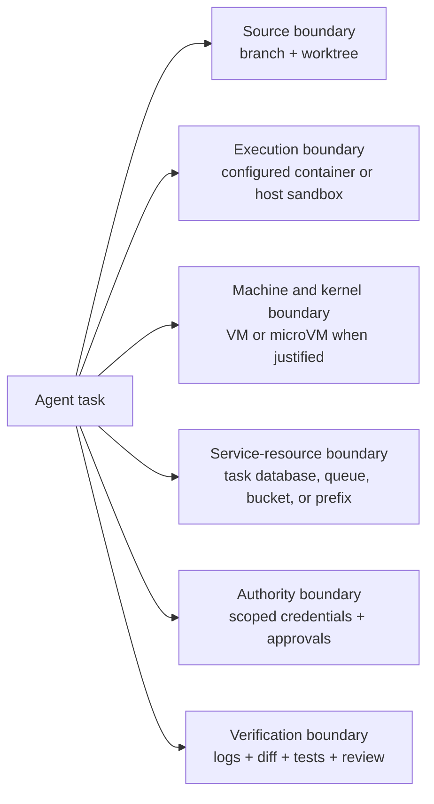
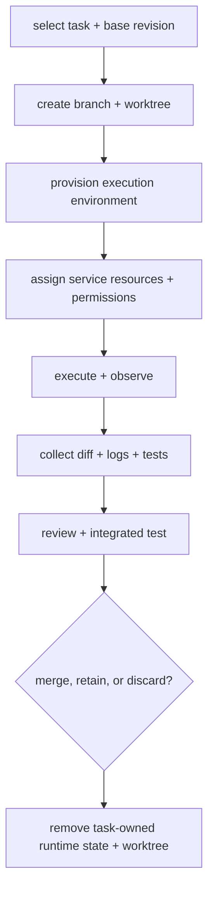

In my [previous investigation of Git worktrees](/posts/why-git-worktrees-matter-coding-agents/), I reached this boundary:

> A worktree isolates checked-out source state. It does not isolate processes, ports, dependencies, databases, credentials, networks, or external services.

A separate checkout is enough while an agent only changes files. Once it can install packages, start servers, create containers, run migrations, call external tools, or use inherited credentials, the working directory becomes only one part of the shared state.

A container is an obvious next answer, but it is a configurable set of process, filesystem, identity, network, and resource controls—not a fixed security boundary. That led me to a broader question:

> If a coding agent can execute the project, what should an efficient and reasonably safe local task environment isolate?

I will use Docker and Compose for the practical examples, but the model also applies to other container, VM, and sandbox runtimes.

## Worktrees gave the task a separate checkout

The [official Git worktree documentation](https://git-scm.com/docs/git-worktree) describes one repository with multiple working trees. Each linked worktree has its own checked-out files and per-worktree state such as `HEAD` and the index, while most repository metadata, refs, and objects remain shared.

The resulting source boundary is useful but narrow:

| Separate in a linked worktree | Still shared or reachable elsewhere |
|---|---|
| Checked-out files | Git object database and most refs |
| `HEAD` | Host processes |
| Index | Global and user-level configuration |
| Directory-local untracked files | Ports and network interfaces |
| Task-level diff | Package stores and build caches |
| Ignored files created inside that directory | Databases, queues, buckets, and cloud accounts |

A worktree is a coordination and inspectability mechanism, not an access-control boundary. A process that can read other paths on the host is not prevented from entering the primary checkout, the common Git directory, `~/.ssh`, or a cloud CLI configuration merely because it started in a linked worktree.

A branch is also not a separate history store. In Git, it is a movable ref that names a line of development. A worktree supplies another checked-out view over the same repository. Neither creates another machine.

The boundary ends when the agent executes the project:

```sh
pnpm install
pnpm dev
docker compose up
pnpm db:migrate
pnpm test
```

## The working directory is not the only shared state

Each command crosses a different boundary:

| Command | State it may touch outside the source checkout |
|---|---|
| `pnpm install` | Registry network, package store, project hooks, approved dependency build scripts, credentials, and `node_modules` |
| `pnpm dev` | Processes, ports, temporary files, file watchers, and local services |
| `docker compose up` | Docker daemon, images, build cache, global host ports, networks, volumes, and bind-mounted paths |
| `pnpm db:migrate` | A database, its schema and data, migration locks, and database credentials |
| `pnpm test` | Processes, CPU, memory, test databases, browsers, queues, snapshots, and generated output |

The package-install row deserves precise wording. A package installation does not universally execute every dependency lifecycle script. Current pnpm behavior, for example, controls dependency builds according to its version and configuration. Project hooks and explicitly approved builds can still execute, and later build or test commands will run downloaded third-party code anyway. The [pnpm supply-chain guidance](https://pnpm.io/supply-chain-security) is a useful reminder that installation is both a state-management operation and a software-trust decision.

Two worktrees may therefore avoid an edit collision while still trying to use port `3000`, mutate the same development database, reuse a writable cache, or control the same Docker daemon. If both agents have the same cloud credentials, even perfect local process isolation does nothing to separate their authority over an external account.

“Give every agent a worktree” is therefore a source-management policy, not a complete execution architecture.

## What does *safe* mean here?

*Safe* is meaningful only against a threat model. Here it means four narrower goals:

1. **Coordination:** one task should not accidentally corrupt or block another task's source, processes, or mutable services.
2. **Containment:** code should not reach more of the host or network than the threat model justifies.
3. **Authority control:** local isolation should not be bypassed by broad credentials or control-plane access.
4. **Recovery and evidence:** failures should be observable, reviewable, and removable without guessing what remains.

Those goals change with the code and the actor:

| Situation | Main concern | Useful starting question |
|---|---|---|
| Cooperative agent running trusted project commands | Accidental interference | Which files, ports, processes, and services can collide? |
| Agent installing third-party packages | Supply-chain execution | Which hooks or dependencies can execute, and what can they read or reach? |
| Agent inspecting an unfamiliar repository | Repository-defined code | Can setup scripts, editor tasks, hooks, or tests be malicious? |
| Agent running generated shell commands | Mistakes and unexpected composition | What is writable, reachable, and recoverable if a command is wrong? |
| Agent with Docker, SSH, or cloud access | Excessive authority | Can local code control the runtime or modify an external system? |
| Several concurrent agents | Shared-state collisions | Which names, ports, stores, databases, and queues are task-specific? |
| Malicious repository or compromised dependency | Adversarial escape and exfiltration | Is this a coordination environment or an actual containment boundary? |

Preventing two development servers from claiming the same port is coordination; containing hostile code is adversarial security. A short, supervised CSS change and an unfamiliar setup script with access to SSH and production credentials need different controls. The [security and governance chapter of Hands-on Coding Assistants](/hands-on-coding-assistants/ch-16-ai-first-security-and-governance/) develops that proportional approach further.

## A more precise isolation model

The model we got at the end of the worktree article was useful, but the word *container* was doing too much work. After reading the OCI runtime specification and current Docker documentation, I would refine it like this:



Each layer has a distinct limit:

| Layer | What it can provide | What it does not provide by itself |
|---|---|---|
| Branch | A named line of development | A separate repository, object database, checkout, or runtime |
| Worktree | Separate checked-out files and per-worktree Git state | Process, network, credential, service, or host-filesystem access control |
| Configured container or host sandbox | Selected process, mount, user, capability, network, and resource boundaries | A new kernel in the conventional Linux-container model, or safety from dangerous mounts and privileges |
| Per-task VM or microVM | A separate guest kernel behind a hypervisor boundary | Perfect containment, or protection from deliberately shared folders, devices, networks, and credentials |
| Task-specific service resources | Separate database, schema, queue, bucket, tenant, storage prefix, or port allocation | Protection if credentials can still reach every environment or the application ignores the namespace |
| Scoped credentials and approvals | A limit on external authority and selected actions | Correct commands, correct code, or isolation of local process state |
| Verification and review | Evidence about behavior and a decision point before integration | Prevention of every failure or proof that independently passing tasks compose correctly |

I use **task-specific service resources** rather than *service namespaces* because Linux namespaces are a different kernel concept. This model is an engineering synthesis, not a standardized stack; its purpose is to identify which boundary is missing or deliberately reopened.

## Local architecture patterns

The appropriate arrangement depends on concurrency, code trust, required authority, shared services, host constraints, and operational overhead.

### Current checkout only

This can be reasonable for a short, supervised, low-risk task. The developer is present, commands are reviewed, only one stream of work is active, and recovery is simple. It resembles the steering and review loop I described in [how experienced developers use coding agents](/posts/how-experienced-developers-actually-use-ai-agents-in-their-daily-work/).

### Worktree only

For asynchronous source modification that runs only trusted, non-stateful checks, a worktree may be enough. It separates source edits, the index, untracked files, and the task diff, but not processes, ports, credentials, package stores, the Docker daemon, external services, or readable host paths. Separately launched processes can receive different environment variables; Git neither creates nor enforces that separation.

### Worktree plus task container

```text
Git repository
│
├── primary worktree
│   └── developer
│
├── worktree-agent-a
│   └── container A
│
└── worktree-agent-b
    └── container B
```

A task container can separate process views, dependency installation, writable layers, networks, resource limits, and port mappings. Shared host directories, writable caches, host networking, or the Docker socket reopen those boundaries. A harness can preserve control-plane separation by provisioning the container before the agent starts and withholding daemon access afterward.

#### Bind-mount the worktree or clone inside the environment?

Development containers support both broad patterns, and neither is universally better:

| Property | Bind-mounted worktree | Clone inside a task volume or VM |
|---|---|---|
| Host diff visibility | Immediate | Requires a Git, patch, or export workflow |
| Git metadata | A linked worktree's external Git metadata may not resolve | Self-contained clone |
| Host source exposure | Worktree is writable from the environment | No writable host source mount is required |
| Setup cost | Reuses the existing checkout and objects | Duplicates checkout/history and may need fetch credentials |
| Desktop filesystem behavior | Crosses host-to-VM file sharing | Can stay on VM-native storage |
| Cleanup | Host source changes remain after container removal | Task volume or VM must be retained or removed explicitly |
| Failure inspection | Changed files are already on the host | Preserve the volume or VM before disposal |
| IDE experience | Direct local files are convenient | Remote/container IDE integration is usually needed |

A bind mount optimizes feedback and review; an in-environment clone avoids direct write access to the host checkout and keeps Git metadata self-contained, but still requires network, credential, service, and runtime policies. The [Dev Container specification](https://containers.dev/) can define either workflow, and VS Code supports [local mounts and container-volume clones](https://code.visualstudio.com/docs/devcontainers/containers). `devcontainer.json` remains environment orchestration: its mounts, capabilities, features, extensions, lifecycle commands, and forwarded credentials determine the effective boundary.

### Worktree, container, and task-specific services

One container per task is insufficient when execution changes shared application state. A migration can alter the common database; separate test filesystems can still consume the same queue; separate networks do not constrain cloud credentials. Stateful tasks need task-specific databases, schemas, tenants, queues, emulators, buckets, or resource prefixes, backed by credentials that cannot escape that scope.

### Local VM or microVM

A VM gives the guest its own kernel behind a hypervisor, unlike conventional Linux containers that share a kernel. A microVM is an optimized VM design, not a security level; Firecracker, for example, is a Linux/KVM implementation for Linux guests rather than a drop-in option on every OS.

This stronger boundary can justify its startup, memory, image, filesystem, IDE, and cleanup costs for unfamiliar code, broad generated execution, or kernel-adjacent tasks. Writable host shares, forwarded SSH agents, unrestricted networking, and production credentials can still collapse the intended separation, while hypervisors and device emulation remain attack surfaces.

### Remote sandbox

An ephemeral remote environment moves execution away from the developer's machine and centralizes provisioning, network policy, credentials, logs, and disposal. It also introduces a control plane, persistence policy, source-transfer path, service connectivity, and another location for secrets. The relevant comparison is who defines the boundary, what persists, how evidence returns, and which external systems remain reachable.

## A practical worktree-plus-container example

Let's say the agent is working on a feature branch called `agent/auth-refactor` in a repository named `project-agent`. The goal is to isolate the source code in a worktree and run the development environment inside a Docker container.

Start by creating the task branch and linked worktree from the intended base revision:

```sh
git worktree add -b agent/auth-refactor \
  ../project-agent-a \
  HEAD
```

Then enter that checkout. The following command is valid Docker CLI syntax in a POSIX shell, assuming `project-development-image` already exists and starts an interactive development process or shell:

```sh
cd ../project-agent-a

docker run --rm -it \
  --name project-agent-a \
  --mount type=bind,source="$PWD",target=/workspace \
  --workdir /workspace \
  --publish 3001:3000 \
  project-development-image
```

Docker currently publishes `3001:3000` on all host interfaces by default. For a local-only service, replace it with `--publish 127.0.0.1:3001:3000` to bind the host side to loopback.

The application inside the container must listen on `0.0.0.0:3000` for bridge-port forwarding to reach it. A process listening only on the container's loopback interface will not be reachable through that mapping.

- `/workspace` is the host worktree mounted read-write. The container can create, change, and delete files there.
- Untracked, ignored, and generated files written under `/workspace` remain in the worktree after the container exits.
- If dependencies are installed into `/workspace/node_modules`, they remain too. A task-specific volume could keep them outside the source mount, but then that volume has its own lifecycle.
- Files written only to the container's writable layer disappear when the `--rm` container is removed.
- The container name and port allocation are released. Docker also removes anonymous volumes attached to the container. The image, named volumes, daemon build caches, host- or volume-backed package stores, and separately started services remain. A package store inside the container writable layer does not.
- Docker networking permits outbound connections by default. This command sets no CPU, memory, PID, or execution-time limit.

Mounting only the task worktree is better scoped than mounting the entire home directory, which may expose unrelated repositories, shell history, application configuration, cloud CLI files, SSH material, and personal data. The worktree remains intentionally writable, and the container retains whatever kernel, network, daemon, and credential access its runtime grants. The bind source is resolved on the Docker daemon host, so a remote daemon cannot automatically see the CLI machine's `$PWD`; the command assumes a local Engine or a Docker Desktop path made available through file sharing.

There is also a subtle Git problem. A linked worktree's top-level `.git` is usually a file pointing to metadata under the main repository's common Git directory, often through an absolute host path. That path may not exist inside a container that only sees the worktree at `/workspace`.

The result is surprising but coherent: editing, building, and testing can work while `git status` or `git commit` inside the container fails.

I see three reasonable choices:

1. Keep Git status, diff collection, commits, and review on the host; use the container for execution.
2. Mount the required shared Git metadata at a resolvable path, accepting that the agent can now reach shared refs and objects.
3. Clone inside a task volume or VM and use an explicit patch, branch, or export workflow to bring the result back.

I prefer the first option for cooperative local work because it preserves immediate host-side review without broadening the mount. I prefer the third when the repository itself is part of the threat model.

File ownership needs the same platform-specific care. On native Linux, an image that runs as root may create root-owned bind-mounted files. An image-defined non-root user with an appropriate UID and GID often avoids that. Blindly adding `--user "$(id -u):$(id -g)"` can break images that expect a named user, home directory, or writable system path. Docker Desktop on macOS and Windows mediates file sharing differently, so Linux ownership advice should not be presented as universal.

`--rm` optimizes cleanup but prevents post-mortem inspection of the container layer. For selected failures, I would omit it, capture logs and state, then remove the stopped container explicitly.

## Giving Compose resources task-level names

Docker Compose has a project concept designed to group and distinguish deployments of a Compose application. The [current project-name documentation](https://docs.docker.com/compose/how-tos/project-name/) explicitly lists concurrent feature branches and CI runs as use cases.

Here is a minimal valid Compose structure that interpolates `APP_PORT` and `DATABASE_NAME`. It assumes the development image already exists and uses a deliberately non-secret local database password; a real harness should pin image provenance and provision task credentials separately.

```yaml
services:
  app:
    image: project-development-image
    working_dir: /workspace
    volumes:
      - .:/workspace
    ports:
      - "127.0.0.1:${APP_PORT}:3000"
    environment:
      DATABASE_NAME: "${DATABASE_NAME}"
      DATABASE_HOST: database
      DATABASE_USER: project
      DATABASE_PASSWORD: local-task-only
    depends_on:
      - database

  database:
    image: postgres:18
    environment:
      POSTGRES_DB: "${DATABASE_NAME}"
      POSTGRES_USER: project
      POSTGRES_PASSWORD: local-task-only
    volumes:
      - database-data:/var/lib/postgresql

volumes:
  database-data:
```

Two tasks can then use different project and application-level names:

```sh
COMPOSE_PROJECT_NAME=agent-a \
APP_PORT=3001 \
DATABASE_NAME=project_agent_a \
docker compose up
```

```sh
COMPOSE_PROJECT_NAME=agent-b \
APP_PORT=3002 \
DATABASE_NAME=project_agent_b \
docker compose up
```

For ordinary Compose-managed resources, the project name contributes to generated container, network, and declared volume names. Compose also applies project labels that make the group inspectable. The separate `APP_PORT` values avoid a host-level port collision, while the database image and application must honor `DATABASE_NAME` for that variable to create a data boundary.

The project name is a lifecycle and naming boundary, not authorization. It does not automatically isolate:

- an externally managed database or cloud service;
- a fixed `container_name`;
- a network or volume with a custom global `name`;
- an `external: true` network or volume;
- a hard-coded host port;
- a shared bind-mounted host directory;
- credentials, images, build cache, or the Docker daemon;
- application resources whose names remain global.

An agent with access to the same Docker daemon can inspect or manipulate other Compose projects. Naming helps coordination and cleanup; it does not stop a daemon client.

## A container is a configured set of boundaries

None of the mechanisms in this section was invented for coding agents. Virtual machines, namespaces, cgroups, capabilities, and least-privilege policies addressed older problems in machine sharing, resource control, and process authority. Agents change the local pressure on those primitives: more semi-independent actors can execute more code concurrently and with less continuous human attention.

The [OCI Linux runtime configuration](https://github.com/opencontainers/runtime-spec/blob/main/config-linux.md) provides a more accurate mental model than the phrase “the code is isolated in Docker.” A runtime can assemble several kernel mechanisms:

| Mechanism | What it changes | Important limit |
|---|---|---|
| PID namespace | Which processes are visible and how they are numbered | The host still runs and controls those processes |
| Mount namespace and root filesystem | Which mounts and filesystem tree the process sees | Bind mounts deliberately expose host paths |
| Network namespace | Network interfaces, routes, ports, and firewall context | Egress may still be allowed; host mode removes this separation on native Linux |
| User namespace and container user | UID/GID mapping and process identity | Non-root inside a container is not automatically an unprivileged host identity |
| Linux capabilities | Splits traditional root powers into narrower privileges | Added capabilities can reopen sensitive kernel operations |
| cgroups | Resource accounting and limits for CPU, memory, PIDs, and I/O | They constrain consumption; they do not hide files or credentials |
| seccomp and security modules | Restrict system calls and apply host security policy | Coverage depends on the runtime, profile, host, and granted privileges |

OCI permits a namespace to be inherited when that namespace type is absent from the configuration. Mounts, devices, capabilities, and resource limits are also explicit: the effective boundary is the configured combination, not the word *container*.

### Linux, macOS, and Windows are not the same topology

The phrase “containers share the host kernel” is accurate for native Linux containers, but it becomes misleading when applied unchanged to every Docker installation:

| Runtime arrangement | Kernel relationship |
|---|---|
| Native Docker Engine on Linux | Linux containers share the host Linux kernel |
| Docker Desktop on macOS | Linux containers share the kernel of a lightweight Linux VM, which is shared by Docker Desktop containers rather than allocated per task |
| Docker Desktop with the WSL 2 backend | Linux containers use the WSL 2 Linux kernel; WSL distributions share that kernel and support Windows interoperability |
| Docker Desktop with a Hyper-V backend | Linux containers run inside Docker's Linux VM |
| Windows process-isolated containers | Containers share the Windows host kernel through Windows container isolation mechanisms |
| Windows Hyper-V-isolated containers | Each container runs in an optimized VM with its own kernel boundary |
| Docker Desktop on Linux | Unlike native Engine, Desktop itself runs a VM and uses a separate Docker context and storage |

On macOS and Windows, then, “container or VM?” is not always an either/or question. The Linux-container stack may already use one shared VM. A task-specific VM or microVM is a different architecture because it does not place every task in that same guest-kernel boundary.

Bind mounts and port forwarding deliberately cross these layers. Docker Desktop can mediate a host directory into its VM and then into a container. The presence of a VM underneath does not make the mounted directory read-only or private.

## Configurations that collapse the intended boundary

Several conveniences deserve more scrutiny when the agent can run arbitrary project code.

### The Docker socket is control-plane authority

Mounting `/var/run/docker.sock` gives a client access to the Docker API. With native rootful Docker Engine on Linux, Docker warns that daemon access can provide root-level host authority: a client can create privileged containers and mount host paths. On Docker Desktop, the daemon lives in a VM, so the exact host privilege statement differs, but the client can still control daemon-managed containers, images, networks, volumes, and host paths made available through Desktop sharing.

Rootless Docker reduces the daemon's host privilege by using a user namespace. It does not turn the socket into a task-local interface; a holder still receives all authority available to that rootless daemon and user.

If the harness creates the task container first and does not pass the socket inside, code cannot control that Docker daemon through that endpoint. Another configured `DOCKER_HOST`, control socket, or runtime API would reopen control-plane authority. That separation is worth preserving explicitly rather than assuming it from the container boundary.

### `--privileged` is not a harmless compatibility switch

Docker's run documentation states that privileged mode enables all Linux capabilities, disables the default seccomp and AppArmor protections, disables the SELinux process label, exposes host devices, and makes sensitive mounts writable. Docker explicitly warns that a privileged container is not securely sandboxed and may take control of the host.

If a build only needs one narrow capability or device, grant and document that specific requirement. `--privileged` converts an unknown set of failures into an unknown amount of authority.

### Host networking removes a boundary

On native Linux, `--network host` places the container in the host network namespace. It receives no separate container IP, and publish flags are ignored. That may be useful for specialized networking tests, but it also exposes host-local services and removes per-task port separation. Docker Desktop offers an opt-in host-networking implementation with different layer-four behavior, so the Linux description should not be generalized to every platform.

### Host and home-directory mounts import more than source

Bind mounts are writable by default. Mounting host system paths such as `/`, `/etc`, `/var`, runtime directories, or device-related paths can expose or alter the host or runtime environment far beyond the task. Mounting the entire home directory can expose unrelated repositories, shell and application configuration, package-manager settings, tokens, cloud CLI profiles, SSH files, and personal data. Read-only mode prevents modification through that mount, but it does not prevent reading or exfiltration.

The engineering control is not “use mounts carefully.” It is to make the writable set explicit: the task checkout, a task-specific dependency volume, and narrowly selected output directories. Everything else should be absent or read-only unless the task requires it.

### Forwarded credentials are still authority

Mounting `~/.ssh` exposes raw private-key and configuration files to code that can read or copy them. SSH-agent forwarding avoids copying the private key itself, but code with access to the agent socket can request signatures and authenticate as the user while forwarding is active. Development-container tooling can also reuse local Git credential helpers. The secret may not be stored inside the container, yet the authority is available there.

The same logic applies to cloud credentials and production environment variables. A container that cannot write `/etc` but can delete a production bucket is not meaningfully low-privilege for that task. Prefer short-lived, task-scoped development credentials; do not load production authority into a local agent environment by default; and require explicit approval for destructive or externally visible actions.

## Controls should answer concrete failure modes

Running as a non-root user reduces what a compromised process can do inside the environment and, depending on user-namespace configuration, on the host; it does not override writable-mount permissions or revoke external credentials. Dropping unnecessary capabilities and retaining the runtime's seccomp and security-module policies reduces kernel-facing operations. A read-only root filesystem limits persistence, while task-specific writable directories let builds and tests function. None of these controls prevents data exfiltration if networking and readable secrets remain unrestricted.

Network restrictions reduce accidental calls and some exfiltration paths. They need explicit exceptions for registries, source hosts, model APIs, or development services. DNS, proxies, local control sockets, and tool integrations may sit outside a simple domain allowlist, so the policy must match the actual runtime.

Memory, CPU, PID, disk, process, and task-duration limits protect the laptop and other workers from runaway builds or fork bombs. They are availability controls, not confidentiality controls. Docker does not apply CPU or memory limits by default, and a maximum task duration normally belongs to the harness or supervisor rather than the container alone.

Command logs, container logs, diffs, test results, and approval records make the environment observable. Approval is a decision boundary, not a replacement for sandboxing. A permission prompt can stop a cooperative mistake; it does not make a permitted command harmless or prove that a generated command means what the user thinks it means.

## Current coding agents use different execution models

I checked the official product documentation on August 15, 2026. The details will change, but the current documentation establishes one point: *coding agent* does not imply one execution architecture.

| Product surface | Documented execution model | Boundary to keep in mind |
|---|---|---|
| [Codex local tasks](https://learn.chatgpt.com/docs/sandboxing) | By default, commands run locally under platform-specific OS sandbox controls, with a separate approval policy | Both controls are configurable and can be deliberately bypassed; a local sandbox is not a container or VM |
| [Codex cloud](https://learn.chatgpt.com/docs/environments/cloud-environment) | OpenAI-managed isolated container with setup, network, secret, and caching policies | Setup and agent phases have different access; container does not mean absolute containment |
| [Claude Code local](https://code.claude.com/docs/en/sandboxing) | Runs on the local machine with permissions and optional OS sandboxing for Bash on supported platforms | Native Windows sandboxing is unsupported; startup failure warns and runs unsandboxed by default unless `sandbox.failIfUnavailable` is enabled, and unsandboxed retry is separate policy |
| [Claude Code on the web](https://code.claude.com/docs/en/claude-code-on-the-web) | Research-preview Anthropic-managed isolated VM per session, or organization-managed infrastructure | Self-hosted isolation is the organization's responsibility; connected account scope still matters |
| [Cursor local Agent](https://cursor.com/docs/agent/security/run-modes) | Uses the local terminal with run modes, approvals, and optional OS sandboxing | “Run Everything” auto-runs tool calls without the run-mode sandbox or classifier, although separate browser, deletion, and external-file protections may still intervene; the classifier is not a security boundary |
| [Cursor Cloud Agent](https://cursor.com/docs/cloud-agent/security) | Dedicated managed Firecracker microVM | Runtime, snapshot, network, and secret-retention policies still define the effective boundary |
| [GitHub Copilot agent mode in VS Code](https://code.visualstudio.com/docs/agents/run/approvals) | Edits and commands run in the local VS Code environment under approvals and optional terminal sandboxing | This is local host execution; the preview sandbox is off by default and covers shell subprocesses, while built-in file tools use permissions |
| [Copilot CLI local and cloud sandboxes](https://docs.github.com/en/copilot/concepts/about-cloud-and-local-sandboxes) | Without sandboxing, commands run on the host as the user; experimental local OS sandboxing and a separate experimental hosted sandbox are opt-in public-preview modes | Local sandboxing is off by default; when enabled, network and Git/GitHub credentials remain available by default, and built-in file-tool policy is best effort |
| [GitHub Copilot cloud agent](https://docs.github.com/en/copilot/concepts/agents/cloud-agent/about-cloud-agent) | Remote GitHub Actions-powered ephemeral development environment that works on a branch and can optionally open a pull request | It is distinct from VS Code agent mode and the Copilot CLI cloud sandbox; its firewall and credential controls have documented limits |

Permission and sandbox are separate concepts: the first decides whether an operation needs consent; the second limits what a process can technically do. Either can be broad, unavailable, disabled, or reopened through a mount, socket, tool, or credential. The official documentation does not establish a comparable escape-resistance benchmark, so the table cannot support a security ranking.

## Safety and efficiency pull in different directions

| Design choice | Efficiency benefit | Isolation or operational cost |
|---|---|---|
| Prebuilt task image | Fast, reproducible startup | Image build, update, storage, and provenance work |
| Shared immutable image layers | Reuse without shared writable container state | Layers may be stale and still contain vulnerable dependencies |
| Shared writable package cache | Fewer downloads and faster warm installs | Collision, poisoning, locking, ownership, and trust concerns |
| Task-specific cache or volume | Smaller contamination surface and easier ownership | More disk use and repeated population |
| Bind-mounted source | Immediate host diff and familiar IDE workflow | Host writes, UID/GID issues, and Desktop file-sharing overhead |
| Clone on VM-native storage | Better source containment and often better VM filesystem behavior | Transfer, duplicate history, credential, and export workflow |
| Per-task database | Repeatable migrations and fewer data collisions | Provisioning, fixtures, disk, startup, and cleanup |
| Per-task VM | Stronger kernel boundary | Memory, startup, image management, debugging, and IDE complexity |

Shared writable caches trade warm-start speed for a larger trust boundary and more cross-task state; task-specific caches reduce collisions at the cost of setup time and disk. Immutable image layers or read-only seeds can provide reuse without sharing writable dependency state. File watching and filesystem performance are platform-specific: Docker Desktop bind mounts cross a VM boundary, WSL behavior depends partly on source location, cross-architecture emulation can slow compilation, and monorepos require wider source and dependency surfaces. These trade-offs need measurement on the actual project and host.

The developer experience also matters. Can the IDE attach? Are breakpoints and test output visible? Where do logs go? Can the agent and developer inspect the same files? Does the environment reproduce locally and in CI? Can ten tasks start without rebuilding the same image ten times? Can one failed task be retained without leaving twenty abandoned volumes?

For trusted, cooperative tasks, I would usually prefer warm immutable images, narrow source mounts, task-specific writable state, unique ports, and isolated service data. Mutually untrusted tasks justify avoiding shared writable caches and host mounts even when that costs more.

## A task-level environment lifecycle

Isolation is not only how the environment starts. It is also how the task becomes observable and how its state ends.



Compose cleanup illustrates why names and evidence matter. Before removing anything, inspect the exact project:

```sh
COMPOSE_PROJECT_NAME=agent-a docker compose ps --all
COMPOSE_PROJECT_NAME=agent-a docker compose logs --no-color
```

Normal teardown removes service containers and ordinary Compose networks but preserves named volumes:

```sh
COMPOSE_PROJECT_NAME=agent-a docker compose down
```

After verifying that the volumes are task-owned and disposable, they can be removed explicitly:

```sh
COMPOSE_PROJECT_NAME=agent-a docker compose down --volumes
```

External networks and volumes are not removed by `down`. External databases, cloud resources, and credentials need their own cleanup path. The branch also remains after its worktree is removed.

Inspect the source before removing the worktree:

```sh
git -C ../project-agent-a status --short --untracked-files=all
git -C ../project-agent-a status --short --ignored
git worktree remove ../project-agent-a
```

Run the removal from outside the linked worktree. Git normally refuses to remove tracked changes or untracked files without force, but ignored files do not necessarily make the worktree “dirty” for removal. They can be deleted without `--force`, which is why the second inventory command is explicit. Cleanup should make ignored build output visible rather than treating a clean ordinary status as complete evidence.

A failed environment is sometimes more valuable than immediate cleanup. Container state, service data, logs, and process output can explain a failure that a diff cannot. I would retain selected failures with an owner and expiration time, then remove them deliberately. “Ephemeral” without an observable retention and deletion policy often becomes “mysteriously still on disk.”

## Isolation is one component of the agent harness

I previously described a [coding-agent harness](/posts/how-to-build-a-reliable-coding-agent-harness/) as the operational system around the model. Local task isolation fits naturally into that model:

```text
instructions
+ repository context
+ source boundary
+ execution environment
+ permissions
+ task-specific services
+ verification
+ evidence
+ cleanup policy
```

A container or VM does not decide whether the task is well specified, which commands require approval, what evidence proves success, whether a migration is compatible, or whether the diff should be merged. *Run the agent in Docker* is therefore the wrong level of recommendation: Docker may implement part of the execution boundary, while the harness still defines task, authority, service, verification, and lifecycle policies.

## Separate environments do not solve integration

Two tasks can have separate worktrees, containers, ports, databases, passing tests, and clean diffs while remaining incompatible. Both may change the same API contract without a textual conflict. Two migrations may work independently and fail in sequence. One task may duplicate an abstraction introduced by the other. Their combined resource use may exceed a real limit. Each test suite may pass against its own fixtures while the integrated system fails against production-shaped data.

Isolation reduces interference while tasks execute. It does not remove merge conflicts, semantic conflicts, duplicated work, architectural disagreement, code review, or integrated testing. As I argued in [Code Review in the AI Era](/posts/code-review-in-the-ai-era-we-need-to-change/), faster code production can increase the burden of comprehension rather than eliminate it.

A collection of individually green environments is evidence about the tasks, not proof about the combined system.

## A practical decision matrix

This is the decision aid I would use as a starting point, not a universal prescription:

| Situation | Likely starting boundary | Why |
|---|---|---|
| Short supervised edit | Current checkout | Lowest coordination overhead; the developer observes the task directly |
| Asynchronous source modification | Worktree | Separate checkout, index, untracked files, and task diff |
| Conflicting dependencies or concurrent processes | Worktree plus task container | Adds process, dependency, mount, network, and resource configuration |
| Stateful integration tests or migrations | Worktree, container, and task-specific services | Process isolation does not separate mutable application state |
| Unfamiliar or potentially hostile code | Task-specific VM, microVM, or remote sandbox | Separate kernel boundary and fewer host shares are worth the overhead |
| Access to sensitive external systems | Isolation plus narrowly scoped credentials and approval gates | External authority can bypass every local filesystem boundary |
| Several trusted agents in a large monorepo | Worktrees, warm images, unique ports, and carefully shared immutable caches | Balances feedback speed with explicit task ownership |

The choice depends on what the agent can execute, what it can access, how much the code is trusted, which resources are shared, whether tasks overlap, what a failure could affect, and how much operational complexity the team can justify.

## A policy you can copy into `AGENTS.md`

A decision matrix helps a developer choose an environment. An agent also needs an operational rule for deciding when its current environment is insufficient. The following is a starting policy, not a security guarantee: `AGENTS.md` can require the decision and make the agent stop, while the harness or runtime still has to provision and enforce the selected boundaries.

```md title="AGENTS.md"
## Execution isolation selection

Before running commands that install dependencies, execute repository-defined
or generated code, start processes, create containers, modify mutable services,
or access external systems, select the smallest execution boundary that covers
every triggered risk. When several rows apply, use the strongest boundary.

| Task characteristics | Required starting boundary |
|---|---|
| Short, supervised, single-stream work with trusted commands and simple recovery | Current checkout |
| Asynchronous or concurrent source changes using only trusted, non-stateful checks | Dedicated branch and worktree |
| Conflicting dependencies, concurrent processes, development servers, generated commands, or task-specific runtime state | Worktree plus a configured task container or equivalent host sandbox |
| Integration tests, migrations, queues, databases, buckets, emulators, or other mutable application state | Worktree, execution boundary, and task-specific service resources |
| Unfamiliar, potentially hostile, or kernel/device-adjacent code; broad unsupervised execution | Dedicated VM, microVM, or remote sandbox with minimal host sharing |
| Sensitive external systems, credentials, personal data, or externally visible or destructive actions | The selected local boundary plus narrowly scoped credentials and explicit approval gates |

- A branch or worktree isolates source state only. Do not treat it as process,
  network, credential, service, or host-filesystem isolation.
- A container is effective only to the extent that its mounts, user,
  capabilities, network, resources, credentials, and control-plane access are
  constrained. Do not treat it as sufficient containment for potentially
  hostile code.
- Treat credentials and approvals as independent boundaries. Stronger local
  isolation does not authorize broader external access.
- By default, do not expose the entire home directory, host root, Docker socket,
  production credentials, privileged mode, host networking, or shared writable
  application state.
- Prefer narrowly mounted task source, task-owned writable state, unique ports
  and resource names, non-production credentials, and explicit resource limits.
- Preserve the task diff, relevant logs, test results, and approval records.
  Independently passing isolated tasks still require integrated verification.
- Before cleanup, inventory task-owned source and runtime state. Remove only
  resources proven to belong to the task.
- Selecting a boundary does not authorize provisioning, reconfiguration,
  external mutations, or destructive cleanup.
- If the required boundary is unavailable, stop before executing the command.
  Report the missing boundary, remaining shared state, and likely blast radius;
  request provisioning or explicit acceptance of the weaker boundary instead
  of silently continuing.
```

The project should adapt the examples and boundary names to its actual operating system, agent product, runtime, service topology, and approval model. The important behavior is the escalation rule: the agent must not silently cross a boundary that the task requires but the environment does not provide.

## What the evidence establishes—and what it does not

Some conclusions in this article are directly documented:

- Git worktrees separate checked-out and per-worktree state while sharing most repository state.
- OCI runtimes can compose boundaries that are also configurable, optional, and deliberately reopenable.
- Native Linux containers share a kernel, while Docker and Windows use different VM or process-isolation topologies on other platforms.
- Broad mounts, ports, daemon access, privileges, networking, and credentials materially change the effective container boundary.
- Compose project names group ordinary managed resources, and current coding-agent products document materially different local and remote execution modes; neither fact establishes an authorization level.

Other conclusions are engineering interpretations:

- Source, execution, machine, service, authority, and verification boundaries are a useful design model.
- Worktrees plus configured task containers are often reasonable for concurrent cooperative agents, while stateful tasks also need task-specific services.
- Pre-provisioning an environment and withholding its control plane preserves a more meaningful boundary.
- Failed environments are sometimes worth retaining temporarily for causal debugging.
- Concurrent agents turn local runtime state from an informal convention into an architectural coordination concern.

And several attractive claims are not established by this investigation:

- that a container, VM, microVM, non-root user, or blocked install script makes hostile execution safe;
- that maximum isolation maximizes engineering efficiency;
- that all coding-agent tools use the same source, runtime, or approval model;
- that coding-agent adoption caused population-wide growth in container or VM use;
- that independently passing task environments prove the integrated system works.

The last adoption claim is especially tempting. I found strong evidence that current tools expose local sandboxes, containers, VMs, microVMs, remote environments, permissions, and worktree workflows. That supports the relevance of these boundaries. It does not establish that agents caused broader container or VM adoption.

## Conclusion

Coding agents do not make namespaces, containers, VMs, or least privilege new. They turn a development environment from a personal workspace into task infrastructure for several semi-independent workers. The appropriate design is the smallest observable composition of source, execution, service, authority, and verification boundaries that matches the task's concurrency, trust, and blast radius.

## References

### Git

- [Git: `git-worktree` documentation](https://git-scm.com/docs/git-worktree)
- [Git: `git-status` documentation](https://git-scm.com/docs/git-status)
- [Git glossary](https://git-scm.com/docs/gitglossary)

### OCI and Linux isolation mechanisms

- [Open Container Initiative: Runtime Specification](https://specs.opencontainers.org/runtime-spec/config/)
- [OCI Runtime Specification: Linux-specific configuration](https://github.com/opencontainers/runtime-spec/blob/main/config-linux.md)
- [Linux namespaces manual](https://man7.org/linux/man-pages/man7/namespaces.7.html)
- [Linux capabilities manual](https://man7.org/linux/man-pages/man7/capabilities.7.html)
- [Linux kernel: control groups v2](https://www.kernel.org/doc/html/latest/admin-guide/cgroup-v2.html)

### Docker, Compose, and Dev Containers

- [Docker Engine security](https://docs.docker.com/engine/security/)
- [Docker: running containers](https://docs.docker.com/engine/containers/run/)
- [Docker: `docker container run` CLI reference](https://docs.docker.com/reference/cli/docker/container/run/)
- [Docker bind mounts](https://docs.docker.com/engine/storage/bind-mounts/)
- [Docker volumes](https://docs.docker.com/engine/storage/volumes/)
- [Docker port publishing and mapping](https://docs.docker.com/engine/network/port-publishing/)
- [Docker host network driver](https://docs.docker.com/engine/network/drivers/host/)
- [Docker rootless mode](https://docs.docker.com/engine/security/rootless/)
- [Docker user-namespace remapping](https://docs.docker.com/engine/security/userns-remap/)
- [Docker resource constraints](https://docs.docker.com/engine/containers/resource_constraints/)
- [Docker Build secrets](https://docs.docker.com/build/building/secrets/)
- [PostgreSQL Docker Official Image: `PGDATA` and volume paths](https://github.com/docker-library/docs/blob/master/postgres/README.md#pgdata)
- [Docker Compose project names](https://docs.docker.com/compose/how-tos/project-name/)
- [Docker Compose networking](https://docs.docker.com/compose/how-tos/networking/)
- [Docker Compose network reference](https://docs.docker.com/reference/compose-file/networks/)
- [Docker Compose volume reference](https://docs.docker.com/reference/compose-file/volumes/)
- [Docker Compose service reference](https://docs.docker.com/reference/compose-file/services/)
- [Docker Compose: `ps`](https://docs.docker.com/reference/cli/docker/compose/ps/)
- [Docker Compose: `down`](https://docs.docker.com/reference/cli/docker/compose/down/)
- [Development Containers specification](https://containers.dev/)
- [Visual Studio Code: Developing inside a container](https://code.visualstudio.com/docs/devcontainers/containers)
- [Visual Studio Code: non-root users in Dev Containers](https://code.visualstudio.com/remote/advancedcontainers/add-nonroot-user)
- [Visual Studio Code: sharing Git credentials with a container](https://code.visualstudio.com/remote/advancedcontainers/sharing-git-credentials)

### Platform and virtualization boundaries

- [Docker Desktop networking and VM architecture](https://docs.docker.com/desktop/features/networking/)
- [Docker Desktop virtual machine managers on macOS](https://docs.docker.com/desktop/features/vmm/)
- [Docker Desktop WSL 2 backend](https://docs.docker.com/desktop/features/wsl/)
- [Docker Desktop for Linux](https://docs.docker.com/desktop/setup/install/linux/)
- [Microsoft: Windows container isolation modes](https://learn.microsoft.com/en-us/virtualization/windowscontainers/manage-containers/hyperv-container)
- [Microsoft: Windows container security boundaries](https://learn.microsoft.com/en-us/virtualization/windowscontainers/manage-containers/container-security)
- [Microsoft: containers and virtual machines](https://learn.microsoft.com/en-us/virtualization/windowscontainers/about/containers-vs-vm)
- [Firecracker design](https://github.com/firecracker-microvm/firecracker/blob/main/docs/design.md)
- [Firecracker production host setup](https://github.com/firecracker-microvm/firecracker/blob/main/docs/prod-host-setup.md)

### Package and credential boundaries

- [pnpm supply-chain security](https://pnpm.io/supply-chain-security)
- [pnpm dependency build settings](https://pnpm.io/settings/build)
- [pnpm: Git worktrees and shared-store trust](https://pnpm.io/git-worktrees)
- [GitHub: using SSH-agent forwarding](https://docs.github.com/en/authentication/connecting-to-github-with-ssh/using-ssh-agent-forwarding)

### Coding-agent execution models, checked August 15, 2026

- [OpenAI: Codex sandboxing](https://learn.chatgpt.com/docs/sandboxing)
- [OpenAI: agent approvals and security](https://learn.chatgpt.com/docs/agent-approvals-security)
- [OpenAI: Codex cloud environments](https://learn.chatgpt.com/docs/environments/cloud-environment)
- [Anthropic: Claude Code sandboxing](https://code.claude.com/docs/en/sandboxing)
- [Anthropic: Claude Code permissions](https://code.claude.com/docs/en/permissions)
- [Anthropic: Claude Code Dev Containers](https://code.claude.com/docs/en/devcontainer)
- [Anthropic: Claude Code on the web](https://code.claude.com/docs/en/claude-code-on-the-web)
- [Cursor: local Agent run modes](https://cursor.com/docs/agent/security/run-modes)
- [Cursor: Cloud Agent security](https://cursor.com/docs/cloud-agent/security)
- [GitHub: Copilot cloud and local sandboxes](https://docs.github.com/en/copilot/concepts/about-cloud-and-local-sandboxes)
- [GitHub: Copilot cloud agent](https://docs.github.com/en/copilot/concepts/agents/cloud-agent/about-cloud-agent)
- [GitHub: Copilot cloud-agent risks and mitigations](https://docs.github.com/en/copilot/concepts/agents/cloud-agent/risks-and-mitigations)
- [GitHub: Copilot cloud-agent firewall](https://docs.github.com/en/copilot/how-tos/copilot-on-github/customize-copilot/customize-the-firewall)
- [Visual Studio Code: agent approvals](https://code.visualstudio.com/docs/agents/run/approvals)
