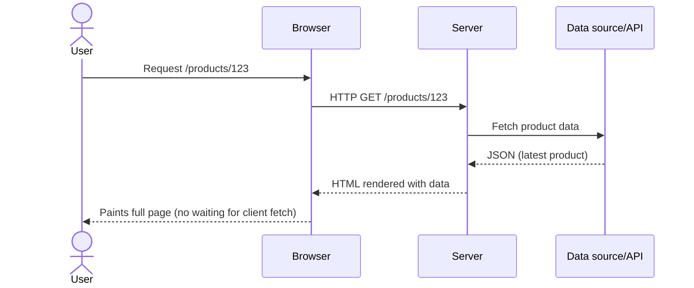
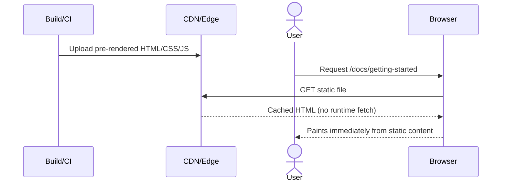
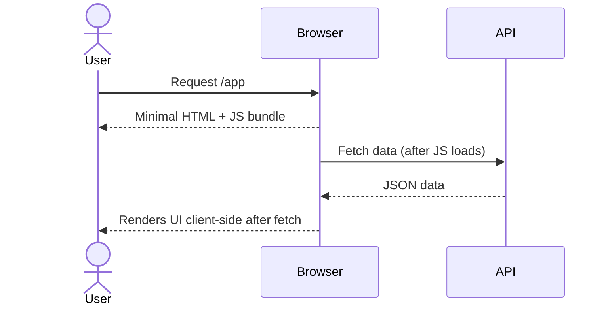
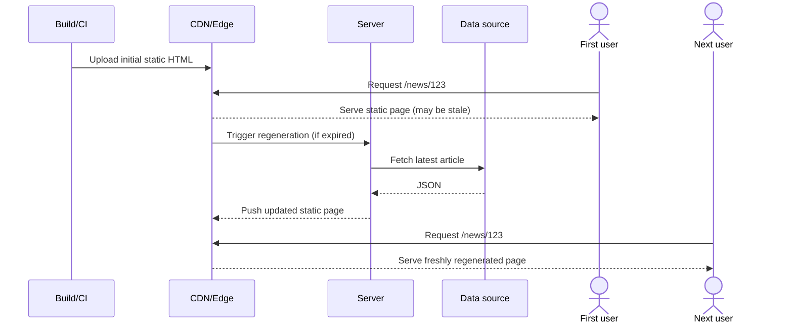

How a web page becomes HTML for the user is a core architectural choice. `SSR`, `SSG`, `CSR`, and `ISR` are four rendering strategies that differ in when and where the HTML is produced, how fresh the data is, and what work happens on the server vs in the browser. This article takes a conceptual look, so you can reason about the right fit for your product.

## A mental model: when does HTML exist?

Think of the lifecycle of a page as three moments:

1) **Build time**: assets are generated before any request exists. All pages share the same snapshot of data baked into the HTML (SSG) unless you rebuild.
2) **Request time**: a user requests a URL; the server can do work now. Data can be personalized and always fresh, but you pay server latency on every hit (SSR).
3) **Client time**: the browser runs JavaScript after receiving a page. Data is fetched and rendered in the browser, trading initial speed/SEO for flexibility (CSR). ISR mixes 1 and 2 by regenerating static pages on a schedule.

Each rendering mode chooses a different moment to produce HTML (and sometimes to refresh it).

Don't worry about the names here, you'll understand them right now!

## What each model does

**SSR (Server-Side Rendering)** renders the page on every request. The server assembles HTML with the latest data and sends a fully rendered document to the browser. This means users and crawlers see fresh content immediately, but each request incurs server work and round-trip latency. It’s ideal for personalized dashboards, rapidly changing inventories, or anything that must reflect “now,” but it demands good caching and capacity planning.



**SSG (Static Site Generation)** renders the page at build time. The HTML is baked once and served from a CDN as a static file, giving extremely fast time-to-first-byte with almost no server load. The trade-off is staleness: the content represents the moment of the build until you trigger another build. Marketing pages, docs, and most blogs fit well here because their content changes infrequently.

For example, this blog is statically generated!



**CSR (Client-Side Rendering)** ships minimal HTML and JavaScript to the browser, then fetches data and renders the UI on the client. This gives you maximum flexibility for interactive, app-like experiences, but the initial render depends on JS execution and network calls, which can hurt first paint and SEO if the primary content is gated behind those fetches. It shines for authenticated apps and internal tools where SEO and cold-start speed are less critical.



**ISR (Incremental Static Regeneration)** blends static speed with controlled freshness. Pages start as static outputs like SSG, but the framework regenerates them in the background on a schedule or after a request. Subsequent visitors get the updated version without waiting for a full site rebuild. This is great for news, product catalogs, and other scenarios where content updates regularly but not on every single request.



## When to use what (rule of thumb)

Reach first for **SSR** if the page must always reflect “right now” or be personalized per user—dashboards, fast-moving inventory, pricing. Choose **SSG** when content changes mainly on deploys; the speed and cacheability of static files make marketing pages, docs, and most blogs ideal candidates. Go with **CSR** when the experience is app-like, heavy on interactivity, and SEO/first paint is less critical (internal tools, authenticated-only UIs). Pick **ISR** for content that benefits from static speed but needs periodic refresh without a full rebuild, like news, catalogs, events, letting you define how fresh “fresh enough” should be.

## How they work

Let's illustrate each strategy with some code examples using Next.js, fetching data for the same product page.

Same product page, four rendering strategies. Notice when data is fetched and where HTML is produced.

### SSR (Pages Router)

```js
// pages/products/[id].js
export async function getServerSideProps({ params }) {
  const res = await fetch(`${process.env.API_URL}/products/${params.id}`);
  const product = await res.json();
  return { props: { product } };
}

export default function Product({ product }) {
  return <h1>{product.name}</h1>;
}
```

`getServerSideProps` runs on every request, pulls fresh data, and the server returns fully rendered HTML. Great for personalized or real-time pages; each hit pays the server round trip.

### SSG (Pages Router)

Static Site Generation runs during the build. It precomputes pages once, then serves them as plain files from a CDN.

```js
// pages/products/[id].js
export async function getStaticPaths() {
  const res = await fetch(`${process.env.API_URL}/products`);
  const products = await res.json();
  return {
    paths: products.map(p => ({ params: { id: p.id } })),
    fallback: false,
  };
}

export async function getStaticProps({ params }) {
  const res = await fetch(`${process.env.API_URL}/products/${params.id}`);
  const product = await res.json();
  return { props: { product } };
}
```

Data is fetched at build time; HTML is baked and served from the CDN. Fast, cheap, and cacheable—stale until the next build.

### ISR (Pages Router)

Incremental Static Regeneration starts with static pages but lets them refresh over time without a full rebuild.

```js
// pages/products/[id].js
export async function getStaticProps({ params }) {
  const res = await fetch(`${process.env.API_URL}/products/${params.id}`);
  const product = await res.json();
  return {
    props: { product },
    revalidate: 60, // seconds
  };
}
```

Starts as static like SSG, but `revalidate` lets the framework regenerate in the background. Users get static speed while pages refresh on a schedule.

### CSR (client-only fetch)

Client-Side Rendering defers data fetching and HTML assembly to the browser after the initial load.

```jsx
import { useEffect, useState } from 'react';

export default function Product({ id }) {
  const [product, setProduct] = useState(null);
  const [loading, setLoading] = useState(true);

  useEffect(() => {
    fetch(`/api/products/${id}`)
      .then(res => res.json())
      .then(data => setProduct(data))
      .finally(() => setLoading(false));
  }, [id]);

  if (loading) return <p>Loading...</p>;
  return <h1>{product.name}</h1>;
}
```

Server ships minimal HTML/JS; the browser fetches data after hydration and renders the UI. Maximizes client flexibility but pushes initial paint/SEO behind JS and network.
## Trade-offs at a glance

| Aspect | SSR | SSG | ISR | CSR |
| --- | --- | --- | --- | --- |
| Performance | Depends on server latency/load; per-request render | Fastest TTFB from static files/CDN | Static speed; occasional regen overhead | Slower first paint (JS + data) |
| Freshness | Fresh on every request | Fixed until rebuild | Fresh within `revalidate` window | Can be fresh, but gated behind client fetch |
| SEO/shareability | Sends full HTML for bots | Sends full HTML for bots | Sends full HTML for bots | Relies on hydration; weaker for content pages |
| Cost/ops | Scales with traffic/compute | Cheap to host/cache | Cheap to host/cache; some regen cost | Lower render cost; still needs API/caching |
| Resilience | Needs solid error/loading states | Graceful via cached HTML | Graceful via cached HTML | Needs solid error/loading states |

## Pitfalls to watch for

The most common trap is overusing SSR. If a page can live as static or regenerated content, forcing per-request rendering only adds latency and cost. Another frequent misstep is doing CSR for SEO-critical pages: bots and users initially see an empty shell that depends on hydration, which hurts indexing and perceived performance. Caching also gets overlooked, without proper headers or `revalidate` windows, ISR pages may go stale or bypass caches, and SSR responses can thrash your backend. Reliability suffers when error and loading states are missing; SSR/ISR/CSR flows that fail to render graceful fallbacks risk blank screens or jarring layout shifts. Finally, mixing server and client components without clear data boundaries (especially in the App Router) leads to unnecessary client bundles or data leaks between layers; define what runs where, and why.

## How to reason about a new page

- **Ask about freshness**: does the page need per-request data (user dashboard)? → lean SSR/CSR. Can it be minutes stale? → ISR. Can it be fixed until deploy? → SSG.
- **Ask about reach**: is this content public/SEO-sensitive? → favor SSR/SSG/ISR. Internal-only? → CSR can be fine.
- **Ask about interactivity**: if the UI is app-like and gated behind auth, CSR after an initial server render (hybrid) often balances UX and performance.
- **Cache consciously**: for SSR/ISR, set cache headers and use `revalidate` appropriately. For CSR, cache API responses where it helps.

## Conclusion

Rendering strategy is about choosing *when* to turn data into HTML and *where* to spend compute. SSR buys freshness per request; SSG gives speed and simplicity at build time; ISR threads the needle with scheduled freshness; CSR leans on the client for flexibility.

There is no silver bullet. Start from the page’s freshness needs, audience, and interactivity, then pick the mode that minimizes latency and operational overhead while keeping users and bots happy. Hybrid approaches are welcome: many real apps mix server-rendered shells with client-side interactivity and selectively use ISR/SSG for content that can be cached. The best choice is the one that matches your product’s constraints and keeps the experience fast, reliable, and maintainable.
