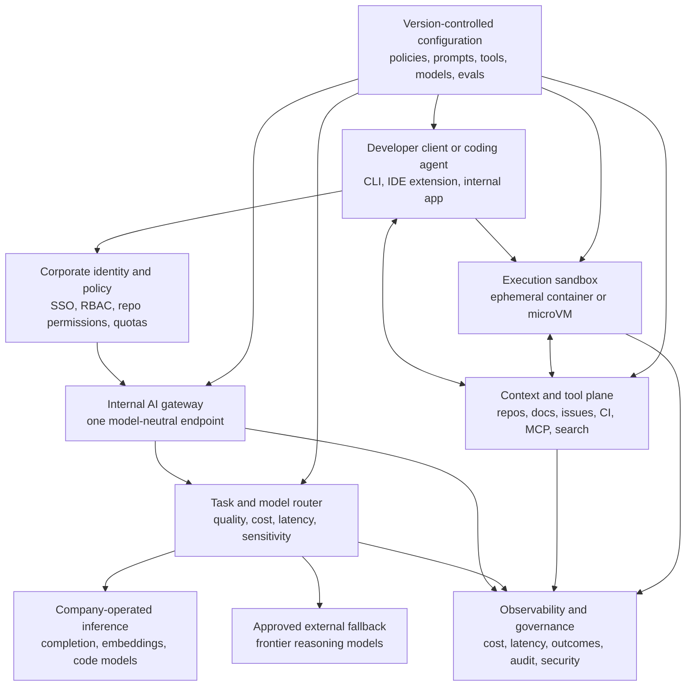

Replacing an AI coding subscription does not require replacing every proprietary model behind it. The practical route is to unbundle the product: own the agent, identity, context, tools, routing, observability, and model access, then move suitable workloads to private inference.

Public implementations do not support the simpler story of installing one open model and canceling GitHub Copilot, Cursor, Claude Code, or Codex. Cloudflare still routes most complex agentic work to frontier providers. Samsung, Meta, and Ant Group own more of specific workloads; Walmart and Zup Innovation focus on the agent and control plane; Mistral sells private deployment; Infralovers tests the pattern on one shared machine.

The evidence is selective. Companies rarely publish procurement records, routing policies, or subscription data. In this article, **confirmed** means the company or implementing team published technical details; **company-reported** and **vendor-reported** identify the source of an outcome; **reported substitution** relies on reputable reporting rather than a company statement. Undisclosed architecture remains undisclosed.

## Table of contents

- [Replacement means three different changes](#replacement-means-three-different-changes)
- [Local, private, on-premises, and self-hosted are not synonyms](#local-private-on-premises-and-self-hosted-are-not-synonyms)
- [Do not route every coding workload to the same model](#do-not-route-every-coding-workload-to-the-same-model)
- [Companies owning most of a workload-specific stack](#companies-owning-most-of-a-workload-specific-stack)
- [Companies owning the agent and control plane](#companies-owning-the-agent-and-control-plane)
- [Buying a private platform instead of building one](#buying-a-private-platform-instead-of-building-one)
- [A shared local server for a small team](#a-shared-local-server-for-a-small-team)
- [Specialize the high-volume path](#specialize-the-high-volume-path)
- [Comparing replacement in practice](#comparing-replacement-in-practice)
- [The recurring internal architecture](#the-recurring-internal-architecture)
- [Why the control plane often comes first](#why-the-control-plane-often-comes-first)
- [The honest limits of local and private models](#the-honest-limits-of-local-and-private-models)
- [The economics: from seats to a shared capacity pool](#the-economics-from-seats-to-a-shared-capacity-pool)
- [A staged adoption path](#a-staged-adoption-path)
- [What the evidence supports, and what it does not](#what-the-evidence-supports-and-what-it-does-not)
- [Conclusion](#conclusion)
- [References](#references)

## Replacement means three different changes

The evidence shows three replacements. They can coexist, and none implies that every external dependency disappeared.

### Level 1: replace the commercial client or agent

The company replaces a per-seat client with OpenCode, Continue, Code Puppy, Pi, an internal CLI, or another model-neutral interface. It governs authentication, configuration, tools, and provider access centrally, while inference may still come entirely from paid APIs. Cloudflare, Walmart, and Zup's CodeGen illustrate this **control-plane replacement**, although Zup does not claim that it replaced a named subscription and Cloudflare also routes a minority of its measured volume to Workers AI.

### Level 2: move inference into a private environment

The company runs models on-premises, in its cloud account, in a private VPC, or through dedicated capacity, keeping prompts and source code inside an approved boundary. It may still pay for model licenses, an enterprise add-on, support, updates, and infrastructure. Mistral Code's reported ABANCA deployment and planned Capgemini deployment fit this level. GitLab likewise lets customers host the gateway and models while requiring a Duo add-on and enterprise, usage-based, or seat-based billing, depending on the configuration ([GitLab documentation](https://docs.gitlab.com/administration/gitlab_duo_self_hosted/)). This is **private deployment**, not "free AI."

### Level 3: own the agent, model, and inference stack

The company develops the interface, trains or fine-tunes models, and operates serving infrastructure. Samsung's `code.i`, Meta's CodeCompose, and Ant Group's CodeFuse provide evidence at this level, but they are different products with different levels of disclosure. Training may still use licensed data or rented accelerators, and some features may retain third-party models. "Owns most of the stack" is more accurate than "owns everything."

| Level | What changes | What may remain external | Representative evidence |
|---|---|---|---|
| 1. Client and control plane | Agent, identity, policy, tools, routing, telemetry | Most or all model inference | Cloudflare, Walmart, Zup |
| 2. Private inference | Model endpoint and data boundary move into an approved environment | Product license, support, model license, some fallback | ABANCA and planned Capgemini Mistral Code deployments |
| 3. Agent, model, and serving | Client, model development, customization, and inference are operated internally | Training infrastructure, selected APIs, or undisclosed dependencies | Samsung, Meta CodeCompose, Ant Group CodeFuse |

These levels are not a maturity ladder. A regulated bank may transfer model-maintenance risk to an on-premises vendor; a small company may not use enough inference to justify GPUs; a model company may already have the infrastructure to own serving.

## Local, private, on-premises, and self-hosted are not synonyms

I use these terms narrowly:

- On-device or laptop-local inference runs on each developer's workstation without a shared service.
- A shared local server receives team requests over an office network or VPN, as in Infralovers' Mac Mini experiment.
- On-premises inference runs in a company-operated facility, although the software may still be commercially licensed.
- Private-cloud inference runs in a segregated cloud account, VPC, or dedicated capacity.
- Company-operated distributed inference runs across an organization-operated cluster or network. Meta's CodeCompose GPU tier and Cloudflare Workers AI use this pattern at different scales.
- Hybrid policy routes work between private or company-operated models and approved external providers.
- Self-hosted means the organization deploys and operates the service; it does not specify hardware location, model ownership, licensing, or fallback.

The public implementations favor shared inference over one large agentic model per laptop. Shared serving pools bursty demand, batches work, centralizes upgrades, and enforces one policy boundary. Laptop inference suits low-latency completion, offline work, and experimentation, but fragments capacity and governance.

JetBrains exposes both patterns. Mellum-all runs through Ollama or LM Studio on a developer's machine ([JetBrains, July 2025](https://blog.jetbrains.com/ai/2025/07/whats-new-with-mellum-expanded-language-support-and-new-ways-to-use-it-locally/)). Its enterprise documentation recommends a shared GPU machine for small organizations and a multi-node deployment for larger ones, with a JetBrains access token required for the on-premises package ([JetBrains IDE Services documentation](https://www.jetbrains.com/help/ide-services/jetbrains-mellum.html)). "Local" is a topology choice, not an ownership category.

For the individual-workstation version of this problem, see [the separate guide to running a Copilot-style assistant with Continue and a local model](/posts/run-copilot-style-assistant-locally-llm-vs-code/). The rest of this article stays with the organizational platform problem.

## Do not route every coding workload to the same model

Autocomplete and autonomous software work have different performance envelopes. One route for both wastes capacity and reduces reliability.

| Workload | Typical requirement |
|---|---|
| Inline completion | Very low latency, high request volume, smaller specialized model |
| Embeddings and code search | Stable output, low unit cost, straightforward private serving |
| Chat and explanation | Moderate reasoning, useful context retrieval, conversational latency |
| Code editing | Structured changes, repository context, reliable tool use |
| Autonomous agent | Long context, planning, execution, testing, error recovery, durable state |
| Difficult debugging | Strong reasoning, ambiguous evidence, often a frontier fallback |

[Mistral Code](https://mistral.ai/news/mistral-code/) assigns separate models to completion, embeddings, agentic work, and chat. [JetBrains built Mellum](https://blog.jetbrains.com/ai/2025/04/mellum-how-we-trained-a-model-to-excel-in-code-completion/) because general chat models were too slow, expensive, and inconsistent for inline completion. [Cloudflare](https://blog.cloudflare.com/internal-ai-engineering-stack/) sends repetitive work to Workers AI while frontier models handle most complex agentic requests in its published snapshot.

Routing is about capability as well as cost. A completion model may call tools poorly; a reasoning model may respond too slowly for completion; an embedding model should not consume agent-scale memory. Specialization gives each path its own latency, quality, and capacity target.

## Companies owning most of a workload-specific stack

### Samsung: an internal assistant on an internal model family

At its November 2023 AI Forum, Samsung said Samsung Research developed the Gauss language, code, and image model family. Gauss Code powered the internal `code.i` assistant for code explanation and test generation ([Samsung Global Newsroom, November 2023](https://news.samsung.com/global/samsung-ai-forum-2023-day-2-discussing-technological-trends-and-the-future-of-generative-ai)).

In November 2024, Samsung reported that `code.i` had moved to the Compact, Balanced, and Supreme variants of Gauss2, reached DX business units and overseas research institutes, and quadrupled monthly usage since launch. About 60% of DX software developers used it as of November 21, 2024 ([Samsung Global Newsroom](https://news.samsung.com/global/samsung-electronics-hosts-samsung-developer-conference-korea-2024-unveils-its-improved-gen-ai-model)).

This confirms substantial internal use of an internally developed assistant and model family. It does not show canceled subscriptions, the serving topology, accelerator fleet, identity layer, or third-party routing. Samsung owns much of the stack, but the exact infrastructure boundary is not public.

### Meta CodeCompose: production completion, not a modern autonomous agent

Meta's 2023 CodeCompose paper documents a client-server completion system built on InCoder and fine-tuned on internal source code across more than nine languages. A Rust language server handled requests from VS Code, Android Studio, notebooks, and other clients, plus telemetry, debouncing, and caching. An A100 GPU tier ran inference ([the CodeCompose paper](https://arxiv.org/html/2305.12050)).

The system optimized completion latency, not agent throughput: it processed requests immediately instead of batching them, waited for a 20-millisecond typing pause, and cached duplicate contexts. Long-running agents instead need continuous batching, large KV caches, durable execution, and queue management ([the CodeCompose architecture](https://arxiv.org/html/2305.12050#S3)).

In the paper's deployment snapshot, CodeCompose produced 4.5 million suggestions for 16,000 engineers across nine languages, with a 22% suggestion acceptance rate. The authors estimated that 8% of typed changed code came from accepted CodeCompose suggestions and said the feature had been rolled out to all Meta engineers ([deployment results](https://arxiv.org/html/2305.12050#S4.SS2)). Those are implementing-team measurements, not an independent productivity study.

CodeCompose owns model fine-tuning, inference, editor integration, and telemetry. It does **not** replace Claude Code or Codex: it could not autonomously inspect a repository, run tests, recover from a failed build, and open a patch. It shows that companies internalized the frequent, latency-sensitive completion layer before modern coding agents.

### Ant Group CodeFuse: deep model work, limited public adoption data

Ant Group's CodeFuse team reported collecting more than 200 TB of code-related data, refining it to about 1.6 TB or one trillion tokens, and pretraining a 13-billion-parameter model on the company's technology stack. The program covered static analysis, supervised and multi-task fine-tuning, evaluations, and training across hundreds or thousands of GPU instances ([CodeFuse-13B paper](https://arxiv.org/html/2310.06266v2)).

The team integrated CodeFuse into Ant Group's development process and built extensions for VS Code, JetBrains IDEs, and Ant CloudIDE. It collected human feedback over several months for code-comment and explanation tasks. It also open-sourced components including the CodeFuse evaluation suite and MFTCoder fine-tuning framework.

This confirms model development and internal integration, but the paper provides no developer count, active-use rate, subscription change, or comparable production telemetry. The [CodeFuse GitHub organization](https://github.com/codefuse-ai) remained active in 2026; that does not prove the original model still runs internally at the same scale.

### Alibaba: an explicit reported substitution with an undisclosed inference boundary

On July 3, 2026, Reuters reported, citing one person familiar with the order, that Alibaba had prohibited employees from using Claude Code for work and was directing them to its own Qoder coding platform. Reuters connected the decision to scrutiny of Claude Code mechanisms that inspected environment signals associated with China-linked users and to broader legal and compliance concerns. Alibaba and Anthropic did not respond to Reuters' requests for comment at the time ([Reuters report, syndicated by Investing.com](https://www.investing.com/news/stock-market-news/alibaba-to-ban-claude-code-in-workplace-over-alleged-backdoor-risks-source-says-4775035)).

This is the strongest evidence here for replacing a named external agent, but it remains a **reported substitution** based on an unnamed source, not Alibaba engineering documentation.

Qoder is clearly more than one model. Alibaba Cloud describes it as an agentic coding platform with desktop, CLI, and JetBrains clients ([Alibaba Cloud documentation](https://www.alibabacloud.com/help/en/model-studio/qoder-agent)). Public Qoder documentation also supports Alibaba Cloud Model Studio and third-party provider keys, while Qoder has published a customized Qwen-Coder-Qoder model for agentic workflows ([Qoder's model documentation](https://docs.qoder.com/en/cli/model), [Qoder engineering post](https://qoder.com/blog/qwen-coder-qoder)).

Alibaba has not published the employee model mix, whether requests use privately hosted Qwen weights or a company cloud endpoint, fallback policy, or data boundary. Qwen, Qwen Coder, and Qoder do not prove that every internal request uses a self-hosted Qwen model. The case supports security, compliance, supply-chain, and geopolitical reasons to own the client boundary, but not a level-3 classification.

## Companies owning the agent and control plane

### Cloudflare: control first, hybrid inference by design

Cloudflare's April 20, 2026 architecture post is the most complete public account of control-plane ownership with continued heavy use of proprietary models ([Cloudflare's published architecture](https://blog.cloudflare.com/internal-ai-engineering-stack/)).

Cloudflare distributed OpenCode internally behind one discovery and authentication endpoint. An engineer starts with a command resembling:

```sh
opencode auth login https://opencode.internal.domain
```

The endpoint returns authentication requirements and shared provider, MCP, agent, command, and permission configuration. OpenCode invokes Cloudflare Access, the employee uses company SSO, and `cloudflared` returns a signed token. Local configuration can override selected defaults; organization policy remains central.

A proxy Worker validates the employee token, removes user authorization headers, injects the server-side AI Gateway credential, and forwards each request to the selected provider. No provider API keys remain on developer machines. An anonymous UUID enables per-user cost attribution without sending employee email in provider-facing metadata.

The endpoint also distributes configuration as code. Markdown agent and command files with YAML frontmatter compile into schema-validated JSON. One deployment can update the environment received by more than 3,000 people. An Access-protected MCP portal aggregates 13 production servers and more than 182 tools across GitLab, Jira, Sentry, Prometheus, and internal services.

Cloudflare also described a knowledge graph with more than 16,000 entities, code review on its standard CI path, and isolated environments for cloning, building, and testing. Its planned background-agent architecture adds durable orchestration and sandbox containers; the post does not present that layer as already equivalent to the local OpenCode rollout.

For the 30 days preceding April 20, 2026, Cloudflare reported 3,683 active users across 295 teams: 60% of roughly 6,100 employees and 93% of R&D. It also reported 47.95 million AI requests overall, 20.18 million monthly AI Gateway requests, 241.37 billion tokens routed through the gateway, and 51.83 billion tokens processed on Workers AI. These company-reported categories use different denominators and should not be added.

In Cloudflare's provider breakdown for the previous month, OpenAI, Anthropic, and Google frontier models handled 13.38 million requests, or 91.16% of measured provider volume. Workers AI handled 1.3 million, or 8.84%. Frontier models still performed most complex agentic coding work.

Workers AI handled documentation review, repository context generation, lightweight inference, and a high-volume security agent. Cloudflare said that security workload processed more than seven billion tokens per day on Kimi K2.5; an unspecified "mid-tier proprietary model" would cost an estimated $2.4 million per year, while Workers AI was 77% cheaper.

Cloudflare owns interface distribution, SSO, proxy, credentials, policy, model catalog, tool portal, configuration, observability, and routing. It can move suitable workloads to open-weight inference without changing every client, but its numbers show control-plane replacement preceding inference replacement.

### Walmart Code Puppy: provider independence without public hosting details

Code Puppy is an open-source, MIT-licensed coding agent created by Walmart engineers Michael Pfaffenberger and John Choi. It supports multiple providers, local OpenAI-compatible servers, file and shell tools, `AGENTS.md`, and MCP. Prompts go directly to the configured provider unless the user selects a local vLLM, SGLang, or llama.cpp endpoint ([Code Puppy repository](https://github.com/mpfaffenberger/code_puppy)).

Business Insider reported in June 2026 that Code Puppy had spread from engineers to other Walmart roles, motivated by provider flexibility, cost control, and avoiding lock-in. It can switch, compare, or rotate models instead of binding the client to one supplier ([Business Insider Japan edition](https://www.businessinsider.jp/article/2606walmart-code-puppy-ai-anthropic-claude-code-openai-codex/)).

Walmart's CTO said Code Puppy "supports the entire company" ([Suresh Kumar, 2026](https://www.linkedin.com/posts/suresh-kumar-cto_congratulations-to-walmart-associates-john-activity-7468818436496875520--pgX)). A Walmart employee wrote in March 2026 that the program supported AI development for more than 30,000 associates and that more than 6,500 joined an update session ([Johnathan Williams, March 2026](https://www.linkedin.com/posts/johnathan-williams-4b5308163_we-had-an-incredible-session-last-friday-activity-7434313314563710976-RLcP)). These figures are informal.

The evidence establishes a model-neutral internal agent at significant scope, not Walmart's hosting topology, local-versus-external split, or canceled subscriptions. It is a level-1 case: provider dependence is managed at the agent layer while inference may still come from multiple suppliers.

### Zup CodeGen: the model is not the operational system

Zup Innovation's implementing-team preprint describes an internal CodeGen system with a Node.js CLI for interaction and local tools, a FastAPI backend for authentication and routing, and a central "Maestro" agent loop. PostgreSQL and Redis hold session and event state; a durable timeline records model responses, tool calls, and transitions for debugging and compliance ([Zup's April 2026 paper](https://arxiv.org/html/2604.09805)).

The team reports daily use but no adoption count or eliminated subscription. Targeted edit tools, consistent safety policies, and progressive approvals mattered more to reliability and adoption than prompt-only tuning. The model simplified reasoning but did not replace orchestration, state, or guardrails. Zup owns what the model can do and how actions become observable; hosting remains unspecified.

## Buying a private platform instead of building one

### Mistral Code: private deployment with a commercial owner

Mistral Code packages an agent, four model classes, and inference as an enterprise product built on a Continue fork.

On June 4, 2025, Mistral described Codestral for fill-in-the-middle completion, Codestral Embed for code search, Devstral for agentic coding, and Mistral Medium for chat. Deployment options included its cloud, reserved capacity, or air-gapped on-premises GPUs, with access controls, audit logs, and usage and acceptance metrics ([Mistral Code announcement](https://mistral.ai/news/mistral-code/)). The product was then in private beta.

Mistral reported three different customer configurations:

- ABANCA had deployed Mistral Code at scale in a hybrid setup, according to Mistral, using cloud prototyping while keeping core banking code on-premises.
- Capgemini *was to deploy* the product on-premises for more than 1,500 developers serving regulated-industry projects. Mistral's wording describes a plan, not a completed rollout.
- SNCF was enabling 4,000 developers through Mistral Code Serverless, according to Mistral. This is a cloud configuration, not an on-premises example.

All three claims come from Mistral. ABANCA is deployed, Capgemini planned, and SNCF serverless; I found no later first-party customer architecture with active usage, completion rates, or exact ABANCA or Capgemini topology.

This route replaces a public SaaS data boundary without requiring the customer to train a model or fork an agent. It adds data-location and operational control while retaining dependence on Mistral's software, models, support, licenses, and commercial terms.

## A shared local server for a small team

### Infralovers: one Mac Mini, OpenCode clients, and an honest fallback

Infralovers tested a Mac Mini M4 with 32 GB of memory running Ollama behind a self-hosted Headscale control server and Tailscale clients. Developers ran OpenCode locally against the shared OpenAI-compatible endpoint. The example exposed Qwen3-Coder 30B and Llama 3.1 8B locally, with Claude Sonnet 4.5 as fallback ([Infralovers, March 3, 2026](https://www.infralovers.com/blog/2026-03-03-company-ai-solved-mac-mini-opencode/)).

This was a proof-of-concept evaluation, not a blueprint. The company publishes no team size and calls its local-versus-cloud split a hypothesis. Responses slowed noticeably when three or more developers shared the same 14-billion-parameter model; long runs, parallel agents, and large contexts would outgrow one Mac Mini quickly.

The decoupled client and endpoint keep routine work on the team network and permit external fallback when local capability is insufficient. A small team can measure workloads before buying a cluster: standardize the endpoint and client, then decide which inference belongs behind them.

## Specialize the high-volume path

### JetBrains Mellum: do not spend agent-scale compute on every keystroke

JetBrains built Mellum because general chat models cost too much, responded too slowly, and lacked reliable fill-in-the-middle completion. The team targeted fewer than four billion parameters, used a code-specific vocabulary, trained the model from scratch, and optimized it for its completion interface ([JetBrains, April 2025](https://blog.jetbrains.com/ai/2025/04/mellum-how-we-trained-a-model-to-excel-in-code-completion/)).

JetBrains reported pretraining the four-billion-parameter base model on about three trillion sampled tokens with an 8,192-token context window. Training ran for roughly 15 days on 16 nodes with eight H100 GPUs each. It then used context-aware fine-tuning, language specializations, and preference optimization. The company's cloud completion had used its custom model since the 2024.2 release ([deployment context](https://blog.jetbrains.com/ai/2025/02/why-and-how-jetbrains-built-mellum-the-llm-designed-for-code-completion/)).

Mellum is a vendor-operated completion model, not an employee platform replacing Claude Code. It later gained local and enterprise deployment options. The operational lesson is to separate completion, retrieval, editing, and difficult debugging into services with distinct latency targets, scaling policies, and update cycles.

## Comparing replacement in practice

| Company | Internal agent/client | Model deployment | External fallback | What the company owns | What appears to be replaced | Evidence strength |
|---|---|---|---|---|---|---|
| Cloudflare | OpenCode distributed through an internal endpoint | Workers AI plus external providers | Confirmed and dominant in the April 2026 request snapshot | Identity, proxy, gateway, routing, config, MCP portal, telemetry, parts of inference | Commercial client/control plane; not frontier inference | Detailed company architecture and dated internal metrics |
| Samsung | Internal `code.i` | Samsung Gauss/Gauss2; serving topology not public | Not disclosed | Assistant and proprietary model family; internal service operation reported | Internal coding-assistant workload; no named external cancellation | Strong company-reported adoption; incomplete infrastructure detail |
| Meta | CodeCompose LSP and editor clients | Fine-tuned InCoder on an internal A100 inference tier | Not described for CodeCompose | Model fine-tuning, serving, clients, telemetry | High-volume completion layer | Implementing-team production paper; primarily autocomplete, not an agent |
| Ant Group | IDE integrations for CodeFuse | Internally pretrained and fine-tuned CodeFuse-13B | Not disclosed | Model pipeline, evaluation, IDE integrations, open-source components | Some internal code-model workloads | Implementing-team paper; no developer count or recent internal-use confirmation |
| Alibaba | Qoder platform, according to Reuters and Alibaba Cloud docs | Internal employee routing and hosting not public | Public Qoder supports multiple model sources; internal policy unknown | Agent product and Qwen ecosystem; exact internal boundary undisclosed | Claude Code use explicitly reported as prohibited in favor of Qoder | Reported substitution from one unnamed source; not a published architecture |
| Walmart | Code Puppy | Model-neutral; internal hosting details not public | Multiple external providers supported | Agent source and internal distribution/integrations | Primarily client and orchestration dependency | Public code, company acknowledgment, reputable reporting; active-user data informal |
| Zup | Internal CodeGen CLI | Not disclosed | Not disclosed | Client, auth/routing backend, orchestration, tools, state, audit trail | Internal agent capability; no named subscription claim | Implementing-team preprint; no adoption count |
| ABANCA | Mistral Code/Continue-derived client | Hybrid; core banking code on-premises, according to Mistral | Cloud prototyping confirmed by vendor | Private deployment boundary and enterprise policy; vendor owns product/models | Public SaaS data path for sensitive workloads | Vendor-reported deployed-at-scale claim; no customer architecture published |
| Capgemini | Mistral Code/Continue-derived client | On-premises deployment announced for 1,500+ developers | Not disclosed | Planned private operation; vendor supplies stack | Intended public SaaS dependency for regulated projects | Vendor announcement uses future tense |
| Infralovers | OpenCode on developer laptops | Shared Ollama on one Mac Mini | Anthropic API configured | Shared endpoint, VPN, local models, client configuration | Part of routine inference and client dependence in a proof of concept | Direct technical write-up with explicit limits; not an enterprise rollout |
| JetBrains | JetBrains AI Assistant and editor integrations | JetBrains cloud, laptop-local, or licensed enterprise deployment | Broader models remain appropriate for non-completion tasks | Completion model training and product integration | Specialized completion inference, not a full coding agent | Detailed company training account and current deployment docs |

The systems do not fit one ranking. Meta owns more of completion; Cloudflare operates a broader control plane. ABANCA may have a stricter data boundary than Walmart but buys more from one vendor. Alibaba has the clearest reported prohibition and the least public internal topology.

## The recurring internal architecture

Across these cases, the same platform layers recur. Each box can be a product, an internal service, or absent. Together they form the coding-agent harness around context, tools, execution, and evidence. [A separate article explains how to make that harness verifiable](/posts/how-to-build-a-reliable-coding-agent-harness/); this diagram focuses on who operates each layer.



The developer authenticates with corporate identity through one approved client. An internal gateway routes inference to internal or external endpoints. Context tools and execution remain separate because repository and shell access need their own authorization and audit policies. Observability spans the path; version-controlled configuration updates models, tools, and guardrails without reconfiguring every laptop.

### 1. Developer client or coding agent

OpenCode, Continue, Code Puppy, editor extensions, CLIs, and internal apps are the visible product. For autonomous work, the client or backend also interprets tool calls, returns observations, manages context, and decides when to stop. A model-neutral UI with personal API keys and arbitrary configuration is not an internal platform.

### 2. Corporate identity and policy

SSO and short-lived credentials make access revocable. RBAC and repository permissions constrain context and tool calls; quotas, model allowlists, and sensitivity policies use the same employee identity. Cloudflare implements this with Access, signed-token validation, and server-side provider credentials.

### 3. Internal AI gateway

The gateway is the stable contract between tools and model backends, exposed through an OpenAI-compatible API or an internal protocol. It centralizes credentials, retention, metadata, rate limits, cost attribution, and failover while decoupling client and provider. GitLab customers, for example, can operate the AI Gateway with self-hosted, cloud-hosted, or hybrid backends ([GitLab](https://docs.gitlab.com/administration/gitlab_duo_self_hosted/)).

### 4. Model router

The router selects a backend by task class, repository sensitivity, required context, measured success, latency budget, queue depth, regional availability, and cost. Start with auditable rules: embeddings use a private model, completion uses a low-latency pool, sensitive repositories disallow external inference, and difficult debugging reaches a frontier model only when policy permits.

### 5. Self-hosted inference

Completion, embedding, reranking, code search, and agentic coding can use different services, hardware, and autoscaling. vLLM and SGLang schedule shared inference: batching raises accelerator utilization, KV and prefix caching avoid recomputing shared prefixes, and quantization trades quality and compatibility for memory and capacity. Prefix caching skips computation for shared prompt prefixes; it does not accelerate generation of new tokens ([vLLM documentation](https://docs.vllm.ai/en/latest/features/automatic_prefix_caching/)).

### 6. External fallback

Fallback acknowledges uneven model capability. Cloudflare uses external frontier models for most complex agentic work; Infralovers switches to Anthropic for architecture, difficult debugging, security review, novel problems, and long contexts; GitLab supports per-feature hybrid configuration. Unlike individual subscriptions, these routes share approved providers, corporate credentials, retention terms, budgets, and audit rules.

### 7. Context and tool integrations

Agents also need design documentation, ownership catalogs, issue trackers, CI results, incidents, metrics, package registries, and internal APIs. MCP can standardize tools but does not authorize them. Each call needs an attributable identity and least-privilege scope; tool descriptions also consume context and influence behavior. Cloudflare's portal and Zup's manifests treat this layer as a designed platform surface.

### 8. Execution sandbox

Autonomous agents inspect and edit files, install dependencies, run builds and tests, and observe failures. Doing that on a developer laptop or shared CI runner expands the blast radius. Ephemeral containers or microVMs should constrain network egress, secrets, filesystem mounts, compute budgets, lifetime, and repository tokens. A prompt saying "do not push" is not an authorization control.

### 9. Observability and governance

Alongside tokens and cost, record latency, queue time, cache reuse, route selection, tool failures, sandbox violations, test results, developer acceptance, task completion, retries, and fallback rate. A cheaper token that produces more failed edits is not cheaper; completion acceptance cannot measure an autonomous issue-resolution agent. Metrics must match the workload.

### 10. Central configuration and evaluations

Version and review prompts, approved models, MCP definitions, agent policies, permissions, routing rules, and representative evaluations. Cloudflare compiles OpenCode configuration from source; Zup promotes changes through development, staging, and production. Public benchmarks can screen models, but internal tasks test the company's build systems, frameworks, languages, and failure modes.

## Why the control plane often comes first

Replacing the strongest proprietary model first forces one team to solve model quality, serving, integration, security, and adoption at once. A client and gateway produce value earlier, even when every request still uses a paid API:

- Employees use SSO instead of personal provider accounts and keys.
- Central policy enforces providers, repositories, retention modes, quotas, and tool permissions.
- One endpoint lets the platform team change backends without migrating developers.
- Provider and user costs become attributable instead of fragmented across seats and expenses.
- Secrets, source classifications, and external-routing rules share enforcement points.
- Issue trackers, CI, documentation, and service catalogs integrate once for every approved model.
- Private embedding or completion can enter behind the gateway incrementally.

Cloudflare's proxy enabled per-user attribution, catalog management, and policy enforcement without client changes, while 91.16% of its dated provider requests still went to frontier vendors. Walmart makes the agent and provider interface replaceable without public evidence of internal inference. Zup owns tools, state, and safety without disclosing model hosting.

A gateway can become a bottleneck, an internal client can lag commercial products, and centralization creates a high-value service that must be reliable and secure. Control-plane ownership does not guarantee savings or quality; it makes later inference changes possible without reorganizing the developer workflow.

## The honest limits of local and private models

Evaluate open-weight models as components, not as symbols of independence.

### Ambiguous work remains difficult

Routine generation, transformation, retrieval, and templated edits are easier to evaluate and route. Ambiguous bugs, incomplete requirements, cross-repository behavior, and architecture demand stronger judgment and recovery. A local model can produce plausible code while missing the governing constraint.

### Long context is both a model and infrastructure problem

A large advertised window does not guarantee reliable use of distant evidence. Context also consumes KV-cache memory and reduces concurrency: GitLab's vLLM reference notes that context length and concurrency compete for the same VRAM ([GitLab vLLM reference](https://docs.gitlab.com/administration/gitlab_duo_self_hosted/vllm_gpt_oss_120b/)). Repository retrieval and compression remain necessary.

### Tool calls fail differently from text generation

Autonomous agents need structured calls, stable schemas, error interpretation, and recovery after partial execution. Some small models write acceptable functions but use tools unreliably. Infralovers warns that not every local model supports OpenCode's required tool-calling behavior.

### Shared infrastructure creates contention

Developer demand is interactive and bursty. Completion needs stable low latency; autonomous tasks can hold large contexts for minutes. Without isolated pools and budgets, one agent request can evict cache state or delay many completions. Larger batches and fuller KV caches improve throughput but increase memory pressure; reducing concurrency avoids out-of-memory errors at the cost of peak throughput ([SGLang documentation](https://docs.sglang.ai/advanced_features/hyperparameter_tuning.html)). Production needs capacity planning, backpressure, priorities, and graceful fallback.

### The evaluation and update burden becomes internal

Model upgrades can change tool behavior, formatting, security, context handling, and output quality. Quantization may affect correctness; prompt templates can invalidate cache behavior or evaluation baselines. Platform teams need representative tasks before changing routes and incident response for regressions, serving failures, and bad rollouts.

### Agents expand the security boundary

The larger risk may be what the agent can do after inference. It can execute untrusted scripts, retrieve poisoned instructions, expose secrets through tool output, modify CI, or call the network from a build environment. Sandboxes, scoped credentials, egress policy, human approval for irreversible actions, and audit trails remain necessary. Self-hosting does not neutralize excessive authority.

Hybrid routing moves only workloads that pass internal evaluations and preserves fallback for those that do not.

## The economics: from seats to a shared capacity pool

A subscription allocates an entitlement to a developer; an internal platform allocates requests across shared inference, storage, networking, and operational capacity.

| Subscription model | Internal capacity model |
|---|---|
| Cost is associated with seats, plan limits, or vendor tokens | Cost is associated with accelerator time, utilization, licenses, staff, and fallback APIs |
| Idle developers may still hold paid seats | Idle GPUs still consume capital, rental, power, and operational attention |
| Vendor absorbs serving and upgrade complexity | Platform team owns capacity, reliability, and model rollout |
| Product and model may be bundled | Client, gateway, model, and provider can be costed independently |
| Limits are set by the vendor plan | Limits are set by fleet capacity, routing policy, and budgets |

When accelerators stay busy, continuous batching shares inference steps, prefix and KV caching avoid recomputing common instructions or history, quantization fits more capacity into memory, and smaller models handle completion and retrieval while expensive reasoning serves harder work.

Low utilization makes owned or reserved GPUs expensive, while peak concurrency can require capacity that sits idle most of the day. Power, cooling, networking, hardware failures, cluster software, patches, licenses, support, staff, and external fallback remain costs.

Self-hosting fits high, predictable, pooled demand; repeated workloads; controlled-data requirements; smaller models that pass internal evaluations; and an existing platform team. Subscriptions or APIs fit sporadic usage, small teams, unpredictable concurrency, frontier-quality requirements, limited operational capacity, or urgency.

There is no universal break-even number. Cloudflare's 77% estimate describes one enormous, repetitive security workload on its own platform, not a bank, a 20-person startup, or autonomous debugging. Centralization makes workload cost visible and ownership choices possible; it does not guarantee savings.

## A staged adoption path

Stop at the stage where additional ownership costs more than it returns.

### 1. Measure current subscription and API usage

Inventory seats, active users, quota exhaustion, API traffic, latency, repositories, languages, and task types. Separate completion, chat, and autonomous work; expenses do not show task success. Low, irregular usage may already justify keeping subscriptions.

### 2. Introduce a model-neutral internal gateway

Give approved tools one endpoint, remove provider keys from developer machines, and retain only enough metadata for cost attribution and diagnosis. The organization can stop here with external inference while gaining policy, visibility, and provider portability.

### 3. Centralize authentication, policy, observability, and secrets

Connect the gateway to SSO. Define repository and model policies, retention, quotas, audit events, and metadata lifetimes. Treat it as production security infrastructure.

### 4. Standardize an open or internal agent

Choose the client deliberately. A CLI reduces cross-IDE maintenance; an extension improves discovery and completion UX; a background agent needs remote state and sandboxes. Version shared configuration with bounded overrides. If per-seat client lock-in was the problem, stop here; Walmart is the closest public case.

### 5. Self-host low-risk, high-volume workloads first

Start with embeddings, code search, reranking, repository summaries, documentation checks, and specialized completion. Their outputs, traffic, and failure modes are easier to measure than autonomous repository-wide edits. Meta CodeCompose and JetBrains Mellum support a dedicated completion path; Cloudflare applies the principle to repetitive internal work.

### 6. Build representative evaluations from internal repositories

Build tasks from real languages, frameworks, build tools, and incidents after removing secrets and personal data. Evaluate correct tests, unauthorized files, tool trajectory, latency, and review effort, not only compilation. When possible, separate evaluation from serving so cost alone cannot promote a model.

### 7. Add local agentic models only where they pass

Test repository navigation, structured editing, shell tools, test recovery, and context limits. Route only task classes that meet quality and security thresholds. "Available on the cluster" does not mean "approved for autonomous execution." Private completion with external agentic reasoning can remain the steady state.

### 8. Keep a controlled frontier fallback

Make fallback explicit, observable, and policy-bound. Define eligible repositories, approved providers, retention terms, and developer consent before source leaves the private boundary. Track each reason to guide evaluations, retrieval, and future local models.

### 9. Measure task and developer outcomes

Track builds, accepted changes, escaped defects, time to verified completion, review effort, retries, and opt-out, not only tokens and suggestions. Compare the same workload class and inspect autonomous trajectories: passing after unsafe commands, excessive retries, or accidental network access is not a clean success.

### 10. Shrink external usage only where evidence supports it

Move routes with canaries, capacity limits, and rollback. Re-evaluate after model, prompt, tool, or repository changes. Reduce external usage only when internal routes meet quality and operational targets.

## What the evidence supports, and what it does not

The best-documented cases are hybrid. Cloudflare owns the control plane while frontier providers handle most measured requests. Infralovers keeps Anthropic fallback on one shared machine. GitLab and Mistral support private and hybrid deployment. Walmart and Zup show value at the agent layer without public proof of self-hosted inference.

Samsung, Meta, and Ant Group invested directly in models and integrations, but still support workload decomposition. Meta designed for completion, not autonomous work; JetBrains runs completion alongside broader models. One owned model need not serve the whole software lifecycle.

Alibaba is the exception: Reuters reports an abrupt removal of Claude Code in favor of Qoder for security and compliance reasons. The public record describes the client decision more clearly than the inference architecture.

The evidence does **not** show that companies canceled every Copilot, Cursor, Claude Code, or Codex subscription; that open weights remove licensing and operating costs; that every private deployment is self-hosted; or that local agents match frontier systems on every internal task.

## Conclusion

Do not start by asking, "Which local model replaces Claude Code?" Start by deciding which boundaries to own. An internal gateway may be enough; regulated teams may buy a supported private deployment; organizations with predictable demand and platform expertise may operate specialized models.

The right boundary depends on workload, risk, utilization, and operational capability. Own the client and control plane first when you need identity, tool authorization, routing, observability, and data policy independent of any model provider. Move inference only where internal evaluations justify it.

> The shift is from renting an inseparable coding product to operating a platform where agents, models, and providers can change independently.

## References

- [Cloudflare: The AI engineering stack we built internally](https://blog.cloudflare.com/internal-ai-engineering-stack/)
- [Samsung: Samsung Developer Conference Korea 2024 and Gauss2](https://news.samsung.com/global/samsung-electronics-hosts-samsung-developer-conference-korea-2024-unveils-its-improved-gen-ai-model)
- [Samsung: Samsung AI Forum 2023 and the original Gauss/code.i description](https://news.samsung.com/global/samsung-ai-forum-2023-day-2-discussing-technological-trends-and-the-future-of-generative-ai)
- [Meta: AI-assisted Code Authoring at Scale](https://arxiv.org/html/2305.12050)
- [Ant Group: CodeFuse-13B](https://arxiv.org/html/2310.06266v2)
- [Reuters report on Alibaba's Claude Code decision, syndicated by Investing.com](https://www.investing.com/news/stock-market-news/alibaba-to-ban-claude-code-in-workplace-over-alleged-backdoor-risks-source-says-4775035)
- [Alibaba Cloud: Qoder](https://www.alibabacloud.com/help/en/model-studio/qoder-agent)
- [Code Puppy public repository](https://github.com/mpfaffenberger/code_puppy)
- [Business Insider Japan: Walmart and Code Puppy](https://www.businessinsider.jp/article/2606walmart-code-puppy-ai-anthropic-claude-code-openai-codex/)
- [Zup Innovation: Building an Internal Coding Agent](https://arxiv.org/html/2604.09805)
- [Mistral AI: Introducing Mistral Code](https://mistral.ai/news/mistral-code/)
- [Infralovers: Mac Mini, OpenCode, Ollama, and Headscale evaluation](https://www.infralovers.com/blog/2026-03-03-company-ai-solved-mac-mini-opencode/)
- [JetBrains: How Mellum was trained for code completion](https://blog.jetbrains.com/ai/2025/04/mellum-how-we-trained-a-model-to-excel-in-code-completion/)
- [GitLab Duo self-hosted model documentation](https://docs.gitlab.com/administration/gitlab_duo_self_hosted/)
- [vLLM automatic prefix caching](https://docs.vllm.ai/en/latest/features/automatic_prefix_caching/)
- [SGLang serving hyperparameter guidance](https://docs.sglang.ai/advanced_features/hyperparameter_tuning.html)
