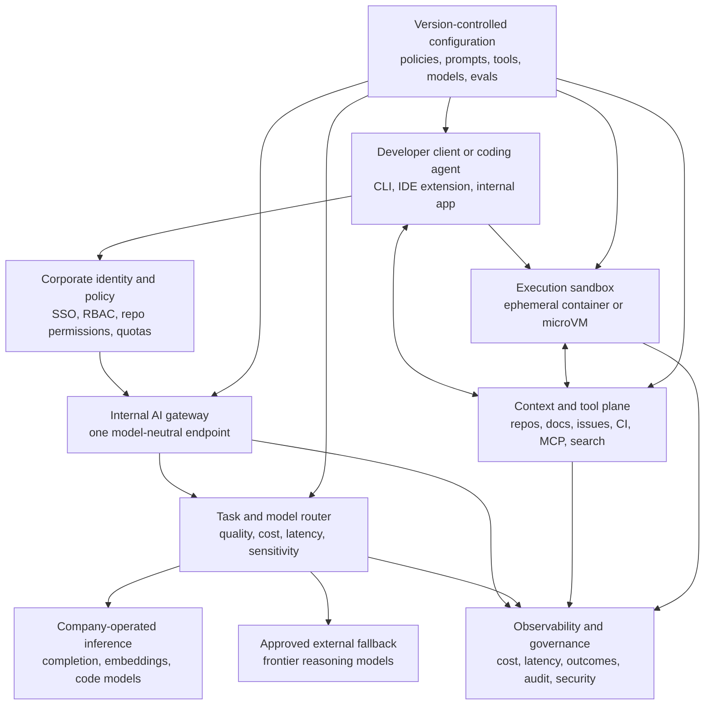

AI coding subscriptions are expensive, constrained by vendor quotas, and difficult to separate from questions about privacy, procurement, and lock-in. It is understandable that engineering leaders ask whether they can replace GitHub Copilot, Cursor, Claude Code, or Codex with something they operate themselves.

Today, it is possible to replace a commercial coding subscription with an internal platform that owns the agent, authentication, context, tools, routing, observability, and model access. But it is not so easy.

First of all, what does *self-hosted* mean here? A model running on each developer's laptop? A shared Mini PC? An internal API in front of external models? A licensed product deployed on company servers? A model trained by the company? Or an open client that still sends every difficult task to Anthropic, Google, or OpenAI?

The public implementations do not support a simple story in which companies find one open model, point every developer at it, and cancel every subscription. No. They support a more interesting thesis:

> Companies are unbundling the AI coding assistant. They are taking ownership of the infrastructure, the platform over it. Once that control plane exists, they can progressively move frequent workloads to self-hosted models while retaining frontier-model fallbacks for harder and more impactful tasks.

Cloudflare provides the clearest modern example. Samsung, Meta, and Ant Group show deeper ownership of particular parts of the stack. Walmart and Zup Innovation show why owning the agent can matter even when model inference is not publicly shown to be internal. Mistral Code shows a different path: buying a privately deployed commercial platform rather than building one. Infralovers shows what the same idea looks like on one shared machine.

None of those cases establishes a universal transition. Public information about internal developer infrastructure is selective, and companies rarely publish procurement records, model-routing policies, or subscription data. So, throughout this article, **confirmed** means that a company or its implementing team published technical details. **Company-reported** means the outcome comes from the organization itself. **Vendor-reported** means a supplier describes a customer's deployment. **Reported substitution** means reputable reporting, rather than a public company statement, establishes the change. Where the architecture is not disclosed, I will say so rather than complete it from imagination.

I added a lot of information on this post, because it is something I'm studing have a long time. You don't need to read it all, you can check the table of contents below and jump to the sections that interest you. The conclusion summarizes the evidence and its limits.

## Table of Contents

- [“Replacement” describes three different changes](#replacement-describes-three-different-changes)
- [“Local,” “private,” “on-premises,” and “self-hosted” are not synonyms](#local-private-on-premises-and-self-hosted-are-not-synonyms)
- [Do not route every coding workload to the same model](#do-not-route-every-coding-workload-to-the-same-model)
- [Companies owning most of a workload-specific stack](#companies-owning-most-of-a-workload-specific-stack)
- [Companies owning the agent and control plane](#companies-owning-the-agent-and-control-plane)
- [Buying a private platform instead of building one](#buying-a-private-platform-instead-of-building-one)
- [A shared local server for a small team](#a-shared-local-server-for-a-small-team)
- [Specialize the high-volume path](#specialize-the-high-volume-path)
- [Comparing what “replacement” means in practice](#comparing-what-replacement-means-in-practice)
- [The recurring internal architecture](#the-recurring-internal-architecture)
- [Why the control plane often comes first](#why-the-control-plane-often-comes-first)
- [The honest limits of local and private models](#the-honest-limits-of-local-and-private-models)
- [The economics: from seats to a shared capacity pool](#the-economics-from-seats-to-a-shared-capacity-pool)
- [A staged adoption path](#a-staged-adoption-path)
- [What the evidence supports—and what it does not](#what-the-evidence-supports—and-what-it-does-not)
- [Conclusion](#conclusion)
- [References](#references)

## “Replacement” describes three different changes

At least three materially different replacements are visible in the evidence we can observe. They are not mutually exclusive, and they do not imply that a company has eliminated every external dependency.

### Level 1: replace the commercial client or agent

The company replaces a per-seat client with OpenCode, Continue, Code Puppy, Pi, an internal CLI, or another model-neutral interface. Authentication, configuration, tools, and provider access can now be governed centrally. The underlying inference may still come entirely from paid external APIs.

This is primarily a **control-plane replacement**. Cloudflare and Walmart fit here, although Cloudflare has also moved a minority of the measured request volume in its published snapshot onto Workers AI. Zup's internal CodeGen agent is another implementation of this layer, but its paper does not claim that it replaced a named commercial subscription.

### Level 2: move inference into a private environment

The company runs models on-premises, in its cloud account, in a private VPC, or through dedicated capacity. Source code and prompts can stay inside an approved boundary, and the organization is no longer dependent on a public coding SaaS data path.

That does **not** imply that the company owns the models or the software. It may pay for model licenses, an enterprise add-on, support, updates, and the infrastructure underneath. Mistral Code's reported deployments at ABANCA and planned deployment at Capgemini illustrate this level. GitLab's current self-hosted documentation makes the commercial boundary explicit: customers can host the AI gateway and models while still requiring a GitLab Duo add-on and either enterprise, usage-based, or seat-based billing, depending on the configuration ([GitLab documentation](https://docs.gitlab.com/administration/gitlab_duo_self_hosted/)).

This is best understood as **private deployment**, not “free AI.”

### Level 3: own the agent, model, and inference stack

At the deepest level, the company develops the interface, trains or fine-tunes one or more models, and operates the serving infrastructure. Samsung's `code.i`, Meta's CodeCompose, and Ant Group's CodeFuse provide public evidence for substantial ownership at this level, although they expose different amounts of infrastructure detail and are not equivalent products.

Even here, ownership is rarely absolute. Training may use licensed data or rented accelerators. A product may keep third-party models for some features. A company may own a code-completion model but not a frontier reasoning model. “Owns most of the stack” is usually more accurate than “owns everything.”

| Level | What changes | What may remain external | Representative evidence |
|---|---|---|---|
| 1. Client and control plane | Agent, identity, policy, tools, routing, telemetry | Most or all model inference | Cloudflare, Walmart, Zup |
| 2. Private inference | Model endpoint and data boundary move into an approved environment | Product license, support, model license, some fallback | ABANCA and planned Capgemini Mistral Code deployments |
| 3. Agent, model, and serving | Client, model development, customization, and inference are operated internally | Training infrastructure, selected APIs, or undisclosed dependencies | Samsung, Meta CodeCompose, Ant Group CodeFuse |

These levels are not a maturity ladder that every company must climb. This is my interpretation of the public evidence, not a prescription. A regulated bank may stop at a supported on-premises product because transferring model-maintenance risk to a vendor is the correct decision. A small company may stop at an internal gateway because its usage cannot justify GPUs. A model company may own inference because doing so is already part of its core business.

## “Local,” “private,” “on-premises,” and “self-hosted” are not synonyms

I use these terms narrowly:

- **On-device or laptop-local:** model weights and inference run on each developer's workstation. No shared inference service is required.
- **Shared local server:** a team sends requests to one machine on an office network or VPN. Infralovers' Mac Mini experiment is an example.
- **On-premises:** inference runs on infrastructure physically operated in a company-controlled facility. The software may still be commercially licensed.
- **Private cloud:** inference runs in a segregated account, VPC, or dedicated capacity at a cloud provider. It is private, but not physically on-premises.
- **Company-operated distributed inference:** the organization schedules and serves models across a cluster or network it operates. Meta's CodeCompose GPU tier and Cloudflare Workers AI are examples at very different scales.
- **Hybrid:** policy routes some work to private or company-operated models and other work to approved external providers.
- **Self-hosted:** the organization is responsible for deploying and operating the service. This term says who operates it; it does not, by itself, say where the hardware is, who owns the model, whether licensing fees apply, or whether external fallbacks exist.

In the public company implementations examined here, shared inference services are more prominent than one large agentic model per laptop. That makes operational sense. Shared serving can pool bursty demand, batch work, centralize upgrades, and enforce one policy boundary. Laptop inference still has valid uses, particularly low-latency completion, offline work, and individual experimentation, but it fragments capacity and makes uniform governance harder.

JetBrains exposes both patterns. It offers Mellum-all running through Ollama or LM Studio on one developer's machine ([JetBrains, July 2025](https://blog.jetbrains.com/ai/2025/07/whats-new-with-mellum-expanded-language-support-and-new-ways-to-use-it-locally/)). Its enterprise documentation instead tells small organizations to use a shared GPU machine and larger ones to use a multi-node deployment, while requiring a JetBrains access token for the on-premises package ([JetBrains IDE Services documentation](https://www.jetbrains.com/help/ide-services/jetbrains-mellum.html)). “Local” is therefore a topology choice, not an ownership category.

For the individual-workstation version of this problem, see [the separate guide to running a Copilot-style assistant with Continue and a local model](/posts/run-copilot-style-assistant-locally-llm-vs-code/). The rest of this article stays with the organizational platform problem.

## Do not route every coding workload to the same model

Autocomplete and autonomous software work have different performance envelopes. Treating them as one workload makes the economics worse and the architecture less reliable.

| Workload | Typical requirement |
|---|---|
| Inline completion | Very low latency, high request volume, smaller specialized model |
| Embeddings and code search | Stable output, low unit cost, straightforward private serving |
| Chat and explanation | Moderate reasoning, useful context retrieval, conversational latency |
| Code editing | Structured changes, repository context, reliable tool use |
| Autonomous agent | Long context, planning, execution, testing, error recovery, durable state |
| Difficult debugging | Strong reasoning, ambiguous evidence, often a frontier fallback |

The distinction is visible in real systems. [Mistral Code](https://mistral.ai/news/mistral-code/) assigns separate models to fill-in-the-middle completion, embeddings, agentic work, and chat. [JetBrains built Mellum](https://blog.jetbrains.com/ai/2025/04/mellum-how-we-trained-a-model-to-excel-in-code-completion/) because general chat models were too slow, expensive, and inconsistent for on-the-fly completion. [Cloudflare](https://blog.cloudflare.com/internal-ai-engineering-stack/) sends lightweight and repetitive work to Workers AI while frontier models still handle most complex agentic coding requests in its published traffic snapshot.

This is not merely cost-based routing. The best completion model may be a poor agent because it cannot call tools consistently. The strongest reasoning model may be an unusable completion engine because it responds too slowly. An embedding model should not consume the memory footprint of an autonomous coding model. Model specialization lets the platform optimize each path independently.

## Companies owning most of a workload-specific stack

### Samsung: an internal assistant on an internal model family

Samsung is one of the clearest public examples of an organization developing both the coding assistant and its underlying model.

At the Samsung AI Forum in November 2023, the company described Samsung Gauss as a model developed by Samsung Research. It separated the family into language, code, and image models and said that Samsung Gauss Code powered an internal coding assistant called `code.i`, with code explanation and test-generation functions ([Samsung Global Newsroom, November 2023](https://news.samsung.com/global/samsung-ai-forum-2023-day-2-discussing-technological-trends-and-the-future-of-generative-ai)).

One year later, Samsung introduced Gauss2 in Compact, Balanced, and Supreme variants. The company reported that `code.i` had moved to Gauss2, was being used in Device eXperience business units and overseas research institutes, and had quadrupled its monthly usage since launch. As of November 21, 2024, Samsung said about 60% of software developers in its DX division used it ([Samsung Global Newsroom](https://news.samsung.com/global/samsung-electronics-hosts-samsung-developer-conference-korea-2024-unveils-its-improved-gen-ai-model)).

That is strong evidence for an internally developed model and assistant in substantial internal use. It is not evidence that Samsung canceled Copilot, Cursor, Claude Code, or Codex. Samsung's public post also does not disclose the production serving topology, accelerator fleet, identity layer, or whether `code.i` can route some tasks to third-party models. The defensible conclusion is that Samsung owns the assistant and model family and operates them as an employee service; the exact infrastructure boundary is not public.

Samsung therefore supports the thesis at a deep ownership level, but not the claim that every external coding subscription has been eliminated.

### Meta CodeCompose: production completion, not a modern autonomous agent

Meta's CodeCompose predates the current wave of terminal agents, but it is valuable because it documents how a large company internalized high-volume completion.

The implementing team's 2023 paper describes a client-server system built on InCoder, fine-tuned on Meta's internal source code across more than nine programming languages. A Rust language server handled inline-completion requests from VS Code, Android Studio, notebooks, and other clients. It called an inference tier running the fine-tuned model on A100 GPU machines, while the language server handled telemetry, debouncing, and caching ([the CodeCompose paper](https://arxiv.org/html/2305.12050)).

The architecture was optimized for completion latency rather than agent throughput. Requests were processed immediately rather than batched; the language server waited for a 20-millisecond typing pause and cached duplicate contexts. This is almost the inverse of a long-running agent workload, where continuous batching, large KV caches, durable execution, and queue management become important ([the CodeCompose architecture](https://arxiv.org/html/2305.12050#S3)).

In the paper's deployment snapshot, CodeCompose produced 4.5 million suggestions for 16,000 engineers across nine languages, with a 22% suggestion acceptance rate. The authors estimated that 8% of typed changed code came from accepted CodeCompose suggestions and said the feature had been rolled out to all Meta engineers ([deployment results](https://arxiv.org/html/2305.12050#S4.SS2)). Those are implementing-team measurements, not an independent productivity study.

CodeCompose demonstrates internal ownership of model fine-tuning, inference, editor integration, and telemetry. It does **not** demonstrate a replacement for Claude Code or Codex. It could not autonomously inspect a repository, run tests, recover from a failed build, and open a patch. Its role in this article is narrower: large organizations were already taking control of the frequent, latency-sensitive completion layer before modern coding agents arrived.

### Ant Group CodeFuse: deep model work, limited public adoption data

Ant Group's CodeFuse paper documents another internally developed code-model stack. The team reported collecting more than 200 TB of code-related data, refining it to about 1.6 TB or one trillion tokens, and pretraining a 13-billion-parameter model on Ant Group's technology stack. The training program included static program analysis, supervised and multi-task fine-tuning, evaluation infrastructure, and operational work for training across hundreds or thousands of GPU instances ([CodeFuse-13B paper](https://arxiv.org/html/2310.06266v2)).

The team integrated CodeFuse into Ant Group's development process and built extensions for VS Code, JetBrains IDEs, and Ant CloudIDE. It collected human feedback over several months for code-comment and explanation tasks. It also open-sourced components including the CodeFuse evaluation suite and MFTCoder fine-tuning framework.

This is credible evidence of model development and internal integration. The paper does not publish a developer count, an active-use rate, subscription changes, or enough production telemetry to compare adoption with Samsung or Meta. The [CodeFuse GitHub organization](https://github.com/codefuse-ai) remained active in 2026, but current open-source activity is not proof that the original model remains deployed internally at the same scale.

### Alibaba: an explicit reported substitution with an undisclosed inference boundary

Alibaba is different because the public story begins with a reported prohibition, not an architecture post.

On July 3, 2026, Reuters reported, citing one person familiar with the order, that Alibaba had prohibited employees from using Claude Code for work and was directing them to its own Qoder coding platform. Reuters connected the decision to scrutiny of Claude Code mechanisms that inspected environment signals associated with China-linked users and to broader legal and compliance concerns. Alibaba and Anthropic did not respond to Reuters' requests for comment at the time ([Reuters report, syndicated by Investing.com](https://www.investing.com/news/stock-market-news/alibaba-to-ban-claude-code-in-workplace-over-alleged-backdoor-risks-source-says-4775035)).

This is the strongest evidence in this set for an organizational substitution of a named external agent. It is still a **reported substitution**, based on an unnamed source rather than Alibaba's published engineering documentation.

Qoder is clearly more than one model. Alibaba Cloud describes it as an agentic coding platform with desktop, CLI, and JetBrains clients ([Alibaba Cloud documentation](https://www.alibabacloud.com/help/en/model-studio/qoder-agent)). Public Qoder documentation also supports Alibaba Cloud Model Studio and third-party provider keys, while Qoder has published a customized Qwen-Coder-Qoder model for agentic workflows ([Qoder's model documentation](https://docs.qoder.com/en/cli/model), [Qoder engineering post](https://qoder.com/blog/qwen-coder-qoder)).

What is not public is more important: the model mix Alibaba employees receive, whether their requests use privately hosted Qwen weights or a company cloud endpoint, what fallback exists, and whether all coding data remains inside one corporate boundary. The existence of Qwen, Qwen Coder, and Qoder does not prove that every internal Qoder request is served by a self-hosted Qwen model.

The Alibaba case supports a security, compliance, supply-chain, and geopolitical motivation for owning the client boundary. It does not yet disclose enough to classify the full internal deployment at level 3.

## Companies owning the agent and control plane

### Cloudflare: control first, hybrid inference by design

Cloudflare's April 20, 2026 architecture post is the most complete public account of this transition. Its importance is not that the company eliminated proprietary models. The post shows almost the opposite: Cloudflare centralized control while continuing to use them heavily ([Cloudflare's published architecture](https://blog.cloudflare.com/internal-ai-engineering-stack/)).

Cloudflare distributed OpenCode internally behind one discovery and authentication endpoint. An engineer starts with a command resembling:

```sh
opencode auth login https://opencode.internal.domain
```

The endpoint returns authentication requirements plus shared provider, MCP, agent, command, and permission configuration. OpenCode invokes Cloudflare Access, the employee authenticates with the company's existing SSO, and `cloudflared` returns a signed token. Local configuration can override selected defaults, but organization-wide policy is centrally delivered.

Provider requests do not go directly from the laptop to model vendors. A proxy Worker validates the employee token, removes user authorization headers, injects the server-side AI Gateway credential, and forwards the request through a provider-specific route. Cloudflare says no model-provider API keys are stored on developer machines. It maps employee identity to an anonymous UUID for per-user cost attribution without placing the employee email in provider-facing gateway metadata.

The same endpoint distributes configuration as code. Agents and commands are Markdown files with YAML frontmatter, compiled into schema-validated JSON and deployed centrally. Cloudflare reported that one deployment could update the coding environment received by more than 3,000 people. Its internal MCP portal aggregated 13 production MCP servers and more than 182 tools across systems including GitLab, Jira, Sentry, Prometheus, and internal services. One Access flow governed the portal.

The platform also covers execution and context. Cloudflare described an internal knowledge graph with more than 16,000 entities, code review on its standard CI path, and isolated environments for cloning, building, and testing. Its planned background-agent architecture uses durable orchestration and sandbox containers; the post presents that background-agent layer as the next evolution, not as already equivalent to the local OpenCode rollout Cloudflare's published architecture.

The adoption numbers are company-reported and dated. For the 30 days preceding April 20, 2026, Cloudflare reported 3,683 active internal users, 60% of roughly 6,100 employees and 93% of R&D, across 295 teams. It reported 47.95 million AI requests overall, 20.18 million monthly AI Gateway requests, 241.37 billion tokens routed through the gateway, and 51.83 billion tokens processed on Workers AI. These categories are not all the same denominator, so they should not be added together Cloudflare's metrics.

The routing split is the crucial fact. In the provider breakdown Cloudflare published for the previous month, OpenAI, Anthropic, and Google frontier models handled 13.38 million requests, or 91.16% of the measured provider request volume. Workers AI handled 1.3 million requests, or 8.84%. Cloudflare explicitly said frontier models were still doing most complex agentic coding work Cloudflare's provider breakdown.

Workers AI nevertheless handled workloads where capability, volume, and economics aligned: documentation review, generation of repository context files, lightweight inference, and a high-volume security agent. Cloudflare reported that the security workload processed more than seven billion tokens per day on Kimi K2.5. It estimated that an unspecified “mid-tier proprietary model” would cost $2.4 million per year for that load and that Workers AI was 77% cheaper.

This is the thesis in production form. Cloudflare owns the interface distribution, SSO, proxy, credentials, policy, model catalog, tool portal, configuration, observability, and routing decision. It can shift a suitable workload to open-weight inference without changing every developer's client. But its own numbers show that control-plane replacement came before full inference replacement.

### Walmart Code Puppy: provider independence without public hosting details

Code Puppy is an open-source, MIT-licensed coding agent created by Walmart engineers Michael Pfaffenberger and John Choi. The public project can use multiple model providers, supports local OpenAI-compatible servers, exposes file and shell tools, reads `AGENTS.md`, and integrates MCP. Its privacy documentation is explicit that prompts go directly to the configured provider unless the user points it at a local vLLM, SGLang, or llama.cpp endpoint ([Code Puppy repository](https://github.com/mpfaffenberger/code_puppy)).

Business Insider reported in June 2026 that Code Puppy had spread inside Walmart from engineers to other roles and that provider flexibility, cost control, and avoiding lock-in motivated the design. The report says it can switch, compare, or rotate among models rather than binding the client to one supplier ([Business Insider Japan edition](https://www.businessinsider.jp/article/2606walmart-code-puppy-ai-anthropic-claude-code-openai-codex/)).

There is direct company acknowledgment of broad internal scope, although the available figures are informal. Walmart's CTO said Code Puppy “supports the entire company” in a public post recognizing its creators ([Suresh Kumar, 2026](https://www.linkedin.com/posts/suresh-kumar-cto_congratulations-to-walmart-associates-john-activity-7468818436496875520--pgX)). A Walmart employee wrote in March 2026 that the program supported AI development for more than 30,000 associates and that more than 6,500 joined an update session in person or online ([Johnathan Williams, March 2026](https://www.linkedin.com/posts/johnathan-williams-4b5308163_we-had-an-incredible-session-last-friday-activity-7434313314563710976-RLcP)).

The evidence establishes an internal, model-neutral agent at significant organizational scope. It does not establish Walmart's internal model-hosting topology, the proportion of local versus external inference, or cancellation of named subscriptions. Code Puppy is therefore a level-1 case: Walmart can manage provider dependence at the agent layer even if it continues buying inference from multiple suppliers.

### Zup CodeGen: the model is not the operational system

An implementing-team preprint from Zup Innovation provides a useful corroborating case. Its internal CodeGen system uses a Node.js CLI for developer interaction and local tool execution, a FastAPI backend for authentication and routing, and a central “Maestro” for the agent loop. PostgreSQL and Redis hold session and event state, while a durable timeline records model responses, tool calls, and state transitions for debugging and compliance ([Zup's April 2026 paper](https://arxiv.org/html/2604.09805)).

The team says the agent is used daily by developers, but publishes no adoption count and does not claim that a commercial subscription was eliminated. Its value here is architectural. Zup reports that targeted edit tools, consistent safety policies, and progressive approval modes mattered more to reliability and adoption than prompt-only tuning. A powerful model simplified reasoning, but did not remove the need for orchestration, state management, or guardrails.

That is another form of control-plane ownership: the company owns what the model is allowed to do and how its actions become observable, even when the paper leaves model hosting unspecified.

## Buying a private platform instead of building one

### Mistral Code: private deployment with a commercial owner

Not every company wants to maintain an agent, four model classes, and an inference service. Mistral Code packages those layers as an enterprise product built on a fork of Continue.

At its June 4, 2025 announcement, Mistral described four workload-specific models: Codestral for fill-in-the-middle completion, Codestral Embed for code search, Devstral for agentic coding, and Mistral Medium for chat. It advertised deployment in its cloud, on reserved capacity, or on air-gapped on-premises GPUs, with fine-grained access controls, audit logging, and usage and acceptance metrics ([Mistral Code announcement](https://mistral.ai/news/mistral-code/)). The product was a private beta at that date, which matters when interpreting the customer statements published with it.

Mistral reported three different customer configurations:

- **ABANCA:** Mistral said the bank had deployed Mistral Code at scale in a hybrid setup, using cloud prototyping while keeping core banking code on-premises.
- **Capgemini:** Mistral said Capgemini *was to deploy* the product on-premises for more than 1,500 developers serving regulated-industry projects. The wording describes a planned deployment, not a completed rollout.
- **SNCF:** Mistral said France's railway group was enabling 4,000 developers through Mistral Code Serverless. That is a substantial customer claim, but it is the cloud/serverless configuration, not an on-premises example.

All three figures and statuses come from Mistral, the vendor. They are not equivalent evidence. ABANCA is described as deployed, Capgemini as planned, and SNCF as serverless. I found no later first-party customer architecture that exposes active usage, completion rates, or the exact production topology for ABANCA or Capgemini.

These cases still demonstrate an important option. A company can replace a public SaaS coding boundary with a privately deployed and supported stack without training a model or forking an agent itself. It gains data-location and operational control while continuing to depend on Mistral for software, models, support, and commercial terms. On-premises enterprise AI can replace a per-user SaaS dependency and still include license and support costs.

## A shared local server for a small team

### Infralovers: one Mac Mini, OpenCode clients, and an honest fallback

Infralovers evaluated the smallest credible shared version of this architecture: a Mac Mini M4 with 32 GB of memory running Ollama, reachable through a self-hosted Headscale control server and Tailscale clients. Each developer ran OpenCode locally and pointed it to the shared OpenAI-compatible Ollama endpoint. The example configuration exposed Qwen3-Coder 30B and Llama 3.1 8B locally, with Claude Sonnet 4.5 available as an external fallback ([Infralovers, March 3, 2026](https://www.infralovers.com/blog/2026-03-03-company-ai-solved-mac-mini-opencode/)).

The company is unusually clear about the evidence boundary. It calls the project a proof-of-concept evaluation, not a blueprint. It publishes no team size and says its local-versus-cloud workload split is a working hypothesis rather than a measurement. It observed noticeably slower responses when three or more developers used the same 14-billion-parameter model concurrently, and it warns that long autonomous runs, parallel agents, and large contexts will outgrow one Mac Mini quickly.

The design is nevertheless useful. The client and endpoint are decoupled. Routine work can remain on the team network. Developers can switch to an external model when local reasoning or context is insufficient. The team can learn what its workloads actually require before purchasing a cluster.

The lesson is not that one small computer replaces enterprise coding AI. It is that the same control-plane principle scales down: standardize the endpoint and client first, then discover which inference belongs behind it.

## Specialize the high-volume path

### JetBrains Mellum: do not spend agent-scale compute on every keystroke

JetBrains built Mellum after concluding that general chat models had excessive cost and latency for inline completion and lacked reliable fill-in-the-middle behavior. The team targeted a model below four billion parameters with a code-specific vocabulary, trained it from scratch, and optimized it for the product's completion interface ([JetBrains, April 2025](https://blog.jetbrains.com/ai/2025/04/mellum-how-we-trained-a-model-to-excel-in-code-completion/)).

JetBrains reported pretraining the four-billion-parameter base model on about three trillion sampled tokens with an 8,192-token context window. Training ran for roughly 15 days on 16 nodes with eight H100 GPUs each. It then used context-aware fine-tuning, language specializations, and preference optimization. The company's cloud completion had used its custom model since the 2024.2 release ([deployment context](https://blog.jetbrains.com/ai/2025/02/why-and-how-jetbrains-built-mellum-the-llm-designed-for-code-completion/)).

Mellum is not an internal employee platform replacing Claude Code. It is a vendor building and operating a specialized model inside its product, and later making local and enterprise deployment options available. Its relevance is the operational principle: the request generated by each keystroke should not be sent to the most expensive reasoning model merely because that model is strongest on autonomous software tasks.

Completion, retrieval, editing, and difficult debugging can be separate services with separate latency targets, scaling policies, and update cycles.

## Comparing what “replacement” means in practice

| Company | Internal agent/client | Model deployment | External fallback | What the company owns | What appears to be replaced | Evidence strength |
|---|---|---|---|---|---|---|
| Cloudflare | OpenCode distributed through an internal endpoint | Workers AI plus external providers | Confirmed and dominant in the April 2026 request snapshot | Identity, proxy, gateway, routing, config, MCP portal, telemetry, parts of inference | Commercial client/control plane; not frontier inference | Detailed company architecture and dated internal metrics |
| Samsung | Internal `code.i` | Samsung Gauss/Gauss2; serving topology not public | Not disclosed | Assistant and proprietary model family; internal service operation reported | Internal coding-assistant workload; no named external cancellation | Strong company-reported adoption; incomplete infrastructure detail |
| Meta | CodeCompose LSP and editor clients | Fine-tuned InCoder on an internal A100 inference tier | Not described for CodeCompose | Model fine-tuning, serving, clients, telemetry | High-volume completion layer | Implementing-team production paper; primarily autocomplete, not an agent |
| Ant Group | IDE integrations for CodeFuse | Internally pretrained and fine-tuned CodeFuse-13B | Not disclosed | Model pipeline, evaluation, IDE integrations, open-source components | Some internal code-model workloads | Implementing-team paper; no developer count or recent internal-use confirmation |
| Alibaba | Qoder platform, according to Reuters and Alibaba Cloud docs | Internal employee routing and hosting not public | Public Qoder supports multiple model sources; internal policy unknown | Agent product and Qwen ecosystem; exact internal boundary undisclosed | Claude Code use explicitly reported as prohibited in favor of Qoder | Reported substitution from one unnamed source; not a published architecture |
| Walmart | Code Puppy | Model-neutral; internal hosting details not public | Multiple external providers supported | Agent source and internal distribution/integrations | Primarily client and orchestration dependency | Public code, company acknowledgment, reputable reporting; active-user data informal |
| Zup | Internal CodeGen CLI | Not disclosed | Not disclosed | Client, auth/routing backend, orchestration, tools, state, audit trail | Internal agent capability; no named subscription claim | Implementing-team preprint; no adoption count |
| ABANCA | Mistral Code/Continue-derived client | Hybrid; core banking code on-premises, according to Mistral | Cloud prototyping confirmed by vendor | Private deployment boundary and enterprise policy; vendor owns product/models | Public SaaS data path for sensitive workloads | Vendor-reported deployed-at-scale claim; no customer architecture published |
| Capgemini | Mistral Code/Continue-derived client | On-premises deployment announced for 1,500+ developers | Not disclosed | Planned private operation; vendor supplies stack | Intended public SaaS dependency for regulated projects | Vendor announcement uses future tense |
| Infralovers | OpenCode on developer laptops | Shared Ollama on one Mac Mini | Anthropic API configured | Shared endpoint, VPN, local models, client configuration | Part of routine inference and client dependence in a proof of concept | Direct technical write-up with explicit limits; not an enterprise rollout |
| JetBrains | JetBrains AI Assistant and editor integrations | JetBrains cloud, laptop-local, or licensed enterprise deployment | Broader models remain appropriate for non-completion tasks | Completion model training and product integration | Specialized completion inference, not a full coding agent | Detailed company training account and current deployment docs |

The table resists a single ranking because the systems solve different problems. Meta has deeper completion ownership than Cloudflare, but Cloudflare exposes a broader agent control plane. ABANCA may have a stricter data boundary than Walmart, but it buys more of the stack from one vendor. Alibaba has the clearest reported product prohibition and the least public internal topology.

## The recurring internal architecture

Across these cases, a recognizable platform emerges. I represent it schematically on the following graph.

Not every company implements every box, and the boxes can be products, internal services, or both.

The platform is also the organization's coding-agent harness: the system around the model that controls context, tools, execution, and evidence. [A separate article examines how to make that harness verifiable](/posts/how-to-build-a-reliable-coding-agent-harness/); here the concern is who operates each layer.



Read the diagram from the developer downward. The developer uses one approved client, but authenticates with corporate identity rather than a personal model-provider key. Every inference request crosses an internal gateway. A router chooses an internal or external endpoint. Context tools and execution are separate from inference, because repository access and shell access require their own authorization and audit policies. Observability spans the whole path. Version-controlled configuration lets the platform team change models, tools, and guardrails without manually reconfiguring every laptop.

### 1. Developer client or coding agent

This is the visible product: OpenCode, Continue, Code Puppy, a VS Code or JetBrains extension, a CLI, or an internal application. For an autonomous workflow, the client or its backend also owns the loop that interprets model tool calls, returns observations, manages context, and decides when to stop.

A model-neutral client is necessary but not sufficient. If every developer supplies a personal API key and arbitrary configuration, the company has changed the UI without creating a platform.

### 2. Corporate identity and policy

The employee should authenticate as an employee. SSO and short-lived credentials make access revocable. RBAC and repository permissions should constrain both what context the agent can read and which tools it can call. Quotas, model allowlists, and sensitivity policies belong here.

Cloudflare's design is concrete: Access authenticates the user, the proxy validates the signed token, and provider credentials remain server-side. The principle is portable even if the implementation is not.

### 3. Internal AI gateway

The gateway is the stable contract between developer tools and model backends. It can expose an OpenAI-compatible API or a more neutral internal protocol. Its job is not just proxying. It centralizes credentials, retention rules, request metadata, rate limits, cost attribution, and provider failover.

This is often the highest-leverage first component because it breaks direct coupling between a client and a provider. GitLab's self-hosted documentation makes the distinction explicit: a customer can operate the AI Gateway while choosing self-hosted, cloud-hosted, or hybrid model backends ([GitLab](https://docs.gitlab.com/administration/gitlab_duo_self_hosted/)).

### 4. Model router

The router selects a backend using more than a model name. Inputs can include task class, repository sensitivity, required context, measured model success, latency budget, queue depth, regional availability, and current cost.

Some decisions should be deterministic. Embeddings can always go to one private model. Code completion can use the latency-optimized pool. Security-sensitive repositories can disallow external inference. Difficult debugging can use a frontier model only after the local path fails or when a policy permits it. A learned router may help later, but explicit rules are easier to audit at the start.

### 5. Self-hosted inference

One organization may operate several inference services: a small completion model, an embedding model, a reranker, a code-search model, and an agentic coding model. They do not need the same hardware or autoscaling strategy.

Serving systems such as vLLM and SGLang matter because shared inference is a scheduling problem. Batching improves accelerator utilization. KV and prefix caching avoid recomputing repeated repository instructions or conversation prefixes. Quantization can reduce memory and increase capacity, with a quality and compatibility trade-off. vLLM's automatic prefix caching documentation is precise about the limit: it skips computation for shared prompt prefixes, but does not make generation of new output tokens faster ([vLLM documentation](https://docs.vllm.ai/en/latest/features/automatic_prefix_caching/)).

### 6. External fallback

Fallback is not an architectural embarrassment. It is a controlled admission that model capability is uneven.

Cloudflare's numbers show external frontier models doing most complex agentic work. Infralovers explicitly switches to Anthropic for architecture, difficult debugging, security review, novel problems, and long contexts. GitLab supports per-feature hybrid configuration. These systems retain a stable internal policy boundary even when the selected inference runs elsewhere.

The important difference from individual subscriptions is that fallback is governed: approved providers, corporate credentials, retention terms, budgets, and audit rules apply consistently.

### 7. Context and tool integrations

Repositories are only part of the context. Useful internal agents need design documentation, ownership catalogs, issue trackers, CI results, incidents, metrics, package registries, and internal APIs. MCP can standardize those tools, but it does not solve authorization by itself.

Each tool call should execute under an identity and least-privilege scope that the organization can explain. Tool descriptions also consume context and influence model behavior. Cloudflare's portal and Zup's tool-manifest experience both show that the tool layer is a designed platform surface, not a collection of arbitrary plugins.

### 8. Execution sandbox

An agent that only generates text is not an autonomous coding agent. It needs to inspect files, edit them, install dependencies, run builds, execute tests, and observe failures. Running all of that directly on a developer laptop or a shared CI runner expands the blast radius.

Ephemeral containers or microVMs provide a safer execution boundary. The sandbox should control network egress, secrets, filesystem mounts, compute budgets, and lifetime. Repository tokens should be scoped to the task. A model prompt saying “do not push” is not an authorization control.

### 9. Observability and governance

Token counts and cost are necessary, but they are not outcome metrics. The platform should also record latency, queue time, cache reuse, model and route selection, tool-call failures, sandbox policy violations, test results, developer acceptance, task completion, retries, and fallback rate.

The hardest question is whether the work helped. A cheaper token that produces more failed edits is not cheaper. A suggestion acceptance rate is meaningful for completion but inadequate for an autonomous issue-resolution agent. Metrics must follow the workload class.

### 10. Central configuration and evaluations

Prompts, approved models, MCP definitions, agent policies, permissions, and routing rules should be versioned and reviewed. Cloudflare compiles shared OpenCode configuration from source. Zup promotes changes through development, staging, and production. Both patterns turn agent behavior into an operable software release rather than a set of undocumented laptop settings.

Representative evaluations should be versioned alongside that configuration. Public coding benchmarks are useful for model screening, but only internal tasks reveal whether a model understands the company's build systems, frameworks, languages, and failure modes.

## Why the control plane often comes first

Finding a one-for-one local replacement for the strongest proprietary model is a difficult first milestone. It asks the platform team to solve model quality, serving, integration, security, and adoption simultaneously.

Replacing the client and gateway first produces benefits even when every request still uses a paid API:

- **One authentication system:** employees use SSO rather than personal provider accounts and keys.
- **Central policy:** the organization can enforce approved providers, repositories, retention modes, quotas, and tool permissions.
- **Model portability:** clients depend on one internal endpoint while the platform team can test or change backends.
- **Cost visibility:** provider and user attribution becomes measurable instead of fragmented across seats and expense reports.
- **Negotiating leverage:** workloads are less entangled with a proprietary client, so a provider change is an internal routing change rather than a developer migration.
- **Data controls:** secrets, source-code classifications, and external-routing rules are enforced at shared choke points.
- **Internal context:** issue trackers, CI, documentation, and service catalogs can be integrated once for every approved model.
- **Incremental self-hosting:** a local embedding or completion model can enter behind the gateway without replacing the entire developer experience.

Cloudflare is strong evidence for this sequence. Its proxy was the early design decision that later enabled per-user attribution, catalog management, and policy enforcement without changing client configuration. Yet 91.16% of the provider requests in its dated snapshot still went to frontier vendors.

Walmart's case supports the same idea from another angle. Code Puppy makes the agent source and provider interface replaceable, even though the public evidence does not show internal inference. Zup shows that ownership of tools, state, and safety produces operational value independent of model ownership.

The control plane does not automatically reduce cost or improve model quality. A badly governed gateway can become another bottleneck. An internal client can lag commercial products. Centralization also creates a high-value service that must be reliable and secure. The claim is narrower: control-plane ownership makes later inference changes possible without reorganizing the whole developer workflow.

## The honest limits of local and private models

Open-weight coding models have improved quickly, but an organization should evaluate them as components, not as symbols of independence.

### Ambiguous work remains difficult

Routine generation, transformation, retrieval, and templated edits are easier to evaluate and route. Ambiguous bugs, incomplete requirements, cross-repository behavior, and architectural changes demand better judgment and recovery. A local model can produce plausible code while missing the actual system constraint.

### Long context is both a model and infrastructure problem

A large advertised context window does not guarantee that the model uses distant evidence reliably. Large contexts also consume KV-cache memory and reduce concurrency. GitLab's vLLM deployment reference notes that VRAM requirements vary with both context length and concurrency; those two variables compete for the same serving capacity ([GitLab vLLM reference](https://docs.gitlab.com/administration/gitlab_duo_self_hosted/vllm_gpt_oss_120b/)).

Repository retrieval and context compression remain necessary even when the model accepts a large prompt.

### Tool calls fail differently from text generation

An autonomous agent needs correctly structured calls, stable argument schemas, meaningful error interpretation, and recovery after partial execution. Some small models that write acceptable functions are unreliable tool users. Infralovers explicitly warns that not every local model supports the tool-calling behavior OpenCode requires.

### Shared infrastructure creates contention

Developer demand is interactive and bursty. Inline completion needs consistently low latency; autonomous tasks may occupy a large context for minutes. One large agent request can evict useful cache state or delay many completion requests if the platform does not isolate pools and budgets.

SGLang's serving guidance captures the underlying trade-off: larger batches and fuller KV-cache utilization can improve throughput, while aggressive admission increases memory pressure; reducing concurrent requests avoids out-of-memory errors but reduces peak throughput ([SGLang documentation](https://docs.sglang.ai/advanced_features/hyperparameter_tuning.html)). A production platform needs capacity planning, backpressure, priorities, and graceful fallback—not merely a running model server.

### The evaluation and update burden becomes internal

Every model upgrade can change tool behavior, formatting, security properties, context handling, and output quality. Quantization changes may affect correctness. New prompt templates can invalidate cache behavior or evaluation baselines. Platform teams must maintain representative tasks and run them before changing routes.

Owning the model endpoint means owning incident response for model regressions, serving failures, and bad rollouts.

### Agents expand the security boundary

The largest risk may not be code sent to a model. It may be what the agent is authorized to do after the model responds.

An agent can execute untrusted repository scripts, retrieve poisoned instructions, expose secrets through tool output, modify CI, or make network calls from a build environment. Sandboxes, scoped credentials, egress policy, human approval for irreversible actions, and complete audit trails are platform requirements. Self-hosted inference does not neutralize a dangerously permissive agent.

These constraints explain why hybrid fallback is common in the best-documented cases. It lets the organization move the workloads that pass internal evaluations while preserving capability for the ones that do not.

## The economics: from seats to a shared capacity pool

A subscription allocates a product entitlement to a developer. An internal platform allocates shared inference, storage, networking, and operational capacity to requests. The unit of planning changes.

| Subscription model | Internal capacity model |
|---|---|
| Cost is associated with seats, plan limits, or vendor tokens | Cost is associated with accelerator time, utilization, licenses, staff, and fallback APIs |
| Idle developers may still hold paid seats | Idle GPUs still consume capital, rental, power, and operational attention |
| Vendor absorbs serving and upgrade complexity | Platform team owns capacity, reliability, and model rollout |
| Product and model may be bundled | Client, gateway, model, and provider can be costed independently |
| Limits are set by the vendor plan | Limits are set by fleet capacity, routing policy, and budgets |

Centralization can improve unit economics when the organization keeps shared accelerators busy. Continuous batching lets concurrent requests share an inference step. Prefix and KV caching avoid recomputing common system instructions, repository summaries, or conversation history. Quantization can fit more model capacity into available memory. Specialized smaller models can handle high-volume completion and retrieval while expensive reasoning capacity is reserved for harder work.

The opposite is also true. Low utilization makes owned or reserved GPUs expensive. Peak concurrency may force the organization to provision capacity that sits idle most of the day. Power, cooling, networking, hardware failures, cluster software, security patching, model licenses, support contracts, and the engineers operating the platform remain real costs. External fallback continues to generate API spend.

Self-hosting tends to become more attractive when usage is high and predictable, developers repeat similar workloads, data must remain in a controlled environment, the organization can pool demand across teams, smaller models pass internal evaluations for a meaningful share of tasks, and a platform team already exists to operate the service.

Subscriptions or APIs often remain better when usage is sporadic, the team is small, frontier quality is required for nearly every task, concurrency is unpredictable, the organization cannot operate inference reliably, or time-to-value matters more than optimizing the marginal request.

There is no responsible universal break-even number. Cloudflare's 77% estimate describes one enormous, repetitive security workload on its own platform. It cannot be applied to a bank, a 20-person startup, or an autonomous debugging workload without their traffic, staffing, and quality data.

The strategic benefit of centralization is not guaranteed savings. It is control over the unit economics: the company can see what each workload costs, choose the appropriate model class, and decide where operational ownership is justified.

## A staged adoption path

The following sequence is a decision framework, not a prescription. Organizations should stop at the stage where additional ownership costs more than it returns.

### 1. Measure current subscription and API usage

Inventory seats, active users, quota exhaustion, API traffic, latency, repositories, languages, and task types. Separate completion from chat and autonomous work. Expense data alone is insufficient because it does not reveal whether the tool completed useful tasks.

A small team with low, irregular usage may learn at this stage that commercial subscriptions are the economical answer.

### 2. Introduce a model-neutral internal gateway

Give approved tools one stable endpoint. Move provider keys off developer machines. Preserve enough request metadata to attribute cost and diagnose failures without collecting unnecessary source code or employee data.

An organization may stop here and continue using external inference. It has already gained policy, visibility, and provider portability.

### 3. Centralize authentication, policy, observability, and secrets

Connect the gateway to SSO. Define repository and model policies, retention rules, quotas, and audit events. Decide which metadata can be logged and for how long. Treat the gateway as production security infrastructure.

### 4. Standardize an open or internal agent

Choose the client surface deliberately. A CLI reduces cross-IDE maintenance; an IDE extension improves discovery and completion UX; a background agent needs remote state and sandboxes. Version shared configuration while allowing bounded developer overrides.

If the main problem was per-seat client lock-in, the organization can stop here. Walmart's public evidence is closest to this outcome.

### 5. Self-host low-risk, high-volume workloads first

Embeddings, code search, reranking, repository summaries, documentation checks, and specialized completion are easier starting points than autonomous repository-wide edits. Their outputs are more constrained, their traffic is easier to characterize, and their failure modes are easier to measure.

Meta CodeCompose and JetBrains Mellum show why completion deserves a dedicated path. Cloudflare shows the same principle for repetitive internal workloads.

### 6. Build representative evaluations from internal repositories

Create tasks from real languages, frameworks, build tools, and incidents. Remove secrets and personal data. Include success criteria beyond compilation: correct tests, no unauthorized files, acceptable tool trajectory, latency, and human review effort.

Keep evaluation separate from the model-serving team when possible. A router should not promote a local model merely because it is cheaper.

### 7. Add local agentic models only where they pass

Test repository navigation, structured editing, shell tools, test recovery, and context limits. Route only the task classes where the model meets the required quality and security threshold. “Available on the cluster” is not the same as “approved for autonomous execution.”

Many organizations should stop before this stage. Private completion and external agentic reasoning can be a sound steady state.

### 8. Keep a controlled frontier fallback

Fallback should be explicit, observable, and policy-bound. Define which repositories can use it, which providers are approved, what data-retention terms apply, and whether a developer must consent before source leaves the private boundary.

Track why fallback occurred. Those reasons become the roadmap for evaluations, retrieval improvements, and future local models.

### 9. Measure task and developer outcomes

Track successful builds, accepted changes, escaped defects, time to verified completion, review effort, retries, and developer opt-out—not only tokens and suggestion counts. Compare outcomes within the same workload class.

For autonomous agents, inspect the trajectory. A task that eventually passes after unsafe commands, excessive retries, or accidental network access is not a clean success.

### 10. Shrink external usage only where evidence supports it

Move routes gradually. Use canaries, capacity limits, and rollback. Re-evaluate after model, prompt, tool, or repository changes. External usage should decline because internal routes meet quality and operational targets, not because a leadership slide declared a migration complete.

## What the evidence supports, and what it does not

The thesis holds most strongly for the well-documented hybrid cases. Cloudflare owns a sophisticated control plane while frontier providers still handle most of its measured provider requests. Infralovers uses the same pattern on one machine and explicitly keeps Anthropic for difficult work. GitLab and Mistral productize private and hybrid deployment as supported configurations. Walmart and Zup Innovation show value at the agent layer without public proof of self-hosted inference.

The thesis is less descriptive of Samsung, Meta CodeCompose, and Ant Group, which invested directly in models and internal integrations. Yet even those cases support workload decomposition. Meta's system was designed for completion, not autonomous work. JetBrains says its completion model works alongside broader models. Owning one high-volume model does not imply that one model should serve the whole software lifecycle.

Alibaba is the important exception in another direction. Reuters reports an explicit removal of Claude Code in favor of Qoder, driven by security and compliance concerns. That is more abrupt than progressive workload migration. Still, the public record describes the client decision more clearly than the inference architecture. Even the exception reinforces the importance of controlling the agent and supply-chain boundary.

What the evidence does **not** support is a broad claim that companies have canceled all Copilot, Cursor, Claude Code, or Codex subscriptions; that open weights remove licensing and operating costs; that every private deployment is self-hosted; or that today's local agentic models match frontier systems on every internal task.

## Conclusion

The interesting question is not “Which local model replaces Claude Code?” That question assumes the product is indivisible and that model quality is the only dependency.

The implementations tell a different story. Cloudflare replaced the client and policy boundary while retaining a hybrid model portfolio. Samsung built an internal assistant on its own model family. Meta internalized completion at enormous scale without building a modern coding agent. Mistral customers can move inference into controlled environments while continuing to buy a commercial platform. Walmart owns a model-neutral agent without publishing evidence that it owns inference. Infralovers can explore the same architecture with one shared machine, provided it accepts strict concurrency limits and a cloud fallback.

Replacing subscriptions often begins at the control-plane and agent layer, not by finding a one-for-one local replacement for the best proprietary model. That sequence creates one place to authenticate users, authorize tools, route models, observe cost, enforce data policy, and introduce private inference incrementally.

Some organizations should stop at an internal gateway. Some should buy a supported private deployment. Some can economically operate specialized models. A small number have the scale and expertise to own nearly the whole stack. The correct boundary depends on workload, risk, utilization, and organizational capability—not on whether a model is labeled open.

> The strategic shift is not from one model to another. It is from renting an inseparable coding product to operating a platform where agents, models, and providers can be replaced independently.

## References

- [Cloudflare: The AI engineering stack we built internally](https://blog.cloudflare.com/internal-ai-engineering-stack/)
- [Samsung: Samsung Developer Conference Korea 2024 and Gauss2](https://news.samsung.com/global/samsung-electronics-hosts-samsung-developer-conference-korea-2024-unveils-its-improved-gen-ai-model)
- [Samsung: Samsung AI Forum 2023 and the original Gauss/code.i description](https://news.samsung.com/global/samsung-ai-forum-2023-day-2-discussing-technological-trends-and-the-future-of-generative-ai)
- [Meta: AI-assisted Code Authoring at Scale](https://arxiv.org/html/2305.12050)
- [Ant Group: CodeFuse-13B](https://arxiv.org/html/2310.06266v2)
- [Reuters report on Alibaba's Claude Code decision, syndicated by Investing.com](https://www.investing.com/news/stock-market-news/alibaba-to-ban-claude-code-in-workplace-over-alleged-backdoor-risks-source-says-4775035)
- [Alibaba Cloud: Qoder](https://www.alibabacloud.com/help/en/model-studio/qoder-agent)
- [Code Puppy public repository](https://github.com/mpfaffenberger/code_puppy)
- [Business Insider Japan: Walmart and Code Puppy](https://www.businessinsider.jp/article/2606walmart-code-puppy-ai-anthropic-claude-code-openai-codex/)
- [Zup Innovation: Building an Internal Coding Agent](https://arxiv.org/html/2604.09805)
- [Mistral AI: Introducing Mistral Code](https://mistral.ai/news/mistral-code/)
- [Infralovers: Mac Mini, OpenCode, Ollama, and Headscale evaluation](https://www.infralovers.com/blog/2026-03-03-company-ai-solved-mac-mini-opencode/)
- [JetBrains: How Mellum was trained for code completion](https://blog.jetbrains.com/ai/2025/04/mellum-how-we-trained-a-model-to-excel-in-code-completion/)
- [GitLab Duo self-hosted model documentation](https://docs.gitlab.com/administration/gitlab_duo_self_hosted/)
- [vLLM automatic prefix caching](https://docs.vllm.ai/en/latest/features/automatic_prefix_caching/)
- [SGLang serving hyperparameter guidance](https://docs.sglang.ai/advanced_features/hyperparameter_tuning.html)
