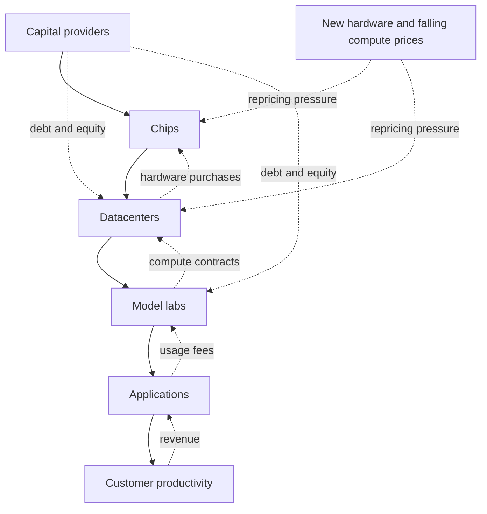

import AiCapexSmallMultiples from "../../components/charts/AiCapexSmallMultiples.astro";
import StaticBarChart from "../../components/charts/StaticBarChart.astro";
import TimelineChart from "../../components/charts/TimelineChart.astro";

I was talking about economic bubbles and artificial intelligence when the conversation kept returning to one question: how many warnings do we receive **before a bubble bursts**, and how long can a warning remain "early" before the market finally turns?

The first half of that question looks measurable, but I do not think it has an honest single answer. Count every pessimistic newspaper column and we can manufacture thousands of warnings. Count only central-bank reports and we miss investors, researchers, and people working inside the affected industry. Search only in English and we distort a global event before the analysis even begins.

The second half is more useful. We can take public warnings that identified a mechanism, choose an explicit market peak or crisis event, and measure the time between them. That does not tell us when the next bubble will burst. It tells us whether "people have been saying this for years" is a good reason to dismiss a warning.

I think it is not. To see why, this post looks at four documented historical warnings, sets out what should count as a warning in the first place, and then holds the current AI investment boom against those lead times.

## What should count as a warning?

Calling something expensive is not enough. Prices can remain expensive for a long time, and a statement such as "the market will fall eventually" is almost impossible to falsify.

For this comparison, a useful warning needs three parts:

1. It was public before the event we now associate with the crash or crisis.
2. It described a mechanism, such as speculative credit, distorted incentives, overvaluation, excessive capacity, or dependence on refinancing.
3. We can name the endpoint used to calculate the lead time.

That last condition is important because a bubble does not burst on one universally accepted date. Was the global financial crisis already underway when US home prices peaked, when subprime funds failed, when Bear Stearns collapsed, or when Lehman Brothers filed for bankruptcy? Different choices produce different lead times. A chart that hides that decision looks more precise than the history really is.

In the following sample, we use explicit endpoints and keep the limitations visible:

{/* | Episode | Public warning | Mechanism identified | Endpoint used | Approximate time | Limitation |
|---|---|---|---|---:|---|
| Wall Street, 1929 | Paul Warburg, March 8, 1929 | Speculation amplified by improper bank lending | Black Tuesday, October 29, 1929 | 0.64 years | One prominent warning, not the first or only warning |
| Dot-com | Alan Greenspan, December 5, 1996 | Asset values lifted by "irrational exuberance" and exposed to a prolonged contraction | Nasdaq peak, March 10, 2000 | 3.26 years | He raised a policy question; he did not date a crash |
| Global financial crisis | Raghuram Rajan, August 27, 2005 | Incentives, tail risk, procyclicality, and fragile market liquidity | Lehman failure, September 15, 2008 | 3.05 years | This was a systemic-risk warning, not a precise housing-bubble forecast |
| Spanish property market | Banco de España, September 2003 | Housing overvaluation, rapid credit growth, and the risk of a sharper adjustment | Start of the correction in 2008 | About 5 years | The source itself describes an approximate five-year interval | */}

<StaticBarChart
  id="warning-lead-times"
  title="A warning can remain early for years"
  description="Time from a selected public warning to the explicit endpoint used in this article. The striped AI interval is different: it is elapsed time without a crash endpoint."
  min={0}
  max={5.25}
  data={[
    { label: "Wall Street", value: 0.64, displayValue: "0.64 years", detail: "Warburg warning → Black Tuesday" },
    { label: "Dot-com", value: 3.26, displayValue: "3.26 years", detail: "Greenspan speech → Nasdaq peak" },
    { label: "Financial crisis", value: 3.05, displayValue: "3.05 years", detail: "Rajan paper → Lehman failure" },
    { label: "Spanish property", value: 5, displayValue: "~5 years", detail: "Banco de España warning → 2008 correction" },
    { label: "AI discussion", value: 3.68, displayValue: "3.68 years", detail: "First article in this timeline → Sep. 10, 2026", tone: "open" },
  ]}
  source="Federal Reserve History; Federal Reserve; Federal Reserve Bank of Kansas City; BIS; TechCrunch. Full links are in References."
  note="The historical sample is illustrative, not exhaustive. The AI bar is not a lead time because there is no crash endpoint."
/>

Let's examine each historical warning in turn.

### 1929: a warning close to the crash

[Paul Warburg warned in March 1929](https://www.federalreservehistory.org/people/paul-m-warburg) that stock speculation and the lending practices supporting it could end badly. Black Tuesday arrived 235 days later, roughly eight months.

This is the kind of example we usually remember because the gap feels short. The mechanism is legible, the crash is famous, and hindsight makes the sequence look almost clean. Even here, however, Warburg was not a clock. The market did not fall because seven months had passed since his warning. Credit conditions, leverage, confidence, and selling pressure interacted until the market could no longer absorb them.

### Dot-com: a famous warning more than three years early

[Alan Greenspan used the phrase "irrational exuberance"](https://www.federalreserve.gov/boarddocs/speeches/19961205.htm) in December 1996. He was asking how central banks should respond when asset values become vulnerable to an unexpected and prolonged contraction. The Nasdaq did not reach its peak until March 2000.

If we had rejected the warning in 1998 because the market had continued to rise, we would have confused timing with mechanism. If we had used the speech to leave the market immediately, we would have spent more than three years watching the boom continue. Both facts can be true.

This is one reason bubble warnings are difficult to use. Being directionally right and being useful for a timed decision are different achievements.

### 2005: Rajan warned about a system, not a date

[Raghuram Rajan's 2005 paper](https://www.kansascityfed.org/documents/3326/PDF-Rajan2005.pdf) is often described as a prediction of the 2008 crisis. That summary gives it more precision than it claimed. Rajan was studying how changes in finance had redistributed risk. His concern was that incentives could push intermediaries toward small-probability tail risks, make the system more procyclical, and leave liquidity unavailable when everybody needed it.

Those mechanisms became central during the crisis. But the paper did not say that Lehman Brothers would fail in September 2008. I use Lehman's failure as the endpoint because it marks the systemic phase of the crisis, not because it turns the paper into a dated forecast.

This distinction matters for the AI comparison. A good warning can describe how losses might propagate without knowing which company, contract, or quarter will trigger the change.

### Spain: the warning was repeated while the imbalance continued

In September 2003, [Banco de España published estimates](https://www.bis.org/speeches/20170724-jaime-caruanas-intervention-spanish-parliament) that housing was already overvalued by roughly 8% to 20%, depending on the model. It also warned that the longer prices took to return toward fundamentals, the greater the risk of an abrupt adjustment. The correction began about five years later.

The five-year gap did not make the underlying credit and valuation problem disappear. It allowed the exposure to keep growing.

## What this small sample can and cannot tell us

The four examples produce lead times ranging from about eight months to five years. That range is useful, but it is not a law. Four selected episodes do not give us a probability distribution for the next crash. I want to share here my reflections, not a new predictive model.

The sample is also vulnerable to hindsight. After a crisis, we remember the people who described a mechanism that later mattered and forget the warnings that pointed to risks that never materialised. A warning can be thoughtful and still be wrong. An intervention can also prevent the warned-about outcome, making a successful warning look unnecessary after the fact.

The practical thought is that the age of a warning is weak evidence, while the mechanism behind it is stronger evidence.

> The age of a warning is weak evidence. The mechanism behind it is stronger evidence.

When someone says that warnings about an AI bubble have circulated for years, the next question should be: which warning, about which part of the market, and what has happened to the mechanism since it was made?

## An explicit AI-bubble warning came 36 days after ChatGPT

[OpenAI released ChatGPT publicly](https://openai.com/index/chatgpt/) on November 30, 2022. On January 5, 2023, [TechCrunch published a survey of more than 35 investors](https://techcrunch.com/2023/01/05/whoops-is-generative-ai-already-becoming-a-bubble/) in which almost half named generative AI as a candidate for the next bubble. Only 36 days separated the product release from that article.

The investors were not arguing that the technology had no value. Several made the opposite point: the underlying technology could be valuable while weak applications attracted capital at valuations their businesses could not support.

The institutional discussion also began earlier than I first thought. In its [November 2023 Financial Stability Review](https://www.ecb.europa.eu/press/financial-stability-publications/fsr/html/ecb.fsr202311~bfe9d7c565.en.html), the European Central Bank explicitly discussed the possibility of an AI-related asset-price bubble, market concentration, and spillovers from a disorderly US equity correction. The ECB [returned to the subject in 2024](https://www.ecb.europa.eu/pub/pdf/fsr/ecb.fsr202411~dd60fc02c3.en.pdf). By November 2025, its [survey evidence showed a market split](https://www.ecb.europa.eu/press/financial-stability-publications/fsr/html/ecb.fsr202511~263b5810d4.en.html): 53% of respondents said AI stocks were in a bubble, while 39% said they were not; 45% named an AI bubble as the largest tail risk.

In 2026, the discussion moved further from commentary into models of investment and financial stability. The [Bank for International Settlements](https://www.bis.org/publications/aer-2026/progress-peril) described the AI build-out as increasingly debt-financed and estimated that the five largest hyperscalers were set to spend more than \$1 trillion on AI-related capital expenditure across 2025 and 2026. A [BIS working paper](https://www.bis.org/publications/working-paper-1367-ai-investment-race) modelled the competitive race itself as a possible cause of overinvestment and contagion through debt and circular financial links.

As of September 10, 2026, 1,344 days have passed since the January 2023 TechCrunch article: 3.68 years. That number is elapsed time since a warning. It is not a lead time, because no endpoint has occurred.

Let's visualize the timeline of AI-bubble to make it clearer.

<TimelineChart
  id="ai-bubble-discussion"
  title="The AI-bubble discussion started almost with the product cycle"
  description="Selected milestones from the public launch of ChatGPT to this article's data cutoff. The line ends at a snapshot, not at a crash."
  events={[
    { date: "Nov. 30, 2022", title: "ChatGPT launches", detail: "OpenAI releases the public research preview." },
    { date: "Jan. 5, 2023", title: "The first warning in this timeline", detail: "TechCrunch surveys more than 35 investors; almost half name generative AI as a bubble candidate.", tone: "warning" },
    { date: "Nov. 2023", title: "The ECB discusses an AI asset-price bubble", detail: "Its Financial Stability Review links concentration and stretched valuations to spillover risk.", tone: "warning" },
    { date: "Nov. 2024", title: "The ECB returns to the comparison", detail: "The financial-stability discussion continues as valuations and concentration rise." },
    { date: "Nov. 2025", title: "Investors are divided", detail: "In the ECB survey, 53% say AI stocks are in a bubble and 39% say they are not." },
    { date: "Jul. 2026", title: "The BIS models the investment race", detail: "A working paper studies strategic overinvestment, debt, and financial links." },
    { date: "Sep. 10, 2026", title: "Today's snapshot", detail: "1,344 days after the January 2023 article, with no crash endpoint.", tone: "current" },
  ]}
  source="OpenAI; TechCrunch; ECB Financial Stability Reviews; BIS Working Papers. Full links are in References."
  note="These are selected public milestones, not a count of every warning."
/>

## "AI bubble" is four different claims hiding in one phrase

Before comparing AI with dot-com, we need to say what might be in a bubble. The phrase is currently doing too much work.

| Possible claim | What would be mispriced | What failure would look like |
|---|---|---|
| Application and startup bubble | Early companies and products with weak differentiation or no durable demand | Down rounds, closures, consolidation, and capital moving to fewer products |
| Public-equity bubble | Expected earnings embedded in share prices | Multiple compression even if company revenue keeps growing |
| Infrastructure overinvestment | Datacenters, accelerators, networking, and energy capacity | Low utilisation, price competition, write-downs, or returns below the cost of capital |
| Credit and systemic bubble | Debt and financial structures supporting the build-out | Refinancing stress, defaults, forced asset sales, and contagion beyond equity holders |

Evidence for one row does not prove the other three. A collection of AI startups can fail while Nvidia continues growing. Nvidia can keep selling chips while datacenter owners earn poor returns. Public technology shares can fall without producing a banking crisis. The technology can transform the economy while investors who financed part of the transformation lose money.

That last combination is the one I find most plausible and the one I want to examine most closely.

## What is genuinely different from dot-com

The simplest version of the dot-com analogy is wrong. I can't believe that I'll tell that, but the largest companies in the current cycle are not merely adding "AI" to a name and selling a promise like many dot-com startups did. They have large businesses, operating income, distribution, and real customers.

Nvidia [reported \$96.2 billion in revenue](https://investor.nvidia.com/news/press-release-details/2026/NVIDIA-Announces-Financial-Results-for-Second-Quarter-Fiscal-2027/default.aspx) for the quarter ending July 26, 2026, up 106% year over year. Data Center contributed \$89 billion, and GAAP gross margin was 75%. [AWS revenue reached \$42.2 billion](https://ir.aboutamazon.com/news-release/news-release-details/2026/Amazon-com-Announces-Second-Quarter-Results/default.aspx) in the second quarter of 2026, up 37%, while Amazon said its AWS AI business had exceeded a \$25 billion annual revenue run rate. [Google Cloud revenue reached \$24.8 billion](https://www.sec.gov/Archives/edgar/data/1652044/000165204426000066/googexhibit991q22026.htm), up 82%, driven in part by enterprise AI infrastructure and solutions. Microsoft [reported 43% growth in Azure](https://www.microsoft.com/en-us/investor/events/fy-2026/earnings-fy-2026-q4) and other cloud services in its fiscal fourth quarter.

Those are not proofs that every investment will earn an adequate return. They are proofs that current demand and monetisation are real (???).

The composition of the leading companies is different too. Alphabet, Amazon, Meta, and Microsoft can finance AI with cash flows from advertising, e-commerce, subscriptions, enterprise software, and existing cloud services. The ECB has repeatedly noted that today's largest companies are more diversified and profitable than many of the firms associated with the peak of the dot-com bubble.

Valuation comparisons point in the same direction, with an important date qualification. A [Nasdaq study published in 2025](https://www.nasdaq.com/articles/global-indexes/is-ai-another-bubble-for-the-nasdaq-100) estimated a Nasdaq-100 trailing price-to-earnings ratio above 100 around the dot-com peak, perhaps reaching 150 to 200 at the extreme, versus the low 30s when that study was written. That does not give us a current September 2026 multiple, but it shows how extreme the historical endpoint was.

At the same time, the broader US market is expensive. One [frequently used series](https://www.multpl.com/shiller-pe/table/by-month) placed the Shiller CAPE around 40.98 on September 9, 2026. CAPE is not a timer, and accounting practices, interest rates, sector mix, and payout policy complicate comparisons across decades. A high reading tells us that expected future earnings carry a heavy burden. It does not tell us what happens next week.

## Profitability does not make the comparison disappear

Saying that today's leaders are profitable corrects one lazy comparison, but it can create another. The dot-com infrastructure boom also had profitable companies.

Cisco [finished fiscal 2000 with \$18.9 billion in sales](https://www.cisco.com/c/dam/en_us/about/ac49/ac20/downloads/annualreport/ar2001/pdf/AR.pdf), \$2.7 billion in net income, and a gross margin above 64%. Demand was real. The Internet was real. Cisco was real. In fiscal 2001, after demand changed, the company recorded a \$2.77 billion provision related to inventory and purchase commitments.

This is the part of the historical analogy worth keeping. A supplier can have excellent products, high margins, and genuine demand while its customers build capacity too quickly. Current profitability disproves the idea that there is no business underneath AI. It does not prove that every dollar of future demand has been priced correctly.

The same distinction applies to Nvidia. Its results show that the company is capturing extraordinary revenue today. They do not yet show the return earned by every company buying the hardware.

## The strongest parallel is infrastructure

The Internet eventually justified a vast physical and digital infrastructure. That did not guarantee a good return for every fibre network, telecom company, equipment supplier, or investor that financed capacity at the end of the 1990s. The long-term demand forecast could be directionally correct while the amount, timing, price, and financing of short-term construction were wrong.

AI has a similar separation between technical adoption and financial return. Alphabet [spent \$80.6 billion on capital expenditure](https://www.sec.gov/Archives/edgar/data/1652044/000165204426000071/goog-20260630.htm) in the first half of 2026, up from \$39.6 billion in the first half of 2025. Meta [guided to \$130-\$145 billion](https://investor.atmeta.com/investor-news/press-release-details/2026/Meta-Reports-Second-Quarter-2026-Results/default.aspx) for the full year. Microsoft [reported \$41 billion of capex](https://www.microsoft.com/en-us/investor/events/fy-2026/earnings-fy-2026-q4) in one quarter and said roughly two-thirds went to short-lived assets, mainly CPUs and GPUs.

These numbers should not appear in one ordinary bar chart. Alphabet's figure is a six-month actual, Meta's is full-year guidance, and Microsoft's is one quarter. They also do not all define AI spending in exactly the same way. A single shared axis would make the comparison look cleaner and more comparable than it is.

<AiCapexSmallMultiples />

The cash-flow effect is already visible at Amazon. Operating cash flow for the twelve months ending June 2026 rose to \$161.4 billion. Free cash flow moved from a positive \$18.2 billion in the previous comparable period to negative \$7.6 billion. Amazon attributed the change primarily to a \$66.1 billion increase in property and equipment purchases, which mainly reflected AI investment.

<StaticBarChart
  id="amazon-free-cash-flow"
  title="Amazon free cash flow crossed zero as investment rose"
  description="Free cash flow for the trailing twelve months ended June in each period. Operating cash flow reached $161.4B in the 2026 period; it is kept as an annotation because it answers a different question."
  min={-10}
  max={20}
  data={[
    { label: "Prior comparable period", value: 18.2, displayValue: "+$18.2B", detail: "Trailing twelve months", tone: "default" },
    { label: "June 2026", value: -7.6, displayValue: "−$7.6B", detail: "Trailing twelve months", tone: "negative" },
  ]}
  source="Amazon, Second Quarter 2026 Results."
  note="Amazon attributed the change primarily to a $66.1B increase in property and equipment purchases, mainly reflecting AI investment. One company and one interval do not establish a sector-wide trend."
/>

The question has therefore moved beyond "does AI work?" The next unit of capex has to justify itself economically.

## A GPU sale is the beginning of the return calculation

When Nvidia sells a GPU, Nvidia can recognise revenue under the applicable contract and accounting rules. For the buyer, the payment begins a longer calculation.

The operator has to pay for hardware, datacenter construction, networking, energy, cooling, maintenance, financing, and replacement. A laboratory has to turn that compute into models and services people will pay for. An application provider has to keep enough value after model and infrastructure costs. The customer at the end of the chain has to receive enough additional revenue, saved labour, improved quality, or reduced risk to keep paying everyone upstream.

Demand growth and return on capital are not the same metric. Token usage can grow tenfold while an operator still earns a disappointing return if prices fall faster, capacity remains idle, energy costs rise, or a new hardware generation makes the previous one economically obsolete earlier than expected.

That possibility is good for users in one sense. Cheaper compute and better models make adoption easier. It can be painful for the owner of an asset financed with a longer payback assumption.

## Depreciation is not an accounting footnote in this cycle

Microsoft's statement that roughly two-thirds of quarterly capex went to short-lived assets deserves more attention than it usually receives. A GPU is not a fibre trench or a building shell. Its physical life and its economic life are different questions.

New accelerators, quantisation, sparsity, specialised chips, smaller models, better inference software, and falling prices per unit of useful computation can change the economics before a server stops working. The asset may still produce tokens while producing less revenue or requiring a write-down.

This creates a possible paradox: the amount of useful AI computation can grow rapidly while the economic value of earlier hardware falls. Technical progress and investor losses can occur at the same time.

## Debt and interconnection change the downside

At the beginning of the cycle, much of the AI build-out could be described as cash-rich companies reinvesting their own earnings. That description is less complete in 2026. The [BIS now characterises the investment surge as increasingly debt-financed](https://www.bis.org/publications/aer-2026/progress-peril), and fixed-income investors are part of the system we need to watch.

CoreWeave makes the structure concrete. At June 30, 2026, it [reported \$13.6 billion outstanding under delayed-draw term loans](https://www.sec.gov/Archives/edgar/data/1769628/000176962826000366/crwv-20260630.htm) and \$16.6 billion in notes. The term loans are collateralised by assets linked to contributed contracts and by pledged contractual cash flows. The structure can work while utilisation, customers, contract payments, hardware values, and refinancing conditions behave as expected. It becomes more sensitive when any of those assumptions change.

The connections also cross company boundaries. Chip suppliers invest in or support infrastructure operators. Operators sign large contracts with model labs. Labs use new financing to support compute commitments. Hyperscalers both invest in model companies and sell them infrastructure. Each contract may be real, but the apparent diversification can still depend on the same economic hypothesis: demand for AI services will grow quickly enough to support every layer.

This is where "circular demand" needs careful language. Interdependence is not evidence of fraud or fake revenue. It is evidence of correlated assumptions.

A [BIS working paper published in July 2026](https://www.bis.org/publications/working-paper-1367-ai-investment-race) modelled competition for a few dominant positions and estimated overinvestment at about 1.5 times the efficient level in its conservative baseline, rising in scenarios where demand was less elastic. That is a model result, not a measurement of how many unused GPUs currently exist. Its value is in exposing the mechanism: when each company invests to avoid losing a winner-take-most race, the sector can commit more capital than would maximise its combined return.

## We cannot honestly map 2026 to 1998 or 1999

It is tempting to ask where we are on the dot-com clock. The comparison produces a satisfying answer because it seems to turn history into a schedule. I do not think the evidence supports that precision.

The current cycle is less extreme than the dot-com peak on some valuation and profitability measures. It is more mature than an early experiment when we look at capex, debt, energy commitments, and the size of the companies involved. Those dimensions do not advance at the same speed. Choosing one historical year would hide that disagreement inside a neat label.

I would rather describe the state directly:

- Demand and revenue are growing quickly.
- The largest suppliers and buyers are profitable.
- Broad-market valuations and concentration leave little room for disappointment.
- Infrastructure investment is growing faster than the evidence we have about long-term returns on that infrastructure.
- Short-lived assets, debt, customer concentration, and cross-company commitments can amplify a revision in expectations.

This is enough to justify attention. It is not enough to date a crash.

## The indicators I'm watching instead of following predictions

Based on what I have been studying and noting about all this madness, a handful of indicators keep coming up. I follow people and sources who track this far more closely than I can, and these are the signals that repeat and tend to converge across the ones I read. I am an engineer, not an economist, so I treat them as things to keep an eye on to understand the changes on the Engineering Market, not as a trading plan.

What I watch:

- Capex that keeps growing faster than the AI revenue it is supposed to produce, across several quarters rather than a single one.
- Compute prices falling while capacity sits idle and financing costs stay fixed. Falling prices on their own can just be healthy progress; combined with idle capacity, they turn into a warning about returns.
- Free cash flow that goes negative and stays there across companies and periods, not one quarter at one firm. Amazon's recent turn is a signal to follow, not a verdict.
- Debt concentrated in specialised operators with few customers and short refinancing windows. Debt at a cash-rich megacap is not the same risk as debt at a narrow operator whose assets can lose value quickly.
- Write-downs on hardware whose economic life turns out shorter than the accounting assumed.
- Customers who keep paying because AI actually raised revenue, cut cost, or improved quality, rather than pilots that never became durable spending.

The honest problem is measurement. The big platforms do not disclose AI revenue and AI capex as separate audited segments, so a clean capex-to-AI-revenue ratio does not really exist, and public utilisation data is thin. That is why disclosures about contract renewals, price concessions, and write-downs end up mattering as proxies, and why I hold all of this loosely.

## Four outcomes that people currently collapse into one

Most conversations treat "the AI bubble bursting" as a single event, but the discussion hides very different endings as we're seen in historical precedents and current market dynamics play out. The table below lays out four of them, from a soft landing to a full financial crisis, with what each one would do to the technology, to the money, and the kind of evidence that would tell me we are heading that way.

| Outcome | What happens to the technology | What happens to investment | What evidence would move us there |
|---|---|---|---|
| Successful diffusion without a large bust | Adoption and productivity grow | Revenue catches capex; debt remains manageable | Broad, durable customer returns and stable infrastructure margins |
| Technology wins, some investors lose | Adoption keeps growing | Infrastructure prices and returns compress; weaker companies fail | Price competition, consolidation, and write-downs without broad contagion |
| Dot-com-style sector correction | AI remains important | Valuations fall, capex is cut, excess capacity is worked through over years | Revenue disappointments combined with lower utilisation and tighter financing |
| Systemic financial crisis | Adoption may continue, but is overwhelmed by financial stress | Forced sales and defaults spread well beyond the sector | Much wider leverage, bank exposure, refinancing dependence, and correlated losses |

If I had to say where I lean while reading and taking notes on all this, it is toward the second outcome: AI keeps becoming economically important while part of the capital committed to the build-out earns a poor return. A dot-com-style correction looks plausible to me. A direct repeat of 2008 would need broader leverage and transmission through the financial system than I can see today.

None of that is a forecast, and it has no date attached. It is the reading I hold right now, and the first one I would drop if the indicators I watch start moving.

## What an AI bubble bursting would probably mean

An AI bust would not require people to stop using AI. The Internet did not disappear after 2000. Traffic, applications, and economic value continued to grow while share prices, fragile companies, and badly timed infrastructure investments were repriced.

The first effects in an AI correction would likely be uneven. Specialised datacenter operators, leveraged infrastructure projects, startups dependent on continuous fundraising, and suppliers exposed to a few customers would face a different risk from diversified companies with cash, distribution, and several business lines. Equity indices could still feel a broad effect because so much market value is concentrated in a small number of firms.

The difference from 2008 remains important. The housing crisis reached household balance sheets and a banking system filled with leveraged mortgage exposure. The AI risk we can currently observe is more concentrated in equities, corporate debt, private credit, and specialised infrastructure. That can still produce contagion. It does not automatically produce the same contagion according to the financial analyst's view.

## The warning has been running for almost four years. That settles nothing.

The first explicit AI-bubble article in this timeline appeared in January 2023. By September 2026, almost four years of continued investment and revenue growth have not made the warning self-evidently correct. They have not made it obsolete either.

Historical warnings in this small sample arrived from eight months to five years before the endpoint we selected. The useful warnings did not simply say that prices were high. They identified the structures that could turn optimism into loss: speculative credit, distorted incentives, fragile liquidity, overvaluation, excess capacity, and dependence on continued financing.

For AI, the strongest warning is not that the technology is useless. The evidence does not support that claim. The stronger warning is that a real and valuable technology can attract more capital, more quickly, and at prices that its future cash flows cannot fully remunerate.

So the question I would keep asking is not whether AI will change the world. It is who will capture the return, how long the assets will remain economically useful, and whether the cash generated at the end of the chain can support the capital being committed at the beginning.

If those answers deteriorate, we will not need a countdown to know the warning has become more serious.

_Data and market conditions in this article are current to September 10, 2026. This is an analysis of technology and investment mechanisms, not investment advice._

## References

### Historical warnings and comparisons

- [Federal Reserve History: Paul M. Warburg](https://www.federalreservehistory.org/people/paul-m-warburg)
- [Federal Reserve: The Challenge of Central Banking in a Democratic Society, December 5, 1996](https://www.federalreserve.gov/boarddocs/speeches/19961205.htm)
- [Federal Reserve Bank of Kansas City: Has Financial Development Made the World Riskier?](https://www.kansascityfed.org/documents/3326/PDF-Rajan2005.pdf)
- [Bank for International Settlements: Jaime Caruana's intervention before the Spanish Parliament](https://www.bis.org/speeches/20170724-jaime-caruanas-intervention-spanish-parliament)
- [Cisco: 2001 Annual Report](https://www.cisco.com/c/dam/en_us/about/ac49/ac20/downloads/annualreport/ar2001/pdf/AR.pdf)

### AI timeline and financial-stability discussion

- [OpenAI: Introducing ChatGPT](https://openai.com/index/chatgpt/)
- [TechCrunch: Whoops! Is generative AI already becoming a bubble?](https://techcrunch.com/2023/01/05/whoops-is-generative-ai-already-becoming-a-bubble/)
- [European Central Bank: Financial Stability Review, November 2023](https://www.ecb.europa.eu/press/financial-stability-publications/fsr/html/ecb.fsr202311~bfe9d7c565.en.html)
- [European Central Bank: Financial Stability Review, November 2024](https://www.ecb.europa.eu/pub/pdf/fsr/ecb.fsr202411~dd60fc02c3.en.pdf)
- [European Central Bank: Financial Stability Review, November 2025](https://www.ecb.europa.eu/press/financial-stability-publications/fsr/html/ecb.fsr202511~263b5810d4.en.html)
- [Bank for International Settlements: 2026 Annual Economic Report: Progress and peril](https://www.bis.org/publications/aer-2026/progress-peril)
- [Bank for International Settlements: AI and the global economy: implications for central banks](https://www.bis.org/publications/bulletin-130-ai-and-global-economy-implications-central-banks)
- [Bank for International Settlements: The AI investment race](https://www.bis.org/publications/working-paper-1367-ai-investment-race)

### Company results and market data

- [Nvidia: Second Quarter Fiscal 2027 Results](https://investor.nvidia.com/news/press-release-details/2026/NVIDIA-Announces-Financial-Results-for-Second-Quarter-Fiscal-2027/default.aspx)
- [Alphabet: Second Quarter 2026 Results](https://www.sec.gov/Archives/edgar/data/1652044/000165204426000066/googexhibit991q22026.htm)
- [Alphabet: Form 10-Q for the quarter ended June 30, 2026](https://www.sec.gov/Archives/edgar/data/1652044/000165204426000071/goog-20260630.htm)
- [Meta: Second Quarter 2026 Results](https://investor.atmeta.com/investor-news/press-release-details/2026/Meta-Reports-Second-Quarter-2026-Results/default.aspx)
- [Microsoft: Fiscal Year 2026 Fourth Quarter Earnings Call](https://www.microsoft.com/en-us/investor/events/fy-2026/earnings-fy-2026-q4)
- [Amazon: Second Quarter 2026 Results](https://ir.aboutamazon.com/news-release/news-release-details/2026/Amazon-com-Announces-Second-Quarter-Results/default.aspx)
- [CoreWeave: Form 10-Q for the quarter ended June 30, 2026](https://www.sec.gov/Archives/edgar/data/1769628/000176962826000366/crwv-20260630.htm)
- [Nasdaq Global Indexes: Is AI Another Bubble for the Nasdaq-100?](https://www.nasdaq.com/articles/global-indexes/is-ai-another-bubble-for-the-nasdaq-100)
- [Robert Shiller: Online Data](https://www.econ.yale.edu/~shiller/data.htm)
- [Multpl: Shiller PE Ratio by Month](https://www.multpl.com/shiller-pe/table/by-month)
