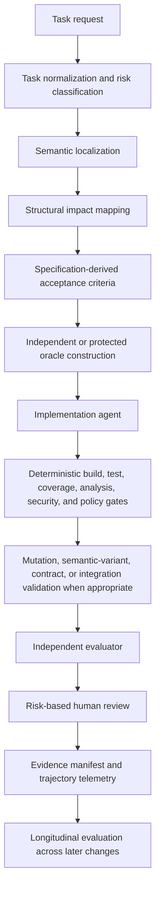

Coding agents can find the right files, follow conventions, write tests, and produce a green build. They can also miss every one of those steps. Even when the build passes, the patch may be wrong or make later changes harder.

Reliability therefore depends on the system around the agent. This article uses recent research on navigation, test quality, longitudinal degradation, and resource variance to propose a reference architecture for that system.

## The model is not the system

In this article, a **coding-agent harness** is the execution and verification system surrounding the model. It prepares the repository, constructs context, provides navigation tools, manages permissions and workflow, runs checks, collects evidence, retries failures, and decides what counts as complete. A system prompt, agent framework, test runner, MCP server, or instruction file may be part of it, but none is the whole harness.

The model is one component in that system. Codex, Claude, Pi, and OpenCode each add internal architecture and failure modes, while the harness determines what they can see and do and which evidence they must produce.

My narrower claim throughout this article is this: **a reliable harness must optimize the repository/project/workspace for agent navigation and move most verification from natural-language instructions into executable, independent, and measurable mechanisms.** Prompts, tests, review, and capable models all remain useful, but none is sufficient alone.

The cited studies measure particular behaviors and failure modes, not this architecture as a complete system. The architecture is an engineering synthesis, not a scientifically validated configuration.

The evidence points to three ideas: **maps** determine what the agent discovers, **oracles** determine whether something can contradict its result, and **erosion** shows whether successive patches make the system harder to extend. They provide this starting map:

| Responsibility | The question it must answer |
|---|---|
| Maps | Did the agent discover the complete change surface? |
| Controls | Did critical workflow steps happen, or were they only requested? |
| Oracles | Can tests and evaluators disagree with the implementation? |
| Evidence | Can engineers inspect and measure the trajectory? |
| Evolution | Did the patch preserve the system's ability to absorb later changes? |

## Requirement one: give the agent a map, not merely more context

Agents see repositories through files, names, imports, search results, tool outputs, and context assembled by the harness. The quality of that interface changes how they work.

### Cleaner code changed the journey, not the destination

The 2026 preprint [*Does Code Cleanliness Affect Coding Agents?*](https://arxiv.org/abs/2605.20049) compared six minimal repository pairs, three primarily Java and three primarily Python. Each pair kept architecture, dependencies, external behavior, and tests constant while changing SonarQube violations and cognitive complexity. The study ran 33 tasks ten times on each side: 660 Claude Sonnet 4.6 trials evaluated by hidden tests at the applications' public surfaces.

Pass rates barely changed: 91.3% on cleaner code and 92.1% on messier code, an absolute difference of -0.9 percentage points. The operational footprint did. On cleaner code, input tokens fell 7.1%, output tokens 8.5%, reasoning characters 11.1%, conversation messages 7.0%, messages before the first edit 3.6%, characters before the first edit 4.6%, lines edited 3.2%, and file revisitations 33.8%. Distinct files read increased 3.2%. Except for pass rate, these are relative changes. [Table 2 and Section 4.1 report these results](https://arxiv.org/abs/2605.20049).

Cleaner code changed the route, not correctness. Reduced uncertainty is a plausible interpretation of fewer revisits, but revisitation is only a behavioral proxy.

Topology changed the effect. Across 14 multi-module tasks, cleaner code reduced pass rate by 2.6 percentage points, input tokens by 10.7%, files read by 0.6%, and revisitations by 50.8%, while lines edited rose 2.2%. Across 13 cognitive-hotspot tasks, pass rate rose 0.1 percentage points, input tokens 1.8%, and files read 11.2%, while revisitations fell 20.2% and lines edited 9.3%. Six calibration tasks completed the set. [Table 3 and Section 4.2 report these results](https://arxiv.org/abs/2605.20049). Cleaner boundaries reduced repeated navigation in multi-module work, while helper extraction sometimes spread hotspot work across more locations.

Two case studies illustrate the distinction. Replacing large opcode dispatch structures with semantically named helpers gave agents precise grep targets: they used 35% fewer input tokens, opened 25% fewer files, edited 31% fewer lines, and used 32% fewer conversation turns. In another task, helper extraction left the focal complexity in place and spread surrounding work across more methods; input tokens rose 8%, while other changes stayed near zero. [Section 4.4 describes both cases](https://arxiv.org/abs/2605.20049). Meaningful boundaries help; moving complexity without improving discoverability can add surface area.

### Identifier names are part of the navigation interface

Names connect task language to repository locations. The 2025 preprint [*When Names Disappear*](https://arxiv.org/abs/2510.03178) evaluated semantics-preserving identifier obfuscations across code summarization and execution prediction. On ClassEval class-level summarization, GPT-4o's rubric score fell from 87.3% to 58.7%, though effects varied by model, task, and benchmark. [Table 2 contains the exact result](https://arxiv.org/abs/2510.03178). This does not show that models understand code only through names; it shows that identifiers carry intent used by at least some models and provide useful targets for symbols and grep.

### Semantic retrieval and structural navigation answer different questions

The CodeCompass preprint evaluated navigation on one FastAPI RealWorld application of about 3,500 lines and 40 source files. It used 30 tasks, Claude Sonnet 4.5 through Claude Code, and three conditions: vanilla, BM25 rankings prepended to the prompt, and a graph tool with the AST-derived edges `IMPORTS`, `INHERITS`, and `INSTANTIATES`. Of 270 planned trials, 258 completed: 89 vanilla, 81 BM25, and 88 graph-enabled. [Sections 4.1-4.5 describe the design](https://arxiv.org/abs/2602.20048).

The tasks covered semantic discovery through shared vocabulary, structural discovery through import chains, and hidden dependencies with little or no lexical overlap.

Architectural Coverage Score (ACS), the primary metric, is the fraction of required files accessed. It measures navigation, not implementation correctness.

| Task type | Vanilla ACS | BM25 ACS | Graph ACS |
|---|---:|---:|---:|
| Semantic | 90.0% | 100.0% | 88.9% |
| Structural | 79.7% | 85.1% | 76.4% |
| Hidden dependency | 76.2% | 78.2% | 99.4% |

BM25 led on semantic tasks; graph navigation led on hidden dependencies but not every category. Overall ACS was 82.0% for vanilla, 87.1% for BM25, and 88.3% with the graph. Complete required-file coverage occurred in 54%, 62%, and 66% of trials, while mean steps to the first required file were 1.67, 1.36, and 1.93. [Sections 5.1 and 5.2 contain the group and aggregate data](https://arxiv.org/abs/2602.20048).

Retrieval asks which files resemble the task; structural navigation asks which files connect to the code being changed. A production harness should combine or select among symbol search, grep, lexical or embedding retrieval, import and call graphs, inheritance, instantiation, dependency injection, registrations, routes, events, configuration consumers, schemas, ownership boundaries, and public contracts. CodeCompass evaluated only imports, inheritance, and instantiation; the rest are engineering extensions.

More context is not the same as a better map.

## Requirement two: instructions are not controls

Tool availability did not ensure use. Across 88 graph-enabled CodeCompass trials, the agent invoked the graph in 37 (42.0%) and ignored it in 51 (58.0%). Mean ACS was 99.5% when used and 80.2% when skipped. Adoption was 22.2% for semantic tasks (6 of 27), 0% for structural tasks (0 of 30), and 100% for hidden-dependency tasks (31 of 31) after a prompt revision. [Section 5.3 reports these values](https://arxiv.org/abs/2602.20048). The model ignored the structural tool during every structural-task execution despite an explicit instruction; the authors suggest it chose a cheaper built-in search heuristic when the task looked easy enough.

Prompt structure still mattered. In an earlier hidden-dependency set, adoption was 85.7% (30 of 35). Moving a mandatory checklist to the prompt's end raised it to 100% (31 of 31), while mean G3 ACS rose from 96.6% to 99.4%. [Section 5.3 documents the intervention](https://arxiv.org/abs/2602.20048).

The evidence supports a narrower operational principle: **a prompt can describe a workflow; it cannot prove that the workflow occurred.**

Style, optional exploration strategies, naming preferences, documentation tone, and response structure can remain advisory. Requirements whose omission can invalidate the result need executable or externally verifiable controls: impact analysis, dependency discovery, test and build commands, protected tests and directories, migration and compatibility checks, schema validation, static analysis, security and secret scanning, dependency policy, approvals, and evidence completeness.

Compare these two forms:

> Inspect all consumers before changing this interface.

That is an expectation. A control changes the state machine:

> The implementation phase cannot begin until an impact map containing known importers, implementations, registrations, and instantiation sites has been generated.

CodeCompass measured tool adoption under prompts, not this control architecture. The design is an engineering response to that gap: the more important the constraint, the less enforcement should depend on model memory.

## Requirement three: separate implementation from its oracle

"The agent wrote tests" says nothing about whether those tests can reject a plausible incorrect implementation.

### Test-writing frequency is not a correctness metric

The 2026 preprint [*Rethinking the Value of Agent-Generated Tests*](https://arxiv.org/abs/2602.07900) ran six models over all 500 SWE-bench Verified tasks with mini-SWE-agent, one trajectory per model-task pair. Claude Opus 4.5 wrote test artifacts in 83.0% of tasks and resolved 74.4%; GPT-5.2 wrote tests in 0.6% and resolved 71.8%; Kimi K2 Thinking and MiniMax M2 wrote tests in 97.4% and 98.6% respectively. Within each model, resolved and unresolved tasks generally had similar test-writing rates. [Table 1 reports the model-level results](https://arxiv.org/abs/2602.07900).

The artifacts often acted as probes. Resolved Claude tasks with tests averaged 25.00 value-revealing print statements and 5.16 assertions; prints outnumbered assertions across all five models in the content analysis. [Table 4 and Figure 2 report the counts](https://arxiv.org/abs/2602.07900).

Encouraging GPT-5.2 to write tests kept its resolved rate at 71.8%, while average input tokens rose 9.0% and output tokens 19.8%. Discouraging Kimi from writing tests cut input tokens 49.0% and API calls 35.4%, while its resolved rate fell 2.6 percentage points. These paired interventions covered the same 500 tasks. [Table 8 reports the results](https://arxiv.org/abs/2602.07900). The study does not show that tests are useless; it shows that test-writing volume was not a dependable success proxy in this lightweight agent environment.

### Tests written after implementation can inherit its mistake

The 2026 preprint [*On the Risk of Coding Before Testing*](https://arxiv.org/abs/2607.05139) compared tests generated from task descriptions with tests generated after exposure to faulty implementations. Across five models and controlled Python benchmarks, specification-only tests detected about 25% of selected faulty implementations, versus about 14% for tests written after the faulty code. Providing both task and code reduced fault detection by 13.2% on average relative to the task alone. [The abstract, Figure 2, and Finding 1 report the aggregate comparison](https://arxiv.org/abs/2607.05139).

The effect appeared in all five models. Generating tests in a fresh interaction before code improved fault detection by 7.9% to 17.7% over the corresponding agentic workflow, depending on the model. Summarization, Chain-of-Thought, and Chain-of-Verification did not remove the gap. [Findings 2 and 3 and Table IV report the comparisons](https://arxiv.org/abs/2607.05139).

Test quantity and statement coverage did not explain the difference. Several configurations reached roughly 95% to 99% line coverage with very different fault-detection rates. [Table V reports test counts and Table VI coverage](https://arxiv.org/abs/2607.05139). The same context and assumptions can align implementation and tests around the same mistake.

The study used HumanEval+, MBPP, and BigCodeBench with researcher-selected faulty Python implementations, so its effect sizes should not be generalized to every repository. It supports defining acceptance criteria before implementation, constructing part of the oracle in a fresh context, preserving held-out scenarios, and protecting independent tests from the implementation agent.

### The changed code may not be exercised

The ICSME 2026 paper [*Test Coverage Analysis of Agentic Pull Requests*](https://arxiv.org/abs/2607.18057) analyzed 4,882 agent-generated pull requests from five agents: 532 Java and 4,350 Python. Of 4,387 PRs that modified code under test, 50.4% contained no test changes. [The abstract and Section IV report the population and classification](https://arxiv.org/abs/2607.18057).

The authors could build and instrument 213 Java and 1,664 Python PRs from the filtered merged subset. Existing tests covered 61.5% of changed executable lines in Java and 27.0% in Python; 64.8% of Python PRs executed none of the changed lines. Agent-added tests increased diff coverage in only 35.9% of Java Code + Tests cases (23 of 64) and 22.5% of Python cases (136 of 605). Lines inside try/catch constructs had miss rates of 86.0% in Java and 81.0% in Python. [Sections III-A and IV report the denominators and results](https://arxiv.org/abs/2607.18057).

Coverage cannot prove that expectations are correct, but it can reveal unexecuted changes. A harness can use changed-code and branch coverage, explicit error scenarios, checks that new tests increase exercised behavior, and integration validation where unit tests cannot reach the boundary.

### A green suite may still accept semantic mistakes

The STING preprint generated operator-based and LLM-based semantic variants of all 500 SWE-bench Verified reference patches, then ran the original regression suites. At least one variant survived in 385 instances, or 77.0%. This does **not** mean 77% of accepted agent patches were wrong; it means those benchmark suites accepted at least one plausible semantic alteration. [Table 3 and RQ1 report the result](https://arxiv.org/abs/2604.01518).

STING generated 1,316 candidate tests and retained 1,014 across 211 instances. Retained tests had to pass the reference patch, fail a surviving variant, and remain valid under behavior-preserving transformations designed to reduce overfitting. With the augmented suites, ten repair agents' resolved rates fell by 4.2 to 9.0 percentage points, changing leaderboard order. [Section 3.4 gives the criteria; RQ2, Table 7, and RQ3 report counts and agent results](https://arxiv.org/abs/2604.01518).

The study diagnoses under-constrained suites; it does not make every mutation realistic or severe, and its LLM-based components used one model. Mutation score is a diagnostic signal, not proof of production correctness.

The oracle requirement is now clearer: **the test suite must contain information that did not originate from the implementation it is judging.**

## Requirement four: challenge the suite, not only the patch

A green suite answers whether the patch passed existing checks. A reliable harness also asks whether those checks can reject credible wrong behavior.

A proportional verification stack can include:

1. specification-derived acceptance criteria;
2. public tests available during implementation;
3. protected or hidden tests;
4. changed-code, branch, and error-path coverage;
5. property-based or generative scenarios;
6. mutation testing and semantic variants;
7. contract and integration tests;
8. an independent evaluator;
9. risk-based human review.

Apply these layers by risk. A documentation correction, authentication change, schema migration, private refactor, and public API change do not need the same controls. A practical classification might use routine, significant, and critical levels based on architectural reach, data and security risk, external contracts, migrations, reversibility, observability, and blast radius. No cited paper tested this taxonomy; it is an engineering mechanism for proportional verification.

## Requirement five: evaluate trajectories, not only patches

One-shot benchmarks miss whether a passing patch makes the next change harder.

Version 2 of the [SlopCodeBench preprint](https://arxiv.org/abs/2603.24755) evaluated 15 coding agents on 36 problems with 196 sequential checkpoints. Each checkpoint extended the agent's previous implementation under an evolving external specification. The benchmark measured correctness, verbosity (redundant or unnecessary code), and structural erosion (complexity accumulating in already-complex functions).

No agent completed a whole problem. The best strict pass rate was 14.8% of 196 checkpoints. Structural erosion increased in 77% of trajectories and verbosity in 75.5%; compared with 473 open-source Python repositories, agent checkpoints averaged 2.0 times more structural erosion and 2.3 times more verbosity. [Sections 2 and 3 and Table 1 describe the benchmark and results](https://arxiv.org/abs/2603.24755).

Quality guidance improved the starting point but did not stop degradation. Depending on prompt and model, initial erosion fell by up to 62.3% and verbosity by up to 34.8%, yet average quality velocity remained 1.3 percentage points per checkpoint. Prompt variants also raised average cost per checkpoint 12.1% and reduced strict correctness 2.3 percentage points in aggregate. [RQ4 and Table 3 summarize the results](https://arxiv.org/abs/2603.24755).

Verbosity and concentrated complexity cover only two dimensions of maintainability. The cleanliness study links repository structure to per-task navigation and cost; SlopCodeBench shows structural degradation across repeated changes. No study demonstrates how the two effects compound in the same repositories and workflows.

A harness therefore needs sequential benchmarks, regression retention, complexity and duplication trajectories, repeated-hotspot tracking, architectural-boundary checks, and tests for earlier requirements. Evaluate a patch by what it fixes and what it makes easier or harder next.

## Requirement six: make the trajectory observable

The final diff does not show why the agent chose its files, which tools it ignored, which tests it ran, or what preceded the successful attempt. Trajectory data turns those unknowns into evidence about navigation, tools, oracles, and workflow design.

When technically and legally appropriate, record the normalized task; model, harness, repository, tool, and policy versions; files discovered, read, revisited, and edited; semantic and structural queries; available and invoked tools; completed or skipped steps; commands; test, gate, coverage, and mutation results; tokens, cache usage, calls, time, retries, and context resets; permission escalations and protected-resource attempts; evaluator decisions, approvals, and final evidence.

Do not store or expose hidden chain-of-thought. Observable actions, artifacts, decisions, commands, and outcomes are enough to distinguish specification, navigation, adoption, implementation, oracle, environment, policy, and evaluation failures. Without that distinction, the harness cannot tell a weak graph from a graph never called, a weak oracle from one that missed the changed path, or a failed gate from a bypassed one.

## Requirement seven: measure efficiency and variance

A single successful run can misrepresent both cost and improvement.

The 2026 preprint [*How Do AI Agents Spend Your Money?*](https://arxiv.org/abs/2604.22750) evaluated eight frontier models through OpenHands on SWE-bench Verified, with four runs per problem. Its abstract summarizes agentic coding as consuming roughly 1,000 times more tokens than code reasoning and chat; the body reports about 3,500 times a single-round reasoning task and 1,200 times a multi-round coding chat task, with repeated input context dominating. Runs on the same task differed by up to 30 times. [Section 2 describes the design; Section 3 reports comparisons and variance](https://arxiv.org/abs/2604.22750).

More tokens did not reliably improve accuracy, which peaked at an intermediate cost and then saturated. Models also predicted consumption poorly: the best Pearson correlation was 0.39, with systematic underestimation. [Figure 3 covers accuracy; Figures 10 and 11 cover self-prediction](https://arxiv.org/abs/2604.22750).

The cleanliness study found similar variance at a smaller scale. Across ten repetitions of the same task and repository side, the most expensive input-token run typically cost about 2.5 times the cheapest, and roughly 72% of task-side groups exceeded 2x. Across 27 non-calibration tasks, cleaner-versus-messier changes ranged from -47% to +44%; cleaner code used fewer tokens on 16 tasks and more on 11. [Section 4.3 reports these results](https://arxiv.org/abs/2605.20049).

Evaluate repeated runs, report distributions, pair comparisons by task, stratify by topology, include calibration tasks, report cost with correctness, and define outlier handling in advance.

Tokens are a resource measure, not money. Financial cost also depends on pricing, cache behavior, model, queueing, infrastructure, and execution strategy.

## A reference architecture derived from the evidence

This architecture synthesizes the evidence; no cited study evaluated it as a whole.

**Task normalization and risk classification** convert an ambiguous request into expected behavior, affected contracts, verification depth, and approvals. The risk class selects proportionate gates.

**Semantic localization** uses symbols, grep, BM25, or embeddings to find shared vocabulary. **Structural impact mapping** follows imports, calls, inheritance, instantiation, dependency injection, registrations, routes, events, configuration keys, schemas, migrations, ownership, and public APIs. CodeCompass evaluated only imports, inheritance, and instantiation; the others are engineering extensions.

**Independent oracle construction** creates acceptance criteria, protected tests, properties, semantic variants, contract scenarios, or failure cases without replaying the implementation context. The implementation agent can see public criteria and tests, but should not control everything that judges it.

**Deterministic gates** cover the checks required by the risk class: formatting, build, type checking, linting, regression tests, changed-code and branch coverage, static analysis, security and dependency scanning, secret detection, compatibility, schemas, migrations, and policy. Each produces an explicit, reproducible result.

**Independent evaluation** looks for specification gaps, unexplained behavior, suspicious test edits, missing failure paths, contract impact, and architecture-sensitive changes. Another agent may share the implementation model's biases, so independence is relative.

**Human review** follows risk, especially for architecture, security, privacy, migrations, financial behavior, legal constraints, irreversible operations, public APIs, and production incidents. The **evidence manifest** records what changed, what ran, what passed or failed, what was not applicable, remaining uncertainty, approvals, and artifact and tool versions.

## Evaluate the harness like a software system

A harness should not accumulate prompts, agents, tools, and gates without measurement. Every layer adds latency, resource cost, false positives, maintenance, and failure modes.

Use ablations: start with a baseline model and standard repository tools, then add semantic localization, structural mapping, independent oracles, deterministic gates, evaluation, and risk-based review one controlled step at a time.

Measure more than pass rate:

- **Correctness:** hidden, regression, contract, and end-to-end pass rates; preserved behavior; defect escape.
- **Navigation:** required-file recall, dependency coverage, precision of inspected files, time to first relevant file, hidden dependencies found, and edits outside the impact map.
- **Oracle strength:** mutation score, semantic variants rejected, surviving plausible errors, weak assertions, false positives, and false negatives.
- **Exercise:** diff, branch, failure-path, and integration-path coverage.
- **Efficiency:** input and output tokens, cache usage, calls, wall-clock time, retries, revisitations, and infrastructure cost.
- **Evolution:** sequential checkpoint success, regression retention, complexity, duplication, hotspot growth, and boundary violations.
- **Operational reliability:** skipped mandatory steps, ignored tools, bypassed gates, protected artifacts modified, environment failures, nondeterminism, and evidence completeness.

Stratify semantic, structural, and hidden dependencies; local, hotspot, and multi-module changes; routine, contract, security, data, architecture, and migration risks; and single-patch versus long-horizon evaluation. Include calibration tasks where a mechanism should have little effect. Improvement there may indicate prompt overhead, benchmark artifacts, or noise.

Each component should justify its cost through controlled evaluation.

## A concise matrix of harness responsibilities

| Harness responsibility | Question | Candidate evidence |
|---|---|---|
| Navigation | Did the agent find the complete change surface? | Required-file recall, dependency coverage, impact map |
| Control | Did mandatory steps happen? | Gate results, protected artifacts, required tool invocations |
| Correctness | Does the requested behavior work? | Hidden, contract, integration, and end-to-end tests |
| Oracle quality | Can tests reject plausible incorrect behavior? | Mutation score, semantic variants, property tests |
| Exercise | Did tests execute the changed behavior? | Diff, branch, and failure-path coverage |
| Efficiency | What did the trajectory cost? | Tokens, calls, wall-clock time, revisits |
| Evidence | Can the result be audited? | Trajectory telemetry and evidence manifest |
| Evolution | Did the patch preserve future changeability? | Sequential checkpoints, complexity and duplication trajectories |

## What these studies do not prove

Most sources are recent preprints without broad independent replication. Some evaluate one model, harness, repository, or set of controlled Python tasks. Their measurements are specific, not universal.

The [cleanliness study](https://arxiv.org/abs/2605.20049) used Claude Sonnet 4.6 in Claude Code and treated SonarQube violations and cognitive complexity as proxies for clean code. [CodeCompass](https://arxiv.org/abs/2602.20048) used one small Python application, measured navigation rather than correctness, and modeled only imports, inheritance, and instantiation. Its discussion also contains inconsistent rounded adoption figures; the result table reports the 58% ignored and 42% used split cited here.

The agent-generated-test study used SWE-bench Verified with mini-SWE-agent. The code-before-test study used controlled Python benchmarks and selected faulty implementations. The pull-request coverage study instrumented only a subset of collected repositories and PRs. Diff coverage cannot judge assertions, and high coverage does not imply a strong oracle.

Mutation testing does not guarantee production correctness. A surviving variant may not be a severe defect, and an oracle patch may not be the only valid implementation. SlopCodeBench measures two dimensions of maintainability. Token counts are not monetary cost. Benchmarks do not reproduce every production constraint.

The reference harness has not been validated as a complete system. Its tools and gates can add regressions, latency, false positives, and maintenance. Keep enforcement proportional to risk and evaluate the harness itself.

## Conclusion: from prompts to proof

A build, tests, and review matter only as much as the harness makes their evidence trustworthy. That requires semantic and structural maps, executable controls for critical steps, oracles independent of the implementation trajectory, observable runs, longitudinal evaluation, and controlled evaluation of the harness itself.

This complements my posts on [code review under increased agent output](/posts/code-review-in-the-ai-era-we-need-to-change/) and [the gap between polished code and real understanding](/posts/your-code-looks-professional-can-you-explain-it/). A reliable harness turns instructions into controls and records enough evidence to justify trust in the resulting patch.

## References

- Bai, L., Huang, Z., Wang, X., Sun, J., Mihalcea, R., Brynjolfsson, E., Pentland, A., & Pei, J. (2026). *How Do AI Agents Spend Your Money? Analyzing and Predicting Token Consumption in Agentic Coding Tasks*. arXiv preprint, version 2. [arXiv:2604.22750](https://arxiv.org/abs/2604.22750).
- Chen, Z., Sun, Z., Shi, Y., Peng, C., Gu, X., Lo, D., & Jiang, L. (2026). *Rethinking the Value of Agent-Generated Tests for LLM-Based Software Engineering Agents*. arXiv preprint, version 2. [arXiv:2602.07900](https://arxiv.org/abs/2602.07900).
- Dipongkor, A. K., Baral, T., Lam, W., & Moran, K. (2026). *Test Coverage Analysis of Agentic Pull Requests*. To appear in the 42nd IEEE International Conference on Software Maintenance and Evolution; arXiv preprint. [arXiv:2607.18057](https://arxiv.org/abs/2607.18057).
- Konstantinou, M., Tambon, F., & Papadakis, M. (2026). *On the Risk of Coding Before Testing: An Empirical Study on LLM-Based Test Generation Workflow*. arXiv preprint. [arXiv:2607.05139](https://arxiv.org/abs/2607.05139).
- Le, C. C., Pham, M. V. T., Van, C. D., Phan, H. N., Phan, H. N., & Nguyen, T. N. (2025). *When Names Disappear: Revealing What LLMs Actually Understand About Code*. arXiv preprint. [arXiv:2510.03178](https://arxiv.org/abs/2510.03178).
- Li, C., Xu, Y., Wang, Z., Tan, S. H., & Chen, T.-H. (Peter). (2026). *Are Benchmark Tests Strong Enough? Mutation-Guided Diagnosis and Augmentation of Regression Suites*. arXiv preprint. [arXiv:2604.01518](https://arxiv.org/abs/2604.01518).
- Orlanski, G., Roy, D., Yun, A., Shin, C., Gu, A., Ge, A., Adila, D., Roberts, N., Sala, F., & Albarghouthi, A. (2026). *SlopCodeBench: Benchmarking How Coding Agents Degrade Over Long-Horizon Iterative Tasks*. arXiv preprint, version 2. [arXiv:2603.24755](https://arxiv.org/abs/2603.24755).
- Paipuru, T. (2026). *CodeCompass: Navigating the Navigation Paradox in Agentic Code Intelligence*. arXiv preprint. [arXiv:2602.20048](https://arxiv.org/abs/2602.20048).
- Trivedi, P., & Schmitt, O. (2026). *Does Code Cleanliness Affect Coding Agents? A Controlled Minimal-Pair Study*. arXiv preprint. [arXiv:2605.20049](https://arxiv.org/abs/2605.20049).
