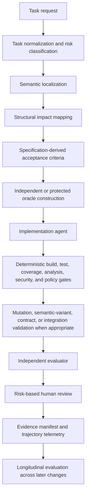

Software engineers have been using coding agents for a while. They have seen them make mistakes, and they have seen them succeed. They have seen them fail to find the right files, fail to follow instructions, fail to write tests, fail to run the suite, and fail to produce evidence. They have also seen them succeed at all of those things.

It is hard to know what to conclude. A green build is not a guarantee of correctness. A patch that passes the suite may still be wrong, and a patch that fails may still be right. The same agent can produce both outcomes on the same task.

And also, we can have our own code design conventions that we would like to the agent follows and, sometimes, the agent may not follow them. It may be a matter of the agent not being able to understand our conventions or it may be a matter of the agent not being able to follow them. Or only ignore our instructions for no reason. In either case, we need to have a way to ensure that the agent is following our conventions.

For a coding agent to be reliable, it must be surrounded by a harness that optimizes the workflow. But, what kind of instructions and controls should that harness provide? How can we know whether the agent is following them? How can we know whether the agent is producing a patch that will survive future changes?

This article synthesizes some evidence from recent research to propose a reference architecture for such a harness.

## The model is not the system

When we run a coding agent, we are not running a model in isolation. We are running a model inside a `system` that prepares the repository, constructs context, provides navigation tools, decomposes tasks, controls flow, manages permissions, runs tests, evaluates results, enforces deterministic gates, collects telemetry, retries failures, and decides when the task is complete.

In this article, a **coding-agent harness** is the execution system surrounding the model. It is broader than a system prompt, an agent framework, a test runner, an MCP server, a collection of scripts, or a set of coding instructions. It is the complete execution and verification environment around the model.

The model is therefore a component of the coding system, not the whole system. The harness decides what the model can see, which actions it may take, which evidence it must produce, and what is allowed to count as complete.

We can also think about the coding agents like a component of the harness. Codex, Claude, Pi, OpenCode, they also have their own internal architecture, and they have their own internal failure modes.

My narrower claim throughout this article is this: **a reliable harness must optimize the repository/project/workspace for agent navigation and move most verification from natural-language instructions into executable, independent, and measurable mechanisms.** Prompts, tests, review, and capable models all remain useful, but none is sufficient alone.

I followed some recent research to support that claim. The studies are not a complete evaluation of the architecture I will propose. They are pieces of evidence about particular behaviors and failure modes. The architecture is an engineering synthesis from their combined evidence, not a scientifically proven configuration.

The research can be organized around three main ideas: **maps**, which determine what the agent discovers; **oracles**, which determine whether the result can be contradicted; and **erosion**, which determines whether a series of successful changes leaves the system easier or harder to extend. From those ideas follow five harness responsibilities.

| Responsibility | The question it must answer |
|---|---|
| Maps | Did the agent discover the complete change surface? |
| Controls | Did critical workflow steps happen, or were they only requested? |
| Oracles | Can tests and evaluators disagree with the implementation? |
| Evidence | Can engineers inspect and measure the trajectory? |
| Evolution | Did the patch preserve the system's ability to absorb later changes? |

## Requirement one: give the agent a map, not merely more context

Repositories do not present themselves to an agent as architecture diagrams. They present files, names, imports, search results, tool outputs, and whatever context the harness chooses to assemble. The quality of that interface changes how the agent works.

### Cleaner code changed the journey, not the destination

The 2026 preprint [*Does Code Cleanliness Affect Coding Agents?*](https://arxiv.org/abs/2605.20049) constructed six minimal pairs of repositories: three primarily Java and three primarily Python. Each pair matched architecture, dependencies, external behavior, and tests while differing in SonarQube violations and cognitive complexity. The authors designed 33 tasks, ran each task ten times on each side, and evaluated 660 Claude Sonnet 4.6 trials with hidden tests at the applications' public surfaces.

Pass rates were effectively unchanged: 91.3% on the cleaner side and 92.1% on the messier side, a difference of -0.9 percentage points. The operational footprint did change. On cleaner code, input tokens fell 7.1%, output tokens 8.5%, reasoning characters 11.1%, conversation messages 7.0%, messages before the first edit 3.6%, and characters before the first edit 4.6%. Distinct files read increased 3.2%, lines edited fell 3.2%, and file revisitations fell 33.8% - the largest aggregate effect in the study. These are relative changes except for the pass-rate difference, which is absolute. [The results appear in Table 2 and Section 4.1 of the preprint](https://arxiv.org/abs/2605.20049).

Cleaner code did not make the model more correct in this experiment. It changed the route the model took. A defensible interpretation is that the cleaner variants reduced uncertainty and repeated checking rather than increasing the model's underlying task-solving ability. That interpretation is plausible, not directly measured: revisitation is a behavioral proxy, not a window into the model's internal state.

The result becomes more interesting when the tasks are separated by topology. Across 14 multi-module tasks, cleaner code changed pass rate by -2.6 percentage points, reduced input tokens by 10.7%, left distinct files read almost flat at -0.6%, reduced revisitations by 50.8%, and increased lines edited by 2.2%. Across 13 cognitive-hotspot tasks, pass rate changed by only +0.1 percentage points, input tokens increased 1.8%, files read increased 11.2%, revisitations fell 20.2%, and lines edited fell 9.3%. Six calibration tasks completed the 33-task set. [These track-level results are reported in Table 3 and Section 4.2](https://arxiv.org/abs/2605.20049).

In multi-module work, cleaner boundaries substantially reduced repeated navigation. In cognitive hotspots, extracting logic into helpers sometimes distributed the work across more locations. That is the tension: searchable structure can make agents cheaper and less uncertain, but decomposition that merely redistributes complexity may increase the navigational surface.

Two case studies make the point concrete. In one task, large opcode dispatch structures had been replaced with semantically named helpers. Agents on the cleaner version used 35% fewer input tokens, opened 25% fewer files, edited 31% fewer lines, and used 32% fewer conversation turns. The files were not simply shorter; the helpers gave the agent precise grep targets. In another task, helper extraction left the focal complexity largely intact while spreading surrounding work across more methods. Input tokens increased 8%, while the other measured changes stayed within a few percentage points of zero. [Both cases are described in Section 4.4](https://arxiv.org/abs/2605.20049).

The evidence supports a narrower claim than "small functions are better for agents." Meaningful structure helps when it creates useful navigation targets and boundaries. Moving complexity without improving discoverability can add surface area instead.

### Identifier names are part of the navigation interface

Names are not cosmetic when an agent has to translate a task written in natural language into repository locations. The 2025 preprint [*When Names Disappear*](https://arxiv.org/abs/2510.03178) created semantics-preserving obfuscations and evaluated code summarization and execution prediction. On ClassEval class-level summarization, GPT-4o's rubric-scored accuracy fell from 87.3% with original identifiers to 58.7% after obfuscation. The study also evaluated other models and tasks, with effects that varied by benchmark. [The exact result is in Table 2](https://arxiv.org/abs/2510.03178).

This does not demonstrate that models understand code only through names. It demonstrates that informative identifiers carry intent that at least some models use heavily for summarization. In a repository workflow, the same names also connect task vocabulary to symbols, grep results, and neighboring concepts. Naming is now both a maintainability mechanism and a retrieval interface.

### Semantic retrieval and structural navigation answer different questions

The CodeCompass preprint evaluated navigation directly. It used one FastAPI RealWorld application of roughly 3,500 lines and 40 source files, 30 tasks divided into three discoverability groups, and Claude Sonnet 4.5 through Claude Code. Of 270 planned trials, 258 completed: 89 vanilla, 81 with BM25 rankings prepended to the prompt, and 88 with a graph-navigation tool. The graph contained only three AST-derived edge types: `IMPORTS`, `INHERITS`, and `INSTANTIATES`. [The design is described in Sections 4.1-4.5](https://arxiv.org/abs/2602.20048).

The task groups were deliberately different. G1 semantic tasks had required files discoverable through task vocabulary. G2 structural tasks required files connected by import chains. G3 hidden-dependency tasks required architecturally connected files with little or no lexical overlap with the task description.

The primary metric, Architectural Coverage Score (ACS), is the fraction of required files the agent accessed. It is a navigation metric, not an implementation-correctness metric. An agent can access every required file and still implement the change incorrectly.

| Task type | Vanilla ACS | BM25 ACS | Graph ACS |
|---|---:|---:|---:|
| Semantic | 90.0% | 100.0% | 88.9% |
| Structural | 79.7% | 85.1% | 76.4% |
| Hidden dependency | 76.2% | 78.2% | 99.4% |

BM25 was best for semantic tasks. Graph navigation was dramatically better for hidden dependencies, but it did not outperform retrieval across every category. Overall ACS was 82.0% for vanilla, 87.1% for BM25, and 88.3% for graph-enabled trials. Complete required-file coverage occurred in 54%, 62%, and 66% of trials respectively, while mean steps to the first required file were 1.67, 1.36, and 1.93. [The group and aggregate data are in Sections 5.1 and 5.2](https://arxiv.org/abs/2602.20048).

Retrieval asks, "Which files resemble the task description?" Structural navigation asks, "Which files are connected to the code being changed?" A production harness should be able to combine or select among symbol search, grep, lexical or embedding retrieval, import and call graphs, inheritance, instantiation, dependency injection, registrations, routes, events, configuration consumers, schemas, ownership boundaries, and public contracts.

Only imports, inheritance, and instantiation were evaluated in CodeCompass. The other relationships are engineering extensions for real repositories, not empirical results from that paper.

More context is not the same as a better map.

## Requirement two: instructions are not controls

The graph tool was effective when used, but availability did not guarantee adoption. Across the 88 graph-enabled CodeCompass trials, the agent invoked it in 37 trials, or 42.0%, and ignored it in 51, or 58.0%. Mean ACS was 99.5% when the tool was used and 80.2% when it was skipped. Adoption was 22.2% for semantic tasks (6 of 27), 0% for structural tasks (0 of 30), and 100% for hidden-dependency tasks (31 of 31) after a prompt revision. [These values are reported in Section 5.3](https://arxiv.org/abs/2602.20048).

The structural group is the uncomfortable result. The model skipped a structural-navigation tool in every structural-task execution, despite an explicit instruction to call it and despite structural navigation being the tool's intended purpose. The authors suggest that the model chose a cheaper built-in search heuristic when the task did not appear difficult enough.

Prompt structure still mattered. In an earlier set of hidden-dependency trials, adoption was 85.7% (30 of 35). Moving a mandatory checklist to the end of the prompt raised adoption to 100% (31 of 31), while mean G3 ACS rose from 96.6% to 99.4%. [The prompt intervention is documented in Section 5.3](https://arxiv.org/abs/2602.20048). Prompts are not irrelevant. They can materially change behavior.

The evidence supports a narrower operational principle: **a prompt can describe a workflow; it cannot prove that the workflow occurred.**

Some instructions can remain advisory: explanation style, optional exploration strategies, naming preferences, documentation tone, or how the final response should be organized. Failure to follow one may reduce consistency without invalidating the engineering result.

Other requirements need an executable or externally verifiable representation: impact analysis, dependency discovery, test and build commands, protected tests, protected directories, migration checks, API compatibility, schema validation, static analysis, security and secret scanning, dependency policy, required approvals, and evidence completeness.

Compare these two forms:

> Inspect all consumers before changing this interface.

That sentence states an expectation. A control changes the state machine:

> The implementation phase cannot begin until an impact map containing known importers, implementations, registrations, and instantiation sites has been generated.

The CodeCompass paper did not evaluate this complete control architecture. It measured tool adoption under prompts. The control design is a synthesis from the gap it observed. The more important a constraint is, the less its enforcement should depend on the model remembering it.

## Requirement three: separate implementation from its oracle

"The agent wrote tests" sounds reassuring because it borrows credibility from a good engineering practice. But a test artifact is not automatically a strong oracle. The relevant question is whether it can reject a plausible incorrect implementation.

### Test-writing frequency is not a correctness metric

The 2026 preprint [*Rethinking the Value of Agent-Generated Tests*](https://arxiv.org/abs/2602.07900) ran six models over all 500 SWE-bench Verified tasks using mini-SWE-agent, producing one trajectory per model-task pair. Claude Opus 4.5 wrote test artifacts in 83.0% of tasks and resolved 74.4%. GPT-5.2 wrote tests in only 0.6% and resolved 71.8%. Kimi K2 Thinking and MiniMax M2 wrote tests in 97.4% and 98.6% of tasks respectively. Within each model, resolved and unresolved tasks generally had similar test-writing rates. [The model-level results are in Table 1](https://arxiv.org/abs/2602.07900).

The artifacts often behaved as probes rather than discriminative tests. For resolved Claude tasks that included tests, the study measured an average of 25.00 value-revealing print statements and 5.16 assertions per task. Across all five models included in this content analysis, prints outnumbered assertions. [The signal counts are reported in Table 4 and Figure 2](https://arxiv.org/abs/2602.07900).

Prompt interventions changed cost more than outcome. Encouraging GPT-5.2 to write tests left its resolved rate at 71.8%, while average input tokens rose 9.0% and output tokens 19.8%. Discouraging Kimi from writing tests reduced input tokens by 49.0% and API calls by 35.4%, while its resolved rate fell 2.6 percentage points. These were paired interventions over the same 500 tasks; the authors do not claim that tests never help. [The intervention results are in Table 8](https://arxiv.org/abs/2602.07900).

The study measured spontaneous behavior in one lightweight agent environment. It does not demonstrate that testing is useless. It shows that test-writing volume was not a dependable proxy for success in that setting, and that asking for more tests could alter resource use far more than resolution.

### Tests written after implementation can inherit its mistake

Another 2026 preprint, [*On the Risk of Coding Before Testing*](https://arxiv.org/abs/2607.05139), compared tests generated independently from task descriptions with tests generated after exposure to faulty implementations. Across five models and controlled Python programming benchmarks, specification-only tests detected about 25% of the selected faulty implementations, while tests generated after the faulty code detected about 14%. Providing both task and code reduced fault detection by 13.2% on average relative to the task alone. [The aggregate comparison appears in the abstract, Figure 2, and Finding 1](https://arxiv.org/abs/2607.05139).

The effect appeared for all five evaluated models. In test-driven workflows, where test generation occurred in a fresh interaction before code generation, fault detection improved by 7.9% to 17.7% relative to the corresponding agentic workflow, depending on the model. Summarization, Chain-of-Thought, and Chain-of-Verification did not remove the gap. [The workflow comparisons are reported in Findings 2 and 3 and Table IV](https://arxiv.org/abs/2607.05139).

Neither test quantity nor statement coverage explained the difference. Several configurations reached roughly 95% to 99% line coverage while showing very different fault-detection rates. [Table V reports test counts and Table VI reports coverage](https://arxiv.org/abs/2607.05139). Coverage and oracle strength were measuring different things.

The same model can make the implementation and the tests mutually consistent without making either correct. That does not imply intent to manipulate the suite. It means shared context and assumptions can align two artifacts around the same error.

The study used HumanEval+, MBPP, and BigCodeBench to construct researcher-selected faulty Python implementations. Its effect sizes should not be assumed for every enterprise repository. But it supports concrete harness requirements: define acceptance criteria before implementation, construct at least part of the oracle in a fresh context, preserve held-out scenarios, protect independent tests from the implementation agent, and evaluate against information that did not originate in the implementation trajectory.

### The changed code may not be exercised

The ICSME 2026 paper [*Test Coverage Analysis of Agentic Pull Requests*](https://arxiv.org/abs/2607.18057) analyzed 4,882 agent-generated pull requests from five coding agents: 532 Java PRs and 4,350 Python PRs. Among 4,387 PRs that modified code under test, 50.4% contained no test changes. [The population and classification are reported in the abstract and Section IV](https://arxiv.org/abs/2607.18057).

For coverage, the authors could build and instrument 213 Java and 1,664 Python PRs from the filtered merged subset. Existing tests covered 61.5% of changed executable lines in Java and 27.0% in Python; 64.8% of Python PRs had zero changed lines executed. Among Code + Tests PRs, agent-added tests increased diff coverage in only 35.9% of Java cases (23 of 64) and 22.5% of Python cases (136 of 605). Lines inside try/catch constructs had miss rates of 86.0% in Java and 81.0% in Python. [The denominators and results appear in Sections III-A and IV](https://arxiv.org/abs/2607.18057).

Coverage cannot prove that expectations are correct. It can show that changed behavior was not executed. Zero diff coverage is therefore strong evidence of a validation gap, especially for failure paths that happy-path suites routinely miss.

A harness can act on that distinction with changed-code coverage, branch coverage, explicit error scenarios, checks that new tests increase exercised behavior, and integration-level validation where unit tests cannot reach the real boundary.

### A green suite may still accept semantic mistakes

The STING preprint started with all 500 SWE-bench Verified reference patches, generated operator-based and LLM-based semantic variants in the patch region, and ran the original regression suites against them. In 385 instances, or 77.0%, at least one program variant survived the original tests. That statement does **not** mean 77% of accepted agent patches were wrong. It means that in 77% of benchmark instances, the suite accepted at least one plausible semantic alteration of the reference patch. [The result is in Table 3 and RQ1](https://arxiv.org/abs/2604.01518).

STING generated 1,316 candidate tests and retained 1,014 across 211 instances. A retained test had to pass the reference patch, fail at least one surviving variant, and remain valid under behavior-preserving transformations intended to reduce implementation-specific overfitting. Re-evaluating ten repair agents with the augmented suites reduced their resolved rates by 4.2 to 9.0 percentage points and changed leaderboard ordering. [The validation criteria appear in Section 3.4; counts and agent results appear in RQ2, Table 7, and RQ3](https://arxiv.org/abs/2604.01518).

The study diagnoses under-constrained suites. It does not prove that every mutation is equally realistic or severe, and its LLM-based components used one model. Mutation score is a diagnostic signal, not proof of production correctness.

The oracle requirement is now clearer: **the test suite must contain information that did not originate from the implementation it is judging.**

## Requirement four: challenge the suite, not only the patch

Most workflows ask one question: does the patch pass the suite? A more reliable harness asks a second: can this suite reject credible wrong behavior?

A proportional verification stack can include:

1. specification-derived acceptance criteria;
2. public tests available during implementation;
3. protected or hidden tests;
4. changed-code, branch, and error-path coverage;
5. property-based or generative scenarios;
6. mutation testing and semantic variants;
7. contract and integration tests;
8. an independent evaluator;
9. risk-based human review.

Not every layer belongs on every task. A documentation correction should not pay the verification cost of an authentication change. Formatting does not need the same controls as a schema migration. A private helper refactor does not carry the contract risk of a public API change.

That suggests risk classification, perhaps routine, significant, and critical, informed by architectural reach, data and security risk, external contracts, migrations, reversibility, observability, and blast radius. No paper above tested that taxonomy. It is an engineering mechanism for applying the evidence proportionally.

## Requirement five: evaluate trajectories, not only patches

One-shot benchmarks hide an important cost. A patch can pass now while making the next patch harder.

Version 2 of the [SlopCodeBench preprint](https://arxiv.org/abs/2603.24755) evaluated 15 coding agents on 36 problems containing 196 sequential checkpoints. Each checkpoint extended the agent's own previous implementation under an evolving external specification. The benchmark measured correctness plus two deliberately limited quality dimensions: verbosity, meaning redundant or unnecessary code, and structural erosion, meaning complexity concentrated in already-complex functions.

No evaluated agent completed an entire problem end to end. The best strict pass rate was 14.8% of the 196 checkpoints. Structural erosion increased in 77% of trajectories and verbosity in 75.5%. Against a comparison panel of 473 open-source Python repositories, agent checkpoints averaged 2.0 times more structural erosion and 2.3 times more verbosity. [The benchmark design and results appear in Sections 2, 3, and Table 1](https://arxiv.org/abs/2603.24755).

Explicit quality guidance improved the starting point but did not stop degradation. Depending on the prompt and model, initial erosion fell by as much as 62.3% and initial verbosity by as much as 34.8%, yet average quality velocity remained 1.3 percentage points per checkpoint. Prompt variants also raised cost per checkpoint by 12.1% on average and reduced strict correctness by 2.3 percentage points in the aggregate comparison. [These results are summarized under RQ4 and Table 3](https://arxiv.org/abs/2603.24755).

Verbosity and concentrated complexity are not a complete definition of maintainability. They are two measurable dimensions. Still, the longitudinal result exposes what single-patch evaluation cannot see.

The connection to the cleanliness study must remain cautious. One controlled study shows that repository structure changes per-task cost and navigation. Another long-horizon benchmark shows that agents often erode structure while repeatedly modifying their own code. No study yet demonstrates exactly how the first effect compounds into the second in the same repositories and workflows. This remains an open empirical question.

A harness therefore needs sequential benchmarks, regression retention across checkpoints, complexity and duplication trajectories, repeated-hotspot tracking, architectural-boundary checks, and tests for requirements satisfied earlier in the sequence.

A patch should be evaluated not only by what it fixes, but by what it makes easier or harder next.

## Requirement six: make the trajectory observable

The final diff does not explain why the agent chose those files, which tools it ignored, which tests it ran, or what happened before the successful attempt. Without that information, a failed patch is merely a failure. With trajectory data, it becomes evidence about navigation, tools, oracles, and workflow design.

When technically and legally appropriate, a harness should record the normalized task, model and harness versions, repository revision, tool and policy versions, files discovered, read, revisited, and edited, semantic and structural queries, tool calls, tools available but unused, mandatory steps completed or skipped, commands, test and gate results, coverage and mutation changes, tokens, cache usage, API calls, wall-clock time, retries, context resets, permission escalations, protected-resource attempts, evaluator decisions, approvals, and final evidence for completion.

This is not a request to store or expose hidden chain-of-thought. Observable actions, artifacts, decisions, commands, and outcomes are enough to distinguish specification failure from navigation, adoption, implementation, oracle, environment, policy, or evaluation failure.

The distinction matters operationally. A harness cannot improve a graph that was never called, a test oracle that never reached the changed path, or a gate that was silently bypassed unless it can tell those failures apart.

## Requirement seven: measure efficiency and variance

Agent trajectories are stochastic enough that a single successful run can mislead us about both cost and improvement.

The 2026 preprint [*How Do AI Agents Spend Your Money?*](https://arxiv.org/abs/2604.22750) evaluated eight frontier models through OpenHands on SWE-bench Verified, with four independent runs per problem. The paper's abstract summarizes agentic coding as consuming roughly 1,000 times more tokens than code reasoning and chat. The more precise body comparison reports about 3,500 times a single-round reasoning task and 1,200 times a multi-round coding chat task, with repeated input context dominating consumption. Some runs on the same task differed by up to 30 times in total tokens. [The study design is in Section 2; comparisons and variance are in Section 3](https://arxiv.org/abs/2604.22750).

More tokens did not reliably produce more accuracy. Across repeated runs, accuracy peaked at an intermediate cost level and then saturated. The models also predicted their own consumption poorly: the best reported Pearson correlation was 0.39, and predictions systematically underestimated actual usage. [The accuracy analysis is in Figure 3; self-prediction is in Figures 10 and 11](https://arxiv.org/abs/2604.22750).

The cleanliness study found the same methodological problem at a smaller scale. For ten repetitions of the same task on the same repository side, the most expensive input-token run typically cost about 2.5 times the cheapest, and roughly 72% of task-side groups exceeded a 2x ratio. Across 27 non-calibration tasks, per-task cleaner-versus-messier input-token changes ranged from -47% to +44%; cleaner code used fewer tokens on 16 tasks and more on 11. [These results are in Section 4.3](https://arxiv.org/abs/2605.20049).

A single run is not sufficient evidence that a harness change helped. Evaluate repeated runs, report distributions rather than averages alone, pair comparisons at task level, stratify by task topology, include calibration tasks, report cost and correctness together, and define outlier handling before seeing the result.

Tokens are not money. Financial cost depends on provider pricing, cache behavior, model, queueing, infrastructure, and execution strategy. Token counts are still a useful resource measure, but converting them directly to currency hides configuration-dependent assumptions.

## A reference architecture derived from the evidence

The following architecture is a synthesis of the evidence, not a configuration directly evaluated by any single study.

**Task normalization and risk classification** turn an ambiguous request into expected behavior, affected contracts, verification depth, and required approvals. The risk class determines which later gates are proportionate.

**Semantic localization** uses symbols, grep, BM25, or embeddings to find code that shares vocabulary or concepts with the task. **Structural impact mapping** follows relationships that may share no vocabulary: imports, calls, inheritance, instantiation, dependency injection, registrations, routes, events, configuration keys, schemas, migrations, ownership, and public APIs. CodeCompass empirically evaluated only imports, inheritance, and instantiation; the rest are extensions.

**Independent oracle construction** produces some combination of acceptance criteria, protected tests, properties, semantic variants, contract scenarios, and failure cases without simply replaying the implementation context. The implementation agent can see public criteria and tests where useful, but it should not control every artifact that will judge it.

**Deterministic gates** can include formatting, build, type checking, linting, regression tests, diff and branch coverage, static analysis, security and dependency scanning, secret detection, compatibility checks, schemas, migrations, and policy. The point is not to run everything. It is to make required checks produce explicit, reproducible outcomes.

**Independent evaluation** looks for specification gaps, unexplained behavior, suspicious test edits, missing failure paths, contract impact, and architecture-sensitive changes. Independence is relative, not magical. Another agent can share the implementation model's training and biases; it should not automatically be treated as an objective oracle.

**Human review** remains important where expectations are ambiguous or weakly formalized: architecture, security, privacy, migrations, financial behavior, legal constraints, irreversible operations, public APIs, and production-incident risk. That does not require humans to read every line of every patch. It requires review effort to follow risk.

Finally, the **evidence manifest** provides machine-readable and human-readable records of what changed, what was inspected and executed, what passed or failed, which checks were not applicable, what uncertainty remains, who approved the result, and which artifact and tool versions produced it.

## Evaluate the harness like a software system

A harness should not improve by accumulating longer prompts, more agents, more tools, and more gates without measurement. Every layer adds latency, token and infrastructure cost, false positives, cognitive overhead, maintenance, and new failure modes.

Use ablations. Compare a baseline model with standard repository tools against semantic localization, then add structural mapping, independent oracle construction, deterministic gates, an evaluator, and risk-based review one controlled step at a time.

Measure more than pass rate:

- **Correctness:** hidden, regression, contract, and end-to-end pass rates; preserved behavior; defect escape.
- **Navigation:** required-file recall, dependency coverage, precision of inspected files, time to first relevant file, hidden dependencies found, and edits outside the impact map.
- **Oracle strength:** mutation score, semantic variants rejected, surviving plausible errors, weak assertions, false positives, and false negatives.
- **Exercise:** diff, branch, failure-path, and integration-path coverage.
- **Efficiency:** input and output tokens, cache usage, calls, wall-clock time, retries, revisitations, and infrastructure cost.
- **Evolution:** sequential checkpoint success, regression retention, complexity, duplication, hotspot growth, and boundary violations.
- **Operational reliability:** skipped mandatory steps, ignored tools, bypassed gates, protected artifacts modified, environment failures, nondeterminism, and evidence completeness.

Stratify the tasks too. Separate semantic, structural, and hidden dependencies; local, hotspot, and multi-module changes; routine, contract, security, data, architecture, and migration risks; and single-patch from long-horizon evaluation. Include calibration tasks where a mechanism should have little effect. If a new component appears to improve everything, including tasks where it should be irrelevant, you may be measuring prompt overhead, benchmark artifacts, or noise.

A reliable harness should not merely contain more scaffolding. Each component should justify its cost through controlled evaluation.

## A concise matrix of harness responsibilities

| Harness responsibility | Question | Candidate evidence |
|---|---|---|
| Navigation | Did the agent find the complete change surface? | Required-file recall, dependency coverage, impact map |
| Control | Did mandatory steps happen? | Gate results, protected artifacts, required tool invocations |
| Correctness | Does the requested behavior work? | Hidden, contract, integration, and end-to-end tests |
| Oracle quality | Can tests reject plausible incorrect behavior? | Mutation score, semantic variants, property tests |
| Exercise | Did tests execute the changed behavior? | Diff, branch, and failure-path coverage |
| Efficiency | What did the trajectory cost? | Tokens, calls, wall-clock time, revisits |
| Evidence | Can the result be audited? | Trajectory telemetry and evidence manifest |
| Evolution | Did the patch preserve future changeability? | Sequential checkpoints, complexity and duplication trajectories |

## What these studies do not prove

Most of the sources in this article are recent preprints, and several have not yet received broad independent replication. Some evaluate one model, one harness, one repository, or controlled Python tasks. Their measurements are useful because they are specific, not because they settle every production question.

The [cleanliness study](https://arxiv.org/abs/2605.20049) used Claude Sonnet 4.6 in Claude Code and treated SonarQube violations and cognitive complexity as proxies, not a complete definition of clean code. [CodeCompass](https://arxiv.org/abs/2602.20048) used one relatively small Python application, measured ACS rather than implementation correctness, and built its graph from only imports, inheritance, and instantiation. Its own discussion also contains inconsistent rounded adoption figures, while the result table reports the 58% ignored and 42% used split cited here.

The agent-generated-test study used SWE-bench Verified with mini-SWE-agent. The code-before-test study used controlled Python benchmarks and selected faulty implementations. The pull-request coverage study could instrument only a subset of the collected repositories and PRs. Diff coverage cannot determine whether assertions are correct, and high coverage does not imply a strong oracle.

Mutation testing does not guarantee production correctness. A surviving variant is not automatically a severe real-world defect, and an oracle patch may not be the only valid implementation. SlopCodeBench measures verbosity and complexity concentration, not every dimension of maintainability. Token counts are not monetary cost. Benchmarks do not reproduce every production constraint.

Most importantly, the reference harness described here has not been validated as a complete system. Added tools and gates can create regressions, latency, false positives, and their own maintenance burden. Enforcement should remain proportional to task risk, and the harness itself should remain under evaluation.

## Conclusion: from prompts to proof

Return to the green patch. The build still matters. Tests still matter. Review still matters. But the harness determines how much confidence those signals deserve.

The agent needs a map that combines semantic and structural discovery. Critical workflow steps need executable controls. Tests need information independent of the implementation trajectory. The suite needs to be challenged, not merely passed. The trajectory needs to be observable, the patch needs to be evaluated against later changes, and the harness needs controlled evaluation of its own.

This extends, rather than replaces, the human concerns I have written about in [code review under increased agent output](/posts/code-review-in-the-ai-era-we-need-to-change/) and [the gap between polished code and real understanding](/posts/your-code-looks-professional-can-you-explain-it/). The question here is different: what must the execution system assume responsibility for before a patch is allowed to present itself as trustworthy?

A reliable harness does not merely ask an agent to behave correctly. It gives the agent a map, surrounds the implementation with independent oracles, turns critical instructions into executable controls, and records enough evidence to show why the resulting patch should be trusted.

## References

- Bai, L., Huang, Z., Wang, X., Sun, J., Mihalcea, R., Brynjolfsson, E., Pentland, A., & Pei, J. (2026). *How Do AI Agents Spend Your Money? Analyzing and Predicting Token Consumption in Agentic Coding Tasks*. arXiv preprint, version 2. [arXiv:2604.22750](https://arxiv.org/abs/2604.22750).
- Chen, Z., Sun, Z., Shi, Y., Peng, C., Gu, X., Lo, D., & Jiang, L. (2026). *Rethinking the Value of Agent-Generated Tests for LLM-Based Software Engineering Agents*. arXiv preprint, version 2. [arXiv:2602.07900](https://arxiv.org/abs/2602.07900).
- Dipongkor, A. K., Baral, T., Lam, W., & Moran, K. (2026). *Test Coverage Analysis of Agentic Pull Requests*. To appear in the 42nd IEEE International Conference on Software Maintenance and Evolution; arXiv preprint. [arXiv:2607.18057](https://arxiv.org/abs/2607.18057).
- Konstantinou, M., Tambon, F., & Papadakis, M. (2026). *On the Risk of Coding Before Testing: An Empirical Study on LLM-Based Test Generation Workflow*. arXiv preprint. [arXiv:2607.05139](https://arxiv.org/abs/2607.05139).
- Le, C. C., Pham, M. V. T., Van, C. D., Phan, H. N., Phan, H. N., & Nguyen, T. N. (2025). *When Names Disappear: Revealing What LLMs Actually Understand About Code*. arXiv preprint. [arXiv:2510.03178](https://arxiv.org/abs/2510.03178).
- Li, C., Xu, Y., Wang, Z., Tan, S. H., & Chen, T.-H. (Peter). (2026). *Are Benchmark Tests Strong Enough? Mutation-Guided Diagnosis and Augmentation of Regression Suites*. arXiv preprint. [arXiv:2604.01518](https://arxiv.org/abs/2604.01518).
- Orlanski, G., Roy, D., Yun, A., Shin, C., Gu, A., Ge, A., Adila, D., Roberts, N., Sala, F., & Albarghouthi, A. (2026). *SlopCodeBench: Benchmarking How Coding Agents Degrade Over Long-Horizon Iterative Tasks*. arXiv preprint, version 2. [arXiv:2603.24755](https://arxiv.org/abs/2603.24755).
- Paipuru, T. (2026). *CodeCompass: Navigating the Navigation Paradox in Agentic Code Intelligence*. arXiv preprint. [arXiv:2602.20048](https://arxiv.org/abs/2602.20048).
- Trivedi, P., & Schmitt, O. (2026). *Does Code Cleanliness Affect Coding Agents? A Controlled Minimal-Pair Study*. arXiv preprint. [arXiv:2605.20049](https://arxiv.org/abs/2605.20049).
