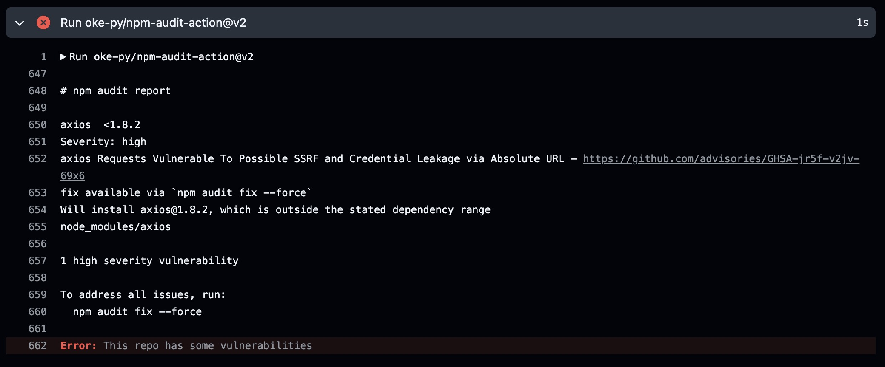
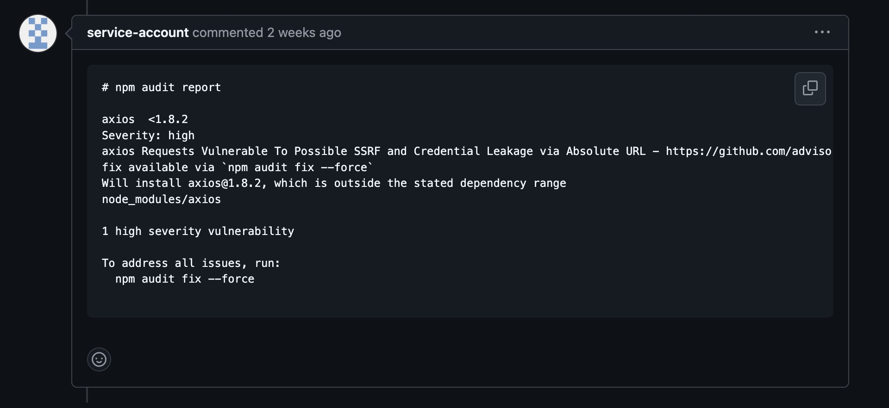

Most of the code in a modern software project is made up of third-party code through dependencies such as libraries and frameworks. It's easy to have a security issue with some dependency that has cascading effects, compromising our entire application. GitHub Actions provides a powerful and convenient way to automate this security check directly within our repository.

## Understanding the Problem

Open-source software is a cornerstone of modern development but also introduces potential risks. The libraries and packages you rely on might contain vulnerabilities that malicious actors can exploit. Manually tracking and updating dependencies to address these vulnerabilities is time-consuming and error-prone.

## The GitHub Actions Solution

GitHub Actions allows us to create workflows that automatically execute tasks within your repository based on specific events. In the context of dependency vulnerability scanning, this means you can trigger a scan whenever changes are made to your project's dependencies.

## Key Components of the Workflow

**Trigger:** The workflow is typically triggered by events such as pull requests being opened, reopened, or synchronized. This ensures that dependencies are checked whenever new code is introduced.
**Environment:** The workflow runs within a specified environment.
**Dependencies:** The workflow installs our project's dependencies using a package manager like NPM.
**Vulnerability Scan:** The core of this workflow will be the vulnerability scanning tool. Tools like `npm audit` (for Node.js projects or modern frontend applications) can analyze our project's dependencies and identify known vulnerabilities.
**Reporting:** The workflow can be configured to report the scan results in various ways. We can create issues within our repository, send notifications via email or Slack, or even fail the workflow if critical vulnerabilities are found.
Example Workflow (using npm audit)

```yml title="on_pull_request.yml"
name: on_pull_request

on:
  pull_request:
    types:
      - opened
      - reopened
      - synchronize

jobs:
  scan:
    name: npm audit
    runs-on: ubuntu-latest
    steps:
      - uses: actions/checkout@v4
      - name: install dependencies
        run: npm ci
      - uses: oke-py/npm-audit-action@v2
        with:
          audit_level: moderate
          create_issues: false
```

In the case of this Workflow fails, we'll not be able to merge the pull request. We'll see the error in the Actions and the Pull Requests interface.

In the Actions, we'll see something like this:



And in the pull request, we'll receive a message like this:



Pay attention to the **audit_level** because its default value is **low**. I prefer to keep it in the **moderate** level to be a bit more cautious with the dependencies.

If you want we can create issues when we have new dependencies issues by adding the **create_issues** key in the configuration.

```yml title="on_pull_request.yml" ins={21,22,23,24}
name: on_pull_request

on:
  pull_request:
    types:
      - opened
      - reopened
      - synchronize

jobs:
  scan:
    name: npm audit
    runs-on: ubuntu-latest
    steps:
      - uses: actions/checkout@v4
      - name: install dependencies
        run: npm ci
      - uses: oke-py/npm-audit-action@v2
        with:
          audit_level: moderate
          create_issues: true
          issue_assignees: SOME GITHUB USERNAME OR A SERVICE ACCOUNT
          issue_labels: vulnerability
          dedupe_issues: true
```

If you want we could also don't add new pull request comments and keep only the issues.

```yml title="on_pull_request.yml" ins={21}
name: on_pull_request

on:
  pull_request:
    types:
      - opened
      - reopened
      - synchronize

jobs:
  scan:
    name: npm audit
    runs-on: ubuntu-latest
    steps:
      - uses: actions/checkout@v4
      - name: install dependencies
        run: npm ci
      - uses: oke-py/npm-audit-action@v2
        with:
          audit_level: moderate
          create_pr_comments: false
          create_issues: true
          issue_assignees: SOME GITHUB USERNAME OR A SERVICE ACCOUNT
          issue_labels: vulnerability
          dedupe_issues: true
```

## Conclusion

Integrating dependency vulnerability scanning into our GitHub Actions workflows is a proactive step toward ensuring the security of our software. By automating this process, we can catch potential issues early and prevent them from escalating into major problems.

## References

[GitHub Action to run `npm audit` - oke-py/npm-audit-action](https://github.com/oke-py/npm-audit-action/tree/v2/)
