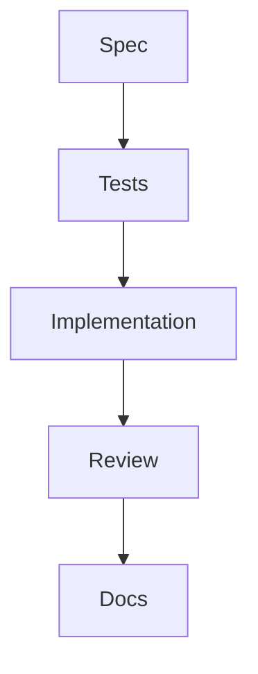
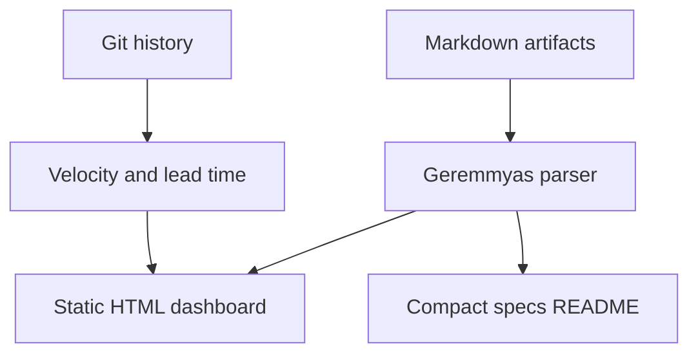

I have been using AI coding assistants long enough to feel the shape of the problem change under my hands.

At first, the hard part was getting useful code from the model. Then the tools improved. Context windows grew. Agents started editing multiple files, running tests, reading logs, and recovering from mistakes. Suddenly the problem was not "can the assistant write code?" anymore. The problem became "can I keep the work coherent while the assistant moves fast?"

For that, we need to create an environment evolving our agents. Skills, instructions, prompts, AGENTS.md, files and more files.

And every serious project needed the same setup again: project rules, coding conventions, review prompts, testing expectations, security guardrails, bugfix workflows, spec templates, and instructions for how the assistant should behave when it is unsure. I could copy those files by hand, but I work in more than one project and in a loot of different languages and stack.

So I built [Geremmyas](https://github.com/woliveiras/geremmyas) for help me on that job!

Geremmyas is a CLI for installing opinionated AI coding assistant configurations into a project. More precisely, it install a **Spec-Driven Development harness for AI coding assistants** on your project.

Today I'll share why I created Geremmyas and how to use it if you get interested in that on the end of the post.

## Why I built Geremmyas

The first time you configure an AI coding assistant for a project, it feels like a simple work setup. You add the AGENTS.md, copilot-instructions.md, CLAUDE.md or something similar, a few instructions files, some propmpt files, maybe some hooks.Maybe you write down the test command. Maybe you tell the assistant not to push without permission.

The fifth time, it feels like a shit job. Are we working FOR AI or working with AI?

I kept creating the same shape across projects:

- A project contract that tells agents how to work.
- Auto-applied instructions for languages, frameworks, testing, security, infrastructure, and documentation.
- Skills for workflows like requirements interviews, spec generation, TDD, bugfixes, documentation updates, and commits.
- Guardrails that block dangerous commands.
- A spec structure that keeps product intent, implementation plan, and tasks together.
- A review flow that checks whether code actually matches the spec.

Without a tool for improve our job, this becomes a infinite and boring copy/paste. Some projects get updated. Some drift. Some have rules for Cursor, some for GitHub Copilot, some for Claude Code, some for OpenCode. The assistant changes, but the engineering workflow should not need to be rewritten every time.

Geremmyas exists to make that workflow installable for me.

## What Geremmyas is

Geremmyas ships a pack-based CLI.

You choose the packs your project needs, and Geremmyas syncs the matching files into the repository or into your user-level assistant configuration.

The basic work looks like this:

Install Geremmyas.

```sh
curl -fsSL https://raw.githubusercontent.com/woliveiras/geremmyas/main/install.sh | bash
```

Inside a project, init and sync the packs:

```sh
geremmyas init
geremmyas sync
```

By default, `geremmyas init` creates a `geremmyas.yml` with the `core` and `sdd` packs.

```yaml
version: 1
packs:
  - core
  - sdd
targets:
  - copilot
  - cursor
  - claude-code
```

From there, you can add stack-specific packs:

```sh
geremmyas add typescript-base react-web tailwind
geremmyas sync
```

Or install a setup globally, so the same workflow follows you across projects if you work always in the same computer:

```sh
geremmyas global --targets copilot,cursor core sdd
```

The pack catalog includes baseline packs like `core` and `sdd`, language packs for TypeScript, Python, Go, Rust, and Kotlin, framework packs for React, NestJS, Fastify, Astro, Supabase, Terraform, CI, Docker, and more, plus personal productivity packs like `blog`, `research`, `premortem`, and `brag-me` (for 1:1s with my manager).

What gets installed depends on the target:

- GitHub Copilot gets instructions and skills.
- Cursor gets rules, skills, and hooks.
- Claude Code gets a `CLAUDE.md`.
- OpenCode gets an `AGENTS.md`.

The idea is simple: keep one workflow model, generate the files each assistant understands.

## Why do we call it a harness?

A harness, in software, is the controlled environment around something that runs. A test harness gives code fixtures, inputs, execution rules, and assertions. A coding assistant harness does the same kind of job for an agent: it gives the assistant context, constrains its actions, defines checkpoints, captures artifacts, and makes the work observable.

A prompt asks for one thing. A harness defines the working environment around many runs.

In Geremmyas, the harness includes:

- `AGENTS.md` as the operating contract for a repository.
- `.github/instructions/` files that apply by file glob.
- `.github/skills/` for explicit workflows.
- `.github/agents/` for named roles like spec writer, explorer, reviewer, and architect.
- Hooks and guardrails for dangerous commands.
- Prompt templates for review, refactoring, test generation, and SDD workflows.
- Spec folders with `spec.md`, `plan.md`, and `tasks.md`.

The assistant should not be the process. The assistant should operate inside the process.

When the workflow is explicit, you can improve it. When it is versioned, you can review it. When it is installed by a CLI, you can reuse it. When it produces artifacts, you can inspect the work later.

That is the difference between "I asked an AI to build something" and "I have an **AI-assisted engineering workflow**."

## The mental model: specs as the source of truth

The `sdd` pack is built around Spec-Driven Development.

In this workflow, code is not the first durable artifact. The spec is.

If you want the longer version of how I think about this workflow, I wrote a full chapter on [Spec-Driven Development with coding assistants](/hands-on-coding-assistants/ch-04-spec-driven-development/). Geremmyas is the practical tooling layer I wanted around that idea.

The spec says what behavior should exist, why it matters, what constraints apply, and how we know it is done. Tests come from that spec. Implementation follows the tests. Review checks alignment between spec, tests, and code. Documentation changes when public behavior, architecture, or setup changes.



This does not mean pretending we can perfectly specify everything upfront. Software does not work like that. Requirements change. Edge cases appear during implementation. Good specs evolve.

For me, the useful part is not the fantasy of a perfect spec. The useful part is moving human judgment upstream.

Before an assistant writes single line of code, I want the human to answer:

- What are we building?
- Why does it matter?
- What is out of scope?
- What behavior must be tested?
- What risks should the assistant not ignore?

Those questions reduce passive delegation. They force me to stay involved in the shape of the work.

Geremmyas encodes that discipline in repository rules. New features go through requirements, specs, plans, tasks, approval gates, tests, implementation, review, and docs. Bugs go through reproduction, hypotheses, bugfix documents, regression tests, fix, and cleanup.

The assistant can help with every step. But it should not skip the steps.

## A quick walkthrough

Imagine a new project where you want to use AI coding assistants seriously, not only as an expensive autocomplete.

First, install the CLI:

```sh
curl -fsSL https://raw.githubusercontent.com/woliveiras/geremmyas/main/install.sh | bash
```

Then initialize the project:

```sh
geremmyas init
```

That creates a `geremmyas.yml`:

```yaml
version: 1
packs:
  - core
  - sdd
targets:
  - copilot
```

If you use Cursor and Claude Code too, update the targets:

```yaml
version: 1
packs:
  - core
  - sdd
  - typescript-base
  - react-web
  - data-postgres
targets:
  - copilot
  - cursor
  - claude-code
```

Then sync:

```sh
geremmyas sync
```

Now your repository has the files the assistants need: project instructions, workflow skills, conventions, and guardrails.

When you want to add more behavior later:

```sh
geremmyas add supabase infra-ci
geremmyas sync
```

If you already know what packs you want for a project, you can do it in one step:

```sh
geremmyas project core sdd python-api data-postgres
```

If you don't know it, you can check the project repository/documentation or run:

```sh
geremmyas list
```

This is the part I care about most: the workflow is now part of the repository setup. It is not hidden in my memory anymore.

## What the SDD pack gives you

The `sdd` pack is the heart of working with Geremmyas.

It gives the assistant a workflow for different kinds of changes.

For new features:

1. Clarify requirements.
2. Write or update a PRD when product behavior needs framing.
3. Create a feature folder with `spec.md`, `plan.md`, and `tasks.md`.
4. Stop for human approval before implementation.
5. Generate tests from acceptance criteria.
6. Implement one behavior at a time.
7. Review spec, tests, and code alignment.
8. Update docs when needed.

For bugs:

1. Create a bugfix document.
2. Build a reproduction loop.
3. Document hypotheses and proposed fix.
4. Stop for human approval.
5. Add a regression test.
6. Apply the fix.
7. Rerun the original reproduction.

For reviews:

1. Start from the spec when one exists.
2. Check whether acceptance criteria have tests.
3. Check whether tests have matching code.
4. Look for architecture and maintainability issues.
5. Prioritize findings over summaries.

These rules may sound strict, but that is the point. AI assistants are very good at continuing. They are less good at knowing when they should stop and ask.

Geremmyas makes stopping part of the workflow. I don't like to run agents afk. I tried it, and I failed. My job was getting boring. So, I need to be part of the development process to keep my sanity in the world of AI Assistants.

## A gift for you: the dashboard

Markdown is a good source of truth. It is portable, reviewable, and friendly to both humans and agents.

But a large `specs/README.md` eventually becomes hard to scan. In small projects, a markdown index is enough. In projects with dozens or hundreds of specs, you start losing the shape of the work.

Which family is blocked?

How many specs are still drafts?

Which tasks are in progress?

How long does it take for a spec to move from created to approved, or from approved to implemented?

That is why Geremmyas includes a dashboard command:

```sh
geremmyas dashboard
```

It scans project artifacts:

- `specs/NNNN-*/spec.md`
- `specs/NNNN-*/plan.md`
- `specs/NNNN-*/tasks.md`
- `docs/prds/*.md`
- `docs/bugfixes/*.md`
- `docs/postmortems/*.md`

Then it generates a static HTML dashboard in `.geremmyas/dashboard/`.

For local work, you can serve and rebuild it:

```sh
geremmyas dashboard --serve --watch
```

The dashboard is not a replacement for markdown. It is a read-only rendered view over the existing workflow.



The current design includes:

- Overview cards per spec family.
- A board view with statuses like Draft, In Review, Approved, and Implemented.
- Spec detail pages with status, family, phase, owner, dependencies, origin PRD, and task progress.
- Metrics like velocity, lead time, review time, and implementation time.
- A compact generated `specs/README.md` optimized for agent reading.

When you work with AI assistants, you can create a lot of artifacts quickly. Without a dashboard, the work becomes hard to see. With a dashboard, specs and tasks become a map that can be navigated.

## What changes in the day-to-day

Without Geremmyas (or without a harness), AI-assisted development often starts from chat.

You open the assistant, explain the project, ask for a feature, review the diff, fix issues, and hope the model followed the conventions you had in mind.

That can work for small tasks. It gets fragile when the work crosses files, requires product judgment, or needs coordination across multiple sessions.

With Geremmyas, the starting point changes.

The repository tells the assistant how to behave. The workflow tells it when to write a spec, when to stop for approval, when to write tests, when to use TDD, when to create a bugfix document, when to update docs, and when not to touch Git.

The human still owns judgment. The assistant gets a clearer lane.

In practice, this gives me a few benefits:

- I spend less time repeating process instructions.
- I can move between projects without rebuilding the workflow from memory.
- Specs and tasks survive beyond one chat session.
- Reviews have something concrete to compare against.
- The dashboard gives me a status view without reading every markdown file.
- Guardrails reduce the chance of dangerous terminal actions.

It also makes collaboration easier. A teammate does not need to ask, "How do you use agents in this repo?" The answer is in the repo.

## What Geremmyas is not

Geremmyas is opinionated.

That is intentional.

It does not try to detect your entire stack automatically. You choose packs explicitly. If your project uses Postgres, add `data-postgres`. If it uses Terraform, add `infra-terraform`. If it uses React, add the React packs.

It does not replace engineering judgment. Specs can be wrong. Tests can be shallow. Agents can still take shortcuts. A harness helps, but it does not make bad requirements good.

It does not turn SDD into waterfall. I do not believe useful software comes from writing a giant perfect specification before touching code. The Geremmyas workflow works best when specs describe a vertical slice with clear behavior, acceptance criteria, constraints, and trade-offs. Small specs. Fast feedback. Human approval at the right gates.

And it does not promise that AI coding assistants are safe by default. OK?. They are **not safe**. That is why the harness exists.

## Why this matters now

AI coding assistants make it easier to produce code.

That is useful, but it also changes the bottleneck. The hard part is increasingly not typing the code. The hard part is keeping intent, architecture, tests, documentation, and review aligned while code appears faster than before.

I wrote about this in [Code Review in the AI Era: We Need to Change](/posts/code-review-in-the-ai-era-we-need-to-change/): AI can increase output while also increasing review pressure and comprehension debt. If we only accelerate implementation, we make the wrong bottleneck worse.

I also wrote about [how experienced developers actually use AI agents in their daily work](/posts/how-experienced-developers-actually-use-ai-agents-in-their-daily-work/). The short version: the strongest results come from steering, reviewing, and decomposing work well, not from handing everything to the model and hoping for the best.

Spec-Driven Development is one answer I am experimenting with. Not because it solves everything, but because it protects a valuable habit: write down intent before implementation.

Geremmyas is my attempt to make that habit reusable.

## Try it

Install Geremmyas:

```sh
curl -fsSL https://raw.githubusercontent.com/woliveiras/geremmyas/main/install.sh | bash
```

Create a project config:

```sh
geremmyas init
```

Sync the packs:

```sh
geremmyas sync
```

Generate the dashboard:

```sh
geremmyas dashboard --serve --watch
```

Then start with one feature. Not a huge rewrite. Not a perfect process transformation. One feature.

Write a spec. Break it into tasks. Generate tests from the acceptance criteria. Let the assistant implement against the tests. Review the alignment. Update docs if needed. Open the dashboard and see what the work looks like.

That is the loop Geremmyas is trying to make easier.

## Conclusion

I do not think AI coding assistants need more magic. I think they need better working environments.

Geremmyas is my attempt at that: a CLI harness that installs rules, skills, prompts, agents, guardrails, specs, tasks, and a dashboard around AI-assisted development.

The goal is not to slow assistants down. The goal is to keep their speed attached to human intent.

If you are experimenting with Spec-Driven Development, AI coding agents, or agent-friendly project workflows, I would love for you to try it, break it, adapt it, and tell me what does not fit your reality.

## References

- [Geremmyas on GitHub](https://github.com/woliveiras/geremmyas)
- [Geremmyas README](https://github.com/woliveiras/geremmyas#readme)
- [Code Review in the AI Era: We Need to Change](/posts/code-review-in-the-ai-era-we-need-to-change/)
- [How Experienced Developers Actually Use AI Agents in Their Daily Work](/posts/how-experienced-developers-actually-use-ai-agents-in-their-daily-work/)
- [Hands-on Coding Assistants, Chapter 4: Spec-Driven Development](/hands-on-coding-assistants/ch-04-spec-driven-development/)
