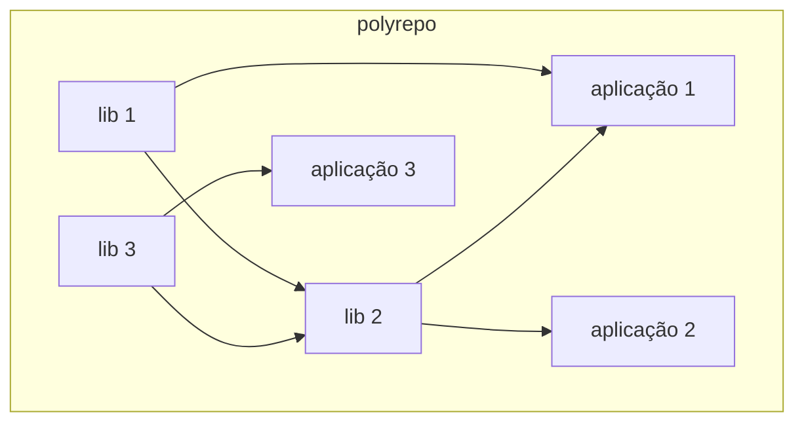
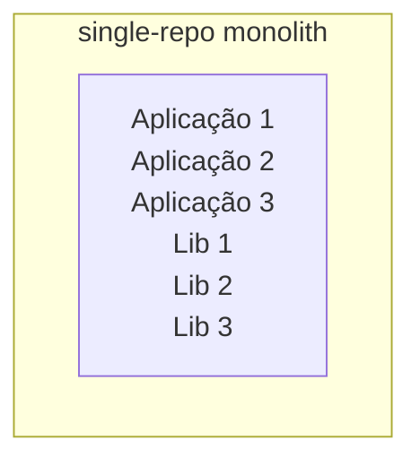
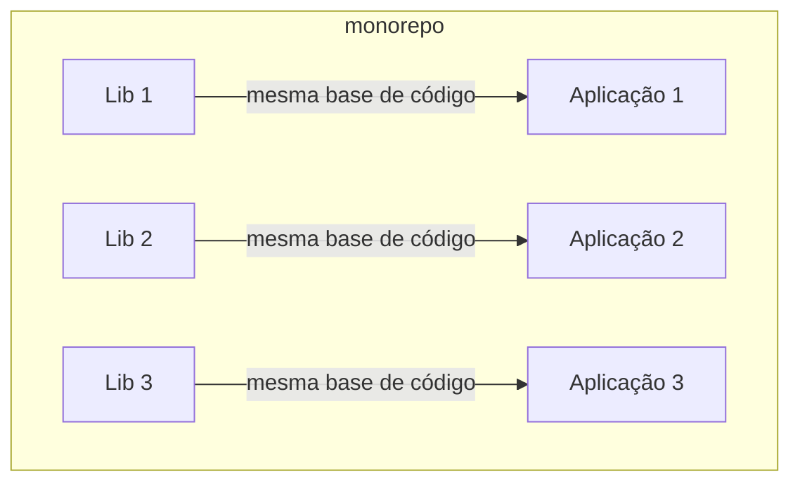
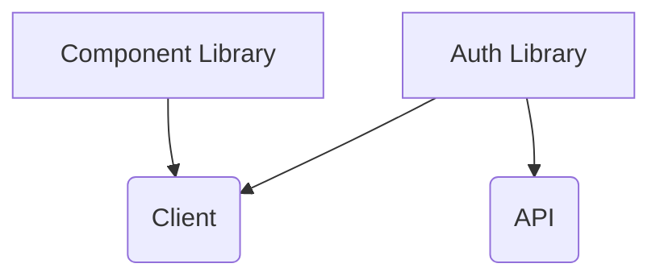
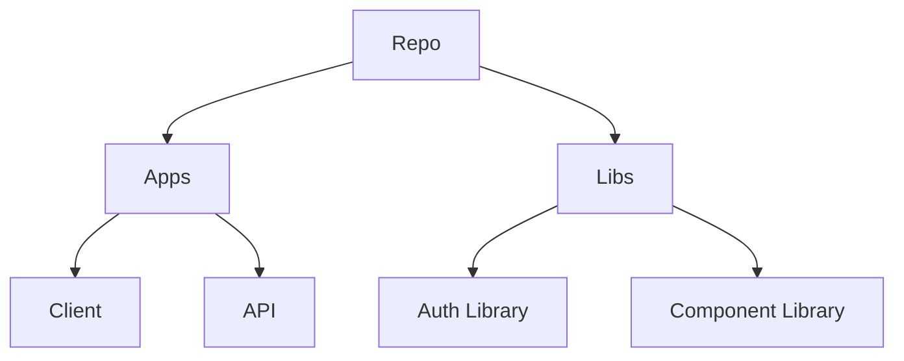

Managing repositories and all their integrations in large projects can become complex and laborious. There are practices that can help us simplify this process, and monorepos can be of great assistance.

When working professionally with large-scale applications, we use code versioning systems. And to store these versions, we save everything in code repositories. As our projects or companies grow, we end up creating multiple repositories to separate the responsibilities of our applications. This becomes necessary so that we can scale as a company/project/product, as we break down parts of the business into teams with unique responsibilities and advanced knowledge in specific areas, managing their projects from end to end. A company can have hundreds or even thousands of repositories, all with their applications that must be part of one or more other applications.


We can have teams that manage one or several repositories, just as we can have several teams managing a single repository. We call the practice of having multiple scattered repositories **polyrepo**, and when we have a single repository with several projects inside, we call it a **monorepo**. But there are differences between multiple repositories and monorepos that go beyond version control. Besides these two new names for our software engineering repertoire, we also have


monolithic or single-repo monoliths, and it is thanks to this other topic that the practical difference in using monorepos becomes clearer. It's not just about where you store your code.


To understand all this, let's first remember or understand what a repository is, then we'll look at the history of monorepos, and finally, we'll imagine some scenarios to clarify our vision on the subject.

## What are repositories?

In a brief summary, a repository is nothing more than a folder that contains all of our project's files, including our versioning. The great advantage of working with repositories, instead of simply with directories where you write code and then save them as .zip files, is the ability to version our history of changes. For this, we use versioning tools like Git, Mercurial, SVN, and the like. We usually host our repository on services like GitHub, GitLab, Bitbucket, or similar to be able to work in teams, sharing this repository with other people over the internet.


## The history of monorepos

From the information scattered across the internet, the use of monorepos is not a recent phenomenon. Apparently, it dates back to before the 2000s, widely used in large companies like Google, Microsoft, and Facebook. But the topic began to gain more visibility when tools designed for managing monorepos and building applications within this model started to appear. In September 2015, we saw the launch of [Bazel](https://bazel.build/), which is an open-source port of an internal Google tool called Blaze.


The fact is that companies the size of Google publicly disclosed that they manage billions of lines of code in a single repository, and this caught the community's attention. I saw the biggest hype around monorepos when [Lerna](https://lerna.js.org/) appeared in 2016. This was because Node.js was trending in talks around the world, and many people became interested in the possibility of using JavaScript on the frontend and backend (and everywhere else they could fit the language). However, having several applications written in JavaScript scattered across various repositories facilitates code duplication. One way to mitigate this problem was by creating libraries to share code between applications with the same technology. But over time, managing several internal libraries spread across teams becomes more and more complex, giving space for tools like Lerna to gain a lot of visibility.


Lerna, besides being a build tool, also helps with repository management, performing tasks like bootstrapping the repository, applications, and components, creating releases, assisting in the organization of libraries, and, most importantly, [dependency management](/posts/dependency-management-challenges-in-the-javascript-ecosystem/). Not only did the existence of tools like Lerna enable the growing adoption of monorepos, but Git itself was fundamental to this.

## What monorepos actually are

Monorepos are an architectural model where we have all parts of our application (or even the entire company's source code) in a single repository, in isolation. That is, even though the codes are all in one place, it doesn't mean they aren't logically separated and can even be published without interfering with each other. To understand what monorepos are, let's look at their relatives: the polyrepo and monolithic repos.

In an architectural model where we have several repositories (polyrepo), we can have applications and libraries coexisting, where the libraries are installed in the applications but are not in the same repository. We have one repository per library (logical context/domain) and one repository per application. The deployments of the applications do not depend on the deployments of the libraries to occur, and vice versa.



In the monolithic repo model, besides having everything in a single repository, it's all interconnected in a way that you can't deploy that authentication library without deploying the application. This is because, in addition to the repository being unique (single repo), we have a monolithic application in this repository.




When we have a monorepo, we maintain the existence of a single repository, but the source code has its logical separation. We can deploy modules that are inside the repositories within our monorepo separately, just like in the polyrepo architecture, but we also maintain local dependency management, just like in a single-repo monolith.



Notice that there is a very big difference between a monolithic repository and a monorepo. The fact that there is logical separation between the repositories completely changes how we will work within the monorepo. Being able to deploy or build a single application without running the others is very different from the monolith model, where we would always have to perform the task for everything inside the repository.

## Example of a workflow with a monorepo


Let's imagine a case where we have an application built with JavaScript from end to end. For this application, we have a design system implemented in a component library, an authentication library, an API serving some routes, and the frontend web application.




In a polyrepo architecture, we would have a repository, a CI/CD pipeline, tests, releases, tooling, etc., for each part of our project. In a monorepo architecture, we would have a single repository with all the projects inside, where we centralize configurations, code sharing, and everything else.


Typically, there is a separation of directories between `apps` and `packages` or `apps` and `libraries`. The general rule would be that most of our work is in `packages/libraries`, and in `apps`, we just bring everything together into applications.



In our application source code, we would have something like this:

```javascript
import { auth } from "@repo-organization/auth-library";
import { Component } from "@repo-organization/component-library";
```

## Conclusion

We didn't get into the advantages and disadvantages of monorepos; that's a topic for the next article, but here we understood where the idea of using this architectural model came from, as well as what poly and monolithic repos are.

## Next Steps

Now that you understand what monorepos are, continue your learning journey:

- [What are the advantages and disadvantages of using monorepos in your projects?](/posts/advantages-and-disadvantages-of-using-monorepos/) - Deep dive into the pros and cons
- [Dependency Management Challenges in the JavaScript Ecosystem](/posts/dependency-management-challenges-in-the-javascript-ecosystem/) - Understanding the complexities that monorepos help solve
- [Migrating from NPM or Yarn to PNPM](/posts/migrating-from-npm-or-yarn-to-pnpm/) - Learn about the best package manager for monorepos
- [Starting a Frontend Monorepo: A Practical Tutorial with Nx, Vite, Biome.js, and React](/posts/starting-a-frontend-monorepo-practical-tutorial-with-nx-vite-biome-js-and-react/) - Hands-on guide to build your own monorepo

## References

Originally published at [woliveiras.com.br](https://woliveiras.com.br/posts/o-que-e-monorepo/).
