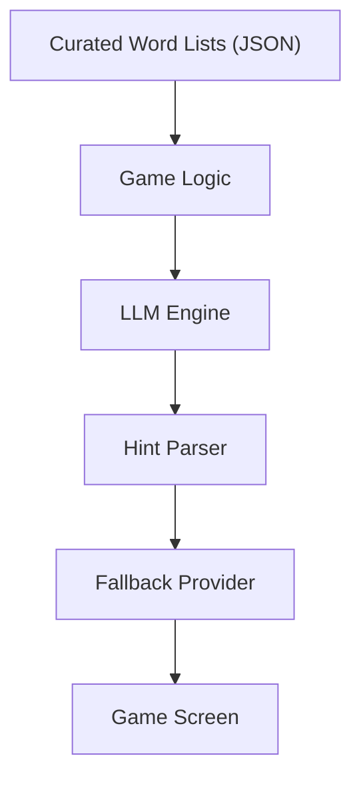

## Introduction

I've written about [running LLMs on Raspberry Pi](/posts/building-local-llm-server-with-raspberry-pi-ollama-tailscale/), about [running LLMs on single board computers](/posts/running-llms-on-single-board-computers/), and about using local models for all sorts of agent workflows. But there was one device I hadn't tried yet: the one that most people carry in their pocket every day.

I decided to build [Palabrita](https://github.com/woliveiras/palabrita/releases), a wordle-style word guessing game for Android, powered entirely by on-device LLM inference. No server, no API keys, no internet required. The idea was simple: the LLM generates words, categories, difficulty levels, and hints, all running locally on the user's phone using Google's [LiteRT-LM SDK](https://ai.google.dev/edge/litert/inference/lm).

What followed was 204 commits in 5 days and a complete rethinking of how on-device LLMs should be used in a mobile app. The system I ended up with looks nothing like what I originally planned, and I think the lessons I learned are useful for anyone considering on-device inference in their own Android projects.

This article is not a tutorial. It is a post-mortem of the engineering challenges I faced, the decisions I made, and the patterns that emerged from iterating fast against the constraints of running small language models on mobile hardware.

## The starting point

The original architecture was ambitious. The LLM would be responsible for generating everything the game needed:

- A **word** (common noun, lowercase, no accents)
- A **category** (like "animal", "food", "tool")
- A **difficulty** rating (1 to 5)
- **5 progressive hints** (from vaguest to most specific)

All of that as structured JSON. The prompt looked something like this:

```text
You are a word generator for a game. Return ONLY valid JSON, no extra text.
Schema: {"word": "string", "category": "string", "difficulty": number, "hints": [...]}
Rules:
- The word MUST be a common noun in $language, $minLength-$maxLength letters
- No proper nouns, no accents, lowercase only
- 5 progressive hints: from vaguest to most specific
- Hints MUST NOT contain the word
```

Two models were planned:

| Model | Size | RAM Required | Role |
|-------|------|-------------|------|
| Gemma 4 E2B | 2.6 GB | 8 GB+ | Premium tier |
| Gemma 3 1B | 1.0 GB | 4 GB+ | Compact tier |

The integration used LiteRT-LM, Google's SDK for running language models on Android with support for CPU and GPU backends. The engine initialization was straightforward:

```kotlin
val config = EngineConfig(
    modelPath = modelPath,
    backend = Backend.CPU(),
    cacheDir = context.cacheDir.absolutePath
)
val engine = Engine(config)
engine.initialize()
```

The plan felt solid. The specs were written. The tests were drafted. Then reality showed up.

## What actually happened

### the LLM is too slow for onboarding

The very first integration worked. The LLM generated puzzles. But it took 1 to 3 minutes to produce a batch, and during that time the user was staring at a progress bar stuck at 0% that suddenly jumped to 7%. The onboarding experience was unusable.

Within hours, I pivoted to static puzzles: pre-built JSON files with around 50 puzzles per language, shipped with the app. Background generation via WorkManager would replenish the pool later. Less than 12 hours after the first working implementation, synchronous puzzle generation was already dead.

### Gemma 3 1B was not good enough

Gemma 3 1B was supposed to be the compact model for devices with less RAM. But when I added Qwen3 0.6B as a third option, the comparison was brutal:

| Model | File Size | RAM Required |
|-------|-----------|-------------|
| Gemma 3 1B | 1.0 GB | 4 GB |
| Qwen3 0.6B | 614 MB | 2 GB |

Qwen3 was half the size, required half the RAM, and produced output of comparable quality for the specific task of generating words and hints. Gemma 3 was removed the same day it was added.

### The JSON parsing nightmare

Small language models do not produce clean JSON. They produce something that looks like JSON if you squint. Here is what I encountered:

- JSON wrapped in markdown code fences (` ```json ... ``` `)
- Extra text before or after the JSON object (`"Here is your word: {...}"`)
- Keys in the wrong language ("palabra" instead of "word", "dicas" instead of "hints")
- Malformed UTF-8 sequences that turned into U+FFFD replacement characters

The parser evolved from a single `json.decode()` call to a 5-layer fallback stack:

1. **Sanitize UTF-8** (strip replacement characters)
2. **Strip code fences** (remove markdown wrapping)
3. **Direct decode** (try the cleaned string as-is)
4. **Regex extraction** (find JSON objects in mixed text)
5. **Structural parse** (ignore key names entirely, infer fields by value types)

The structural parser was the most interesting. Since models kept producing keys in whatever language they felt like, I wrote a parser that looks at the value types instead:

```kotlin
for ((_, value) in jsonObject) {
    when (value) {
        is JsonArray -> hints = value.mapNotNull { it.contentOrNull }
        is JsonPrimitive -> {
            val intVal = value.intOrNull
            val strVal = value.contentOrNull
            when {
                intVal != null && difficulty == null -> difficulty = intVal
                strVal != null && word == null
                    && strVal.length in 2..9
                    && !strVal.contains(' ') -> word = strVal
                strVal != null && category == null -> category = strVal
            }
        }
    }
}
```

If there is an array, those are hints. If there is a short string with no spaces, that is probably the word. If there is an integer, that is the difficulty. It does not matter if the key says "word", "palabra", or "mot".

### Prompt engineering as iterative science

The prompts were rewritten 4 times. Each rewrite addressed a specific failure mode:

| Problem | What I changed |
|---------|---------------|
| LLM wrapped JSON in markdown | Added "No markdown, no code fences" to prompt |
| Keys appeared in the wrong language | Added "Keys MUST be in English" and built the structural parser |
| Words had the wrong length | Added "CRITICAL: count the letters carefully" |
| Words still had the wrong length | Added concrete example: "estufa has 6 letters and would be REJECTED" |
| Output defaulted to English for non-English games | Changed `"pt"` to `"Brazilian Portuguese"` in prompts |
| Retry attempts produced the same wrong answer | Added feedback: "Your response was rejected: wrong word length. Try a DIFFERENT word" |
| Hints appeared in English for Portuguese games | Repeated language constraint in both system and user prompts |

Two insights stood out. First, **concrete examples beat abstract rules** for small models. Telling the model "words must be 4-5 letters" was not enough. Showing it "estufa has 6 letters and would be REJECTED" actually changed behavior. Second, **small models default to English** unless you are aggressive about specifying the output language. Saying it once is not enough. You need to say it in the system prompt, in the user prompt, and ideally in both.

### The great simplification

After two days of fighting with structured JSON, I looked at what the game actually needed. Category? Never displayed in the UI. Difficulty rating? Replaced by word length. Word rarity? Too abstract for a 600 MB model. Five hints? Models consistently produced garbage after the third one.

The response schema went from this:

```json
{"word": "string", "category": "string", "difficulty": 1, "hints": ["h1","h2","h3","h4","h5"]}
```

To this:

```json
{"word": "string", "hints": ["h1","h2","h3"]}
```

Seven fields down to two. Validation failures dropped dramatically.

### The WorkManager disaster

Background puzzle generation used Android's WorkManager, which seemed like the right choice. It handles process death, retries, and constraints. But WorkManager was designed for deferrable background tasks, not for operations where the user is watching a progress screen.

The problem is that WorkManager persists terminal states. If a previous job completed successfully, the `SUCCEEDED` state survives app restarts. When the user triggers a new generation, the observer immediately receives the stale `SUCCEEDED` from the last run and shows a false success screen.

I spent an entire day writing 7 consecutive fixes:

1. Progress bar used hardcoded total (50) but batches produced 5-10 puzzles
2. Stale `SUCCEEDED` state from previous run showed false completion
3. Observer in `init` unconditionally processed terminal states
4. Engine was `Uninitialized` after app restart (it only lives in memory)
5. Double-scheduling when user tapped "generate" multiple times
6. Worker output data was read from `progress` instead of `outputData`
7. Added `hasSeenRunning` flag to ignore terminal states until at least one `RUNNING` emission

Each fix added another guard flag, another state filter, another initialization check. The code was turning into a state management nightmare.

### WorkManager removed entirely

I replaced the entire WorkManager integration with a simple coroutine-based `GeneratePuzzlesUseCase`:

```kotlin
class GeneratePuzzlesUseCaseImpl @Inject constructor(
    private val puzzleRepository: PuzzleRepository,
    private val puzzleGenerator: PuzzleGenerator,
    private val engineManager: LlmEngineManager,
    private val appPreferences: AppPreferences,
) : GeneratePuzzlesUseCase {

    override suspend fun execute(
        language: String,
        modelId: ModelId,
        onProgress: (successCount: Int, batchSize: Int) -> Unit,
    ): GenerationResult {
        val unplayedCount = puzzleRepository.countAllUnplayed(language)
        if (unplayedCount >= GameRules.REPLENISHMENT_THRESHOLD) {
            return GenerationResult(generatedCount = 0, batchSize = -1)
        }
        require(engineManager.isReady()) { "Engine not ready" }
        // generation, retry, persistence...
    }
}
```

All 7 WorkManager fixes became irrelevant. No persistent terminal states, no guard flags, no initialization hacks. The lesson was clear: **if the user is watching a progress screen, do not use WorkManager**. Use a coroutine with a ViewModel that lives as long as the screen does.

### The final pivot

The last and most important change: the LLM stopped generating words entirely. Words now come from curated lists shipped as JSON files. The LLM only generates hints.

Why? Because small on-device models are unreliable at generating words that satisfy multiple hard constraints (correct language, correct length, no accents, no proper nouns, not a duplicate). But they are quite good at writing three short hints about a word you give them. The creative task plays to the model's strength. The constrained task does not.

The final architecture:



And if the LLM fails completely, the `HintFallbackProvider` generates generic but functional hints:

```kotlin
override fun fallbackHints(word: String, language: String): List<String> =
    when (language) {
        "pt" -> listOf(
            "É algo que as pessoas conhecem",
            "Pode ser encontrado no dia a dia",
            "Tem ${word.length} letras"
        )
        else -> listOf(
            "It is something people know",
            "It can be found in everyday life",
            "It has ${word.length} letters"
        )
    }
```

The game always works. The LLM makes it better when it can.

## The constraints you do not expect

If you have worked with cloud LLM APIs, on-device inference will surprise you. Here are the constraints that I did not anticipate:

**Inference speed is 10-100x slower than cloud APIs.** You cannot block the UI. You cannot block the onboarding. Any LLM operation must be asynchronous with clear progress feedback.

**RAM is a shared resource.** A 2.6 GB model on a phone with 6 GB of RAM is risky. Android will kill your process if memory pressure gets too high. The device tier check (how much RAM is available) is not optional; it is fundamental to deciding which model to load.

**Long sessions degrade.** After several turns of conversation, the KV cache fills up and output quality drops. Session rotation (creating a fresh session every 3-5 turns) was necessary to maintain quality.

**Small models default to English.** Even when explicitly instructed to output in Portuguese or Spanish, models under 1 billion parameters will drift back to English. You need to repeat the language constraint in the system prompt, the user prompt, and sometimes in both.

**UTF-8 output can be malformed.** LiteRT-LM occasionally produced sequences that turned into U+FFFD replacement characters. Without sanitization before JSON parsing, valid responses were rejected.

**GPU availability is not guaranteed.** GPU inference gives a 2-5x speedup, but not all devices support it. The solution was to try GPU first, fall back to CPU:

```kotlin
private fun initializeWithFallback(modelPath: String): Engine {
    val backends = listOf(Backend.GPU(), Backend.CPU())
    for (backend in backends) {
        try {
            val config = EngineConfig(
                modelPath = modelPath,
                backend = backend,
                cacheDir = context.cacheDir.absolutePath
            )
            val engine = Engine(config)
            engine.initialize()
            return engine
        } catch (e: Exception) {
            // log and try next backend
        }
    }
    throw IllegalStateException("No available backend")
}
```

## What the 5-day arc tells us

The progression of the project tells a story about what on-device LLMs are actually good for today:

```text
Day 1: word + category + difficulty + rarity + 5 hints (7 fields)
Day 2: word + category + difficulty + 3 hints (5 fields)
Day 3: word + 3 hints (2 fields)
Day 5: curated word + 3 LLM-generated hints (0 fields of word generation)
```

Each iteration removed responsibility from the LLM. The pattern is clear: **the less you ask from a small on-device model, the more reliable the result**.

The same pattern appeared in model selection. I started with 6 models in the registry (Gemma 4 E4B, Gemma 4 E2B, Gemma 3 1B, Phi4 Mini, DeepSeek R1, Qwen3 0.6B). By the end, only 2 were exposed to users: Gemma 4 E2B for premium devices and Qwen3 0.6B for everything else. Every additional model multiplied the surface area for bugs: different prompt behavior, different quality levels, different RAM requirements.

## Lessons learned

**1. Use the LLM for creative tasks, not constrained generation.** Generating a word that satisfies 5 hard constraints (language, length, no accents, no proper nouns, unique) is what deterministic code does well. Writing three creative hints about a known word is what LLMs do well. Play to each tool's strength.

**2. Defensive parsing is not optional.** For on-device models, you need multiple layers of fallback in your parser. The model will surprise you with formats you did not anticipate: markdown-wrapped JSON, keys in the wrong language, extra text around the payload, malformed UTF-8.

**3. Retry with feedback, not blind retry.** Telling the LLM "your response was rejected because the word has 7 letters but we asked for 5" is dramatically more effective than sending the same prompt again. If you are using chat sessions, the model can learn from its mistakes within the same session.

**4. WorkManager is not for foreground operations.** If the user is watching a progress screen, use a coroutine scoped to the ViewModel. WorkManager's persistent terminal states will haunt you with stale completions, false successes, and an ever-growing collection of guard flags.

**5. Always have a fallback.** The best on-device LLM feature is the one that degrades gracefully. If the LLM fails, the game still works with generic hints. If the model does not download, static puzzles are already there. Never make the LLM a hard dependency for core functionality.

**6. Fewer models means fewer problems.** Every model you support multiplies testing, prompt tuning, and edge cases. Pick two (one for capable devices, one for constrained devices) and commit to them.

**7. Concrete examples beat abstract rules in prompts.** "The word must be 4-5 letters" is less effective than "estufa has 6 letters and would be REJECTED". Small models respond better to examples than to specifications.

**8. Specs still work, but they will change.** I followed Spec Driven Development throughout the project: specs first, tests from specs, code to pass tests. The specs were rewritten multiple times as reality revealed what on-device LLMs could and could not do. The process was still valuable because it made each pivot deliberate rather than chaotic.

## Conclusion

On-device LLMs on Android are ready for production, but not in the way most people imagine. They are not a replacement for cloud APIs. They are not going to run your RAG pipeline on a phone. What they can do is add a layer of intelligence to apps that need to work offline, respect user privacy, and function without API keys or subscriptions.

The key insight from building Palabrita is that **on-device LLMs are best used for enhancement, not dependency**. The game works without the LLM. The LLM makes it better. That inversion of the typical "AI-first" architecture is, I believe, the right mental model for mobile development with small language models in 2026.

If you are considering on-device inference for your own Android app, start with the smallest possible task you can give the model, build robust fallbacks, and be prepared to simplify your prompts more than you think is necessary.

## References

- [LiteRT-LM SDK (Google AI Edge)](https://ai.google.dev/edge/litert/inference/lm)
- [LiteRT Community Models on Hugging Face](https://huggingface.co/litert-community)
- [Gemma Models (Google DeepMind)](https://ai.google.dev/gemma)
- [Qwen3 Models (Alibaba)](https://huggingface.co/Qwen)
- [Android WorkManager Documentation](https://developer.android.com/develop/background-work/background-tasks/persistent/getting-started)
