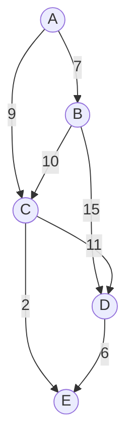

I work on a map platform used to find products and points of interest in the company's physical stores. This platform processes store layout data, combines information from different sources (such as product locations, availability, prices, and promotions), and provides routing capabilities to help users navigate through the store efficiently.

One of the components of this platform is a routing engine that uses a classic pathfinding algorithm to compute the best route between two points in the store and to connect multiple points of interest in a single trip, such as a shopping list. For this routing engine we use the classical Dijkstra's algorithm, and recently I started wondering how we could improve our solution to be smarter and more efficient. Nothing seemed better for this task than studying how the big players work and understanding the technologies that make them so effective. Google Maps, Waze, and CityMapper are applications I use daily and that make me curious about how they work under the hood.

While researching these applications, I found that they leverage a combination of classical algorithms and modern machine learning techniques to provide fast and accurate routing services. What became clear is that, although my problem lives inside a single building, it shares the same structural challenges as city and country-scale navigation: representing the environment as a graph, assigning meaningful weights to edges, and answering shortest-path queries under dynamic conditions. Over the last decades routing algorithms have evolved significantly to handle these challenges, adapting to the increasing complexity of road networks and traffic patterns.

The trajectory of this evolution goes from `Dijkstra's` and `A*` algorithms that laid the foundation for pathfinding, through `Contraction Hierarchies` that enable real-time routing on continental scales, to `Graph Neural Networks` that predict travel times by learning from vast amounts of traffic data.

Of course, we don't need all these sophisticated techniques for indoor routing in a store, but understanding them can inspire improvements to our system. For example, we might consider hierarchical approaches to simplify the graph representation of the store layout or explore machine learning methods to predict walking times based on historical data.

This article provides developers and researchers with the technical foundations and implementation details needed to understand and build modern routing systems. We explore algorithmic fundamentals with practical Python implementations, examine the mathematical principles that make these systems work, dissect the architectures powering Google Maps, Waze, and CityMapper (based on publicly available information), and analyze the academic research driving future innovations.

Let's start by looking at the classical routing algorithms that still dominate production systems today.

Disclaimer:

1) I'm not an expert in routing algorithms, but I have researched and studied various resources to compile this information. If you find any inaccuracies or have suggestions for improvement, please feel free to reach out!
2) I'm also not a math expert, so I followed these books to understand the mathematical concepts presented here:
      - [Math for Programming: Learn the Math, Write the Better Code](https://amzn.to/481wDFt)
      - [Math for Deep Learning: What You Need to Know to Understand Neural Networks](https://amzn.to/48o2m55)

## Understanding the Basics of Routing Problems

Routing problems are everywhere in our daily lives. For example, when you use Google Maps to find the fastest route to work, the app is solving a routing problem. Similarly, when data packets travel across the internet, they follow paths determined by routing algorithms. Even social networks use routing concepts to suggest connections or find the shortest path between two users.

At its core, the challenge lies in balancing efficiency and accuracy. The "most efficient path" might mean the `shortest distance`, the `least time`, or even the `lowest cost`, depending on the context. For road networks, this often involves considering factors like traffic, road closures, and speed limits. For computer networks, it might involve bandwidth and latency. In the case of products in a store, it involves shelves, internal walls, escalators, elevators, and so on. The versatility of routing problems makes them a fascinating area of study, as the same principles can be applied to vastly different domains.

And, to understand how routing algorithms work, we first need to grasp two fundamental concepts: **graphs** and **priority queues**.

### What is a Graph?

At the core of routing problems lies the concept of a graph. A graph is a mathematical structure used to model pairwise relationships between objects. It consists of:

- **Nodes (or vertices)**: Representing points in the network, such as intersections in a road map.
- **Edges**: Representing connections between nodes, such as roads between intersections. Each edge can have a weight, like travel time or distance.

For example, imagine a simple map with intersections as nodes and roads as edges. Here's a visual representation:



In this graph, we have the nodes `A`, `B`, `C`, `D`, and `E` representing intersections, and the edges between them represent roads with `weights` indicating travel times. Routing algorithms operate on such graphs to find the most efficient path from a **starting node** to a **destination node**. Each line here, for example, represents a possible route, and the numbers indicate how long it takes to travel that route.

So, we can interpret this graph as follows: the arrows indicate that the direction of the movement between the nodes is **one-way** (going from A to B takes 7 units of time, from A to C takes 9 units, but we don't have the reverse direction). The number close to each arrow indicates the cost in units (in this case, time) to traverse that edge. We can call this graph a `directed, weighted graph`.

Let's look at a Python implementation of these concepts:

```python
from collections import defaultdict

class Graph:
    def __init__(self):
        self.edges = defaultdict(list)

    def add_edge(self, u, v, weight):
        """Adds a directed edge from u to v with given weight."""
        self.edges[u].append((v, weight))

    def display_graph(self):
        """Displays the graph in a readable format."""
        for node, connections in self.edges.items():
            for connection in connections:
                print(f"{node} --> {connection[0]} [weight: {connection[1]}]")

# Creating the graph
graph = Graph()

# Adding edges from the graph represented in our mermaid diagram
graph.add_edge("A", "B", 7)
graph.add_edge("A", "C", 9)
graph.add_edge("B", "C", 10)
graph.add_edge("B", "D", 15)
graph.add_edge("C", "D", 11)
graph.add_edge("C", "E", 2)
graph.add_edge("D", "E", 6)

# Displaying the graph
graph.display_graph()

# Output:
# A --> B [weight: 7]
# A --> C [weight: 9]
# B --> C [weight: 10]
# B --> D [weight: 15]
# C --> D [weight: 11]
# C --> E [weight: 2]
# D --> E [weight: 6]
```

The next step here should be implementing the routing algorithms that will operate on this graph structure to find the shortest path between nodes. But, before that, we need to understand another data structure used by these algorithms: the `priority queue`.

### What is a Priority Queue?

A priority queue is a data structure that helps algorithms like Dijkstra's efficiently process nodes. It ensures that the next node to be processed is always the one with the smallest known distance from the starting point. Think of it as a to-do list where the most urgent task is always at the top.

For example, if you're navigating a city, the priority queue helps decide which intersection to evaluate next based on the shortest travel time discovered so far.

Let's see a simple implementation of a priority queue using Python's `heapq` module:

```python
import heapq

class PriorityQueue:
    def __init__(self):
        self.elements = []

    def is_empty(self):
        """Check if the priority queue is empty."""
        return len(self.elements) == 0

    def put(self, item, priority):
        """Add an item to the queue with a given priority."""
        heapq.heappush(self.elements, (priority, item))

    def get(self):
        """Remove and return the item with the highest priority (lowest value)."""
        return heapq.heappop(self.elements)[1]


# Example usage of PriorityQueue
if __name__ == "__main__":
    pq = PriorityQueue()

    # Adding elements with priorities
    pq.put("A", 5)  # Node A with priority 5
    pq.put("B", 2)  # Node B with priority 2
    pq.put("C", 8)  # Node C with priority 8

    # Removing elements in order of priority
    while not pq.is_empty():
        print(pq.get())  # Output: B, A, C (lowest number, highest priority)
```

In routing algorithms, the priority queue simply orders frontier nodes by their current best-known distance from the source: the node with minimal tentative distance is expanded next, and its neighbors are relaxed and reinserted if a shorter path is discovered. Like in this Python example:

```python
import heapq
from typing import Dict, List, Tuple

def expand_frontier(
    graph: Dict[int, List[Tuple[int, float]]],
    source: int,
) -> Dict[int, float]:
    # best-known distance from source
    dist: Dict[int, float] = {source: 0.0}

    # priority queue: (distance, node)
    frontier: List[Tuple[float, int]] = [(0.0, source)]
    heapq.heapify(frontier)

    while frontier:
        current_dist, u = heapq.heappop(frontier)  # node with minimal tentative distance

        # Skip outdated entries
        if current_dist > dist[u]:
            continue

        # Relax neighbors
        for v, w in graph.get(u, []):
            new_dist = current_dist + w
            if v not in dist or new_dist < dist[v]:
                dist[v] = new_dist          # update best-known distance
                heapq.heappush(frontier, (new_dist, v))  # reinsert neighbor

    return dist
```

### Transitioning to the Classic Algorithms

Now that we understand the basics of graphs and priority queues, we can explore how algorithms like Dijkstra's and A* solve routing problems. These algorithms use the concepts we've discussed to find the shortest path efficiently, even in complex networks.

Dijkstra's algorithm and its descendants remain the workhorses of modern navigation despite being decades old—a good illustration of how durable mathematical ideas can be. **The Dijkstra's algorithm maintains a priority queue of nodes, iteratively selecting the closest unvisited node and relaxing its edges, updating neighbor distances when shorter paths are discovered.** This simple process guarantees finding the shortest path in graphs with non-negative edge weights, which perfectly describes road networks where travel time or distance serves as edge cost.

The algorithm's time complexity depends critically on the priority queue implementation. A naive array-based approach runs in O(V²) time (where `V` is the number of vertices), acceptable for small or dense graphs but too slow for continental-scale road networks. **Using a binary heap improves this to O((E + V) log V) (where `E` is the number of edges), typically written O(E log V) for sparse, connected graphs**, which is the standard choice in production. While Fibonacci heaps offer theoretical O(E + V log V) performance, their constant factors and cache behavior tend to make binary heaps superior in real-world routing systems.

Here's a Python implementation of Dijkstra using a binary heap:

```python
from heapq import heappop, heappush
from collections import defaultdict
from typing import Dict, List, Tuple, Optional


class Graph:
    def __init__(self):
        self.edges = defaultdict(list)

    def add_edge(self, u: int, v: int, weight: float):
        """Add directed edge from u to v with given weight"""
        self.edges[u].append((v, weight))

    def dijkstra(
        self,
        source: int,
        target: Optional[int] = None,
    ) -> Tuple[Dict[int, float], Dict[int, Optional[int]]]:
        """
        Compute shortest paths from source using Dijkstra's algorithm.
        Returns (distances, predecessors) dictionaries.
        """
        distances: Dict[int, float] = {source: 0.0}
        predecessors: Dict[int, Optional[int]] = {source: None}

        # Priority queue: (distance, node)
        pq: List[Tuple[float, int]] = [(0.0, source)]
        visited = set()

        while pq:
            current_dist, current = heappop(pq)

            # Skip if already processed (can have duplicates in queue)
            if current in visited:
                continue

            visited.add(current)

            # Early termination if target found
            if target is not None and current == target:
                break

            # Relaxation: check all neighbors
            for neighbor, weight in self.edges[current]:
                if neighbor in visited:
                    continue

                # Calculate new distance through current node
                new_dist = current_dist + weight

                # Update if shorter path found
                if neighbor not in distances or new_dist < distances[neighbor]:
                    distances[neighbor] = new_dist
                    predecessors[neighbor] = current
                    heappush(pq, (new_dist, neighbor))

        return distances, predecessors

    @staticmethod
    def reconstruct_path(
        predecessors: Dict[int, Optional[int]],
        target: int,
    ) -> List[int]:
        """Reconstruct path from source to target using predecessors"""
        if target not in predecessors:
            return []

        path: List[int] = []
        current: Optional[int] = target
        while current is not None:
            path.append(current)
            current = predecessors[current]

        return list(reversed(path))


if __name__ == "__main__":
    # Build sample road network (nodes are intersections)
    g = Graph()
    g.add_edge(0, 1, 7)   # Intersection 0 to 1: 7 minutes
    g.add_edge(0, 2, 9)   # Intersection 0 to 2: 9 minutes
    g.add_edge(0, 5, 14)  # Intersection 0 to 5: 14 minutes
    g.add_edge(1, 2, 10)  # Intersection 1 to 2: 10 minutes
    g.add_edge(1, 3, 15)  # Intersection 1 to 3: 15 minutes
    g.add_edge(2, 3, 11)  # Intersection 2 to 3: 11 minutes

    distances, predecessors = g.dijkstra(0, target=3)
    path = Graph.reconstruct_path(predecessors, 3)
    print(f"Shortest distance from 0 to 3: {distances[3]}")
    print(f"Path: {path}")
```

To illustrate how A* builds on these ideas, we can use a spatial graph where each node has coordinates and the heuristic is the straight-line distance to the goal:

```python
import math
from heapq import heappop, heappush
from typing import Dict, List, Tuple


class SpatialGraph:
    def __init__(self):
        self.edges: Dict[int, List[Tuple[int, float]]] = {}
        self.positions: Dict[int, Tuple[float, float]] = {}

    def add_node(self, node: int, x: float, y: float) -> None:
        self.positions[node] = (x, y)
        self.edges.setdefault(node, [])

    def add_edge(self, u: int, v: int, weight: float) -> None:
        """Add directed edge"""
        self.edges.setdefault(u, []).append((v, weight))

    def euclidean_distance(self, node1: int, node2: int) -> float:
        """Compute straight-line distance between nodes"""
        x1, y1 = self.positions[node1]
        x2, y2 = self.positions[node2]
        return math.hypot(x2 - x1, y2 - y1)

    def a_star(self, start: int, goal: int) -> Tuple[List[int], float]:
        """
        A* pathfinding from start to goal.
        Returns (path, total_cost) tuple.
        """
        # g_score: actual cost from start to node
        g_score: Dict[int, float] = {start: 0.0}

        # f_score: g_score + heuristic (estimated total cost)
        h_start = self.euclidean_distance(start, goal)
        f_score: Dict[int, float] = {start: h_start}

        # Priority queue: (f_score, node)
        open_set: List[Tuple[float, int]] = [(h_start, start)]

        # Track path
        came_from: Dict[int, int] = {}

        # Track nodes in open set for efficient lookup
        open_set_hash = {start}

        while open_set:
            _, current = heappop(open_set)

            # Check if removed from open set while in queue
            if current not in open_set_hash:
                continue

            open_set_hash.remove(current)

            # Goal reached
            if current == goal:
                path = self._reconstruct_path(came_from, current)
                return path, g_score[current]

            # Explore neighbors
            for neighbor, weight in self.edges.get(current, []):
                tentative_g = g_score[current] + weight

                # Found better path to neighbor
                if neighbor not in g_score or tentative_g < g_score[neighbor]:
                    came_from[neighbor] = current
                    g_score[neighbor] = tentative_g
                    h = self.euclidean_distance(neighbor, goal)
                    f = tentative_g + h
                    f_score[neighbor] = f

                    if neighbor not in open_set_hash:
                        heappush(open_set, (f, neighbor))
                        open_set_hash.add(neighbor)

        # No path found
        return [], float("inf")

    @staticmethod
    def _reconstruct_path(came_from: Dict[int, int], current: int) -> List[int]:
        """Reconstruct path from start to current"""
        path = [current]
        while current in came_from:
            current = came_from[current]
            path.append(current)
        return list(reversed(path))


if __name__ == "__main__":
    g = SpatialGraph()

    # Add nodes with coordinates (representing intersections)
    positions = {
        0: (0, 0),
        1: (1, 0),
        2: (2, 0),
        3: (3, 0),
        4: (0, 1),
        5: (1, 1),
        6: (2, 1),
        7: (3, 1),
        8: (0, 2),
        9: (1, 2),
        10: (2, 2),
        11: (3, 2),
    }

    for node, (x, y) in positions.items():
        g.add_node(node, x, y)

    # Add edges (travel times roughly proportional to distance)
    edges = [
        (0, 1, 1.0), (1, 2, 1.2), (2, 3, 1.0),
        (4, 5, 1.0), (5, 6, 1.0), (6, 7, 1.1),
        (8, 9, 1.0), (9, 10, 1.0), (10, 11, 1.0),
        (0, 4, 1.0), (1, 5, 1.1), (2, 6, 1.0), (3, 7, 1.0),
        (4, 8, 1.2), (5, 9, 1.0), (6, 10, 1.0), (7, 11, 1.1),
        # Add diagonal shortcut
        (1, 6, 1.4),
    ]

    for u, v, w in edges:
        g.add_edge(u, v, w)
        g.add_edge(v, u, w)  # Make bidirectional

    # Find path from bottom-left to top-right
    path, cost = g.a_star(0, 11)
    print(f"Path found: {path}")
    print(f"Total cost: {cost:.2f}")
```

**Heuristic quality fundamentally determines `A*` performance.** With h(n) = 0, A* degrades to Dijkstra's algorithm. With a perfect heuristic matching the actual remaining cost, A* explores only nodes on the optimal path. Real-world navigation uses carefully tuned heuristics that balance accuracy with computation cost, often a scaled Euclidean distance accounting for typical road network properties like average highway speeds.

The choice between Dijkstra and A* in production depends on query patterns. Dijkstra efficiently computes shortest paths to all reachable nodes from a source, making it ideal for one-to-many queries like "find all locations within 30 minutes." A* optimizes single-source-single-target queries, the dominant pattern in navigation. Modern systems often use bidirectional A*, simultaneously searching from source and destination, meeting in the middle to achieve another order of magnitude speedup.

## Contraction Hierarchies achieve 1000x speedups through hierarchical preprocessing

Road networks exhibit natural hierarchy, most long-distance trips use similar major highways rather than exploring every possible local road. Contraction Hierarchies exploits this structure through aggressive preprocessing, achieving query times under **100 milliseconds** on continental-scale networks where Dijkstra requires **seconds** according to researchers.

The preprocessing phase contracts nodes in a carefully chosen order, creating shortcuts that bypass unimportant intersections. For each node in sequence, the algorithm finds all node pairs connected through it, checks whether the path through the contracted node represents the shortest route between those pairs, and if so, adds a shortcut edge directly connecting them. The contracted node receives a rank reflecting its importance, with local intersections ranked low and major highway junctions ranked high.

The node ordering heuristic proves critical to performance. A simple but effective priority function combines multiple factors: edge difference (shortcuts added minus edges removed, preferring nodes that reduce the total number of edges), deleted neighbors (the count of already contracted neighbors, encouraging uniform progression), and shortcut cover (how many queries would benefit from these shortcuts).

Experiments reported in the Contraction Hierarchies literature show that, for a road network comparable in size to the United Kingdom (around 3.5 million nodes and 7.6 million edges), preprocessing can take on the order of an hour on a single core, adding several million shortcuts and enabling route queries in tens of milliseconds for trips like London–Edinburgh.

The query phase runs bidirectional Dijkstra with a crucial restriction: the forward search only follows edges to higher-ranked nodes, and the backward search likewise only follows edges to higher-ranked nodes in the reverse graph. Both searches rapidly climb the hierarchy, meeting at an important high-ranked node, typically a major highway junction. This approach explores only hundreds of nodes instead of **hundreds of thousands** in large road networks, achieving order-of-magnitude speedups while maintaining optimality guarantees.


Public descriptions of large-scale routing systems, including patents and Google engineering blogs, suggest a hybrid design for integrating real-time traffic. The initial portion of a route is computed using live traffic data for maximum accuracy, which is critical for the first minutes when conditions change quickly. The remaining segments can leverage Contraction Hierarchies with traffic predicted from historical patterns, trading perfect real-time accuracy for the speed required to handle millions of concurrent queries. In distributed architectures, the road graph is partitioned into multiple shards with overlapping regions, enabling scalable, distributed processing of routing requests.

Here's a simplified Contraction Hierarchies implementation showing the core concepts:

```python
from typing import Dict, List, Set, Tuple
from heapq import heappop, heappush
import math

class ContractionHierarchies:
    def __init__(self):
        self.adj_forward = {}  # node -> [(neighbor, weight)]
        self.adj_backward = {}
        self.node_level = {}  # Contraction order (rank)
        self.shortcuts = []  # For analysis

    def add_edge(self, u: int, v: int, weight: float):
        """Add edge to graph"""
        if u not in self.adj_forward:
            self.adj_forward[u] = []
        if v not in self.adj_backward:
            self.adj_backward[v] = []

        self.adj_forward[u].append((v, weight))
        self.adj_backward[v].append((u, weight))

    def _local_search(self, start: int, end: int, max_dist: float,
                     excluded: int) -> float:
        """
        Find shortest path from start to end without using excluded node.
        Returns distance or infinity if no path within max_dist.
        """
        dist = {start: 0}
        pq = [(0, start)]

        while pq:
            d, node = heappop(pq)

            if d > max_dist:
                return math.inf

            if node == end:
                return d

            if node == excluded or d > dist.get(node, math.inf):
                continue

            for neighbor, weight in self.adj_forward.get(node, []):
                if neighbor == excluded:
                    continue

                new_dist = d + weight
                if new_dist < dist.get(neighbor, math.inf):
                    dist[neighbor] = new_dist
                    heappush(pq, (new_dist, neighbor))

        return math.inf

    def _compute_edge_difference(self, node: int, contracted: Set[int]) -> int:
        """
        Compute edge difference: shortcuts added - edges removed.
        Simplified version for demonstration.
        """
        # Edges removed: incoming + outgoing edges to non-contracted nodes
        in_edges = [u for u, _ in self.adj_backward.get(node, [])
                   if u not in contracted]
        out_edges = [v for v, _ in self.adj_forward.get(node, [])
                    if v not in contracted]
        edges_removed = len(in_edges) + len(out_edges)

        # Count shortcuts needed
        shortcuts_needed = 0
        for u, w1 in self.adj_backward.get(node, []):
            if u in contracted:
                continue
            for v, w2 in self.adj_forward.get(node, []):
                if v in contracted or u == v:
                    continue

                # Check if shortcut needed
                direct_dist = w1 + w2
                alternative = self._local_search(u, v, direct_dist, node)

                if alternative > direct_dist:
                    shortcuts_needed += 1

        return shortcuts_needed - edges_removed

    def contract_graph(self, nodes: List[int]):
        """
        Preprocess graph by contracting nodes in given order.
        In production, this order would be computed by sophisticated heuristics.
        """
        contracted = set()

        for level, node in enumerate(nodes):
            self.node_level[node] = level

            # Find shortcuts needed for this contraction
            in_edges = [(u, w) for u, w in self.adj_backward.get(node, [])
                       if u not in contracted]
            out_edges = [(v, w) for v, w in self.adj_forward.get(node, [])
                        if v not in contracted]

            # Add shortcuts where needed
            for u, w1 in in_edges:
                for v, w2 in out_edges:
                    if u == v:
                        continue

                    shortcut_dist = w1 + w2
                    alternative = self._local_search(u, v, shortcut_dist, node)

                    # Add shortcut if path through node is shortest
                    if alternative > shortcut_dist:
                        self.add_edge(u, v, shortcut_dist)
                        self.shortcuts.append((u, v, shortcut_dist, node))

            contracted.add(node)

        def query(self, source: int, target: int) -> Tuple[float, List[int]]:
        """
        Query shortest path using CH with bidirectional search.
        """
        # Forward search: only edges to higher-level nodes
        forward_dist = {source: 0.0}
        forward_prev: Dict[int, int] = {}
        forward_pq = [(0.0, source)]
        forward_settled = set()

        # Backward search: only edges to higher-level nodes (in reverse graph)
        backward_dist = {target: 0.0}
        backward_prev: Dict[int, int] = {}
        backward_pq = [(0.0, target)]
        backward_settled = set()

        best_dist = math.inf
        meeting_node = None

        # Alternate between forward and backward
        while forward_pq or backward_pq:
            # Forward step
            if forward_pq:
                d, node = heappop(forward_pq)
                if node in forward_settled:
                    continue
                forward_settled.add(node)

                # Check for meeting point
                if node in backward_dist:
                    total = d + backward_dist[node]
                    if total < best_dist:
                        best_dist = total
                        meeting_node = node

                # Expand only to higher-level nodes
                for neighbor, weight in self.adj_forward.get(node, []):
                    if self.node_level.get(neighbor, -1) > self.node_level.get(node, -1):
                        new_dist = d + weight
                        if new_dist < forward_dist.get(neighbor, math.inf):
                            forward_dist[neighbor] = new_dist
                            forward_prev[neighbor] = node
                            heappush(forward_pq, (new_dist, neighbor))

            # Backward step
            if backward_pq:
                d, node = heappop(backward_pq)
                if node in backward_settled:
                    continue
                backward_settled.add(node)

                # Check for meeting point
                if node in forward_dist:
                    total = forward_dist[node] + d
                    if total < best_dist:
                        best_dist = total
                        meeting_node = node

                # Expand only to higher-level nodes in reverse graph
                for neighbor, weight in self.adj_backward.get(node, []):
                    if self.node_level.get(neighbor, -1) > self.node_level.get(node, -1):
                        new_dist = d + weight
                        if new_dist < backward_dist.get(neighbor, math.inf):
                            backward_dist[neighbor] = new_dist
                            backward_prev[neighbor] = node
                            heappush(backward_pq, (new_dist, neighbor))

        if meeting_node is None or best_dist == math.inf:
            return math.inf, []

        # Reconstruct path: source -> meeting_node
        path_forward = []
        v = meeting_node
        while v != source:
            path_forward.append(v)
            v = forward_prev[v]
        path_forward.append(source)
        path_forward.reverse()

        # Reconstruct path: meeting_node -> target (using backward_prev)
        path_backward = []
        v = meeting_node
        while v != target:
            v = backward_prev[v]
            path_backward.append(v)

        full_path = path_forward + path_backward  # meeting_node não é duplicado
        return best_dist, full_path


# Example usage
if __name__ == "__main__":
    ch = ContractionHierarchies()

    # Build small road network
    edges = [
        (0, 1, 1), (1, 2, 1), (2, 3, 1),
        (0, 4, 1), (4, 5, 1), (5, 3, 1),
        (1, 5, 2), (4, 2, 2)
    ]

    for u, v, w in edges:
        ch.add_edge(u, v, w)

    # Contract in order (simulating hierarchy)
    # In practice, use sophisticated heuristics
    contraction_order = [0, 1, 4, 2, 5, 3]
    ch.contract_graph(contraction_order)

    print(f"Added {len(ch.shortcuts)} shortcuts")

    # Query
    dist, path = ch.query(0, 3)
    print(f"Distance from 0 to 3: {dist}")
```

The trade-off is compelling for navigation: preprocessing takes minutes to hours but runs once (or periodically as the road network changes), while queries must complete in milliseconds and be served millions of times per second. Modern implementations typically incur only moderate memory overhead, and in some settings compressed representations of the contracted graph can even use space comparable to or smaller than the original graph with all low-level edges. This effect occurs because the hierarchy allows efficient pruning of edges that would never be used in shortest-path queries.

## Graph Neural Networks learn spatiotemporal traffic patterns from billions of trips

Classical routing algorithms compute optimal paths given edge weights, but accurately predicting those weights—travel times under real-world traffic conditions—requires modeling complex spatiotemporal dynamics. Graph Neural Networks excel at this task by treating road networks as their natural graph structure, using message passing to capture how congestion on one road segment affects adjacent and downstream segments.

Google Maps' production GNN system, developed in partnership with DeepMind and detailed in their seminal 2021 CIKM paper *"ETA Prediction with Graph Neural Networks in Google Maps"*, represents the first large-scale deployment of GNNs for navigation. The architecture divides road networks into supersegments—sequences of 20-50 connected road segments with significant shared traffic. Each supersegment becomes a subgraph where nodes represent road segments and edges connect consecutive or intersecting segments.

The Graph Network framework follows an `encode-process-decode` paradigm. The encoder transforms raw features into learned representations: current speeds, historical patterns at multiple time horizons (0, 10, 20, 30, 60 minutes), road attributes like type and lane count, temporal context like time of day. The processing phase runs multiple rounds of message passing where neural networks compute messages between connected nodes and update node states based on received messages. This process allows the model to reason about complex interactions, a traffic jam on a side street spilling onto a major arterial, or the effect of an upcoming traffic light on approach speeds.

The key technical innovation enabling production deployment was `MetaGradients`, adapted from reinforcement learning to dynamically tune the learning rate during training. Route queries vary wildly in scale, from city blocks to continental trips, causing training instability as different batches have vastly different characteristics. MetaGradients lets the system learn its own optimal learning rate schedule, automatically decreasing it to achieve stable convergence. The multi-component loss function combines L1 and L2 losses on global traversal times, Huber and negative log-likelihood losses for each node, and regularization on model weights, enabling the model to generalize beyond training data.

The results proved 40% reduction in bad ETA outcomes during Sydney rush hours, and up to 50% accuracy improvements in Berlin, Jakarta, São Paulo, Tokyo, and Washington DC. **The system maintains over 97% accuracy across all trips worldwide, a remarkable achievement given the complexity and variability of global traffic patterns.** The GNN naturally handles arbitrary complex connections—traffic ahead, behind, adjacent, and intersecting roads all influence predictions through learned message patterns.

The architecture contrasts sharply with earlier attempts. Google initially tried separate fully-connected neural networks for each supersegment, but dynamically-sized routes would require millions of separately trained models, an impossible infrastructure challenge. Recurrent neural networks could handle variable-length sequences but struggled to incorporate the road network's graph structure. **GNNs provided the breakthrough by processing arbitrary graph structures in a single unified model**, handling everything from simple two-segment routes to complex paths with hundreds of nodes.

```python
import torch
import torch.nn as nn
import torch.nn.functional as F

# Small "urban" road network: 5 segments (nodes)
#
#   (2)──(3)
#    │    │
#   (0)──(1)──(4)
#
# Intersections are implicit; each node is a road segment.
num_nodes = 5
edges = torch.tensor([
    [0, 1, 0, 2, 1, 3, 1, 4, 2, 3, 3, 2],  # src
    [1, 0, 2, 0, 3, 1, 4, 1, 3, 2, 2, 3],  # dst (undirected as bidirectional edges)
])

# Features per segment: [current_speed_kmh, speed_limit_kmh]
x = torch.tensor([
    [25.0, 50.0],  # segment 0 (residential, slightly congested)
    [15.0, 50.0],  # segment 1 (busy connector)
    [30.0, 40.0],  # segment 2 (side street)
    [35.0, 40.0],  # segment 3 (side street, flowing better)
    [40.0, 60.0],  # segment 4 (arterial, free flowing)
])

# Target: observed travel time per segment in seconds (dummy values)
y = torch.tensor([70.0, 120.0, 60.0, 55.0, 40.0])


class SimpleGCNLayer(nn.Module):
    def __init__(self, in_dim, out_dim):
        super().__init__()
        self.lin = nn.Linear(in_dim, out_dim)

    def forward(self, x, edges):
        src, dst = edges
        # Aggregate neighbor features by summation
        agg = torch.zeros_like(x)
        agg.index_add_(0, dst, x[src])
        # Add self-loop (retain local information)
        agg = agg + x
        return self.lin(agg)


class ETA_GNN(nn.Module):
    def __init__(self, in_dim, hidden_dim):
        super().__init__()
        self.enc = nn.Linear(in_dim, hidden_dim)      # encoder
        self.gnn1 = SimpleGCNLayer(hidden_dim, hidden_dim)
        self.gnn2 = SimpleGCNLayer(hidden_dim, hidden_dim)
        self.out = nn.Linear(hidden_dim, 1)           # decoder

    def forward(self, x, edges):
        h = F.relu(self.enc(x))
        h = F.relu(self.gnn1(h, edges))
        h = F.relu(self.gnn2(h, edges))
        eta = self.out(h).squeeze(-1)  # [num_nodes]
        return eta


model = ETA_GNN(in_dim=2, hidden_dim=16)
optimizer = torch.optim.Adam(model.parameters(), lr=1e-2)
loss_fn = nn.L1Loss()  # MAE for simplicity

for epoch in range(300):
    optimizer.zero_grad()
    pred = model(x, edges)
    loss = loss_fn(pred, y)
    loss.backward()
    optimizer.step()

pred_eta = model(x, edges).detach()
print("True ETA: ", y.tolist())
print("Pred ETA: ", [round(v, 1) for v in pred_eta.tolist()])
```

## LSTM (Long Short-Term Memory) models capture temporal dynamics for real-time ETA prediction

While GNNs excel at spatial reasoning over road networks, Long Short-Term Memory networks specialize in temporal sequence modeling, capturing how traffic evolves over time and along a route. Waze's production `Smartsum` model demonstrates this approach at scale, serving 150 million monthly active users across the United States, Canada, France, Israel, Brazil, and Malaysia.

**Smartsum processes routes as sequences of road segments, using LSTM cells to maintain memory of traffic conditions encountered earlier in the journey.** Each segment has a feature vector combining real-time cross times (current conditions, 15 minutes ago, 2 hours ago), historical patterns by day type and time, spatial features (highway vs local road, lane count, HOV presence), and temporal context (time of day, day of week, special events). The LSTM layer creates segment embeddings that carry information forward, if heavy traffic is building, this information propagates through the memory cell to affect predictions for downstream segments.

The architecture includes a parallel contextual processing branch that handles trip-level features through a two-layer neural network, producing a holistic trip state. This trip state concatenates with each segment embedding before final dense layers predict per-segment travel times. The "smart sum" name reflects that the model intelligently aggregates segment predictions considering interdependencies, rather than naively summing independent predictions.

Training uses a custom "Bad ETA Session" loss function based on user experience research. The asymmetric loss penalizes underestimates more heavily than overestimates, being late frustrates users more than arriving early. Penalties scale with route length, and the entire metric ties directly to product analytics measuring user satisfaction. **This user-centric loss design achieved 40%+ reduction in bad ETA sessions during rush hours and 50% reduction in mid-drive ETA update notifications**, significantly enhancing user experience.

The infrastructure leverages Google Cloud Vertex AI Pipelines with TensorFlow Extended (TFX) for the complete ML workflow. Waze's custom "waze-data-tfx" package abstracts TFX complexity, allowing data scientists to fork, configure, and deploy complete training pipelines rapidly. Models train continuously on fresh data from billions of GPS traces, converting coordinate streams into ground-truth segment traversal times for supervision.

Comparing approaches reveals complementary strengths. **GNNs excel at spatial reasoning, understanding how traffic on one road affects connected roads through the network structure. LSTMs excel at temporal reasoning, modeling how traffic evolves over time and along a sequential route.** Hybrid architectures combining both, as explored in academic research, achieve the best performance by capturing both spatial dependencies (via graph convolution) and temporal dynamics (via recurrence).

```python
import torch
import torch.nn as nn
import torch.nn.functional as F

# Two sample routes (sequences of segments)
#
# Route 0:
#   seg0 ── seg1 ── seg2 ── seg3
#   [30/50/local]  [20/50/local]  [40/80/highway]  [35/60/local]
#
# Route 1:
#   seg0 ── seg1 ── seg2 ── seg3
#   [50/80/highway]  [45/80/highway]  [25/50/local]  [20/50/local]
#
# Each segment feature vector is:
#   [current_speed_kmh, speed_limit_kmh, is_highway]
batch_size = 2
seq_len = 4
feat_dim = 3

x = torch.tensor([
    # route 0
    [[30.0, 50.0, 0.0],  # segment 0
     [20.0, 50.0, 0.0],  # segment 1 (more traffic)
     [40.0, 80.0, 1.0],  # segment 2 (fast highway)
     [35.0, 60.0, 0.0]], # segment 3
    # route 1
    [[50.0, 80.0, 1.0],
     [45.0, 80.0, 1.0],
     [25.0, 50.0, 0.0],
     [20.0, 50.0, 0.0]],
])  # shape: [batch, seq, feat_dim]

# Ground truth (dummy) time per segment, in seconds
y = torch.tensor([
    [60.0, 90.0, 40.0, 50.0],  # route 0
    [30.0, 35.0, 70.0, 80.0],  # route 1
])  # [batch, seq]


class LSTMETA(nn.Module):
    def __init__(self, in_dim, hidden_dim):
        super().__init__()
        self.enc = nn.Linear(in_dim, hidden_dim)   # feature encoder
        self.lstm = nn.LSTM(hidden_dim, hidden_dim, batch_first=True)
        self.out = nn.Linear(hidden_dim, 1)        # per-segment travel time

    def forward(self, x):
        # x: [batch, seq, feat_dim]
        h0 = torch.zeros(1, x.size(0), self.lstm.hidden_size)
        c0 = torch.zeros(1, x.size(0), self.lstm.hidden_size)

        h = F.relu(self.enc(x))                    # [batch, seq, hidden]
        h_seq, _ = self.lstm(h, (h0, c0))          # [batch, seq, hidden]
        seg_eta = self.out(h_seq).squeeze(-1)      # [batch, seq]
        route_eta = seg_eta.sum(dim=1)             # [batch] simple smart-sum
        return seg_eta, route_eta


model = LSTMETA(in_dim=feat_dim, hidden_dim=16)
opt = torch.optim.Adam(model.parameters(), lr=1e-2)
loss_fn = nn.L1Loss()  # MAE for simplicity

for epoch in range(300):
    opt.zero_grad()
    seg_pred, route_pred = model(x)
    loss = loss_fn(seg_pred, y)  # train on per-segment times only
    loss.backward()
    opt.step()

with torch.no_grad():
    seg_pred, route_pred = model(x)
    print("True segment ETA:\n", y)
    print("Pred segment ETA:\n", seg_pred.round(decimals=1))
    print("Pred route ETA (sum):\n", route_pred.round(decimals=1))
```

## The mathematics of routing balances optimality guarantees with practical performance

The shortest path problem formalizes navigation: given `graph G = (V, E)` with edge weight function `w`, find path `P` from source `s` to target `t` minimizing the sum of edge weights along `P`.

**This formulation reduces complex navigation to graph theory, where intersections become vertices, road segments become edges, and travel time or distance provides weights.**

Big-O complexity analysis explains why algorithm choice matters. Dijkstra's `O((E + V) log V)` seems fast, but on continental road networks with tens of millions of nodes, this still requires long seconds of computation. Contraction Hierarchies' `O(log V)` query time, exploring only hundreds of nodes, explains how Google Maps handles millions of simultaneous requests. **The key insight: preprocessing shifts computational burden from query time to setup time, and with billions of queries per day, even millisecond savings multiply into massive infrastructure cost reductions.**

Heuristic admissibility provides `A*'s` optimality guarantee through a simple principle: **never overestimate remaining cost to goal**. Formally, `h(n) ≤ h*(n)` where `h*(n)` denotes true optimal cost. Why does this ensure optimality? When `A*` selects a node for expansion, its `f-value` represents the minimum possible cost of any path through that node. If the heuristic never overestimates, nodes on the optimal path always have f-values at most the optimal cost, so `A*` expands them before exploring worse alternatives. **Consistency, the stronger property that `h(n) ≤ cost(n, n') + h(n')` for all edges, guarantees `A*` never reopens nodes, crucial for efficiency.**

The triangle inequality provides both intuition and practical heuristics. For any three points `A`, `B`, `C`, the direct distance satisfies `dist(A,C) ≤ dist(A,B) + dist(B,C)`. This applies naturally to road networks treated as metric spaces. The ALT (A*, Landmarks, Triangle inequality) technique precomputes distances to strategically placed landmark nodes, then uses triangle inequality to derive lower bounds: the heuristic `h(n, goal) = max over landmarks L of |dist(L, goal) - dist(L, n)|` provides an admissible heuristic often much tighter than Euclidean distance.

Graph Neural Network mathematics centers on message passing and aggregation. At each layer, nodes update their representations by aggregating information from neighbors:

```math
h_v^{(l+1)} = \mathrm{UPDATE}\!\Big(h_v^{(l)}, \mathrm{AGGREGATE}\big(\{h_u^{(l)} : u \in \mathrm{neighbors}(v)\}\big)\Big)
```

Graph Convolutional Networks (GCNs) implement this using normalized adjacency matrices:

```math
H^{(l+1)} = \sigma\!\left(D^{-\frac{1}{2}} A D^{-\frac{1}{2}} H^{(l)} W^{(l)}\right)
```

where \(A\) is the adjacency matrix, \(D\) is the degree matrix, \(W\) contains learnable weights, and \(\sigma\) is an activation function like ReLU. **This formulation spreads each node's information to neighbors, weighted by connection strength, and learns how to combine information through gradient descent on \(W\).**

The DeepMind paper uses a more sophisticated Graph Network framework with separate update functions for edges, nodes, and global state. Edge features update considering incident node states, node features update based on aggregated incoming edge messages, and global features aggregate across all nodes and edges. Stacking multiple layers allows information to propagate further through the `graph—k` layers enable `k-hop` neighborhood influence.

LSTM cell equations reveal how the architecture maintains long-term memory while allowing updates:

- Forget gate: `f_t = σ(W_f [h_{t-1}, x_t] + b_f)`
- Input gate: `i_t = σ(W_i [h_{t-1}, x_t] + b_i)`
- Candidate cell state: `Ĉ_t = tanh(W_C [h_{t-1}, x_t] + b_C)`
- Cell update: `C_t = f_t ⊙ C_{t-1} + i_t ⊙ Ĉ_t`
- Output gate: `o_t = σ(W_o [h_{t-1}, x_t] + b_o)`
- Hidden state: `h_t = o_t ⊙ tanh(C_t)`

Operationally, the forget gate `f_t` determines which parts of the previous memory `C_{t-1}` remain relevant, while the input gate `i_t` and candidate state `Ĉ_t` control what new information is written into the cell. The updated cell state `C_t` therefore acts as long-term memory, carrying information across many time steps. The output gate `o_t` selects how much of this memory to expose as the hidden state `h_t`, which is the representation consumed by downstream layers or the next step in the sequence. In traffic and ETA prediction settings, this mechanism allows the model to retain slowly evolving phenomena like rush-hour buildup while still reacting quickly to sudden incidents reflected in recent inputs.

**The cell state C_t acts as a highway carrying information across time steps, with forget and input gates controlling what information to discard or add.** For traffic prediction, this allows the model to remember that rush hour started 30 minutes ago and will likely continue, while adapting to sudden incidents through the input gate.

Loss function choice significantly impacts production performance. Mean Squared Error (MSE) penalizes large errors heavily due to squaring but proves sensitive to outliers. Mean Absolute Error (MAE) treats all errors equally, providing robustness but potentially underweighting catastrophic predictions. Huber loss combines both, acting like MSE for small errors and MAE for large ones, providing the smooth gradients needed for optimization while maintaining outlier robustness. **Waze's asymmetric Huber loss weights underestimation errors more heavily, directly encoding the product insight that users strongly prefer arriving early over arriving late.**

## Production systems balance multiple competing constraints

The apps we use to navigate reveal how theoretical algorithms transform into production systems handling planetary scale. Google Maps processes over 1 billion kilometers of daily driving, requiring distributed architectures that shard the road network graph across thousands of machines. **The hybrid routing approach uses Dijkstra with live traffic for immediate route portions where accuracy is critical, switching to Contraction Hierarchies with predicted traffic for distant segments where speed matters more than perfect real-time accuracy.**

The data infrastructure proves equally critical as algorithms. Google Maps aggregates anonymous GPS signals from over a billion Android devices, combines them with traditional traffic sensors and Waze's crowd-sourced incident reports, and processes this through machine learning to generate both real-time conditions and future predictions. **The system updates approximately every minute, processing terabytes of traffic information through a pipeline that blends live observations with historical patterns learned from years of data.**

Waze demonstrates crowd-sourcing at scale through three tiers: passive collection of GPS speeds from 150 million active users, active incident reports gamified to encourage participation, and a network of 500,000 volunteer map editors maintaining road geometry and attributes. The validation system weighs reports by user reputation scores, requires cross-validation from multiple users, applies time-based decay to unconfirmed reports, and uses anomaly detection to filter malicious input. **This multi-layered validation achieves high accuracy. Research shows Waze accident reports appear 30 minutes earlier than emergency call systems while maintaining reliability.**

Infrastructure-as-code enables rapid iteration. Waze's recent migration to Config Connector treats Google Cloud resources as Kubernetes objects, providing version control for infrastructure, automated validation, and consistent configurations across environments. The TFX-based ML pipeline with custom waze-data-tfx abstraction lets data scientists deploy complete training-to-serving workflows in hours rather than weeks. **This full-cycle data science philosophy, where data scientists own the entire pipeline from research to production, accelerates innovation while maintaining reliability.**

Reliability engineering addresses multiple failure modes. The system must handle missing or noisy GPS data through Kalman filtering and map matching, adapt to data sparsity in rural areas through transfer learning from urban models, manage concept drift as traffic patterns change through continuous retraining, and solve cold start problems for new roads without historical data through similarity-based initialization. **Google Cloud's Memorystore Redis cluster handling over 1 million operations per second with 99.99% SLA demonstrates the infrastructure requirements for production navigation.**

The cost-accuracy trade-offs pervade system design. More frequent model updates improve accuracy but increase computational cost. Longer training windows capture seasonal patterns but slow iteration cycles. More complex models with billions of parameters achieve better predictions but require more expensive inference infrastructure. **Production systems continuously optimize this trade-off space, using techniques like model compression (quantization, pruning), caching popular routes, edge computing to distribute inference, and A/B testing to validate that increased complexity actually improves user experience.**

## Current research pushes boundaries on multiple fronts

Academic research explores directions not yet ready for production deployment but showing promising results. **Transformer-based architectures compete with GNN+RNN hybrids by using pure attention mechanisms for both spatial and temporal modeling, potentially offering better parallelization and handling of long-range dependencies.** The self-attention mechanism learns which road segments matter most for predictions, while temporal attention captures how different historical time periods influence current conditions.

Neural combinatorial optimization applies deep learning directly to route optimization problems like the Vehicle Routing Problem (VRP). Attention mechanisms learn to construct routes autoregressively, policy gradient methods optimize solution quality through reinforcement learning, and pointer networks handle variable-sized problem instances. **The 2019 NeurIPS paper "Attention, Learn to Solve Routing Problems!" demonstrated that neural methods can approach or match classical heuristics on some problem classes, though generalization remains challenging.**

Federated learning addresses privacy concerns in navigation. Rather than centralizing all GPS traces at server farms, federated approaches train models collaboratively across vehicles and devices while keeping raw data local. Each device trains on its local data, shares only model updates (gradients) with the server, which aggregates updates to improve the global model. **This enables privacy-preserving learning from distributed data sources, particularly relevant for autonomous vehicle fleets that generate massive telemetry but face regulatory restrictions on data sharing.**

Explainable AI techniques make neural navigation systems interpretable. Attention visualization shows which road segments most influence ETA predictions. Feature importance analysis via SHAP values quantifies how much each input feature (current speed, historical patterns, weather) contributes to predictions. **Google Cloud's Explainable AI integration with Vertex AI lets developers probe model decisions, essential for debugging failures and building user trust in AI-driven routing.**

Multi-agent routing coordination optimizes traffic systemically rather than individually. Rather than each vehicle routing independently, coordinated approaches consider network-wide effects: if everyone takes the "fastest" route, induced congestion makes it slow. **Research from institutions like Tsinghua on V2X (vehicle-to-everything) communication enables vehicles to coordinate routing with traffic signal optimization, potentially reducing travel times beyond what individual optimization achieves.**

The neural ETA prediction landscape continues evolving. DoorDash's probabilistic ETA models predict full distributions rather than point estimates, providing uncertainty quantification and confidence intervals. Uber's `DeepETA` architecture combines `DeepNet` dense layers, `CrossNet` for feature interactions, and `Transformers` for temporal sequences with `mixture-of-experts` routing different scenarios to specialized networks. **Academic benchmarks like LargeST provide standardized evaluation on large-scale traffic prediction, accelerating research progress.**

## Looking forward: the convergence of classical and learned approaches

The future of routing algorithms lies not in replacing classical methods with machine learning, but in sophisticated integration leveraging the strengths of both. **Classical algorithms provide optimality guarantees and interpretability crucial for safety-critical systems, while neural approaches handle the messy reality of real-world traffic patterns, sensor noise, and complex spatiotemporal dependencies.**

Production systems already demonstrate this hybrid philosophy. Public information about Google Maps suggests a combination of Contraction Hierarchies to exploit the graph structure and answer queries quickly, A* with heuristics for targeted search, and Graph Neural Networks for traffic prediction. Waze reports combining A* routing on dynamically weighted graphs with LSTM-based ETA prediction.

The mathematical foundations remain essential. Understanding complexity analysis guides infrastructure planning, knowing that O((E + V) log V) means adding a million users might require 10x more servers while O(log V) scales gracefully. Recognizing admissible heuristics ensures new ML-based heuristics maintain optimality. **Graph theory, algorithm design, and machine learning form a unified toolkit where developers choose the right tool for each subproblem rather than applying universal solutions.**

The academic pipeline feeding production systems shows healthy dynamics. University research explores transformer architectures and federated learning, conference papers at SIGSPATIAL and NeurIPS demonstrate new techniques on benchmarks, tech companies deploy promising methods at small scale with careful monitoring, and successful innovations gradually scale to billions of users. **This cycle from theory to practice typically spans 3-5 years, visible in the trajectory from 2018 DCRNN and Graph WaveNet papers to 2021 Google Maps GNN deployment to current exploration of attention-based methods.**

For developers building navigation systems, the path forward requires multilingual fluency: classical algorithms for core routing, data structures and systems engineering for scale, machine learning for prediction under uncertainty, and optimization theory for multi-objective decision making. The 2021 DeepMind paper, Geisberger's Contraction Hierarchies work, Waze's Smartsum architecture, and the academic surveys provide essential reading. **Mastering routing algorithms means understanding not just how to implement Dijkstra's algorithm, but when to use it versus A*, when preprocessing with CH makes sense, how to integrate GNN predictions, and how to balance the accuracy-latency-cost trade-offs that define production systems.**

The field continues advancing rapidly, driven by increasing data availability, computational power, and algorithmic innovation. The next breakthroughs may come from better integration of semantic information (understanding that "school zone at 3pm" affects traffic differently than "highway at 3am"), improved handling of rare events (accidents, weather emergencies), or coordination mechanisms enabling system-optimal rather than user-optimal routing. Whatever the specific advances, they'll build on the solid foundation of classical graph algorithms enhanced by modern machine learning, a combination that has already transformed how billions of people navigate the world.

## Conclusion

Modern routing algorithms represent one of computing's most successful applications of theory to practice, where decades of algorithmic research combine with cutting-edge machine learning to solve problems touching billions of lives daily. **The journey from Dijkstra's 1959 insight to today's Graph Neural Networks demonstrates both the enduring value of fundamental algorithms and the necessity of continuous innovation as problem complexity grows.**

For practitioners, three principles emerge. First, no single algorithm solves all routing problems. Second, mathematical foundations matter deeply. Third, real-world systems must address concerns far beyond algorithmic optimality—data quality, system reliability, computational cost, user experience, and privacy all shape production architecture decisions.

Navigation systems showcase computer science at its best: elegant theory, pragmatic engineering, and real-world impact converging to solve problems that matter. Whether optimizing personal commutes, coordinating emergency response, or enabling global logistics, routing algorithms form invisible infrastructure that modern society depends upon. Understanding how they work provides insight into both foundational computer science and the continuing evolution of intelligent systems.

## References

### Classical Algorithms and Foundations

- Dijkstra's Algorithm - Wikipedia: https://en.wikipedia.org/wiki/Dijkstra's_algorithm
- Dijkstra's Algorithm in Python - datacamp: https://www.datacamp.com/tutorial/dijkstra-algorithm-in-python
- A* Search Algorithm - Wikipedia: https://en.wikipedia.org/wiki/A*_search_algorithm
- Introduction to the A* Algorithm - Red Blob Games: https://www.redblobgames.com/pathfinding/a-star/introduction.html
- Heuristics for A* - Stanford: http://theory.stanford.edu/~amitp/GameProgramming/Heuristics.html

### Contraction Hierarchies

- Contraction Hierarchies - Wikipedia: https://en.wikipedia.org/wiki/Contraction_hierarchies
- Contraction Hierarchies: Faster and Simpler Hierarchical Routing in Road Networks - Springer: https://link.springer.com/chapter/10.1007/978-3-540-68552-4_24
- Contraction Hierarchies Visualization - MJT: https://www.mjt.me.uk/posts/contraction-hierarchies/
- Route Planning - Google Patent: https://patents.google.com/patent/US20140200807A1/en
- Exact Routing in Large Road Networks using Contraction Hierarchies - KIT: https://publikationen.bibliothek.kit.edu/1000028701/142973925

### Graph Neural Networks for Traffic Prediction

- ETA Prediction with Graph Neural Networks in Google Maps - arXiv: https://arxiv.org/abs/2108.11482
- Traffic Prediction with Advanced Graph Neural Networks - Google DeepMind: https://deepmind.google/discover/blog/traffic-prediction-with-advanced-graph-neural-networks/
- DeepMind Uses GNNs to Boost Google Maps ETA Accuracy by up to 50% - Synced: https://syncedreview.com/2020/09/04/deepmind-uses-gnns-to-boost-google-maps-eta-accuracy-by-up-to-50/
- A Survey on Graph Neural Networks in Intelligent Transportation Systems - arXiv: https://arxiv.org/html/2401.00713v2
- Traffic Forecasting using Graph Neural Networks and LSTM - Keras: https://keras.io/examples/timeseries/timeseries_traffic_forecasting/

### LSTM and Waze's Smartsum

- ETA Prediction at Waze using Deep Learning Models - Roy Sasson: https://www.datascienceeconomics.com/post/eta-prediction-at-waze-using-deep-learning-models
- How Waze Predicts Carpools using Google Cloud AI Platform: https://cloud.google.com/blog/products/ai-machine-learning/how-waze-predicts-carpools-using-google-cloud-ai-platform
- How Waze Uses TFX to Scale Production-Ready ML - TensorFlow Blog: https://blog.tensorflow.org/2021/09/how-waze-uses-tfx-to-scale-production-ready-ml.html

### Google Maps Production Systems

- Google Maps 101: How AI Helps Predict Traffic and Determine Routes - Google Blog: https://blog.google/products/maps/google-maps-101-how-ai-helps-predict-traffic-and-determine-routes/

### Academic Research and Surveys

- Machine Learning-based Traffic Prediction Models for ITS - ScienceDirect: https://www.sciencedirect.com/science/article/abs/pii/S1389128620311877
- Graph Neural Network for Traffic Forecasting: A Survey - ScienceDirect: https://www.sciencedirect.com/science/article/abs/pii/S0957417422011654
- Fine-Grained Urban Traffic Forecasting - arXiv: https://arxiv.org/html/2510.02278

### Related Topics

- Shortest Path Problem - Wikipedia: https://en.wikipedia.org/wiki/Shortest_path_problem
- Admissible Heuristic - Wikipedia: https://en.wikipedia.org/wiki/Admissible_heuristic
- Consistent Heuristic - Wikipedia: https://en.wikipedia.org/wiki/Consistent_heuristic
