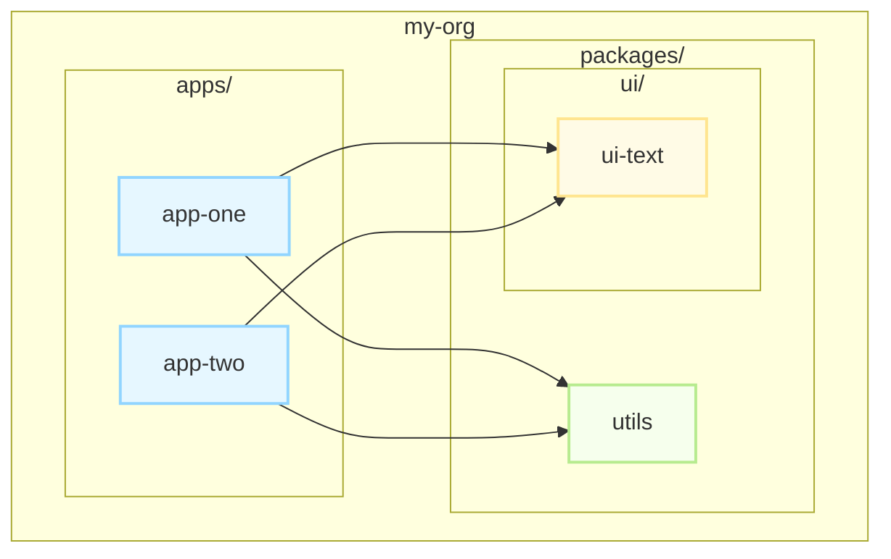

In this article, we'll build a monorepo for frontend applications. We'll use: PNPM for efficient package management, Nx as our build tool, Vite for bundling, Vitest as our test runner, Biome.js for formatting and linting, React with TypeScript, and Emotion for styling. You can configure your tech stack as you need while following the tutorial.

We'll use the following architecture for our applications:



## Step 1: Initializing the Monorepo with PNPM and Nx

First, ensure you have Node.js (v18 or higher) and PNPM installed. If you don't have PNPM, you can install it globally:

```sh
npm install -g pnpm
```

Now, let's create our Nx workspace. We'll use the `create-nx-workspace` command, which will set up the basic structure and configuration for us.

```sh
pnpm create nx-workspace@latest my-org --preset=react-monorepo --appName=app-one --style=@emotion/styled --nxCloud=skip
```

Let's break down this command:

- `my-org`: This will be the name of our root folder.
- `--preset=react-monorepo`: This tells Nx to configure the workspace for a React monorepo.
- `--appName=app-one`: It creates our first application, named `app-one`, inside the `apps` directory.
- `--style=@emotion/styled`: We are pre-configuring our app to use Emotion for CSS-in-JS.
- `--nxCloud=skip`: We'll skip Nx Cloud for this monorepo, but it's a great feature for distributed caching in team environments.


We'll need to answer some questions. You can use these answers:

- Which bundler would you like to use?
	- **Vite**
- Which unit test runner would you like to use?
	- **Vitest**
- Test runner to use for end to end (E2E) tests
	- **Playwright**
- Would you like to use ESLint?
	- **No (we'll use Biome.js for this)**
- Would you like to use Prettier for code formatting?
	- **No (we'll use Biome.js for this)**

After a few seconds, we'll have our org monorepo initialized:

```sh
woliveiras pnpm create nx-workspace@latest my-org --preset=react-monorepo --appName=app-one --style=@emotion/styled --nxCloud=skip

 NX   Let's create a new workspace [https://nx.dev/getting-started/intro]

✔ Which bundler would you like to use? · vite
✔ Which unit test runner would you like to use? · vitest
✔ Test runner to use for end to end (E2E) tests · playwright
✔ Would you like to use ESLint? · No
✔ Would you like to use Prettier for code formatting? · No

 NX   Creating your v21.4.0 workspace.

✔ Installing dependencies with pnpm
✔ Successfully created the workspace: my-org
```

If you're using VS Code, you can also create the MCP server config file in the `.vscode` folder for using Nx:

**file `.vscode/mpc.json`**

```json
{
  "servers": {
    "nx-mcp": {
      "type": "stdio",
      "command": "npx",
      "args": [
        "-y",
        "nx-mcp@latest",
        "."
      ]
    }
  }
}
```

The initial folders in our org monorepo will be:

```sh
.
├── apps
│   ├── app-one
│   │   ├── index.html
│   │   ├── package.json
│   │   ├── public
│   │   │   └── favicon.ico
│   │   ├── src
│   │   │   ├── app
│   │   │   │   ├── app.spec.tsx
│   │   │   │   ├── app.tsx
│   │   │   │   └── nx-welcome.tsx
│   │   │   ├── assets
│   │   │   └── main.tsx
│   │   ├── tsconfig.app.json
│   │   ├── tsconfig.json
│   │   ├── tsconfig.spec.json
│   │   └── vite.config.ts
│   └── app-one-e2e
│       ├── package.json
│       ├── playwright.config.ts
│       ├── src
│       │   └── example.spec.ts
│       └── tsconfig.json
├── nx.json
├── package.json
├── pnpm-lock.yaml
├── pnpm-workspace.yaml
├── README.md
├── tsconfig.base.json
├── tsconfig.json
└── vitest.workspace.ts
```

In this tutorial, we'll not focus on the explaination of the files created by Nx, but you can check the [Nx documentation](https://nx.dev) for more details.

Before continuing with the tutorial, let's check if it's all working.

Run the following command to start our `app-one`.

```sh
pnpm nx serve app-one
```

Or by running this command:

```sh
pnpm exec nx run app-one:serve
```

This will start the development server for `app-one` on port 4200 by default. You can change the port in the `apps/app-one/vite.config.ts` file if needed.

If all goes well, you'll be able to access the dev server.

```sh
my-org git:(main) ✗ pnpm nx serve app-one

> nx run @my-org/app-one:serve

> vite


  VITE v6.3.5  ready in 323 ms

  ➜  Local:   http://localhost:4200/
```

## Step 2: Adding Biome.js to our monorepo

Before creating the app-two and the libraries for our org, we need to finish the setup of the monorepo. We just need to install the Biome.js now.

Just run the following command:

```sh
pnpm add -D --save-exact @biomejs/biome
```

After installing it, we can initialize the Biome.js settings:

```sh
pnpm exec biome init
```

Now we have the `biome.json` file in our monorepo. We can run `pnpm exec biome format --write` to fix anything that is not in the standard defined in the biome.json file.

You can also run `pnpm exec biome check` to check if everything is fine with the code in the monorepo.

Add the Biome.js extension to your editor too. If you're using VS Code, you can install the [Biome extension](https://marketplace.visualstudio.com/items?itemName=biomejs.biome) from the marketplace.

## Step 3: Creating a Second Application

One of the main advantages of a monorepo is having multiple applications co-located. Let's create our second application, `app-two`. Nx makes this simple with its code generators.

Run the following command from the root of the monorepo:

```sh
pnpm nx g @nx/react:app apps/app-two --style=@emotion/styled  --bundler=vite
```

We'll also need to answer some questions. You can follow this:

```sh
✔ Would you like to add routing to this application? (y/N) · false
✔ What unit test runner should be used? · vitest
✔ Which E2E test runner would you like to use? · playwright
✔ Which port would you like to use for the dev server? · 5000
```

We're using the port 5000 for `app-two` to avoid conflicts with `app-one`, which runs on port 4200.

Now, you can up the second application by running:

```sh
pnpm nx serve app-two
```

And you should see the following output:

```sh
my-org git:(main) ✗ pnpm nx serve app-two

> nx run @my-org/app-two:serve

> vite


  VITE v6.3.5  ready in 77 ms

  ➜  Local:   http://localhost:5000/
```

## Step 4: Creating a Shared Utility Library

Now for the core benefit of a monorepo: **code sharing**. Let's create a simple utility library that can be used by both `app-one` and `app-two`.

We'll place our reusable code in the `packages` directory. Some Nx presets call it `libs`, but we'll use *packages* to keep consistency with what the JavaScript community is used to (because of our past with Lerna). You can use `libs` instead of `packages` if you want to. Let's create that directory first.

```sh
mkdir packages
```

Now, let's use an Nx generator to create a new TypeScript library called `utils`.

```sh
pnpm nx g @nx/js:lib utils --directory=packages/utils --bundler=none --unitTestRunner=vitest
```

This command creates a new library in `packages/utils`. We specified `--bundler=none` because this simple library doesn't need to be bundled on its own; it will be consumed as source code by our applications, which Vite will handle. We also configured it with Vitest for testing.

Now, let's add a simple utility function. Open `packages/utils/src/lib/utils.ts` and add the following function:

```typescript
/**
 * Formats a greeting message for the provided name.
 *
 * @param name - The name to include in the greeting.
 * @returns A greeting string in the format: "Hello, {name}! Welcome to our monorepo."
 */
export function formatGreeting(name: string): string {
	return `Hello, ${name}! Welcome to our monorepo.`;
}
```

Notice that the generator also created an index.ts file (`packages/utils/src/index.ts`) that exports this module. This is our library's public API.

We also have a test file here. So, let's update its content to this:

```
import { formatGreeting } from "./utils.js";

describe('utils', () => {
  it('should work', () => {
    expect(formatGreeting("Uillaz")).toEqual(
      "Hello, Uillaz! Welcome to our monorepo."
    );
  })
})
```

You can change `Uillaz` to your name.

We can run the tests for this project by using this command:

```sh
pnpm nx test packages/utils
```

## Step 5: Creating a Shared UI Component Library

Now, we have two applications and one shared utilities library. Let's create the ui package to share ui components between our apps.

```sh
pnpm nx g @nx/react:lib ui-text --directory=packages/ui/text --bundler=vite --unitTestRunner=vitest --style=@emotion/styled
```

- `@nx/react:lib`: We are using the React library generator.
- `--directory=packages/ui/text`: This will place our library inside a packages/ui folder, which is good for organization.
- `--bundler=vite`: We are using Vite to build this library.

Now, let's implement the component. Open `packages/ui/text/src/lib/ui-text.tsx` and replace its content with this:

```typescript
import styled from "@emotion/styled";
import React from "react";

/**
 * Text component for rendering styled text.
 *
 * @param props - Properties for the Text component
 * @param props.children - Content to be rendered inside the text
 * @param props.color - Text color (CSS color string)
 * @param props.size - Text size: 'small', 'medium', or 'large'
 */
export interface TextProps {
	children: React.ReactNode;
	color?: string;
	size?: "small" | "medium" | "large";
}

/**
 * Styled paragraph element for the Text component.
 * Applies color and font size based on props.
 */
const StyledText = styled.p<Omit<TextProps, "children">>`
  color: ${(props) => props.color || "black"};
  font-size: ${(props) => {
		switch (props.size) {
			case "small":
				return "12px";
			case "large":
				return "24px";
			default:
				return "16px";
		}
	}};
  margin: 0;
`;

/**
 * Renders styled text with customizable color and size.
 */
export const Text: React.FC<TextProps> = (props) => {
  return <StyledText {...props}>{props.children}</StyledText>;
};

export default Text;
```

Let's update the tests for this component! But, before anything, let's add the matchers needed for testing UI components and the types in our monorepo:

```sh
pnpm add -D @testing-library/jest-dom @types/react @types/react-dom -w
```

Now, open `packages/ui/text/src/lib/text.spec.tsx` and replace its content with this:

```typescript
import { render } from "@testing-library/react";
import '@testing-library/jest-dom';

import Text from "./text";

describe("Text", () => {
  it("should render children", () => {
    const { getByText } = render(<Text>Hello world</Text>);
    expect(getByText("Hello world")).toBeInTheDocument();
  });

  it("should apply color prop", () => {
    const { getByText } = render(<Text color="red">Colored</Text>);
    expect(getByText("Colored")).toHaveStyle({ color: "rgb(255, 0, 0)" });
  });

  it("should apply size 'small'", () => {
    const { getByText } = render(<Text size="small">Small</Text>);
    expect(getByText("Small")).toHaveStyle({ fontSize: "12px" });
  });

  it("should apply size 'medium' (default)", () => {
    const { getByText } = render(<Text size="medium">Medium</Text>);
    expect(getByText("Medium")).toHaveStyle({ fontSize: "16px" });
  });

  it("should apply size 'large'", () => {
    const { getByText } = render(<Text size="large">Large</Text>);
    expect(getByText("Large")).toHaveStyle({ fontSize: "24px" });
  });

  it("should use default color if none is provided", () => {
    const { getByText } = render(<Text>Default color</Text>);
    expect(getByText("Default color")).toHaveStyle({ color: "rgb(0, 0, 0)" });
  });
});
```

Now you can run the tests by using the following command:

```sh
pnpm nx test packages/ui/text
```

## Step 6: Using Shared Code in Our Applications

Now, let's use our new `utils` and `ui-text` libraries in our `app-one`.

First of all, let's add our paths to the settings and configure the TypeScript aliases.

Open the `apps/app-one/tsconfig.app.json` and add the following content:

```json
{
	"extends": "../../tsconfig.base.json",
	"compilerOptions": {
		"outDir": "dist",
		"tsBuildInfoFile": "dist/tsconfig.app.tsbuildinfo",
		"jsx": "react-jsx",
		"lib": ["dom"],
		"types": [
			"node",
			"@nx/react/typings/cssmodule.d.ts",
			"@nx/react/typings/image.d.ts",
			"vite/client"
		],
		"jsxImportSource": "@emotion/react"
	},
	"exclude": [
		"out-tsc",
		"dist",
		"src/**/*.spec.ts",
		"src/**/*.test.ts",
		"src/**/*.spec.tsx",
		"src/**/*.test.tsx",
		"src/**/*.spec.js",
		"src/**/*.test.js",
		"src/**/*.spec.jsx",
		"src/**/*.test.jsx",
		"vite.config.ts",
		"vite.config.mts",
		"vitest.config.ts",
		"vitest.config.mts"
	],
	"include": [
		"src/**/*.js",
		"src/**/*.jsx",
		"src/**/*.ts",
		"src/**/*.tsx",
		"../../packages/**/*.ts",
		"../../packages/**/*.tsx"
  ]
}
```

In the `tsconfig.base.json`, add the following content:

```json
{
  "compilerOptions": {
    "composite": true,
    "declarationMap": true,
    "emitDeclarationOnly": true,
    "importHelpers": true,
    "isolatedModules": true,
    "lib": [
      "es2022"
    ],
    "module": "esnext",
    "moduleResolution": "bundler",
    "noEmitOnError": true,
    "noFallthroughCasesInSwitch": true,
    "noImplicitOverride": true,
    "noImplicitReturns": true,
    "noUnusedLocals": true,
    "skipLibCheck": true,
    "strict": true,
    "target": "es2022",
    "customConditions": [
      "development"
    ],
    "rootDir": ".",
    "baseUrl": ".",
    "paths": {
      "@my-org/text": [
        "packages/ui/text/src/index.ts"
      ],
      "@my-org/utils": [
        "packages/utils/src/index.ts"
      ]
    }
  }
}
```

To avoid any future issues with paths, let's add to the `tsconfigPaths` for our Vite applications.

Run this command in the root of our monorepo.

```sh
pnpm add -D vite-tsconfig-paths -w
```

And update the file `apps/app-one/vite.config.ts`.

```json
/// <reference types='vitest' />
import { defineConfig } from "vite";
import react from "@vitejs/plugin-react";
import tsconfigPaths from 'vite-tsconfig-paths';

export default defineConfig(() => ({
	root: __dirname,
	cacheDir: "../../node_modules/.vite/apps/app-one",
	server: {
		port: 4200,
		host: "localhost",
	},
	preview: {
		port: 4300,
		host: "localhost",
	},
	plugins: [react(), tsconfigPaths()],
	build: {
		outDir: "./dist",
		emptyOutDir: true,
		reportCompressedSize: true,
		commonjsOptions: {
			transformMixedEsModules: true,
		},
	},
	test: {
		name: "@my-org/app-one",
		watch: false,
		globals: true,
		environment: "jsdom",
		include: ["{src,tests}/**/*.{test,spec}.{js,mjs,cjs,ts,mts,cts,jsx,tsx}"],
		reporters: ["default"],
		coverage: {
			reportsDirectory: "./test-output/vitest/coverage",
			provider: "v8" as const,
		},
	},
}));
```

This allows us to import our shared code using a clean path. Like this:

```typescript
import { Text } from "@my-org/text";
import { formatGreeting } from "@my-org/utils";
```

When we run the server for the first time, we'll receive a message to sync the TypeScript settings. You can select *Yes, sync the changes and run the tasks*.

Run the server:

```sh
pnpm exec nx serve app-one
```

Select **Yes**:

```sh
? Would you like to sync the identified changes to get your workspace up to date? …
Yes, sync the changes and run the tasks
```

It will add the following code in our tsconfig of the app-one:

```json
 "references": [
    {
      "path": "../../packages/utils/tsconfig.lib.json"
    },
    {
      "path": "../../packages/ui/text/tsconfig.lib.json"
    }
  ],
```

Now, if everything goes well, we have the `formatGreeting` function and the `Text` component shared between any application in our monorepo. We can continue the job by adding more modules, more components, and more applications.

Before finishing our step-by-step and going to other points, let's update the test for the app-one, because we changed how it works.

Open the test file `apps/app-one/src/app/app.tsx` and update with the following content:

```typescript
import { render } from "@testing-library/react";
import App from "./app";

describe("App", () => {
  it("should render successfully", () => {
    const { baseElement } = render(<App />);
    expect(baseElement).toBeTruthy();
  });

  it("should display the correct greeting", () => {
    const { getByText } = render(<App />);
    expect(getByText("Hello, Developer! Welcome to our monorepo.")).not.toBeNull();
  });

  it("should render shared Text component", () => {
    const { getByText } = render(<App />);
    expect(getByText("This is a shared component from the ui-text package.")).not.toBeNull();
  });
});
```

Now we are finished.

## Running tests for all applications

If you need to run all the tests in the monorepo, you can use this command:

```sh
pnpm exec nx run-many --target=test --all --parallel
```

We use `parallel` to make it faster.

Example:

```sh
pnpm exec nx run-many --target=test --all --parallel


   ✔  nx run @my-org/text:build
   ✔  nx run @my-org/text:test
   ✔  nx run @my-org/utils:test
   ✔  nx run @my-org/app-one:test
   ✔  nx run @my-org/app-two:test
```

## Running the build process

If you need to build all the projects in the monorepo, you can use this command:

```sh
pnpm nx run-many --target=build --all --parallel
```

We use `parallel` to make it faster.

Example:

```sh
pnpm nx run-many --target=build --all --parallel


   ✔  nx run @my-org/text:build
   ✔  nx run @my-org/app-two:build
   ✔  nx run @my-org/app-one:build
```

## Conclusion

You've successfully built a frontend monorepo, establishing a clean, scalable, and efficient architecture. With a solid foundation of PNPM, Nx, Vite, and Biome.js, your development workflow is now optimized for both **speed** and **consistency**.

So, what's next? This monorepo is the perfect launchpad for more advanced topics. Consider exploring:

- **CI/CD Integration**: Set up GitHub Actions or GitLab CI to automatically test and build only the applications affected by your changes using Nx's **affected** command.
- **Advanced State Management**: Introduce a shared state management solution like Zustand or Redux Toolkit that can be used across your applications.
- **Storybook for UI Components**: Integrate Storybook with your `ui/text` library to document and visually test your components in isolation.
- **Code Generation**: Create your own custom Nx **generators** to scaffold new components or modules with your team's specific conventions.

Congratulations on completing this guide. The setup you have now is used by many leading tech companies to manage complex frontend projects, and you are well-prepared to scale your development efforts. Happy coding, bro!
