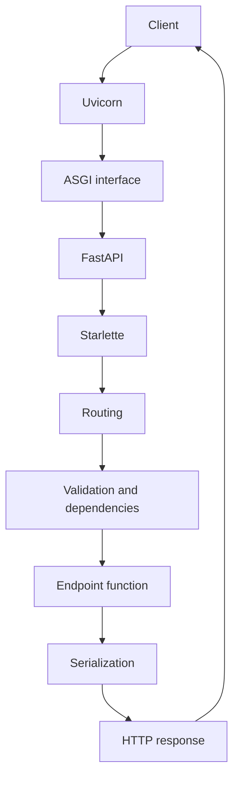

If you have written any Python script or Python app before, you know the classic loop: you have a file, you run `python script.py`, you read the output, you change something, and you run it again.

For a script that computes a value and exits, that loop is fine. For a web server it becomes painful. A server is a long-running process: it starts, binds to a network port, and then waits for requests until you stop it. Every time you edit a line of code, the running process is still holding the *old* version in memory. To see your change you have to stop the process and start it again, by hand, over and over.

Modern web frameworks remove that friction with a few connected ideas. A file watcher observes your source files and reacts when they change on disk. Using this mechanism, we have the possibility of auto-reload: when a watched file changes, the server restarts itself so the new code takes effect.

Thinking on fastapi, we have this command to start the development server:

```sh
uv run fastapi dev
```

It looks simple, but it sets some distinct tools in motion, each with its own job. This article walks through every layer of that command, explaining what `uv run` does, what `fastapi dev` does, why Uvicorn (the ASGI server) has to exist at all, what ASGI is, how the reload loop works, what you lose on every reload, and how the request path is actually served. By the end you should be able to explain the whole chain.

A few places below are approximations, and I flag them when they come up. Some behavior also depends on your operating system or which dependencies you installed before, so I point that out where it matters instead of pretending the stack is identical everywhere.

## A minimal FastAPI application

Let's start from something you can run yourself. Let's create the simple web app using FastAPI in `main.py`:

```python title="main.py"
from fastapi import FastAPI

app = FastAPI()


@app.get("/")
def root():
    return {"message": "Hello, world"}
```

Two things matter here. `FastAPI()` builds the application object, and by convention we assign it to a variable called `app`. The `@app.get("/")` decorator registers a route: when a client asks for `GET /`, FastAPI should call `root()` and turn its return value into an HTTP response.

To install and run this with [uv](https://docs.astral.sh/uv/), initialize a project and add FastAPI with its standard extras:

```sh
uv init
uv add "fastapi[standard]"
```

The `[standard]` part is important. It is an *extra*: an optional group of dependencies. `fastapi[standard]` pulls in the FastAPI CLI and Uvicorn with its recommended extras, so the `fastapi` command and a capable server are both available without you installing them separately (more on exactly what those extras contain later).

Now start the development server:

```sh
uv run fastapi dev
```

By default the app becomes available at:

```text
http://127.0.0.1:8000
```

`127.0.0.1` is the loopback address, the IP your machine uses to talk to itself. Binding there means the server is reachable from your own computer only, which is a sensible default for local development.

When we use `localhost:8000` instead of `127.0.0.1:8000`, it resolves to the same loopback address.

FastAPI also generates interactive API documentation automatically.

Open:

```text
http://127.0.0.1:8000/docs
```

And you get a Swagger UI page where you can call your endpoints from the browser. You did not write any of that; it is derived from your route definitions.

## The stack behind one command

When you run `uv run fastapi dev`, you are really running four cooperating layers:

```text
uv
└── FastAPI CLI (the "fastapi" command)
    └── Uvicorn (ASGI server)
        └── your FastAPI application
```

Each layer has a different responsibility, and confusing them is the source of a lot of misunderstanding about this Python stack. `uv` prepares and selects the Python environment and then launches a command inside it; it is not a web server. The FastAPI CLI finds your application object (the app object) and configures development mode; it is not a web server either. Uvicorn is the actual server: it opens the port, speaks HTTP, and runs your app. Your FastAPI application defines *how* to respond, but it never listens on the network by itself.

The rest of this post is essentially a zoom-in on each of these layers. Let's deep-dive into what each one does, how they interact, and what happens when you save a file and trigger a reload.

## Layer 1: What `uv run` does

`uv` is a Python package and project manager. When you run `uv run` inside a directory that contains a `pyproject.toml`, it treats that directory as a project and does the following before your command runs:

- identifies the project by locating the `pyproject.toml`;
- reads that file to understand the project's dependencies;
- creates or reuses a virtual environment (by default a `.venv` folder in the project);
- makes sure the declared dependencies are installed and in sync with the lockfile;
- resolves the executable you asked for (here, `fastapi`) inside that environment;
- runs the command using the project's Python interpreter and available packages on this virtual environment.

So this command:

```sh
uv run fastapi dev
```

does **not** mean that `uv` is your HTTP server. `uv` prepares the environment and then hands control to:

```sh
fastapi dev
```

Conceptually, this is close to manually activating a virtual environment and calling the executable inside it. It is not literally the same implementation, but the mental model holds: `uv run` guarantees the command runs against the project's environment. The approximate manual equivalents look like this.

On macOS or Linux:

```sh
.venv/bin/fastapi dev
```

On Windows (PowerShell):

```powershell
.venv\Scripts\fastapi.exe dev
```

To see why that guarantee matters, it helps to picture the two setups `uv run` replaces.

Without any environment manager at all, you install packages straight into the system Python and run the app with whatever `python` happens to be first on your `PATH`:

```sh
pip install "fastapi[standard]"
fastapi dev
```

This works until it doesn't. Every project shares one global set of packages, so two apps that need different FastAPI versions cannot coexist, and a `pip install` for one of them can silently break the other. On many systems the global Python is also managed by the operating system itself, so installing into it is a reliable way to break system tooling you did not mean to touch.

The usual fix is `venv`, which gives each project its own isolated set of packages. Without uv, you create the environment, activate it, install into it, and only then run the command:

```sh
python -m venv .venv
source .venv/bin/activate   # on Windows: .venv\Scripts\activate
pip install "fastapi[standard]"
fastapi dev
```

And, every time you come back to the project, you have to activate the environment again before running the command. This is the classic Python workflow for years, and it works fine if you remember every step.

The value of letting `uv run` do this for you is that it removes a whole category of environment bugs that every Python developer has hit at least once: accidentally using the global system Python instead of the project's, forgetting to activate the virtual environment, installing dependencies into the wrong place, or watching one machine behave differently from another because the environments drifted apart.

Because `uv` derives the environment from `pyproject.toml` and the lockfile every time, the environment your command runs against is predictable and reproducible across machines.

## Layer 2: What `fastapi dev` does

The `fastapi` command comes from the FastAPI CLI, which `fastapi[standard]` installed for you. When you run `fastapi dev` with no arguments, the CLI tries to *discover* your application. It looks for a FastAPI application object, expecting by convention an object named `app` inside a file such as `main.py` (it understands a few common variants too, like `app.py`).

Once it finds the object, it constructs an **import string** that describes where the app lives:

```text
main:app
```

Read this as two parts separated by a colon: `main` is the Python module (the `main.py` file), and `app` is the object created with `FastAPI()` inside that module. That import string is exactly what a server needs in order to import and run your application. When you launch the dev server, the CLI prints the string it resolved, something like `Using import string: main:app`, which is a good way to confirm it discovered the right object.

The FastAPI CLI provides convenience and automatic discovery, but it does not open the HTTP server itself. Internally it uses Uvicorn. That means the following command:

```sh
uv run fastapi dev
```

is *conceptually close* to:

```sh
uv run uvicorn main:app --reload --host 127.0.0.1 --port 8000
```

I want to be precise here: this is a conceptual equivalence, not a claim that one is a literal alias for the other. The FastAPI CLI performs additional discovery and configuration steps and prints its own developer-friendly output. The point of the comparison is to show *what* development mode sets up: your app, reload enabled, bound to localhost on port 8000.

If you prefer to be explicit rather than rely on discovery, the CLI accepts a path or an entrypoint directly:

```sh
uv run fastapi dev main.py
```

```sh
uv run fastapi dev --entrypoint main:app
```

Both tell the CLI exactly which app to load instead of guessing.

## The `app` object and how it is loaded

Before going to the next layer, I would like to clarify what the `app` object actually is.

The import string points at an object, so it is worth being precise about what that object actually is. `app` is an instance of the `FastAPI` class, and in ASGI terms it is a callable application: something the server can invoke with each incoming request. It is not a server and it is not a process. It is a plain Python object that happens to know how to route requests and produce responses.

The object gets built the moment its module is imported. When the server resolves `main:app`, it does an ordinary Python import of the `main` module, which runs the file top to bottom exactly once. Two things happen while that file executes:

```python
from fastapi import FastAPI

app = FastAPI()          # 1. the object is constructed here


@app.get("/")            # 2. this decorator runs at import time,
def root():              #    registering the route on the object
    return {"message": "Hello, world"}
```

First, `app = FastAPI()` constructs the object in the process's memory. Second, every `@app.get(...)`, middleware registration, and router include runs *at import time*, mutating that same object. Decorators are not deferred until a request arrives; they execute as the module is read. By the time the import finishes, `app` is a fully populated object holding your routing table, configuration, dependencies, and middleware, and it lives in RAM for as long as the server process does.

If you look at the FastAPI source, the `FastAPI` class subclasses Starlette's `starlette.applications.Starlette` (a lightweight, high-performance ASGI framework and toolkit ideal for building asynchronous web services in Python), and its `__init__` stores the moving parts as plain instance attributes. A simplified view of the object built in memory looks like this:

```text
app: FastAPI
├── router               APIRouter — the routing table
│   └── lifespan         the startup/shutdown context manager
├── user_middleware      the middleware you registered, as a list
├── middleware_stack     the composed ASGI callable, built on first request
├── exception_handlers   map of exception type / status code -> handler
├── dependency_overrides dict used mostly for testing
├── state                a shared object for arbitrary app-wide data
├── openapi_url,         metadata used to generate the OpenAPI schema
│   title, version, ...  (this is what powers /docs)
└── __call__(scope, receive, send)   the ASGI entrypoint the server calls
```

The exact attribute list is longer (most of it is OpenAPI and docs metadata), but the important ones are the first few. Two details are worth pulling out. Your routes do not live directly on `app`; they live on `app.router`, an `APIRouter`, and the `@app.get(...)` decorators just delegate to it. And `app` is callable because it defines `__call__(self, scope, receive, send)`: that async method is the ASGI entrypoint, the single door the server knocks on for every request. On the first request the middleware stack is composed once into `middleware_stack` and reused from then on.

From there the lifecycle is easy to state:

```text
import     the module runs once; `app` is built and routes are registered
startup    lifespan code before `yield` runs (open pools, load models, ...)
serving    the server keeps calling `app` for each request
shutdown   lifespan code after `yield` runs (close pools, flush, ...)
```

The server holds a single reference to that one object and calls it for every request until the process stops. There is no per-request re-import and no rebuilding of the object between requests: the same `app` in memory serves request after request.

This is also where reload connects back. Because a reload is a full process restart (covered in [How auto-reload works](#how-auto-reload-works)), the `app` object is not patched in place. The old process is discarded, the module is imported again from scratch, and a brand-new `app` is constructed with its routes re-registered and its startup re-run. That single fact explains why in-memory state resets on every save, which the next sections make concrete.

## Layer 3: What Uvicorn is

Uvicorn is an **ASGI server**, sometimes called an application server. To understand why it is required, you have to separate two responsibilities that are easy to conflate.

Your FastAPI app describes how to respond to requests. On its own, though, it does not listen on a network port, it does not read bytes off a socket, and it does not know how to parse HTTP. It is a Python object waiting to be called. Something else has to sit between the network and your app, and that something is the server.

Uvicorn is responsible for the operational side:

- opening a network port and binding to it;
- accepting incoming client connections;
- parsing the raw bytes of an HTTP request into structured data;
- translating that request into ASGI events your app understands;
- calling your application with those events;
- taking the response your app produces and writing it back to the client;
- managing the server lifecycle, including startup and shutdown.

A compact way to hold the division in your head:

```text
FastAPI defines how the application responds.
Uvicorn runs that application as a server.
```

This is why you cannot "just run FastAPI." FastAPI needs a server to be reachable over the network.

## Layer 4: What ASGI is

ASGI stands for Asynchronous Server Gateway Interface. The important word is **interface**: ASGI is a contract that defines how a server and a web application talk to each other. As long as the server speaks ASGI and the application speaks ASGI, the two can be swapped independently. Uvicorn is one ASGI server; FastAPI produces an ASGI application. They agree on the protocol, so they interoperate.

ASGI was designed as the asynchronous successor to WSGI, the older synchronous interface that powered frameworks like Flask and Django for years. The asynchronous design is what makes several modern capabilities practical:

- **asynchronous code**, so a single worker can make progress on many requests that are waiting on I/O;
- **many concurrent connections** without needing one operating-system thread per connection;
- **WebSockets** and other long-lived, bidirectional connections, which the request/response-only WSGI model did not cover;
- **startup and shutdown events**, so the server can tell the app "we are coming up" and "we are going down";
- a foundation for modern async Python libraries in general.

This is the third generation of the same idea. The oldest is CGI, the Common Gateway Interface, where the web server spawned a brand-new process for every request and passed the request in through environment variables and standard input. It was language-agnostic and simple, but a process per request does not scale. WSGI replaced that with a Python-specific contract: a synchronous callable the server invokes in-process, which is what Flask and Django were built on. ASGI keeps the same "server talks to a Python callable" shape but makes it asynchronous, which is what allows the concurrency and WebSocket support above. So the lineage runs CGI (process per request) to WSGI (synchronous callable) to ASGI (asynchronous callable).

### How the server and the app actually talk

Underneath, the contract is small enough to fit in one function signature. An ASGI application is a coroutine the server can call with exactly three arguments:

```python
async def app(scope, receive, send):
    ...
```

Those three names are the whole conversation. `scope` is a dictionary describing the connection: its `type` (`"http"`, `"websocket"`, or `"lifespan"`), and for an HTTP request the method, path, headers, query string, and so on. `receive` is an awaitable the app calls to *pull* the next event from the server (the request body arrives this way). `send` is an awaitable the app calls to *push* events back (the response goes out this way). The server owns the socket; the app only ever speaks through these two channels.

Here is a complete ASGI app, with no framework, that answers `GET /` with `Hello`:

```python
async def app(scope, receive, send):
    assert scope["type"] == "http"

    # 1. wait for the request to arrive
    await receive()  # -> {"type": "http.request", "body": b"", "more_body": False}

    # 2. start the response: status line and headers
    await send({
        "type": "http.response.start",
        "status": 200,
        "headers": [(b"content-type", b"text/plain")],
    })

    # 3. send the body, then finish
    await send({
        "type": "http.response.body",
        "body": b"Hello",
    })
```

Reading it as a dialogue: Uvicorn accepts the TCP connection, parses the HTTP request, builds the `scope` dict, and calls `app(scope, receive, send)`. The app awaits `receive()` to get an `http.request` event carrying the body (empty here). Then it emits two events through `send`: first `http.response.start` with the status code and headers, then one or more `http.response.body` events with the actual bytes. When `more_body` is absent or `False`, the response is complete and Uvicorn writes it back to the client and closes or reuses the connection.

The lifespan events from earlier ride the same rails. At startup the server opens a connection with `scope["type"] == "lifespan"`, the app awaits `receive()` and gets `lifespan.startup`, runs your startup code, and replies with `send({"type": "lifespan.startup.complete"})`; shutdown is the mirror image. That is why FastAPI can model startup and shutdown at all: they are just two more message types on the same interface.

FastAPI is this exact shape, only with everything you actually want layered on top. Its `__call__(scope, receive, send)` is the `app` above; Starlette reads the `scope` to route the request, builds a convenient `Request` object from `receive`, calls your endpoint, and turns your return value into the `http.response.start` and `http.response.body` events sent back through `send`. You write `return {"message": "Hi"}`; the framework does the raw ASGI messaging for you.

You do not have to memorize the byte-level details of the protocol to work productively. The useful takeaway is that ASGI is the boundary between the server and your app, and it is the reason the same FastAPI app can run under Uvicorn today and a different ASGI server tomorrow.

## How auto-reload works

Development mode enables auto-reload, and it does so with a two-role process model:

```text
Supervisor (reloader) process
└── Server (worker) process
```

The **supervisor** process watches your files. It does not serve requests itself. The **server** process is the one that actually imports your application, runs its startup code, and answers HTTP requests.

When you save a change to a watched file, the sequence is roughly:

1. the file change is detected on disk;
2. the current server process is stopped;
3. a new server process is started;
4. your Python modules are imported again from scratch;
5. any startup code runs again;
6. the fresh server process begins accepting requests.

The thing to hold on to here is that this is a full restart of your application, not a magical in-place patch of the running code. The framework does not reach into a live process and rewrite the function you edited while keeping everything else warm. It throws away the old process and builds a new one. That single distinction explains almost everything about what reload does and does not preserve, which is exactly the next section.

## The role of watchfiles

How does the supervisor notice that a file changed? It can poll (repeatedly check timestamps), but polling is wasteful and slow. A better approach is to ask the operating system to *notify* you when something changes.

That is what [watchfiles](https://watchfiles.helpmanual.io/) does. When it is available, Uvicorn can use it to watch the filesystem efficiently, relying on native change-notification mechanisms provided by the operating system rather than constantly scanning files by hand. In the dev server's startup logs you can often see this in action, with a line indicating the reloader was started using WatchFiles.

One caveat, because I have been bitten by assuming otherwise: `watchfiles` is not guaranteed to be present in every installation. Whether it is available depends on which dependencies you installed and how your environment is set up. In practice, installing Uvicorn with its standard extras (which `fastapi[standard]` does for you) brings `watchfiles` along, but an optional dependency is configuration-dependent, not universal. If you need to confirm the exact behavior for your version, check the Uvicorn and FastAPI CLI documentation.

## What is lost during a reload

Because a reload is a full restart, everything that lived only in the old process's memory is discarded. That includes:

- global variables;
- in-process caches;
- open connections held in memory;
- objects created during startup;
- machine-learning models loaded into RAM;
- background tasks running inside the process;
- anything you kept around but never persisted.

A tiny example makes it concrete:

```python
counter = 0


@app.get("/increment")
def increment():
    global counter
    counter += 1
    return {"counter": counter}
```

Hit `/increment` a few times and `counter` climbs. Save any watched file, trigger a reload, and `counter` is back to `0`, because the module was imported fresh in a brand-new process and the top-level assignment ran again. Nothing remembered the previous value.

The first time this happens it feels like a bug. It is not. Anything you actually need to survive belongs in a system built to persist it: a database, an external cache like Redis, or durable storage. In-process memory is not a place to keep data you care about, and reload just makes that impossible to ignore.

## Lifespan, startup, and shutdown

Many applications need to set up resources when they start and tear them down when they stop. FastAPI models this with a **lifespan** context manager:

```python
from contextlib import asynccontextmanager

from fastapi import FastAPI


@asynccontextmanager
async def lifespan(app: FastAPI):
    print("Starting resources")
    yield
    print("Shutting down resources")


app = FastAPI(lifespan=lifespan)
```

The flow is:

```text
import
startup   (everything before `yield`)
requests  (the app serves traffic)
shutdown  (everything after `yield`)
```

Everything before `yield` runs once at startup; everything after runs at shutdown. Crucially, **every reload runs this whole cycle again**.

This matters most for anything expensive or stateful that you create during startup:

- database connection pools;
- HTTP clients you keep open for reuse;
- message-queue producers and consumers;
- AI models loaded into memory;
- GPU resources;
- telemetry and tracing exporters;
- background workers.

If startup loads a large model, then every file save during development pays that startup cost again. This is the moment where a fast edit loop and heavy startup work start fighting each other, and it is worth knowing before it catches you off guard mid-session.

## The path of an HTTP request

Now let's follow a request from the client to your endpoint and back. Suppose you have:

```python
@app.get("/hello")
def hello():
    return {"message": "Hi"}
```

When a browser or client calls `GET /hello`, the request flows through the layers like this:



Reading it step by step, without diving too deep into internals:

- **Client**: sends the raw HTTP request over the network.
- **Uvicorn**: accepts the connection, parses HTTP, and turns the request into ASGI events.
- **ASGI**: the contract that carries those events into the application.
- **FastAPI / Starlette**: FastAPI builds on Starlette for its web layer. Starlette handles the ASGI application mechanics, middleware, and the routing table.
- **Routing**: the framework matches `GET /hello` to the `hello` function.
- **Validation and dependencies**: path and query parameters, request bodies, and any declared dependencies are resolved and validated before your code runs.
- **Endpoint function**: your `hello()` runs and returns a Python object.
- **Serialization**: the return value is converted into JSON for the response.
- **HTTP response**: Uvicorn writes the bytes back to the client.

Two attributions are worth stating clearly. FastAPI uses Starlette for its web layer and Pydantic for data validation and serialization. That division is why FastAPI can validate inputs and generate documentation from your type hints: Pydantic does the data modeling, Starlette does the web plumbing, and FastAPI ties them together.

## `def` versus `async def`

FastAPI lets you write endpoints either way:

```python
@app.get("/sync")
def sync_route():
    return {"mode": "sync"}
```

```python
@app.get("/async")
async def async_route():
    return {"mode": "async"}
```

Both are valid, and choosing between them is not about one being universally better. What matters is the mechanics. An `async def` endpoint can run directly on the event loop, the single-threaded scheduler that ASGI applications use to interleave many concurrent operations waiting on I/O. A plain `def` endpoint is handled so its potentially blocking work does not run directly on that loop; FastAPI runs it in a way that keeps the loop free to handle other requests. Writing `async def` does **not** magically make blocking work non-blocking: if you call something that blocks inside an async endpoint (a synchronous database driver, a `time.sleep`, a CPU-bound loop), you block the event loop and hurt concurrency for everyone. To actually benefit from `async def`, the libraries you call also need to offer asynchronous APIs, so an endpoint that awaits an async HTTP client behaves very differently from one that calls a synchronous client and blocks.

The practical guidance: reach for `async def` when your endpoint awaits genuinely async operations, and stay comfortable with plain `def` when your dependencies are synchronous. `async` is a tool with a specific purpose, not an upgrade you sprinkle everywhere. I have reviewed plenty of code where every endpoint was `async def` and every call inside it blocked, which gets you the worst of both worlds.

## Components Uvicorn selects

Uvicorn can choose different underlying implementations depending on your platform and which optional dependencies are installed. You do not usually configure these by hand in development, but it helps to know they exist. There is the event loop implementation (`asyncio` from the standard library, or `uvloop`, a faster drop-in replacement), the HTTP protocol implementation (`h11`, pure Python, or `httptools`, a faster C-based parser), and the WebSocket protocol implementations.

In its automatic mode, Uvicorn picks compatible implementations based on what is available, preferring the faster ones when their optional dependencies are installed. One platform note worth calling out: behavior can differ on Windows. In particular, `uvloop` is not used on Windows the way it is on Linux and macOS, so the event loop implementation there falls back to the standard library. This is not something to worry about for development, but it is a real difference between operating systems, so I would rather name it than pretend the stack is identical everywhere.

## Differences between the commands

Four commands come up constantly, and mixing them up leads to bad production decisions. Here is how they compare at a glance, followed by the details.

| Command | Reload | Default host | Intended use |
|---|---|---|---|
| `uv run fastapi dev` | On | `127.0.0.1` | Local development |
| `uv run fastapi run` | Off | `0.0.0.0` | Running closer to a deployed setup |
| `uv run uvicorn main:app --reload` | On | Uvicorn default | Explicit control, with reload |
| `uv run uvicorn main:app` | Off | Uvicorn default | Explicit control, no reload |

### `fastapi dev`

`fastapi dev` is built for local development. Reload is on by default, it discovers your app automatically, and it binds to `127.0.0.1` so the server is reachable only from your own machine. The output is tuned to be readable while you work.

### `fastapi run`

`fastapi run` drops the development-mode behavior. There is no auto-reload, and it binds to `0.0.0.0`, so it listens on all interfaces and can be reached from outside the machine, which is what you usually want inside a container. It runs the app closer to how a deployed instance would, but it does **not** make your production architecture decisions for you.

### `uvicorn main:app --reload`

`uvicorn main:app --reload` hands you explicit control over the server. Reach for it when you want to configure Uvicorn directly instead of going through the CLI. The trade-off is that you name the module and app object yourself (`main:app`).

### `uvicorn main:app`

`uvicorn main:app` runs with no reload. In a real deployment you would still wrap it in process supervision, multiple workers, a reverse proxy, containers, and operational configuration.

The honest summary is that none of these commands is, by itself, a complete production setup. They are different entry points with different defaults, and knowing the defaults is what keeps you from shipping a development server to production by accident.

## Development is not production

This deserves its own section, because it is the most common and most costly mistake: **do not run auto-reload in production.**

A stray file change on the server can trigger an unexpected restart, the file-watching machinery burns resources you do not need, and you end up monitoring the filesystem in an environment where code should be immutable. On top of that, reload does not fit running multiple replicas, it risks duplicating initialization work, and it lowers operational predictability overall.

A real production deployment usually involves some combination of:

- containers;
- multiple instances or replicas;
- a load balancer in front;
- an orchestrator such as Kubernetes, or a process supervisor such as systemd;
- health checks;
- structured logs;
- metrics;
- distributed tracing;
- configuration via environment variables;
- secret management.

I am deliberately not turning this into a deployment tutorial, because doing it well depends heavily on where and how you deploy. The single rule to carry away is the boundary itself: the dev server optimizes for fast feedback, and production optimizes for stability, observability, and predictable operation. They are different tools for different jobs.

## What runs in production

If development uses Uvicorn, the natural question is what replaces it in production. The short answer is nothing: you still use an ASGI server, and Uvicorn is perfectly capable of running in production. What changes is not the server itself but how you run it and what you put around it.

The most direct option is Uvicorn without reload, usually with more than one worker (`uvicorn main:app --workers 4`), or through `fastapi run`, which starts Uvicorn in a production-oriented mode. This is what the current FastAPI documentation points to. For a long time the common pattern was Gunicorn managing Uvicorn workers (`gunicorn -k uvicorn.workers.UvicornWorker`), but that guidance has shifted: recent FastAPI docs favor running Uvicorn directly with `--workers` or letting your orchestrator handle replication, and the old worker class has been dropped in newer Uvicorn versions. Because ASGI is just a contract, you are also free to run a different ASGI server entirely, such as Hypercorn or Granian, against the same `app`.

The server, though, is only one piece. A production deployment normally wraps it in a reverse proxy (nginx, Traefik), containers, and an orchestrator such as Kubernetes or a supervisor such as systemd that handles replicas and restarts, plus TLS, health checks, structured logs, and metrics. The `--reload` flag goes away; replication and supervision take its place.

One honest caveat: the advice around Gunicorn and Uvicorn workers has changed over the last few years, so the exact recommendation depends on the FastAPI and Uvicorn versions you run. For your versions, confirm the details in the [FastAPI deployment docs](https://fastapi.tiangolo.com/deployment/).

## A mental model to keep

If you take away one thing, take this compressed map of who does what:

```text
uv run
    selects and prepares the Python environment

fastapi dev
    discovers the application and sets up development mode

Uvicorn
    runs the ASGI server

watchfiles
    can detect file changes (when available)

FastAPI and Starlette
    process the application and the requests

Pydantic
    handles validation and serialization of the data
```

## Conclusion

`uv run fastapi dev` is one line, but it orchestrates a layered stack: `uv` prepares a reproducible environment and launches a command inside it; the FastAPI CLI discovers your app and turns on development mode; Uvicorn opens a port and runs your app as an ASGI server; and, when available, `watchfiles` watches your source so a supervisor can restart the server on every save. That restart is a full process restart, which is exactly why in-memory state resets and why lifespan startup runs again each time.

Understanding the layers pays off in practical decisions. You know why `async def` is not a free upgrade, why heavy startup work makes the dev loop feel slow, why you should never keep important data only in process memory, and above all why the development server is not a production server. Use `fastapi dev` while you build, and make a deliberate, separate set of choices when it is time to deploy.

## References

- [FastAPI CLI](https://fastapi.tiangolo.com/fastapi-cli/) — `fastapi dev`, `fastapi run`, app discovery, and the `pyproject.toml` entrypoint.
- [FastAPI: Concurrency and async / await](https://fastapi.tiangolo.com/async/) — how `def` and `async def` endpoints are handled.
- [FastAPI: Lifespan Events](https://fastapi.tiangolo.com/advanced/events/) — startup and shutdown with the lifespan context manager.
- [FastAPI: Deployment](https://fastapi.tiangolo.com/deployment/) — production concepts and running a server manually.
- [uv: Running commands in projects](https://docs.astral.sh/uv/concepts/projects/run/) — how `uv run` prepares and uses the project environment.
- [uv: Working on projects](https://docs.astral.sh/uv/guides/projects/) — project structure, `pyproject.toml`, and the lockfile.
- [Uvicorn documentation](https://www.uvicorn.org/) — settings, deployment, and the ASGI server itself.
- [ASGI specification](https://asgi.readthedocs.io/) — the server/application interface.
- [Starlette](https://www.starlette.io/) — the web toolkit FastAPI builds on.
- [FastAPI source: `applications.py`](https://github.com/fastapi/fastapi/blob/master/fastapi/applications.py) — the `FastAPI` class and the attributes it builds on `app`.
- [Starlette source: `applications.py`](https://github.com/encode/starlette/blob/master/starlette/applications.py) — the base class, including `router`, `state`, and the ASGI `__call__`.
- [Pydantic](https://docs.pydantic.dev/) — data validation and serialization.
- [watchfiles](https://watchfiles.helpmanual.io/) — filesystem change notifications used for reload.
