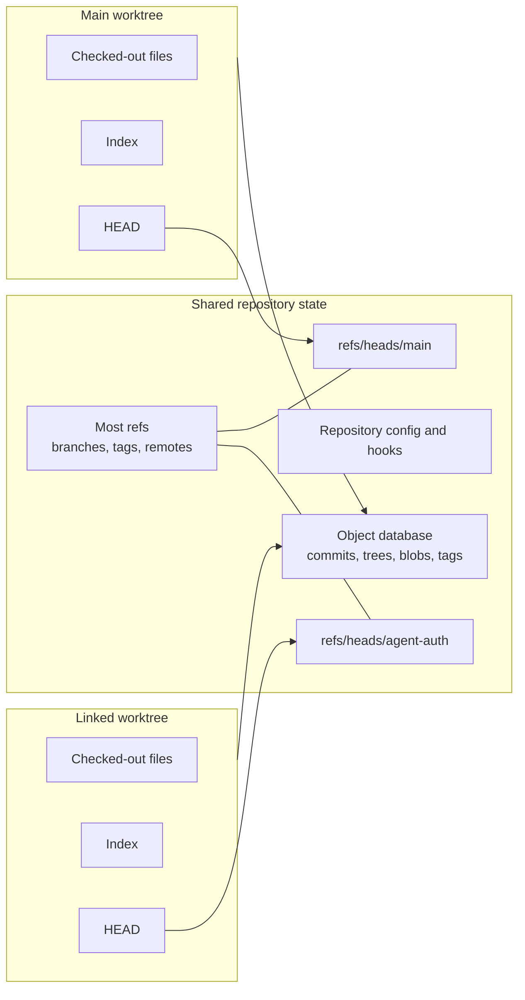
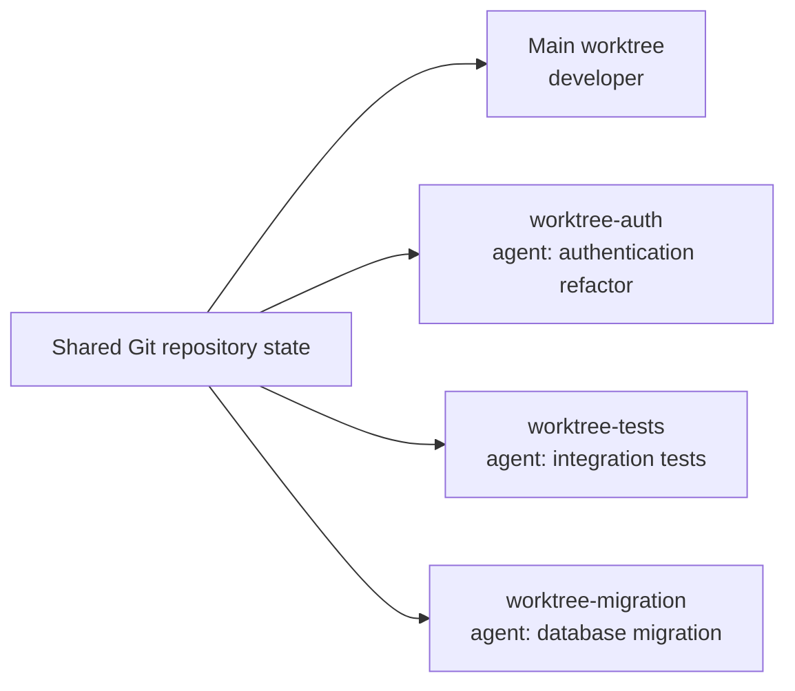

When I first saw a code agent creating a Git Worktree, I didn't pay much attention. To me, it was just another part of the workflow in the age of agentic coding. However, when we start using these agents with some frequency, it's clear that multi-agent mode will become part of our routine. And soon, the use of worktrees will start to make much more sense.

Git shipped the `git worktree` command back in 2015 so developers could keep more than one working tree attached to the same repository. You could leave a refactoring untouched, open a second directory for an emergency fix, run a long test on one branch, and continue working on another.

For one developer working serially, this was often a convenience. Stashing, switching branches, or keeping another clone nearby was usually good enough. But the operating environment has changed. A coding agent can now search an entire repository, edit dozens of files, install dependencies, run commands, start services, execute tests, create commits, and continue working while you focus somewhere else. **Several agents may do this at the same time**.

Of course, Git worktrees weren't waiting for AI. It is narrower: **coding agents have created an unusually strong use case for an old Git abstraction**. When several autonomous workers need to mutate the same repository concurrently, separate source checkouts stop looking like a power-user convenience and start looking like execution infrastructure.

But this tool has limits. Worktrees isolate checked-out source state. They do not isolate processes, ports, databases, credentials, networks, or external services. They don't prevent bad changes, and they don't make integration disappear. Understanding those boundaries is the difference between using worktrees as an engineering primitive and mistaking them for a sandbox.

## Why can't the agent simply create another branch?

Suppose you are editing this file:

```text
src/auth.ts
```

You have unstaged changes in your working directory. At the same time, you want an agent to refactor the authentication system.

You could create a branch in the directory you already have open:

```sh
git switch -c agent/auth-refactor
```

Assuming Git can switch safely, your unstaged `src/auth.ts` changes remain in that same working directory. The branch name changed, but the files did not move to a new place. If you and the agent now operate in that directory, you are both reading and writing the same mutable filesystem state.

You also lost your original foreground checkout. To return to your branch, you must first commit, stash, discard, or otherwise move the changes the agent made. Git may refuse the switch if it would overwrite local work.

Now compare that with a worktree:

```sh
git worktree add ../agent-auth -b agent/auth-refactor HEAD
```

This creates a new branch from the current committed `HEAD` and checks it out in `../agent-auth`. Your current directory stays where it is, with your unstaged edit untouched. The agent receives a separate directory with its own checked-out files and index.

There is an important detail here: manual `git worktree add ... HEAD` starts from a commit. It does not silently copy your uncommitted files into the new checkout. Some agent tools provide an explicit mechanism to transfer local changes, but that is tool behavior layered on top of Git, not the default behavior of `git worktree add`.

The difference is:

> A branch gives the work its own line of development. A worktree gives it its own directory.

Git's own glossary defines a branch through its moving tip ref and a working tree as the actual checked-out files plus local changes. Those are related concepts, but they are not the same object.

## The Git model behind the answer

At a simplified level, Git has these pieces:

- The **object database** stores commits, trees, blobs, and tags.
- **Refs** give names to objects. A local branch is normally a ref under `refs/heads/` that points to its current tip commit.
- `HEAD` identifies the branch or commit currently checked out in a particular worktree.
- The **index** is the staged representation Git will use to build the next commit.
- The **working tree** is the directory of checked-out files you can edit.
- A **linked worktree** is another working tree, plus private worktree metadata, attached to the same common repository.

The accurate mental model is not “one repository with a branch inside each folder.” Branch refs belong to the shared repository. Each worktree has its own `HEAD`, which may point to one of those shared branch refs or directly to a commit in detached-`HEAD` state.



According to the official [`git worktree` documentation](https://git-scm.com/docs/git-worktree), linked worktrees share everything except per-worktree files such as `HEAD` and the index. The full rules are slightly more nuanced:

| Shared by default | Separate per worktree |
|---|---|
| Object database | Checked-out files |
| Most refs, including normal branch and tag refs | `HEAD` |
| Repository configuration and remotes | Index/staging area |
| Hooks | Pseudorefs such as `MERGE_HEAD` |
| Most reflogs | `logs/HEAD` |
| The stash ref | Selected per-worktree refs and optional worktree config |

This shared state is why a worktree is lighter than a fully independent clone, but also why “isolated” needs qualification. If an agent creates a commit, the commit object becomes visible to the common repository immediately. If it advances its branch, that branch ref is part of the common ref namespace. If it creates a stash, the stash list is shared because `refs/stash` is a shared ref.

On disk, a linked worktree does not contain a normal `.git` directory. It contains a `.git` text file pointing back to private metadata under the common repository, normally:

```text
.git/worktrees/<worktree-id>/
```

That private directory contains the worktree's `HEAD`, index, and administrative links. The shared object database, refs, config, and hooks remain in the common Git directory. Git exposes `$GIT_DIR` for the private directory and `$GIT_COMMON_DIR` for the shared one. If tooling needs a Git-internal path, the documentation recommends resolving it with `git rev-parse --git-path` instead of assuming everything lives in one `.git` directory.

There is also a practical constraint: Git normally refuses to check out the same branch in two worktrees at once. A branch is one mutable ref. If two checkouts both treated it as their current branch, commits, resets, merges, and rebases could move the ref while the other checkout's index and files still described an older state. Separate task branches—or detached worktrees managed by a tool—avoid that ambiguity.

## Worktrees existed long before coding agents

The `git worktree` command shipped as an experimental feature in [Git 2.5](https://github.com/git/git/blob/v2.5.0/Documentation/RelNotes/2.5.0.txt), released in July 2015. Modern coding agents did not motivate it.

The history is more interesting than a single release date. Git already included a contributed script called `git-new-workdir` for attaching another working directory to a repository. The Git 2.5 release notes describe the new implementation as a safer replacement that did not rely on symbolic links. [Git Rev News from July 2015](https://git.github.io/rev_news/2015/07/08/edition-5/) records that linked-worktree support had been under development for months, was initially exposed through `git checkout --to`, and later moved into the dedicated `git worktree add` interface.

The original problem was simple: developers sometimes needed more than one checked-out state at the same time.

Imagine that you are halfway through a refactoring when an urgent production fix arrives. One option was to temporarily store the unfinished state and reuse the same directory:

```sh
git stash --include-untracked
git checkout release
# fix, test, and commit the urgent issue
git checkout feature
git stash pop
```

I use `git checkout` here because that was the historical command; [`git switch` arrived with Git 2.23 in 2019](https://github.com/git/git/blob/v2.23.0/Documentation/RelNotes/2.23.0.txt). The workflow is still recognizable today.

There is nothing inherently wrong with it. For a single developer doing one thing at a time, it can be efficient—I use it myself. But the directory moves through several states, the unfinished work temporarily leaves the filesystem, untracked files require attention, and `stash pop` may conflict when the saved work returns.

Another documented option was a second clone:

```text
project/
project-release/
project-hotfix/
```

A second clone gives strong Git-state independence: it has its own refs, index, configuration, and remote-tracking state. It is also another repository to fetch, configure, maintain, and eventually delete. [Local clone optimizations](https://git-scm.com/docs/git-clone) may avoid copying every object byte immediately, but the clones remain logically independent and can drift.

GitHub's [Git 2.5 announcement](https://github.blog/open-source/git/git-2-5-including-multiple-worktrees-and-triangular-workflows/) explicitly described branch switching and additional clones as the existing alternatives. It also used a long-running test as an example: run the test in one checkout while continuing development in another.

The worktree version kept the unfinished checkout in place while avoiding a second independent repository:

```sh
git worktree add ../project-hotfix -b hotfix main
```

Now `project/` and `project-hotfix/` have separate files, indexes, and `HEAD`s, while sharing the expensive object database and the repository's refs.

These sources show that the alternatives existed. They do not prove that every developer used the same workflow. Some developers kept multiple clones. Some stashed constantly. Some committed work-in-progress changes. Some rarely had two tasks active enough to justify another directory.

That last group matters. If you were one person working mostly serially, a worktree solved a problem you might encounter only occasionally. You could use Git for years without needing one.

## Agents changed the concurrency model

The important change is not that an AI model can generate code. Code completion did that without requiring another checkout.

The change is that a coding agent has become a filesystem actor.

Repository-level agents can [search for symbols](/posts/writing-code-coding-agents-can-navigate/), open many files, edit across modules, run formatters, install dependencies, execute test suites, inspect failures, retry, and sometimes create commits or pull requests. The [SWE-agent paper](https://arxiv.org/abs/2405.15793) describes this as an agent-computer interface: the environment and tools through which the model navigates, edits, and executes software are part of the system, not incidental plumbing.

When the agent works interactively beside you in the same directory, one checkout may still be enough. You are effectively pair programming with one shared keyboard, even if the second typist is software.

But asynchronous and parallel agents change the shape:

```text
before:
one developer → one mutable checkout → several tasks over time

after:
one developer + several agents → several tasks at the same time
```

This is where branch switching stops being the right abstraction. Branch switching serializes the directory: first it represents task A, then task B, then task C. Parallel workers require task A, B, and C to have usable filesystem state at the same time.

For a human, stashing and switching may cost a minute and some concentration. For autonomous workers, sharing one mutable directory creates an architectural constraint. Agent A can format a file while Agent B is reading it. Agent B can replace a dependency while Agent C is running tests. One agent can delete a generated output another agent is inspecting. Even when the tasks use different branches conceptually, the processes still collide if they operate on the same checkout.

This is why the economics change with the number of workers:

> For one serial worker, a worktree is often a context-switching convenience. For concurrent mutable workers, it can be a task ownership boundary.

That does not mean you should run as many agents as possible. **Parallelism only helps when the work can be decomposed**. The same engineering discipline I described in [how experienced developers use coding agents](/posts/how-experienced-developers-actually-use-ai-agents-in-their-daily-work/) still applies: define the task, constrain the scope, steer the work, inspect the output, and keep human judgment in the loop.

## One repository, several workers

Consider our example change to an authentication system with three streams of work:



The developer keeps the main worktree on the foreground task. The authentication agent receives a branch and checkout for the refactor. The test agent writes integration scenarios against an agreed contract. The migration agent prepares the schema change and rollback path.

Each worker can now:

- inspect a stable checkout without another worker changing files underneath it;
- produce a separate diff and branch;
- install directory-local dependencies or build outputs;
- run scoped tests without overwriting another worker's generated files;
- stop, be inspected, or be discarded independently.

This is useful isolation, but the example also exposes its limit. The tests and refactor are logically related. If the test agent assumes the old authentication interface while the refactor agent creates a new one, both branches may be internally clean and still fail when combined. If the migration changes a column name that the refactor also touches, Git may report a textual conflict—or worse, merge cleanly while leaving a semantic mismatch.

The integration sequence still matters. A human or coordinator must decide which branch lands first, rebase or merge the dependent work, resolve conflicts, run the combined test suite, inspect migrations, and understand the final behavior.

Worktrees prevent concurrent workers from overwriting the same local files. They do not make concurrent changes compatible.

## What current coding-agent tools actually do

I checked the official documentation below on August 14, 2026. This matters because agent products change quickly, and “supports worktrees” is not the same as “always uses worktrees.”

| Tool or interface | Documented behavior | Isolation mechanism |
|---|---|---|
| Codex in the ChatGPT desktop app | Parallel Codex chats can run in managed worktrees. They start detached by default, and Codex can later create a branch or hand work back to the local checkout. | Git worktree |
| Codex cloud | A cloud chat creates a container, checks out the selected repository revision, runs setup, and executes the agent there. | Container plus checkout |
| Claude Code CLI and desktop | The CLI provides `--worktree`; desktop documentation describes parallel local sessions with automatic worktree isolation. | Git worktree for those local sessions |
| Cursor local agents | Cursor documents `/worktree`, and its multi-agent interface can run agents in worktrees or remote machines. | Git worktree or remote environment |
| Cursor cloud agents | Background/cloud agents clone the repository, work on a separate branch, and run in an isolated remote machine. | Clone plus VM |
| GitHub Copilot app | A session can run in a new working tree, the local repository, or a cloud sandbox. | User-selected working tree, local checkout, or sandbox |
| GitHub Copilot cloud agent | The cloud agent works on a branch inside an ephemeral GitHub Actions-powered development environment. | Ephemeral environment plus branch |

[OpenAI's Codex worktree documentation](https://developers.openai.com/codex/environments/git-worktrees/) is unusually explicit. It describes worktrees as a way to run independent chats without disturbing the local checkout, uses `$CODEX_HOME/worktrees` by default, and keeps managed chats in detached-`HEAD` state until a branch is needed. It also documents a handoff flow for moving work between the background worktree and the foreground checkout.

The same product uses a different boundary in the cloud. [Codex cloud creates a container](https://developers.openai.com/codex/cloud/environments/), checks out the repository, configures dependencies and network access, and runs the agent inside that execution environment. A local worktree and a cloud container solve overlapping but different problems.

[Claude Code exposes `--worktree`](https://code.claude.com/docs/en/cli-usage), and its [parallel-agent documentation](https://code.claude.com/docs/en/agents) treats worktrees as separate checkouts for sessions that edit files. Cursor similarly documents worktrees for local isolated tasks, but its [multi-agent releases](https://cursor.com/changelog/3-0) also use remote machines. Cursor's [background-agent documentation](https://docs.cursor.com/background-agent) describes a GitHub clone inside an isolated Ubuntu-based remote machine.

GitHub now makes the choice visible in its desktop product: the [Copilot app can start a session](https://docs.github.com/en/copilot/how-tos/github-copilot-app/agent-sessions) in a new working tree, the local repository, or a cloud sandbox. Meanwhile, the [Copilot cloud agent](https://docs.github.com/en/copilot/concepts/agents/cloud-agent/about-cloud-agent) uses an ephemeral GitHub Actions-powered development environment and a task branch.

The conclusion is not that every agent uses worktrees. The conclusion is that **worktrees are one of several isolation strategies**. The others include:

- local parallel agents often use or support worktrees because they need separate checkouts without cloning the repository repeatedly;
- cloud agents often use clones or checkouts inside containers, VMs, sandboxes, or ephemeral CI environments;
- developers can also create worktrees manually around tools that do not manage them;
- a product may use different isolation strategies in different interfaces.

The common requirement is an independent place to work. Git worktrees are one implementation of that requirement, not the definition of agent isolation.

## A better isolation model

The shorthand below is tempting:

```text
branch → history isolation
worktree → working-directory isolation
container or VM → execution-environment isolation
```

It is directionally helpful, but “isolation” overstates what a branch does. Branches in one repository share the same object database and ref namespace. A branch is better understood as **a named line of development**, not an isolated history store.

I would use this model instead:

| Boundary | What it gives you | What it does not give you |
|---|---|---|
| Branch | A separate movable ref for commits and integration | Another directory, index, process space, runtime, or security boundary |
| Worktree | Separate checked-out files, `HEAD`, index, and directory-local untracked state | Separate object database, normal refs, hooks, processes, ports, databases, credentials, or network |
| Container | Configurable filesystem, process, dependency, user, and network boundaries | Automatic Git task separation, separate external services, or safety if mounted secrets and privileges are broad |
| VM or remote sandbox | A stronger machine/runtime boundary than a directory alone | Automatic correctness, review, conflict resolution, or isolation from services it can still access |
| Dedicated service resources | Separate database/schema, queue namespace, object-storage prefix, ports, or test account | Source checkout and Git history management |

A worktree is therefore **source-state isolation**, not a security sandbox.

An agent in a worktree may still read files outside that directory if its permissions allow it. It may see your environment variables. It may connect to production if credentials and network access permit it. It may kill a process started by another agent, bind the same port, reuse the same Docker daemon, modify the same database, or publish to the same external service.

For truly independent execution, the architecture may need several layers:

```text
task branch
+ worktree
+ container or VM
+ isolated database/schema
+ unique ports and service namespaces
+ scoped credentials and network policy
```

Each layer answers a different question. Git tracks and integrates source history. Worktrees separate checked-out state. Containers or VMs constrain execution. Dedicated service resources separate mutable external state. Permissions and review constrain authority.

## Worktrees inside an agent harness

I use **harness** to mean the operational system around the model: repository instructions, task decomposition, tool access, permissions, environment setup, verification, evidence, and stopping conditions. I explored that broader model in [How to Build a Reliable Coding-Agent Harness](/posts/how-to-build-a-reliable-coding-agent-harness/).

A worktree belongs inside that harness as an environment primitive:

```text
task
→ choose base revision
→ create branch or detached worktree
→ provision dependencies and local configuration
→ run the agent with scoped permissions
→ verify the task in that worktree
→ review the diff
→ integrate or discard
→ remove the worktree
```

The worktree makes the task addressable and disposable. It gives the harness a directory it can prepare, observe, diff, test, retain for inspection, or clean up. It also creates a natural lifecycle: one worktree can correspond to one task, chat, experiment, or background job.

But the worktree is only one layer. The harness must still decide which base commit to use, which ignored files to provision, which commands are allowed, which dependencies to install, which checks prove success, how long the agent may run, and who can merge the result. If you want the progressive version of those layers, the [Hands-on Coding Assistants chapter on building a harness](/hands-on-coding-assistants/ch-04-building-your-harness/) develops the model step by step.

## A practical workflow

Start by inspecting registered worktrees:

```sh
git worktree list --verbose
```

This shows the main and linked worktrees, their current commits and branches, and whether any are locked or prunable. For scripts, use the stable machine-readable format:

```sh
git worktree list --porcelain
```

Create a task branch and linked worktree from the current committed `HEAD`:

```sh
git worktree add ../my-feature -b feature/my-feature HEAD
```

The new directory has its own files, index, and `HEAD`. Your existing working directory does not switch branches.

Inspect the agent's state without entering its directory:

```sh
git -C ../my-feature status --short --branch
git -C ../my-feature diff --stat
git -C ../my-feature diff
```

When the task has been integrated or deliberately abandoned, remove the linked worktree:

```sh
git worktree remove ../my-feature
```

By default, Git refuses to remove a dirty worktree. Treat that as useful protection. Removing a worktree does not automatically delete its branch, so delete the branch separately only after you know it is merged or no longer needed.

If somebody deleted a worktree directory manually, stale metadata may remain. Inspect what Git would clean:

```sh
git worktree prune --dry-run --verbose
```

Then prune the stale administrative entries:

```sh
git worktree prune --verbose
```

`prune` is not the normal way to remove a live worktree. It cleans metadata for working directories that are already missing. If a repository or worktree was moved rather than deleted, use `git worktree repair` to reconnect the administrative paths.

For agent orchestration, I would also record the task identifier, base commit, worktree path, branch or detached commit, owning agent, start time, required checks, and cleanup status. Once you have more than a few background tasks, `git worktree list` alone is not a task manager.

## Where the abstraction leaks

Worktrees solve the specific problem of having multiple checked-out states in one repository. They do not solve every problem that arises when several workers operate concurrently. The following sections describe the most common surprises I have seen when using worktrees for agent tasks.

### Disk usage moves from Git objects to working files and dependencies

Worktrees share the object database, so they avoid the full Git storage cost of independent clones. They still materialize another copy of the tracked files. Large generated assets or Git LFS content can make that significant.

The larger cost is often outside Git. Each worktree may need its own `node_modules`, Python virtual environment, Rust `target`, Gradle output, build cache, generated clients, or test artifacts. [Codex's documentation](https://developers.openai.com/codex/environments/git-worktrees/) explicitly warns that worktrees can consume substantial disk space because dependencies and build caches are per checkout.

You can share or symlink some dependency directories, and package managers may already use a global content-addressable cache. That reduces disk and setup time, but it also weakens isolation. If Agent A upgrades a shared dependency directory while Agent B is testing, you have recreated the interference you were trying to remove.

### Ignored configuration does not appear automatically

A manual worktree checks out tracked files. Ignored files such as `.env`, local certificates, IDE settings, test data, and developer-specific configuration do not magically appear.

Some agent tools support a file such as `.worktreeinclude` to copy selected ignored files into managed worktrees. This can make setup practical, but copying a secret into more directories is not a security control. Prefer generated non-production configuration, short-lived credentials, and explicit setup scripts over broad copies of a developer environment.

### Processes, ports, and services are still shared

Two worktrees can both contain `package.json`, but two development servers may still try to bind port `3000`. They may use the same Redis database, the same local PostgreSQL schema, the same Docker Compose project name, the same emulator, or the same filesystem path outside the repository.

Parallel execution needs unique ports and service namespaces. Database migrations need disposable databases or schemas. Docker Compose runs may need distinct project names. Test accounts and storage prefixes may need task-specific identifiers. If the agent can touch a production service, the problem is authority, not Git layout.

### Repository configuration, hooks, and stash are shared

The common repository configuration and hooks normally apply to every worktree. That is often desirable: the same commit checks and Git behavior follow every task. It can also surprise tooling that assumes one checkout path.

Normal refs are shared too. A branch created in one worktree is visible from the others. The stash is shared. Concurrent fetches, ref updates, maintenance, and custom hooks all interact with common repository state even though the source directories differ.

Git supports optional worktree-specific configuration, but it must be enabled deliberately. Treat “same repository” as real shared state, not an implementation detail.

### IDEs and repository tooling may assume one checkout

Some IDEs handle worktrees as ordinary folders. Others confuse language-server indexes, source-control views, breakpoints, or recent-file state across several copies of the same project.

Repository scripts may hard-code the original checkout path. Monorepo tools may put caches above the worktree root. File watchers may observe both directories. License scanners, local daemons, and generated-code tools may key state only by repository name rather than absolute path.

These are not Git failures. They are assumptions in the surrounding harness that become visible when one repository has several working directories.

### Submodules and very large repositories require testing

The current [`git worktree` documentation](https://git-scm.com/docs/git-worktree) still describes multiple checkout support as experimental in general and submodule support as incomplete. If a superproject relies heavily on submodules, validate the exact create, update, move, and cleanup workflow before building automation around it.

Large monorepos may make a full checkout and dependency install too slow for one-worktree-per-small-task. Sparse checkout, cached environments, long-lived worktrees, or remote sandboxes may fit better. The right lifecycle depends on repository size, dependency topology, and how often tasks reuse the same environment.

### Cleanup is part of the lifecycle

Deleting a directory manually can leave `.git/worktrees/<id>` metadata behind. Moving a worktree outside Git can break the paths in both directions. Dirty worktrees accumulate because nobody wants to delete uncertain changes. Branches remain after worktrees are removed.

An agent platform therefore needs retention rules, task-to-worktree ownership, dirty-state checks, snapshots or commits for recoverability, and a clear distinction between remove, archive, prune, and repair. Disposable should mean safely disposable, not silently deleted.

## Why are developers talking about worktrees now?

I could not find credible longitudinal data showing that developers, as a population, use Git worktrees more today than five years ago. Search interest, social posts, and product announcements are not adoption measurements. I do not want to turn a plausible trend into a fake statistic.

What we can observe is a structural shift in the tools.

Codex documents worktree-backed parallel chats. Claude Code documents isolated worktree sessions and worktree-backed parallel agents. Cursor exposes worktrees alongside remote machines. GitHub Copilot offers working-tree and cloud-sandbox choices. Cloud agents from several vendors use ephemeral containers or VMs when a local worktree is not enough.

Research is beginning to study the same architecture. The 2026 preprint [Effective Strategies for Asynchronous Software Engineering Agents](https://arxiv.org/abs/2603.21489) introduces CAID, a multi-agent system that combines dependency-aware delegation, isolated workspaces, branches, commits, merges, and executable tests. It reports gains over single-agent baselines on two long-horizon benchmarks and identifies Git worktrees, commits, and merges as mechanisms for realizing the coordination model.

That is meaningful evidence for one orchestration design, not proof that every task needs multiple agents or that worktrees alone produced the improvement. The paper is recent, the benchmarks are specific, and multi-agent work introduces coordination and integration costs of its own.

Still, the product and research directions line up around the same engineering pressure:

1. Agents are no longer limited to suggesting a snippet; they can mutate repositories and execute tools.
2. Tasks can run for minutes or longer without continuous human input.
3. Background and asynchronous work lets a human supervise several streams.
4. Parallel streams need stable, inspectable, independently disposable source state.
5. Git already has a primitive that provides that state without requiring a full clone per task.

This supports a claim about **relevance**, not a measured claim about adoption.

The deeper change is actor count. One developer switching among three branches has one process of attention and one active filesystem state. A developer supervising Agent A, Agent B, and Agent C has four potential actors and several active filesystem states. The value of a worktree rises because the concurrency problem changed.

## When I would use worktrees for agents

I would reach for a task worktree when the agent will edit files asynchronously, when my foreground checkout contains work I do not want disturbed, when several agents will run concurrently, when I want a clean task-level diff, or when the work may need to be discarded as a unit.

I would probably stay in the current checkout for a short interactive pairing session where I am watching every edit, for read-only research, or for a tiny change where another environment costs more than the task.

I would add a container, VM, or remote sandbox when commands are untrusted, dependencies conflict, the operating system matters, or process and network boundaries are required. I would add isolated service resources when tests mutate databases, queues, object storage, or external accounts.

And I would reduce parallelism when tasks overlap heavily. If three agents must continually modify the same interfaces and files, three worktrees may merely postpone the collision until integration. Task decomposition is the prerequisite; worktree isolation is the implementation aid.

## Conclusion

Git worktrees were not created for coding agents. They solved a familiar human problem: keep more than one checked-out state attached to the same repository without repeatedly stashing, switching, or maintaining another clone.

For years, many developers could reasonably ignore them. One human developer was usually the primary mutable worker in a repository, and branch switching serialized the work well enough.

Coding agents changed the number and nature of the actors. A repository can now have a human in the foreground, one agent refactoring authentication, another writing tests, and another preparing a migration. In that environment, sharing one working directory is not a minor inconvenience. It is a coordination bottleneck.

Worktrees fit because they provide a separate checkout, index, and `HEAD` while preserving shared Git history and relatively cheap storage. They make agent tasks easier to start, inspect, diff, test, retain, discard, and integrate.

But they remain one boundary in a larger system. Processes, ports, databases, secrets, networks, permissions, verification, review, and merge conflicts need their own controls. A worktree can keep Agent A from overwriting Agent B's local files. It cannot tell you whether either agent built the right thing.

That last integration step connects back to the concern I explored in [Code Review in the AI Era: We Need to Change](/posts/code-review-in-the-ai-era-we-need-to-change/). More isolated streams can increase implementation throughput, but they also create more output to understand and combine. Isolation makes the work reviewable; it does not perform the review for us.

The broader pattern is more interesting than “use `git worktree`.” Coding agents are creating new demand for old abstractions built around isolation, concurrency, reproducibility, and supervision. We may need new tools around those primitives, but not every foundation has to be invented again.

Sometimes an old convenience becomes infrastructure because the number of workers changed.

## References

- Git project. [Git 2.5 release notes](https://github.com/git/git/blob/v2.5.0/Documentation/RelNotes/2.5.0.txt).
- Git project. [Git 2.23 release notes](https://github.com/git/git/blob/v2.23.0/Documentation/RelNotes/2.23.0.txt).
- Git project. [`git worktree` documentation](https://git-scm.com/docs/git-worktree).
- Git project. [`git clone` documentation](https://git-scm.com/docs/git-clone).
- Git project. [Git glossary](https://git-scm.com/docs/gitglossary).
- Git project. [Git repository layout](https://git-scm.com/docs/gitrepository-layout).
- Git Rev News. [Edition 5, July 8, 2015](https://git.github.io/rev_news/2015/07/08/edition-5/).
- Haggerty, M. [Git 2.5, including multiple worktrees and triangular workflows](https://github.blog/open-source/git/git-2-5-including-multiple-worktrees-and-triangular-workflows/). GitHub Blog, 2015.
- OpenAI. [Git worktrees in Codex](https://developers.openai.com/codex/environments/git-worktrees/).
- OpenAI. [Codex cloud environments](https://developers.openai.com/codex/cloud/environments/).
- Anthropic. [Claude Code CLI reference](https://code.claude.com/docs/en/cli-usage).
- Anthropic. [Run agents in parallel](https://code.claude.com/docs/en/agents).
- Anthropic. [Claude Code desktop](https://code.claude.com/docs/en/desktop).
- Cursor. [Cursor 3: New Cursor Interface](https://cursor.com/changelog/3-0).
- Cursor. [Background agents](https://docs.cursor.com/background-agent).
- GitHub. [Working with agent sessions in the GitHub Copilot app](https://docs.github.com/en/copilot/how-tos/github-copilot-app/agent-sessions).
- GitHub. [About GitHub Copilot cloud agent](https://docs.github.com/en/copilot/concepts/agents/cloud-agent/about-cloud-agent).
- Yang, J., Jimenez, C. E., Wettig, A., Lieret, K., Yao, S., Narasimhan, K., & Press, O. [SWE-agent: Agent-Computer Interfaces Enable Automated Software Engineering](https://arxiv.org/abs/2405.15793). NeurIPS, 2024.
- Geng, J., & Neubig, G. [Effective Strategies for Asynchronous Software Engineering Agents](https://arxiv.org/abs/2603.21489). arXiv preprint, version 2, 2026.
