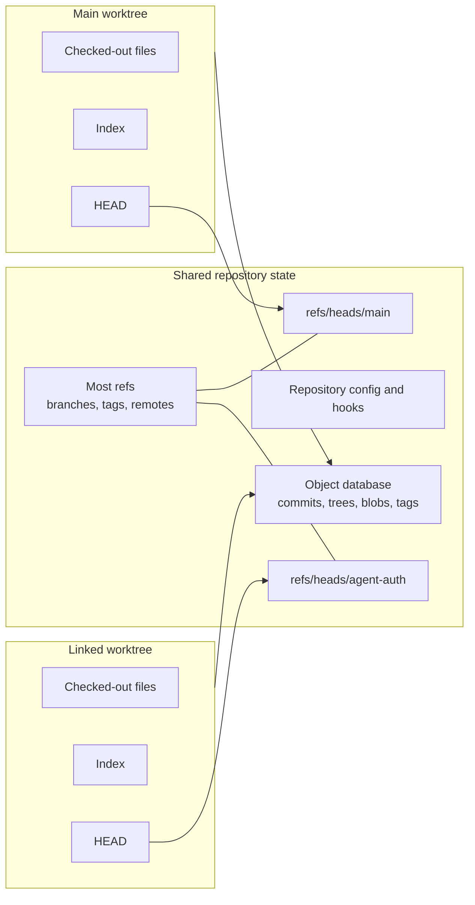
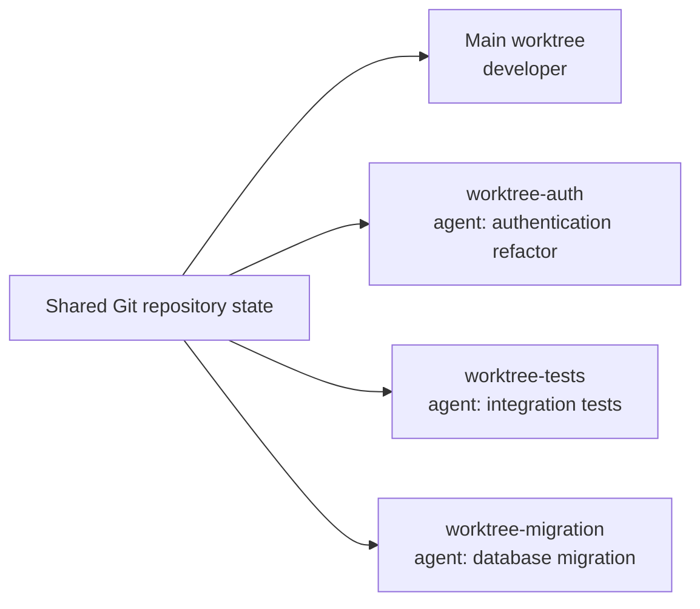

When I first saw a coding agent create a Git worktree, I treated it as another workflow detail. It made more sense once I started considering several agents editing the same repository at the same time.

Git shipped `git worktree` in 2015 so developers could keep multiple working trees attached to one repository. For a developer working serially, stashing, switching branches, or using another clone was often enough. Concurrent agents change that trade-off: each can search, edit, install dependencies, run commands, and create commits while other work continues.

**Coding agents have created a strong use case for an old Git abstraction.** Worktrees give concurrent workers separate source checkouts, but they do not isolate processes, ports, databases, credentials, networks, or external services. They are source-state infrastructure, not a sandbox.

## Why can't the agent simply create another branch?

Suppose you have unstaged changes in this file while an agent refactors authentication:

```text
src/auth.ts
```

You could create a branch in the directory you already have open:

```sh
git switch -c agent/auth-refactor
```

If Git can switch safely, your unstaged `src/auth.ts` change remains in the same directory. The branch name changed; the files did not move. You and the agent would still share mutable filesystem state, and returning to your original branch requires committing, stashing, discarding, or moving the agent's changes.

Now compare that with a worktree:

```sh
git worktree add ../agent-auth -b agent/auth-refactor HEAD
```

This creates a branch from the committed `HEAD` in `../agent-auth`. Your current checkout and unstaged edit remain untouched; the agent gets separate files and an index. Manual `git worktree add ... HEAD` does not copy uncommitted files. Agent tools may offer that transfer explicitly, but it is not Git's default behavior.

The difference is:

> A branch gives the work its own line of development. A worktree gives it its own directory.

Git's own glossary defines a branch through its moving tip ref and a working tree as the actual checked-out files plus local changes. Those are related concepts, but they are not the same object.

## The Git model behind the answer

At a simplified level, Git has these pieces:

- The **object database** stores commits, trees, blobs, and tags.
- **Refs** give names to objects. A local branch is normally a ref under `refs/heads/` that points to its current tip commit.
- `HEAD` identifies the branch or commit currently checked out in a particular worktree.
- The **index** is the staged representation Git will use to build the next commit.
- The **working tree** is the directory of checked-out files you can edit.
- A **linked worktree** is another working tree, plus private worktree metadata, attached to the same common repository.

Branch refs belong to the shared repository, not to individual folders. Each worktree has its own `HEAD`, which points to a shared branch ref or directly to a commit in detached-`HEAD` state.



The official [`git worktree` documentation](https://git-scm.com/docs/git-worktree) distinguishes shared repository state from per-worktree state:

| Shared by default | Separate per worktree |
|---|---|
| Object database | Checked-out files |
| Most refs, including normal branch and tag refs | `HEAD` |
| Repository configuration and remotes | Index/staging area |
| Hooks | Pseudorefs such as `MERGE_HEAD` |
| Most reflogs | `logs/HEAD` |
| The stash ref | Selected per-worktree refs and optional worktree config |

This sharing makes a worktree lighter than an independent clone and limits its isolation. New commit objects and branch updates are immediately visible to the common repository, and `refs/stash` gives all worktrees the same stash list.

On disk, a linked worktree does not contain a normal `.git` directory. It contains a `.git` text file pointing back to private metadata under the common repository, normally:

```text
.git/worktrees/<worktree-id>/
```

This directory contains the worktree's `HEAD`, index, and administrative links; the common Git directory keeps objects, refs, config, and hooks. Git exposes them as `$GIT_DIR` and `$GIT_COMMON_DIR`. Tooling should resolve internal paths with `git rev-parse --git-path` instead of assuming one `.git` directory.

Git normally refuses to check out one branch in two worktrees because both checkouts would move the same ref while holding separate files and indexes. Use separate task branches or detached worktrees.

## Worktrees existed long before coding agents

The `git worktree` command shipped experimentally in [Git 2.5](https://github.com/git/git/blob/v2.5.0/Documentation/RelNotes/2.5.0.txt) in July 2015. Git already had the contributed `git-new-workdir` script; the new implementation replaced its symbolic-link approach. [Git Rev News from July 2015](https://git.github.io/rev_news/2015/07/08/edition-5/) records that the feature first appeared as `git checkout --to` before moving to `git worktree add`.

The original problem was keeping more than one checked-out state. A production fix arriving midway through a refactoring might require this sequence:

```sh
git stash --include-untracked
git checkout release
# fix, test, and commit the urgent issue
git checkout feature
git stash pop
```

I use `git checkout` because [`git switch` arrived with Git 2.23 in 2019](https://github.com/git/git/blob/v2.23.0/Documentation/RelNotes/2.23.0.txt). I still use this workflow for serial work, but it moves one directory through several states, requires care with untracked files, and may produce conflicts during `stash pop`.

Another option was a second clone:

```text
project/
project-release/
project-hotfix/
```

A second clone has its own refs, index, configuration, and remote-tracking state, but it is another repository to fetch, configure, maintain, and delete. [Local clone optimizations](https://git-scm.com/docs/git-clone) reduce copying without preventing the clones from drifting.

GitHub's [Git 2.5 announcement](https://github.blog/open-source/git/git-2-5-including-multiple-worktrees-and-triangular-workflows/) described both alternatives and used a long-running test as an example. A worktree kept the unfinished checkout in place without another independent repository:

```sh
git worktree add ../project-hotfix -b hotfix main
```

`project/` and `project-hotfix/` now have separate files, indexes, and `HEAD`s while sharing objects and refs. Developers still chose different workflows, and someone working serially could reasonably use Git for years without needing a worktree.

## Agents changed the concurrency model

Coding agents differ from code completion because they act on the filesystem. Repository-level agents can [search for symbols](/posts/writing-code-coding-agents-can-navigate/), edit across modules, install dependencies, execute tests, inspect failures, retry, and create commits. The [SWE-agent paper](https://arxiv.org/abs/2405.15793) calls the environment and tools through which a model navigates, edits, and executes software an agent-computer interface.

One checkout can still work for an interactive session you supervise. Asynchronous and parallel agents create a different topology:

```text
before:
one developer → one mutable checkout → several tasks over time

after:
one developer + several agents → several tasks at the same time
```

Branch switching serializes a directory across tasks A, B, and C. Parallel workers need all three states at once. In one checkout, Agent A can format a file while Agent B reads it, or Agent B can replace a dependency while Agent C runs tests. Different branches do not prevent those collisions when the processes share files.

> For one serial worker, a worktree is often a context-switching convenience. For concurrent mutable workers, it can be a task ownership boundary.

**Parallelism only helps when the work can be decomposed.** The same discipline I described in [how experienced developers use coding agents](/posts/how-experienced-developers-actually-use-ai-agents-in-their-daily-work/) still applies: constrain the task, inspect the output, and keep human judgment in the loop.

## One repository, several workers

Consider our example change to an authentication system with three streams of work:



The developer keeps the foreground task in the main worktree. Separate worktrees hold the authentication refactor, integration tests, and migration.

Each worker can:

- inspect stable files and produce a separate diff;
- install directory-local dependencies and run scoped tests;
- stop, be inspected, or be discarded without deleting another worker's files.

The isolation ends at integration. Tests written against the old authentication interface can fail after the refactor, and a migration can merge cleanly while leaving a semantic mismatch. A human or coordinator still decides the order, resolves conflicts, runs the combined checks, and reviews the final behavior.

Worktrees prevent concurrent workers from overwriting the same local files. They do not make concurrent changes compatible.

## What current coding-agent tools actually do

I checked the official documentation below on August 16, 2026. Agent products change quickly, and "supports worktrees" does not mean "always uses worktrees."

| Tool or interface | Documented behavior | Isolation mechanism |
|---|---|---|
| Codex in the ChatGPT desktop app | Parallel Codex chats can run in managed worktrees. They start detached by default, and Codex can later create a branch or hand work back to the local checkout. | Git worktree |
| Codex cloud | A cloud chat creates a container, checks out the selected repository revision, runs setup, and executes the agent there. | Container plus checkout |
| Claude Code CLI and desktop | The CLI provides `--worktree`; desktop documentation describes parallel local sessions with automatic worktree isolation. | Git worktree for those local sessions |
| Cursor local agents | Cursor documents `/worktree`, and its multi-agent interface can run agents in worktrees or remote machines. | Git worktree or remote environment |
| Cursor cloud agents | Background/cloud agents clone the repository, work on a separate branch, and run in an isolated remote machine. | Clone plus VM |
| GitHub Copilot app | A session can run in a new working tree, the local repository, or a cloud sandbox. | User-selected working tree, local checkout, or sandbox |
| GitHub Copilot cloud agent | The cloud agent works on a branch inside an ephemeral GitHub Actions-powered development environment. | Ephemeral environment plus branch |

[OpenAI's Codex worktree documentation](https://developers.openai.com/codex/environments/git-worktrees/) describes managed chats in detached-`HEAD` worktrees under `$CODEX_HOME/worktrees` and a handoff to the foreground checkout. [Codex cloud creates a container](https://developers.openai.com/codex/cloud/environments/) instead, showing that one product can use different boundaries across interfaces.

[Claude Code exposes `--worktree`](https://code.claude.com/docs/en/cli-usage), while its [parallel-agent documentation](https://code.claude.com/docs/en/agents) treats worktrees as separate local checkouts. Cursor combines worktrees with remote machines in its [multi-agent releases](https://cursor.com/changelog/3-0); its [background-agent documentation](https://docs.cursor.com/background-agent) describes a GitHub clone in an isolated Ubuntu machine. The [Copilot app can start a session](https://docs.github.com/en/copilot/how-tos/github-copilot-app/agent-sessions) in a new working tree, the current repository, or a cloud sandbox, while the [Copilot cloud agent](https://docs.github.com/en/copilot/concepts/agents/cloud-agent/about-cloud-agent) uses an ephemeral GitHub Actions environment and a task branch.

Worktrees are one of several isolation strategies:

- local agents can use worktrees for separate checkouts without repeated clones;
- cloud agents can use clones or checkouts inside containers, VMs, sandboxes, or ephemeral CI environments;
- developers can create worktrees around tools that do not manage them;
- one product may use different strategies across interfaces.

The requirement is an independent place to work. A Git worktree is one implementation, not the definition of agent isolation.

## A better isolation model

This shorthand is useful but imprecise:

```text
branch → history isolation
worktree → working-directory isolation
container or VM → execution-environment isolation
```

"Isolation" overstates what a branch does because branches share the repository's objects and ref namespace. A branch is **a named line of development**, not an isolated history store.

I would use this model instead:

| Boundary | What it gives you | What it does not give you |
|---|---|---|
| Branch | A separate movable ref for commits and integration | Another directory, index, process space, runtime, or security boundary |
| Worktree | Separate checked-out files, `HEAD`, index, and directory-local untracked state | Separate object database, normal refs, hooks, processes, ports, databases, credentials, or network |
| Container | Configurable filesystem, process, dependency, user, and network boundaries | Automatic Git task separation, separate external services, or safety if mounted secrets and privileges are broad |
| VM or remote sandbox | A stronger machine/runtime boundary than a directory alone | Automatic correctness, review, conflict resolution, or isolation from services it can still access |
| Dedicated service resources | Separate database/schema, queue namespace, object-storage prefix, ports, or test account | Source checkout and Git history management |

A worktree is **source-state isolation**, not a security sandbox. Depending on its permissions, an agent may still read other files, see environment variables, bind shared ports, use the Docker daemon, change the same database, or reach production services.

Independent execution may require several layers:

```text
task branch
+ worktree
+ container or VM
+ isolated database/schema
+ unique ports and service namespaces
+ scoped credentials and network policy
```

Git integrates source history. Worktrees separate checked-out state. Containers or VMs constrain execution. Dedicated services separate mutable external state. Permissions and review constrain authority.

## Worktrees inside an agent harness

I use **harness** for the operational system around the model: instructions, task decomposition, tools, permissions, environment setup, verification, and stopping conditions. [How to Build a Reliable Coding-Agent Harness](/posts/how-to-build-a-reliable-coding-agent-harness/) covers that model in detail.

A worktree belongs inside that harness as an environment primitive:

```text
task
→ choose base revision
→ create branch or detached worktree
→ provision dependencies and local configuration
→ run the agent with scoped permissions
→ verify the task in that worktree
→ review the diff
→ integrate or discard
→ remove the worktree
```

One worktree can correspond to one task, chat, experiment, or background job. The harness can prepare, diff, test, inspect, and remove that directory, but it must still choose the base commit, provision ignored files, scope commands, define checks, and control integration. The [Hands-on Coding Assistants chapter on building a harness](/hands-on-coding-assistants/ch-04-building-your-harness/) develops those layers step by step.

## A practical workflow

Inspect registered worktrees:

```sh
git worktree list --verbose
```

This shows commits, branches, and locked or prunable entries. Scripts should use the machine-readable format:

```sh
git worktree list --porcelain
```

Create a task branch and worktree from the committed `HEAD`:

```sh
git worktree add ../my-feature -b feature/my-feature HEAD
```

The new directory has separate files, an index, and `HEAD`; the existing checkout does not switch branches.

Inspect the agent's state without entering its directory:

```sh
git -C ../my-feature status --short --branch
git -C ../my-feature diff --stat
git -C ../my-feature diff
```

After integrating or abandoning the task, remove the worktree:

```sh
git worktree remove ../my-feature
```

Git normally refuses to remove a dirty worktree. Removing one does not delete its branch, so delete the branch separately only after confirming it is merged or obsolete.

If a worktree directory was deleted manually, inspect its stale metadata:

```sh
git worktree prune --dry-run --verbose
```

Then prune those entries:

```sh
git worktree prune --verbose
```

`prune` cleans metadata for missing directories; it does not remove a live worktree. After moving a repository or worktree, use `git worktree repair` to reconnect the paths.

For agent tasks, I also record the task identifier, base commit, path, branch or detached commit, owner, required checks, and cleanup status. `git worktree list` is not a task manager.

## Where the abstraction leaks

Worktrees separate checked-out states. The surrounding tools and resources can still collide.

### Disk usage moves from Git objects to working files and dependencies

Worktrees share Git objects but materialize tracked files, including large generated assets or Git LFS content. Dependencies and outputs often cost more: each checkout may need `node_modules`, a Python virtual environment, Rust `target`, Gradle output, caches, generated clients, or test artifacts. [Codex's documentation](https://developers.openai.com/codex/environments/git-worktrees/) warns that per-checkout dependencies and caches can consume substantial disk space.

Shared directories or package-manager caches reduce setup time and disk use but weaken isolation. An upgrade by Agent A can change dependencies while Agent B tests.

### Ignored configuration does not appear automatically

A manual worktree contains tracked files, not ignored `.env` files, local certificates, IDE settings, or test data. Some agent tools use files such as `.worktreeinclude` to copy selected ignored files, but duplicating secrets is not a security control. Prefer generated non-production configuration, short-lived credentials, and explicit setup scripts.

### Processes, ports, and services are still shared

Two worktrees can still compete for port `3000`, one Redis database, a PostgreSQL schema, a Docker Compose project name, an emulator, or an external path. Assign unique ports and service namespaces, disposable databases or schemas, distinct Compose project names, and task-specific test accounts. Production access is an authority problem, not a Git-layout problem.

### Repository configuration, hooks, and stash are shared

Repository configuration, hooks, normal refs, and the stash normally apply to every worktree. Concurrent fetches, ref updates, maintenance, and custom hooks therefore touch common state. Git supports optional worktree-specific configuration, but it must be enabled explicitly. Treat "same repository" as shared state.

### IDEs and repository tooling may assume one checkout

IDEs may confuse language-server indexes, source-control views, breakpoints, or recent files across copies of one project. Scripts can hard-code the original path; monorepo caches may sit above the worktree root; watchers, scanners, daemons, and generators may key state by repository name. These harness assumptions need testing.

### Submodules and very large repositories require testing

The current [`git worktree` documentation](https://git-scm.com/docs/git-worktree) describes multiple checkout support as experimental and submodule support as incomplete. Test create, update, move, and cleanup operations before automating a submodule-heavy repository.

For large monorepos, a full checkout and dependency install may cost more than a small task. Sparse checkout, cached environments, long-lived worktrees, or remote sandboxes may fit better.

### Cleanup is part of the lifecycle

Manual deletion can leave `.git/worktrees/<id>` metadata; moving a worktree outside Git can break its paths; branches remain after removal. Define retention, ownership, dirty-state checks, recovery, and the difference between remove, archive, prune, and repair. Disposable must still be recoverable when needed.

## Why are developers talking about worktrees now?

I could not find credible longitudinal data showing that developers use Git worktrees more today than five years ago. Search interest, social posts, and product announcements do not measure adoption. What we can observe is a change in the tools.

Codex and Claude Code document worktree-backed parallel sessions. Cursor exposes worktrees alongside remote machines. GitHub Copilot offers working-tree and cloud-sandbox choices. Several cloud agents use ephemeral containers or VMs when a local worktree is insufficient.

The 2026 preprint [Effective Strategies for Asynchronous Software Engineering Agents](https://arxiv.org/abs/2603.21489) studies a related architecture. CAID combines dependency-aware delegation, isolated workspaces, branches, commits, merges, and executable tests, and reports gains over single-agent baselines on two long-horizon benchmarks. That supports one orchestration design, not a claim that every task needs multiple agents or that worktrees alone produced the gains.

The evidence supports **relevance**, not measured adoption. A developer supervising several agents has more mutable actors and active filesystem states than one developer switching branches. Worktrees address that concurrency pressure with stable, inspectable source state.

## When I would use worktrees for agents

I use a task worktree when an agent edits asynchronously, my foreground checkout must remain untouched, several agents run concurrently, or I want a task-level diff that can be discarded as a unit.

I stay in the current checkout for supervised pairing, read-only research, or a change smaller than the setup cost.

I add a container, VM, or remote sandbox for untrusted commands, dependency conflicts, OS requirements, or process and network boundaries. Tests that mutate databases, queues, object storage, or external accounts also need isolated service resources.

I reduce parallelism when tasks overlap heavily. Three worktrees do not help if three agents continually modify the same interfaces; they only postpone the collision until integration.

## Conclusion

Git worktrees provide separate files, indexes, and `HEAD`s without creating independent repositories. That makes them a practical task boundary when humans and agents edit concurrently.

They remain a source-state boundary. Processes, ports, databases, secrets, networks, permissions, verification, and integration need separate controls. A worktree can stop Agent A from overwriting Agent B's files; it cannot prove that either agent built the right thing.

More isolated streams also produce more output to understand and combine. That is the review problem I discuss in [Code Review in the AI Era: We Need to Change](/posts/code-review-in-the-ai-era-we-need-to-change/). Worktrees make parallel work reviewable. They do not perform the review.

## References

- Git project. [Git 2.5 release notes](https://github.com/git/git/blob/v2.5.0/Documentation/RelNotes/2.5.0.txt).
- Git project. [Git 2.23 release notes](https://github.com/git/git/blob/v2.23.0/Documentation/RelNotes/2.23.0.txt).
- Git project. [`git worktree` documentation](https://git-scm.com/docs/git-worktree).
- Git project. [`git clone` documentation](https://git-scm.com/docs/git-clone).
- Git project. [Git glossary](https://git-scm.com/docs/gitglossary).
- Git project. [Git repository layout](https://git-scm.com/docs/gitrepository-layout).
- Git Rev News. [Edition 5, July 8, 2015](https://git.github.io/rev_news/2015/07/08/edition-5/).
- Haggerty, M. [Git 2.5, including multiple worktrees and triangular workflows](https://github.blog/open-source/git/git-2-5-including-multiple-worktrees-and-triangular-workflows/). GitHub Blog, 2015.
- OpenAI. [Git worktrees in Codex](https://developers.openai.com/codex/environments/git-worktrees/).
- OpenAI. [Codex cloud environments](https://developers.openai.com/codex/cloud/environments/).
- Anthropic. [Claude Code CLI reference](https://code.claude.com/docs/en/cli-usage).
- Anthropic. [Run agents in parallel](https://code.claude.com/docs/en/agents).
- Anthropic. [Claude Code desktop](https://code.claude.com/docs/en/desktop).
- Cursor. [Cursor 3: New Cursor Interface](https://cursor.com/changelog/3-0).
- Cursor. [Background agents](https://docs.cursor.com/background-agent).
- GitHub. [Working with agent sessions in the GitHub Copilot app](https://docs.github.com/en/copilot/how-tos/github-copilot-app/agent-sessions).
- GitHub. [About GitHub Copilot cloud agent](https://docs.github.com/en/copilot/concepts/agents/cloud-agent/about-cloud-agent).
- Yang, J., Jimenez, C. E., Wettig, A., Lieret, K., Yao, S., Narasimhan, K., & Press, O. [SWE-agent: Agent-Computer Interfaces Enable Automated Software Engineering](https://arxiv.org/abs/2405.15793). NeurIPS, 2024.
- Geng, J., & Neubig, G. [Effective Strategies for Asynchronous Software Engineering Agents](https://arxiv.org/abs/2603.21489). arXiv preprint, version 2, 2026.
