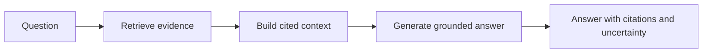

A language model is trained once and then frozen. It can write fluent text about veterinary medicine in general, but it knows nothing about Luna, the specific cat whose vaccination card was uploaded to your clinic last week. Ask it "what vaccines has Luna received?" and it will produce a confident, plausible, and entirely invented answer.

In most applications, an invented answer is annoying. In a veterinary clinic, it is dangerous. This chapter explains why agents need Retrieval-Augmented Generation (RAG), and why the need is sharpest exactly where the stakes are highest.

## The problem: a model does not know your data

Three properties of a trained model collide with the needs of a clinic:

1. **It is frozen in time.** The model does not contain last week's lab report, today's tutor note, or this morning's weight measurement.
2. **It cannot separate what it knows from what it is guessing.** Without grounding, a fluent guess and a fact look identical in the output.
3. **It has no provenance.** Even when it is right, it cannot tell you which document the answer came from.

A veterinary team cannot act on an answer that has no source and no way to be checked. "Luna is due for her rabies booster" is only useful if you can point to the record that says when the last one was given.

## The concept: retrieve, then generate

RAG adds a step before generation. Instead of asking the model to answer from memory, we first retrieve relevant evidence from a trusted store, then ask the model to answer **using only that evidence**, with citations.



The model's job changes from "recall facts about veterinary medicine" to "read these specific documents and summarize what they say." That is a much narrower, safer task, and it is one we can verify.

## The veterinary scenario

A tutor asks the clinic's assistant: "What vaccines has Luna received?"

Without retrieval, the model guesses from training-data priors about cats in general. With retrieval, the system first finds Luna's actual documents:

```text
[1] Luna vaccination card (2025-03-15): Vaccination record for Luna.
    Rabies vaccine administered on 2025-03-15.
```

Then it answers from that evidence and cites it: "Luna received a rabies vaccine on 2025-03-15 [1]." If no record exists, the correct answer is "no vaccination records were found," not a fabricated history. In VetSupport, that is exactly what the `ask` command does, and you will build it over the next modules.

## Why this matters most in a sensitive domain

The safety boundary of this series is that the agent must not diagnose, prescribe, or replace a veterinarian. RAG is what makes that boundary enforceable:

- **Grounding** keeps the answer tied to real records instead of invented ones.
- **Citations** let a veterinarian verify every claim against its source.
- **Uncertainty** becomes honest: "no records found" is a valid, safe answer.
- **Provenance** lets you enforce access control, because every piece of evidence has an owner and a source.

An agent that retrieves before it answers can be audited. An agent that answers from memory cannot.

## Risks RAG does not solve on its own

Retrieval is necessary but not sufficient. It introduces its own failure modes that the rest of the series addresses:

- Retrieving the wrong evidence produces a confident, well-cited, wrong answer.
- Documents are untrusted input and can contain injected instructions.
- Retrieving a document the user is not allowed to see is a privacy breach.
- Citations can be fabricated unless the system verifies them.

We will treat each of these as an engineering problem with a concrete defense, not as a reason to avoid RAG.

## Checklist

- The agent answers from retrieved evidence, not from model memory.
- Every factual claim can be traced to a source document.
- "No evidence found" is an allowed and expected answer.
- Retrieval respects who is allowed to see what.

## Exercise

Write down three questions a tutor or a veterinarian might ask about a specific pet. For each one, note what document or record would have to be retrieved to answer it, and what the safe answer would be if that record did not exist. Keep this list; we will turn these into retrieval and evaluation cases later in the series.

---

**Next up**: [Ch 2 - The Classic RAG Pipeline](/hands-on-agentic-rag/ch-02-the-classic-rag-pipeline/) walks through ingestion, chunking, embedding, indexing, retrieval, and generation as concrete stages.
