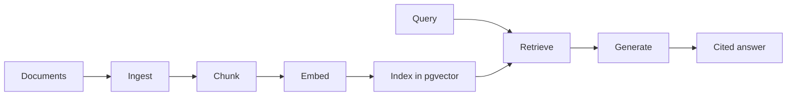

The previous chapter argued that agents need retrieval. This chapter makes retrieval concrete. The classic RAG pipeline is a sequence of stages, each with a clear input and output. Understanding the stages separately is what lets you debug the system later, because a bad answer almost always traces back to one specific stage.

We will map each stage to a VetSupport command so the pipeline is never abstract.

## The stages



| Stage | Input | Output | VetSupport command |
|---|---|---|---|
| Ingest | Local files with metadata | Stored documents | `ingest` |
| Chunk | Document body | Stable text chunks | `chunk` |
| Embed and index | Chunks | Vectors in pgvector | `index` |
| Retrieve | A query | Ranked evidence | `search` |
| Generate | Query plus evidence | Cited answer | `ask` |

## Ingestion: get trusted documents in

Ingestion reads local Markdown or text files, parses their frontmatter metadata, and stores them as documents tied to a pet. The metadata matters as much as the text: a vaccination record without a date is almost useless.

```sh
uv run python -m vetsupport ingest --pet-id <id> samples/luna/
```

In VetSupport, each document carries a `title`, `document_type`, `source`, and `document_date`. Ingestion is idempotent: re-running it skips documents whose IDs already exist, because the IDs are derived deterministically from the pet and the file. That property, idempotency, returns at every stage.

## Chunking: split text into retrievable units

A whole document is usually the wrong unit to retrieve. It is too large to fit cleanly into context and too coarse to rank precisely. Chunking splits the body into smaller passages.

```sh
uv run python -m vetsupport chunk --pet-id <id>
```

VetSupport chunks deterministically: the same document always produces the same chunks with the same stable IDs. This is not a detail. Deterministic chunking is what makes the index reproducible and the system debuggable. The next module is dedicated to chunking strategy, because chunking decisions quietly shape retrieval quality.

## Embedding and indexing: make text searchable by meaning

An embedding turns a chunk of text into a vector, a list of numbers that places similar meanings near each other in space. Storing those vectors in pgvector lets us find chunks by semantic similarity rather than exact words.

```sh
uv run python -m vetsupport index --pet-id <id>
```

The `index` command embeds only chunks that are not indexed yet, so it is idempotent like the others. We store the embedding model and dimension alongside each vector, because if the model changes, the old vectors must be rebuilt.

## Retrieval: find the relevant evidence

Retrieval embeds the query the same way, then finds the nearest chunks.

```sh
uv run python -m vetsupport search --pet-id <id> "vaccination history"
```

The output is evidence, not an answer: each result shows the document, the chunk, the date, the source, and a score. Returning evidence rather than a conclusion is deliberate. It lets us evaluate retrieval on its own, before any model writes a sentence.

## Generation: answer from the evidence

Only at the last stage does the model appear. It receives the query and the retrieved evidence and writes an answer that cites the evidence.

```sh
uv run python -m vetsupport ask --pet-id <id> "what vaccines has Luna received?"
```

The generation step is constrained: use only the provided evidence, cite it, and never diagnose or prescribe. Because retrieval already separated finding evidence from writing prose, a wrong answer can be diagnosed precisely, did retrieval miss the document, or did generation misuse it?

## Why separate the stages

The single most useful habit in RAG engineering is to treat these as distinct, inspectable stages. When an answer is wrong, you ask in order:

1. Was the document ingested at all?
2. Was it chunked into a sensible unit?
3. Was the chunk indexed?
4. Did retrieval rank it highly for this query?
5. Did generation use it correctly and cite it?

Each question maps to a stage and a command. A pipeline you can inspect stage by stage is a pipeline you can fix.

## Checklist

- Each stage has a clear input, output, and command.
- Ingestion, chunking, and indexing are idempotent.
- Retrieval returns evidence with scores and provenance, not a conclusion.
- Generation uses only retrieved evidence and cites it.

## Exercise

Run the five commands in order against the seeded `basic-clinic` scenario for Luna. After each one, inspect what changed: list the documents, show a document's chunks, then search and ask. Note which stage you would suspect first if the final answer were missing a vaccine you know is in the data.

---

**Next up**: [Ch 3 - RAG Is Not Just a Vector Database](/hands-on-agentic-rag/ch-03-rag-is-not-just-a-vector-database/) shows why different questions need different retrieval sources.
