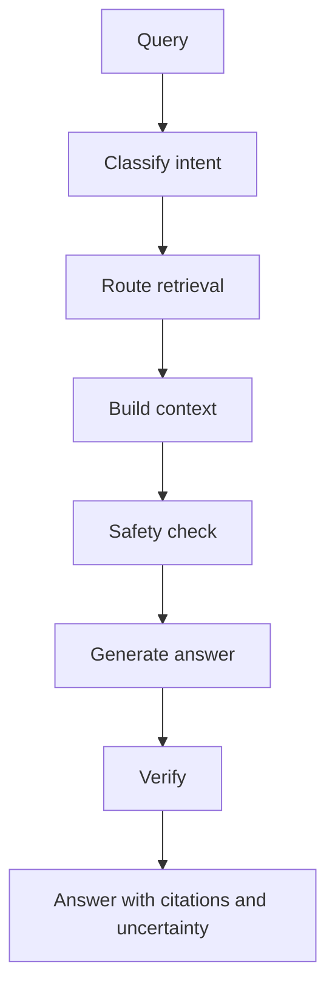

Simple RAG is a fixed pipeline: every query runs the same retrieval, builds the same kind of context, and generates an answer. It works until the questions stop looking alike. "What vaccines has Luna received?" and "Is my cat going to be okay?" should not be handled by the same blind vector search. The first needs a record lookup. The second needs a safety response and a referral, not a retrieval at all.

Agentic RAG closes that gap by giving the agent decisions to make.

## What makes RAG "agentic"

An agent adds judgment around retrieval. Instead of one fixed path, it decides:

- **Whether** to retrieve at all. An emergency or a general-education question may not need a document lookup.
- **What** to retrieve. The query determines which evidence is relevant.
- **Where** to retrieve from. Vector, keyword, SQL, graph, or a curated source.
- **Whether the answer is good enough.** It can verify citations and surface uncertainty before responding.



Each box is a decision or a check, not just a transformation. That is the difference from simple RAG.

## The reference architecture

The series builds toward this agent shape, which you will recognize in VetSupport's `ask` command:

```text
User
  -> Intent classification
  -> Retriever routing (vector / keyword / SQL / graph / curated)
  -> Context building
  -> Safety layer
  -> Answer generation
  -> Verification (citations, uncertainty)
  -> Response
```

You do not need all of it at once. We add one capability per module, and the local harness lets you run the agent after each addition and watch its behavior change.

## Why an agent, and why not always

Agentic RAG is more powerful and more expensive. Every decision the agent makes is a place where it can decide wrong, and every extra step costs latency and tokens. The guidance for this series:

- Use an agent when questions are varied, sources differ, and safety matters. A veterinary assistant qualifies.
- Keep each decision explicit and observable, so a wrong route is visible in a trace rather than hidden in a prompt.
- Prefer deterministic checks at the boundaries. Safety and citation verification should be code, not a hopeful instruction in a prompt.

An agent that cannot explain why it retrieved what it retrieved is harder to operate than a simple pipeline. We make the decisions explicit precisely so they can be debugged and evaluated.

## Decisions as graph nodes

VetSupport implements the agent as a small LangGraph graph where each decision is a node: classify intent, route and run retrieval, generate, verify. Modeling decisions as nodes gives two things for free. First, observability: each node becomes a span in a trace, so you can see the route the agent took. Second, testability: each decision can be tested in isolation, like asserting that "what vaccines has Luna received?" routes to a vaccine-history intent.

```sh
uv run python -m vetsupport ask --pet-id <id> --trace "what vaccines has Luna received?"
```

With tracing on, the run shows one span per decision. The intent, the retrieval mode, the evidence count, and the safety decision are all visible. That visibility is what turns "the agent did something" into "the agent classified this as a vaccine-history question, used keyword search, found one document, and judged it safe."

## The safety boundary, restated as architecture

Agentic RAG does not loosen the safety rule; it enforces it structurally. The safety layer sits before answer generation, so an emergency question is escalated rather than answered with retrieved trivia. The verification step sits after generation, so an answer with fabricated citations is caught. The agent's freedom to decide is bounded by checks it cannot skip.

## Checklist

- The agent decides whether, what, and where to retrieve.
- Each decision is explicit, observable, and testable.
- Safety and verification are deterministic checks, not prompt suggestions.
- The agent's behavior can be explained from a trace.

## Exercise

Sketch the decisions your own assistant would need for the three questions from Chapter 1. For each question, decide whether it needs retrieval, which source it should use, and what the safety layer should do. Compare your sketch to the reference architecture above. You have just designed the first version of an agent router, which Module 4 implements.

---

**Next up**: [Ch 5 - Ingesting Sensitive Documents](/hands-on-agentic-rag/ch-05-ingesting-sensitive-documents/) starts Module 2 by getting real, messy, sensitive documents into the system safely.
