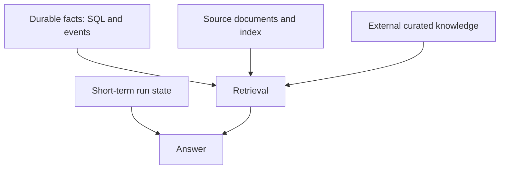

"Give the agent memory" is a request that hides four different problems. The conversation's working state, the clinic's durable facts, the original documents, and general veterinary knowledge are all "memory" in casual speech, but they live in different places, last for different durations, and fail in different ways. Conflating them produces agents that either forget what they just retrieved or remember things they were never supposed to store.

This chapter separates the kinds of memory an Agentic RAG system needs.

## Four kinds of memory

| Memory | What it holds | Where it lives | Lifetime |
|---|---|---|---|
| Short-term run state | The current question, evidence, safety status | The agent's state object | One run |
| Durable facts | Pets, events, dates, weights, medications | Relational database and event store | Long-term |
| Source documents | Original files and their chunks and vectors | Storage and the index | Long-term |
| External knowledge | General, curated veterinary references | Curated sources | Long-term |

## Short-term memory: the run state

While the agent answers one question, it carries a working state: the query, the chosen intent and retrieval mode, the retrieved evidence, the safety assessment, the draft, and the verified citations. In VetSupport this is the LangGraph agent's state, passed from node to node and discarded when the run ends.

Short-term memory should be explicit and small. Hiding important behavior inside one giant state blob makes the agent unobservable. Keeping the run state structured is what lets each step be traced and tested, as you saw with `ask --trace`.

## Durable facts: the database and event store

The clinic's real memory is its structured data: which pets exist, what events happened, what the weights and dates are. This belongs in the relational database, queried with SQL, not embedded into vectors. Durable facts are authoritative and exact. When a question is about a date, a count, or a current value, the agent should consult durable facts, not a fuzzy passage.

This is also where history lives. An event store of dated clinical events lets the agent build timelines and reason about change over time, which embeddings cannot do.

## Source documents: storage and index

The original documents and their chunks and vectors are a third kind of memory. They answer passage-style questions and provide the text that becomes citations. They are long-lived but rebuildable: if the chunking strategy or embedding model changes, the index is regenerated from the stored documents. Treating the index as a derived, rebuildable artifact, and the documents as the source of truth, keeps the system maintainable.

## External knowledge: curated sources

General questions ("what is recommended after a vaccination?") should not be answered from a specific pet's records, and they should not be answered from the model's unsourced memory either. They belong to a separate store of curated, trusted veterinary references. Keeping external knowledge separate from a pet's private records is both a quality decision and a safety one: it prevents general advice from being dressed up as personalized, and it keeps private data out of general answers. The education agent in Module 6 is built entirely on this distinction.

## Why the separation matters

Each kind of memory has a different failure mode and a different governance need:

- Short-term state leaks if it is logged carelessly, so traces record IDs and counts, not raw text.
- Durable facts must be access-controlled, because they are private to a pet and clinic.
- The index must be rebuildable, because models and chunking change.
- External knowledge must be sourced and kept apart from private records.

An agent that treats all memory as one bucket cannot satisfy these different requirements at once.

## Checklist

- Run state is explicit, structured, and discarded after the run.
- Durable facts live in the database and are queried, not embedded.
- The index is a rebuildable artifact derived from stored documents.
- External knowledge is curated, sourced, and separated from private records.

## Exercise

For each of the three questions you wrote in Chapter 1, decide which kind of memory should answer it. Then identify one question that would require combining two kinds, for example a passage from a document plus a date from the event store. That combination is exactly what the agent's context builder assembles in Module 4.

---

**Next up**: [Ch 9 - Semantic, Lexical, and Hybrid Search](/hands-on-agentic-rag/ch-09-semantic-lexical-hybrid-search/) opens Module 3 by building the retrieval modes VetSupport uses.
