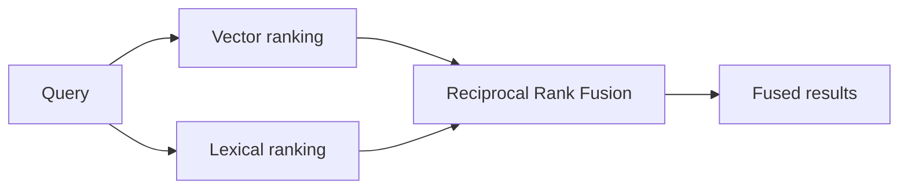

Module 1 argued that RAG is more than vector search. This module builds the retrieval modes that prove it. We start with the three text-retrieval strategies every serious RAG system needs: semantic search, lexical search, and the hybrid that fuses them. VetSupport implements all three behind one `search` command, so you can compare them on the same data.

## Semantic search: retrieve by meaning

Semantic search embeds the query and finds chunks whose vectors are nearest. It excels when the user's words differ from the document's words but the meaning matches: "shots" finds "vaccine," "throwing up" finds "vomiting."

```sh
uv run python -m vetsupport search --pet-id <id> --mode vector "vaccination history"
```

On PostgreSQL, VetSupport ranks with the pgvector cosine-distance operator. The strength of semantic search is recall of meaning; its weakness is precision on exact terms, because everything *about* a topic looks similar.

## Lexical search: retrieve by exact terms

Lexical search matches the actual words, using PostgreSQL full-text search. It excels exactly where semantic search struggles: a drug name, a code, or "rabies" specifically rather than vaccines in general.

```sh
uv run python -m vetsupport search --pet-id <id> --mode lexical "rabies"
```

VetSupport builds the query so that terms are combined permissively, meaning a single unmatched word does not drop the whole result. Lexical search is precise on terms and blind to synonyms. That blindness is the reason we do not stop here.

## Hybrid search: fuse the two rankings

The two modes fail in opposite directions, which is exactly why combining them works. Hybrid search runs both and fuses the rankings. VetSupport uses Reciprocal Rank Fusion (RRF): each result scores by its rank in each list, and the fused score rewards chunks that rank well in either.

```sh
uv run python -m vetsupport search --pet-id <id> --mode hybrid "vaccination history"
```



RRF needs no score calibration between the two systems, because it fuses ranks, not raw scores. That makes it a robust default, and it is why hybrid is VetSupport's default mode.

## When each mode wins

| Question | Best mode | Why |
|---|---|---|
| "throwing up after new food" | vector | wording differs from the record |
| "rabies" | lexical | exact term must match |
| "vaccination history" | hybrid | benefits from both meaning and the term |

The scores from different modes are not comparable to each other; each mode reports its own native score. Compare results within a mode, not across modes.

## Filter before you rank

All three modes filter by pet first, then rank. Filtering by metadata before ranking is what keeps retrieval both correct and cheap: a pet's answer never includes another pet's chunks, and the ranker never wastes work on irrelevant data. As your data grows, more filters belong here: date ranges, document types, and permitted sources, all applied before the ranking step.

## Checklist

- Semantic, lexical, and hybrid modes are all available.
- Hybrid fuses ranks, not raw scores, so no calibration is needed.
- Scores are only compared within a single mode.
- Every mode filters by owner before ranking.

## Exercise

Index Luna's documents, then run the same query in all three modes and compare the top result and its score. Find one query where lexical clearly beats vector, and one where vector clearly beats lexical. Confirm that hybrid does at least as well as the better of the two on both. You have just run a miniature retrieval evaluation, which Module 5 formalizes.

---

**Next up**: [Ch 10 - Reranking and Context Building](/hands-on-agentic-rag/ch-10-reranking-and-context-building/) turns ranked results into a small, ordered, cited context.
