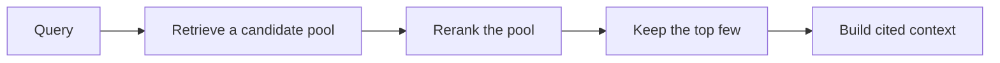

Retrieval gives you a ranked list of candidate chunks. That list is not yet a context. Handing the model twenty loosely relevant chunks produces a vague, expensive answer that buries the one fact that mattered. The job between retrieval and generation is to shape the candidates into a small, ordered, cited context. That is what reranking and context building do.

## The goal: small, relevant, ordered, cited

A good context has four properties:

- **Small.** A handful of strong chunks, not everything that matched.
- **Relevant.** Only evidence that bears on the question.
- **Ordered.** The most useful evidence first, where the model attends most.
- **Cited.** Each piece carries a marker so the answer can reference it.

More context is not better context. Beyond a point, extra chunks dilute the signal, raise cost and latency, and increase the chance the model anchors on something irrelevant.

## Reranking: fusion as a first reranker

Reranking reorders candidates to put the best evidence first. VetSupport's hybrid mode already performs a lightweight rerank: Reciprocal Rank Fusion combines the vector and lexical rankings into a single order that rewards agreement between them. For many clinic questions, that fused order is good enough, and it costs nothing extra.

When fusion is not enough, a dedicated reranker, often a cross-encoder model that scores each query-chunk pair directly, can reorder the top candidates more precisely. It is more accurate and more expensive, so it is applied only to a small candidate pool, never to the whole index. The pattern is always the same: retrieve broadly and cheaply, then rerank a small pool precisely.



## Context building: assemble and number

Context building takes the reranked top chunks and turns them into numbered evidence the model can cite. VetSupport assigns each chunk a marker and presents it with its title, date, and source:

```text
[1] Luna vaccination card (2025-03-15): Vaccination record for Luna. Rabies vaccine administered on 2025-03-15.
[2] Luna weight history (2026-01-10): Luna weight record: 4.2kg on 2025-10-10, 4.4kg on 2026-01-10.
```

The markers are the contract between retrieval and the answer. When the model writes "Luna received a rabies vaccine [1]," the `[1]` points back to a real, traceable chunk.

## Verification closes the loop

A citation is only worth something if it points to evidence that actually exists. VetSupport verifies citations after generation: it extracts the markers the model used and keeps only those that match real evidence. A model that invents `[9]` when only four chunks were provided gets that citation dropped, and the gap is visible.

```sh
uv run python -m vetsupport ask --pet-id <id> "what is the vaccination history?"
```

The answer shows only verified citations. This is the difference between a system that *claims* to cite and one that *proves* it. Verification turns citations from a stylistic flourish into an enforced property.

## The limit, and what overflows

Because context must stay small, retrieval and generation always operate under a limit on how many chunks enter the context. When more evidence is relevant than fits, the right response is not to overflow the context but to surface that limit: answer from the strongest evidence and note that more records exist. Honest partial answers beat bloated ones.

## Checklist

- The context is small, relevant, ordered, and cited.
- Hybrid fusion provides a cheap first rerank; a model reranker is applied only to a small pool.
- Evidence is numbered so the answer can cite it.
- Citations are verified against real evidence after generation.

## Exercise

Ask a question that matches several of a pet's documents with a small evidence limit, then with a larger one. Observe how the answer and its citations change. Then imagine the model citing a marker that was not in the context, and confirm from the verification step why that citation would not appear in the output.

---

**Next up**: [Ch 11 - RAG with Structured Data](/hands-on-agentic-rag/ch-11-rag-with-structured-data/) retrieves dates, counts, and current state with SQL instead of embeddings.
