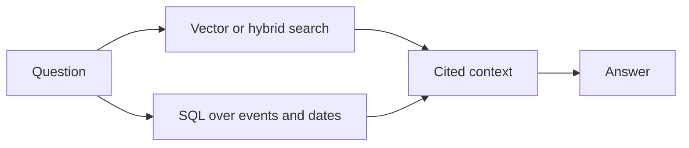

Embeddings approximate. For "summarize the consultation note," approximation is fine. For "when is the rabies booster due?" approximation is a bug. Dates, counts, current values, and ordered histories are structured facts, and structured facts deserve structured retrieval. This chapter brings SQL into the RAG architecture as a first-class retriever.

## Where embeddings are the wrong tool

A vector index cannot reliably answer:

- "When was the last vaccine?" (a maximum date)
- "How many consultations this year?" (a count with a date filter)
- "What is the current weight?" (the most recent value)
- "List events in order." (a sorted sequence)

These questions have exact answers that live in columns and rows. Embedding them throws away the precision that makes them useful. The fix is not a better embedding model; it is to query the structured data directly.

## VetSupport's structured store

VetSupport keeps structured facts in PostgreSQL: pets, tutors, documents with dates and types, and `vet_events` with an event date, type, source, and summary. Because these are real columns, the agent can ask exact questions with SQL: the latest date, a count in a range, the current value, the ordered history.

The timeline command is structured retrieval in action:

```sh
uv run python -m vetsupport timeline --pet-id <id>
```

```text
- 2025-03-15 [event:vaccination] Vaccination
- 2026-01-10 [event:weight_record] Weight Record
- 2026-02-14 [document:consultation_note] Luna Dental Follow-up
```

This output is exact and complete. It is produced by ordering structured dates, not by ranking vectors, so it never misses an event or invents one.

## Structured facts join back to provenance

Structured retrieval does not abandon citations. Each event and document carries its source, so a fact pulled from SQL can still point back to where it came from. "The last weight on record is 4.4 kg on 2026-01-10, from a clinic record" is both exact and traceable. Joining retrieved facts back to their source metadata is what keeps structured retrieval honest in a clinical setting.

## Combining structured and unstructured retrieval

Real questions often need both. "Summarize recent changes and tell me when the last vaccine was" wants a passage from documents and a date from the event store. The agent's context builder can assemble both: a cited passage from vector or hybrid search, and an exact date from SQL. The two retrievers answer the parts of the question each is best at, and the context carries both with provenance.



## Why SQL belongs in RAG

It is tempting to think of RAG as "the embedding part" and SQL as "the application part." That separation is the mistake this series keeps correcting. SQL is a retriever. It answers questions about the knowledge base, with provenance, just like vector search does. Treating SQL as part of RAG is what lets the agent give exact answers to exact questions instead of approximating everything.

## Checklist

- Dates, counts, current state, and ordered histories come from SQL.
- Structured answers remain exact and complete, not approximated.
- Structured facts still carry source provenance for citations.
- The agent combines structured and unstructured retrieval per question.

## Exercise

Using the seeded data, write down the SQL-style questions the timeline answers: the order of events, the latest weight, the vaccination date. Then write one question that needs both a document passage and a structured date. That combined question is the kind the pre-consultation agent in Module 4 assembles into a briefing.

---

**Next up**: [Ch 12 - GraphRAG for Relations, Events, and Timelines](/hands-on-agentic-rag/ch-12-graphrag-relations-events-timelines/) retrieves the connections between entities.
