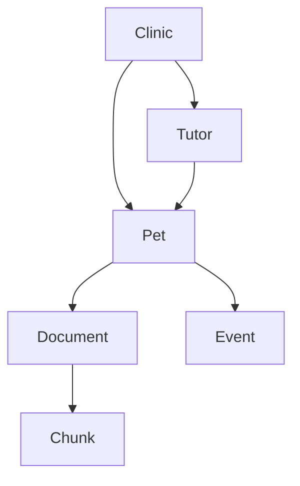

Vector search finds passages. SQL finds values. Neither is good at questions whose answer is a *path* through relationships: which pets share a tutor, which events led to a medication change, how a symptom connects to a later diagnosis discussion. These are graph questions, and graph retrieval traverses connections that are invisible to embeddings.

This chapter introduces GraphRAG as another retriever in the architecture, kept proportionate to the harness.

## When the answer is a relationship

Consider questions that are fundamentally about edges, not nodes:

- "Which pets belong to this tutor?"
- "Which clinic recorded this event?"
- "What events preceded this medication change, and in what order?"
- "Is there a chain connecting this symptom to a later consultation?"

The information needed is the connection itself. A vector search over passages will not reliably surface "these two pets share an owner," because that fact is not stated in any single chunk; it is implied by two rows pointing at the same tutor.

## The graph is already implicit

VetSupport's relational model already encodes a graph. Clinics own tutors and pets, tutors own pets, pets own documents and events, and events and documents are dated. Those foreign keys are edges.

You do not need a separate graph database to start. Traversing these relationships with SQL joins is graph retrieval: follow the edge from a pet to its tutor, then from the tutor to their other pets. The "graph" is a way of thinking about the queries, and it becomes a dedicated graph store only when traversals grow deep enough to justify one.

## Event sequences are graph-shaped

Timelines are a graph question in disguise. "What happened before the medication change?" is a traversal along dated events. VetSupport's event store already orders events by date, and reasoning about cause and sequence is a matter of walking that ordered chain. The agent can present "feeding change on the 18th, then vomiting on the 20th" as a sequence to discuss with the veterinarian, without ever asserting causation. Sequence is evidence; causation is a clinical judgment the agent must not make.

## Keeping graph retrieval safe

Graph traversals can cross boundaries that must not be crossed. Following an edge from a tutor to "all their pets" is fine for that tutor's own records, but a traversal must never become a way to reach another tutor's or another clinic's private data. Graph retrieval inherits the same access rule as every other retriever: every edge followed stays within what the requester is permitted to see. A traversal is a query, and queries are filtered by ownership before they return anything.

## When to reach for a real graph database

A dedicated graph database earns its place when traversals are deep, variable-length, or central to the product, for example "find any path connecting these two events across many hops." For VetSupport's scope, relational joins over a well-designed schema cover the relationship questions a clinic actually asks. The lesson is to recognize graph-shaped questions and route them to a traversal, not to adopt new infrastructure prematurely.

## Checklist

- Relationship questions are routed to traversals, not vector search.
- Foreign keys are treated as graph edges.
- Event sequences are presented as ordered evidence, never as causation.
- Traversals respect ownership and never cross privacy boundaries.
- A dedicated graph store is adopted only when traversals justify it.

## Exercise

List three questions about your data that are about connections rather than passages, such as shared owners or event sequences. For each, describe the path through the schema that answers it, and the ownership filter that keeps the traversal safe. You now have a small set of graph queries the router could dispatch.

---

**Next up**: [Ch 13 - Multimodal RAG](/hands-on-agentic-rag/ch-13-multimodal-rag/) handles scanned PDFs, images, tables, and OCR without losing provenance or trust.
