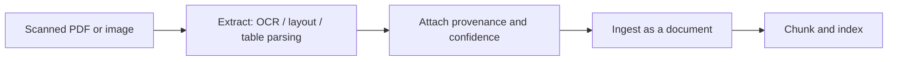

The documents in a real veterinary clinic are not clean Markdown. They are scanned lab reports, photos of a vaccination card, PDFs with tables, and the occasional blurry phone picture of a handwritten note. Multimodal RAG is the work of turning those artifacts into retrievable, citable evidence without losing provenance and without trusting the extraction blindly.

This chapter is conceptual: VetSupport ingests text today, and this is how the same pipeline extends to richer inputs.

## The extra stage: extraction

Multimodal inputs add one stage before ingestion: extraction. An image or PDF must become text and structure before it can be chunked and indexed.

Extraction can use OCR for scanned text, layout analysis for structure, table parsers for tabular results, and vision models for figures. Whatever the method, its output re-enters the same pipeline you already built: a document with metadata, then chunks, then an index.

## Extraction is lossy, so record confidence

OCR misreads. A "0" becomes an "8," a decimal point disappears, a column shifts. In a clinic, a misread lab value is not a cosmetic error. So extracted facts must carry a confidence signal and a link back to the original artifact. VetSupport already stores a `source` such as `scanned_pdf`, which flags that a document came from extraction and may need interpretation. Extending this, each extracted field can carry a confidence value, and low-confidence extractions can be marked for human review rather than presented as settled facts.

The safety boundary makes this non-negotiable: the agent does not interpret a lab value as a diagnosis, and it certainly does not do so on top of an uncertain OCR read. Uncertainty from extraction compounds with the uncertainty the agent must already surface.

## Provenance must survive extraction

When a chunk's text came from page 3 of a scanned PDF, the citation should be able to point there. Multimodal provenance is richer than text provenance: it includes the source file, the page or region, and the extraction method. Preserving that chain is what lets a veterinarian open the original scan and check the number themselves. An extracted fact whose original cannot be found is an unverifiable claim, and unverifiable claims do not belong in a clinical record.

## Extracted text is still untrusted input

A scanned document can carry an injection just as a typed one can, and OCR can even introduce instruction-like noise. Everything from Module 2 about treating documents as untrusted data applies with more force here, because the content passed through an imperfect machine on the way in. Extracted text is stored, flagged, and scanned for injection patterns, never executed or trusted.

## Tables deserve special care

A lab report is mostly a table, and a table flattened into a paragraph loses the alignment between a measurement, its unit, its reference range, and its date. Good multimodal extraction keeps tabular structure, so that "ALT 120 U/L (ref 10-100) on 2026-05-04" stays together as one fact rather than scattering across chunks. Where structure can be recovered, prefer storing it as structured data the SQL retriever can query exactly, and keep the narrative text for passage retrieval.

## Checklist

- Extraction is an explicit stage before ingestion.
- Extracted facts carry confidence and a link to the original artifact.
- Provenance includes the file, region, and extraction method.
- Extracted text is treated as untrusted and scanned for injection.
- Tabular data keeps its structure and prefers structured storage.

## Exercise

Take a sample lab-style document and write down which fields would need to survive extraction as structured data (values, units, ranges, dates) and which would remain narrative text. Then describe how a citation should point back to the original scan. You have just specified the provenance contract for a multimodal ingestion pipeline.

---

**Next up**: [Ch 14 - Agent Architectures with RAG](/hands-on-agentic-rag/ch-14-agent-architectures-with-rag/) opens Module 4 by assembling the retrievers into an agent.
