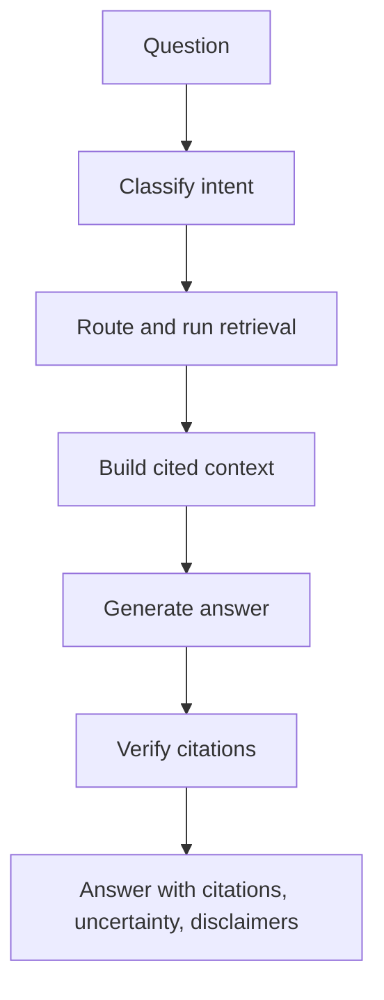

By now VetSupport has several retrievers and a safety boundary. Module 4 assembles them into an agent. The temptation is to write one big function that does everything. The discipline of this series is the opposite: model each decision as an explicit node, so the agent's behavior is observable, testable, and safe by construction.

This chapter presents the agent architecture and how VetSupport realizes it as a LangGraph graph.

## The reference shape



Each node has one job. Classification decides what kind of question this is. Routing picks the retriever and runs it. Context building numbers the evidence. Generation writes a grounded draft. Verification keeps only real citations. The safety assessment runs alongside, feeding the generation and the final response.

## Why explicit nodes

A single opaque function hides behavior. Explicit nodes expose it, and that exposure buys two concrete properties:

- **Observability.** Each node becomes a span in a trace, so you can see the exact path a question took.
- **Testability.** Each decision can be tested in isolation, such as asserting that a vaccine question classifies as a vaccine-history intent and routes to keyword search.

```sh
uv run python -m vetsupport ask --pet-id <id> --trace "what vaccines has Luna received?"
```

With tracing on, the run shows one span per node under a single `ask` run. "The agent answered" becomes "the agent classified this as vaccine history, used lexical retrieval, found one document, judged it safe, and verified one citation."

## State carries the run

The nodes communicate through an explicit state object: the query and pet, the chosen intent and retrieval mode, the safety assessment, the evidence, the draft, and the verified citations. Keeping state structured and small is what makes each node independently understandable. A node reads the part of the state it needs and writes the part it owns. Nothing important hides in a side effect.

## The agent does not loosen safety

Giving the agent decisions does not give it permission to skip the rules. The safety assessment is computed early and shapes the response. The verification node runs after generation and cannot be bypassed. The agent's freedom is bounded: it chooses *how* to retrieve and answer, never *whether* to honor the safety boundary. This is the structural meaning of "an agent that organizes information and never diagnoses."

## Start small, grow deliberately

You do not implement every node at once. VetSupport's graph began as classify, retrieve, generate, verify, and grew as the series added capabilities. The architecture supports more nodes, such as a dedicated context-ranking node or an external-knowledge branch, but each addition is justified by a need and made observable. An agent's complexity should track the questions it must answer, not the diagram's ambition.

## Checklist

- Each decision is a separate, explicit node.
- Nodes communicate through a small, structured state.
- Every node is observable as a span and testable in isolation.
- Safety and verification are nodes the agent cannot skip.

## Exercise

Run the `ask` command with `--trace` and read the span tree for two different questions, one vaccine question and one general question. Note where the paths differ. You are reading the agent's decisions directly, which is exactly the visibility the next chapters build on.

---

**Next up**: [Ch 15 - Routing Sources and Tools](/hands-on-agentic-rag/ch-15-routing-sources-and-tools/) decides which retriever each question should use.
