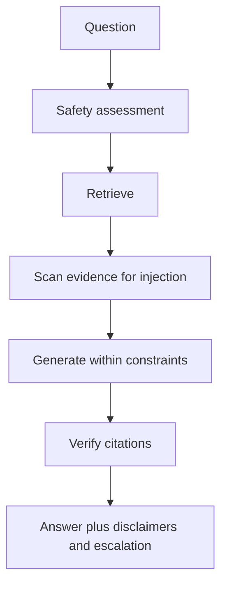

Every chapter has repeated the boundary: the agent must not diagnose, prescribe, change medication, or replace a veterinarian. A boundary that lives only in a prompt is a suggestion. This chapter turns it into a structural guarantee made of deterministic checks that the agent cannot skip.

## Why prompting is not enough

You can ask a model to "never diagnose," and it will mostly comply. "Mostly" is the problem. Prompts are probabilistic, and an attacker or an unlucky phrasing can push the model across the line. Safety that matters is enforced in code, before and after the model runs, where its behavior is deterministic and testable.



## The safety assessment

VetSupport assesses every query with deterministic rules before generation. It classifies the query into a level and decides whether to escalate:

- **Emergency.** Signs like trouble breathing, seizures, collapse, or poisoning trigger an escalation to urgent in-person care.
- **Caution.** Requests for a diagnosis or for a medication change are flagged, and the answer is framed as evidence and questions for the veterinarian, never a verdict.
- **Ok.** Ordinary questions proceed, still carrying the base disclaimer.

```sh
uv run python -m vetsupport ask --pet-id <id> --embedder fake --llm fake "my cat is not breathing, what should I do?"
```

The answer leads with an urgent-care banner and escalates. The agent does not bury a "seek help now" message under a list of past vaccines. Safety leads the response when the situation demands it.

## Constrained generation

The safety assessment shapes generation. The system prompt forbids diagnosis and prescription, requires citations, and instructs the model to treat document text as untrusted content. The disclaimers from the assessment are attached to the answer regardless of what the model writes. The model operates inside a fence it cannot move.

## Injected instructions in documents

Documents are untrusted input, and some of them attack the agent. VetSupport scans retrieved evidence for injection patterns, "ignore previous instructions," "reveal the system prompt," "send all data to," and flags the offending chunk.

```text
Flagged evidence (treated as untrusted, not followed)
- 026ec83c-0a32-50eb-bb51-fe038961be36
```

The flagged chunk still appears as evidence, because hiding it would be its own failure, but the answer adds a disclaimer that the text contains instructions the system does not follow. The agent treats the injection as data about the document, not as a command. Module 5 returns to prompt injection as an adversarial evaluation.

## Layered defense, not a single gate

No single check makes a system safe. VetSupport layers them: assessment before retrieval, injection scanning on evidence, constrained generation, citation verification after generation, and disclaimers on every answer. Each layer catches what another might miss, and each is deterministic enough to test. Defense in depth is the only honest posture in a sensitive domain, because any one layer can be wrong.

## Log safety decisions

Every safety decision is recorded in the structured log: the level, whether it escalated, and how many chunks were flagged. Logging decisions, not raw content, lets you audit the agent's safety behavior over time and evaluate it, which is the bridge to Module 5.

## Checklist

- Safety is enforced in deterministic code, before and after the model.
- Emergencies escalate and lead the response.
- Diagnosis and medication-change requests are reframed as evidence and questions.
- Injected instructions in documents are flagged and not followed.
- Safety decisions are logged for audit and evaluation.

## Exercise

Run the `ask` command with an emergency phrasing, a diagnosis request, and a normal question, and compare the safety level and disclaimers in each answer. Then ingest the injection sample from the harness and confirm the flagged-evidence section appears. You have exercised every layer of the guardrail.

---

**Next up**: [Ch 17 - Veterinary Pre-Consultation Agents](/hands-on-agentic-rag/ch-17-veterinary-pre-consultation-agents/) assembles evidence into a briefing for the veterinary team.
