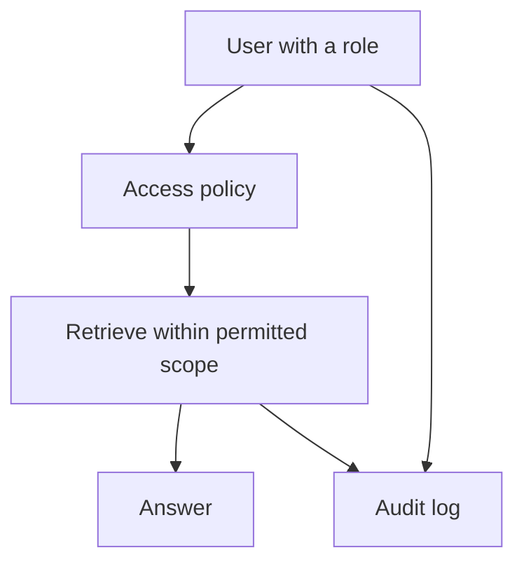

The pre-consultation agent serves a single consultation. An internal agent serves the whole clinic team: reception looking up an appointment, a veterinarian reviewing history, a technician checking pending items. The new requirement is not capability; it is access. Different roles may see different things, and every access must be auditable.

This chapter extends the architecture with role-based access and an audit trail.

## The new requirement: who is asking

So far, retrieval has filtered by pet. An internal agent must also filter by role. Reception may need appointment status but not a full lab history. A veterinarian needs clinical detail. A technician needs task lists. The question "what can be retrieved?" now depends on "who is asking?"

## Access control belongs in retrieval

The critical design rule from the security resource is that the model must not decide permissions. Access control is enforced in the retrieval layer, in code, before any evidence reaches the model. The agent cannot grant itself access by being persuaded to, because the filter runs below it.

VetSupport already filters retrieval by pet, which is the foundation. Role-based access extends the same idea: the retrieval query carries the requester's role and scope, and excludes anything outside it before ranking. A document the role may not see is never retrieved, never ranked, and never placed in context. It does not exist as far as that request is concerned.

## Roles map to scopes

A workable model assigns each role a scope of document types, sources, and actions:

| Role | Can retrieve | Cannot |
|---|---|---|
| Reception | appointments, basic pet info | full clinical history |
| Veterinarian | full clinical history, documents | other clinics' data |
| Technician | task lists, pending items | tutor-private notes |

These are example decisions, not universal rules. The point is that the scope is data the retrieval layer enforces, not a behavior the model is asked to respect.

## The audit trail

An internal tool that touches private records needs to record who accessed what. The structured logging you built for observability is the foundation of the audit trail: each request logs the requester, the role, the pet, and the scope of what was retrieved, recording IDs and counts rather than raw content. An audit trail answers "who saw this record, and when?" which is a question a clinic will eventually need to answer, whether for trust, governance, or a regulator.

## The agent still does not decide clinically

Adding roles does not change the safety boundary. An internal agent surfaces pending vaccines, locates documents, and summarizes previous consultations, all within the role's scope, and still never diagnoses or prescribes. It also surfaces what a role is allowed to do, making the boundaries of each role explicit in the output rather than implicit. Operational support and clinical judgment remain separate.

## Checklist

- Retrieval filters by role and scope, not only by pet.
- Access control is enforced in code, never decided by the model.
- Roles map to explicit scopes of types, sources, and actions.
- Every access is recorded in an audit trail of IDs and decisions.
- The agent stays within the safety boundary regardless of role.

## Exercise

Define three roles for a clinic and, for each, the document types and sources it may retrieve. Describe how the retrieval query would enforce that scope before ranking, and what the audit log entry would contain. You have just specified the access layer that turns the agent into a multi-role internal tool.

---

**Next up**: [Ch 19 - Evaluating RAG in Sensitive Domains](/hands-on-agentic-rag/ch-19-evaluating-rag-in-sensitive-domains/) opens Module 5 by measuring retrieval and safety separately.
