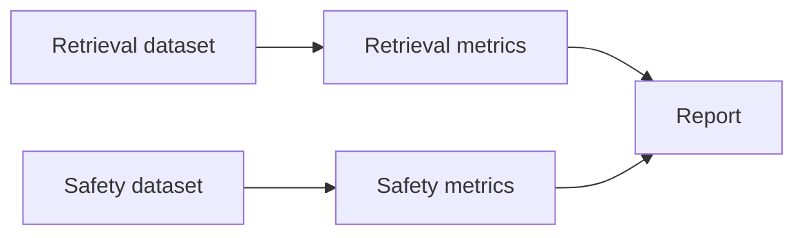

You cannot improve what you do not measure, and in a sensitive domain you cannot ship what you cannot measure. Module 5 makes VetSupport accountable. It starts with evaluation, because every later decision, a new model, a different chunk size, a changed prompt, should be judged against numbers, not vibes.

The central rule: evaluate retrieval quality separately from answer quality.

## Why separate the two

When an answer is wrong, there are two possible causes: retrieval failed to find the evidence, or generation misused the evidence it had. If you only measure the final answer, you cannot tell which. Measuring retrieval on its own isolates the first cause, so a regression points you to the right stage instead of leaving you guessing.



## Retrieval evaluation

A retrieval dataset is a set of labeled queries: for each query, which document should appear in the results. The metrics are simple and meaningful:

- **Hit rate** (recall at k): did the expected document appear in the top results?
- **MRR** (mean reciprocal rank): how high did it rank?

VetSupport ships a reproducible evaluation that builds a fresh, deterministic database from the seed data and runs the labeled queries with the offline embedder, so the numbers do not depend on a network call or an API key:

```sh
uv run python -m vetsupport eval --dataset retrieval
```

```text
Retrieval evaluation
Cases: 4
Hits: 4
Hit rate: 1.00
MRR: 1.00
```

Reproducibility is the point. The same command gives the same numbers, so a change in the score means a change in the system, not in the weather.

## Safety evaluation

In a sensitive domain, safety classification is a quality dimension you must measure. A safety dataset labels queries with the expected level and whether they should escalate: an emergency phrasing must escalate, a diagnosis request must be cautioned, a routine question must pass.

```sh
uv run python -m vetsupport eval --dataset safety
```

```text
Safety evaluation
Cases: 5
Correct: 5
Accuracy: 1.00
```

If a prompt or rule change quietly stops escalating "not breathing," this number drops and the regression is caught before it ships. Safety that is not measured is safety you are hoping for.

## Evaluate before you change

The discipline is to run the evaluation before and after any change to prompts, retrieval, models, or safety rules. A change that improves one question can silently break three others, and only a dataset reveals that. Local datasets are enough for this series; you do not need hosted evaluation infrastructure to be rigorous. You need labeled cases and the habit of running them.

## Datasets grow from real failures

The best evaluation cases come from real misses. The questions you wrote in Chapter 1, the misrouted query from Chapter 15, the emergency phrasing that almost slipped through, each becomes a labeled case. Over time the dataset encodes everything the system has learned to get right, and it stops regressions from reintroducing old bugs.

## Checklist

- Retrieval and answer quality are measured separately.
- Retrieval uses hit rate and MRR over labeled queries.
- Safety classification is evaluated as its own dataset.
- Evaluation is reproducible and runs without external calls.
- Datasets grow from real failures.

## Exercise

Add one new retrieval case and one new safety case that reflect a question your own clinic data would face, then run the evaluations. Make a small change, a different chunk size or a tweaked rule, and run them again. Watch a number move, and decide whether the change was an improvement.

---

**Next up**: [Ch 20 - Observability, Tracing, and Debugging](/hands-on-agentic-rag/ch-20-observability-tracing-debugging/) makes the agent's behavior visible in production.
