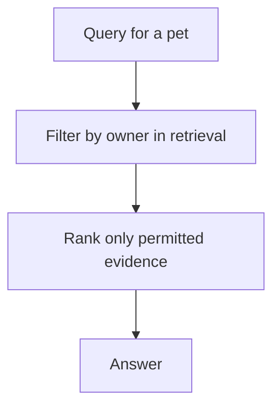

A veterinary clinic's records are private. The tutor's contact details, the pet's history, the clinic's notes, none of it should leak across boundaries or end up in a place it was never meant to be. Privacy in an Agentic RAG system is not a policy document; it is a set of enforced properties in the retrieval and telemetry layers. This chapter makes those properties explicit.

## Isolation is enforced in retrieval

The foundational privacy guarantee is that one pet's data never appears in another pet's answer. VetSupport enforces this by filtering every retrieval by pet before ranking. There is no path by which a query for Luna returns Bento's records, because the filter runs in code below the agent, and the agent cannot remove it.

This is the same mechanism that Module 4's internal agent extends to roles. Privacy and access control are the same idea applied at different granularities: filter retrieval by what the requester is permitted to see, in code, before ranking.

## The model never decides access

The most important governance rule bears repeating: the model does not decide who can see what. A persuasive prompt, an injected document, or an unlucky phrasing must never be able to widen access, and they cannot, because access is decided by the retrieval filter, not by the model's judgment. The model only ever receives evidence it was already allowed to receive.

## Telemetry is a privacy surface

Observability can quietly become a privacy leak. A trace that captures raw document text creates a second copy of private records in a system built for searching and retention. VetSupport's rule from Chapter 20, capture metadata, never content, is a privacy control as much as an observability one. The safest private data is the data you never copied into telemetry.

## Consent and purpose

Beyond enforcement, governance asks *why* data is used. Consent means a tutor agreed to their pet's records being processed for a stated purpose. Purpose limitation means those records are not quietly repurposed. For a learning harness these are design considerations rather than implemented features, but they shape the schema: recording the source and ownership of every document is what makes a future consent and purpose model possible. You cannot honor consent for data whose origin you did not track.

## Retention and deletion

A trustworthy system can forget. Retention limits how long data and telemetry are kept, and deletion means a tutor can have their pet's records removed. Because VetSupport keeps documents as the source of truth and the index as a rebuildable artifact, deletion has a clean story: remove the documents and their chunks and embeddings, and the index reflects the deletion on rebuild. Designing the index as derived, not authoritative, is what makes deletion tractable.

## Governance is built in, not bolted on

The properties in this chapter, isolation, code-enforced access, metadata-only telemetry, tracked provenance, rebuildable indexes, were decisions made early, in the schema and the retrieval layer. That is the lesson. Privacy and governance cannot be added convincingly at the end. They are consequences of how you stored the data and where you put the filter.

## Checklist

- Retrieval is filtered by owner and role, in code, before ranking.
- The model never decides access.
- Telemetry captures metadata, never raw content.
- Provenance is tracked to support consent and purpose limitation.
- The index is rebuildable, so deletion is tractable.

## Exercise

Confirm pet isolation: index two pets, ask a question about one, and verify the other's documents never appear in the citations. Then review a trace and confirm no raw record text is present. Finally, describe the steps a clean deletion of one pet's data would take, given that the index is derived from the documents.

---

**Next up**: [Ch 22 - Prompt Injection in Documents](/hands-on-agentic-rag/ch-22-prompt-injection-in-documents/) treats malicious document text as the adversarial threat it is.
