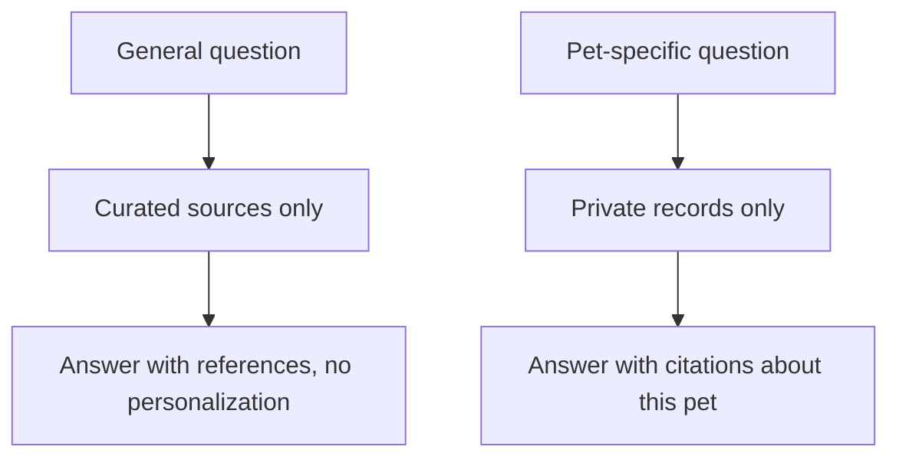

Not every question is about a specific pet. "What can cause vomiting in cats?" or "what general care is recommended after a vaccination?" are education questions. They deserve good answers, but answering them well requires a different design: curated sources instead of private records, references instead of citations to a pet's file, and a hard line against turning general information into personal advice.

This chapter designs the education agent and explains why its separation from the rest of the system is the whole point.

## A different kind of knowledge

The education agent does not retrieve from a pet's documents. It retrieves from a curated body of trusted veterinary references. That difference drives everything:

| | History / pre-consultation agent | Education agent |
|---|---|---|
| Source | A pet's private records | Curated public references |
| Output | Evidence about this pet | General information with references |
| Personalization | About one animal | About none |
| Risk | Privacy, wrong record | Generalizing into personal advice |

Mixing the two is the danger. General advice dressed up as personalized guidance is exactly the kind of "diagnosis by implication" the safety boundary forbids.

## Keep the stores separate

The architectural rule is strict separation. Curated education sources live in their own store, retrieved by their own path, and never co-mingled with a pet's records in the same context. This separation does two things at once. It keeps private data out of general answers, and it keeps general information from being attached to a specific animal as if it were a finding about that animal.

## References, not personal citations

The education agent cites trusted sources, the way a good article does, not a pet's file. Its answers say "in general" and point to references a tutor or a veterinary student can read. It explicitly separates general information from personal advice, and when a question drifts toward "what should I do about *my* pet," it redirects to a veterinarian rather than answering. The honest move is to name the boundary, not to step over it.

## Curation is a quality and safety decision

The value of the education agent is only as good as its sources. Curating trusted veterinary references, and excluding unreliable ones, is both a quality decision and a safety one. A confident answer built on a bad source is worse than no answer. The curation process, who selects sources, how they are vetted, how they are updated, is part of the system, not an afterthought.

## Extending VetSupport

VetSupport's main path focuses on a pet's records, but the education agent fits the same architecture. It is another retriever (over curated sources) behind another intent (general education) in the router from Module 4. The safety layer already routes general-education questions away from personal advice. Building it is a matter of adding a curated source store and an education intent, not redesigning the agent. That is the payoff of the routing architecture: new knowledge needs is a new source and a new route, not a new system.

## Checklist

- General questions use curated sources, never a pet's records.
- The two stores are kept strictly separate in retrieval and context.
- Answers cite references and never personalize into advice.
- Curation of trusted sources is treated as part of the system.
- The education agent is a new retriever and intent, not a new architecture.

## Exercise

List five general questions a tutor might ask that should not touch any pet's records. For each, decide what a trusted source would be and how the answer would stay general. Then describe the exact moment a question crosses from education into personal advice, and what the agent should do at that moment.

---

**Next up**: [Ch 28 - From Local Prototype to Real Product](/hands-on-agentic-rag/ch-28-from-local-prototype-to-real-product/) maps the path from the harness to a production system.
