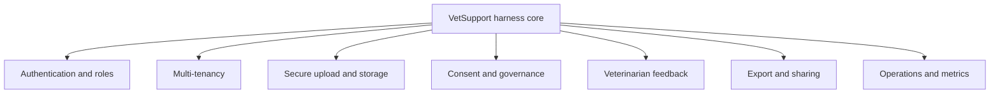

The whole series kept VetSupport a local agent harness on purpose. A harness makes every lesson reproducible: run a command, inspect the result, understand what changed. But a harness is not a product. This final chapter maps the path from the prototype you built to a real system, and it is honest about which problems the harness deliberately left out.

This is the one place the series steps beyond the local path, because the goal now is to see the whole road.

## What the harness deliberately skipped

The harness has no web layer, no users, no tenants, and no uploads from the outside world. That was a feature for learning and a gap for production. The core engineering, retrieval architecture, safety, citations, evaluation, observability, privacy isolation, is sound and carries forward. The product work is what wraps around it.

## The product concerns

| Concern | What changes |
|---|---|
| Authentication | Real users and roles replace a `--pet-id` flag. The role-based access from Module 4 becomes enforced identity. |
| Multi-tenancy | Many clinics share infrastructure with hard data isolation. The pet filter generalizes to a tenant filter. |
| Secure upload | Documents arrive from the internet, untrusted and possibly malicious. Ingestion validation and injection scanning become front-line defenses. |
| Storage | Original files live in object storage; the database holds structured facts and the index. The rebuildable-index design pays off here. |
| Consent and governance | Tutors consent to processing; retention and deletion become real features built on tracked provenance. |
| Veterinarian feedback | Professionals correct and rate answers, feeding the evaluation datasets from Module 5. |
| Export and sharing | Briefings export as PDF or Markdown and are shared with the team, with access controls. |
| Operations | Metrics, dashboards, alerts, and on-call turn the agent into a service you can run. |

## The core does not change; the edges grow

The reassuring part is how much carries over. Access control was already a retrieval filter, so authentication and multi-tenancy extend an existing mechanism rather than replacing it. Telemetry already captured metadata over content, so it is production-safe by design. The index was already a rebuildable artifact, so storage and deletion have a clean story. Safety and citation verification were already deterministic checks. The harness was built so that becoming a product means adding edges, not rebuilding the center.

## Feedback closes the loop

The most valuable thing a product adds is a feedback loop. When veterinarians correct an answer or flag a bad retrieval, those corrections become labeled cases in the evaluation datasets. The system that was static in the harness becomes one that improves with use, and improves measurably, because every correction is a new test. A product without a feedback loop is a prototype that happens to have users.

## Operate it like a service

A production agent is a service with availability, cost, and security requirements. The observability you built is the foundation: traces explain behavior, structured logs feed dashboards and alerts, and evaluation becomes a release gate that blocks a regression from shipping. Running the agent day to day, with budgets, SLOs, and runbooks, is its own discipline, and it rests on the instrumentation the harness already has.

## Where to go next

You now have a complete mental model and a working harness. The natural next steps are to point VetSupport at your own documents, expand the evaluation datasets with real questions, and add one production concern at a time, starting with whichever one your context demands first. The engineering you learned, retrieval as architecture, safety as code, evidence over conclusions, transfers far beyond veterinary clinics. Any domain where an agent must retrieve trusted knowledge and answer responsibly is the same problem in different clothes.

## Checklist

- The harness core, retrieval, safety, citations, evaluation, observability, carries forward unchanged.
- Authentication and multi-tenancy extend the existing access filter.
- Secure upload makes ingestion validation and injection scanning front-line defenses.
- Feedback from professionals feeds the evaluation datasets.
- The agent is operated as a service with metrics, alerts, and release gates.

## Conclusion

This series treated RAG as an architecture for knowledge access and Agentic RAG as the discipline of letting an agent make retrieval decisions reliably. You built VetSupport from an empty database to a cited, safe, evaluated, observable agent that organizes veterinary evidence and never pretends to be a veterinarian. The same patterns, the right source for each question, provenance everywhere, safety in code, evidence over conclusions, are what make an agent trustworthy in any sensitive domain. Take the harness, point it at a problem you care about, and keep the boundary that made it safe.

---

**Appendix**: [References](/hands-on-agentic-rag/ch-99-references/) collects the official documentation this series relies on.
