## Why you need a framework at all

Most developers adopt AI coding tools the same way: install the extension, accept a few suggestions, feel productive, and move on. No process. No criteria for when to use the tool or when to ignore it. No systematic way to evaluate output quality.

This works fine for trivial tasks. But the moment the stakes go up; production code, security-sensitive logic, multi-team codebases, "vibes-based" AI usage becomes a liability. You start accepting bad suggestions because they _look_ right. You stop reading diffs because "the AI wrote it." You accumulate technical debt silently, one accepted suggestion at a time.

The solution isn't to stop using AI. It's to use it _within a structure_ that keeps you in control.

---

## From PDCA to PDRC

If you've worked in manufacturing, quality engineering, or any organization influenced by lean/agile, you've probably seen **PDCA** — Plan, Do, Check, Act. It's one of the most widely adopted continuous-improvement cycles in the world, popularized by W. Edwards Deming in the 1950s (building on earlier work by Walter Shewhart in the 1930s).

PDCA works because it's simple, repeatable, and it assumes that _every_ process can be improved through deliberate iteration. It looks like this:

The cycle never stops. You plan the work, do the work, check the results against your plan, and act on what you learned — which feeds back into the next plan.

**PDRC is an adaptation of PDCA for a specific context: AI-assisted software development.**

The core insight is simple: when you work with an AI coding tool, _you are no longer the one doing_. You're delegating execution to a model. And because you didn't write the code yourself, _checking_ it requires more deliberate effort — the same kind of review you'd give to a junior developer's pull request, except the "junior" writes faster than any human and has no understanding of your business domain.

Here's how the two map:

| PDCA | PDRC | What changed and why |
|------|------|----------------------|
| **Plan** | **Plan** | Unchanged — define spec, scope, and acceptance criteria _before_ touching any tool |
| **Do** | **Delegate** | You're no longer the one writing every line. You choose the right AI tool, scope the task, and hand it off |
| **Check** | **Review** | Same spirit, but now you're reviewing _someone else's_ output — code you didn't write, decisions you didn't make |
| **Act** | **Correct** | Emphasizes iterative correction — re-prompting with better context, manual intervention, or knowing when to discard entirely |

The name changes aren't cosmetic. They reflect a fundamental shift in your role: from **executor** to **director**. You still need all the technical skill, in fact, you need _more_ judgment, not less, but you apply it differently.

```mermaid
graph LR
    P["🎯 Plan"] --> D["🤖 Delegate"]
    D --> R["🔍 Review"]
    R --> C["🔧 Correct"]
    C --> P
```

---

## Plan: define the work before you touch any tool

The most common mistake developers make with AI tools is starting with the tool. They open the chat, type a vague prompt, and hope for the best. This is the equivalent of starting to code before you understand the requirements.

**Planning means answering these questions _before_ you open the AI tool:**

1. **What's the task?** — Be specific. "Add authentication" is not a plan. "Add JWT-based authentication middleware that validates tokens from our auth service, returns 401 for expired tokens, and passes the decoded user object to downstream handlers" is a plan (not complete, because I need to resume here).

2. **What are the acceptance criteria?** — How will you know the output is correct? Tests that must pass? Behavior that must be observable? Performance thresholds? If you can't define "done," the AI certainly can't.

3. **What's the scope?** — Which files should be touched? Which should _not_ be touched? What are the boundaries? Agents with access to your full codebase will touch everything they think is relevant — unless you constrain them.

4. **What context does the AI need?** — Does it need to know about your project's coding conventions? Your API contracts? Your database schema? The more relevant context you provide, the better the output.

5. **Which tool is right for this task?** — A completion is great for filling in a function body. A chat is better for explaining an approach. Agent mode is suited for multi-file changes. A coding agent handles well-scoped issues autonomously. Wrong tool = wasted time.

### The planning spectrum

Planning effort should match task complexity:

| Task complexity | Planning time | Example |
|-----------------|---------------|---------|
| **Trivial** | ~0 (mental note) | "Generate a unit test for this pure function" |
| **Small** | 1–2 minutes | "Add input validation to this API endpoint — here are the constraints" |
| **Medium** | 5–10 minutes | "Refactor this service to use the repository pattern — here's the target architecture" |
| **Large** | 30+ minutes | "Implement the notification system for this feature — here's the spec, the API contracts, the database schema, and the edge cases" |

For trivial tasks, the "plan" might just be a well-formed prompt. For large tasks, the plan might be a document that you feed to the agent as context. The key is that **the plan exists before the agent starts working**.

### What a good plan looks like in practice

Here's a concrete example. Suppose you need to add rate limiting to an API endpoint.

**Bad plan (vague prompt):**
> "Add rate limiting to the API"

**Good plan (structured context):**
> "Add rate limiting to POST /api/comments. Requirements:
> - 10 requests per minute per authenticated user (use user ID from JWT)
> - 100 requests per minute per IP for unauthenticated requests
> - Return 429 with Retry-After header when limit is exceeded
> - Use Redis for the sliding window counter (we already have a Redis connection in src/lib/redis.ts)
> - Add unit tests for both limits and the 429 response
> - Don't modify any existing middleware — create a new middleware file"

The second version gives the AI everything it needs to produce useful output on the first try. The first version will require multiple rounds of correction — if it produces anything usable at all.

---

## Delegate: choose the right tool and hand off the task

Delegation is where most tutorials start and stop: "write a prompt, get code." But effective delegation has three dimensions:

### 1. Choose the right autonomy level

Not every task needs an autonomous agent. Not every task should be done with inline completions. Match the tool to the task:

| Task shape | Best tool | Why |
|------------|-----------|-----|
| Fill in a function body from a clear signature | **Completion** | Fast, low-friction, no context switch |
| Explain an error or explore an approach | **Chat** | Interactive, you steer the conversation |
| Multi-file refactor with tests | **Agent mode** | Needs file access, terminal, iteration loop |
| Well-scoped issue with clear acceptance criteria |  **Coding agents** | Can work asynchronously while you focus elsewhere |
| Repetitive repo maintenance (triage, docs, CI fixes) | **Agentic workflow** | Runs automatically on triggers, no human in the loop |

### 2. Scope the task to the right size

AI tools perform better on well-scoped, single-responsibility tasks. This mirrors good software engineering. The same way you'd break a large feature into smaller pull requests, you should break a large AI task into smaller delegations.

**Too big:** "Implement the entire user management module"

**Right size:** "Implement the password reset flow — here's the spec for the endpoint, the email template, and the token expiration logic"

The McKinsey research from Ch 1 found exactly this: participants had to **break multifaceted problems into smaller segments manually** before prompting to get usable results.

### 3. Provide the context the tool needs

Different tools consume context differently:

- **Completions** — the context is your cursor position and the surrounding code. You control this by _where_ you place your cursor and _what's open in the editor_.
- **Chat** — you provide context explicitly in the prompt. Include file contents, error messages, test output, requirements.
- **Agent mode** — the agent reads your workspace. Help it by using `@workspace`, `@file`, or specific file references. Add `.github/copilot-instructions.md` for project-wide context.
- **Coding agents** — the agent reads the issue description, the repo, and any configuration files (AGENTS.md, copilot-instructions.md). The quality of the issue description _is_ the quality of the delegation.

### The delegation handoff checklist

Before you hit "send" on any prompt or issue assignment, verify:

- [ ] The task is scoped to a single, well-defined outcome
- [ ] The acceptance criteria are explicit (not "make it work")
- [ ] The relevant context is provided or accessible to the tool
- [ ] You've chosen the right autonomy level for this task
- [ ] You know what "good output" looks like so you can review it

---

## Review: treat every AI output as a pull request from a stranger trying to drop your database

This is the step most people skip, and it's the step that determines whether AI tools _actually_ improve your code quality or silently degrade it.

The GitHub Survey from 2023 found that developers consistently rank **code quality** as the most important metric. And McKinsey found that code quality was marginally better in AI-assisted code — but only because developers **actively iterated** with the tools. The quality doesn't come from the AI. It comes from your review.

### The review mindset

When you review AI-generated code, you are not checking whether it "looks right." You are checking whether it **is right** with the same rigor you'd apply to a pull request from a developer you've never worked with before.

That means checking:

**1. Correctness** — Does it actually do what you asked? Not "does it look like it does what you asked"? Run it. Test it. Trace through the logic manually for edge cases.

**2. Security** — Does it introduce vulnerabilities? AI models are trained on vast amounts of code, including insecure code. Common issues:
- SQL injection
- Missing input validation
- Hardcoded secrets or credentials
- Overly permissive CORS or authentication
- Unsafe deserialization

**3. Maintainability** — Will your team understand this code in six months? AI-generated code often works but reads strangely — unusual variable names, unnecessarily complex patterns, or idiomatic code from a different language or framework version.

**4. Adherence to standards** — Does it follow your team's conventions? Naming patterns, error handling, logging, testing patterns, file structure? The AI doesn't know your conventions unless you've taught it (via custom instructions, AGENTS.md, or prompt context).

**5. Completeness** — Did it handle the edge cases? The happy path is easy. What about empty inputs, null values, concurrent access, network failures, permission errors?

### A practical review checklist

For every non-trivial AI output, ask:

| Question | If "no" |
|----------|---------|
| Does it compile/run without errors? | Fix or re-prompt |
| Do all existing tests still pass? | The AI broke something — identify what |
| Does it handle edge cases I specified? | Re-prompt with explicit edge cases |
| Is the code readable to my team? | Refactor names, structure, comments |
| Are there security concerns? | Fix manually — don't trust the AI to fix its own security issues |
| Does it follow our conventions? | Adjust, and consider adding custom instructions to prevent this next time |
| Would I approve this in a PR from a teammate? | If not, why are you accepting it from an AI? |

### The diff review habit

One of the most effective review habits: **always read the diff, never just the final code.** When an agent modifies multiple files, the diff shows you _what changed_, and more importantly, _what changed that you didn't expect_. AI agents often make "helpful" changes to files you didn't ask them to touch. The diff is where you catch those.

---

## Correct: iterate, refine, or discard

Correction is not failure, it's the normal outcome. Even well-planned, well-delegated tasks rarely produce perfect output on the first pass. The question is: how do you correct _efficiently_?

### Three correction strategies

**1. Re-prompt with more context**

The most common correction. The output isn't wrong — it's incomplete or misaligned. Instead of starting over, add the missing context:

> "This is close, but the rate limiter should use a sliding window, not a fixed window. Also, the Redis key should include the route path so limits are per-endpoint. Here's the existing pattern we use for Redis keys: `ratelimit:{userId}:{route}:{windowStart}`"

This is almost always faster than rewriting from scratch, and each re-prompt teaches you what context the AI needed in the first place, which improves your next Plan step.

**2. Manual intervention**

Sometimes it's faster to fix the code yourself than to explain the fix to an AI. This is especially true for:
- Small, surgical changes (renaming a variable, adjusting a condition)
- Fixes that require deep domain knowledge the AI doesn't have
- Security fixes where you need absolute confidence in the result

There's no shame in this. PDRC doesn't mean "the AI does everything." It means you use the AI _where it's effective_ and your own skills where they're more efficient.

**3. Discard and restart**

This is the hardest correction, and the one most developers avoid because of sunk cost. But sometimes the output is so far off that iterating on it would take longer than starting fresh with a better plan.

Signs you should discard:
- The architecture is fundamentally wrong (wrong pattern, wrong abstraction level)
- The AI used a library or approach that doesn't fit your stack
- You've re-prompted 3+ times and the output keeps getting worse or going in circles
- The code "works" but is so convoluted that maintaining it would be a nightmare

**When you discard, don't just re-prompt the same way.** Go back to the Plan step. The reason the output was unusable is almost always a planning problem: unclear requirements, wrong tool choice, or insufficient context.

### The correction loop

```mermaid
graph TD
    R["Review output"] --> Q{"Acceptable?"}
    Q -->|Yes| Done["✅ Accept & commit"]
    Q -->|Almost| RP["Re-prompt with context"]
    Q -->|Partially| MI["Fix manually + re-prompt the rest"]
    Q -->|No| D{"Fixable?"}
    D -->|Yes, but extensive| Restart["Discard → restart with better plan"]
    D -->|No| Manual["Do it manually"]
    RP --> R
    MI --> R
```

The loop closes back to Review every time — because each correction produces new output that must be reviewed.

---

## The "accept all" anti-pattern

This deserves its own section because it's the single most destructive habit in AI-assisted development.

**"Accept all" means accepting AI-generated code without reading it.** It looks like productivity because the output is fast. But it's the opposite of productivity because the _cost_ is deferred:

- **Silent bugs** — the code passes the happy path but fails on edge cases you didn't test
- **Security vulnerabilities** — the AI introduced an injection point or a hardcoded credential and you didn't catch it
- **Convention drift** — over time, AI-generated code introduces inconsistencies in naming, patterns, and structure
- **Compound debt** — each accepted bad suggestion makes the codebase harder for _both_ humans and AI to work with

The McKinsey data backs this up: the only reason AI-assisted code was marginally higher quality was that developers **actively iterated** with the tools. When they didn't iterate — when they just accepted — quality was _worse_ than non-AI code.

### Why it happens

It's not stupidity, it's psychology. AI-generated code triggers several cognitive biases:

- **Automation bias** — we trust automated systems more than we should, especially when they're usually right
- **Speed bias** — fast output _feels_ like progress, even if the output is wrong
- **Anchoring** — once you see a code suggestion, it's hard to think of an alternative approach. The AI's solution becomes your default
- **Sunk cost** — you've already waited for the output; rejecting it feels like wasted time

PDRC is designed to interrupt these biases. The explicit Review step forces you to stop and evaluate. The Correct step gives you permission to discard. The Plan step reminds you that _you_ define the target, not the AI.

---

## The PDRC cycle in practice: a comparison

To make this concrete, let's compare two approaches to the same task.

**Task:** Add input validation to a REST endpoint that accepts user registration data (name, email, password).

### Approach 1: "Prompt and accept"

1. Open chat, type: "add validation to the register endpoint"
2. AI generates validation code
3. Accept without reading
4. Move to the next task

**What typically goes wrong:**
- The AI validates email with a simple regex that rejects valid emails (or accepts invalid ones)
- Password validation doesn't match your security policy (e.g., minimum 12 characters, but AI used 8)
- Error messages are generic strings instead of your team's structured error format
- No tests were generated
- The validation runs _after_ the database query instead of before it

Time "saved": 5 minutes. Time spent debugging later: 45 minutes.

### Approach 2: Full PDRC cycle

**Plan** (2 minutes):

Write a plan first. You can do it in a simple text file or directly in the prompt, but it must be explicit:

> - Validate name (non-empty, max 100 chars, no script tags)
> - Validate email (use the `validator` library we already use in `src/lib/validators.ts`)
> - Validate password (min 12 chars, at least one uppercase, one number, one special char — matches our security policy in `docs/security.md`)
> - Return 400 with our standard `ApiError` format (see `src/types/errors.ts`)
> - Validation runs _before_ any database or service calls
> - Add unit tests for all valid and invalid cases

**Delegate** (30 seconds):

Now that the plan is clear, you can delegate. You might choose agent mode for this because it involves multiple files (endpoint code, validators, error types, tests).

> Use agent mode: "Add input validation to POST /api/register. [paste plan above]. Reference the existing validation patterns in `src/lib/validators.ts` and the error format in `src/types/errors.ts`."

**Review** (3 minutes):

As soon as the output is ready, review it with the checklist:

> - Read the diff — are only the expected files changed?
> - Does the email validation use `validator.isEmail()` as specified?
> - Does the password regex match the security policy?
> - Are error messages using `ApiError`?
> - Run the tests — do they pass? Do they cover edge cases?

**Correct** (1 minute):

If you find issues, correct them efficiently:

> - The AI used its own password regex instead of our policy. Re-prompt: "Use the exact password requirements from our security policy: minimum 12 characters, at least one uppercase letter, one number, one special character."
> - Tests pass after correction. Accept.

Total time: ~7 minutes. But the code is correct, tested, follows conventions, and won't produce a 45-minute debugging session next week.

If you're not clear on what you need to do in the Plan step, you can also use the chat mode to clarify requirements before delegating. The key is that the Plan step happens _before_ you ask the AI to generate code, and the Review step happens _before_ you accept it.

Today the VS Code Copilot extension also has the Plan Mode feature, which prompts you to write a plan before generating code. This is a great example of how tools can nudge you towards better workflows. But even if your tool doesn't have a built-in Plan Mode, you can create your own habit of writing the plan first.

---

## When to go fast, when to go slow

Not every task needs the full ceremony. The key is matching your investment to the risk:

| Risk level | PDRC approach | Example |
|------------|---------------|---------|
| **Low** | Lightweight — mental plan, accept with a quick scan | Generating a test for a pure utility function |
| **Medium** | Standard — explicit plan, review the diff, one round of correction | Adding a new endpoint, refactoring a module |
| **High** | Full — written plan with acceptance criteria, thorough review, multiple correction rounds | Security-critical code, authentication, payment logic, database migrations |

The PDRC framework is a spectrum, not a checkbox. Use your judgment — but _have_ a framework. The alternative is "accept all," and we've seen where that leads.

---

## Setting up for the rest of the workshop

Every chapter from here forward maps to one or more phases of PDRC:

| Module | Focus | PDRC emphasis |
|--------|-------|---------------|
| **Module 01** (Ch 3–5) | Setup, custom instructions, AGENTS.md | **Plan** — teaching the AI your context |
| **Module 02** (Ch 6–11) | Prompt engineering, tests, code review, debugging, docs, refactoring | **Delegate + Review** — effective tasking and output evaluation |
| **Module 03** (Ch 12–13) | MCP integrations and advanced agents | **Delegate** — extending what the AI can access and do |
| **Module 04** (Ch 14–15) | Security, governance, responsible use | **Review** — systematic verification and risk management |
| **Module 05** (Ch 16–17) | Metrics, measurement, final project | **Correct** — continuous improvement based on data |

You'll apply PDRC in every hands-on exercise. By the end of the workshop, it won't be a framework you _think about_ — it'll be muscle memory.

Next up: **Chapter 3 — Setup & Practical Integration** — where we configure the tools and prepare the environment for everything that follows.

---

## References

- [Wikipedia — PDCA (Plan-Do-Check-Act)](https://en.wikipedia.org/wiki/PDCA) — history of the Shewhart/Deming cycle
- [McKinsey — Unleashing developer productivity with generative AI](https://www.mckinsey.com/capabilities/mckinsey-digital/our-insights/unleashing-developer-productivity-with-generative-ai) — data on iteration and quality (June 2023)
- [GitHub Blog — Survey reveals AI's impact on the developer experience](https://github.blog/news-insights/research/survey-reveals-ais-impact-on-the-developer-experience/) — code quality as top priority (June 2023)
