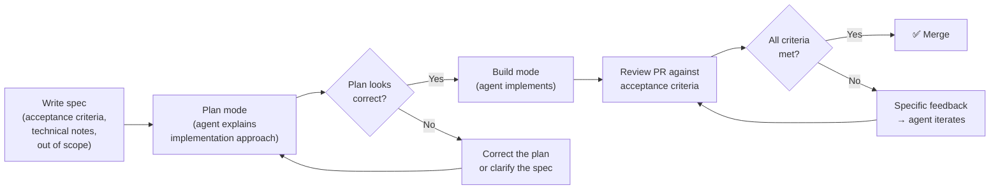
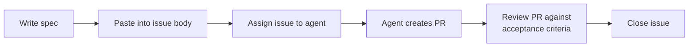

## Why you need a structured way of working

Most developers adopt AI coding tools the same way: install the extension, accept a few suggestions, feel productive, and move on. No process. No criteria for when to use the tool or when to ignore it. No systematic way to evaluate output quality.

This works fine for trivial tasks. But the moment the stakes go up — production code, security-sensitive logic, multi-team codebases — vibes-based AI usage becomes a liability. You start accepting bad suggestions because they _look_ right. You stop reading diffs because "the AI wrote it." You accumulate technical debt silently, one accepted suggestion at a time.

Research backs this up, but not in the simplistic "AI always makes you faster" way. Controlled studies show speedups on bounded tasks. METR's 2025 randomized study found the opposite for experienced developers working in mature open-source repositories: participants expected AI to help, but measured completion time increased. DORA's research gives the organizational version of the same warning: AI amplifies the delivery system you already have.

The solution isn't to stop using AI. It's to use it _within a structure_ that keeps you in control. This chapter describes that structure: the **spec-first workflow**.

---

## The three pillars

Across this series, everything we cover builds on three practices:

1. **Spec-Driven Development (SDD)** — write success criteria before delegating anything. The spec defines what "done" looks like so that both you and the agent have a shared, explicit target.

2. **Plan → Build mode** — use the built-in workflow your tools already provide: Plan mode to build and validate a structured approach before any code is written, then Build (agent) mode to execute it. The mode switch is the moment you hand off control.

3. **The harness** — the system of skills, instructions, and agent profiles that makes SDD repeatable across every project and team member. We'll build this progressively from Ch 3 through Ch 9.

These three aren't a methodology you have to invent. They're how thoughtful developers already work — made explicit so you can practice them deliberately and teach them to your team.

---

## Pillar 1: Spec-Driven Development

### Why specs matter more with AI than with humans

When you delegate work to a human developer, the conversation doesn't end at the ticket. They ask questions. They notice when the requirements conflict. They bring institutional knowledge about the codebase and the team's conventions. The spec doesn't need to be perfect because the human fills the gaps.

An AI agent operates differently:

- **No implicit knowledge.** The agent doesn't know your team's conventions unless you wrote them down. It has no memory of the last three sprints, no understanding of why the previous architecture was rejected.
- **No follow-up questions.** The agent starts executing from the first instruction. A human pauses and asks; an agent proceeds and assumes. Ambiguity in the spec becomes an assumption in the code.
- **Speed amplifies everything.** A human working from a bad spec produces bad code slowly — you catch it at the standup. An agent working from a bad spec produces bad code fast, across multiple files, before you've had a chance to review.

This doesn't mean specs need to be long. It means they need to be **precise**. A five-line spec that clearly defines the goal, the acceptance criteria, and what's out of scope is far more useful than two paragraphs of vague description.

### Anatomy of a spec

A well-formed spec has four sections:

| Section | Purpose | Key question |
|---|---|---|
| **Goal** | What this task accomplishes and why | What problem does this solve? |
| **Acceptance criteria** | Specific, testable conditions that define "done" | How will I know it's correct? |
| **Technical notes** | Context the agent needs to stay consistent with the codebase | What files, patterns, or constraints apply? |
| **Out of scope** | What this task explicitly does NOT include | What should the agent not touch? |

Here's what a real spec looks like. Suppose you need to add rate limiting to an API endpoint.

**Without a spec (vague prompt):**
> "Add rate limiting to the API"

What the agent doesn't know: which endpoint? What limits? Per user or per IP? What header to return when the limit is hit? What library to use? Where in the codebase should the new middleware live?

**With a spec:**

```markdown
## Goal
Add rate limiting to POST /api/comments to prevent abuse.

## Acceptance criteria
- [ ] 10 requests per minute per authenticated user (use user ID from JWT)
- [ ] 100 requests per minute per IP for unauthenticated requests
- [ ] Return 429 with Retry-After header when limit is exceeded
- [ ] Unit tests for both limits and the 429 response

## Technical notes
- Use Redis for the sliding window counter (connection in src/lib/redis.ts)
- Create a new middleware file — don't modify existing middleware

## Out of scope
- Rate limiting on other endpoints (separate task)
- Admin bypass (not requested)
```

The second version gives the agent everything it needs to produce useful output on the first try. The first version will require multiple rounds of correction.

### What Spec-Driven Development is (and isn't)

SDD is simply: **write the success criteria before writing the code.** The spec defines what "done" looks like so that both you and the agent have a shared, explicit target.

It's worth distinguishing SDD from two related practices:

| Practice | When the criteria are written | Who the criteria guide |
|---|---|---|
| **TDD (Test-Driven Development)** | Before code, as executable tests | The code implementation |
| **BDD (Behavior-Driven Development)** | Before code, as human-readable scenarios | Cross-functional teams, QA |
| **SDD (Spec-Driven Development)** | Before delegation, as a structured document | The agent doing the work |

SDD doesn't replace TDD or BDD. It complements them. Your spec can reference tests that should exist. The key difference is the primary audience: a spec is written to guide an agent.

### The spec as a measurement instrument

Here's the insight that ties SDD to everything else: **a spec with checkboxes is simultaneously an instruction for the agent and a measurement tool for you.**

After the agent creates its pull request, check the acceptance criteria:

- How many criteria did the PR satisfy?
- Which criteria were missed or partially implemented?
- Were any out-of-scope changes included?

This gives you a **spec compliance score**: 6 of 7 criteria met = 86% compliance. Track this over time and you'll see exactly where your specs need to be more precise. We'll come back to this in Ch 17, where spec compliance becomes a core metric for measuring the effectiveness of your workflow.

### Specs at different scales

The right depth depends on task size:

| Task complexity | Planning effort | Example |
|---|---|---|
| **Trivial** | One-liner or mental note | "Generate a unit test for this pure function, cover happy path and null input" |
| **Small** | A few sentences with criteria | "Add input validation to POST /api/comments — [criteria list]" |
| **Medium** | Structured document | Full four-section spec in the issue body |
| **Large** | Full spec file | Stored in `specs/feature-name.md`, fed as context to the agent |

For trivial tasks, the "spec" might just be a well-formed prompt. For large tasks, the spec is a document you commit to the repository. The key is that **the spec exists before the agent starts working**.

---

## Pillar 2: Plan → Build mode

### The built-in workflow

Modern AI coding tools have already encoded the spec-first workflow into their interfaces. You don't have to enforce it manually — you just have to use the right mode.

In **VS Code**, the Chat panel has three modes:

- **Ask** — answers questions and explains code. No file modifications.
- **Plan** — builds a structured implementation plan, asks clarifying questions, and waits for your approval before writing anything.
- **Agent** (Build) — executes, reads and modifies files, runs commands, iterates on errors.

The intended workflow is sequential: **Plan mode first, Agent mode second.** You review and approve the plan before the agent writes a single line.

In **Copilot CLI**, the same workflow is available in the interactive session:

- Default prompt: interactive chat
- `Shift+Tab`: switches to **plan mode** — builds a plan, asks questions, waits for approval
- `Shift+Tab` again: switches to **autopilot** — full autonomy (use with care)

### Why the mode switch matters

Plan mode is not just a convenience feature. It's the moment you verify that the agent understood your spec correctly before it acts on it. The agent explains what it's about to do, which files it plans to touch, and what the implementation approach will be. You review that plan against your acceptance criteria.

If the plan looks wrong, you correct it _before_ any code is written. This is the cheapest possible point to catch a misunderstanding — before 30 files have been modified in a direction you didn't intend.

The sequence is:



This is the whole workflow. Not a methodology, not an acronym — just a deliberate sequence of steps that experienced developers already follow.

### The "accept all" anti-pattern

The single most destructive habit in AI-assisted development is accepting AI-generated code without reading it. It looks like productivity because the output is fast. But the cost is deferred:

- **Silent bugs** — the code passes the happy path but fails on edge cases you didn't test
- **Security vulnerabilities** — the AI introduced an injection point or a hardcoded credential
- **Convention drift** — AI-generated code introduces inconsistencies in naming, patterns, structure over time

The security evidence is direct: generated code can be vulnerable, and developers using AI can become more confident in less secure output. When you accept without reading, you combine automation bias with production code. That is a bad trade.

### Why it happens

This isn't a willpower problem, it's psychology:

- **Automation bias** — we trust automated systems more than we should, especially when they're usually right
- **Speed bias** — fast output _feels_ like progress, even if it's wrong
- **Anchoring** — once you see a code suggestion, it's hard to think of an alternative. The AI's solution becomes your default
- **Sunk cost** — you've already waited for the output; rejecting it feels like wasted time

The spec-first workflow interrupts these biases. The spec establishes the target _before_ you see any code, so you're not anchoring on the AI's output when deciding whether it's correct. The acceptance criteria give you an objective checklist that doesn't care whether the code "looks right."

### Matching investment to risk

Not every task needs the full ceremony. Calibrate based on risk:

| Task | AI fit | Required guardrails |
|---|---|---|
| Generate tests for existing behavior | High | Run tests, inspect assertions, check edge cases |
| Draft docs from existing code | High | Human edit for accuracy and voice |
| Implement an isolated utility | High | Unit tests, type check, edge-case review |
| Brownfield feature slice | Medium | Spec, Plan mode, small diff, integration tests |
| Large refactor | Medium/high risk | Characterization tests, phased plan, rollback path |
| Auth, crypto, payments, permissions | High risk | Manual design approval, security review, static analysis |
| Database migration | High risk | Reversible migration, backup plan, staging test |
| Production operation | Very high risk | Human approval, no autonomous destructive commands |

The workflow is a spectrum. Use judgment, but have a structure for how you engage with AI. The alternative is "accept all," and we've seen where that leads.

My default rule is: if a bad answer can corrupt data, expose secrets, weaken authorization, or create an outage, the agent may help plan and draft, but it does not get autonomy.

### Calibrated skepticism

Calibrated skepticism means neither rejecting AI output by default nor trusting it by default. It means treating every output as a hypothesis that must be validated against the spec, codebase, tests, and security model.

This matters because AI output often looks more complete than it is. Perry et al. found that developers using AI assistants could produce less secure code while feeling more confident in the result. That is the dangerous combination: lower quality, higher confidence.

Use this review loop:

1. **Spec check**: does the diff satisfy every acceptance criterion?
2. **Scope check**: did it touch anything out of scope?
3. **Evidence check**: which tests, type checks, linters, or scanners prove the claim?
4. **Risk check**: what could fail in production even if the tests pass?
5. **Ownership check**: can you explain the design in the PR without hiding behind "the AI wrote it"?

---

## Putting it together: a concrete example

**Task:** Add input validation to a REST endpoint that accepts user registration data.

### Without the workflow

1. Open chat: "add validation to the register endpoint"
2. AI generates validation code
3. Accept without reading
4. Move to the next task

**What typically goes wrong:**
- Email validation uses a simple regex that rejects valid addresses (or accepts invalid ones)
- Password validation doesn't match your security policy (AI used 8 chars minimum; your policy says 12)
- Error messages are generic strings instead of your team's structured error format
- No tests were generated
- Validation runs _after_ the database query instead of before

Time "saved": 5 minutes. Time spent debugging later: 45 minutes.

### With the spec-first workflow

**Write the spec first (2 minutes):**

```markdown
## Goal
Add input validation to POST /api/register before any database calls.

## Acceptance criteria
- [ ] name: non-empty, max 100 chars, no script tags
- [ ] email: use validator.isEmail() from src/lib/validators.ts
- [ ] password: min 12 chars, at least one uppercase, one number, one special char
- [ ] Return 400 with ApiError format (src/types/errors.ts) for invalid input
- [ ] Validation runs before any database or service calls
- [ ] Unit tests for all valid and invalid cases

## Technical notes
- Use the existing validate() middleware pattern
- Error format: ApiError (src/types/errors.ts)

## Out of scope
- Sanitizing existing data in the database
- Changes to the login endpoint
```

**Use Plan mode (30 seconds):**

Switch to Plan mode in the chat panel. Paste the spec. The agent builds an implementation plan:

> 1. Create validation schema in src/middleware/validators/register.ts
> 2. Add validate() call at the start of POST /api/register in src/routes/auth.ts
> 3. Add unit tests in __tests__/validators/register.test.ts
>
> Files to modify: src/routes/auth.ts (add middleware), src/middleware/validators/register.ts (new file), __tests__/validators/register.test.ts (new file)

Review the plan: does it match what you intended? Are only the expected files listed? If yes, approve. If no, correct the plan before any code is written.

**Switch to Build mode:**

Approve the plan. The agent implements it.

**Review against the checklist (3 minutes):**

Go through each acceptance criterion. Did the agent use `validator.isEmail()`? Does the password regex match your policy? Are error messages using `ApiError`? Run the tests.

**Correct if needed (1 minute):**

> The agent used its own password regex instead of our policy. Re-prompt: "Use exactly: min 12 chars, at least one uppercase, one number, one special character."

Total time: ~7 minutes. The code is correct, tested, follows conventions, and won't produce a 45-minute debugging session next week.

---

## The spec as the issue body

When working with the GitHub Copilot Coding Agent, the issue body _is_ the spec. The agent reads the acceptance criteria exactly as you wrote them. After the PR is created, those same criteria become your review checklist.

```markdown title="GitHub Issue #247"
## Goal

Add a labels feature to the task management API so users can organize
and filter tasks by string labels.

## Acceptance criteria

- [ ] POST /api/tasks/:id/labels — adds a label (body: { name: string })
- [ ] DELETE /api/tasks/:id/labels/:name — removes a label
- [ ] GET /api/tasks?label=:name — filters by exact label match
- [ ] Label names: lowercase, max 50 chars, alphanumeric + hyphens
- [ ] Unit tests for validation logic
- [ ] Integration tests for all three endpoints

## Technical notes

- Follow the route pattern in src/routes/tasks.js
- Use the existing validate() middleware
- Use parameterized queries (no string interpolation in SQL)

## Out of scope

- Label colors or metadata
- Bulk operations
```

The spec is not a separate document — **it is the issue, the instruction to the agent, and the review checklist all in one**.



---

## Setting up for the rest of the series

Every chapter builds on this foundation:

| Module | Focus | What you'll practice |
|---|---|---|
| **Module 00** (Ch 3–4) | Setup, the harness | Configuring tools and building the system that makes SDD repeatable |
| **Module 01** (Ch 5–9) | Agents, AGENTS.md, instructions, skills | Teaching the AI your context so specs produce consistent results |
| **Module 02** (Ch 10–13) | Tests, code review, debugging, documentation | Applying the spec-first workflow to daily engineering tasks |
| **Module 03** (Ch 14–15) | MCP, hooks, automation | Extending what the agent can access and enforce |
| **Module 04** (Ch 16–17) | Security, governance, measurement | Measuring spec compliance and building governance around the workflow |
| **Module 05** (Ch 18) | End-to-end final project | Running the complete workflow on a realistic codebase from start to finish |

Next up: **Chapter 3 — Setup & Practical Integration** — configuring the tools and laying the groundwork for the harness that makes this workflow automatic.
