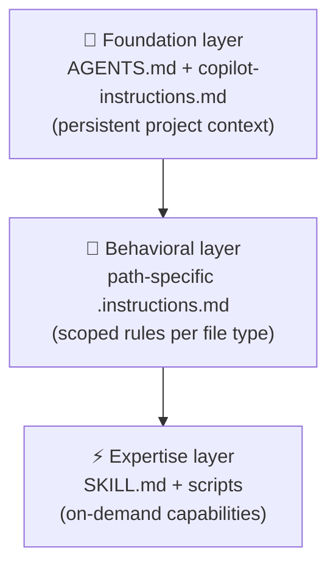

## The recurring problem

Every time you start a new project, you face the same setup work: creating `copilot-instructions.md`, writing `AGENTS.md`, designing agent profiles, adding hooks, building a `spec-writer` skill. Configuring all of this from scratch takes an hour or two. And then you do it again for the next project. And the one after that.

This is the harness problem: the spec-first workflow is repeatable, but the _infrastructure_ that makes it reliable has to be rebuilt every time — unless you design it to be portable.

A **harness** is a pre-configured system of instructions, agents, and skills that installs into a project and makes the spec-first workflow work by default. You don't have to remember to write a spec because the `spec-writer` skill does the first draft. You don't have to remember the team's security rules because the instructions enforce them automatically. You don't have to explain the review criteria to every new agent because the reviewer profile already knows them.

This chapter is a strategic map of the harness: what layers it has, how they connect, and what you'll build in the chapters that follow.

---

## The three layers

The harness has three layers that work together:



### Foundation layer: AGENTS.md and project instructions

The foundation layer tells every agent what this project is, how to build and test it, and what rules to always follow. It loads on every interaction, without you having to remember to include it.

This layer lives in:
- `AGENTS.md` — cross-tool context (works with GitHub Copilot, Claude Code, Cursor, Gemini CLI, and others)
- `.github/copilot-instructions.md` — Copilot-specific rules that apply to all chat and agent mode interactions
- `CLAUDE.md`, `GEMINI.md` — model-specific overrides when needed

**What belongs here:**
- Tech stack and architecture overview
- Build, test, and lint commands (exact, runnable)
- Project-wide coding conventions
- Security rules that apply everywhere
- What the agent must never do (delete migrations, commit secrets, etc.)

**What doesn't belong here:**
- Rules that only apply to specific file types (those go in the behavioral layer)
- Specialized tasks like spec writing or debugging (those go in the expertise layer)
- Anything so large it would be expensive to load on every single request

We'll build this layer in Ch 7 (AGENTS.md) and Ch 8 (repository instructions).

### Behavioral layer: path-specific instructions

The behavioral layer applies targeted rules to specific parts of the codebase. A React component file has different conventions than a database migration. A test file has different requirements than a route handler. Path-specific instructions let you express these differences without bloating the always-loaded foundation.

This layer lives in `.github/instructions/*.instructions.md` files, each with an `applyTo` glob:

```markdown title=".github/instructions/api-routes.instructions.md"
---
applyTo: "src/server/**/*.ts,src/app/api/**/*.ts"
---

- Validate all input with Zod schemas
- Return consistent shapes: { data, error, status }
- Use structured logging (logger.error()), not console.error
```

```markdown title=".github/instructions/validators.instructions.md"
---
applyTo: "src/middleware/validators/**/*.ts"
---

- Use regex /^[a-z0-9-]+$/ for slug/label validation
- All validation errors use the ApiError format from src/types/errors.ts
- Reversible: every validator must handle both creation and update scenarios
```

We'll build this layer in Ch 8.

### Expertise layer: skills

The expertise layer provides on-demand capabilities — specialized knowledge and workflows that the agent loads only when it's relevant to the current task.

Each skill is a directory containing a `SKILL.md` file and optional scripts:

```text
.github/skills/
  spec-writer/
    SKILL.md          ← instructions the agent reads when writing specs
  github-actions-debugging/
    SKILL.md          ← instructions + companion script
    scripts/
      diagnose.sh
```

Unlike the foundation layer (always loaded), skills are loaded on-demand based on task relevance. The agent scans the skill descriptions at startup (~100 tokens each), then loads the full skill instructions only when the task matches. This keeps context costs low while making specialized expertise available when needed.

**What belongs here:**
- Workflows that are valuable but not universal (spec writing, code review, debugging CI)
- Expertise that changes frequently (faster to update a skill than edit AGENTS.md)
- Multi-step procedures with companion scripts
- Reusable capabilities you want to share across projects or with your team

We'll build this layer in Ch 9, where you'll create a `spec-writer` skill that automates the first draft of every spec.

---

## Why the harness matters

The harness is what makes the spec-first workflow scale.

Without a harness:
- Each new project requires 1–2 hours of configuration
- Team members each set up differently, leading to inconsistent agent behavior
- You remember to write specs _sometimes_, depending on how much time you have
- The agent ignores your conventions because they're not in its context

With a harness:
- New projects get the full workflow in minutes (`git clone` or an install command)
- Every team member, on every project, gets the same agent behavior by default
- The `spec-writer` skill ensures specs happen even when you're in a hurry
- The agent follows your conventions because the behavioral layer is always present

This is the difference between using AI tools and building a **system** with AI tools.

---

## Geremmyas: a production harness

Rather than building everything from scratch, you can start from a working harness. [Geremmyas](https://woliveiras.com.br/posts/introducing-geremmyas-spec-driven-development-ai-assistants/) is a CLI tool built specifically for this: it installs a full Spec-Driven Development harness into any project.

Running it creates:
- A project contract (AGENTS.md with architecture, build steps, and conventions)
- Auto-applied instructions per language, framework, testing setup, and security domain
- Skills for requirements interviews, spec generation, TDD cycles, and bugfix loops
- Guardrails (hooks that block dangerous operations)
- A review flow (reviewer agent profile with spec-compliance criteria)

It's the practical version of what this series teaches: everything from Ch 3 through Ch 9, packaged as a one-command install.

Whether you use Geremmyas directly or build your own harness from scratch, the structure is the same: foundation layer → behavioral layer → expertise layer, each built for portability and reuse.

---

## The decision map: when to build what

As you encounter situations in practice, use this map to decide what the right addition to the harness is:

| Situation | Right addition |
|---|---|
| Agent ignores your team's conventions | Foundation layer: add to `copilot-instructions.md` |
| Agent uses wrong patterns in a specific part of the codebase | Behavioral layer: add or update path-specific `.instructions.md` |
| You want the agent to follow a specialized workflow (spec writing, security review, etc.) | Expertise layer: create a new skill |
| You need a persistent named persona for a specific role | Create a `.agent.md` profile (Ch 6) |
| You want to enforce what the agent can/can't do at execution time | Add a hook (Ch 15) |
| The same task happens identically every time | Automate it: Agentic Workflow or hook |

If you're unsure, start with the foundation layer. It has the broadest impact and is the fastest to add.

---

## What comes next

The next five chapters build each part of the harness in detail:

- **Ch 5 — Prompt Engineering**: how to translate a spec into an effective agent prompt
- **Ch 6 — Custom Agents & Sub-Agents**: building `.agent.md` profiles for specialized roles
- **Ch 7 — AGENTS.md**: building the foundation layer with cross-tool project context
- **Ch 8 — Repository Custom Instructions**: building the behavioral layer with path-specific rules
- **Ch 9 — Agent Skills**: building the expertise layer with modular, on-demand capabilities — including the `spec-writer` skill that automates the first draft of every spec

By Ch 9, you'll have a complete harness. By Ch 18, you'll have run it end-to-end on a realistic project and measured the results.
