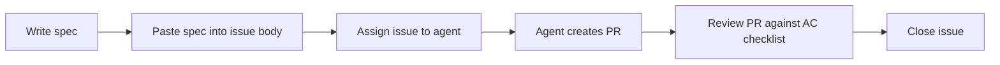

## The Plan phase needs an artifact

In Ch 2, we defined the **Plan** phase of PDRC as answering five questions before you open the AI tool: What's the task? What are the acceptance criteria? What's the scope? What context does the AI need? Which tool is right?

Those are the right questions. But answering them inside your head — or in a vague, informal way — is not the same as writing them down in a form the agent can actually use. When you work with a human colleague, you can rely on shared context, implicit conventions, and the ability to ask follow-up questions mid-task. An AI agent has none of that. It gets the instruction you give it, and nothing more.

**Spec-Driven Development (SDD) is the practice of writing a structured specification before delegating any meaningful task to an agent.** The spec is the concrete output of the Plan phase. It's the document you hand to the agent instead of a vague request.

This chapter teaches you how to write specs that work, how to calibrate their depth to task complexity, and how they connect to everything that comes after: prompt engineering (Ch 5), custom agents (Ch 6), and ultimately, impact measurement (Ch 17).

In Ch 9, you'll also turn this process into a reusable agent skill — so the agent can help you write the spec before you hand off the implementation.

---

## Why specs matter more with AI than with humans

When you delegate work to a human developer, the conversation doesn't end at the ticket. They ask questions. They notice when the requirements conflict. They bring institutional knowledge about the codebase and the team's conventions. They exercise judgment when something is ambiguous. The spec doesn't need to be perfect because the human fills the gaps.

An AI agent operates differently:

- **No implicit knowledge.** The agent doesn't know your team's conventions unless you wrote them down (in AGENTS.md, custom instructions, or the spec itself). It has no memory of the last three sprints, no understanding of why the previous architecture was rejected, and no feeling for what "consistent with the rest of the codebase" actually means in your project.
- **No follow-up questions.** The agent starts executing from the first instruction. A human pauses and asks; an agent proceeds and assumes. Ambiguity in the spec becomes an assumption in the code.
- **Speed amplifies everything.** A human developer working from a bad spec produces bad code slowly — you catch it at the standup. An agent working from a bad spec produces bad code fast, across multiple files, before you've had a chance to review. The better the spec, the more you benefit from the speed. The worse the spec, the more damage the speed causes.

This doesn't mean specs need to be long. It means they need to be **precise**. A five-line spec that clearly defines the goal, the acceptance criteria, and what's out of scope is far more useful than two paragraphs of vague description.

---

## What Spec-Driven Development is (and isn't)

SDD is a simple idea: **write the success criteria before writing the code.** The spec defines what "done" looks like so that both you and the agent have a shared, explicit target.

It's worth distinguishing SDD from two related practices:

| Practice | When the criteria are written | Who the criteria guide |
|---|---|---|
| **TDD (Test-Driven Development)** | Before code, as executable tests | The code implementation |
| **BDD (Behavior-Driven Development)** | Before code, as human-readable scenarios | Cross-functional teams, QA |
| **SDD (Spec-Driven Development)** | Before delegation, as a structured document | The agent doing the work |

SDD doesn't replace TDD or BDD. It complements them. Your spec can reference tests that should exist. It can use BDD-style language for acceptance criteria. The key difference is the primary audience: a spec is written to guide an agent, not a test runner.

In PDRC terms, the spec is the output of the **Plan** phase and the primary input to the **Delegate** phase. Writing the spec forces you to complete the planning work that makes delegation effective.

---

## Anatomy of a spec

A well-formed spec has four sections. Not all four are required for every task — trivial tasks need less — but knowing the structure lets you decide what to include.

| Section | Purpose | Key question |
|---|---|---|
| **Goal** | What this task accomplishes and why | What problem does this solve? |
| **Acceptance criteria** | Specific, testable conditions that define "done" | How will I know it's correct? |
| **Technical notes** | Context the agent needs to stay consistent with the codebase | What files, patterns, or constraints apply? |
| **Out of scope** | What this task explicitly does NOT include | What should the agent not touch? |

### Goal

One to three sentences. Describes what the task does, not how it does it. Should be understandable to someone unfamiliar with the codebase.

```text
Add a labels feature to the task management API so users can organize
and filter tasks by string labels (e.g. "urgent", "bug", "feature").
```

### Acceptance criteria

A checklist of specific, testable conditions. Each item should be binary — it either passes or it doesn't. This is the most important section: the agent uses it to scope the implementation, and you use it to review the output.

```text
- [ ] POST /api/tasks/:id/labels — adds a label (body: { name: string })
- [ ] DELETE /api/tasks/:id/labels/:name — removes a label
- [ ] GET /api/tasks?label=:name — filters tasks by exact label match
- [ ] Label names: lowercase, max 50 chars, alphanumeric + hyphens only
- [ ] Unit tests for the label validation logic
- [ ] Integration tests for all three endpoints
- [ ] Existing tests continue to pass
```

Write criteria as observable behaviors, not as implementation steps. "The endpoint returns 400 when name exceeds 50 characters" is a good criterion. "Add a check in the validation middleware" is an implementation step — that's the agent's job.

### Technical notes

Context the agent needs to produce code that's consistent with your codebase. This is where you point at existing patterns, relevant files, and constraints that aren't obvious from the acceptance criteria alone.

```text
- Follow the route pattern in src/routes/tasks.js
- Use the existing validate() middleware for input validation
- Labels table should use a foreign key to tasks.id with CASCADE delete
- Use parameterized queries (never raw string interpolation in SQL)
- Migration must be reversible (include both up and down)
```

Without this section, the agent writes code that works in isolation but doesn't fit the codebase. With it, the agent can write code that looks like it was written by someone who has been on the team for six months.

### Out of scope

Explicit boundaries prevent scope creep. Agents tend toward completeness — if they think something is related, they'll add it. Out of scope tells the agent exactly where to stop.

```text
- Label colors or metadata (future enhancement)
- Bulk label operations (separate issue)
- Global label management (create/list/delete labels independently of tasks)
```

---

## Specs at different scales

The right spec depth depends on task size. Over-speccing a trivial task is waste; under-speccing a large task is risk.

### Trivial — mental note or one-liner

For small, self-contained, low-risk tasks, a detailed spec adds more overhead than value.

```text
Generate unit tests for the parseConfig() function in src/utils/config.ts.
Cover the happy path, missing required keys, and invalid type values.
```

This is barely a spec — it's a well-formed prompt. But it has a goal, acceptance criteria implied by the examples, and an implicit technical note (the file path). For trivial tasks, this is enough.

### Small — a few sentences with criteria

For tasks that touch two to five files and carry some risk of breaking existing behavior:

```text
Goal: Add input validation to POST /api/comments.

Criteria:
- [ ] body.content: required, string, max 1000 chars
- [ ] body.taskId: required, valid UUID, must reference an existing task
- [ ] Return 400 with { error, field } on invalid input
- [ ] Use the existing validate() middleware (see src/middleware/validate.js)
- [ ] Existing comment tests still pass
```

### Medium — structured document

For features that span multiple files, touch the database, or involve non-obvious design decisions:

```markdown
# Spec: Task Labels Feature

## Goal
Add labels to the task management API.

## Acceptance criteria
- [ ] POST /api/tasks/:id/labels
- [ ] DELETE /api/tasks/:id/labels/:name
- [ ] GET /api/tasks?label=:name
- [ ] Validation: lowercase, max 50 chars, alphanumeric + hyphens
- [ ] Unit tests for validation
- [ ] Integration tests for all endpoints
- [ ] Existing tests pass

## Technical notes
- Follow src/routes/tasks.js pattern
- Use validate() middleware
- CASCADE delete on foreign key
- Reversible migration

## Out of scope
- Label colors, bulk ops, global label management
```

### Large — full specification document

For significant features, migrations, or architectural changes. Stored in the repository alongside the code (e.g., `specs/feature-name.md`), referenced in the issue body, and fed as context when assigning to the agent.

Large specs may include diagrams, API contracts, database schema changes, security considerations, and rollback plans. They're rare — most work doesn't need this level — but when the stakes are high, the spec is the difference between a successful agent task and a debugging session that costs more than doing it manually.

---

## The spec as a measurement instrument

Here's the insight that connects SDD to everything else in this series: **a spec with checkboxes is simultaneously an instruction for the agent and a measurement tool for you.**

After the agent creates its pull request, you check the acceptance criteria:

- How many criteria did the PR satisfy?
- Which criteria were missed or partially implemented?
- Were any out-of-scope changes included?

This gives you a **spec compliance score**: 6 of 7 criteria met = 86% compliance. Track this over time, across many agent tasks, and you'll see exactly where your specs need to be more precise and where your agents perform reliably. We'll come back to this in Ch 17, where spec compliance becomes a core metric for measuring the effectiveness of your AI-assisted workflow.

The real value of this feedback loop: it shifts debugging from "why didn't the agent do what I meant" to "which criterion was ambiguous." The spec externalizes the target, so when the result misses, you can pinpoint exactly where the gap is.

---

## Spec templates

Two templates you can copy into your repository and use immediately.

### GitHub issue template

Place this at `.github/ISSUE_TEMPLATE/agent-task.md`. When you create an issue using this template, the resulting issue body becomes the agent's primary instruction.

```markdown title=".github/ISSUE_TEMPLATE/agent-task.md"
---
name: Agent Task
about: A task to be assigned to the Copilot coding agent
labels: ["copilot-agent"]
---

## Goal

[One to three sentences: what this task accomplishes and why it matters.]

## Acceptance criteria

- [ ] [Specific, testable criterion]
- [ ] [Specific, testable criterion]
- [ ] [Tests: describe what test coverage should exist]

## Technical notes

- [Files or directories to follow as patterns]
- [Constraints or conventions to apply]
- [Dependencies, APIs, or schemas that are relevant]

## Out of scope

- [What this task explicitly does NOT include]
```

### Local spec file

For larger tasks, or when working locally before creating an issue, keep a spec file in the root or a `specs/` directory:

```markdown title="specs/feature-name.md"
# Spec: [Feature Name]

## Goal

## Acceptance criteria

- [ ]

## Technical notes

## Out of scope
```

When you're ready to delegate, paste the spec into the issue body, or feed it directly as context in agent mode:

```text
Implement the feature described in specs/task-labels.md.
Follow the existing patterns in this codebase.
```

---

## Hands-on exercise

Practice turning a vague issue into a proper spec.

**Starting point — the vague issue:**

> Add dark mode to the settings page.

This is a real type of request: it has a goal but no criteria, no scope boundary, no technical notes. If you hand this to an agent, you'll get something, but you won't know if it's right until you test it manually, and you'll have no systematic way to review it.

**Your task:**

Rewrite it as a spec using the medium-scale template above. Before writing, answer these questions:

1. What exactly does "dark mode" mean here? Theme toggle? System preference detection? Persisted user preference?
2. Which files are likely to change?
3. What existing patterns should the agent follow?
4. What should the agent explicitly not do? (Restyling the entire app? Modifying the design system?)
5. How will you know it's correct?

There's no single right answer — the spec you write depends on the codebase context you imagine. The goal is to practice the process of turning ambiguity into precision before any code is written.

After completing the exercise, compare your spec to this example:

<details>
<summary>Example spec for dark mode (click to expand)</summary>

```markdown
# Spec: Dark Mode on Settings Page

## Goal
Allow users to toggle dark mode from the settings page. The preference
persists to their profile and applies on next page load.

## Acceptance criteria
- [ ] New "Appearance" section in the settings page, below "Notifications"
- [ ] Toggle switch: "Dark mode" (default: follows system preference)
- [ ] Options: "System default", "Light", "Dark"
- [ ] Selected preference is saved via PATCH /api/users/:id
  { preferences: { theme: "system" | "light" | "dark" } }
- [ ] On page load, the app applies the saved theme before render (no flash)
- [ ] Uses the existing ThemeToggle component from src/components/ui/
- [ ] Unit tests for the preference persistence logic
- [ ] E2E test: toggle → reload → theme persists

## Technical notes
- Theme preference stored in the user_preferences JSON column
- Follow the pattern in src/pages/settings/NotificationsSection.tsx
- Use CSS custom properties already defined in src/styles/themes.css
- No changes to the design system or global styles

## Out of scope
- Auto-scheduling (e.g., dark mode at sunset)
- Per-component theme overrides
- Restyling any existing pages or components
```

</details>

---

## The spec as the issue body

Once you have a spec, the most direct way to hand it to a coding agent is to **put it in the issue body**. This is how the GitHub Copilot Coding Agent, Claude, and Codex receive their primary instruction: from the issue description.

A well-formed issue body is the spec:

```markdown title="GitHub Issue #247"
## Goal

Add a labels feature to the task management API so users can organize
and filter tasks by string labels.

## Acceptance criteria

- [ ] POST /api/tasks/:id/labels — adds a label (body: { name: string })
- [ ] DELETE /api/tasks/:id/labels/:name — removes a label
- [ ] GET /api/tasks?label=:name — filters by exact label match
- [ ] Label names: lowercase, max 50 chars, alphanumeric + hyphens
- [ ] Unit tests for validation logic
- [ ] Integration tests for all three endpoints

## Technical notes

- Follow the route pattern in src/routes/tasks.js
- Use the existing validate() middleware
- Use parameterized queries (no string interpolation in SQL)

## Out of scope

- Label colors or metadata
- Bulk operations
```

When you assign this issue to a coding agent, it reads the acceptance criteria exactly as you wrote them. After the PR is created, those same criteria become your review checklist. The spec is not a separate document — **it is the issue, the instruction to the agent, and the review checklist all in one**.

This is the full Spec-Driven Development cycle in practice:



---

## What comes next

In Ch 5, we'll look at prompt engineering — the skill of translating a spec into an effective prompt. If you've written a good spec, this becomes straightforward: the Goal becomes the goal component of your prompt, the Acceptance Criteria become the constraints, and the Technical Notes become the context. The spec and the prompt share the same structure.

In Ch 9, you'll take this further: you'll build a `spec-writer` agent skill that takes a vague issue description as input and produces a structured spec as output. By that point, you'll have enough practice with SDD that automating the first draft will feel natural.
