## From one-off prompts to reusable specialists

In Ch 4, we learned how to write effective prompts — goal, context, constraints, output format. That works well for individual tasks, but it has a scaling problem: you end up writing the same context, the same constraints, and the same tool permissions into every prompt. Your testing prompts always say "don't modify production code." Your planning prompts always say "use read-only tools." Your review prompts always say "check for security, readability, and performance."

Custom agents solve this by encoding your prompt engineering decisions into **reusable, shareable `.agent.md` files** that any team member can invoke from a dropdown. Instead of writing a detailed prompt every time, you write it once, save it as an agent, and select it from the menu.

In PDRC terms, custom agents are **pre-built Plan + Delegate configurations**. The agent file _is_ the plan: it defines the role, the constraints, the tools, and the behavioral instructions. Selecting the agent _is_ the delegation: you hand off the task with all context pre-loaded.

---

## What is a custom agent?

A custom agent is a `.agent.md` Markdown file that configures the AI to adopt a specific persona. It defines:

- **Who** the AI is (role, expertise, behavioral instructions)
- **What** it can do (which tools are available)
- **How** it should work (model selection, output expectations)
- **Where** it leads next (handoffs to other agents)

When you select a custom agent from the agents dropdown in VS Code (or via `/agent` in the CLI), its instructions and tool configuration are applied to the chat session. The agent's prompt is prepended to every message you send, and only the listed tools are available.

Custom agents were introduced in VS Code 1.106 (previously called "custom chat modes"). They replaced the earlier `.chatmode.md` format — if you have those files, rename them to `.agent.md`.

### Where agent files live

| Location | Scope | Use case |
|----------|-------|----------|
| `.github/agents/` | Workspace | Shared with the team via source control |
| User profile folder | Personal | Available across all your workspaces |
| `.claude/agents/` | Workspace (Claude format) | Compatible with Claude Code and VS Code |
| `.github-private` repo | Organization/Enterprise | Available across all repos in the org |

For this workshop, we'll focus on **workspace agents** (`.github/agents/`) because they're version-controlled and shared — the whole team benefits from a well-built agent.

> **Terminology note:** VS Code also has `.prompt.md` files (prompt files / slash commands) that are invoked via `/prompt-name` in chat. They're similar in structure but serve a different purpose: prompt files are one-shot commands invoked manually, while agents are persistent personas that you switch to. Prompt files can _reference_ agents. We'll cover prompt files briefly at the end of this chapter.

---

## Anatomy of an `.agent.md` file

Every agent file has two parts: an optional YAML frontmatter header and a Markdown body with the instructions.

### The header

```yaml title=".github/agents/example.agent.md (frontmatter)"
---
name: test-specialist
description: Focuses on test coverage and quality without modifying production code
tools: ['read', 'search', 'edit', 'execute']
model: Claude Sonnet 4.5 (copilot)
agents: ['*']
---
```

| Property | Required | What it does |
|----------|----------|-------------|
| `name` | No | Display name in the agents dropdown. Defaults to the filename. |
| `description` | No | Placeholder text in the chat input field when this agent is active. |
| `tools` | No | List of available tools. If omitted, _all_ tools are available. |
| `model` | No | AI model to use. Can be a single string or a prioritized array (first available wins). |
| `agents` | No | Which custom agents can be invoked as subagents. `*` = all, `[]` = none. |
| `user-invokable` | No | Whether the agent appears in the dropdown (`true` by default). Set `false` for subagent-only agents. |
| `disable-model-invocation` | No | Prevents the agent from being auto-invoked as a subagent by other agents. |
| `handoffs` | No | Suggested next actions that transition between agents (buttons shown after a response). |
| `target` | No | Restrict to `vscode` or `github-copilot` environment only. |

### The body

The body is where you define the agent's behavior in natural language. This is your prompt engineering from Ch 4, encoded permanently:

```markdown title=".github/agents/example.agent.md (body)"
You are a testing specialist focused on improving code quality through
comprehensive testing.

## Responsibilities
- Analyze existing tests and identify coverage gaps
- Write unit tests, integration tests, and end-to-end tests
- Review test quality and suggest improvements
- Ensure tests are isolated, deterministic, and well-documented

## Rules
- Focus ONLY on test files — do not modify production code unless
  specifically requested
- Follow the project's existing testing patterns and conventions
- Include clear test descriptions using describe/it blocks
- Use appropriate testing patterns for the language and framework

## References
- Follow conventions in [test setup](../vitest.config.ts)
- Use patterns from [existing tests](../src/__tests__/)
```

**Key techniques:**

- **Markdown links** reference other files in the repo. The agent loads them as context.
- **`#tool:<tool-name>`** syntax references specific tools in the body text.
- **Variables** like `${file}`, `${selection}`, and `${workspaceFolder}` inject dynamic context.
- You can link to your custom instructions files to reuse guidelines without duplication.

---

## Tool scoping: the security principle of least privilege

The `tools` property is the most important configuration decision. It controls what the agent _can_ do, and what it _can't_.

### Why this matters

An agent with all tools enabled can read, write, delete, run terminal commands, access the internet, and invoke other agents. That's fine for an implementation agent that needs full autonomy. But a planning agent that accidentally starts writing code defeats its purpose. A review agent that modifies code instead of just commenting on it is worse than no review at all.

**The principle: give each agent the minimum set of tools it needs to do its job.**

### Common tool sets by agent role

| Agent role | Tools | Why |
|------------|-------|-----|
| **Planner** | `read`, `search` | Read-only. Can analyze the codebase and research, but can't make changes — the plan is the output, not code. |
| **Implementer** | `read`, `search`, `edit`, `terminal` | Full write access. Needs to create/modify files and run commands. |
| **Reviewer** | `read`, `search` | Read-only. Should produce feedback, not changes. Prevention against the "editing instead of reviewing" mistake. |
| **Test writer** | `read`, `search`, `edit`, `terminal` | Needs to write test files and run them to verify they pass. |
| **Researcher** | `read`, `search`, `fetch` | Can read code and fetch external documentation, but can't modify anything. |
| **Documentation** | `read`, `search`, `edit` | Can read code and write doc files, but doesn't need terminal access. |

For MCP server tools, use the `<server-name>/*` format to include all tools from a specific server, or reference individual tools like `github/list_issues`.

---

## Building your first agents

Let's build four agents that cover the most common workflows: planning, implementing, testing, and reviewing. These map directly to the PDRC cycle.

### How to create a custom agent in VS Code

You have two options: use the VS Code UI or create the file manually. Both produce the same result — a `.agent.md` file in `.github/agents/`.

**Option A: Using the VS Code UI**

1. Open the Chat panel (`Shift+Cmd+I` on macOS / `Shift+Ctrl+I` on Windows/Linux)
2. Click the **agents dropdown** at the top of the chat input (where it says "Agent", "Ask", or "Plan")
3. Select **Configure Custom Agents...**
4. Click **Create new custom agent**
5. Choose **Workspace** to store the agent in `.github/agents/` (version-controlled, shared with the team)
6. Enter a file name (e.g., `planner`) — VS Code creates `.github/agents/planner.agent.md`
7. Fill in the YAML frontmatter and the body instructions in the editor that opens

> **Tip:** Type `/agents` in the chat input to quickly open the Configure Custom Agents menu without navigating the dropdown.

**Option B: Create the file manually**

```sh
mkdir -p .github/agents
touch .github/agents/planner.agent.md
```

Then open the file in VS Code and write the frontmatter + body. VS Code automatically detects `.agent.md` files in `.github/agents/` and adds them to the agents dropdown.

After creating any agent file, you can verify it's loaded by checking the agents dropdown. Your new agent should appear in the list.

Now let's create four agents. For each one, use whichever method you prefer and paste the contents below into the file.

### Agent 1: The Planner

The planner analyzes requirements and creates an implementation plan. It uses only read-only tools — it should never write code.

```markdown title=".github/agents/planner.agent.md"
---
name: Planner
description: Analyzes requirements and creates a detailed implementation plan
tools: ['read', 'search']
handoffs:
  - label: Start Implementation
    agent: implementer
    prompt: Implement the plan outlined above.
    send: false
---

You are a technical planning specialist. Your job is to create clear,
actionable implementation plans that another agent (or a human) can follow.

## Process

1. Analyze the request and identify what needs to be done
2. Search the codebase to understand existing patterns, conventions, and
   architecture
3. Break the task into small, well-scoped steps
4. For each step, specify:
   - Which files to create or modify
   - What the expected behavior is
   - What tests should verify it
   - Any dependencies on other steps

## Output format

Structure your plan as a numbered list of steps. Each step should be small
enough to review in a single diff. Include:

- **Files:** which files are affected
- **Changes:** what needs to change
- **Tests:** how to verify the step worked
- **Risks:** anything that could go wrong

## Rules

- NEVER write code or modify files. Your output is a plan, not an
  implementation.
- If the task is ambiguous, list your assumptions explicitly and ask for
  clarification.
- If you identify risks or trade-offs, call them out. Don't bury them.
- Reference specific files and line numbers when discussing existing code.
```

Note the `handoffs` property: when the planner finishes, a "Start Implementation" button appears that transitions to the implementer agent with the plan as context. The `send: false` setting means the user sees the pre-filled prompt and can edit it before sending, maintaining human control.

### Agent 2: The Implementer

The implementer takes a plan (or a direct request) and writes the code.

```markdown title=".github/agents/implementer.agent.md"
---
name: Implementer
description: Writes code following plans and project conventions
tools: ['read', 'search', 'edit', 'execute/runInTerminal', 'execute/awaitTerminal', 'execute/getTerminalOutput']
handoffs:
  - label: Run Tests
    agent: test-specialist
    prompt: Run the tests for the changes made above and verify everything passes.
    send: false
  - label: Request Review
    agent: reviewer
    prompt: Review the code changes made above for correctness, quality, and security.
    send: false
---

You are an implementation specialist. Follow the plan or requirements precisely
and write production-quality code.

## Process

1. Read the plan (if provided) or analyze the request
2. Search the codebase for relevant patterns and conventions
3. Implement changes one step at a time
4. Run existing tests after each significant change to catch regressions
5. Create new tests if the plan specifies them

## Rules

- Follow the project's existing coding conventions and patterns
- Read custom instructions and AGENTS.md before starting
- If a plan exists, follow it step by step — don't skip steps or
  reinterpret the requirements
- If something in the plan seems wrong, flag it instead of silently
  deviating
- Keep commits small and focused (one logical change per step)
- Run tests after implementation to verify nothing is broken
```

### Agent 3: The Test Specialist

The test specialist writes and improves tests without touching production code.

```markdown title=".github/agents/test-specialist.agent.md"
---
name: Test Specialist
description: Writes and improves tests without modifying production code
tools: ['read', 'search', 'edit', 'execute/runInTerminal', 'execute/awaitTerminal', 'execute/getTerminalOutput']
---

You are a testing specialist focused on improving code quality through
comprehensive testing.

## Responsibilities

- Analyze existing tests and identify coverage gaps
- Write unit tests, integration tests, and end-to-end tests
- Review test quality and suggest improvements for maintainability
- Run tests to verify they pass
- Ensure tests are isolated, deterministic, and well-documented

## Rules

- Focus ONLY on test files — do NOT modify production code unless
  specifically requested
- Follow the project's existing testing patterns (framework, naming,
  structure)
- Each test should have a clear description explaining what it verifies
- Test edge cases, error paths, and boundary conditions, not just the
  happy path
- Tests must be deterministic: no time-dependent or order-dependent tests
- If you find untestable code, note it as a suggestion for refactoring
  rather than changing the production code yourself
```

### Agent 4: The Reviewer

The reviewer reads code and provides feedback — it never writes code.

```markdown title=".github/agents/reviewer.agent.md"
---
name: Reviewer
description: Reviews code for correctness, quality, security, and adherence to conventions
tools: ['read', 'search']
---

You are a code reviewer. Your job is to provide thorough, constructive
feedback on code changes.

## Review dimensions

For each review, analyze the code through these lenses:

1. **Correctness** — Does it do what it's supposed to? Are there logic
   errors, off-by-one errors, or unhandled edge cases?
2. **Security** — Input validation, injection risks, authentication/
   authorization issues, data exposure?
3. **Readability** — Clear names, consistent style, appropriate comments,
   reasonable function length?
4. **Performance** — Obvious inefficiencies, unnecessary allocations,
   N+1 queries, missing indexes?
5. **Architecture** — Does it fit the project's existing patterns? Does
   it introduce unnecessary coupling?

## Output format

Structure your review as:
- **Critical** — Must fix before merging (bugs, security issues)
- **Suggestion** — Should fix (readability, performance, patterns)
- **Nit** — Nice to fix but not blocking (naming, formatting)
- **Positive** — What the code does well (acknowledge good work)

## Rules

- NEVER modify code. Your output is feedback only.
- Be specific: reference file names, line numbers, and the actual code
  in question.
- Suggest concrete fixes, not vague advice like "improve this."
- If the code looks good, say so. Don't manufacture issues.
```

---

## Subagents: delegation within delegation

So far, each agent works independently and you manually switch between them. **Subagents** take this a step further: one agent can delegate subtasks to other agents automatically, each running in its own isolated context window.

### How subagents work


Key mechanics:

1. The main agent receives your task
2. It identifies subtasks that benefit from isolated context
3. It spawns subagents, each with their own context window
4. Subagents work autonomously and return only a summary
5. The main agent synthesizes the results and continues

The subagents feature is **synchronous**. The main agent waits for results before continuing. But VS Code can run **multiple subagents in parallel** when the subtasks are independent. This is powerful for tasks like "analyze this code for security, performance, and architecture issues simultaneously."

### Why subagents matter

| Benefit | Explanation |
|---------|-------------|
| **Context isolation** | Each subagent starts with a clean context window. Research, dead ends, and intermediate steps don't pollute the main conversation. |
| **Parallel execution** | Independent subtasks run concurrently, reducing total time. |
| **Specialization** | Each subagent can use a different custom agent with different tools, instructions, and even models. |
| **Cost reduction** | Only the final summary is added to the main agent's context, not the full conversation history of each subagent. |

### The `runSubagent` tool

Subagents are typically **agent-initiated**, not manually invoked. The main agent decides when to use them based on your instructions or the task complexity. To enable this, make sure the `'agent/runSubagent'` tool (or the `agent` tool set) is available in your agent's `tools` list.

You can hint that you want subagent delegation in your prompt:

```text
Analyze this PR for security vulnerabilities, performance issues,
and architecture concerns. Run each analysis as a parallel subagent.
```

Or — more reliably — encode the pattern in your agent's instructions.

---

## Orchestration patterns

Once you have individual agents, you can compose them into workflows. These patterns are where custom agents move from "nice to have" to "team infrastructure."

### Pattern 1: Coordinator and workers

A coordinator agent manages the overall task and delegates to specialized workers. This is the most common pattern for complex features.

```markdown title=".github/agents/feature-builder.agent.md"
---
name: Feature Builder
description: Coordinates planning, implementation, and review for new features
tools: ['agent', 'edit', 'search', 'read']
agents: ['Planner', 'Implementer', 'Test Specialist', 'Reviewer']
---

You are a feature development coordinator. For each feature request:

1. Use the **Planner** agent as a subagent to break down the feature
   into implementation steps.
2. Review the plan with the user before proceeding.
3. Use the **Implementer** agent as a subagent for each step.
4. After implementation, use the **Test Specialist** agent as a subagent
   to verify test coverage.
5. Use the **Reviewer** agent as a subagent to check the final result.
6. If the reviewer identifies issues, use a subagent to apply fixes.

Report progress after each phase. Do not proceed to the next phase
without confirming the current one is complete.
```

The `agents` property restricts which subagents the coordinator can use — preventing it from accidentally invoking unrelated agents.

### Pattern 2: Multi-perspective review

Code reviews benefit from multiple independent lenses. A single-pass review often misses issues that become obvious from a different perspective. Use subagents to run each perspective in parallel:

```markdown title=".github/agents/thorough-reviewer.agent.md"
---
name: Thorough Reviewer
description: Reviews code through multiple perspectives simultaneously
tools: ['agent', 'read', 'search']
---

You review code through multiple perspectives simultaneously. Run each
perspective as a parallel subagent so findings are independent and
unbiased.

When asked to review code, run these subagents in parallel:

- **Correctness reviewer**: logic errors, edge cases, type issues
- **Code quality reviewer**: readability, naming, duplication
- **Security reviewer**: input validation, injection risks, data exposure
- **Architecture reviewer**: codebase patterns, design consistency

After all subagents complete, synthesize findings into a prioritized
summary. Note which issues are critical versus nice-to-have.
Acknowledge what the code does well.
```

Each subagent approaches the code fresh — without being influenced by what the other perspectives found. This is the same principle behind independent code reviews in a team.

### Pattern 3: Handoff chains

Handoffs create guided sequential workflows. After one agent finishes, buttons appear that let the user transition to the next agent with context preserved.

```mermaid
flowchart LR
  P["🔍 Planner"] -->|"Start Implementation"| I["⚡ Implementer"]
  I -->|"Run Tests"| T["🧪 Test Specialist"]
  I -->|"Request Review"| R["👀 Reviewer"]
  T -->|"Request Review"| R
```



Here's a concrete example. Suppose you want a chain where a **Design agent** creates an API design, hands off to implementation, and then to documentation. Each agent's `handoffs` property defines the next step in the chain:

```markdown title=".github/agents/api-designer.agent.md"
---
name: API Designer
description: Designs REST API contracts before implementation
tools: ['read', 'search']
handoffs:
  - label: Implement API
    agent: implementer
    prompt: Implement the API design outlined above, following the endpoint specifications and schema definitions.
    send: false
  - label: Write API Docs
    agent: api-docs-writer
    prompt: Write API documentation based on the design above. Include endpoint descriptions, request/response examples, and error codes.
    send: false
---

You are an API design specialist. Create clear, RESTful API contracts
before any code is written.

## Process
1. Analyze the requirements and identify the resources involved
2. Define endpoints (method, path, query params, request/response body)
3. Specify error responses and status codes
4. Document authentication requirements

## Output format
For each endpoint:
- **Method + Path**: e.g., `POST /api/v1/users`
- **Request body**: JSON schema with required/optional fields
- **Response**: success and error shapes with status codes
- **Auth**: what permissions are needed

## Rules
- NEVER write implementation code. Your output is a design document.
- Follow REST conventions (plural nouns, proper HTTP methods, consistent naming)
- Include versioning in the path (`/api/v1/...`)
```

When you invoke this agent and ask it to design an API, it produces the design and then presents two buttons: **Implement API** (hands off to the implementer) and **Write API Docs** (hands off to a documentation agent). The `send: false` setting on each handoff means you see the pre-filled prompt and can edit it before sending — you control whether and when to transition.

We already used this same pattern in the planner and implementer agents earlier in this chapter. The key configuration is the `handoffs` array: each entry defines a `label` (button text), the target `agent`, the `prompt` (pre-filled context for the next agent), and whether to `send` automatically or let the user review first. This is PDRC with guardrails: the workflow _suggests_ the next step, but you decide whether to take it.

---

## Subagent-only agents

Not every agent needs to appear in the dropdown. Some agents exist purely as workers for other agents. Use `user-invokable: false` to create hidden agents:

```markdown title=".github/agents/security-checker.agent.md"
---
name: Security Checker
user-invokable: false
tools: ['read', 'search']
---

You are a security-focused code reviewer. Analyze code for:

- Input validation gaps (SQL injection, XSS, command injection)
- Authentication and authorization issues
- Sensitive data exposure (logs, error messages, API responses)
- Insecure dependencies or deprecated crypto functions
- Missing rate limiting on public endpoints

Return findings as a structured list with severity levels:
CRITICAL, HIGH, MEDIUM, LOW.
```

This agent doesn't appear in the agents dropdown but can be invoked by the Thorough Reviewer or Feature Builder as a subagent. It's a specialist that only runs when called.

---

## Prompt files: one-shot commands via `/slash`

While custom agents are persistent personas, **prompt files** (`.prompt.md`) are one-shot commands invoked with `/` in the chat. They're useful for tasks you run frequently but don't need a full agent context.

### Key differences

| | Custom Agent (`.agent.md`) | Prompt File (`.prompt.md`) |
|---|---|---|
| **Invoked via** | Agents dropdown or `/agent` in CLI | `/prompt-name` in chat |
| **Behavior** | Persistent — all messages in the session use this agent's config | One-shot — runs once, then the session returns to the previous agent |
| **Location** | `.github/agents/` | `.github/prompts/` |
| **Can reference agents** | N/A | Yes, via `agent:` in frontmatter |
| **Use case** | Roles and workflows | Specific repeatable tasks |

### Example prompt files

```markdown title=".github/prompts/test-this.prompt.md"
---
name: test-this
description: Generate tests for the selected code
agent: test-specialist
tools: ['read', 'search', 'edit', 'execute']
---

Analyze ${selection} and write comprehensive tests for it.

Include:
- Happy path tests
- Edge cases and boundary conditions
- Error handling paths
- At least one integration-level test if the code has external dependencies

Follow the project's existing test patterns and frameworks.
```

```markdown title=".github/prompts/explain.prompt.md"
---
name: explain
description: Explain the selected code in plain language
agent: ask
tools: ['read', 'search']
---

Explain ${selection} in plain language.

- What does this code do?
- Why is it implemented this way?
- Are there any non-obvious patterns or edge cases?
- What would break if this code were removed or changed?
```

You invoke these by typing `/test-this` or `/explain` in the chat input. The prompt file runs with the specified agent and tools, and the result appears in the current conversation.

---

## Organization-level agents

For teams, the real power is sharing agents across all repositories in an organization. This ensures consistent workflows and quality standards.

### How it works

1. Create a **`.github-private`** repository in your GitHub organization
2. Add agent files to an `agents/` directory in that repository
3. Team members enable discovery with the VS Code setting:
   ```json
   {
     "github.copilot.chat.organizationCustomAgents.enabled": true
   }
   ```
4. Organization agents appear in the agents dropdown alongside personal and workspace agents

### What to share at the org level

| Agent | Why share it |
|-------|-------------|
| **Code Review Standard** | Enforces consistent review criteria across all repos |
| **Security Reviewer** | Every team uses the same security checklist |
| **Onboarding Helper** | New developers get the same introduction in every repo |
| **PR Description Writer** | Consistent PR formats across the organization |
| **Architecture Decision Recorder** | Standardized ADR format and process |

Organization agents have the lowest instruction priority — repository-level and personal instructions override them. This means repos can customize behavior while still inheriting the org baseline.

---

## Hands-on: build a testing agent and a planner agent

Let's apply everything in a concrete exercise.

### Setup

Use the same project from Ch 4, or create a new one:

```sh
mkdir agent-lab && cd agent-lab
npm init -y
npm install express
npm install -D typescript @types/express @types/node vitest
npx tsc --init
mkdir -p .github/agents src
```

### Step 1: Create the test specialist agent

```sh
cat > .github/agents/test-specialist.agent.md << 'EOF'
---
name: Test Specialist
description: Writes and improves tests without modifying production code
tools: ['read', 'search', 'edit', 'execute']
---

You are a testing specialist. Your job is to improve test coverage and
test quality.

## Rules
- NEVER modify production code (files outside __tests__/ or *.test.* or *.spec.*)
- Follow the project's existing test framework and patterns
- Each test must have a descriptive name explaining what it verifies
- Test edge cases, error paths, and boundaries — not just the happy path
- Run tests after writing them to verify they pass

## Process
1. Read the production code to understand its behavior
2. Check existing tests for coverage gaps
3. Write new tests or improve existing ones
4. Run the test suite to verify everything passes
EOF
```

### Step 2: Create the planner agent

```sh
cat > .github/agents/planner.agent.md << 'EOF'
---
name: Planner
description: Creates implementation plans without writing code
tools: ['read', 'search']
handoffs:
  - label: Start Implementation
    agent: agent
    prompt: Implement the plan outlined above, following each step in order.
    send: false
---

You are a planning specialist. Create detailed, actionable implementation
plans.

## Rules
- NEVER write code or modify files
- Break tasks into small, reviewable steps
- Reference specific files when discussing existing code
- Flag risks and assumptions explicitly

## Output format
For each step:
1. **What**: what needs to change
2. **Where**: which files are affected
3. **How**: approach and key decisions
4. **Test**: how to verify it worked
EOF
```

### Step 3: Create a starter source file

```typescript title="src/calculator.ts"
export function add(a: number, b: number): number {
  return a + b;
}

export function subtract(a: number, b: number): number {
  return a - b;
}

export function multiply(a: number, b: number): number {
  return a * b;
}

export function divide(a: number, b: number): number {
  if (b === 0) throw new Error("Division by zero");
  return a / b;
}
```

### Step 4: Test the agents

1. Open VS Code in the `agent-lab` directory
2. Open the Chat panel (`Shift+Cmd+I`)
3. From the agents dropdown, select **Test Specialist**
4. Type: `Write comprehensive tests for src/calculator.ts`
5. Observe: The agent should create test files, run them, and verify they pass — without touching `calculator.ts`

Now switch agents:

6. From the agents dropdown, select **Planner**
7. Type: `Plan adding a power/exponent function and a square root function to the calculator`
8. Observe: The agent should produce a structured plan without writing any code
9. If a "Start Implementation" button appears, click it to test the handoff

### What to verify

- The test specialist created test files (not production files)
- Tests cover edge cases (division by zero, negative numbers, etc.)
- The planner produced a plan with steps, file references, and test criteria
- The planner did NOT create or modify any code files
- The handoff button appeared and transitioned smoothly

If any agent violated its constraints (e.g., the planner wrote code), your tool scoping isn't working — check the `tools` property.

---

## Common pitfalls

| Pitfall | What happens | Fix |
|---------|-------------|-----|
| **No tool constraints** | Planning agent writes code, review agent modifies files | Always set explicit `tools` for agents that should be read-only |
| **Instructions too vague** | Agent ignores role boundaries when the task is complex | Be specific about what the agent should and should NOT do |
| **Too many agents** | Team members don't know which agent to pick, or agents overlap | Start with 3–4 agents that map to your actual workflow (plan, implement, test, review) |
| **No handoffs** | Manual context-copying between agents, leads to loss of continuity | Add handoff chains between related agents |
| **Subagent-only agents in dropdown** | Cluttered agent picker with agents that shouldn't be used directly | Set `user-invokable: false` for worker-only agents |

---

## Key takeaways

1. **Custom agents encode prompt engineering into reusable configurations.** Write the plan once, save it as an agent, share it with the team.
2. **Tool scoping is security.** Least privilege applies to AI agents just as it does to service accounts. Planners and reviewers should be read-only.
3. **Subagents enable sophisticated workflows.** Coordinator agents delegate to specialists, each running in isolated context with appropriate tools.
4. **Handoffs create guided workflows.** Chain agents together so the output of one becomes the input of the next, with human control at every transition.
5. **Start simple.** Four agents (planner, implementer, tester, reviewer) cover most workflows. Add more only when you have a real need.

In Ch 6, we'll shift focus to **`AGENTS.md` and project context** — the file that teaches _all_ agents (including the coding agent on GitHub) how your project works, its build steps, conventions, and architecture.

---

## References

### Official documentation

- [VS Code — Custom agents](https://code.visualstudio.com/docs/copilot/customization/custom-agents) — `.agent.md` file structure, header properties, body format, creating and managing agents
- [VS Code — Subagents](https://code.visualstudio.com/docs/copilot/agents/subagents) — execution model, parallel execution, custom agents as subagents, orchestration patterns
- [VS Code — Prompt files](https://code.visualstudio.com/docs/copilot/customization/prompt-files) — `.prompt.md` format, variables, slash commands, prompt file locations
- [GitHub Docs — Creating custom agents for Copilot coding agent](https://docs.github.com/en/copilot/how-tos/use-copilot-agents/coding-agent/create-custom-agents) — creating agents in repositories, configuring profiles, example agents

### Community resources

- [GitHub — Awesome Copilot](https://github.com/github/awesome-copilot) — community-contributed custom agents, prompt files, and instruction examples
- [VS Code — Chat overview](https://code.visualstudio.com/docs/copilot/chat/copilot-chat) — built-in agents (Agent, Plan, Ask), session types, context management

### Related chapters

- Ch 3 — Custom instructions (`copilot-instructions.md`, path-specific `.instructions.md`, `AGENTS.md` file types)
- Ch 4 — Prompt engineering strategies (goal, context, constraints, output format)
- Ch 6 — `AGENTS.md` and project context (deeper dive into the `AGENTS.md` standard)
