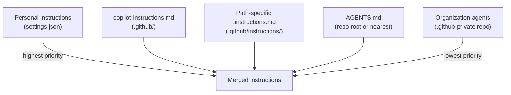

## The problem: agents don't know your project

Every time an AI coding agent opens your repository for the first time, it knows nothing. It doesn't know how to build your project, which framework you're using, where the tests live, what your commit message format is, or that `npm test` silently passes even when nothing runs. It has to explore reading READMEs, scanning file trees, grepping for build scripts, running commands that fail, retrying with different flags.

This exploration is expensive. It burns context window tokens on file reads that could be spent on the actual task. It slows down the agent, increases the chance of errors, and often leads to PRs that fail CI because the agent missed a build step or violated a convention that was never documented.

**AGENTS.md solves this by giving the agent a map of your project before it starts working.** It's a structured Markdown file placed at the root of your repository that describes everything an agent needs to orient itself: how to build, how to test, what conventions to follow, and where the important code lives.

In PDRC terms, AGENTS.md is a **persistent Plan artifact**. It front-loads the context that every Plan phase needs, so agents (and the humans using them) don't waste time rediscovering the same information for every task.

---

## What is AGENTS.md?

AGENTS.md is a simple, open format for guiding coding agents. It was created collaboratively by teams at OpenAI (Codex), Google (Jules), Cursor, Amp, Factory, and others. It's now stewarded by the **Agentic AI Foundation** under the Linux Foundation.

Think of it as a README for robots:

| File | Audience | Purpose |
|------|----------|---------|
| `README.md` | **Humans** | Project description, quick start, contribution guidelines |
| `AGENTS.md` | **AI agents** | Build commands, test steps, architecture map, conventions, gotchas |
| `copilot-instructions.md` | **GitHub Copilot** | Copilot-specific behavioral instructions (higher priority than AGENTS.md in the Copilot stack) |

### Key characteristics

- **Just Markdown.** No proprietary format, no YAML schema, no required fields. Any heading structure works.
- **Cross-agent compatible.** AGENTS.md is recognized by GitHub Copilot, OpenAI Codex, Google Jules, Cursor, Zed, Aider, Warp, Semgrep, Factory, and more.
- **Hierarchical.** In monorepos, place an AGENTS.md at the root and additional ones inside subpackages. The nearest file to the edited code takes precedence.
- **Living documentation.** Treat it like code; update it when you change build steps, add packages, or refactor architecture.

As of 2026, over 60,000 open-source projects on GitHub include an AGENTS.md file — from Apache Airflow to Temporal's Java SDK.

---

## AGENTS.md vs. other instruction files

In Ch 3, we introduced the three types of custom instruction files. Let's clarify how AGENTS.md fits alongside them.

### The instruction hierarchy



When a conflict exists, **higher-priority instructions win**. But in practice, these files serve different purposes and rarely conflict:

| File | What it's for | Who reads it |
|------|--------------|--------------|
| `copilot-instructions.md` | Copilot-specific behavior: response tone, code style preferences, framework conventions | GitHub Copilot (Chat, coding agent, code review) |
| `.instructions.md` | Path-specific rules: "use Zod for validation in this folder", "tests here use Vitest" | GitHub Copilot |
| `AGENTS.md` | Project-wide operational knowledge: how to build, test, deploy; architecture overview; gotchas | **All agents** — Copilot, Codex, Jules, Cursor, etc. |

The mental model: **`copilot-instructions.md` tells Copilot _how to behave_. AGENTS.md tells _any agent_ how your project works.**

If you only use GitHub Copilot, you could put everything in `copilot-instructions.md`. But AGENTS.md has a key advantage: it's agent-agnostic. If your team also uses Cursor, Codex, or any other tool, they all benefit from the same file.

---

## What to include in AGENTS.md

GitHub's official documentation provides a detailed prompt for auto-generating this file (we'll cover that shortly). The prompt categorizes content into three layers. Let's break them down.

### Layer 1: High-level context (what is this project?)

Start with the essentials that help an agent orient itself in seconds:

```markdown
# AGENTS.md

## Project overview
This is a Next.js 15 web application for managing inventory across
multiple warehouses. It uses TypeScript, Prisma for database access,
and tRPC for type-safe API routes.

### Tech stack
- **Runtime**: Node.js 22
- **Framework**: Next.js 15 (App Router)
- **Language**: TypeScript 5.7 (strict mode)
- **Database**: PostgreSQL 16 via Prisma ORM
- **Testing**: Vitest (unit), Playwright (e2e)
- **Linter**: Biome
- **Package manager**: pnpm 10
```

This saves the agent from scanning `package.json`, `tsconfig.json`, and framework config files just to understand the basic stack. It can jump straight into the task.

### Layer 2: Build and validation steps (how do I work here?)

This is the most operationally important section. Document every command the agent might need, in the order they should run:

```markdown
## Setup
pnpm install              # Install dependencies
cp .env.example .env      # Create environment file
pnpm db:generate          # Generate Prisma client
pnpm db:push              # Push schema to local database

## Development
pnpm dev                  # Start dev server on port 3000

## Build
pnpm build                # Type-check + build (runs `next build`)

## Testing
pnpm test                 # Run all Vitest unit tests
pnpm test:e2e             # Run Playwright e2e tests (requires dev server)
pnpm test -- --run -t "test name"   # Run a specific test

## Linting
pnpm lint                 # Run Biome linter with auto-fix
pnpm lint:check           # Check without fixing (used in CI)

## Important notes
- Always run `pnpm install` before building or testing after any
  dependency change.
- The `pnpm db:generate` step is required after any schema change,
  or the TypeScript build will fail with missing type errors.
- E2E tests require the dev server running on port 3000.
- CI runs: lint:check → build → test → test:e2e (in that order).
```

**Why this matters:** GitHub's official guidance says that documenting build steps, including common failures and workarounds, is the single most effective way to reduce rejected PRs from the coding agent. The agent will attempt to run these commands, verify they pass, and fix failures before submitting.

### Layer 3: Architecture and layout (where is everything?)

Help the agent find what it needs without searching:

```markdown
## Project structure
src/
  app/              # Next.js App Router pages and layouts
    api/            # tRPC API routes
    (auth)/         # Authentication-related pages (grouped route)
  components/       # Shared React components
    ui/             # Primitive UI components (Button, Input, etc.)
  lib/              # Shared utilities and configuration
    db.ts           # Prisma client singleton
    auth.ts         # Authentication helpers
  server/           # Server-side code
    routers/        # tRPC routers (one per domain entity)
    services/       # Business logic (called by routers)
prisma/
  schema.prisma     # Database schema
  migrations/       # Migration files (auto-generated)

## Architecture decisions
- tRPC routers call service functions; services contain business logic.
  Routers should NOT contain business logic directly.
- All database access goes through Prisma. No raw SQL unless there's a
  documented performance reason.
- Components in `ui/` are headless — no business logic, no API calls.
- Authentication uses NextAuth.js with JWT strategy.

## CI/CD pipeline
The GitHub Actions workflow (`.github/workflows/ci.yml`) runs on every PR:
1. Install dependencies (`pnpm install --frozen-lockfile`)
2. Lint (`pnpm lint:check`)
3. Type-check and build (`pnpm build`)
4. Unit tests (`pnpm test`)
5. E2E tests (`pnpm test:e2e`)

A PR cannot merge unless all steps pass.
```

---

## Monorepo strategy: nested AGENTS.md files

In monorepos, a single root-level AGENTS.md often isn't specific enough. Each package has its own build steps, testing framework, and conventions. The solution: **nested AGENTS.md files**.

```
my-monorepo/
├── AGENTS.md                    # Root: shared conventions, monorepo commands
├── packages/
│   ├── api/
│   │   ├── AGENTS.md            # API-specific: Express setup, test DB, migration steps
│   │   └── src/
│   ├── web/
│   │   ├── AGENTS.md            # Web-specific: Next.js, component patterns, e2e tests
│   │   └── src/
│   └── shared/
│       ├── AGENTS.md            # Shared lib: no framework deps, pure functions only
│       └── src/
```

### How precedence works

When an agent edits a file in `packages/api/src/`, it reads:

1. `packages/api/AGENTS.md` (nearest — **highest priority**)
2. `AGENTS.md` (root — lower priority, but still included)

The root file covers shared conventions (commit format, PR guidelines, monorepo tooling). Each package file covers its specific build steps and patterns. This mirrors how human developers think: "the general rules apply everywhere, but this package has its own quirks."

### Root AGENTS.md for a monorepo

```markdown
# AGENTS.md (root)

## Monorepo overview
This is a pnpm workspace monorepo with three packages: `api`, `web`,
and `shared`. Each has its own AGENTS.md with specific setup steps.

## Global commands
pnpm install                          # Install everything
pnpm turbo run build                  # Build all packages
pnpm turbo run test                   # Test all packages
pnpm turbo run test --filter=api      # Test one package

## Commit conventions
- Format: `type(scope): description`
- Types: feat, fix, docs, refactor, test, chore
- Scope: package name (api, web, shared)
- Example: `feat(api): add inventory search endpoint`

## PR guidelines
- Title format: `[package-name] Description`
- Always run `pnpm lint` and `pnpm test` before committing
- One logical change per PR
```

---

## Auto-generating AGENTS.md with the coding agent

You don't have to write AGENTS.md from scratch. GitHub provides an official prompt that instructs the Copilot coding agent to analyze your repository and generate a comprehensive instructions file. This is the recommended starting point for existing projects.

### How to use it

1. Navigate to [github.com/copilot/agents](https://github.com/copilot/agents) (or click the Copilot icon in the GitHub search bar → Agents)
2. Select the target repository from the dropdown
3. Paste the prompt below and submit

GitHub's official prompt (abridged for clarity — the full version is in the [GitHub documentation](https://docs.github.com/en/copilot/how-tos/configure-custom-instructions/add-repository-instructions)):

```text
Your task is to "onboard" this repository to Copilot coding agent by
adding a .github/copilot-instructions.md file that contains information
describing how a coding agent seeing it for the first time can work
most efficiently.

You will do this task only one time per repository and doing a good job
can SIGNIFICANTLY improve the quality of the agent's work, so take your
time, think carefully, and search thoroughly before writing the
instructions.

<Goals>
- Reduce the likelihood of a coding agent PR getting rejected due to
  generating code that fails CI, fails validation, or has misbehavior.
- Minimize bash command and build failures.
- Allow the agent to complete its task more quickly by minimizing the
  need for exploration using grep, find, and code search tools.
</Goals>

<WhatToAdd>
- A summary of what the repository does.
- High level repository information (size, type, languages, frameworks).
- For build, test, lint, and every scripted step: the exact sequence
  of commands, validated by running them.
- Major architectural elements with relative paths.
- CI/CD checks the agent should replicate locally.
</WhatToAdd>
```

The agent will:
1. Inventory the codebase (README, config files, scripts, workflows)
2. Run commands to validate they work
3. Document errors and workarounds
4. Generate the file and open a PR for you to review

> **Important:** The official prompt generates `copilot-instructions.md`, which is Copilot-specific. If you want a cross-agent AGENTS.md, take the generated output and adapt it. Most of the content applies to any agent — the build steps, architecture, and conventions are universal.

### Adapting the output to AGENTS.md

After the coding agent generates `copilot-instructions.md`, you can create AGENTS.md from it:

1. Copy the content to a new `AGENTS.md` file at the repo root
2. Remove any Copilot-specific behavioral instructions (response tone, code generation preferences) — those belong in `copilot-instructions.md`
3. Keep the operational content: build steps, test commands, architecture, conventions
4. Add any agent-agnostic context the prompt might not cover (deployment, environment setup, data seeding)

This way you maintain both files: `copilot-instructions.md` for Copilot-specific behavior, and AGENTS.md for any agent that touches the repo.

---

## Writing an effective AGENTS.md: best practices

### 1. Be imperative, not descriptive

Agents follow instructions better than they interpret descriptions.

| Weak (descriptive) | Strong (imperative) |
|----|-----|
| "The project uses Vitest for testing" | "Run `pnpm test` to execute all tests. Run `pnpm vitest run -t 'test name'` for a specific test." |
| "Biome is configured for linting" | "Always run `pnpm lint` before committing. If lint fails, run `pnpm lint --fix` to auto-fix." |
| "We use conventional commits" | "Format every commit as `type(scope): description`. Valid types: feat, fix, docs, refactor, test, chore." |

### 2. Document the gotchas

The most valuable sections in AGENTS.md are the ones that prevent mistakes a newcomer would make:

```markdown
## Common gotchas
- After changing `prisma/schema.prisma`, you MUST run `pnpm db:generate`
  before building. Otherwise TypeScript will report missing types.
- The `AUTH_SECRET` environment variable must be at least 32 characters.
  Shorter values cause a silent authentication failure.
- E2E tests assume the database is seeded. Run `pnpm db:seed` before
  `pnpm test:e2e`.
- The `shared` package must be built before `api` or `web`. Use
  `pnpm turbo run build` (it respects the dependency graph).
```

### 3. Validate your commands

GitHub's official guidance emphasizes this: **run every command yourself and document the exact sequence that works.** Agents will attempt to execute what you document. If the commands are wrong:

- The agent wastes time debugging your documentation
- Token budget is consumed on error output instead of the actual task
- The resulting PR may fail CI because the agent couldn't run tests locally

### 4. Keep it under 2 pages

AGENTS.md is read before every task. If it's too long, it consumes a significant portion of the context window before the agent even starts working. GitHub's official prompt explicitly constrains output to two pages. Aim for the same.

If you need more detail, use nested AGENTS.md files (for monorepos) or link to detailed docs rather than inlining everything.

### 5. Don't duplicate what's already in other files

If your `CONTRIBUTING.md` already documents the build steps, AGENTS.md can reference it:

```markdown
## Build instructions
Follow the build steps in [CONTRIBUTING.md](./CONTRIBUTING.md#building).
The key commands for quick reference:
- `pnpm install && pnpm build`
- `pnpm test`
```

But be careful: agents parse Markdown links and may follow them, consuming tokens to read the referenced file. A concise summary in AGENTS.md plus a link for details is the best balance.

### 6. Use `CLAUDE.md` or `GEMINI.md` for agent-specific overrides

GitHub also recognizes `CLAUDE.md` and `GEMINI.md` at the repository root for agent-specific instructions. Use these when a particular agent needs different guidance:

```
my-repo/
├── AGENTS.md          # Universal instructions (all agents)
├── CLAUDE.md          # Claude-specific overrides (if needed)
├── .github/
│   └── copilot-instructions.md   # Copilot-specific behavior
```

---

## VS Code integration

In Ch 3, we covered how VS Code uses instruction files. Here's a quick refresher specific to AGENTS.md:

### How VS Code discovers AGENTS.md

When you use the Agent mode in VS Code Chat, Copilot automatically loads instruction files in this order:

1. **Personal instructions** (VS Code settings or `~/.github/copilot-instructions.md`)
2. **Repository instructions** (`copilot-instructions.md` in `.github/`)
3. **Path-specific instructions** (`.instructions.md` files matching the current file)
4. **AGENTS.md** (nearest in the directory tree)

You can verify which instructions are active by checking the references panel in Chat. When AGENTS.md is loaded, it appears in the list of context files.

### Auto-generating via `/init`

VS Code offers a built-in way to generate instruction files:

1. Open the Chat panel (`Shift+Cmd+I`)
2. Type `/init`
3. Copilot analyzes your workspace and generates `copilot-instructions.md` or suggests updating `AGENTS.md`
4. Review the generated content and commit it

This is a quick alternative to the GitHub web-based coding agent approach described above.

---

## A real-world AGENTS.md: woliveiras.com blog

Let's look at a real example: the AGENTS.md file for the woliveiras.com blog (the site you're reading this series on). It follows the patterns we've discussed:

```markdown title="AGENTS.md (abridged from this repository)"
# Blog Post Authoring Guidelines (for AI agents)

This repo is an Astro blog. New posts live in `src/content/blog/*.mdx`
and are validated by the schema in `src/content.config.ts`.

## 1) Where and how to create a post
- Location: create a new `*.mdx` file under `src/content/blog/`.
- Filename/slug: use `kebab-case` (lowercase + hyphens).
- No duplicate H1: do not add `# Title` in the body.

## 2) Frontmatter (required + optional)
- title (string): Title Case is preferred.
- description (string): 1–2 sentences.
- pubDate (date-like string): use ISO `YYYY-MM-DD`.
- published (boolean): use `true` for new posts.
- tags (string[]): required by convention.

## 5) Markdown/MDX conventions used in this repo
- Use `##` for main sections, `###` for subsections.
- Always set the code block language.
- Use Mermaid for diagrams.
- Use tables for comparisons.

## 7) Quality checklist
- Frontmatter validates: required keys present; pubDate is ISO.
- Commands are explicit and use `sh` fences.
- Long posts include `## Conclusion`.
- Tag names are consistent.
```

Notice the structure: it tells an agent what the project is, where content goes, what format to follow, and what the quality bar is. An agent reading this file can immediately start writing a blog post that matches the site's conventions — without exploring the codebase first.

---

## Hands-on: create and validate an AGENTS.md

Let's write an AGENTS.md for the `agent-lab` project from Ch 5 (or adapt this to your own project).

### Step 1: Create the file

```sh
cd agent-lab
cat > AGENTS.md << 'EOF'
# AGENTS.md — agent-lab

## Project overview
A TypeScript calculator library used as a learning project for the
Hands-on Coding Assistants series. Includes basic arithmetic
operations with comprehensive test coverage.

## Tech stack
- Language: TypeScript 5.x (strict mode)
- Runtime: Node.js 22
- Testing: Vitest
- Package manager: npm

## Setup
npm install       # Install dependencies
npx tsc --init    # Initialize TypeScript (already done)

## Build
npx tsc           # Compile TypeScript to JavaScript

## Testing
npx vitest run              # Run all tests
npx vitest run -t "name"    # Run a specific test by name
npx vitest --watch          # Run tests in watch mode

## Project structure
src/
  calculator.ts    # Main module: add, subtract, multiply, divide
src/__tests__/     # Test files (mirror the src/ structure)
.github/
  agents/          # Custom agent definitions (see Ch 5)

## Conventions
- All functions are pure (no side effects, no global state)
- Division by zero throws an Error
- Test each function for: positive numbers, negative numbers,
  zero, large numbers, and decimal precision
- Test files use the pattern: `src/__tests__/<module>.test.ts`

## Common issues
- If TypeScript reports missing types, run `npm install` again.
- `npx tsc` must succeed before running tests.
EOF
```

### Step 2: Validate the commands

Run through each command to verify they work:

```sh
# Verify install
npm install

# Verify build
npx tsc

# Verify tests (if you created them in Ch 5)
npx vitest run
```

If any command fails, update AGENTS.md with the correct command or add a note about the failure and its workaround.

### Step 3: Test with an agent

1. Open the Chat panel in VS Code (`Shift+Cmd+I`)
2. Make sure you're in Agent mode
3. Ask: `What are the build and test commands for this project?`
4. The agent should cite your AGENTS.md and list the exact commands you documented
5. Now ask: `Add a modulus (remainder) function to the calculator, with tests`
6. Observe whether the agent:
   - Follows the conventions (pure function, test file in `__tests__/`)
   - Runs `npx tsc` and `npx vitest run` to validate its changes
   - Matches the testing patterns (positive, negative, zero, edge cases)

### What to verify

- The agent cited AGENTS.md as a reference in its response
- It followed the documented conventions without you having to repeat them
- It ran the documented test commands to verify its work
- The resulting code matches the patterns described in the file

If the agent didn't follow a convention, your AGENTS.md might be too vague. Strengthen the instruction; change "tests should cover edge cases" to "test each function for: positive numbers, negative numbers, zero, large numbers, and decimal precision."

---

## AGENTS.md as a living document

One of the most common mistakes is treating AGENTS.md as a one-time setup. It's not. It's a living document that should evolve with your project:

| Event | What to update |
|-------|---------------|
| **New dependency added** | Update setup commands and any dependency notes |
| **Build step changed** | Update the build/test commands section |
| **New package in monorepo** | Add a nested AGENTS.md for the new package |
| **Architecture refactor** | Update the project structure and architecture decisions |
| **CI pipeline changed** | Update the CI/CD section and validation steps |
| **Common failure discovered** | Add it to the gotchas section ("after doing X, you must do Y") |

A good trigger: whenever a PR fails CI because the agent missed something, check whether AGENTS.md could have prevented it. If yes, update the file in the same PR that fixes the issue.

---

## Common pitfalls

| Pitfall | What happens | Fix |
|---------|-------------|-----|
| **No AGENTS.md at all** | Agent wastes time exploring; PRs fail CI frequently | Create one — even a minimal file with build/test commands helps |
| **Outdated commands** | Agent runs old commands that fail; wastes tokens debugging | Validate commands regularly; update AGENTS.md when build steps change |
| **Too long (5+ pages)** | Consumes too much context window; agent may ignore later sections | Keep it under 2 pages; use nested files for monorepos |
| **Only descriptions, no commands** | Agent knows "we use Vitest" but not the exact command to run tests | Always include the exact `pnpm`/`npm` commands, not just tool names |
| **Duplicated across files** | `copilot-instructions.md` and AGENTS.md say conflicting things | Separate concerns: behavior in `copilot-instructions.md`, operations in AGENTS.md |
| **No gotchas section** | Agent hits the same traps a new developer would | Document every "you must do X before Y" that isn't obvious from the code |

---

## Key takeaways

1. **AGENTS.md is a README for robots.** It gives every agent — Copilot, Codex, Jules, Cursor, and more. The project context they need before starting work.
2. **Three layers of content.** Project overview (what is this?), build/test commands (how do I work?), and architecture/conventions (where is everything?).
3. **Be imperative and specific.** "Run `pnpm test`" is better than "the project uses Vitest." Document exact commands, validated by running them yourself.
4. **Use nested files in monorepos.** The nearest AGENTS.md to the edited file takes precedence, so each package can have tailored instructions.
5. **Auto-generate, then refine.** Use the coding agent or `/init` to generate a first draft, then validate commands and add gotchas from your experience.
6. **Treat it as living documentation.** Update AGENTS.md whenever build steps, conventions, or architecture change.

In Ch 7, we'll explore **repository custom instructions** with `copilot-instructions.md` and path-specific `.instructions.md` files — the complement to AGENTS.md that gives Copilot-specific behavioral guidance for different parts of your codebase.

---

## References

### Official documentation

- [GitHub Docs — Adding repository custom instructions](https://docs.github.com/en/copilot/how-tos/configure-custom-instructions/add-repository-instructions) — creating `copilot-instructions.md`, path-specific instructions, AGENTS.md, and the auto-generation prompt
- [AGENTS.md — Official website](https://agents.md) — specification, FAQ, examples, and list of compatible tools
- [AGENTS.md — GitHub repository](https://github.com/agentsmd/agents.md) — source code, sample file, contributor list

### Community resources

- [GitHub code search: AGENTS.md files](https://github.com/search?q=path%3AAGENTS.md+NOT+is%3Afork+NOT+is%3Aarchived&type=code) — 60,000+ real-world examples from open-source projects
- [Apache Airflow — AGENTS.md](https://github.com/apache/airflow/blob/-/AGENTS.md) — example from a large, mature project with complex build steps
- [OpenAI Codex — AGENTS.md](https://github.com/openai/codex/blob/-/AGENTS.md) — example from the Codex CLI tool itself

### Related chapters

- Ch 3 — Setup and practical integration (custom instructions overview, three file types)
- Ch 5 — Custom agents & sub-agents (`.agent.md` files reference AGENTS.md for project context)
- Ch 7 — Repository custom instructions (`copilot-instructions.md` and `.instructions.md` in depth)
