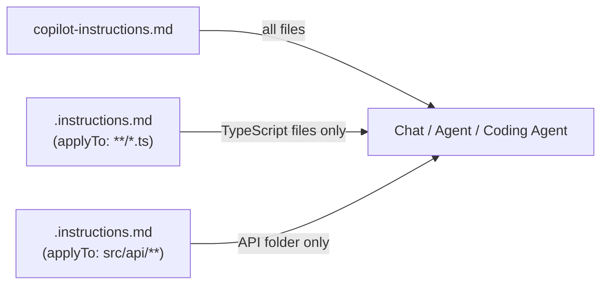
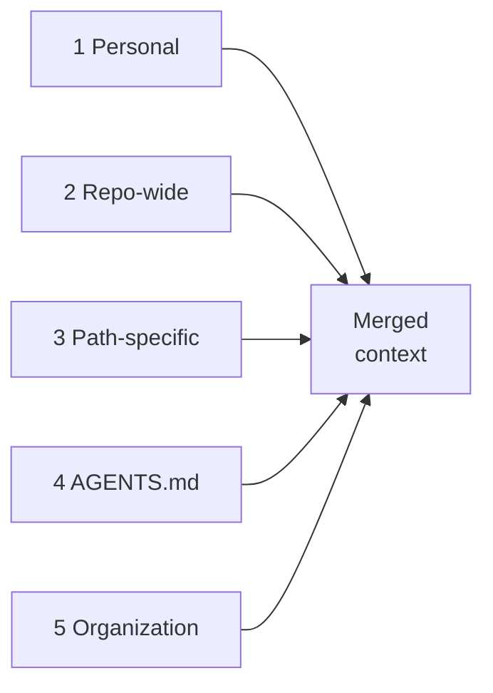

## Why repository instructions exist

In Ch 6, we covered AGENTS.md — a cross-agent file that tells _any_ coding agent how your project works: build steps, architecture, conventions. But AGENTS.md is intentionally agent-agnostic. It doesn't control how Copilot generates code, what tone it uses in reviews, or whether it should prefer functional patterns over classes in a specific folder.

**Repository custom instructions** fill that gap. They're Copilot-specific files that shape how Copilot _behaves_; its coding style, framework preferences, error handling patterns, and review criteria. While AGENTS.md says "here's how to build the project," custom instructions say "when you write code here, follow these rules."

In PDRC terms, custom instructions are **persistent constraints for the Delegate phase**. They ensure that every time you delegate a task to Copilot, the same conventions, patterns, and quality standards apply without you having to repeat them in every prompt.

---

## The two types of repository instructions

GitHub Copilot supports two file-based instruction types at the repository level:

| Type | File | Location | Scope |
|------|------|----------|-------|
| **Repository-wide** | `copilot-instructions.md` | `.github/` | Every Copilot interaction in the repo |
| **Path-specific** | `*.instructions.md` | `.github/instructions/` (or custom paths) | Only when the agent works on files matching an `applyTo` glob |

Both are Markdown files with natural-language instructions. Both are automatically detected and included in the chat context. The difference is scope: one applies everywhere, the other is conditional.

### Where each type applies



When multiple instruction files apply to the same request, Copilot merges them all into the context. Higher-priority sources override lower ones when they conflict.

---

## `copilot-instructions.md`: repository-wide instructions

This is the simplest and most impactful file. It applies to every Copilot interaction — Chat, Agent mode, coding agent PRs, and (with some caveats) code review.

### Where to place it

```
your-repo/
└── .github/
    └── copilot-instructions.md
```

The file must be named exactly `copilot-instructions.md` and must live in the `.github/` directory at the root of the repository.

### How to create it

**Option A: Via VS Code UI**

1. Open the Chat panel (`Shift+Cmd+I`)
2. Type `/init` in the chat input
3. Copilot analyzes your workspace and generates a `copilot-instructions.md` based on your project structure
4. Review the generated content — it's a starting point, not the final version
5. Commit the file to version control

**Option B: Via VS Code menu**

1. In the Chat view, click the **gear icon** (Configure Chat)
2. Select **Chat Instructions**
3. Click **New instruction file**
4. Choose **Workspace** and name it `copilot-instructions`

**Option C: Create it manually**

```sh
mkdir -p .github
touch .github/copilot-instructions.md
```

> **Tip:** Type `/instructions` in the chat input to quickly access the Configure Instructions menu.

### What to include

Repository-wide instructions work best for rules that apply everywhere:

```markdown title=".github/copilot-instructions.md"
# Project conventions

## Language and framework
- This project uses TypeScript 5.7 with strict mode enabled.
- Frontend: React 19 with Server Components (Next.js 15 App Router).
- Backend: tRPC for type-safe API routes.
- Use `date-fns` instead of `moment.js` — moment.js is deprecated and
  increases bundle size.

## Code style
- Use functional components with hooks. No class components.
- Prefer named exports over default exports.
- Use `const` for all variable declarations unless reassignment is needed.
- Error handling: always use custom error classes, never throw raw strings.

## Naming conventions
- React components: PascalCase (`UserProfile.tsx`)
- Utility functions: camelCase (`formatCurrency.ts`)
- Constants: UPPER_SNAKE_CASE (`MAX_RETRY_COUNT`)
- Test files: `<module>.test.ts` in a `__tests__/` directory mirroring
  the source structure.

## Architecture rules
- Business logic lives in `src/server/services/`. tRPC routers call
  services; they MUST NOT contain business logic directly.
- Database access: Prisma only. No raw SQL unless there's a documented
  performance reason in the PR description.
- All API routes must validate input with Zod schemas.
```

### Writing effective instructions

The VS Code documentation provides excellent guidance. Here's a distilled version:

| Principle | Why | Example |
|-----------|-----|---------|
| **Include the reasoning** | The AI makes better edge-case decisions when it knows _why_ a rule exists | "Use `date-fns` instead of `moment.js` — moment.js is deprecated and increases bundle size" |
| **Show code examples** | Concrete patterns are more effective than abstract rules | "Prefer `export function foo()` over `export default function()`" |
| **Focus on non-obvious rules** | Skip things linters already enforce; spend tokens on what a linter can't catch | Architecture decisions, framework-specific patterns, business logic rules |
| **Keep it concise** | The file is included in every request; long files consume context window tokens | Aim for 1–2 pages max |

---

## `.instructions.md`: path-specific instructions

Path-specific instructions are the precision tool. They activate only when Copilot works on files matching a glob pattern defined in the `applyTo` frontmatter property. This is powerful for repositories where different areas have different conventions.

### Where to place them

```
your-repo/
└── .github/
    └── instructions/
        ├── typescript.instructions.md
        ├── react-components.instructions.md
        ├── api-routes.instructions.md
        └── tests.instructions.md
```

Files must have the `.instructions.md` extension and live in `.github/instructions/` (the default location). You can organize them in subdirectories:

```
.github/
└── instructions/
    ├── frontend/
    │   ├── react.instructions.md
    │   └── styles.instructions.md
    └── backend/
        ├── api.instructions.md
        └── database.instructions.md
```

> **Custom locations:** If you prefer a different folder, configure the `chat.instructionsFilesLocations` setting in VS Code.

### The file format

Each `.instructions.md` file has an optional YAML frontmatter header and a Markdown body:

```markdown title=".github/instructions/typescript.instructions.md"
---
name: TypeScript Standards
description: Coding conventions for TypeScript files
applyTo: "**/*.ts,**/*.tsx"
---

# TypeScript coding standards

- Enable strict mode in all files. Never use `@ts-ignore` without a
  comment explaining why.
- Use type aliases for simple types and interfaces for object shapes.
- Prefer `unknown` over `any`. If `any` is truly needed, add a
  `biome-ignore` comment explaining the reason.
- Use discriminated unions for state management, not boolean flags.
- Generic type parameters must have descriptive names (`TResponse`,
  not `T`), except in trivially simple cases.
```

### Frontmatter properties

| Property | Required | Description |
|----------|----------|-------------|
| `name` | No | Display name in the VS Code UI. Defaults to the filename. |
| `description` | No | Short description shown on hover. Also used for semantic matching — the agent may apply the instructions if the description matches the current task, even without a glob match. |
| `applyTo` | No | Glob pattern(s) defining which files trigger these instructions. Multiple patterns are separated by commas. If omitted, the instructions are never applied automatically (but can be attached manually). |

### Glob pattern reference

The `applyTo` property uses standard glob syntax. Here are common patterns:

| Pattern | Matches |
|---------|---------|
| `**/*.ts` | All `.ts` files in all directories |
| `**/*.ts,**/*.tsx` | All TypeScript and TSX files |
| `src/api/**` | All files under `src/api/` |
| `*.py` | Python files in the root directory only |
| `src/**/*.test.ts` | All test files under `src/` |
| `**` | All files (same as repository-wide, but with the ability to use `excludeAgent`) |

### Practical examples

**React components:**

```markdown title=".github/instructions/react-components.instructions.md"
---
name: React Component Conventions
description: Patterns for React component files
applyTo: "src/components/**/*.tsx,src/app/**/*.tsx"
---

## Component structure
- Use functional components with hooks. No class components.
- One component per file. The filename must match the component name.
- Props type goes above the component: `type Props = { ... }`.
- Export the component as a named export, not a default export.

## Hooks
- Custom hooks live in `src/hooks/` and start with `use`.
- Never call hooks conditionally or inside loops.
- Extract complex state logic into custom hooks.

## Styling
- Use Tailwind CSS utility classes directly.
- For complex class combinations, use the `cn()` helper from
  `src/style-utils.ts`.
- No inline styles or CSS modules.
```

**API routes:**

```markdown title=".github/instructions/api-routes.instructions.md"
---
name: API Route Standards
description: Conventions for backend API route handlers
applyTo: "src/server/**/*.ts,src/app/api/**/*.ts"
---

## Input validation
- Every endpoint MUST validate input using a Zod schema.
- Validation happens at the router level, not inside services.

## Error handling
- Use custom error classes from `src/lib/errors.ts`.
- Never expose internal error details to the client.
- All errors must include a machine-readable `code` field.

## Response format
- Success: `{ data: T }`
- Error: `{ error: { code: string, message: string } }`
- Always return appropriate HTTP status codes.
```

**Test files:**

```markdown title=".github/instructions/tests.instructions.md"
---
name: Testing Conventions
description: Rules for writing and organizing tests
applyTo: "**/*.test.ts,**/*.test.tsx,**/*.spec.ts"
---

## Framework
- Use Vitest for unit and integration tests.
- Use Playwright for end-to-end tests.

## Structure
- Test files mirror the source directory structure in `__tests__/`.
- Each `describe` block maps to a function or component.
- Each `it` block tests a single behavior with a descriptive name.

## Coverage
- Test the happy path, error paths, and edge cases.
- Mock external dependencies (API calls, database) — never test
  against real external services in unit tests.
- Test files must NOT import from other test files.
```

---

## `excludeAgent`: segmenting instructions by consumer

Not all instructions make sense for every Copilot feature. The `excludeAgent` frontmatter property lets you restrict which Copilot feature reads an instruction file. This is available for path-specific `.instructions.md` files.

### Why this matters

Consider a scenario: you want the **coding agent** to follow strict architectural rules when writing code, but you want **code review** to focus on a different set of criteria (like readability and security). Or the reverse, you want code review to enforce specific formatting rules that the coding agent already handles through its linting step.

### How to use it

Add `excludeAgent` to the frontmatter with one of two values:

| Value | Effect |
|-------|--------|
| `"code-review"` | The file is used by the coding agent but **NOT** by code review |
| `"coding-agent"` | The file is used by code review but **NOT** by the coding agent |

**Example: instructions only for the coding agent**

```markdown title=".github/instructions/architecture.instructions.md"
---
name: Architecture Rules
description: Architectural patterns for the coding agent to follow
applyTo: "**"
excludeAgent: "code-review"
---

## Architecture rules (for implementation only)
- New API endpoints go in `src/server/routers/`.
- Business logic goes in `src/server/services/`.
- Routers must not contain business logic.
- Always create a Zod schema in `src/schemas/` for new endpoints.
```

This file is read by the coding agent when writing code, but code review ignores it. Code review doesn't need to know _where_ to create files, it only needs to verify the result.

**Example: instructions only for code review**

```markdown title=".github/instructions/review-criteria.instructions.md"
---
name: Code Review Criteria
description: What to focus on during code reviews
applyTo: "**"
excludeAgent: "coding-agent"
---

## Review focus areas
- Check that all new functions have JSDoc comments.
- Verify that error messages don't expose internal implementation details.
- Flag any use of `any` without a justification comment.
- Ensure new API endpoints have corresponding test files.
- Check that database queries use appropriate indexes.
```

This file is used by code review but ignored by the coding agent. The coding agent follows the architecture instructions instead.

---

## Instruction hierarchy: who wins when they conflict?

When multiple instruction sources exist, Copilot merges them all. But if two instructions contradict each other, priority determines which wins:

| Priority | Source | File / Location | Scope |
|:--------:|--------|----------------|-------|
| **1** (highest) | **Personal** | VS Code settings / user-level instruction files | All your projects |
| **2** | **Repository-wide** | `.github/copilot-instructions.md` | Every interaction in this repo |
| **3** | **Path-specific** | `.instructions.md` with matching `applyTo` | Files matching the glob pattern |
| **4** | **AGENTS.md** | `AGENTS.md` (nearest in directory tree) | Cross-agent operational context |
| **5** (lowest) | **Organization** | `.github-private` repo | Baseline for all org repos |

The merge flow works top-down — every source feeds into the same merged context:



> **Important:** All instruction files are provided to Copilot. Priority only matters when instructions _conflict_. In practice, well-organized instructions rarely conflict because each file covers a different concern.

### Verifying which instructions are active

Two ways to check:

1. **References panel:** After Copilot responds in Chat, expand the "References" section at the top of the response. Any instruction files used will appear in the list.

2. **Diagnostics view:** Right-click in the Chat view and select **Diagnostics**. This shows all loaded instruction files, their source, and any errors.

> **Tip:** If an instruction file isn't appearing, check that:
> - The file is in the correct location (`.github/` for `copilot-instructions.md`, `.github/instructions/` for path-specific files)
> - The `applyTo` glob matches the file you're working on
> - The `chat.includeApplyingInstructions` setting is enabled (it is by default)

---

## Organization-level instructions

In Ch 5, we covered organization-level agents (via the `.github-private` repository). Organization instructions work the same way, but for instruction files instead of agents.

### How to set it up

1. Create a `.github` private repository in your GitHub organization (or use the existing one if you already have org agents)
2. Add a `copilot-instructions.md` file and/or `.instructions.md` files
3. Team members enable discovery in VS Code:

```json
{
  "github.copilot.chat.organizationInstructions.enabled": true
}
```

### What to share at the org level

Organization instructions define the baseline — the minimum standards that apply everywhere:

```markdown title=".github-private/copilot-instructions.md"
# Organization coding standards

## Security
- Never log sensitive data (API keys, tokens, passwords, PII).
- All user input must be validated and sanitized before use.
- Use parameterized queries for all database operations.
- Dependencies must not have known critical vulnerabilities.

## Code quality
- All public functions must have documentation comments.
- Error messages must be user-friendly. Never expose stack traces
  or internal paths to end users.
- No TODO comments in production code without a linked issue number.

## Accessibility
- All interactive elements must be keyboard-accessible.
- Images must have alt text.
- Color must not be the only means of conveying information.
```

Individual repositories can then add more specific instructions that complement (or override) these organization-level defaults.

---

## Hands-on: create and validate instructions for a TypeScript project

Let's build a complete set of instruction files for the `agent-lab` project from previous chapters.

### Step 1: Create the repository-wide instructions

```sh
cd agent-lab
cat > .github/copilot-instructions.md << 'EOF'
# Agent Lab — Copilot Instructions

## Project context
This is a TypeScript calculator library used for learning. It uses
Vitest for testing and Biome for linting.

## Code style
- Use TypeScript strict mode. Never use `any` without a justification.
- Prefer `const` over `let`. Never use `var`.
- Use named exports, not default exports.
- Functions should be pure — no side effects, no global state.

## Error handling
- Throw descriptive Error objects, never raw strings.
- Every error-throwing function must document the error condition in
  a JSDoc comment.

## Naming
- Functions: camelCase (`calculateTax`)
- Types/Interfaces: PascalCase (`CalculatorResult`)
- Constants: UPPER_SNAKE_CASE (`MAX_PRECISION`)
- Test files: `<module>.test.ts` in `src/__tests__/`
EOF
```

### Step 2: Create path-specific instructions for tests

```sh
mkdir -p .github/instructions
cat > .github/instructions/tests.instructions.md << 'EOF'
---
name: Testing Conventions
description: Rules for writing and organizing test files
applyTo: "**/*.test.ts,**/*.spec.ts"
---

## Testing rules
- Use Vitest (describe/it/expect syntax).
- Each `describe` block maps to one function or module.
- Each `it` block tests a single behavior.
- Test name format: "should [expected behavior] when [condition]".

## Coverage requirements
- Test each function for: positive numbers, negative numbers, zero,
  large numbers (>1M), and decimal precision (at least 2 decimal places).
- Test every documented error condition.
- No test should depend on the execution order of other tests.

## Mocking
- Do not mock the functions under test.
- If a function has external dependencies, mock them with `vi.mock()`.
EOF
```

### Step 3: Create instructions for source files

```sh
cat > .github/instructions/source-code.instructions.md << 'EOF'
---
name: Source Code Conventions
description: Patterns for production TypeScript source files
applyTo: "src/**/*.ts"
excludeAgent: "code-review"
---

## Module structure
- One function per export unless they form a cohesive group (e.g., all
  arithmetic operations in a calculator module).
- Every exported function must have a JSDoc comment with:
  - A one-line description
  - `@param` for each parameter
  - `@returns` description
  - `@throws` if the function can throw

## Example

```typescript
/**
 * Divides two numbers.
 * @param a - The dividend.
 * @param b - The divisor.
 * @returns The quotient of a / b.
 * @throws Error if b is zero.
 */
export function divide(a: number, b: number): number {
  if (b === 0) throw new Error("Division by zero");
  return a / b;
}
EOF
```

Note the `excludeAgent: "code-review"`: these instructions guide the coding agent when writing code, but code review uses its own criteria.

### Step 4: Create instructions for code review

```sh
cat > .github/instructions/review-criteria.instructions.md << 'EOF'
---
name: Review Criteria
description: Focus areas for code review
applyTo: "**"
excludeAgent: "coding-agent"
---

## Review checklist
- Every exported function has a JSDoc comment.
- Error handling: functions that can fail throw descriptive Errors.
- No `any` types without a justification comment.
- Test coverage: new functions must have corresponding test files.
- Naming follows project conventions (camelCase functions, PascalCase
  types, UPPER_SNAKE_CASE constants).
- No console.log or debugger statements in production code.
EOF
```

### Step 5: Test the instructions

1. Open VS Code in the `agent-lab` directory
2. Open the Chat panel (`Shift+Cmd+I`)
3. Switch to Agent mode
4. Ask: `Add a power (exponent) function to the calculator module`
5. Observe whether Copilot:
   - Follows the **repository-wide** instructions (named export, TypeScript strict, `const`)
   - Follows the **source code** instructions (JSDoc comment with `@param`, `@returns`, `@throws`)
   - Creates a test file following the **testing** instructions (describe/it structure, edge cases)

6. Check the References panel: you should see `copilot-instructions.md` and the relevant `.instructions.md` files listed

### Step 6: Validate with diagnostics

1. Right-click in the Chat view
2. Select **Diagnostics**
3. Verify that all your instruction files appear in the loaded list
4. Check for any errors (common issue: `applyTo` pattern doesn't match any files)

### What to verify

| File | Expected behavior |
|------|------------------|
| `copilot-instructions.md` | Applied to every request (appears in References) |
| `tests.instructions.md` | Applied only when working on `.test.ts` files |
| `source-code.instructions.md` | Applied when working on `src/` files; NOT used by code review |
| `review-criteria.instructions.md` | Applied during code review; NOT used by the coding agent |

---

## The complete instruction file map

Here's how all the instruction files we've covered across Ch 3, Ch 5, Ch 6, and this chapter fit together:

```
your-repo/
├── AGENTS.md                     # Ch 6: cross-agent project context
├── .github/
│   ├── copilot-instructions.md         # Ch 7: Copilot-wide behavior
│   ├── agents/                         # Ch 5: custom agent personas
│   │   ├── planner.agent.md
│   │   ├── implementer.agent.md
│   │   ├── test-specialist.agent.md
│   │   └── reviewer.agent.md
│   ├── instructions/                   # Ch 7: path-specific rules
│   │   ├── typescript.instructions.md
│   │   ├── react.instructions.md
│   │   ├── api.instructions.md
│   │   └── tests.instructions.md
│   └── prompts/                        # Ch 5: one-shot commands
│       ├── test-this.prompt.md
│       └── explain.prompt.md
```

Each file has a distinct role:
- **AGENTS.md** → "How this project works" (any agent)
- **copilot-instructions.md** → "How to write code here" (Copilot-wide)
- **.instructions.md** → "How to write code _in this folder_" (conditional)
- **.agent.md** → "Who you are and what tools you have" (agent persona)
- **.prompt.md** → "Do this specific task" (one-shot command)

---

## Common pitfalls

| Pitfall | What happens | Fix |
|---------|-------------|-----|
| **Instructions too long** | Consumes context window; later rules may be ignored | Keep each file under 1 page; split into multiple `.instructions.md` files |
| **Conflicting rules** | `copilot-instructions.md` says "use Vitest" but a `.instructions.md` says "use Jest" | Review all files for consistency; use `excludeAgent` to separate concerns |
| **No `applyTo` pattern** | `.instructions.md` file is never applied automatically | Always include `applyTo` unless you intentionally want manual-only attachment |
| **Overlapping glob patterns** | Two files with `applyTo: "**/*.ts"` give contradictory advice | Narrow patterns: one for `src/`, another for `tests/`, etc. |
| **Rules that linters handle** | Wasted tokens on "use semicolons" when ESLint already enforces it | Focus instructions on architecture, patterns, and non-obvious conventions |
| **Never validating** | Instructions file has a typo in `applyTo` and is never loaded | Check the Diagnostics view regularly; verify References after each response |

---

## Key takeaways

1. **`copilot-instructions.md` is your team's coding handbook for Copilot.** It applies to every interaction and defines the baseline conventions for the entire repository.
2. **`.instructions.md` files add precision.** Use them when different parts of the codebase need different rules — frontend vs. backend, test files vs. source code, API routes vs. UI components.
3. **`excludeAgent` separates concerns.** Give the coding agent implementation-focused instructions and code review its own review criteria. They serve different purposes.
4. **The hierarchy resolves conflicts.** Personal > repository > path-specific > AGENTS.md > organization. But well-organized files rarely conflict.
5. **Validate with diagnostics.** Use the Chat Diagnostics view and References panel to verify your instruction files are being loaded and applied correctly.
6. **Keep instructions concise and reasoned.** Include the _why_ behind each rule. Show code examples. Skip what linters already enforce.

In Ch 8, we'll explore **Agent Skills**, a modular, conditionally-activated capabilities that give your agents specialized knowledge (like debugging GitHub Actions or working with specific APIs) only when the task calls for it.

---

## References

### Official documentation

- [VS Code — Custom instructions](https://code.visualstudio.com/docs/copilot/customization/custom-instructions) — types of instruction files, `.instructions.md` format, `applyTo` patterns, instruction priority, tips for effective instructions
- [GitHub Docs — Adding repository custom instructions](https://docs.github.com/en/copilot/how-tos/configure-custom-instructions/add-repository-instructions) — `copilot-instructions.md`, path-specific instructions, `excludeAgent`, auto-generation prompt
- [GitHub Docs — Custom instructions support matrix](https://docs.github.com/en/copilot/reference/custom-instructions-support) — which instruction types work in which environments (VS Code, GitHub.com, JetBrains, etc.)
- [GitHub Docs — Adding organization custom instructions](https://docs.github.com/en/copilot/how-tos/configure-custom-instructions/add-organization-instructions) — sharing instructions across repositories via `.github-private`

### Community resources

- [GitHub — Awesome Copilot](https://github.com/github/awesome-copilot) — community-contributed instructions, prompts, and custom agents
- [GitHub — Custom instructions tutorial](https://docs.github.com/en/copilot/tutorials/use-custom-instructions) — using custom instructions to unlock the power of Copilot code review

### Related chapters

- Ch 3 — Setup and practical integration (overview of the three instruction file types)
- Ch 5 — Custom agents & sub-agents (`.agent.md` files and how they reference instructions)
- Ch 6 — AGENTS.md & project context (cross-agent instructions vs. Copilot-specific instructions)
- Ch 8 — Agent Skills & modular expertise (conditionally-activated capabilities)
