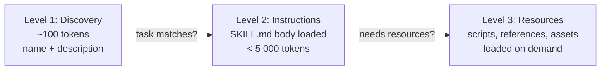
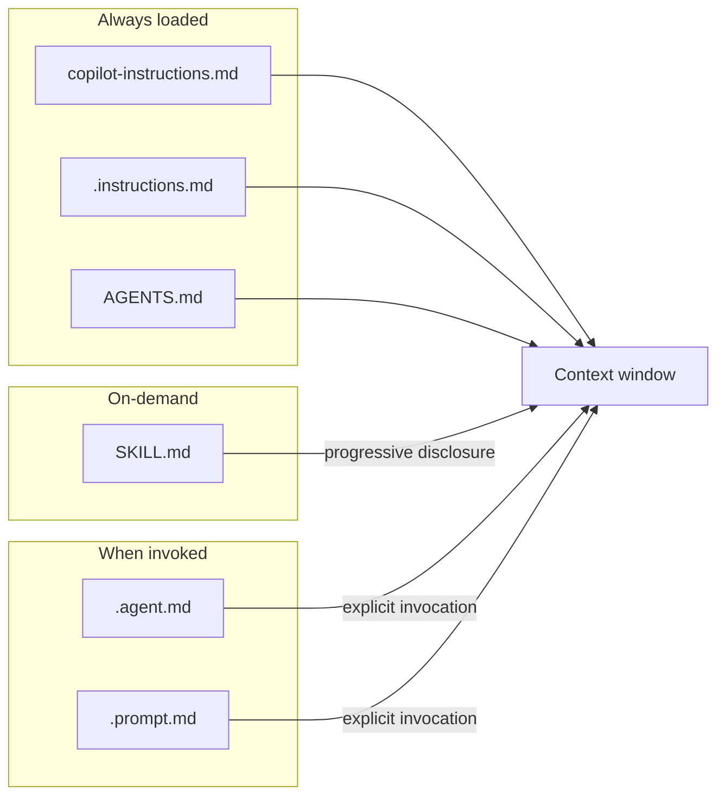

## From static instructions to on-demand capabilities

In the last three chapters we built an instruction stack: AGENTS.md for cross-agent project context, `copilot-instructions.md` for Copilot-wide conventions, and `.instructions.md` files for path-specific rules. That stack defines **how your agent should behave all the time**. But real work is spikier than that. Debugging a flaky GitHub Actions workflow, generating PDF invoices, running a database migration; these are specialized tasks that need specialized knowledge, and loading that knowledge on every single prompt would waste context tokens on irrelevant material.

**Agent Skills solve this.** A skill is a folder of instructions, scripts, and resources that the agent discovers at startup but only loads when the task calls for it. You can think of skills as plug-in expertise: modular, conditionally-activated, and reusable across tools.

In PDRC terms, skills extend the **Delegate** phase. Instead of pasting detailed how-to content into every prompt, you teach the agent a procedure once and let it pull that procedure in whenever it recognizes the pattern. Less repetition, more reliable results.

---

## What are Agent Skills?

An Agent Skill is a directory containing at minimum a `SKILL.md` file. A Markdown file with YAML frontmatter that describes what the skill does, when to use it, and step-by-step instructions for the task. Optionally, the directory can include scripts, reference documents, templates, and other resources.

```
.github/skills/webapp-testing/
├── SKILL.md               # Required — instructions and metadata
├── scripts/
│   └── run-tests.sh       # Optional — executable scripts
├── references/
│   └── REFERENCE.md        # Optional — detailed technical docs
├── examples/
│   └── login-test.ts       # Optional — example files
└── assets/
    └── test-schema.json    # Optional — templates, data files
```

Agent Skills is an **open standard** created by Anthropic, released at [agentskills.io](https://agentskills.io/), and adopted by a growing ecosystem of tools. As of 2025, skills are supported by VS Code (GitHub Copilot), Claude Code, Gemini CLI, Cursor, Roo Code, Databricks, TRAE, and others. A skill you write for one tool works in any compatible agent — no vendor lock-in.

### How does the agent use skills?

Skills use a three-level **progressive disclosure** system. This is crucial for understanding why skills scale better than dumping everything into instruction files:



| Level | What loads | When | Token cost |
|-------|-----------|------|------------|
| **1 — Discovery** | `name` and `description` from every skill's frontmatter | Always (at startup) | ~100 tokens per skill |
| **2 — Instructions** | Full `SKILL.md` body for one skill | When the agent determines the task matches the skill's description (or when you invoke it manually via `/`) | Up to ~5 000 tokens |
| **3 — Resources** | Scripts, reference docs, templates, assets inside the skill directory | Only when the instructions reference them | Variable |

This means you can install dozens of skills in a repository and the cost is only ~100 tokens per skill at discovery time. The agent loads detailed instructions only for the skills it actually needs. Compare this with custom instructions, which are **always** loaded into context (or at least for every matching glob pattern).

---

## Skills vs. custom instructions

These two mechanisms complement each other, but serve different purposes:

| | **Agent Skills** | **Custom instructions** |
|---|---|---|
| **Purpose** | Teach specialized capabilities and workflows | Define coding standards and guidelines |
| **Scope** | Task-specific, loaded on-demand | Always applied (or via glob patterns) |
| **Content** | Instructions + scripts + examples + resources | Instructions only |
| **Portability** | Open standard — works across VS Code, Copilot CLI, Claude Code, Gemini CLI, and more | VS Code-specific (`.instructions.md`) or GitHub-specific (`copilot-instructions.md`) |
| **Activation** | Automatic (agent matches task to description) or manual (`/skill-name`) | Automatic (always on, or glob match) |

**Use skills when:**
- The task is specialized and doesn't apply to every prompt (debugging CI, generating PDFs, running migrations)
- You need to include scripts or reference files alongside instructions
- You want portability across multiple AI tools
- The procedure is complex enough to benefit from progressive disclosure

**Use custom instructions when:**
- The rule applies to _every_ interaction ("use TypeScript strict mode", "prefer pnpm")
- You're defining coding standards, naming conventions, or review guidelines
- The scope is path-based ("all files in `src/api/` follow this pattern")

In practice, most projects benefit from both. Custom instructions define the baseline; skills add specialized expertise on top.

---

## Project skills vs. personal skills

VS Code searches for skills in two locations:

| Type | Location | Visibility | Use case |
|------|----------|-----------|----------|
| **Project skills** | `.github/skills/` in your repository | Shared with team via git | Team workflows: running project-specific tests, deployment steps, CI debugging |
| **Personal skills** | `~/.copilot/skills/` in your home directory | Private to you | Personal workflows: your preferred code review process, your note-taking template |

VS Code also recognizes skills in `.claude/skills/` and `.agents/skills/` (both project and personal), since it supports the cross-agent standard.

### Additional skill locations

You can configure extra directories where VS Code looks for skills using the `chat.agentSkillsLocations` setting. This is useful for:

- **Sharing skills across projects:** Point to a central `~/skills/` directory you maintain
- **Team skill libraries:** Mount a shared network directory or symlink a monorepo's skills folder

```json
// settings.json
{
  "chat.agentSkillsLocations": [
    "~/my-shared-skills"
  ]
}
```

---

## The SKILL.md file format

Every skill requires a `SKILL.md` file with two parts: a YAML frontmatter header and a Markdown body.

### Frontmatter (required fields)

```markdown
---
name: github-actions-debugging
description: >
  Diagnoses and fixes failing GitHub Actions workflows. Use when a CI pipeline
  fails, a workflow run shows errors, or the user mentions GitHub Actions,
  CI failures, or workflow debugging.
---
```

| Field | Required | Rules |
|-------|----------|-------|
| `name` | Yes | 1–64 characters. Lowercase letters, numbers, and hyphens only. Must not start or end with `-`. Must not contain `--`. **Must match the parent directory name.** |
| `description` | Yes | 1–1 024 characters. Describe both what the skill does **and when to use it**. Include specific keywords the agent can match against. |

The `description` is the most important field. The agent uses it at Level 1 (discovery) to decide whether to load the skill. Be specific:

```yaml
# Good — tells the agent both capability and trigger conditions
description: >
  Extracts text and tables from PDF files, fills PDF forms, and merges
  multiple PDFs. Use when working with PDF documents or when the user
  mentions PDFs, forms, or document extraction.

# Bad — too vague for accurate matching
description: Helps with PDFs.
```

### Frontmatter (optional fields)

| Field | Purpose | Example |
|-------|---------|---------|
| `argument-hint` | Hint text shown when the skill is invoked as a slash command | `[workflow file] [run URL]` |
| `user-invokable` | Controls whether the skill appears in the `/` slash command menu. Default: `true` | `false` (hides from menu but still auto-activates) |
| `disable-model-invocation` | Controls whether the agent can auto-load the skill. Default: `false` | `true` (manual `/` only) |
| `license` | License for the skill | `Apache-2.0` |
| `compatibility` | Environment requirements | `Requires git and gh CLI` |
| `metadata` | Arbitrary key-value pairs | `author: my-team` |

### Invocation control matrix

The combination of `user-invokable` and `disable-model-invocation` gives you four modes:

| `user-invokable` | `disable-model-invocation` | `/` menu | Auto-activate | Best for |
|---|---|---|---|---|
| `true` (default) | `false` (default) | Yes | Yes | General-purpose skills |
| `false` | `false` | No | Yes | Background knowledge the agent loads when relevant |
| `true` | `true` | Yes | No | Skills you only want to run on demand |
| `false` | `true` | No | No | Effectively disabled |

### Body (instructions)

The body contains everything the agent needs to perform the task. Write it as if you're onboarding a new teammate who's never done this task before:

```markdown
---
name: webapp-testing
description: Runs and debugs tests for the web application using Vitest and Playwright.
---

# Web Application Testing

## When to use this skill

Use this skill when:
- Running unit tests, integration tests, or E2E tests
- Debugging test failures
- Adding new test coverage

## Prerequisites

- Node.js 20+ installed
- pnpm as package manager (do NOT use npm or yarn)

## Running tests

### Unit and integration tests (Vitest)

Run all tests:

pnpm test

Run tests for a specific file:

pnpm vitest run src/utils/parser.test.ts

### E2E tests (Playwright)


pnpm exec playwright test

## Common issues

| Symptom | Cause | Fix |
|---------|-------|-----|
| `Cannot find module` | Missing dependency | Run `pnpm install` first |
| Timeout in Playwright | Slow CI environment | Increase timeout in `playwright.config.ts` |

## Reference files

- See [test utilities](./scripts/test-helpers.ts) for shared test helpers
- See [fixture data](./assets/fixtures/) for test fixtures
```

**Tips for effective skill bodies:**

1. **Structure with headings.** The agent parses Markdown — use `##` sections for different aspects of the task.
2. **Include runnable commands.** Copy-pastable commands with expected output reduce trial-and-error.
3. **Add a "Common issues" section.** This prevents the agent from getting stuck on known problems.
4. **Reference companion files with relative paths.** Link to scripts and references in the same skill directory: `[helper script](./scripts/helper.sh)`.
5. **Keep it under 500 lines.** If larger, move detailed material into `references/` files and link to them. Progressive disclosure works at the file level too.

---

## Optional directories

A skill can include companion directories alongside `SKILL.md`:

### `scripts/`

Executable code the agent can run. Scripts should be self-contained, include helpful error messages, and handle edge cases. Common languages: Bash, Python, JavaScript/TypeScript.

```bash
# .github/skills/db-migration/scripts/check-migration.sh
#!/bin/bash
set -euo pipefail

echo "Checking pending migrations..."
npx prisma migrate status

if [ $? -ne 0 ]; then
  echo "ERROR: There are pending migrations. Run 'npx prisma migrate dev' first."
  exit 1
fi

echo "All migrations are up to date."
```

### `references/`

Additional documentation the agent reads on demand. Keep individual files focused, smaller files use less context:

- `REFERENCE.md` — detailed technical reference
- Domain-specific files (`aws-permissions.md`, `api-schema.md`)

### `assets/`

Static resources: templates, configuration templates, data files, schemas, images.

---

## Creating a skill step by step

### Option A: using the `/skills` command

The fastest way to start:

1. Open Copilot Chat (`Cmd+Shift+I` on macOS or `Ctrl+Shift+I` on Windows/Linux).
2. In the chat input box, type `/skills`.
3. A **Configure Skills** menu appears. Select **Create a new skill**.
4. Choose where to create the skill: **Project** (`.github/skills/`) or **Personal** (`~/.copilot/skills/`).
5. Enter a name for your skill (e.g., `webapp-testing`).
6. VS Code creates the directory and a `SKILL.md` template file. Edit it with your instructions.

### Option B: manual creation

1. Create the directory: `.github/skills/your-skill-name/`
2. Create a `SKILL.md` file inside it.
3. Add YAML frontmatter with `name` (must match directory name) and `description`.
4. Write the body with step-by-step instructions.
5. Optionally, add `scripts/`, `references/`, or `assets/` directories.
6. Commit to version control so the team benefits.

After creating a skill, verify it's recognized:

1. Open Copilot Chat.
2. Type `/` in the input box.
3. Your skill should appear in the list alongside prompt files.

---

## Using skills

### Automatic activation

When you send a prompt to Copilot, the agent compares your request against the `description` of every installed skill. If it finds a match, it loads the `SKILL.md` body automatically. You don't need to do anything, just describe your task naturally and the agent will pull in the relevant expertise.

> "The CI pipeline is failing on the `deploy.yml` workflow. Can you debug it?"

If you have a `github-actions-debugging` skill installed, the agent recognizes keywords like "CI", "failing", "workflow", and auto-loads the skill.

### Manual invocation via slash commands

Type `/` in the chat input to see all available skills (and prompt files). Select a skill to invoke it explicitly. You can add context after the command:

```
/github-actions-debugging the workflow in .github/workflows/deploy.yml is timing out
```

```
/webapp-testing for the login page
```

The `argument-hint` frontmatter field controls the placeholder text your users see in the input box when they select the skill.

### When does each mode make sense?

| Scenario | Recommended mode |
|----------|-----------------|
| General-purpose skill useful across many tasks | Auto-activate + slash command (defaults) |
| Background knowledge only relevant sometimes | `user-invokable: false` — agent loads it automatically, no clutter in the `/` menu |
| Dangerous operation (deletes data, deploys) | `disable-model-invocation: true` — require explicit `/` invocation |

---

## Using shared skills

The community is building reusable skills you can adopt:

- [**github/awesome-copilot**](https://github.com/github/awesome-copilot) — community-contributed skills, custom agents, instructions, and prompts
- [**anthropics/skills**](https://github.com/anthropics/skills) — reference skills from Anthropic

To use a shared skill:

1. Browse the repository and find a skill that matches your need.
2. Copy the skill directory into your `.github/skills/` folder (or `~/.copilot/skills/` for personal use).
3. Review the `SKILL.md` — understand what it does, verify any scripts, adjust for your project.
4. Optionally customize: change commands to match your build tool, add project-specific context.
5. Commit and push.

> **Always review shared skills before using them.** Skills can include scripts that the agent will execute. VS Code provides terminal execution controls (including auto-approve allow-lists), but you should understand what a skill does before installing it.

---

## Putting it all together: the complete customization map

With Ch 3 through Ch 8, you've now seen every customization mechanism. Here's the full picture:

| File | Loaded when | Scope | Primary purpose |
|------|-------------|-------|-----------------|
| `copilot-instructions.md` | Every Copilot interaction | Repository-wide | Coding standards, conventions |
| `.instructions.md` | File matches `applyTo` glob | Path-specific | Folder/file-type rules |
| `AGENTS.md` | Every agent interaction | Cross-agent | Build steps, architecture, gotchas |
| `SKILL.md` (project) | Task matches description | Task-specific | Specialized workflows, scripts |
| `SKILL.md` (personal) | Task matches description | Personal | Your private workflows |
| `.agent.md` | Explicitly invoked | Agent-specific | Agent personas and tool scoping |
| `.prompt.md` | Explicitly invoked | One-shot | Reusable prompts with arguments |

These files feed into Copilot's context window through three loading mechanisms:




---

## Hands-on: build a GitHub Actions debugging skill

Let's create a practical skill that helps Copilot diagnose and fix failing GitHub Actions workflows. This skill will include instructions and a helper script.

### Step 1: create the directory structure

In your project root, create the skill directory:

```sh
mkdir -p .github/skills/github-actions-debugging/scripts
```

### Step 2: create the SKILL.md file

Create `.github/skills/github-actions-debugging/SKILL.md` with the following content:

```markdown
---
name: github-actions-debugging
description: >
  Diagnoses and fixes failing GitHub Actions workflows. Use when a CI/CD
  pipeline fails, a workflow run shows red, or the user mentions GitHub Actions,
  CI failures, workflow errors, or deployment issues. Can read workflow files,
  analyze run logs, and suggest fixes.
argument-hint: "[workflow file or run URL]"
---

# GitHub Actions Debugging

## When to use this skill

Activate when the user:
- Reports a failing CI/CD pipeline
- Asks about GitHub Actions errors or workflow issues
- Wants to debug a specific workflow run
- Needs help writing or fixing a workflow file

## Debugging procedure

### 1. Identify the failing workflow

Look for workflow files in `.github/workflows/`. Common files:
- `ci.yml` or `test.yml` — continuous integration
- `deploy.yml` — deployment
- `release.yml` — release automation

### 2. Read the workflow file

Check for common issues:
- **Wrong runner image:** ensure `runs-on` matches the project's requirements
- **Missing environment variables:** check that secrets and env vars are referenced correctly
- **Incorrect action versions:** outdated actions may break (e.g., `actions/checkout@v3` vs `@v4`)
- **Path filters:** `on.push.paths` or `on.pull_request.paths` may exclude the changed files

### 3. Analyze the error

If a run URL or error message is provided, look for:
- **Exit code != 0:** Which step failed? Read the step's `run` command.
- **Timeout:** Check if the job has a `timeout-minutes` value or if a step hangs.
- **Permission errors:** The `permissions` block may be missing required scopes (e.g., `contents: write` for pushing).
- **Cache misses:** Actions like `actions/cache` may need updated keys.

### 4. Check the helper script

Run the diagnostic script to gather workflow metadata:

bash .github/skills/github-actions-debugging/scripts/diagnose.sh

### 5. Common fixes

| Problem | Fix |
|---------|-----|
| `actions/checkout` fails | Update to `@v4`; ensure `fetch-depth: 0` for full history |
| Node.js version mismatch | Update `actions/setup-node` to match `.nvmrc` or `engines` |
| `GITHUB_TOKEN` permission denied | Add `permissions:` block with required scopes |
| Cache not restoring | Check `key` and `restore-keys` patterns; clear cache via GitHub UI |
| Workflow not triggering | Verify `on:` trigger events and path filters |
| Secret not found | Ensure the secret exists in repo/org settings and is spelled correctly |

## Reference

- [GitHub Actions documentation](https://docs.github.com/en/actions)
- [Workflow syntax reference](https://docs.github.com/en/actions/reference/workflow-syntax-for-github-actions)
```

### Step 3: create the helper script

Create `.github/skills/github-actions-debugging/scripts/diagnose.sh`:

```bash
#!/bin/bash
set -euo pipefail

echo "=== GitHub Actions Diagnostic ==="
echo ""

# List all workflow files
echo "## Workflow files found:"
if [ -d ".github/workflows" ]; then
  for f in .github/workflows/*.{yml,yaml}; do
    [ -f "$f" ] && echo "  - $f"
  done
else
  echo "  ERROR: No .github/workflows directory found."
  exit 1
fi

echo ""

# Check for common issues in each workflow
echo "## Quick scan:"
for f in .github/workflows/*.{yml,yaml}; do
  [ -f "$f" ] || continue
  echo ""
  echo "### $f"

  # Check for outdated checkout action
  if grep -q "actions/checkout@v[0-2]" "$f" 2>/dev/null; then
    echo "  WARNING: Uses outdated actions/checkout version. Consider updating to @v4."
  fi

  # Check for missing permissions block
  if ! grep -q "permissions:" "$f" 2>/dev/null; then
    echo "  NOTE: No explicit permissions block. Uses default token permissions."
  fi

  # Check for hardcoded Node version
  if grep -q "node-version:" "$f" 2>/dev/null; then
    NODE_VER=$(grep "node-version:" "$f" | head -1 | sed 's/.*node-version:\s*//' | tr -d "'\"")
    echo "  INFO: Node.js version set to: $NODE_VER"
  fi

  echo "  OK: Basic scan complete."
done

echo ""
echo "=== Diagnostic complete ==="
```

### Step 4: verify recognition

1. Open Copilot Chat (`Cmd+Shift+I`).
2. Type `/` in the input box.
3. Look for **github-actions-debugging** in the list. If it appears, the skill is recognized.

### Step 5: test the skill

Try these prompts to see the skill in action:

**Auto-activation test:**
> "My CI pipeline is failing on the deploy workflow. The checkout step shows a permission error."

The agent should automatically load the skill and follow the debugging procedure.

**Manual invocation test:**
```
/github-actions-debugging the test workflow in .github/workflows/ci.yml fails with exit code 1
```

**Script execution test:**
> "Run the GitHub Actions diagnostic script and tell me what it finds."

The agent should execute the `diagnose.sh` script and analyze the output.

### Step 6: iterate and improve

After using the skill a few times, you'll notice gaps. Maybe you need a section on matrix builds, or caching strategies, or specific workflow patterns your team uses. Update the `SKILL.md`, add more reference files, and commit. Skills are living documents — the same principle we applied to AGENTS.md in Ch 6.

---

## Common pitfalls

| Pitfall | What happens | Fix |
|---------|-------------|-----|
| **`name` doesn't match directory** | Skill is silently ignored | Ensure the `name` field exactly matches the parent directory name |
| **Vague `description`** | Agent fails to auto-activate for relevant tasks | Include specific keywords and trigger conditions in the description |
| **SKILL.md too long** | Consumes too much context when loaded | Keep under 500 lines; move details to `references/` files |
| **Scripts missing shebang or permissions** | Agent can't execute the script | Add `#!/bin/bash` and run `chmod +x` on scripts |
| **No testing after creation** | Skill doesn't work as expected | Always verify with `/` menu and try both auto and manual activation |
| **Putting standards in skills** | Coding standards don't load unless the task matches | Use `copilot-instructions.md` for always-on rules, skills for task-specific capabilities |

---

## Key takeaways

1. **Skills are on-demand expertise.** Unlike custom instructions that are always loaded, skills activate only when the task matches — keeping your context window efficient across dozens of specialized capabilities.
2. **Progressive disclosure is the key insight.** Level 1 costs ~100 tokens per skill. Level 2 loads full instructions only when needed. Level 3 loads scripts and resources only when referenced. You can install many skills without drowning in tokens.
3. **The open standard means portability.** Skills you write for VS Code work in Claude Code, Gemini CLI, and other compatible agents. Write once, use everywhere.
4. **Project skills are shared; personal skills are private.** Use `.github/skills/` for team workflows committed to git. Use `~/.copilot/skills/` for your personal procedures.
5. **Good descriptions drive good activation.** The `description` field is what the agent reads to decide whether to load a skill. Be specific about both capabilities and trigger conditions.
6. **Skills complete the customization picture.** Combined with AGENTS.md, `copilot-instructions.md`, `.instructions.md`, `.agent.md`, and `.prompt.md`, you now have a complete toolkit — from always-on conventions to conditionally-activated expertise to one-shot prompts.

In Ch 9, we shift from customization to application. We'll take everything we've built in Module 1 and put it to work on **test generation** — the highest-impact use case for AI coding assistants, where the Delegate and Review phases of PDRC really shine.

---

## References

### Official documentation

- [VS Code — Agent Skills](https://code.visualstudio.com/docs/copilot/customization/agent-skills) — creating skills, SKILL.md format, progressive disclosure, slash commands, invocation control, shared skills, extension contribution
- [Agent Skills specification](https://agentskills.io/specification) — the open standard: directory structure, frontmatter fields, body content, optional directories, file references, validation
- [Agent Skills overview](https://agentskills.io/) — why Agent Skills, adoption by VS Code/Claude Code/Gemini CLI and 15+ tools, open development under Anthropic

### Community resources

- [GitHub — Awesome Copilot](https://github.com/github/awesome-copilot) — community-contributed skills, custom agents, instructions, and prompts
- [Anthropic — Reference skills](https://github.com/anthropics/skills) — reference skill implementations from Anthropic

### Related chapters

- Ch 5 — Custom agents & sub-agents (`.agent.md` creates personas; skills add capabilities those agents can use)
- Ch 6 — AGENTS.md & project context (always-loaded project context; skills add on-demand task procedures)
- Ch 7 — Repository custom instructions (always-on conventions and path-specific rules; skills are conditionally loaded)
- Ch 9 — Test generation & improvement (first application of skills in practice)
