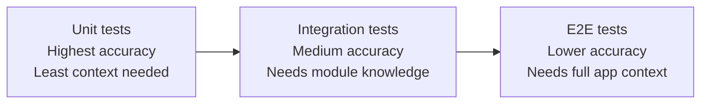
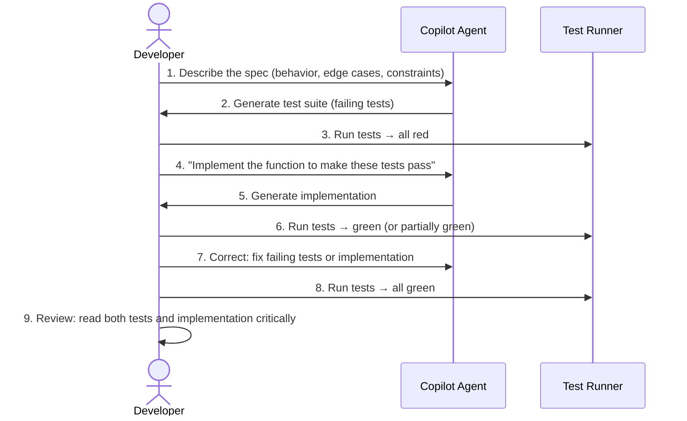

## Welcome to Module 2: applying the PDRC loop

Chapters 3 through 8 gave you the complete customization toolkit: instruction files, custom agents, AGENTS.md, and skills. That was Module 1 — building the foundation. Starting now, Module 2 puts that foundation to work on the tasks that deliver the most value in daily engineering. We begin with the single highest-impact use case for AI coding assistants: **test generation**.

---

## Why test generation is the #1 productivity use case

In GitHub's 2024 developer survey (2,000 respondents across the US, Brazil, India, and Germany), **more than 98% of organizations reported having experimented with using AI coding tools to generate test cases**. The majority of respondents said their organizations use AI for test generation at least "sometimes". No other use case — not code completion, not documentation, not refactoring — showed adoption this universal.

Why? Because test generation sits at the intersection of three forces:

1. **Tests are high-value, low-novelty.** Most test code follows predictable patterns: arrange inputs, act on the system under test, assert on outputs. The cognitive load is in knowing _what_ to test, not in writing the boilerplate.
2. **Tests are the easiest AI output to verify.** You can run a test suite and get a binary answer: it passes or it fails. Compare that to generated application code, where correctness is harder to judge without manual review. This makes the **Review** phase of PDRC fast and unambiguous.
3. **The ROI is immediate and measurable.** Before AI: you had 60% test coverage. After 30 minutes with an agent: you have 85%. The build turns green, the diff is clear, and you can merge with confidence.

In PDRC terms, test generation heavily exercises the **Delegate** and **Review** phases. You delegate the writing of test code to the agent, then review by running the suite. If tests fail or miss cases, you **Correct** and iterate. The Plan phase is lightweight — you already know what code exists and what coverage is missing.

---

## The test generation spectrum

AI can help with testing at multiple levels of granularity. Each level has different strengths, risks, and review strategies:

| Level | What the agent generates | Typical prompt | Review strategy |
|-------|------------------------|----------------|-----------------|
| **Unit tests** | Tests for individual functions/methods in isolation | "Write unit tests for `parseConfig()`" | Run tests, check edge cases covered |
| **Integration tests** | Tests for interactions between modules, services, or layers | "Write integration tests for the user registration flow" | Run tests, verify mocks match real behavior |
| **E2E tests** | Full workflow tests through the UI or API surface | "Write Playwright tests for the login flow" | Run tests against a running app, check flakiness |
| **Property-based tests** | Tests with randomized inputs checking invariants | "Write property tests ensuring `sort()` always returns items in ascending order" | Run many iterations, review invariant definitions |
| **Snapshot tests** | Capture output and compare against stored snapshots | "Add snapshot tests for the `UserCard` component" | Review snapshot files for unintended changes |

### The accuracy gradient

As you move from unit tests to E2E tests, the agent's accuracy tends to decrease:



**Unit tests** are where AI shines brightest. The scope is small, the inputs and outputs are clear, and the agent needs minimal context beyond the function signature and its dependencies. **E2E tests** require understanding the full application (routes, auth, state, timing, selectors), which means more planning upfront and more correction afterward.

The PDRC principle here: **start with the easy wins.** Generate unit tests first. Move to integration tests once the unit layer is solid. Tackle E2E tests only when you have clear specs and a running environment.

---

## AI-assisted TDD: the inverted workflow

Traditional TDD follows the red-green-refactor cycle: write a failing test, make it pass, then clean up. AI-assisted TDD inverts the starting point. Instead of the developer writing every test by hand, you describe the behavior and let the agent generate the test suite. Then _you_ review, adjust, and implement.

### The AI-assisted TDD workflow



### Step by step

**1. Write the spec as a prompt.** Describe what the function/module should do, including edge cases. Be specific about behavior boundaries:

```
Write a comprehensive test suite for a `calculateDiscount` function with these rules:
- Takes `price` (number) and `customerType` ("regular" | "premium" | "vip")
- Regular customers get no discount
- Premium customers get 10% off
- VIP customers get 20% off
- Prices must be positive numbers; throw for negative or zero
- Discount is capped at $100 regardless of customer type
- Return value should be rounded to 2 decimal places
```

**2. Agent generates failing tests.** The agent produces a test file covering the happy paths, edge cases, and error conditions you described. Since the implementation doesn't exist yet, all tests fail.

**3. Ask the agent to implement.** With the tests as a specification, ask the agent to write the implementation. The tests constrain the solution — the agent can't hallucinate behavior that contradicts the test expectations.

**4. Run and correct.** If some tests fail, decide whether the test is wrong (bad expectation) or the implementation is wrong (bug). Correct whichever is at fault. This is the **Correct** phase in action.

**5. Review both sides critically.** Read the tests: are there missing edge cases? Redundant tests? Brittle assertions? Read the implementation: does it handle all cases cleanly? Would you accept this in a code review?

### Why this works

The key insight is that **tests-as-specification constrain the AI's output**. When the agent writes implementation code against a well-defined test suite, hallucinations surface immediately as test failures. The feedback loop is tight and automated.

---

## Generating unit tests in practice

### Providing the right context

The quality of generated tests depends directly on the context you give the agent. Here's what to include:

| Context | Why it matters | How to provide it |
|---------|---------------|-------------------|
| **The source file** | Agent needs to see the function signatures, types, and logic | Open the file in your editor (automatic context) or reference it with `#file` |
| **Existing tests** | Agent follows the established testing patterns and imports | Open or reference an existing test file |
| **Test framework config** | Agent uses the right runner, assertion library, and matchers | Include in `copilot-instructions.md` or reference the config file |
| **Type definitions** | Agent understands input/output shapes for typed languages | Types are usually inferred from the source file; add `#file` for external types |

### A practical prompt

Here's a real-world prompt that generates high-quality unit tests:

```
Write comprehensive unit tests for the `getBlogPosts` function in #file:src/utils.ts.

Use Vitest as the test runner. Follow the patterns in #file:src/utils.test.ts
if it exists, or create a new test file.

Cover:
- Returns only published posts (published: true)
- Sorts posts by date descending (newest first)
- Handles empty collection
- Handles collection with no published posts
- Handles posts with missing optional fields (tags, heroImage)

Use descriptive test names that explain the expected behavior.
```

### What good generated tests look like

After the agent responds, check for these quality signals:

**Good signs:**
- Each test has a descriptive name (`"returns only published posts"`, not `"test 1"`)
- Tests are independent — no shared mutable state between tests
- Edge cases are covered (empty arrays, null values, boundary conditions)
- Assertions are specific (`toBe(3)`, not `toBeTruthy()`)
- Setup/teardown is clean and minimal

**Red flags to correct:**
- Tests that test implementation details (internal variable names, call counts of unobserved functions)
- Overly broad assertions (`expect(result).toBeDefined()` — that doesn't verify _anything_ useful)
- Missing error path tests (what happens with invalid input?)
- Hardcoded values that don't explain _why_ that value is expected
- Tests that depend on execution order

---

## Generating integration tests

Integration tests verify that modules work together correctly. They require more context than unit tests because the agent needs to understand the boundaries between components.

### The integration test prompt pattern

```
Write integration tests for the user registration flow.

The flow involves:
1. `validateInput()` from #file:src/validation.ts — validates email and password
2. `createUser()` from #file:src/db/users.ts — inserts into the database
3. `sendWelcomeEmail()` from #file:src/email/service.ts — sends confirmation email

Test the full flow in `registerUser()` from #file:src/api/registration.ts.

Mock the database and email service. Do NOT mock the validation module —
test it as part of the integration.

Cover:
- Successful registration with valid inputs
- Validation failure with invalid email
- Database failure (duplicate email) — should NOT send email
- Email service failure — user should still be created (eventual consistency)
```

### Key principle: be explicit about boundaries

Notice how the prompt specifies _what to mock and what not to mock_. This is critical for integration tests. Without this guidance, the agent may either mock everything (turning the test into a unit test) or mock nothing (turning it into an E2E test that needs a real database).

The PDRC approach: in the **Plan** phase, decide your mock boundaries before delegating to the agent. The clearer the boundary, the more useful the generated tests.

---

## Generating E2E tests

E2E tests are the most context-hungry. The agent needs to understand routes, selectors, auth flows, and timing behavior. Without sufficient context, generated E2E tests are usually fragile and fail on the first run.

### Making E2E generation work

**1. Provide explicit selectors and routes:**

```
Write Playwright E2E tests for the blog post page.

Routes:
- `/posts/:slug` — individual blog post
- `/tags/:tag` — posts filtered by tag
- `/pages/:page` — paginated post list

Selectors:
- `[data-testid="post-title"]` — post title element
- `[data-testid="post-content"]` — post body
- `[data-testid="tag-link"]` — clickable tag badges

Test:
- Navigating to a known post URL shows the title and content
- Clicking a tag navigates to the correct tag page
- Tag page shows only posts with that tag
```

**2. Use `data-testid` attributes.** If your app doesn't have them, ask the agent to add them first as a separate task. Don't try to generate E2E tests and add test IDs in the same prompt.

**3. Account for async behavior.** Remind the agent about waits:

```
Use `await page.waitForSelector()` before assertions. The blog uses
client-side search that loads asynchronously after page mount.
```

### E2E test review checklist

After the agent generates E2E tests, verify:

| Check | Why |
|-------|-----|
| **No hardcoded waits** (`page.waitForTimeout(5000)`) | Flaky in CI; use explicit waits instead |
| **Selectors use `data-testid`** or stable attributes | CSS classes change; test IDs don't |
| **Tests clean up after themselves** | If a test creates data, it should remove it |
| **Independent of test order** | Each test should work in isolation |
| **Reasonable timeout values** | CI runners are slower than your laptop |

---

## Coverage gap analysis with agents

One of the most underused agent workflows is coverage gap analysis. Instead of asking the agent to "write tests," you give it your current coverage report and ask it to **fill the gaps**.

### Step 1: generate the coverage report

Run your test suite with coverage enabled:

```sh
# Vitest
pnpm vitest run --coverage

# Jest
pnpm jest --coverage

# pytest
python -m pytest --cov=src --cov-report=term-missing
```

### Step 2: feed the report to the agent

Open the coverage report (or the summary) and ask the agent to analyze it:

```
Here's my current test coverage report. Identify the uncovered lines and
branches, then write tests to cover them. Focus on the files with coverage
below 80%.

Prioritize by risk:
1. Error handling paths (catch blocks, error returns)
2. Edge cases (null inputs, empty arrays, boundary values)
3. Conditional branches that are only partially covered
```

### Step 3: review and iterate

The agent generates tests targeting specific uncovered lines. Run coverage again. If gaps remain, repeat with the updated report. In practice, two or three iterations can take a module from 50% to 90%+ coverage.

### A warning about coverage theater

Coverage percentage is a useful signal, but not a quality measure. An agent can generate tests that _execute_ code without _verifying_ behavior:

```typescript
// Bad: this "covers" the function but tests nothing meaningful
it("runs calculateDiscount", () => {
  calculateDiscount(100, "premium");
  // no assertions — coverage goes up, confidence doesn't
});
```

During the **Review** phase, watch for tests that lack meaningful assertions. Every `it()` block should contain at least one `expect()` that verifies a _specific, meaningful_ outcome.

---

## Writing effective test generation prompts

### The five elements of a good test prompt

| Element | What to include | Example |
|---------|----------------|---------|
| **1. Target** | What to test (function, module, flow) | "Write tests for `parseMarkdown()` in `src/parser.ts`" |
| **2. Framework** | Testing tools and conventions | "Use Vitest with `describe`/`it` blocks" |
| **3. Scope** | What level (unit, integration, E2E) | "Unit tests only — mock all external dependencies" |
| **4. Cases** | Specific scenarios to cover | "Cover: valid input, empty string, malformed frontmatter, missing required fields" |
| **5. Patterns** | Existing conventions to follow | "Follow the pattern in `src/utils.test.ts`" |

### Anti-patterns in test prompts

| Anti-pattern | Problem | Better approach |
|-------------|---------|----------------|
| "Write tests for this file" | Too vague — agent guesses what to test | Specify the function and scenarios |
| "Write 100% coverage tests" | Agent writes coverage-chasing tests with weak assertions | Specify meaningful scenarios and let coverage follow |
| "Write tests and fix bugs" | Two tasks in one — agent conflates fixing and testing | Separate: first write tests that expose the bug, then fix the code |
| No framework specified | Agent defaults to its training data (may use Jest when you use Vitest) | Always specify the framework in the prompt or in `copilot-instructions.md` |

### Codifying patterns in instruction files

If your team generates tests frequently (you should), codify the conventions in your instruction files to avoid repeating them in every prompt:

```markdown
<!-- .github/instructions/tests.instructions.md -->
---
applyTo: "**/*.test.{ts,tsx}"
---

## Test conventions

- Use Vitest as the test runner
- Follow AAA pattern: Arrange, Act, Assert
- Use descriptive `it()` names: "should [expected behavior] when [condition]"
- Mock external dependencies with `vi.mock()`
- Never use `any` type in test files — use proper types
- Group related tests in `describe()` blocks
- Each test file should match its source file: `foo.ts` → `foo.test.ts`
```

Now every time the agent works on a test file, these conventions apply automatically. No need to repeat them in prompts. This is Module 1's customization toolkit paying dividends.

---

## When AI-generated tests go wrong

Even with good prompts, AI-generated tests can have problems. Here are the most common failure modes and how to handle them in the **Correct** phase:

### 1. Tests that pass but don't verify behavior

```typescript
// Agent generated this — it "passes" but proves nothing
it("should process the data", () => {
  const result = processData(input);
  expect(result).toBeDefined();
});
```

**Fix:** Ask the agent to strengthen assertions: "Replace `toBeDefined()` with specific value checks. What should `processData(input)` actually return?"

### 2. Tests that are tightly coupled to implementation

```typescript
// Breaks if you refactor the internal implementation
it("should call the internal helper", () => {
  const spy = vi.spyOn(module, "_internalHelper");
  processData(input);
  expect(spy).toHaveBeenCalledTimes(2);
});
```

**Fix:** Test behavior, not implementation. "Rewrite this test to verify the _output_ of `processData`, not the internal function calls."

### 3. Flaky tests with timing assumptions

```typescript
// Fails randomly because setTimeout timing varies
it("should debounce input", async () => {
  triggerInput("hello");
  await new Promise((r) => setTimeout(r, 300));
  expect(getResult()).toBe("hello");
});
```

**Fix:** Use fake timers: "Use `vi.useFakeTimers()` to control time in debounce tests."

### 4. Tests that duplicate existing coverage

The agent might write 15 tests for the same happy path with slightly different data. This adds noise without adding confidence.

**Fix:** "Remove redundant tests. Keep one happy-path test per scenario. Add tests for the uncovered error paths instead."

---

## Hands-on: build a test suite for an untested module

Let's apply everything from this chapter to a realistic scenario. You have a module with zero tests and you want to reach 80%+ coverage using AI-assisted TDD.

### The scenario

We'll use a utility module that has no tests, a common situation in real projects. The goal: go from 0% to 80%+ coverage in one session.

### Step 1: plan what to test

Before opening Chat, take 2 minutes to survey the module:

1. Open the source file and scan for public functions.
2. Note the types of inputs each function takes.
3. Identify branching logic (if/else, switch, try/catch).
4. List the external dependencies (imports from other modules).

Write down a quick inventory:

```
Module: src/utils.ts
Functions: getBlogPosts(), formatDate(), getUniqueTags()
Dependencies: Astro content collections API
Branching: getBlogPosts filters by published, sorts by date
Edge cases: empty collections, posts with missing optional fields
```

This is the **Plan** phase. It takes 2 minutes and saves 10 minutes of back-and-forth with the agent.

### Step 2: generate unit tests (the Delegate phase)

Open Copilot Chat in Agent mode and send a well-structured prompt:

```
Write a comprehensive unit test suite for the following functions
in #file:src/utils.ts:

1. `getBlogPosts()` — fetches and filters blog posts
2. `formatDate()` — formats dates for display
3. `getUniqueTags()` — extracts unique tags from posts

Use Vitest. Mock the Astro content collection API.

For `getBlogPosts()`:
- Returns only posts where published === true
- Sorts by pubDate descending
- Handles empty collection
- Handles no published posts

For `formatDate()`:
- Formats valid dates correctly
- Handles different date formats
- Edge case: invalid date input

For `getUniqueTags()`:
- Extracts unique tags from multiple posts
- Handles posts with no tags
- Handles empty post array
- Returns tags in a consistent order

Create the file at src/utils.test.ts.
```

### Step 3: review the generated tests

After the agent writes the test file:

1. **Read every test name.** Do they describe the behavior clearly?
2. **Check assertions.** Are they specific? (Not just `toBeDefined()`)
3. **Look for missing cases.** Did the agent cover error paths?
4. **Verify mocks.** Are they realistic? Do they match the actual module dependencies?

### Step 4: run the tests

```sh
pnpm vitest run src/utils.test.ts
```

Possible outcomes:

| Result | Action |
|--------|--------|
| All pass | Check coverage: `pnpm vitest run --coverage src/utils.test.ts` |
| Some fail with import errors | Agent may have used wrong import paths — correct and re-run |
| Some fail with assertion errors | Decide: is the test wrong or the implementation wrong? Fix accordingly |
| Most fail | Context was insufficient — give the agent more information about the module's dependencies |

### Step 5: fill coverage gaps (the Correct phase)

If coverage is below 80%, run coverage and give the report to the agent:

```
Here's the coverage output for src/utils.ts. Lines 24-28 and 45-52
are uncovered. Write additional tests to cover those lines.
```

### Step 6: review the full suite

Once tests pass and coverage is at target, do a final review:

1. Read the tests as documentation. Would a new team member understand the module's behavior from the tests alone?
2. Remove any redundant tests. Fewer, clearer tests are better than more tests with overlap.
3. Verify test isolation. No test should depend on another test's output.
4. Commit with a meaningful message: `"Add comprehensive tests for utils module (AI-assisted)"`

---

## Integrating test generation into your daily workflow

Test generation works best as a habit, not a one-off exercise. Here's how to weave it into your daily development:

### 1. Test-first for new features

Every time you build a new feature, start by asking the agent to generate a test suite from the specification. Then implement against those tests. This is the AI-assisted TDD workflow from earlier in this chapter.

### 2. Test-after for existing code

When you encounter untested code, before modifying it, ask the agent to generate a test suite first. The tests serve as a safety net for your changes.

### 3. Coverage check in CI

Add coverage thresholds to your CI pipeline. When a PR drops below the threshold, the agent can generate tests to fill the gap before merge.

### 4. Use a testing skill

In Ch 8, we built Agent Skills for specialized tasks. A testing skill is a natural fit:

```markdown
---
name: test-generation
description: >
  Generates unit, integration, and E2E tests using the project's testing
  framework. Use when the user asks for tests, when coverage is low, or
  when new code is added without tests.
---

# Test Generation

## Testing framework
- Unit/Integration: Vitest
- E2E: Playwright
- Assertion style: expect() with specific matchers

## Conventions
- File naming: `*.test.ts` next to source file
- Use AAA pattern (Arrange, Act, Assert)
- Mock external dependencies, not internal modules
- Descriptive test names: "should [behavior] when [condition]"

## Process
1. Read the source file to understand the function signatures and logic
2. Identify all branches and edge cases
3. Generate tests starting with happy paths, then edge cases, then error paths
4. Run the tests and fix any failures
5. Check coverage and fill gaps if below 80%
```

---

## Common pitfalls

| Pitfall | What happens | Fix |
|---------|-------------|-----|
| **"Write tests for everything"** | Agent generates hundreds of shallow tests | Be specific about which functions and scenarios |
| **Accepting tests without reading them** | Weak assertions and missing edge cases slip through | Always review during the PDRC Review phase |
| **Testing implementation details** | Tests break on every refactor even when behavior is unchanged | Assert on outputs and observable behavior, not internals |
| **Ignoring the test framework** | Agent uses Jest syntax when you use Vitest (or vice versa) | Specify the framework in the prompt or in `copilot-instructions.md` |
| **No mock boundaries** | Integration tests mock everything or nothing | Explicitly state what to mock and what to test end-to-end |
| **100% coverage as a goal** | Leads to coverage theater — meaningless tests that execute code without verifying it | Aim for meaningful coverage of branches and error paths |

---

## Key takeaways

1. **Test generation is the highest-ROI use case.** More than 98% of organizations are already experimenting with it. The ROI is immediate: you can literally run the tests and see whether they work. No other AI use case gives you a feedback loop this fast.
2. **Start with unit tests, expand outward.** Unit tests are where AI accuracy is highest and review is easiest. Build coverage there first, then move to integration and E2E.
3. **AI-assisted TDD inverts the workflow.** Describe the behavior → generate tests → implement against them. Tests-as-specification constrain AI hallucinations because failures surface immediately.
4. **Context quality determines test quality.** Provide the source file, existing test patterns, and framework config. The more context, the fewer correction cycles.
5. **Coverage gap analysis is underused and powerful.** Feed the agent your coverage report and let it specifically target uncovered branches. Two or three iterations can lift a module from 50% to 90%+.
6. **Always review.** AI-generated tests that pass aren't necessarily good tests. Check for meaningful assertions, independent tests, and coverage of error paths. The Review phase is non-negotiable.

In Ch 10, we'll apply the same Review-focused mindset to **code review** — how Copilot Code Review works, how to customize it with instructions, and how to let it automatically review every PR your team opens.

---

## References

### Research and data

- [GitHub — Survey: The AI wave continues to grow (2024)](https://github.blog/news-insights/research/survey-ai-wave-grows/) — 2,000 respondents; 97% have used AI coding tools; 98% of organizations experimented with AI test generation; 92% (US) use it at least "sometimes"
- [GitHub — Research: quantifying GitHub Copilot's impact on developer productivity and happiness (2022)](https://github.blog/2022-09-07-research-quantifying-github-copilots-impact-on-developer-productivity-and-happiness/) — up to 55% productivity increase with Copilot
- [GitHub — Research: quantifying GitHub Copilot's impact in the enterprise with Accenture (2024)](https://github.blog/2024-05-13-research-quantifying-github-copilots-impact-in-the-enterprise-with-accenture/) — enterprise study on perceived code quality improvement

### Testing frameworks

- [Vitest](https://vitest.dev/) — Vite-native test framework for TypeScript/JavaScript
- [Playwright](https://playwright.dev/) — end-to-end testing for web applications
- [Jest](https://jestjs.io/) — JavaScript testing framework

### Related chapters

- Ch 2 — The PDRC mental model (the Delegate → Review → Correct loop applied to test generation)
- Ch 4 — Prompt engineering (effective prompts drive better test output)
- Ch 7 — Repository custom instructions (codifying test conventions in `.instructions.md`)
- Ch 8 — Agent Skills (building a reusable `test-generation` skill)
- Ch 10 — AI-assisted code review (applying Review to pull requests)
