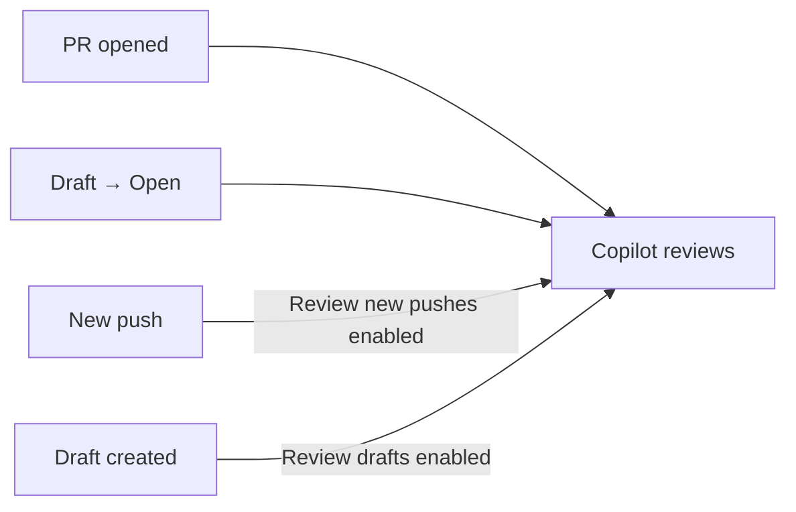
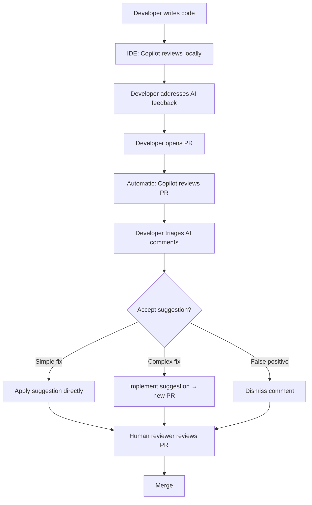

## AI as your first reviewer

In the previous chapter, we used AI to generate tests and then reviewed those tests by running the suite. The Review phase was essentially binary: pass or fail. Code review is different. It demands nuanced judgment: is this naming clear? Is this pattern consistent with the codebase? Could this query be exploited? For decades, that kind of judgment required a human reviewer. Now, AI can provide a meaningful first pass, catching issues before your teammates even open the pull request.

This chapter focuses on **Copilot Code Review**: how it works, what it catches (and misses), how to customize its behavior with the instruction files you built in Module 1, and how to configure automatic reviews so every PR gets AI feedback without anyone lifting a finger. We'll also cover the **"Implement suggestion"** feature, where Copilot's coding agent takes review comments and turns them into actual code changes, closing the loop from Review back to Delegate.

In PDRC terms, this chapter emphasizes the **Review** phase more than any other. But it also shows how Review feeds back into Delegate and Correct: the agent reviews code, you correct the review comments that are wrong, and the agent implements the suggestions you accept.

---

## How Copilot Code Review works

Copilot Code Review is a GitHub-native feature that reviews pull requests and leaves inline comments, exactly like a human reviewer would. Here's what happens under the hood:

1. **You request a review.** On any pull request, open the **Reviewers** sidebar and select **Copilot** from the list. Copilot appears alongside your human reviewers.
2. **Copilot analyzes the diff.** Copilot examines the changed files, gathers context from the full repository (using GitHub Actions runners), and identifies potential issues.
3. **Copilot leaves inline comments.** Each comment appears as a review comment on the specific lines of code, just like a human would leave them. Comments may include suggested changes that you can apply with a single click.
4. **You review the review.** You read each comment, accept it, dismiss it, or correct it. This is the human-in-the-loop step that keeps code quality grounded.

### What Copilot reviews

Copilot Code Review analyzes code from multiple angles:

- **Logic and correctness** — off-by-one errors, null pointer risks, missing error handling
- **Security** — potential vulnerabilities, unsafe patterns, hardcoded secrets
- **Performance** — unnecessary allocations, N+1 queries, inefficient loops
- **Readability** — unclear naming, overly complex expressions, missing documentation
- **Consistency** — patterns that deviate from the rest of the codebase

It also integrates with static analysis tools like **CodeQL**, **ESLint**, and **PMD** (currently in public preview) to surface high-signal findings for security and quality.

### The review type: always "Comment"

Here's a critical detail to understand: **Copilot always leaves a "Comment" review. It never selects "Approve" or "Request changes."**

This is a deliberate design choice with important consequences:

- Copilot reviews **do not count** toward required approvals in branch protection rules
- Copilot reviews **do not block merging**
- You still need human reviewers for governance and compliance

Think of Copilot as a "pre-reviewer". It catches issues before the human review cycle begins, reducing the back-and-forth between author and reviewer, but it never replaces the human decision to approve.

### What Copilot doesn't review

Some file types are automatically excluded:

- **Dependency management files** — `package.json`, `Gemfile.lock`, `pnpm-lock.yaml`
- **Log files**
- **SVG files**

If your PR only touches these files, Copilot will have nothing to review.

If you need a dependency management review, you can use something like Dependabot or Snyk, which are designed for that purpose and can also be integrated into your workflow. It can also be used to block a PR if a vulnerable dependency is added, which Copilot cannot do.

---

## Requesting a code review: step by step

### Manual request on a pull request

1. Open a pull request on GitHub.com
2. In the right sidebar, click **Reviewers**
3. Select **Copilot** from the reviewer list (it appears alongside your team members)
4. Wait approximately 30 seconds — Copilot will leave its review comments

### Re-requesting a review

Unlike human reviewers, Copilot **does not automatically re-review** when you push new commits. If you make changes after the initial review and want fresh feedback:

1. Go to the **Reviewers** section of your PR
2. Click the **re-request review** button (the circular arrow icon) next to Copilot's name

> **Note:** Re-reviews may repeat comments from the previous review, even if you dismissed them. This is a known limitation — Copilot doesn't track which comments you've already addressed. Treat each re-review as a fresh pass.

### In your IDE

Copilot Code Review is also available directly in:

- **VS Code**
- **Visual Studio**
- **JetBrains IDEs**
- **Xcode**

The IDE experience lets you get review feedback on your working changes _before_ you even create a pull request, catching issues at the earliest possible stage.

---

## Customizing reviews with instructions

Here's where Module 1 knowledge will generate results. The instruction files you learned about in Chapters 6 and 7 directly influence how Copilot reviews code. Both `copilot-instructions.md` and `.instructions.md` files are applied to code reviews.

### Why custom review instructions matter

Without instructions, Copilot reviews based on generic best practices. With instructions, it reviews based on _your team's_ standards. The difference is significant:

| Without custom instructions | With custom instructions |
|----|-----|
| "Consider adding error handling here" | "This function doesn't follow our error handling pattern: wrap external calls in `Result<T, AppError>` and propagate with `?`" |
| "This variable name could be more descriptive" | "Per our naming convention, boolean variables should use `is`/`has`/`should` prefixes" |
| "Consider adding a test for this" | "New public API methods require at least one happy-path and one error-path test per our coverage policy" |

### Writing effective review instructions

You can add review-specific guidance to your `copilot-instructions.md` or create a focused `.instructions.md` file. Here's an example for a security-conscious project:

```markdown title=".github/copilot-instructions.md"
## Code review standards

When reviewing pull requests, prioritize the following:

### Security checklist
- Flag any SQL constructed with string concatenation
- Flag hardcoded secrets, API keys, or credentials
- Flag HTTP URLs where HTTPS should be used
- Flag missing input validation on user-facing endpoints
- Flag usage of eval(), Function(), or other dynamic code execution

### Error handling
- All async functions must have explicit error handling (no unhandled promise rejections)
- External API calls must include timeout and retry logic
- User-facing errors must use our AppError class, not raw Error

### Naming conventions
- React components: PascalCase
- Utility functions: camelCase with verb prefix (getData, parseConfig, validateInput)
- Constants: SCREAMING_SNAKE_CASE
- Boolean variables: is/has/should prefix

### Performance
- Database queries in loops are always flagged
- Flag any synchronous file I/O in request handlers
- Prefer pagination over unbounded queries
```

### Scoped instructions with `.instructions.md`

Remember from Chapter 7 that `.instructions.md` files apply to files in their directory and subdirectories. This is powerful for code review:

```markdown title="src/api/.instructions.md"
## API layer review rules

- Every endpoint must validate request body against a schema
- Responses must use standardized envelope format: { data, error, metadata }
- Rate limiting must be applied to all public endpoints
- Log all 4xx/5xx responses with request ID for tracing
```

When Copilot reviews a PR that touches files in `src/api/`, these instructions automatically apply alongside the global ones. The reviewer gets domain-specific context without the author needing to explain anything.

### Organization-level instructions

If you're an organization owner, you can define custom instructions in the organization's Copilot settings. These apply across all repositories, useful for company-wide standards like:

- Security baselines
- Accessibility requirements
- Logging and observability patterns
- Compliance rules (GDPR data handling, PII masking)

---

## Automatic code review

Requesting Copilot manually on each PR works, but the real power comes from automation. You can configure Copilot to review every PR automatically, ensuring no code reaches production without at least an AI first-pass.

### Three levels of automatic review

| Level | Who configures it | Scope |
|-------|------------------|-------|
| **Personal** | Individual developer | All PRs you create (any repo) |
| **Repository** | Repository admin | All PRs in that specific repo |
| **Organization** | Organization owner | All PRs across selected repos |

### Configuring personal automatic reviews

If you're on the Copilot Pro or Copilot Pro+ plan:

1. Click your **profile picture** → **Copilot settings**
2. Find **Automatic Copilot code review**
3. Select **Enabled** from the dropdown

From now on, every PR you create will automatically get a Copilot review.

### Configuring repository-level automatic reviews

This uses GitHub's **branch rulesets** — the same system you use for branch protection:

1. Go to your repository **Settings** → **Rules** → **Rulesets**
2. Click **New ruleset** → **New branch ruleset**
3. Give it a descriptive name (e.g., "Copilot auto-review on main")
4. Set **Enforcement Status** to **Active**
5. Under **Target branches**, add the branches you want (e.g., "Include default branch" or "Include all branches")
6. Under **Branch rules**, check **Automatically request Copilot code review**

You'll see additional options:

- **Review new pushes** — Copilot re-reviews when new commits are pushed (solves the "re-request" problem)
- **Review draft pull requests** — Copilot reviews drafts before they're marked "Ready for review" (catching issues earlier)

### Configuring organization-level automatic reviews

Same ruleset approach, but at the organization level:

1. Go to **Organization Settings** → **Repository** → **Rulesets**
2. Create a new branch ruleset
3. Under **Target repositories**, use patterns to include/exclude repos (e.g., `*` for all, `*-service` for microservices)
4. Enable **Automatically request Copilot code review**

This is the most powerful configuration for teams: every PR across your organization gets automatic AI review, governed by the same custom instructions you've already set up.

### Automatic review triggers

The exact trigger depends on your configuration:



By default, only the first two triggers apply. The "Review new pushes" option is particularly valuable, it means Copilot re-reviews after each push, catching new issues without manual intervention.

---

## "Implement suggestion": from Review back to Delegate

One of the standout features in Copilot Code Review is the **"Implement suggestion"** button. When Copilot suggests a change in a review comment, you can click this button and Copilot's coding agent will:

1. Take the review suggestion as its task
2. Create a new branch from your PR branch
3. Implement the suggested change
4. Open a new pull request against your branch with the fix applied

This closes the PDRC loop: Copilot **Reviews** the code → you decide the suggestion is valid → Copilot **Delegates** the implementation to the coding agent → you **Review** the resulting PR → merge. The Correct phase happens only if the implementation doesn't match what you expected.

### When to use "Implement suggestion"

- **Simple fixes**: naming changes, adding error handling, fixing a pattern
- **Mechanical refactors**: replacing a deprecated API call, restructuring imports
- **Standards compliance**: adding missing validation, adjusting formatting

### When NOT to use it

- **Complex architectural changes**: the agent may not understand the broader implications
- **Changes that require human judgment**: business logic, UX decisions
- **When the suggestion itself is wrong**: always validate the review comment before implementing it

### Applying suggestions directly

For simpler suggestions, Copilot provides **Apply suggestion**, a one-click action that applies the suggested code diff directly to the file, similar to accepting a GitHub suggested change. No separate PR needed. Use this for small, surgical fixes.

---

## Limitations and what to watch for

Copilot Code Review is powerful, but understanding its limitations prevents over-reliance and misplaced trust.

### What Copilot does well

| Strength | Example |
|---------|---------|
| Pattern matching | Catches inconsistent error handling, deviations from codebase patterns |
| Security surface scanning | Flags SQL injection patterns, hardcoded secrets, unsafe deserialization |
| Style consistency | Notices naming convention violations, import ordering issues |
| Missing edge cases | Suggests handling null/undefined inputs, empty arrays, boundary values |

### What Copilot struggles with

| Limitation | Example |
|-----------|---------|
| Business logic correctness | Can't tell if a discount calculation matches the business requirement |
| Cross-PR context | Doesn't know about the PR you merged yesterday that changes the contract |
| Architecture decisions | Won't flag that a new database table violates your domain boundaries |
| Subtle race conditions | May miss timing issues that only appear under load |
| False positives | Sometimes flags correct code as problematic, especially in idiomatic patterns |

### Repeated comments on re-review

When you re-request a review, Copilot may leave the same comments you already dismissed. It doesn't maintain state between reviews. This is annoying but manageable, just dismiss them again. If a comment keeps appearing and it's genuinely wrong for your codebase, **consider adding a custom instruction to prevent it**.

### Quota and billing

Each code review consumes one **premium request** from your monthly quota. Key details:

- Automatic reviews are counted against the **PR author's** quota
- Bot-created PRs are billed to the user who triggered the workflow
- Users without a Copilot license (when enabled by org admin) don't have their own quota, their reviews are billed as overage to the organization

### The "always Comment" constraint

Because Copilot never approves or requests changes:

- It **cannot** be the sole reviewer in a required-review workflow
- It **cannot** enforce merge blocking based on its findings
- You need **human reviewers** alongside Copilot for governance

This is a feature, not a bug. AI should augment human review, not replace the human decision to ship.

---

## Code review in the IDE

Beyond pull requests on GitHub.com, Copilot can review code directly in your editor. This shifts review feedback even earlier — to the moment you're writing the code.

### VS Code / JetBrains / Visual Studio

In supported IDEs, you can request a review of your current working changes:

- Select a block of code and ask Copilot to review it via inline chat
- Use the **Copilot Code Review** panel to get feedback on staged changes
- Review comments appear as inline annotations, similar to linter warnings

The IDE review uses the same custom instructions as PR reviews. If you've configured `.instructions.md` files in your repository, they apply here too.

### When to use IDE review vs. PR review

| Scenario | Best choice |
|---------|-------------|
| Quick check before committing | IDE review |
| Formal team review process | PR review (with automatic setup) |
| Draft PR iteration | PR review with "Review drafts" enabled |
| Exploring whether an approach will pass review | IDE review |

The most effective workflow combines both: IDE review during development (catching issues early), then automatic PR review as the final safety net before human review.

---

## Building a review-aware team workflow

Copilot Code Review works best when it's integrated into your team's existing process, not bolted on as an afterthought. Here's what a mature workflow looks like:



### Key principles for teams

1. **Copilot reviews first, humans second.** By the time a human reviewer opens the PR, the mechanical issues are already resolved. Humans can focus on architecture, business logic, and design, the things AI can't evaluate.

2. **Custom instructions are team agreements.** When your team writes review instructions, they're encoding their standards into an enforceable format. This reduces "it depends" discussions, the AI enforces the agreed rules consistently.

3. **Treat false positives as instruction gaps.** If Copilot keeps flagging something that's correct for your codebase, don't just dismiss it, add an instruction that teaches it the exception. Over time, your instructions become a living document of team conventions.

4. **Don't skip Review on the reviewer.** Copilot's review comments are AI output. They go through PDRC just like generated code: you Plan what to review, Copilot Delegates the review, you Review the review comments, and you Correct any that are wrong.

---

## Hands-on: set up automatic code review with custom instructions

Time to put it all together. In this exercise, you'll configure a repository with automatic Copilot review and write custom instructions that enforce a security and quality checklist.

### Prerequisites

- A GitHub repository where you have admin access
- Copilot Business, Enterprise, Pro, or Pro+ plan
- A feature branch with some code to review

### Step 1: write review-focused custom instructions

Create or update your `.github/copilot-instructions.md`:

```markdown title=".github/copilot-instructions.md"
## Code review standards for this repository

### Security (always flag these)
- SQL queries built with string concatenation or template literals
  instead of parameterized queries
- Hardcoded secrets, API keys, tokens, or passwords
- HTTP URLs where HTTPS should be used
- Missing input validation on any function that receives user input
- Usage of eval(), new Function(), or other dynamic code execution
- Disabled CSRF protection or missing authentication middleware

### Error handling
- Async functions must have proper error handling
  (try/catch or .catch()) — no unhandled promise rejections
- External API calls must include timeout configuration
- User-facing errors must not expose internal stack traces

### Testing requirements
- New public functions must have at least one test
- Flag PRs that delete tests without explanation

### Performance
- Flag database queries inside loops (N+1 pattern)
- Flag unbounded queries (SELECT without LIMIT or pagination)
- Flag synchronous file I/O in async request handlers
```

Commit and push this to your default branch.

### Step 2: add a scoped instruction file

If your repository has an API layer, create a focused instruction file:

```markdown title="src/api/.instructions.md"
## API review rules

- Every endpoint handler must validate its input against a schema
- Response format must use the project's standard envelope:
  { success: boolean, data: T | null, error: string | null }
- All endpoints must include rate limiting middleware
- Log every 4xx and 5xx response with the request ID
```

Commit and push.

### Step 3: configure automatic review via branch ruleset

1. Go to your repository on GitHub.com
2. Navigate to **Settings** → **Rules** → **Rulesets**
3. Click **New ruleset** → **New branch ruleset**
4. Configure the ruleset:
   - **Name**: `copilot-auto-review`
   - **Enforcement Status**: Active
   - **Target branches**: Include default branch (or all branches)
5. Under **Branch rules**, check:
   - ✅ **Automatically request Copilot code review**
   - ✅ **Review new pushes** (so you get fresh reviews after each push)
   - ✅ **Review draft pull requests** (catch issues early)
6. Click **Create**

### Step 4: create a test pull request

Create a branch with some intentionally imperfect code to see the review in action:

```sh
git checkout -b test/copilot-review-demo
```

Create a file with some issues that your custom instructions should catch:

`Remove the code comments before committing, we want Copilot to flag these issues based on the instructions you wrote.`

```typescript title="src/api/users.ts"
import { db } from "../database";

// No input validation
export async function getUser(userId: string) {
  // String concatenation in SQL — security issue
  const query = `SELECT * FROM users WHERE id = '${userId}'`;
  const result = await db.query(query);
  return result;
}

// Hardcoded API key
const API_KEY = "sk-1234567890abcdef";

// No error handling on external call
export async function syncUserProfile(userId: string) {
  const response = await fetch(
    `http://external-api.example.com/users/${userId}`,
    { headers: { Authorization: API_KEY } }
  );
  const data = await response.json();
  await db.query(
    `UPDATE users SET profile = '${JSON.stringify(data)}'
     WHERE id = '${userId}'`
  );
  return data;
}
```

Commit, push, and open a pull request.

### Step 5: observe and triage Copilot's review

Within few minutes, Copilot should leave review comments. Based on your instructions, expect comments about:

- ⚠️ **SQL injection** — string concatenation in both queries
- ⚠️ **Hardcoded API key** — the `API_KEY` constant
- ⚠️ **HTTP instead of HTTPS** — the external API URL
- ⚠️ **Missing input validation** — `getUser` doesn't validate `userId`
- ⚠️ **Missing error handling** — `syncUserProfile` has no try/catch
- ⚠️ **No timeout** on the fetch call
- ⚠️ **Missing tests** — new public functions without tests

### Step 6: act on the review

For each comment, practice the three responses:

1. **Apply suggestion** — if Copilot suggests a specific fix (like parameterizing the SQL query), click "Apply suggestion" to apply it directly
2. **Implement suggestion** — for more complex fixes (like adding comprehensive error handling), click "Implement suggestion" and let the coding agent create a follow-up PR
3. **Dismiss** — if a comment is a false positive or not applicable, dismiss it with a reason. Then consider whether a custom instruction would prevent this in the future

### What you practiced

| PDRC phase | What happened |
|-----------|--------------|
| **Plan** | You wrote custom instructions defining what "good code" means for this repo |
| **Delegate** | You configured Copilot to automatically review every PR |
| **Review** | You triaged Copilot's comments — accepting, implementing, or dismissing each one |
| **Correct** | You refined your instructions based on false positives and gaps |

---

## Copilot Code Review vs. human review: a complement, not a replacement

It's tempting to think "Copilot reviews the code, so I don't need human reviewers." This is wrong, and understanding why is crucial.

| What AI review catches | What human review catches |
|-----------------------|--------------------------|
| Pattern violations | Design intent mismatches |
| Common security bugs | Subtle business logic errors |
| Style inconsistencies | Architecture concerns |
| Missing error handling | "This approach won't scale" insights |
| Copy-paste bugs | Context from the last three months of decisions |

The best code review process uses both:

1. **Copilot reviews automatically** — catches 60-70% of the comments a human would leave (style, bugs, patterns)
2. **Humans review what's left** — architecture, business logic, design intent, and the things that require organizational context

The result: human reviewers spend less time on mechanical feedback and more time on the judgement calls that actually matter. PR turnaround time drops because the first round of "fix your naming" and "add error handling" comments is already resolved before the human reviewer opens the diff.

---

## Conclusion

Copilot Code Review brings the Review phase of PDRC to pull requests at scale. Let's recap the key points:

1. **Copilot reviews code like a teammate** — inline comments, suggested changes, and security analysis on every PR. It analyzes the full repository context, not just the diff in isolation.
2. **Custom instructions make reviews specific to your team.** Generic feedback is less useful than feedback grounded in your actual standards. The instruction files from Module 1 directly power review quality.
3. **Automatic reviews eliminate friction.** Configure it once through branch rulesets, at the personal, repository, or organization level, and every PR gets reviewed without anyone remembering to request it.
4. **"Implement suggestion" closes the loop.** Review comments become code changes through the coding agent, taking you from Review back to Delegate seamlessly.
5. **Copilot never approves.** It always leaves "Comment" reviews, never blocks merging, and never replaces human reviewers. This is intentional, AI augments the review process, it doesn't own the merge decision.
6. **Review the reviewer.** Copilot's review comments are AI output. Apply the same critical thinking to them that you would to any generated code.

In Ch 11, we'll shift focus to the **Correct** phase — debugging, refactoring legacy code, and the iteration strategies that make the difference between an engineer who fights the AI and one who collaborates with it effectively.


