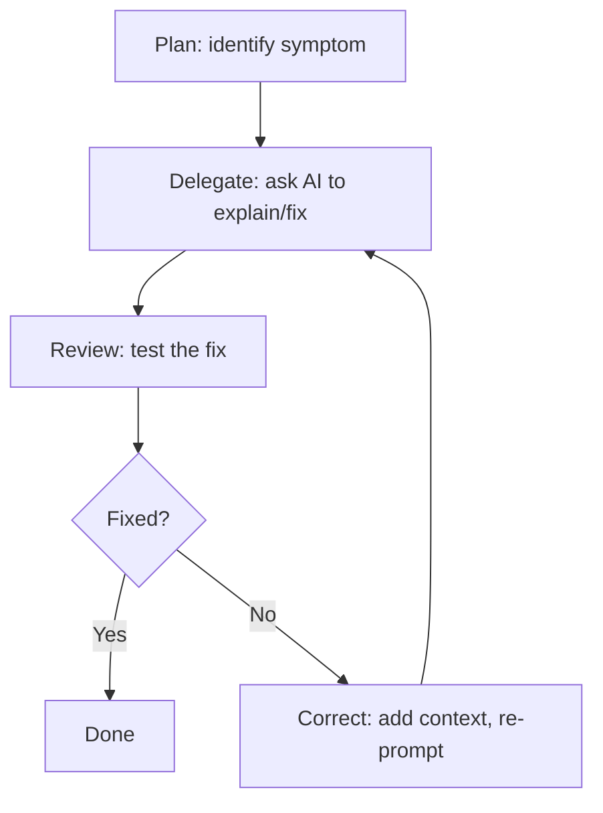
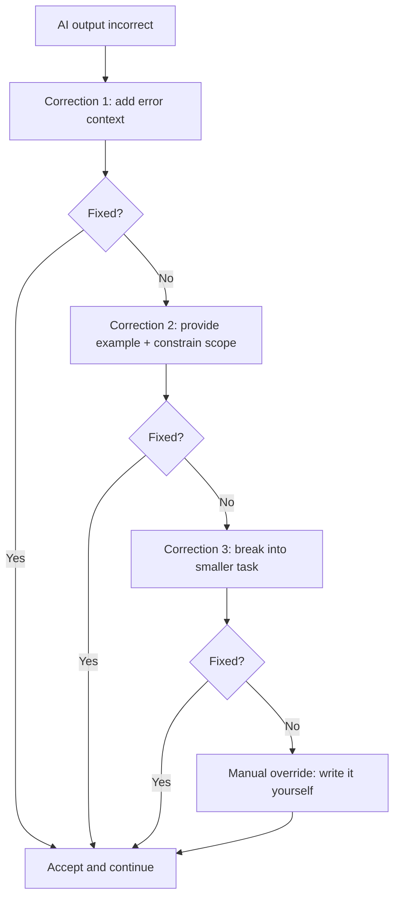
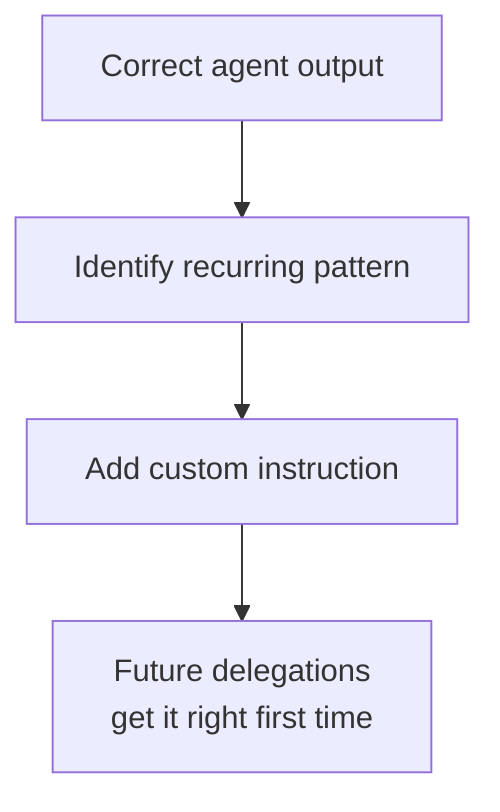

## The Correct phase: where engineering knowledge shines

Chapters 9 and 10 focused on Delegate and Review: generating tests, reviewing code, and accepting or dismissing AI suggestions. But what happens when the AI gets it wrong? When the generated code doesn't work, when the refactored module breaks in production, when the agent goes in circles? That's when you enter the **Correct** phase, the most distinctly _human_ part of the PDRC loop.

This chapter is about three things that all live in the Correct phase: **debugging** (finding and fixing what's broken), **refactoring** (restructuring what works but shouldn't stay as-is), and **iteration** (the strategies for steering the agent back on track when it drifts). We'll also cover **codebase onboarding** (using AI to quickly understand unfamiliar projects).

The research paints a clear picture: AI-assisted code refactoring can be completed in **nearly two-thirds less time** than manual refactoring (McKinsey, 2023), developers finish tasks **up to 55% faster** with AI completions (GitHub, 2022), and teams using Copilot see **84% more successful builds** (Accenture RCT, 2024). But the gains aren't automatic. Multiple studies show that time savings shrink dramatically on complex tasks, and **less experienced** developers sometimes perform _worse_ with AI than without it when they lack the skill to evaluate the output. The difference? Iteration skill. Developers who knew how to correct the agent's output by adding context, breaking problems down, recognizing when to intervene manually, captured the gains. Those who blindly accepted AI output or fought the tool in endless re-prompting loops did not.

The Correct phase is where engineering judgment, the human element, is non-negotiable.

---

## AI-assisted debugging

Debugging is the canonical Correct activity: something is broken and you need to find out why. AI coding assistants offer several entry points for debugging, each suited to different situations.

### The `/fix` command

In Copilot Chat (VS Code, JetBrains, Visual Studio), the `/fix` slash command is purpose-built for debugging. Select the problematic code, type `/fix`, and optionally describe the symptom:

```
/fix This function throws "TypeError: Cannot read property 'name' of undefined"
when the user has no profile
```

Copilot analyzes the selected code, the error message, and the surrounding context, then proposes a fix. This works best when:

- The error is localized to a specific function or block
- You can provide the exact error message
- The fix involves a common pattern (null check, type guard, boundary condition)

### Inline chat for targeted debugging

For more nuanced debugging, inline chat lets you ask questions about specific code:

```
Why does this loop run one extra time when the input array is empty?
```

```
This regex matches URLs but breaks on query strings with encoded characters. What's wrong?
```

The key insight: **the more specific your question, the better the answer.** Vague prompts like "fix this" produce vague fixes. Specific prompts that include the symptom, the input that triggers it, and the expected behavior produce targeted solutions.

### Error explanation

When you encounter a stack trace or error message, AI can translate it into plain language:

```
Explain this error:

FATAL ERROR: Reached heap limit Allocation failed - JavaScript heap out of memory
    at Module._compile (internal/modules/cjs/loader.js:1085:14)
    at Object.Module._extensions..js (internal/modules/cjs/loader.js:1114:10)
```

This is especially valuable for:

- **Unfamiliar frameworks** — errors from tools you don't use daily
- **Cryptic messages** — compiler errors in languages like Rust or C++ that require deep type system knowledge
- **Dependency conflicts** — version mismatch errors in package managers that reference internal resolution logic

### The debugging workflow in PDRC

Debugging with AI follows a tight PDRC micro-loop:



Each iteration adds information. The first prompt might be "fix this error." The correction might be "the fix doesn't work because `user` can also be an empty object, not just null." The next iteration handles that case. The cycle converges because each round adds context the agent didn't have before.

### What AI debugging doesn't replace

AI can fix many mechanical bugs. Null pointers, off-by-one errors, missing await statements. But some debugging requires understanding that the tool simply doesn't have:

- **Timing and concurrency bugs** that only manifest under load
- **Environment-specific issues** (works on macOS, fails on Linux)
- **Business logic errors** where the code does exactly what it's told, but what it's told is wrong
- **Data-dependent bugs** where the issue is in the data, not the code
- **Infrastructure and deployment issues** that involve CI/CD pipelines, cloud services, or container orchestration
- **Legacy code with no tests** where the behavior is undefined and the AI has no ground truth to work from

For these, AI is a useful collaborator (explain the architecture, suggest where to add logging, propose a debugging strategy), but the human drives the investigation.

---

## Legacy code refactoring

If debugging is about fixing what's broken, refactoring is about improving what works but is hard to maintain, extend, or understand. This is where AI delivers some of its most significant productivity gains. Multiple studies consistently show refactoring as the task where AI saves the most time, with reductions of 50-65% compared to fully manual approaches.

### Why AI excels at refactoring

Refactoring is a high-value, pattern-heavy task:

- **Extract function** — move a block of code into a named function
- **Rename variables** — replace unclear names with descriptive ones across an entire file
- **Decompose conditionals** — turn nested if-else chains into guard clauses or strategy patterns
- **Modernize syntax** — convert callbacks to async/await, `var` to `const`/`let`, class components to hooks, Java to Kotlin, Objective C to Swift, etc.
- **Reorganize imports** — sort, group, and remove unused imports

Each of these follows well-known rules. AI has seen millions of examples of each pattern. The challenge isn't knowing _what_ to do, it's applying it consistently across a large codebase. This is exactly where AI scales better than humans.

### The refactoring spectrum

| Refactoring scope | AI effectiveness | Human oversight needed |
|---|---|---|
| **Single function** (rename, extract, simplify) | Very high | Quick review |
| **Single file** (reorganize, modernize syntax) | High | Check for side effects |
| **Module** (restructure internal architecture) | Medium | Verify contracts preserved |
| **Cross-module** (change interfaces, split services) | Low-medium | Architect-level review |
| **Full codebase** (monolith → microservices) | Low | Human-driven, AI-assisted |

As with test generation (Chapter 9), AI accuracy decreases as scope increases. Single-function refactoring is nearly always correct. Full-codebase restructuring requires human architectural judgment with AI as a tool, not a driver.

### Step-by-step: refactoring with AI

Here's the workflow that captures the most value while managing risk:

**1. Establish a safety net first.**

Before refactoring anything, make sure you have tests. If the module has no tests, use the techniques from Chapter 9 to generate them. Your tests are the "before" snapshot — they tell you if the refactoring broke anything.

```
Generate unit tests for the UserService module that capture its current
behavior. Focus on the public API: createUser, updateUser, deleteUser,
and getUserById. Include edge cases for missing fields and duplicate emails.
```

**2. Refactor in small, reviewable chunks.**

Don't ask "refactor this entire 500-line file." Instead:

```
Extract the email validation logic from createUser() into a separate
validateEmail() function. Keep the same behavior, don't change what's
considered a valid email address.
```

Small refactorings are easy to review, easy to test, and easy to revert if something goes wrong.

**3. Run tests after each change.**

This is non-negotiable. After each refactoring step, run the tests. If they all pass, move on to the next step.

If any test fails, you're in the Correct phase: figure out what the refactoring broke, provide that context to the AI, and iterate.

**4. Repeat until the module meets your quality bar.**

Common refactoring sequences:

- First pass: rename variables and functions for clarity
- Second pass: extract helper functions to reduce duplication
- Third pass: modernize syntax and patterns
- Fourth pass: reorganize file structure and exports

That's not new, it's how engineers have always refactored. The difference is that AI can do each step much faster, but you still need to drive the process.

### Refactoring prompt patterns

These prompt templates work well for common refactoring tasks:

**Modernize syntax:**
```
Refactor this module to use modern TypeScript patterns:
- Convert callbacks to async/await
- Replace `any` types with proper interfaces
- Use optional chaining instead of nested null checks
- Keep the public API identical — no signature changes
```

**Reduce complexity:**
```
This function has a cyclomatic complexity of 15. Refactor it to reduce
complexity below 5. Use early returns, extract helper functions, and
replace the switch statement with a lookup object. Preserve all behavior.
```

**Extract patterns:**
```
This file contains a UserRepository class with 400 lines. Extract the
caching logic into a separate CacheManager class. The UserRepository
should use CacheManager through dependency injection. Write both classes
and show me how the constructor changes.
```

---

## Codebase onboarding

Before you can debug or refactor code, you need to understand it. Codebase onboarding — the process of becoming productive in an unfamiliar codebase — is traditionally one of the most time-consuming activities in software engineering. New hires spend weeks or months building mental models. Even experienced engineers slow down significantly when switching projects.

GitHub's 2022 study found that **73% of developers said Copilot helped them stay in the flow** when working across unfamiliar files, and separate research showed developers using AI were **25-30% more likely to complete complex tasks** in unfamiliar codebases within a given time frame. The 2024 Stack Overflow Developer Survey reinforced this: **76% of developers** report using or planning to use AI tools, with "learning a codebase" and "understanding unfamiliar code" among the top use cases. This makes codebase onboarding one of the highest-ROI applications of AI coding assistants.

### Strategies for AI-powered onboarding

**1. Start with the big picture.**

Ask the agent to explain the overall architecture:

```
Explain the architecture of this project. What are the main modules,
how do they interact, and what external services does the application
depend on? Focus on the data flow from an incoming HTTP request to a
database write and response.
```

If the repository has an `AGENTS.md` or `copilot-instructions.md` file (Chapter 7), the agent already has curated context about the project's architecture, conventions, and patterns.

**2. Trace a specific feature.**

Rather than trying to understand everything, pick one feature and trace it end to end:

```
Trace the user registration flow from the API endpoint to the database.
Show me every file involved, the order they're called, and what each
one does. Include middleware, validation, and any event dispatching.
```

This gives you a concrete "slice" through the codebase — one path you fully understand. From there, you can explore adjacent features.

**3. Understand the test structure.**

Tests are documentation:

```
Explain the testing strategy in this project. What test frameworks are
used? Where do unit tests, integration tests, and E2E tests live?
What's the coverage like? Show me an example of each type.
```

**4. Decode legacy decisions.**

Every codebase has code that looks wrong but exists for a reason:

```
This module uses a custom connection pool instead of the ORM's built-in
pooling. Is there an obvious reason for this? Check the git history and
comments for context.
```

### Using `@workspace` for codebase questions

In VS Code, the `@workspace` agent gives Copilot Chat access to your entire project. This is the most useful tool for codebase onboarding:

```
@workspace Where is authentication handled? Show me the middleware and
how it integrates with the route definitions.
```

```
@workspace What database migrations exist and what schema changes did
they introduce?
```

```
@workspace How is error handling implemented across the API layer?
Is there a consistent pattern?
```

The `@workspace` scope lets the agent search across files, connect the dots between modules, and give you answers grounded in the actual code.

---

## Iteration strategies: mastering the Correct phase

The Correct phase is where most engineers either succeed or struggle with AI assistants. The difference between a productive AI collaboration and a frustrating one almost always comes down to iteration skill, knowing how to steer the agent when it goes wrong.

### Strategy 1: effective re-prompting

When the AI's output isn't right, the worst thing you can do is repeat the same prompt and hope for a different result. Effective re-prompting adds information:

**Add the error or failure context:**
```
The previous refactoring broke the test suite. Here's the failing test:

  FAIL src/services/UserService.test.ts
  ● createUser › should reject duplicate emails
    Expected: DuplicateEmailError
    Received: undefined

The validateEmail function you extracted doesn't check the database for
existing emails — it only checks format. Move the uniqueness check into
validateEmail as well.
```

**Provide an example of what you want:**
```
The naming convention you used doesn't match our codebase. Here's how
we name things:

- Service methods: verb + noun (createUser, not addNewUser)
- Private helpers: underscore prefix (_validateInput)
- Constants: UPPER_SNAKE_CASE

Please redo the refactoring with these conventions.
```

**Constrain the scope:**
```
Your previous response tried to refactor the entire file. That's too
much in one change. Let's do this step by step:

Step 1 (this prompt): Only extract the validation logic. Don't rename
anything, don't change the error handling, don't reorganize imports.
Just extract the three validation functions.
```

### Strategy 2: recognizing when the agent is stuck

Sometimes, the agent enters a loop: it proposes a fix, you point out the problem, it proposes a variation that has the same fundamental issue. Here are the signs:

| Sign | What's happening |
|------|-----------------|
| The agent keeps reverting to a previous approach | It doesn't have enough context to find a better solution |
| Each iteration introduces a new bug while fixing the previous one | The problem is too complex for the current context window |
| The agent agrees with your correction but produces the same output | It's pattern-matching on the wrong part of your prompt |
| Responses get longer and more verbose without improving | The agent is "padding" because it can't solve the core problem |

When you see these signs, the agent is stuck. Continuing to re-prompt is a waste of time.

### Strategy 3: manual override

When the agent is stuck, the most time-efficient action is to stop prompting and write the code yourself. This is not failure, it's engineering judgment. Manual override is appropriate when:

- **The fix is obvious to you** but hard to describe in a prompt
- **The bug requires system-level understanding** (timing, environment, infrastructure)
- **You've done three correction rounds** with no convergence
- **The change is surgical** — a few lines that you can write faster than you can explain

After the manual fix, you can re-engage the AI for the next task. The PDRC loop doesn't require every step to use AI. Using the right tool for each sub-task is the whole point.

### Strategy 4: the three-strike rule

A practical guideline: give the agent three correction attempts. If after three rounds of adding context, constraining scope, and providing examples, the output still isn't right, switch to manual. Here's the flowchart:



This rule prevents the most common anti-pattern: spending 30 minutes re-prompting when a 5-minute manual edit would have solved the problem.

### Strategy 5: the feedback loop for custom instructions

After a Correct cycle, ask yourself: **"Could a custom instruction have prevented this?"**

If the agent repeatedly misused a naming convention, add that convention to your `.instructions.md`. If it consistently chose the wrong error-handling pattern, document the correct one. If it defaulted to an older API version, add a note about which version to use.

This turns individual corrections into permanent improvements:



Over time, your instruction files accumulate your team's collective corrections. New team members, and the AI, benefit from every past mistake. This is one of the most valuable long-term habits you can build: treating corrections as investments, not just fixes.

### The correction cost curve

Here's an important mental model: the Correct phase gets cheaper over time.

| Week | Correction rate | Typical correction | Time spent correcting |
|------|----------------|--------------------|-----------------------|
| Week 1 (new tool/project) | High | Wrong patterns, wrong naming, wrong frameworks | 40-50% of AI-assisted time |
| Week 4 (instructions improving) | Medium | Edge cases, complex business logic | 20-30% of AI-assisted time |
| Week 12 (mature instructions) | Low | Novel situations, architectural decisions | 10-15% of AI-assisted time |

This pattern shows up consistently across teams adopting AI tools. GitHub's Accenture study found that developers who had used Copilot longer showed higher PR merge rates and build success, and the 2024 GitHub survey reported that **57% of developers are upskilling** through AI-assisted work. The Correct phase shrinks as your instructions mature, your prompting skill grows, and the AI's context about your project deepens through custom instructions.

---

## Hands-on: refactor a legacy module with AI

Time to practice the full Correct-phase workflow. In this exercise, you'll take a messy legacy module, refactor it with an AI agent, iterate on the errors, and document your corrections as custom instructions.

### The scenario

You have a `PaymentProcessor` module that's been accumulating technical debt for two years. It works, but it's hard to maintain: mixed concerns, inconsistent error handling, hardcoded values, and no tests.

### Step 1: create the legacy module

Create a file to simulate the legacy code:

```typescript title="src/services/payment-processor.ts"
// Legacy PaymentProcessor — accumulated over 2 years
// Multiple authors, no consistent patterns

var stripe_key = "sk_live_abc123"; // TODO: move to env
var TAX_RATE = 0.08;

export function processPayment(data: any) {
  // validate
  if (!data) throw new Error("no data");
  if (!data.amount) throw new Error("no amount");
  if (data.amount < 0) throw new Error("negative amount");
  if (!data.currency) data.currency = "USD";
  if (!data.customer_id && !data.customerId) {
    throw new Error("no customer");
  }
  var custId = data.customer_id || data.customerId;

  // calculate tax
  var tax = data.amount * TAX_RATE;
  var total = data.amount + tax;
  if (data.discount_code) {
    if (data.discount_code === "SAVE10") {
      total = total * 0.9;
    } else if (data.discount_code === "SAVE20") {
      total = total * 0.8;
    } else if (data.discount_code === "SAVE50") {
      total = total * 0.5;
    } else {
      console.log("unknown discount code: " + data.discount_code);
    }
  }

  // round
  total = Math.round(total * 100) / 100;
  tax = Math.round(tax * 100) / 100;

  // charge
  var result: any = null;
  try {
    // simulate API call
    result = {
      id: "ch_" + Math.random().toString(36).substr(2, 9),
      amount: total,
      currency: data.currency,
      customer: custId,
      status: "succeeded",
      created: new Date().toISOString(),
    };
    console.log("Payment charged: " + result.id);
  } catch (e) {
    console.log("Payment failed: " + e);
    throw e;
  }

  // save to "database"
  try {
    var record = {
      payment_id: result.id,
      customer_id: custId,
      amount: data.amount,
      tax: tax,
      total: total,
      discount: data.discount_code || null,
      currency: data.currency,
      status: result.status,
      timestamp: result.created,
    };
    console.log("Saved record: " + JSON.stringify(record));
    return record;
  } catch (e) {
    console.log("Failed to save: " + e);
    // payment was charged but not recorded!
    throw new Error(
      "CRITICAL: payment " + result.id + " charged but not saved"
    );
  }
}

export function refundPayment(paymentId: any, reason: any) {
  if (!paymentId) throw new Error("no payment id");
  console.log("Refunding " + paymentId + " because: " + reason);
  return {
    id: "re_" + Math.random().toString(36).substr(2, 9),
    payment: paymentId,
    status: "refunded",
    reason: reason,
  };
}
```

### Step 2: generate safety-net tests

Before refactoring, capture the current behavior:

```
Generate comprehensive unit tests for the PaymentProcessor module.
Cover all public functions: processPayment and refundPayment. Include:
- Happy path with all fields present
- Default currency when not specified
- Each discount code (SAVE10, SAVE20, SAVE50)
- Unknown discount code behavior
- All validation errors (no data, no amount, negative amount, no customer)
- Both customer_id and customerId field names
- Tax calculation accuracy
- Refund with and without reason

Use Vitest. Mock console.log to prevent noisy output.
```

Run the tests to confirm they pass:

```sh
npx vitest run src/services/payment-processor.test.ts
```

This is your safety net. Every test that passes now must still pass after refactoring.

### Step 3: first refactoring pass — types and naming

Start small:

```
Refactor payment-processor.ts — FIRST PASS ONLY:
1. Replace all `var` with `const` or `let`
2. Replace `any` types with proper TypeScript interfaces
3. Normalize field names to camelCase (customerId, discountCode)
4. Move the Stripe key to use process.env.STRIPE_KEY
5. Replace TAX_RATE with a named constant using UPPER_SNAKE_CASE

DO NOT change any logic. Keep the same behavior. I want to see
types and naming only.
```

Run tests. If any fail, you're in Correct mode:

```
The test "should accept customer_id field" is now failing because
you removed the snake_case fallback. The interface should use camelCase
but the function must still accept both formats for backward compatibility.
Keep the normalization: if data.customer_id exists, copy it to
data.customerId before processing.
```

### Step 4: second refactoring pass — extract functions

```
Refactor payment-processor.ts — SECOND PASS:
1. Extract input validation into a validatePaymentInput() function
2. Extract tax calculation into calculateTax(amount: number) function
3. Extract discount application into applyDiscount(total, discountCode)
   function that returns { discountedTotal, discountApplied }
4. Extract the charge simulation into a chargePayment() function
5. Extract the record creation into createPaymentRecord() function

The main processPayment() function should call these helpers in sequence.
Each helper should be a named export for testability.
```

Run tests again. This pass is where AI commonly introduces bugs — extracted functions may miss a variable from the original closure, or the return types might not match. Correct each issue specifically.

### Step 5: third refactoring pass — error handling and patterns

```
Refactor payment-processor.ts — THIRD PASS:
1. Replace console.log with a proper logger interface
   (accept a Logger parameter with info/warn/error methods)
2. Replace the discount code if/else chain with a lookup object:
   const DISCOUNT_CODES: Record<string, number> = { SAVE10: 0.9, ... }
3. Add proper error types: ValidationError, PaymentError, StorageError
4. Replace throw new Error(...) with throw new PaymentError(...)
5. Add JSDoc comments to all exported functions
```

Run tests. By now, you'll likely need to update some tests too — the error types changed, so tests checking `throw new Error("no data")` need to check for `ValidationError` instead. This is expected.

### Step 6: document your corrections

After completing the refactoring, review the corrections you made. Common ones:

- "AI removed backward compatibility for snake_case fields"
- "AI forgot to preserve the rounding step after extracting functions"
- "AI used a generic Logger type instead of our project's Logger interface"

Turn these into custom instructions:

```markdown title="src/services/.instructions.md"
## Payment module conventions

- Field names use camelCase, but accept snake_case input for
  backward compatibility with legacy API consumers
- All monetary calculations must round to 2 decimal places
  using Math.round(value * 100) / 100
- Use the project's Logger interface from src/utils/logger.ts,
  not console.log or a custom logger type
- Custom error classes (ValidationError, PaymentError, StorageError)
  live in src/errors/ — always extend AppError base class
```

### What you practiced

| PDRC phase | What happened |
|-----------|--------------|
| **Plan** | You assessed the legacy module and decided on a three-pass refactoring strategy |
| **Delegate** | You gave the agent focused, single-pass refactoring prompts |
| **Review** | You ran the test suite after each pass to catch regressions |
| **Correct** | You identified what the agent got wrong, re-prompted with specifics, and documented recurring issues as custom instructions |

The most important takeaway: the corrections you documented in Step 6 are more valuable than the refactoring itself. They prevent the same mistakes next time — for both the AI and your teammates.

---

## Conclusion

The Correct phase is where the PDRC loop gets its integrity. Without effective correction, AI assistance is a coin flip — sometimes helpful, sometimes harmful, and you never quite know which. With a disciplined correction practice, AI becomes a reliable multiplier:

1. **AI debugging is a tight feedback loop.** Use `/fix` for quick issues, inline chat for nuanced investigation, and error explanation for unfamiliar stacktraces. Always provide the exact error and the context — specificity is what makes AI debugging effective.

2. **Legacy refactoring is AI's sweet spot.** Studies consistently report 50-65% time reduction for refactoring tasks, but only when you refactor in small passes, maintain a test safety net, and correct each pass before moving to the next.

3. **Codebase onboarding is underrated.** Using `@workspace` queries, feature tracing, and architecture explanations, AI can compress weeks of ramp-up into days. 73% of developers report staying in the flow more easily when navigating unfamiliar code with AI assistance.

4. **Iteration skill separates productive from frustrated.** Re-prompt with context, not hope. Provide examples of what you want. Constrain scope when output is too broad. And follow the three-strike rule: three corrections, then manual override.

5. **Corrections are investments.** Every correction that turns into a custom instruction prevents the same mistake for every future interaction. The Correct phase gets cheaper over time as your instructions mature.

In Ch 12, we'll shift from correcting code to **documenting** it — AI-assisted code documentation, API docs, commit messages, and PR descriptions. Documentation is where the Delegate and Review phases shine again, because generating docs is high-value, pattern-heavy work that AI handles well and humans review quickly.

---

## References

### Research and data

- [GitHub — Research: quantifying GitHub Copilot's impact on developer productivity and happiness (2022)](https://github.blog/2022-09-07-research-quantifying-github-copilots-impact-on-developer-productivity-and-happiness/) — up to 55% faster task completion; 73% helped stay in the flow; 77% said it helps write better code
- [GitHub — Research: quantifying GitHub Copilot's impact in the enterprise with Accenture (2024)](https://github.blog/news-insights/research/research-quantifying-github-copilots-impact-in-the-enterprise-with-accenture/) — 15% increase in PR merge rate; 84% increase in successful builds; 57% upskilling; 95% enjoyed coding more
- [McKinsey — Unleashing developer productivity with generative AI (2023)](https://www.mckinsey.com/capabilities/mckinsey-digital/our-insights/unleashing-developer-productivity-with-generative-ai) — code refactoring ~2/3 less time; complex tasks under 10% savings; developers 25–30% more likely to complete complex tasks in unfamiliar codebases
- [Stack Overflow — 2024 Developer Survey](https://survey.stackoverflow.co/2024/) — 76% of developers using or planning to use AI tools; codebase understanding among top use cases

### Tools and documentation

- [VS Code — Copilot Chat](https://code.visualstudio.com/docs/copilot/copilot-chat) — `/fix` command, inline chat, `@workspace` scope
- [Vitest](https://vitest.dev/) — test framework used in the hands-on exercise

### Related chapters

- Ch 2 — The PDRC mental model (the Correct phase defined)
- Ch 7 — Repository custom instructions (the feedback loop destination for corrections)
- Ch 9 — Test generation (safety-net tests before refactoring)
- Ch 10 — AI-assisted code review (the Review phase that precedes correction)
- Ch 12 — Automated documentation (Delegate + Review applied to docs)
