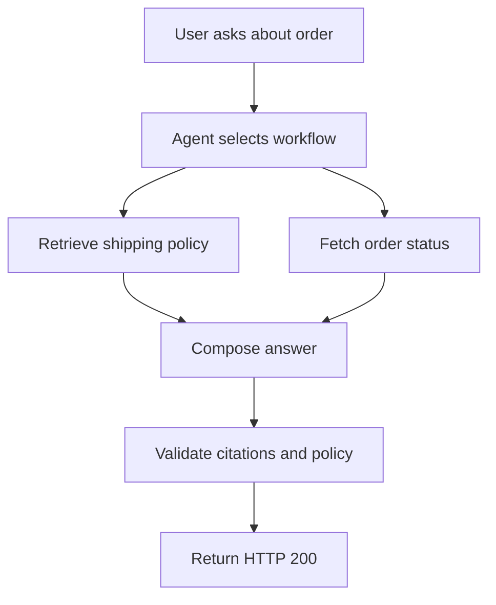
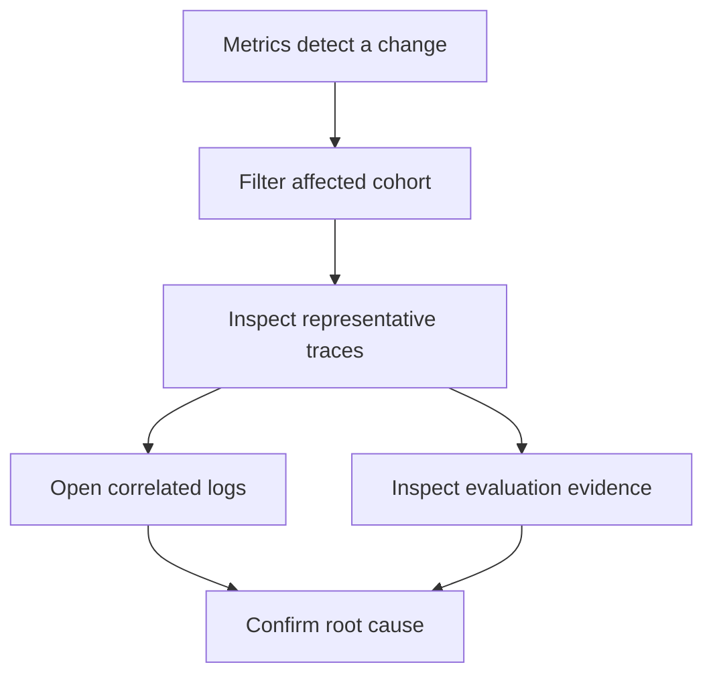

## Why agent observability is different

An agent endpoint can return HTTP 200 while the task fails. The model can select the wrong tool, retrieve an obsolete policy, repeat a step until a budget limit is reached, or produce a fluent answer that contradicts the system of record. Service telemetry records a successful request. The user experiences a failed outcome.

Agent observability connects those two views.

## Service health and task success are different signals

Latency, traffic, errors, and saturation still matter. They reveal provider outages, exhausted connection pools, slow databases, and overloaded workers. However, they do not establish that the agent completed the intended task.

Consider a support agent asked to check an order and explain a delayed shipment:

The request can be fast and error-free while any of these failures occur:

- The agent queries the wrong order because identity context was lost.
- Retrieval returns a policy from the wrong region or version.
- A tool reports `success` but returns stale data.
- The answer omits a required escalation.
- A validator detects a problem but its result is ignored.
- The workflow retries successfully at an unacceptable cost.

Observability must preserve enough execution context to distinguish these cases.

## The task is the operational unit

An HTTP request is a transport boundary. An agent task is a business boundary. Sometimes they match; often they do not.

A task can pause for approval, continue in a background worker, survive a process restart, or span several conversation turns. Conversely, one request can initiate several parallel sub-tasks. The tracing model must follow the logical work rather than assume that one inbound request always equals one complete execution.

This leads to four separate identifiers:

| Identifier | Question it answers |
|---|---|
| Trace ID | Which operations participated in this execution? |
| Conversation ID | Which turns belong to the same user interaction? |
| Task or workflow ID | Which durable business task is being executed? |
| Request ID | Which network request carried this operation? |

They can have the same value in a simple synchronous agent, but they represent different concepts and should not be conflated in a long-running system.

## Agent failures are behavioral

Agent failures fall into several layers:

| Layer | Example | Evidence needed |
|---|---|---|
| Infrastructure | Model request timed out. | Error type, dependency, retry, duration. |
| Orchestration | The graph revisited the same node. | Node sequence, iteration count, state transition. |
| Tool use | A write tool was called without approval. | Tool identity, side-effect class, authorization result. |
| Retrieval | Relevant documents were not returned. | Data source, index version, document IDs, scores. |
| Semantic quality | The answer is plausible but wrong. | Evaluation result, criterion, evaluator version. |
| Policy | Sensitive data appeared in output. | Guardrail result, policy version, action taken. |
| Economic | The answer cost more than the task is worth. | Token usage, model, retries, total task cost. |

No single signal covers all seven layers. Traces preserve causality, metrics expose trends, logs retain discrete diagnostic events, and evaluations measure behavior against explicit criteria.

## Traces explain execution; metrics decide where to look

A trace is not automatically the most important signal. It is the most useful evidence when an individual execution needs reconstruction. Metrics answer population-level questions:

- Did tool failures increase after a release?
- Is the evaluation pass rate falling for one tenant or task type?
- Did the P95 cost per successful task change?
- Are more tasks reaching an iteration limit?

Once a metric identifies an affected cohort, exemplars or trace links provide representative executions. Logs support details that do not belong in span attributes, while span events mark notable points inside an operation.

The relationship is complementary:

## Questions a production trace must answer

A useful agent trace should support reconstruction without requiring raw chain-of-thought or unrestricted content capture:

1. Which agent, workflow, release, model, and prompt version ran?
2. Which path did the workflow take, including retries and parallel work?
3. Which tools, data sources, and external services participated?
4. Which operations failed, timed out, were blocked, or required approval?
5. What was the end-to-end latency, token usage, and estimated cost?
6. Which quality and safety checks ran, and what actions followed?
7. What outcome did the user or system of record observe?

These questions define the telemetry schema. A dashboard should not dictate the schema before the operational questions are clear.

## A boundary observability cannot cross

Telemetry records observable behavior. It does not prove why a model produced a token, and it should not attempt to collect hidden reasoning or chain-of-thought as a substitute for evidence. Record decisions that become system actions, inputs and outputs only under an explicit content policy, and external verification of outcomes.

The goal is reproducible investigation, not an illusion of access to the model's internal reasoning.

## References

- [OpenTelemetry: Signals](https://opentelemetry.io/docs/concepts/signals/)
- [OpenTelemetry: Traces](https://opentelemetry.io/docs/concepts/signals/traces/)
- [Google SRE: Monitoring Distributed Systems](https://sre.google/sre-book/monitoring-distributed-systems/)
- [NIST AI RMF Core](https://airc.nist.gov/airmf-resources/airmf/5-sec-core/)

---

**Next up**: [Ch 2 - The Telemetry Data Model](/observability-ai-agents/ch-02-structuring-telemetry-for-ai-agents/) separates traces, spans, conversations, tasks, metrics, logs, and evaluations.
